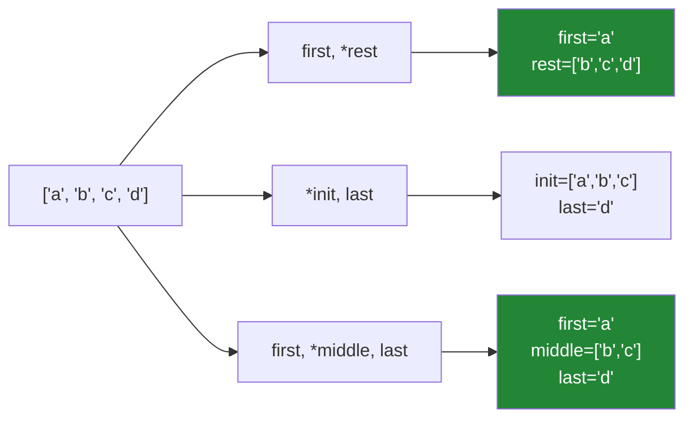

# 1.4 — Unpacking, `*rest`, and the swap

## One-line answer

Assignment can have a **shape** on its left-hand side — `a, b = pair` binds two names in one statement
— and `*rest` absorbs however many elements are left over, which turns "the first field and everything
else" from an index calculation into a line that says what it means.

---

## The story

A CSV parser, written against a file with three columns.

```text
for line in handle:
    doi, title, year = line.rstrip("\n").split(",")
```

Six months of clean runs. Then the upstream team adds a fourth column — a citation count — and the
job dies on the first row: `ValueError: too many values to unpack (expected 3)`.

The on-call engineer's fix is `parts = line.split(","); doi, title, year = parts[0], parts[1],
parts[2]`. It works. It also **silently ignores** the new column, which is fine, and silently ignores
a *fifth* column, and a *sixth*, and — the part that matters — silently accepts a line with only two
fields by raising an `IndexError` three lines later in a completely different place.

The version that says what it means is `doi, title, year, *extra = line.split(",")`. It takes the three
fields it needs, collects anything beyond them into `extra`, and still raises immediately on a line
with fewer than three — which is the behaviour that made the original version correct in the first
place.

**Unpacking is not a shorthand for indexing.** It is a declaration of the shape you expect, and the
`ValueError` is that declaration being enforced.

---

## The idea in plain language

### The left-hand side has a shape

`a, b = value` requires `value` to be iterable and to yield **exactly two** items. Python walks the
iterable and binds each item to the corresponding name.

The shape can nest, matching the shape of the data:

```text
(a, b), c = (1, 2), 3
for index, (name, score) in enumerate(pairs): ...
```

And it works on **any iterable**, not just tuples: lists, strings, generators, `dict.items()`. `a, b =
"xy"` binds `a` to `"x"` and `b` to `"y"`.

Two failures, both loud, both useful:

- Too few items → `ValueError: not enough values to unpack (expected 3, got 2)`
- Too many → `ValueError: too many values to unpack (expected 3)`

**Both messages name the expected count**, which is usually enough to find the problem.

### `*rest` absorbs the remainder

A single starred name in the target list collects everything the other names do not take, **always as
a list**:

```text
first, *rest = [1, 2, 3, 4]        # first=1, rest=[2, 3, 4]
*init, last = [1, 2, 3, 4]         # init=[1, 2, 3], last=4
first, *middle, last = [1, 2, 3, 4] # first=1, middle=[2, 3], last=4
first, *rest = [1]                 # first=1, rest=[]   <- empty, not an error
```

Three rules: at most **one** star; it may appear anywhere in the target list; and it can absorb **zero**
items, so `first, *rest = [1]` succeeds with an empty `rest`. That last one is what makes the pattern
safe for variable-length data — the minimum is the number of *unstarred* names.

Note `rest` is a `list` even when the source was a tuple. If you need a tuple, convert it.



### The swap, and why it works

```text
a, b = b, a
```

The right-hand side is evaluated **first and completely**, building a tuple of the current values;
then the targets are bound. So no temporary variable is needed and there is no order-of-assignment
hazard.

The same rule explains a subtler case: in `a, b = b, a + b` (the Fibonacci step), both right-hand
expressions use the **old** values, because the whole right side is computed before any binding
happens.

Targets, by contrast, are bound **left to right**, which is why `x, x = 1, 2` leaves `x` as `2` and why
`d["k"], d["j"] = 1, 2` assigns in that order.

### `_` and `*_` for the parts you do not want

`_` is an ordinary name used by convention for "I must bind this and will not use it":

```text
_, title, _ = row
name, *_ = parts
```

It is not syntax — it really does bind — so `*_` on a huge iterable builds a huge list you then discard.
For a large sequence, slice or use `itertools.islice` instead.

### The other star: in calls and literals

The same symbol appears in two related places, and it helps to see them as one idea — *spread this
sequence out*:

- **In a call:** `f(*args)` passes each element as a separate argument. `zip(*rows)` transposes
  ([Day 6, 1.3](../../../day-06-loops/parts/01-iteration/1.3-enumerate-and-zip.md)).
- **In a literal:** `[*a, *b]` and `(*a, x)` build a new sequence from several; `{**d1, **d2}` does the
  same for dicts ([2.6](../02-sets-and-dicts/2.6-merging-dicts.md)).

`**` is the mapping version: `f(**kwargs)` spreads a dict into keyword arguments.

---

## Why Setu needs it

- **[1.5](1.5-sort-sorted-and-key.md), next,** unpacks `(score, title)` pairs in sort keys and lambdas.
- **[2.5](../02-sets-and-dicts/2.5-view-objects-are-windows.md), today,** iterates `dict.items()` as
  `for key, value in ...`, which is unpacking every pass.
- **[Day 6, 1.3](../../../day-06-loops/parts/01-iteration/1.3-enumerate-and-zip.md)** already used
  `for i, (name, score) in enumerate(pairs)` — nested unpacking in a loop header — and this is where
  the rule behind it lives.
- **Day 10's functions** (`PY-10`) is `*args` and `**kwargs`, which is this same star in the
  *parameter* position rather than the argument position.
- **Day 12's `Paper`** (`PY-13`) and Day 19's dataclasses (`PY-23`) replace positional unpacking with
  attribute access, and knowing when to make that jump is
  [1.3](1.3-a-tuple-is-a-record.md)'s "past three fields, name them".
- **Day 20's NumPy** (`NP-01`) unpacks shapes — `rows, cols = arr.shape` — constantly.

---

## The mechanism

The shape on the left, and the errors that enforce it:

```python
"""Unpacking declares a shape. The ValueError is that declaration being checked."""

rows = [
    "10.1000/xyz,Attention Is All You Need,2017",
    "10.1000/abc,BERT,2018,98342",
    "10.1000/def,Short",
]

print("fixed shape - correct until the format changes:")
for row in rows:
    try:
        doi, title, year = row.split(",")
        print(f"    ok   {doi:<14} {title:<26} {year}")
    except ValueError as exc:
        print(f"    FAIL {row[:20]!r:<22} {exc}")

print()
print("with *extra - tolerant of MORE, still strict about FEWER:")
for row in rows:
    try:
        doi, title, year, *extra = row.split(",")
        print(f"    ok   {doi:<14} {title:<26} {year:<6} extra={extra}")
    except ValueError as exc:
        print(f"    FAIL {row[:20]!r:<22} {exc}")
```

**Line by line:**

- `doi, title, year = row.split(",")` — the shape declaration. Row 2 has four fields and raises
  `too many values to unpack (expected 3)`; row 3 has two and raises `not enough values to unpack
  (expected 3, got 2)`. **Both messages name the counts.**
- `doi, title, year, *extra = ...` — three required, the rest collected. Row 1 gives `extra=[]`, row 2
  gives `extra=['98342']`, and row 3 **still fails** — which is the point. The starred form relaxes the
  upper bound and keeps the lower one.
- The `try` around each is a display device so the loop continues; in real code a malformed row would
  be counted and skipped
  ([Day 6, 2.2](../../../day-06-loops/parts/02-control-flow/2.2-continue-and-the-skipped-increment.md)'s
  guard-and-count shape).
- **Note what the indexing "fix" would do here**: `parts[0], parts[1], parts[2]` accepts row 2 silently
  and fails on row 3 with an `IndexError` — a different exception type, raised at a different line,
  saying nothing about the expected shape.

Star placement, the swap, and evaluation order:

```python
"""One star, anywhere, absorbing zero or more. And the right side is evaluated first."""

data = ["a", "b", "c", "d"]

first, *rest = data
print(f"first, *rest       -> first={first!r} rest={rest}")

*init, last = data
print(f"*init, last        -> init={init} last={last!r}")

first, *middle, last = data
print(f"first, *middle, last -> {first!r} {middle} {last!r}")

only, *nothing = ["solo"]
print(f"absorbs zero       -> only={only!r} nothing={nothing}")

head, *tail = (1, 2, 3)
print(f"rest is a LIST even from a tuple: {tail!r} ({type(tail).__name__})")


def collects(first, *others):
    """A starred PARAMETER collects into a tuple, not a list."""
    return type(others).__name__


print(f"but a starred parameter collects a: {collects(1, 2, 3)}")

print()
a, b = 1, 2
a, b = b, a
print(f"the swap           -> a={a} b={b}")

x, y = 0, 1
for _ in range(5):
    x, y = y, x + y
print(f"fibonacci step     -> x={x} y={y}  (both used the OLD values each pass)")

print()
values = [1, 2]
i = 0
i, values[i] = 1, 99
print(f"targets bind LEFT TO RIGHT -> i={i} values={values}")
```

**Line by line:**

- `*init, last = data` — the star may lead. `init` is `['a','b','c']`, `last` is `'d'`. This is the
  clean way to say "everything but the last".
- `only, *nothing = ["solo"]` — `nothing` is `[]`. **A starred name can absorb zero items**, so the
  minimum length is the count of unstarred names.
- `head, *tail = (1, 2, 3)` gives a **list**, even though the source was a tuple — and
  `def collects(first, *others)` gives a **tuple**. Two similar-looking stars, two different result
  types, and it catches people. If you need a tuple from an unpack, convert it: `tuple(tail)`.
- `a, b = b, a` — the right side builds `(2, 1)` first, then binds. **No temporary, no order hazard.**
- `x, y = y, x + y` — both expressions on the right use the pre-assignment values, which is what makes
  the Fibonacci step correct as one line. Splitting it into two statements would break it.
- `i, values[i] = 1, 99` — targets bind **left to right**, so `i` becomes `1` *before* `values[i]` is
  evaluated, and the assignment lands on `values[1]`. This is a genuine gotcha and a reason not to mix
  a name and a subscript of something it indexes in one target list.

Nested shapes, and the other star:

```python
"""The target's shape mirrors the data's shape. And * spreads in calls and literals."""

pairs = [("attention", 0.98), ("bert", 0.94)]

for rank, (name, score) in enumerate(pairs, start=1):
    print(f"    {rank}. {name:<12} {score}")

(a, b), c = (1, 2), 3
print(f"nested target      -> a={a} b={b} c={c}")

head, *_ = "abcdef"
print(f"works on a string  -> head={head!r}")

config = {"host": "localhost", "port": 8080}
for key, value in config.items():
    print(f"    dict item        -> {key}={value}")

print()
print("the same star, spreading rather than collecting:")
front, back = [1, 2], [3, 4]
print(f"    [*front, *back]  = {[*front, *back]}")
print(f"    (*front, 99)     = {(*front, 99)}")
print(f"    max(*front, *back) = {max(*front, *back)}")

rows = [(1, "a"), (2, "b"), (3, "c")]
ids, letters = zip(*rows, strict=True)
print(f"    zip(*rows) transposes -> {ids} {letters}")
```

**Line by line:**

- `for rank, (name, score) in enumerate(pairs, start=1)` — `enumerate` yields `(1, ("attention", 0.98))`
  and the target's parentheses unpack the inner tuple. **The target's shape mirrors the data's shape**,
  which is the rule for reading any unpacking however deep.
- `(a, b), c = (1, 2), 3` — nesting on both sides. Rarely needed and worth recognising.
- `head, *_ = "abcdef"` — strings are iterables, so this works, and `*_` builds a five-element list you
  discard. On a long string that is real waste; `head = text[0]` is the right form there.
- `for key, value in config.items()` — the most common unpacking in Python, once per loop pass
  ([2.5](../02-sets-and-dicts/2.5-view-objects-are-windows.md)).
- `[*front, *back]` — the star **spreading** rather than collecting. Same symbol, opposite direction:
  in a target it absorbs, in a literal or a call it expands.
- `zip(*rows, strict=True)` — the transpose from
  [Day 6, 1.3](../../../day-06-loops/parts/01-iteration/1.3-enumerate-and-zip.md), with `strict` because
  a ragged input should raise rather than truncate.
- `ids, letters = zip(...)` — and the result is unpacked, so the transpose and the naming happen in one
  line. This is a genuinely useful idiom and completely opaque the first time you meet it.

---

## When it breaks

**The two counts, named:**

```text
>>> a, b, c = [1, 2]
Traceback (most recent call last):
  File "<stdin>", line 1, in <module>
ValueError: not enough values to unpack (expected 3, got 2)
>>> a, b = [1, 2, 3]
Traceback (most recent call last):
  File "<stdin>", line 1, in <module>
ValueError: too many values to unpack (expected 3)
```

**What it means.** The data's shape does not match the declared shape. Note the first message gives
both counts and the second gives only the expectation — because with too many, Python stops as soon as
it knows and does not count the rest, which matters when the source is an infinite generator.

**Two stars:**

```text
>>> a, *b, *c = [1, 2, 3]
  File "<stdin>", line 1
    a, *b, *c = [1, 2, 3]
    ^^^^^^^^^
SyntaxError: multiple starred expressions in assignment
```

**What it means.** With two stars there is no unique way to divide the remainder, so the grammar
forbids it. This is a compile-time error, which is the best kind.

**Unpacking a non-iterable:**

```text
>>> a, b = 5
Traceback (most recent call last):
  File "<stdin>", line 1, in <module>
TypeError: cannot unpack non-iterable int object
>>> a, b = None
Traceback (most recent call last):
  File "<stdin>", line 1, in <module>
TypeError: cannot unpack non-iterable NoneType object
```

**What it means.** The second is the common one in real code: a function that returns a pair on the
happy path and `None` on failure, unpacked without checking. The fix is a guard —
`result = find(...); if result is None: ...` — which is
[Day 6, 2.1](../../../day-06-loops/parts/02-control-flow/2.1-break-and-which-loop-it-leaves.md)'s
extracted-search shape.

**The generator that gets consumed by the attempt:**

```text
>>> gen = (i for i in range(5))
>>> a, b = gen
Traceback (most recent call last):
  File "<stdin>", line 1, in <module>
ValueError: too many values to unpack (expected 2)
>>> list(gen)
[3, 4]
```

**What it means.** Unpacking pulled three items (two to bind, one to discover there was a third) before
raising, and those items are **gone**
([Day 6, 1.1](../../../day-06-loops/parts/01-iteration/1.1-what-a-for-loop-actually-does.md)). So a
failed unpack of a stream leaves the stream partially drained, and a retry sees different data. With a
list this cannot happen; with an iterator it silently can.

**And the target-order surprise:**

```text
>>> i = 0
>>> values = [10, 20]
>>> i, values[i] = 1, 99
>>> i, values
(1, [10, 99])
```

**What it means.** `i` was bound to `1` first, so `values[i]` resolved to `values[1]`. Most people
predict `values[0]`. The rule — right side fully evaluated, then targets bound left to right — explains
it, and the practical advice is simply not to write a target list where one target indexes into
something another target changes.

---

## In production

**Unpacking is a shape assertion, and that is its main value.** `doi, title, year = row` documents the
expected arity and enforces it at the point of use, which is why the `ValueError` from a changed
upstream format is a *good* outcome — it fires on the first bad row with a message naming the counts.
Replacing it with indexing to "make it robust" removes the assertion and moves the failure somewhere
less informative. When the format genuinely may grow, `*extra` is the way to say "at least three,
and I know there may be more" — which is a different and weaker assertion, made explicitly.

**Name what you keep and be honest about what you discard.** `_` is a convention and not a void: it
binds, and `*_` on a large iterable materialises a list you immediately throw away. For a big sequence,
`first = next(iterator)` or a slice is the right tool. In code others will read, a descriptive name for
an ignored value (`_unused_checksum`) beats a bare `_` when there are several, because two `_`s in one
target list quietly overwrite each other.

**Past three fields, stop unpacking positionally.** A five-element unpack is the same maintenance
liability as `row[4]`: it breaks silently when a column is inserted in the middle, because the arity is
unchanged and only the meanings shift. Named access — `NamedTuple`, a dataclass, or a dict keyed by
column name — makes an inserted column a visible change rather than a data-corruption event. This is
the same threshold [1.3](1.3-a-tuple-is-a-record.md) set for tuples generally, and it is the single
most common review comment on parsing code.

**What changes at scale.** Unpacking is cheap — the interpreter has dedicated opcodes for the common
two- and three-element cases — and it is faster than repeated indexing because it walks the sequence
once. `*rest`, however, **allocates a list**, so `first, *rest = huge` copies almost the whole sequence;
in a loop over many rows that allocation is the cost, and slicing (`huge[1:]`, which also copies) or an
iterator (`it = iter(huge); first = next(it)`, which does not) are the alternatives. For streams
specifically, `itertools.islice` is the tool that takes a prefix without draining or materialising the
rest.

**The review comment a senior engineer leaves.** On `doi, title, year = parts[0], parts[1], parts[2]`:
*"Go back to unpacking — `doi, title, year, *extra = line.split(',')`. The indexed version silently
accepts a short row and then fails three lines later with an `IndexError` that says nothing about the
format. And since this file has grown a column once already, log `extra` when it is non-empty so we
find out the next time."*

**The interview question.** *"What does `a, *b = [1, 2, 3]` do?"* The answer is that `a` is bound to `1`
and `b` to the list `[2, 3]` — a starred target absorbs the remaining items, always as a list, and may
absorb zero. The follow-up worth being ready for is *"why would you use it?"* — to say "the first field
and everything else" without index arithmetic, and to tolerate a growing format while still enforcing a
minimum arity. Strong answers add that `a, b = b, a` works because the right-hand side is fully
evaluated into a tuple before any target is bound, that targets themselves bind left to right, and that
unpacking a generator that turns out to be the wrong length leaves it partially consumed.

---

## Check yourself

```bash
uv run python -c "
data = ['a', 'b', 'c', 'd']
first, *rest = data; print('first,*rest      ->', first, rest)
*init, last = data; print('*init,last       ->', init, last)
f, *m, l = data;    print('f,*m,l           ->', f, m, l)
only, *none = ['x']; print('absorbs zero     ->', only, none)
a, b = 1, 2; a, b = b, a; print('swap             ->', a, b)
i = 0; v = [10, 20]; i, v[i] = 1, 99; print('target order     ->', i, v)
for bad in ([1, 2], [1, 2, 3, 4]):
    try:
        x, y, z = bad
    except ValueError as exc:
        print(f'{bad} -> {exc}')
g = (n for n in range(5))
try:
    p, q = g
except ValueError as exc:
    print('generator        ->', exc, '| left:', list(g))
"
```

The target-order line and the generator line are the two people predict wrongly.

**Answer out loud, without scrolling up:**

> Say what `*rest` collects, what type it is, and what the minimum length of the source must be. Then
> explain why `a, b = b, a` needs no temporary variable, in terms of evaluation order.

---

**Next:** [1.5 — `sort` versus `sorted`, `key=`, and stability](1.5-sort-sorted-and-key.md)
