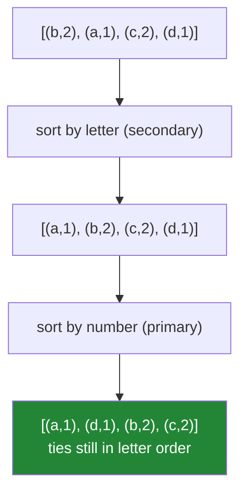

# 1.5 — `sort` versus `sorted`, `key=`, and stability

> **The source.** Python's sort has a name and a written design. It is timsort, and the design note
> is in CPython's own source tree as `Objects/listsort.txt` (2002),
> <https://github.com/python/cpython/blob/main/Objects/listsort.txt>. Two things in this document —
> that the sort is stable, and that an almost-sorted list costs almost nothing — are promises made
> there, not accidents of the implementation.

## One-line answer

`list.sort()` mutates and returns `None`, `sorted()` returns a new list, `key=` computes a value once
per element rather than comparing pairs — and because Python's sort is **stable**, sorting twice by
different keys is a legitimate way to get a multi-key ordering.

---

## The story

Two runners cross the finish line with exactly the same time.

Who stands on the higher step of the podium? If nobody decided that in advance, the answer is
whichever one the person writing out the results happened to write first. Next week a different
person writes out the results and the two runners swap places, and both lists are equally "correct",
and everybody argues.

The fix at every real sports event is the same: **decide the tie-break before the race.** Not because
ties are common, but because the alternative is an answer that changes depending on who is holding
the pen.

Here is a leaderboard with no tie-break:

```text
papers = papers.sort(key=lambda p: -p["score"])
```

`papers` is now nothing at all, and the next line raises
`TypeError: 'NoneType' object is not iterable` — which is at least loud.

Fixed to `papers.sort(key=lambda p: -p["score"])`, and the leaderboard works — until a batch arrives
where two records share a score, and the tie falls differently on every run. The report is no longer
repeatable: two runs over the same data produce different orderings, and comparing yesterday's output
with today's is pure noise.

The team's theory is that Python's sort is unreliable. It is not. It is famously *stable*, which
means it leaves equal items in the order it found them. The randomness came from **upstream**: the
records arrive out of a set, and set order depends on hash values and insertion history
([2.1](../02-sets-and-dicts/2.1-a-set-is-a-hash-table.md)). The sort faithfully preserved the input
order among equals, and the input order was arbitrary.

The fix is a sort key with a tie-break in it: `key=lambda p: (-p["score"], p["title"])`. Equal scores
are settled by title, which never changes, and the report becomes comparable day to day.

Three bugs — a `None`, a tie that moves, and a wrong diagnosis of stability — and all three are in
this document.

---

## The idea in plain language

### Two functions, one algorithm

| | `list.sort()` | `sorted(iterable)` |
|---|---|---|
| Works on | a list, in place | **any iterable** |
| Returns | `None` | a **new list** |
| Memory | no copy | a copy |

The `None` return is deliberate. The standard library uses it as a signal throughout: **a method that
mutates returns `None`**, so `x = y.sort()` is visibly wrong the moment you use `x`
([Day 4, 2.2](../../../day-04-objects/parts/02-containers/2.2-what-in-place-means.md)). The pairing —
`sort`/`sorted`, `reverse`/`reversed` — is a convention worth copying in your own code.

Reach for `sorted` by default: it works on generators, sets and dict views, and it does not surprise a
caller by reordering their data
([Day 4, 1.2](../../../day-04-objects/parts/01-objects/1.2-names-are-labels.md)). Reach for `sort` when
the list is yours and large enough that the copy matters.

### `key=` is computed once per element, not per comparison

`key` is a function called **once for each element**, before sorting. The resulting values are what get
compared. For `n` elements that is `n` calls, against roughly `n log n` comparisons — so an expensive
key is far cheaper as a `key` than as a comparator.

This pattern has a name — the decorate-sort-undecorate idiom — and `key=` is Python's built-in version
of it. It also means the key function must be **pure**: it is called once, its result cached, so a key
that depends on mutable state produces an ordering computed from whatever the state was at that moment.

`cmp=` (a pairwise comparator) was removed in Python 3. If you genuinely need one — rare —
`functools.cmp_to_key` wraps it, at a real cost.

### Multi-key sorting: a tuple key

Tuples compare lexicographically
([Day 5, 1.3](../../../day-05-operators-and-conditionals/parts/01-operators/1.3-comparison-and-chaining.md)),
so a tuple key gives you a multi-key sort for free:

```text
key=lambda p: (-p["score"], p["title"])
```

Score descending (via negation), then title ascending. **No comparator required.**

Negation only works for numbers. For "descending by a string, then ascending by a number" the tuple
trick fails, and that is where stability earns its keep.

### Stability, and the two-pass sort

Python's sort is **stable**: elements that compare equal keep their original relative order. That
guarantee is documented and depended upon.

It gives you the two-pass technique: **sort by the secondary key first, then by the primary key.** The
second sort preserves the first's ordering among ties.

```text
papers.sort(key=lambda p: p["title"])                 # secondary, ascending
papers.sort(key=lambda p: p["score"], reverse=True)   # primary, descending
```

That handles mixed directions across types, which a single tuple key cannot. It is two passes, so it is
slower — use the tuple key when you can and the two-pass when you must.



### `reverse=True` is not the same as negating

`reverse=True` reverses the *ordering*, and — crucially — **stability is preserved**: equal elements
keep their original relative order, not the reverse of it. Negating a numeric key also flips ties'
relative order in some intuitions but in fact does not, because the tie is still a tie. The practical
difference is that `reverse=True` works for any type, including strings, while negation only works for
numbers.

With a tuple key you often need both: `(-score, title)` sorts score descending and title ascending,
which `reverse=True` alone cannot express because it would reverse both.

### The key must be **total**

Every element must produce a comparable key. One `None` among numbers raises
([Day 5, 1.3](../../../day-05-operators-and-conditionals/parts/01-operators/1.3-comparison-and-chaining.md)),
and it raises near the *end* of a job, after all the expensive work. `key=lambda p: (p["score"] is
None, p["score"] or 0)` puts missing values last, deterministically — because `False < True`.

---

## Why Setu needs it

- **[3.2](../03-dedup/3.2-order-preserving-dedup.md), today,** preserves first-seen order, which is a
  different guarantee from sorting and is often what you actually want.
- **[2.3](../02-sets-and-dicts/2.3-a-dict-is-ordered-now.md), today,** explains why dict order is
  insertion order and set order is not — the story's real cause.
- **Day 30's pandas** (`PD-`) has `sort_values(by=[...])` with the same multi-key semantics and the same
  stability question (`kind="stable"` versus the default), and a `NaN` behaves like the `None` above.
- **Day 36's charts** (`VIZ-`) order bars and legends; a non-deterministic order makes two runs of the
  same notebook produce visibly different figures, which is a reproducibility failure (Principle 4).
- **Day 162's retrieval** (`RAG-`) ranks documents by cosine similarity and takes the top `k`. Ties are
  common with quantised scores, and an unstable tie-break changes which documents reach the model —
  which changes the answer.

---

## The mechanism

The `None` return, and the sort/sorted pairing:

```python
"""A mutating method returns None. That is a convention, not an oversight."""

papers = [
    {"title": "BERT", "score": 0.94},
    {"title": "Attention", "score": 0.98},
    {"title": "ResNet", "score": 0.94},
]

result = papers.sort(key=lambda p: p["score"])
print(f"papers.sort(...) returned : {result!r}   <- the story's first bug")
print(f"papers is now sorted      : {[p['title'] for p in papers]}")

fresh = [
    {"title": "BERT", "score": 0.94},
    {"title": "Attention", "score": 0.98},
]
ordered = sorted(fresh, key=lambda p: p["score"])
print(f"sorted(...) returned      : {[p['title'] for p in ordered]}")
print(f"the original is untouched : {[p['title'] for p in fresh]}")

print()
print("sorted works on any iterable; sort only on a list:")
print("    from a set  :", sorted({3, 1, 2}))
print("    from a dict :", sorted({"b": 1, "a": 2}))
print("    from a gen  :", sorted(x * 2 for x in range(3)))
try:
    {3, 1, 2}.sort()
except AttributeError as exc:
    print(f"    set.sort()  : AttributeError: {exc}")
```

**Line by line:**

- `result = papers.sort(...)` — `None`. The list is sorted; the *return value* is not the list. Ruff and
  most type checkers flag assigning from a known `None`-returning method, and the convention is
  consistent across the standard library.
- `sorted(fresh, ...)` returns a new list and leaves `fresh` alone — which is why it is the safer
  default at a function boundary
  ([Day 4, 1.2](../../../day-04-objects/parts/01-objects/1.2-names-are-labels.md)).
- `sorted({3, 1, 2})` and `sorted({"b": 1, "a": 2})` — any iterable. Sorting a dict yields its **keys**,
  which is occasionally surprising and usually what you meant.
- `{3, 1, 2}.sort()` raises `AttributeError` — a set has no order to rearrange, so there is no method.
  The error is the language telling you the structure choice and the operation disagree.

`key=`, tuple keys, and the call count:

```python
"""key is called once per element. Tuple keys give multi-key ordering for free."""

papers = [
    {"title": "ResNet", "score": 0.94, "year": 2015},
    {"title": "BERT", "score": 0.94, "year": 2018},
    {"title": "Attention", "score": 0.98, "year": 2017},
    {"title": "AlexNet", "score": 0.94, "year": 2012},
]

calls = 0


def score_key(paper: dict) -> float:
    global calls
    calls += 1
    return paper["score"]


sorted(papers, key=score_key)
print(f"{len(papers)} elements -> key called {calls} times (once each, not per comparison)")

print()
print("single key, descending:")
for p in sorted(papers, key=lambda p: p["score"], reverse=True):
    print(f"    {p['score']}  {p['title']}")

print()
print("tuple key: score DESC, then title ASC:")
for p in sorted(papers, key=lambda p: (-p["score"], p["title"])):
    print(f"    {p['score']}  {p['title']}")

print()
print("itemgetter is the fast, readable alternative for plain field access:")
from operator import itemgetter

for p in sorted(papers, key=itemgetter("score", "title")):
    print(f"    {p['score']}  {p['title']}")
```

**Line by line:**

- `calls` counts **4** for four elements. With a pairwise comparator it would be closer to
  `n log n`. **This is why an expensive key — a database lookup, a normalisation
  ([Day 7, 4.1](../../../day-07-strings/parts/04-normalising/4.1-the-title-normaliser.md)) — belongs in
  `key=` and not in a comparator.**
- `global calls` — needed to rebind a module-level name from inside a function
  ([Day 4, 1.2](../../../day-04-objects/parts/01-objects/1.2-names-are-labels.md); scope is Day 10,
  `PY-10`). A list with `append` would avoid the keyword; the counter is clearer here.
- `key=lambda p: (-p["score"], p["title"])` — the tuple key. Negating the score gives descending;
  the title stays ascending. **`reverse=True` could not express this**, because it would reverse both.
- `itemgetter("score", "title")` — from `operator`, returning a tuple of those fields. It is implemented
  in C, so it is measurably faster than an equivalent lambda, and it reads as a field list. Use it when
  the key is plain field access and a lambda when there is any computation.
- The `from operator import itemgetter` mid-file is for readability of the example; real code puts it at
  the top and ruff's `E402` enforces that.

Stability, and the two-pass sort:

```python
"""Stable means equal elements keep their input order. That is what makes two passes work."""

rows = [
    ("delta", 2),
    ("alpha", 1),
    ("charlie", 2),
    ("bravo", 1),
]

print("input order          :", [name for name, _ in rows])

by_number = sorted(rows, key=lambda r: r[1])
print("sorted by number only:", [name for name, _ in by_number])
print("    -> ties (delta, charlie) kept their INPUT order, and (alpha, bravo) theirs")

two_pass = sorted(rows, key=lambda r: r[0])
two_pass = sorted(two_pass, key=lambda r: r[1])
print("two-pass (name then number):", [name for name, _ in two_pass])

tuple_key = sorted(rows, key=lambda r: (r[1], r[0]))
print("single tuple key           :", [name for name, _ in tuple_key])
print("    identical:", two_pass == tuple_key)

print()
print("where the two-pass wins: mixed directions across types")
mixed = sorted(rows, key=lambda r: r[0])
mixed = sorted(mixed, key=lambda r: r[1], reverse=True)
print("    number DESC, name ASC:", [name for name, _ in mixed])
print("    a single tuple key cannot express this without negating a string")
```

**Line by line:**

- `sorted(rows, key=lambda r: r[1])` — sorting by number alone leaves `delta` before `charlie`, because
  that was their input order and they tie. **That is the stability guarantee**, and it is what the
  story's team mistakenly blamed.
- The two-pass version sorts by name first, then by number. The number sort preserves the name ordering
  among ties, giving `alpha, bravo, charlie, delta` grouped by number.
- `key=lambda r: (r[1], r[0])` — the same result in one pass. **Prefer this**: one sort instead of two,
  and the intent is in one expression.
- The final block sorts by number **descending** and name **ascending**. A tuple key would need
  `(-r[1], r[0])`, which works here because the number is numeric — but if the primary key were a
  *string* to be reversed, there is no negation, and the two-pass with `reverse=True` is the only
  clean option.
- `two_pass == tuple_key` is `True`, which is the assertion worth keeping in a test when you replace one
  with the other.

---

## When it breaks

**The `None`:**

```text
>>> papers = [3, 1, 2]
>>> papers = papers.sort()
>>> papers
>>> for p in papers:
...     pass
...
Traceback (most recent call last):
  File "<stdin>", line 1, in <module>
TypeError: 'NoneType' object is not iterable
```

**What it means.** `sort` returned `None` and the assignment discarded the sorted list. The REPL prints
nothing for `None`, which makes the middle line look like nothing happened. The error arrives at the
*next* use, which is the usual pattern for this bug: loud, but one step removed from its cause.

**The key that is not total:**

```text
>>> rows = [{"s": 3}, {"s": None}, {"s": 1}]
>>> sorted(rows, key=lambda r: r["s"])
Traceback (most recent call last):
  File "<stdin>", line 1, in <module>
TypeError: '<' not supported between instances of 'NoneType' and 'int'
>>> sorted(rows, key=lambda r: (r["s"] is None, r["s"] or 0))
[{'s': 1}, {'s': 3}, {'s': None}]
```

**What it means.** One missing value poisons the whole sort, and it raises after the sort has begun —
so in a pipeline it fires at the end, after the expensive work. The fix is a key that gives `None` an
explicit position: `False < True`, so the `is None` flag sorts missing values last. **Do not "fix" it
by converting `None` to `0`** — that changes the data to make an error go away.

**Sorting mixed types, which raises for the same reason:**

```text
>>> sorted([3, "1", 2])
Traceback (most recent call last):
  File "<stdin>", line 1, in <module>
TypeError: '<' not supported between instances of 'str' and 'int'
>>> sorted(["10", "9", "100"])
['10', '100', '9']
```

**What it means.** The first raises, which is the good outcome. The second does **not** — all three are
strings, so they sort by code point and `"10"` comes before `"9"`
([Day 5, 1.3](../../../day-05-operators-and-conditionals/parts/01-operators/1.3-comparison-and-chaining.md)).
A column of numbers read from a CSV and never converted sorts like this, silently, and the report just
looks wrong.

**The key with a side effect:**

```text
>>> counter = {"n": 0}
>>> def keyfn(x):
...     counter["n"] += 1
...     return x % 3
...
>>> sorted([5, 3, 1, 4], key=keyfn)
[3, 1, 4, 5]
>>> counter
{'n': 4}
```

**What it means.** Four calls for four elements — which is the useful half. The dangerous half is a key
that *depends* on mutable state: it is evaluated once, at the start, so the ordering reflects the state
at that instant, and a reader expecting it to track later changes is wrong. **Key functions must be
pure**, and one that reads a shared cache another thread is writing can produce an ordering that
violates transitivity, which CPython's sort will not detect.

**And the non-deterministic tie, which does not raise at all:**

```text
$ python report.py | head -3
0.94  ResNet
0.94  BERT
0.94  AlexNet
$ python report.py | head -3
0.94  BERT
0.94  AlexNet
0.94  ResNet
```

**What it means.** Same data, same code, different output. The sort is stable and faithfully preserved
the input order — and the input came from a set, whose iteration order depends on hashes and insertion
history ([2.1](../02-sets-and-dicts/2.1-a-set-is-a-hash-table.md)); with `PYTHONHASHSEED`
randomisation, string hashes differ between processes. **The sort is not the bug; the incomplete key
is.** Adding a tie-breaker makes the output diffable.

---

## In production

**Every sort that feeds a report, a file, or an API response needs a total key.** "Total" means every
element produces a comparable value and no two distinct elements tie — add a unique field (an id, a
title) as the last element of the tuple key. Without it, output is non-deterministic whenever the input
order is, which makes diffs useless, breaks caching and content hashing, and turns a golden-file test
into a flaky one. This is Principle 4's reproducibility applied to ordering, and it is one of the
cheapest guarantees to add.

**Prefer `sorted` at boundaries and `sort` inside.** A function that sorts its argument in place has
mutated its caller's data, which is a contract most callers do not expect
([1.2](1.2-slicing-and-the-copy-you-missed.md)). Returning a new list costs a copy and removes the
question. Inside a function, on a list you built, `sort` avoids the copy and is the right choice when
the list is large.

**Put expensive work in the key, and consider precomputing it.** Because `key=` runs once per element,
a normalisation or a lookup there costs `n` rather than `n log n` operations. When the same collection
is sorted repeatedly, go further: compute the key once, store it alongside the data, and sort on the
stored field. That is the same "build the index once" move as
[Day 6, 4.1](../../../day-06-loops/parts/04-loop-cost/4.1-the-accidental-quadratic.md), and it is what a
database does when you add an index.

**What changes at scale.** CPython's sort is Timsort: `O(n log n)` worst case, `O(n)` on data that is
already sorted or nearly so — which is a genuine advantage on real data, where inputs are often
partially ordered. It is not in-place in the memory sense: it allocates temporary space, so `sort` is
not free of allocation either. Above the point where the data does not fit in memory, sorting stops
being a library call and becomes an external merge sort — which is what a database does, and why
`ORDER BY` on a huge table is expensive and `ORDER BY` on an indexed column is not. If you only need
the top `k`, `heapq.nlargest(k, items, key=...)` is `O(n log k)` and much cheaper than sorting
everything — the right tool for a leaderboard.

**Under concurrency, sort on a snapshot.** `sorted(list(shared))` takes a stable copy
([1.2](1.2-slicing-and-the-copy-you-missed.md)); sorting the shared list directly while another thread
appends can raise or produce a partially-ordered result. And a key function that reads shared mutable
state can violate the ordering's consistency mid-sort, which produces a wrong order with no error at
all.

**The review comment a senior engineer leaves.** On `papers.sort(key=lambda p: -p["score"])`: *"Add a
tie-break — `key=lambda p: (-p['score'], p['title'])`. Scores tie often and the input comes from a set,
so the report ordering is currently non-deterministic and yesterday's diff is unreadable. Also use
`sorted()` here and return a new list; this function is mutating the caller's data."*

**The interview question.** *"What is the difference between `sort` and `sorted`?"* The answer is that
`list.sort()` sorts in place and returns `None` while `sorted()` accepts any iterable and returns a new
list. The follow-up that finds real experience is *"how do you sort by two fields?"* — a tuple key,
because tuples compare lexicographically, with negation for a descending numeric field — and the
sharper version is *"what if the two fields need different directions and one is a string?"*, where the
answer is the two-pass sort, which works because Python's sort is stable. Strong candidates add that
`key=` is called once per element rather than per comparison so expensive keys are cheap, that a key
must be total or a single `None` raises at the end of a long job, and that a sort feeding a report needs
a unique tie-breaker or the output is non-deterministic.

---

## Check yourself

```bash
uv run python -c "
rows = [('delta', 2), ('alpha', 1), ('charlie', 2), ('bravo', 1)]
print('input      :', [n for n, _ in rows])
print('by number  :', [n for n, _ in sorted(rows, key=lambda r: r[1])], '<- ties kept input order')
tp = sorted(sorted(rows, key=lambda r: r[0]), key=lambda r: r[1])
tk = sorted(rows, key=lambda r: (r[1], r[0]))
print('two-pass   :', [n for n, _ in tp])
print('tuple key  :', [n for n, _ in tk], '| identical:', tp == tk)
x = [3, 1, 2]
print('sort returns:', repr(x.sort()))
print('sorted(str) :', sorted(['10', '9', '100']), '<- no error, wrong order')
try:
    sorted([{'s': 3}, {'s': None}], key=lambda r: r['s'])
except TypeError as exc:
    print('None in key :', exc)
print('None last   :', sorted([{'s': 3}, {'s': None}, {'s': 1}], key=lambda r: (r['s'] is None, r['s'] or 0)))
"
```

The `sorted(['10','9','100'])` line is the one that does not raise and is still wrong.

**Answer out loud, without scrolling up:**

> Say what `list.sort()` returns and why. Then explain what "stable" means and how it makes a two-pass
> sort work, and give the sort key you would use for "score descending, title ascending".

---

**Next:** [2.1 — A set is a hash table](../02-sets-and-dicts/2.1-a-set-is-a-hash-table.md)
