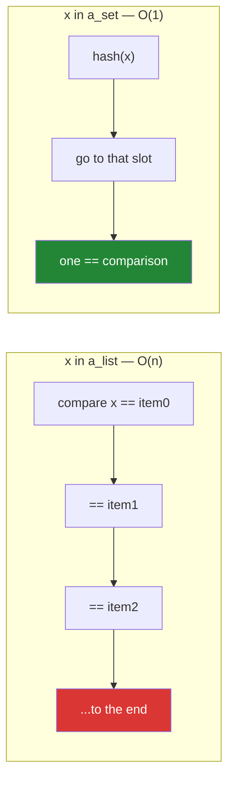

# 2.1 — A set is a hash table

> **The source.** The `O(1)` in this part holds because Python's string hash is a keyed
> cryptographic function — taught in full in
> [PEP 456 and SipHash](../../papers/02-pep-456-and-siphash.md).

## One-line answer

A set stores each element in a slot chosen by a number computed from its value, so membership is one
hash and one comparison regardless of size — which is why `in` is O(1), why elements must be hashable,
and why iteration order is not the order you inserted.

---

## The story

Two facts arrive on the same afternoon.

The first is a fix. A deduplication that took four hours becomes fifty seconds when `seen = []` becomes
`seen = set()`
([Day 6, 4.1](../../../day-06-loops/parts/04-loop-cost/4.1-the-accidental-quadratic.md)). Everybody is
pleased and nobody asks why.

The second is a bug. A report that lists categories now prints them in a different order on every run.
The categories come from a set. Someone assumes sets are sorted — they are not — then assumes they are
in insertion order — they are not that either — and eventually discovers that string hashing is
randomised per process by default, so the same set iterates differently in two runs of the same script.

Both facts come from the same sentence: **a set is a hash table.** Membership is fast because the
element's value tells you where to look. Order is arbitrary because "where to look" is a hash, and a
hash is not a position in a sequence.

You cannot have one without the other. The speed and the disorder are the same property, seen from two
sides.

---

## The idea in plain language

### How a hash table finds something without looking

A **hash** is a number computed from a value: `hash("abc")` is some integer. Two rules make it useful:

1. **Equal values always hash equal.** If `a == b` then `hash(a) == hash(b)`.
2. **Unequal values usually hash differently** — but not always, and that is fine.

A set keeps an array of slots. To store `x`, it computes `hash(x)`, reduces it to a slot index, and puts
`x` there. To ask whether `x` is present, it computes `hash(x)`, goes **straight to that slot**, and
compares what it finds with `==`.

That is the whole trick: the number of comparisons does not grow with the size of the set. One hash,
one or two comparisons, done.



When two different values land in the same slot — a **collision** — the table probes nearby slots until
it finds the value or an empty slot. Collisions are why membership is O(1) *on average* rather than
always, and why a set keeps itself at most about two-thirds full: a crowded table has more collisions
and degrades toward a scan.

### What this forces: hashability

The scheme depends on an element's hash never changing while it is stored. If it changed, the element
would be sitting in the wrong slot and would become unreachable — present, but not findable.

So only **hashable** objects can be set members: those whose value cannot change. Strings, numbers,
tuples of hashables, frozensets, and by default your own class instances
([Day 4, 2.5](../../../day-04-objects/parts/02-containers/2.5-hashability.md)). Lists, dicts and sets
cannot.

`TypeError: unhashable type: 'list'` is not a limitation; it is the guarantee being enforced.

### What this costs: order

The slot is chosen by a hash, so iteration walks the slots and yields elements in an order determined
by hash values, table size, and insertion history. It is **not** sorted, **not** insertion order, and
**not** stable across processes.

That last point catches people. Since Python 3.3, the hashes of `str` and `bytes` are **randomised per
process** by default, as a defence against a denial-of-service attack that deliberately causes
collisions. So a set of strings iterates in a different order in every run — which is the story's
second fact, and which is a *feature*.

You can pin it with the `PYTHONHASHSEED` environment variable for debugging. You should not depend on
it in code: **if you need an order, ask for one** with `sorted()`
([1.5](../01-sequences/1.5-sort-sorted-and-key.md)).

### The three things a set gives you, and the two it does not

Gives: O(1) membership, automatic uniqueness, and set algebra
([2.2](2.2-set-algebra.md)).

Does not: order, and duplicates. Adding an element that is already present is a **no-op** — no error,
no count. If you need counts, that is `collections.Counter`
([2.4](2.4-get-setdefault-and-counter.md)); if you need order as well as uniqueness, that is a dict
([3.2](../03-dedup/3.2-order-preserving-dedup.md)).

### `{}` is not an empty set

`{}` is an empty **dict** — the literal was taken. The empty set is `set()`. `{1, 2}` is a set;
`{1: 2}` is a dict. This trips everyone once.

`frozenset` is the immutable variant: same operations minus the mutating ones, and — because it is
immutable — it is itself hashable, so it can be a set member or a dict key. A set of sets requires
frozensets.

---

## Why Setu needs it

- **[2.2](2.2-set-algebra.md), next,** is what you do with sets once membership is cheap.
- **[3.1](../03-dedup/3.1-ten-thousand-ids-timed.md), today,** times exactly this against a list — the
  plan's named example for `PY-08`.
- **[Day 5, 3.2](../../../day-05-operators-and-conditionals/parts/03-the-or-trap/3.2-in-is-an-operator.md)**
  established that `in` dispatches to `__contains__`; this is what the set's implementation of it does.
- **[Day 7's normaliser](../../../day-07-strings/parts/04-normalising/4.1-the-title-normaliser.md)**
  produces the keys that go in here, and **a set can only collapse values that are exactly equal** — so
  the dedup is only as good as the normalisation.
- **Day 182's agent tools** (`AGT-`) check a tool name against an allow-list. That must be a set, both
  for speed and because "an unordered collection of permitted names" is what a set *means* — Principle
  11's blast radius as a data structure.
- **Day 164's chunk deduplication** (`RAG-04`) avoids re-embedding text it has seen, which saves model
  calls and therefore quota (Principle 5).

---

## The mechanism

The hash, the slot, and the flat cost:

```python
"""Membership in a set does not slow down as the set grows. Watch the ratio."""

import time

print("hash() is just a number derived from the value:")
for value in ("abc", "abd", 42, 42.0, (1, 2), True):
    print(f"    hash({value!r:<8}) = {hash(value)}")
print("    note hash(42) == hash(42.0):", hash(42) == hash(42.0), "- because 42 == 42.0")

print()
print("membership cost, list versus set, as n grows:")
print(f"{'n':>9} {'list (s)':>10} {'set (s)':>10} {'ratio':>8}")
for n in (10_000, 100_000, 1_000_000):
    items = [f"id-{i}" for i in range(n)]
    lookup = set(items)
    target = f"id-{n - 1}"

    started = time.perf_counter()
    for _ in range(100):
        target in items
    list_time = time.perf_counter() - started

    started = time.perf_counter()
    for _ in range(100):
        target in lookup
    set_time = time.perf_counter() - started

    print(f"{n:>9,} {list_time:>10.5f} {set_time:>10.5f} {list_time / set_time:>8.0f}x")
```

**Line by line:**

- `hash("abc")` — a large integer, and it will differ between runs of this script for the string cases,
  because of hash randomisation. The integer cases will not.
- `hash(42) == hash(42.0)` is `True` — **required**, because `42 == 42.0`. Rule 1 says equal values must
  hash equal, which is why `{42, 42.0}` is a one-element set. This also means `True` and `1` collapse,
  since `True == 1`
  ([Day 4, 1.3](../../../day-04-objects/parts/01-objects/1.3-numbers-and-bool.md)).
- `target = f"id-{n - 1}"` — the **last** element, so the list scan is the worst case. Choosing the first
  would flatter the list.
- The `list (s)` column grows roughly tenfold each row; the `set (s)` column does not move. **The set
  column being flat is the whole point** — it is not "faster", it is *a different growth curve*.
- The `ratio` column is what to read, not the seconds
  ([Day 6, 4.1](../../../day-06-loops/parts/04-loop-cost/4.1-the-accidental-quadratic.md)).

What hashability forces, and the collision behind it:

```python
"""Only hashable things can be members. And equal-but-distinct values collapse."""

candidates = ["a string", 42, (1, 2), frozenset({1}), [1, 2], {"k": 1}, {1, 2}]

for candidate in candidates:
    try:
        {candidate}
        print(f"    {candidate!r:<14} can be a set member")
    except TypeError as exc:
        print(f"    {candidate!r:<14} {exc}")

print()
print("adding a duplicate is a silent no-op:")
seen = set()
for value in ("a", "b", "a", "a"):
    before = len(seen)
    seen.add(value)
    print(f"    add({value!r}): len {before} -> {len(seen)}")

print()
print("equal values collapse, even across types:")
print(f"    {{1, 1.0, True}} = {{1, 1.0, True}}   <- one element")
print(f"    {{'a', 'A'}}      = {{'a', 'A'}}       <- two; equality is exact")

print()
print("a set of sets needs frozenset:")
try:
    {{1, 2}, {3}}
except TypeError as exc:
    print(f"    set of sets      : {exc}")
print(f"    frozensets work  : {[sorted(s) for s in {frozenset({1, 2}), frozenset({3})}]}")
```

**Line by line:**

- `{candidate}` — building a one-element set is the cheapest hashability test. `[1, 2]`, `{"k": 1}` and
  `{1, 2}` all raise `TypeError: unhashable type: ...`, naming the offending type.
- `seen.add("a")` a second time — `len` does not change and **nothing is reported**. If you needed to
  know it was a duplicate, `add` is the wrong tool; check membership first, or use a `Counter`.
- `{1, 1.0, True}` is a **one**-element set. All three are equal, so rule 1 forces equal hashes, and the
  set keeps whichever arrived first. This is occasionally a real bug: a set intended to hold "1 the
  integer and True the flag" holds one of them.
- `{'a', 'A'}` has two elements — equality is exact, with no case folding. **A set collapses only what
  `==` says is equal**, which is why
  [Day 7's normaliser](../../../day-07-strings/parts/04-normalising/4.1-the-title-normaliser.md) exists.
- `{{1, 2}, {3}}` raises — a `set` is mutable and therefore unhashable. `frozenset` is the fix, and
  `sorted(s)` in the printout is there because the frozensets themselves have no order to print
  reliably.

The order that is not an order:

```python
"""Set iteration order is a hash artefact: not sorted, not insertion, not stable across runs."""

import subprocess
import sys

categories = {"nlp", "vision", "audio", "robotics", "theory"}
print("one iteration order:", list(categories))
print("sorted, deterministic:", sorted(categories))

print()
print("insertion order is NOT preserved:")
a = set()
for value in ("zebra", "apple", "mango"):
    a.add(value)
print("    inserted zebra, apple, mango ->", list(a))

print()
print("and it differs between PROCESSES, because string hashing is randomised:")
snippet = "print(list({'nlp', 'vision', 'audio', 'robotics', 'theory'}))"
for run in range(3):
    out = subprocess.run([sys.executable, "-c", snippet], capture_output=True, text=True)
    print(f"    run {run + 1}: {out.stdout.strip()}")

print()
print("integers hash to themselves, so small-int sets look 'sorted' - do not rely on it:")
print("   ", list({5, 3, 1, 4, 2}))
```

**Line by line:**

- `list(categories)` — *an* order, not *the* order. Nothing about it is promised.
- `sorted(categories)` — **the fix whenever an order is needed**: ask for one explicitly
  ([1.5](../01-sequences/1.5-sort-sorted-and-key.md)).
- The insertion loop shows the output is unrelated to the order things were added. A dict *would*
  preserve it ([2.3](2.3-a-dict-is-ordered-now.md)), which is the structural difference between the two.
- `subprocess.run([sys.executable, "-c", snippet], ...)` — runs the same one-liner in three **separate
  processes**. Their outputs differ, because each process seeds string hashing differently.
  `sys.executable` is the interpreter currently running, so this works under `uv` without hard-coding a
  path; passing a **list** rather than a shell string is
  [Day 7, 3.4](../../../day-07-strings/parts/03-formatting/3.4-when-not-to-use-an-f-string.md)'s rule.
- `{5, 3, 1, 4, 2}` prints as `[1, 2, 3, 4, 5]` — because small integers hash to themselves and land in
  slot order. **This is a coincidence of the implementation and the most dangerous kind of
  observation**: it makes sets look ordered until the day you put strings in one.

---

## When it breaks

**The unhashable member:**

```text
>>> {[1, 2]}
Traceback (most recent call last):
  File "<stdin>", line 1, in <module>
TypeError: unhashable type: 'list'
>>> {(1, [2])}
Traceback (most recent call last):
  File "<stdin>", line 1, in <module>
TypeError: unhashable type: 'list'
```

**What it means.** The first is direct. The second is a **tuple** containing a list — immutability has to
go all the way down ([1.3](../01-sequences/1.3-a-tuple-is-a-record.md)), and the message names the inner
type rather than the tuple, which is the clue.

**The empty-set literal that is not:**

```text
>>> type({})
<class 'dict'>
>>> type(set())
<class 'set'>
>>> len({})
0
```

**What it means.** `{}` was the dict literal first. Every check on an "empty set" written as `{}` is
actually checking an empty dict — which is falsy and empty too, so **the code often works by
coincidence** until something is added to it and `add` raises `AttributeError: 'dict' object has no
attribute 'add'`.

**The order somebody depended on:**

```text
$ python -c "print(list({'b','a','c'}))"
['a', 'c', 'b']
$ python -c "print(list({'b','a','c'}))"
['c', 'b', 'a']
$ PYTHONHASHSEED=0 python -c "print(list({'b','a','c'}))"
['c', 'a', 'b']
$ PYTHONHASHSEED=0 python -c "print(list({'b','a','c'}))"
['c', 'a', 'b']
```

**What it means.** Two runs, two orders — and pinning the seed makes them agree. Note that pinning is a
**debugging** tool: relying on it in production means your correctness depends on an environment
variable, which is worse than the original bug. The real fix is `sorted()`.

**The mutable member that became unreachable:**

```text
>>> class Tag:
...     def __init__(self, name): self.name = name
...     def __hash__(self): return hash(self.name)
...     def __eq__(self, other): return self.name == other.name
...
>>> t = Tag("ml")
>>> s = {t}
>>> t in s
True
>>> t.name = "nlp"
>>> t in s
False
>>> len(s)
1
```

**What it means.** The object is still in the set — `len` says so — but it is sitting in the slot for
`"ml"` while `hash(t)` now says `"nlp"`, so the lookup goes to the wrong slot and finds nothing.
**Present and unfindable.** This is exactly what hashability exists to prevent, and defining a
`__hash__` over mutable state is how you defeat it
([Day 4, 2.5](../../../day-04-objects/parts/02-containers/2.5-hashability.md)).

**And the collapse nobody wanted:**

```text
>>> {1, True, 1.0}
{1}
>>> {0, False}
{0}
>>> flags = {1, True}
>>> len(flags)
1
```

**What it means.** `True == 1`, so they hash equal and the set keeps the first arrival. A set built from
mixed booleans and integers silently loses elements. No error; just a smaller set than you counted on.

---

## In production

**A collection whose purpose is membership should be a set, declared as one where it is built.**
`ALLOWED = {"read", "search"}`, `known = set(load_ids())`, and `valid: set[str]` in the annotation. The
type hint is doing real work: it tells the next reader this collection exists to be looked up in, and a
reviewer seeing `list[str]` used with `in` inside a loop has something concrete to ask about
([Day 5, 3.2](../../../day-05-operators-and-conditionals/parts/03-the-or-trap/3.2-in-is-an-operator.md)).

**Never let set order reach an output.** Reports, filenames, API responses, log lines, test fixtures and
anything content-hashed must be sorted before they escape, or you get non-deterministic output that
makes diffs useless and turns golden-file tests flaky. The habit that costs nothing is to write
`for name in sorted(categories):` by default and drop the `sorted` only when the order genuinely does
not matter. This is Principle 4's reproducibility applied to iteration.

**Hash randomisation is a security feature, not an inconvenience.** Before it, an attacker who could
choose keys — form fields, JSON payloads, HTTP headers — could send thousands of values that all hash to
the same slot, degrading every lookup to a linear scan and turning a cheap request into a CPU-bound one.
Per-process randomisation makes that infeasible. If a test depends on set order, the test is wrong;
sort it, or compare sets to sets rather than lists to lists.

**What changes at scale is memory and the cost of hashing.** A set is deliberately kept at most about
two-thirds full, so it uses noticeably more memory than a list of the same elements — a real trade, and
usually worth it. And O(1) means *one hash*, which is not free for a long key: hashing a 10,000-character
string reads all of it. For very large key spaces where you only need "probably seen", a Bloom filter
trades a small false-positive rate for a fraction of the memory, which is the structure behind
"have we crawled this URL" at web scale. Strings cache their hash after the first computation, so
repeated lookups of the same string object are cheaper than the first.

**Under concurrency, individual set operations are atomic under CPython's interpreter lock but
sequences of them are not.** `if x not in seen: seen.add(x)` is a check-then-act race — two threads can
both pass the check
([Day 5, 3.2](../../../day-05-operators-and-conditionals/parts/03-the-or-trap/3.2-in-is-an-operator.md)).
And mutating a set while another thread iterates it raises `RuntimeError: Set changed size during
iteration`, which is the kinder failure
([Day 6, 2.4](../../../day-06-loops/parts/02-control-flow/2.4-mutating-while-iterating.md)).

**The review comment a senior engineer leaves.** On a report iterating a set: *"Wrap this in `sorted()`
— set order depends on hash values and is randomised per process, so this report's rows come out in a
different order every run and the daily diff is unusable. Same for the categories list below."*

**The interview question.** *"Why is checking membership in a set faster than in a list?"* The answer is
that a set is a hash table: it computes a hash from the value, goes directly to the corresponding slot,
and does one comparison — so the cost does not grow with the size, whereas a list is scanned from the
start. The follow-up that finds depth is *"what does that cost you?"* — elements must be hashable, so
mutable objects are refused; there are no duplicates, silently; and there is **no order**, because the
position is determined by the hash, which for strings is randomised per process as a denial-of-service
defence. If they push further, the good details are that equal values must hash equal (so `{1, True}`
has one element), that a mutable object with a custom `__hash__` becomes unreachable when it changes,
and that a set trades memory for that speed by staying about two-thirds empty.

---

## Check yourself

```bash
uv run python -c "
import time
n = 200_000
items = [f'id-{i}' for i in range(n)]
lookup = set(items)
target = f'id-{n-1}'
for label, c in (('list', items), ('set ', lookup)):
    s = time.perf_counter()
    for _ in range(100): target in c
    print(f'{label}: {time.perf_counter()-s:.5f}s')
print('{1, True, 1.0} =', {1, True, 1.0})
print('type({}) =', type({}).__name__, '| type(set()) =', type(set()).__name__)
for bad in ([1,2], {'k':1}, (1,[2])):
    try:
        {bad}
    except TypeError as exc:
        print(f'{bad!r:<10} {exc}')
print('order:', list({'nlp','vision','audio'}), '<- run this twice')
"
```

Run the last line twice in two separate commands and watch the order change.

**Answer out loud, without scrolling up:**

> Explain in one sentence why `in` on a set does not slow down as the set grows. Then name the two
> things that property costs you, and say why string hashing is randomised.

---

**Next:** [2.2 — Set algebra: union, intersection, difference](2.2-set-algebra.md)
