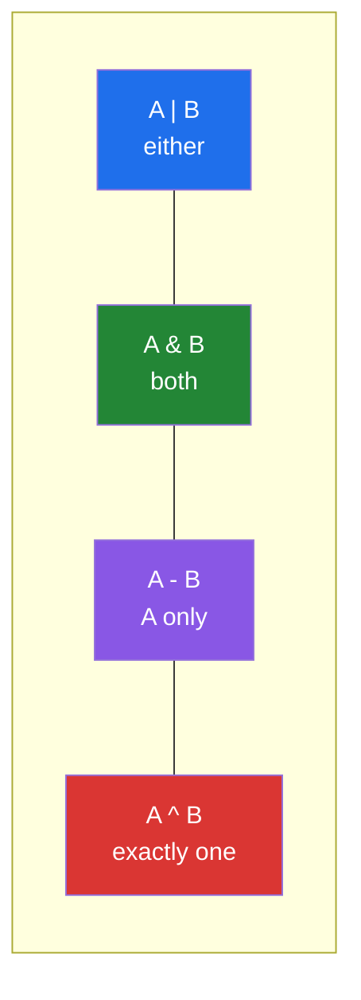

# 2.2 — Set algebra: union, intersection, difference

## One-line answer

`|`, `&`, `-` and `^` answer "in either", "in both", "in the first only" and "in exactly one" in a
single linear pass each — replacing the nested loops people write for those questions, and reading
much closer to the sentence they were trying to express.

---

## The story

A weekly reconciliation between two systems: papers in the search index, and papers in the database.

```text
missing = []
for db_id in database_ids:
    found = False
    for index_id in index_ids:
        if db_id == index_id:
            found = True
            break
    if not found:
        missing.append(db_id)
```

Nine lines, two nested loops, a flag, and a `break`. It is correct. On forty thousand ids each side it
takes six minutes, which is annoying but tolerable at weekly cadence.

The reviewer replaces it with one line:

```text
missing = set(database_ids) - set(index_ids)
```

It runs in under a second, and — the argument the reviewer actually makes — **it says what it means.**
"The database ids that are not in the index" is a sentence, and `-` is that sentence.

The same file has three more of these questions, each written as its own nested loop: which are in
both, which are in either, which are in exactly one. All four become one line each, and the file loses
thirty lines.

---

## The idea in plain language

### The four operations

Given two sets `A` and `B`:

| Operator | Method | Means | Reads as |
|---|---|---|---|
| `A \| B` | `A.union(B)` | in **either** | "everything we know about" |
| `A & B` | `A.intersection(B)` | in **both** | "the overlap" |
| `A - B` | `A.difference(B)` | in A, **not** in B | "what A has that B is missing" |
| `A ^ B` | `A.symmetric_difference(B)` | in **exactly one** | "the disagreements" |

Each is a single pass proportional to the sizes involved — `&` and `-` iterate the smaller side and do
O(1) lookups in the other, which is
[2.1](2.1-a-set-is-a-hash-table.md)'s property doing the work.

`^` is the reconciliation operator: everything the two sides disagree about, in one call, without
caring which side is which.



### The three comparisons

| Operator | Method | Means |
|---|---|---|
| `A <= B` | `A.issubset(B)` | every element of A is in B |
| `A >= B` | `A.issuperset(B)` | every element of B is in A |
| — | `A.isdisjoint(B)` | they share nothing |

`<` and `>` are the strict versions (subset **and** not equal). `isdisjoint` has no operator and is
worth knowing because it **short-circuits** — it stops at the first shared element, where `A & B`
computes the whole intersection just to find out whether it is empty.

### The operators are strict; the methods are not

This is the distinction that matters in practice:

```text
{1, 2} | [2, 3]        -> TypeError
{1, 2}.union([2, 3])   -> {1, 2, 3}
```

**Operators require both sides to be sets.** Methods accept any iterable — a list, a tuple, a
generator, a dict's keys. So `known.union(new_ids)` works where `known | new_ids` raises.

The strictness is a feature: `|` refusing a list is what stops you accidentally taking the union of a
set with the *characters* of a string. The methods are the deliberate escape hatch, and using one is a
statement that you meant it.

### The in-place versions

`|=`, `&=`, `-=`, `^=` and their method forms (`update`, `intersection_update`,
`difference_update`, `symmetric_difference_update`) modify the left set rather than returning a new
one. `a |= b` is `a.update(b)`.

Two things follow. They avoid an allocation, which matters when accumulating in a loop. And they
**mutate**, so every other name bound to that set sees the change
([Day 4, 2.3](../../../day-04-objects/parts/02-containers/2.3-aliasing-two-names-one-object.md)) — which
is the usual argument for preferring the non-mutating form at a function boundary.

### These are the same operators as the bitwise ones

`&`, `|`, `^` on a set are the same symbols as on an integer
([Day 5, 1.5](../../../day-05-operators-and-conditionals/parts/01-operators/1.5-bitwise-and-the-mask.md)),
dispatching to `set.__and__` instead of `int.__and__`. That is not a coincidence of naming: a set is
conceptually a bit per possible element, and intersection really is AND. Recognising the shared shape
is why pandas masks and set algebra feel similar.

Precedence follows the bitwise rules too, so `&` binds tighter than `|`, and
`a | b & c` is `a | (b & c)`. When mixing them, parenthesise
([Day 5, 1.6](../../../day-05-operators-and-conditionals/parts/01-operators/1.6-precedence-and-associativity.md)).

---

## Why Setu needs it

- **[3.1](../03-dedup/3.1-ten-thousand-ids-timed.md), today,** measures the cost difference these
  operations exploit.
- **[2.5](2.5-view-objects-are-windows.md), today,** shows that `dict.keys()` supports set operations
  directly — so `a.keys() & b.keys()` is the common-columns question with no conversion.
- **Day 26's pandas** (`PD-`) uses `df.columns.intersection(other)` and `Index.difference` for exactly
  these reconciliations, and a schema check written as `required - set(df.columns)` is the idiomatic
  form.
- **Day 76's train/test split** (`ML-`) must verify the two sets are disjoint — `train_ids & test_ids ==
  set()`, or better `train_ids.isdisjoint(test_ids)`. **That single assertion is a leakage check
  (Principle 8)** and it is one line.
- **Day 162's retrieval evaluation** (`RAG-`) compares retrieved documents against the expected set;
  precision and recall are `len(retrieved & relevant)` divided by two different denominators.

---

## The mechanism

The four operations, and the nested loop they replace:

```python
"""One line each, and one pass each, for four questions people write loops for."""

database_ids = {"doi-1", "doi-2", "doi-3", "doi-4"}
index_ids = {"doi-3", "doi-4", "doi-5"}

print(f"database : {sorted(database_ids)}")
print(f"index    : {sorted(index_ids)}")
print()
print(f"either        A | B : {sorted(database_ids | index_ids)}")
print(f"both          A & B : {sorted(database_ids & index_ids)}")
print(f"db only       A - B : {sorted(database_ids - index_ids)}")
print(f"index only    B - A : {sorted(index_ids - database_ids)}")
print(f"disagreements A ^ B : {sorted(database_ids ^ index_ids)}")

print()
print("the nine-line version of `A - B`, for comparison:")
missing = []
for db_id in sorted(database_ids):
    found = False
    for index_id in index_ids:
        if db_id == index_id:
            found = True
            break
    if not found:
        missing.append(db_id)
print(f"    {missing}   <- same answer, nested loops, a flag and a break")
print(f"    one line   : {sorted(database_ids - index_ids)}")
```

**Line by line:**

- `sorted(...)` on every printed result — set order is arbitrary
  ([2.1](2.1-a-set-is-a-hash-table.md)), so anything that reaches output gets sorted. **This is the
  habit, not a detail of the example.**
- `database_ids ^ index_ids` — everything the two sides disagree about, without choosing a direction.
  For a reconciliation report that is usually the first thing you want, followed by the two directional
  differences to say *which* side is missing what.
- The nested loop is exactly the story: two loops, a `found` flag, and a `break` that leaves only the
  inner loop ([Day 6, 2.1](../../../day-06-loops/parts/02-control-flow/2.1-break-and-which-loop-it-leaves.md)).
  It is `O(n·m)`; the set version is `O(n + m)`.
- The `sorted(database_ids)` in the loop header is only so the printed list is stable; the loop's cost
  is unaffected.

Operators versus methods, and the strictness:

```python
"""Operators demand sets. Methods take any iterable. That difference is deliberate."""

known = {"doi-1", "doi-2"}
incoming_list = ["doi-2", "doi-3"]

try:
    known | incoming_list
except TypeError as exc:
    print(f"operator with a list : TypeError: {exc}")

print(f"method with a list   : {sorted(known.union(incoming_list))}")
print(f"method with a genexp : {sorted(known.union(f'doi-{i}' for i in (3, 4)))}")
print(f"explicit conversion  : {sorted(known | set(incoming_list))}")

print()
print("why the strictness is a feature:")
print(f"    known.union('abc')  = {sorted(known.union('abc'))}   <- a string is iterable!")
try:
    known | "abc"
except TypeError as exc:
    print(f"    known | 'abc'       : TypeError: {exc}   <- caught")

print()
print("the comparisons:")
small, big = {"doi-1"}, {"doi-1", "doi-2"}
print(f"    small <= big (subset)   : {small <= big}")
print(f"    big >= small (superset) : {big >= small}")
print(f"    small < small (strict)  : {small < small}")
print(f"    isdisjoint              : {small.isdisjoint({'doi-9'})}")
```

**Line by line:**

- `known | incoming_list` raises `TypeError: unsupported operand type(s) for |: 'set' and 'list'` —
  the two-sided negotiation from
  [Day 5, 1.1](../../../day-05-operators-and-conditionals/parts/01-operators/1.1-an-operator-is-a-method-call.md)
  ending with neither side accepting.
- `known.union(incoming_list)` — the method takes any iterable, including a generator expression, which
  means you can union with a stream without materialising it first.
- `known.union("abc")` gives `{'doi-1', 'doi-2', 'a', 'b', 'c'}` — **a string is an iterable of
  characters**, so the method happily adds three single-character elements. The operator refuses. That
  is precisely the accident the strictness prevents, and it is a real bug when a variable that was
  supposed to hold a list of ids holds one id.
- `small < small` is `False` — strict subset means "subset **and** not equal", exactly like `<` on
  numbers.
- `isdisjoint` — no operator, and it short-circuits at the first shared element. For "do these overlap
  at all" on large sets it is meaningfully cheaper than `len(a & b) == 0`, which builds the whole
  intersection first.

In-place operations, and the accumulation pattern:

```python
"""|= mutates and avoids an allocation. That is useful in a loop and a hazard at a boundary."""

batches = [
    {"doi-1", "doi-2"},
    {"doi-2", "doi-3"},
    {"doi-4"},
]

accumulated: set[str] = set()
for batch in batches:
    accumulated |= batch
print(f"accumulated with |= : {sorted(accumulated)}")

rebuilt: set[str] = set()
for batch in batches:
    rebuilt = rebuilt | batch
print(f"rebuilt with |      : {sorted(rebuilt)}   <- same answer, a new set every pass")

print(f"or in one call      : {sorted(set().union(*batches))}")

print()
print("the mutation is visible through every other name:")
a = {"x"}
alias = a
a |= {"y"}
print(f"    a={sorted(a)} alias={sorted(alias)} same object: {a is alias}")
a = a | {"z"}
print(f"    after `a = a | ...`: a={sorted(a)} alias={sorted(alias)} same object: {a is alias}")

print()
print("removal: discard is forgiving, remove is not:")
tags = {"nlp", "vision"}
tags.discard("audio")
print(f"    discard('audio') on a set without it: fine, {sorted(tags)}")
try:
    tags.remove("audio")
except KeyError as exc:
    print(f"    remove('audio')  : KeyError: {exc}")
```

**Line by line:**

- `accumulated |= batch` — mutates in place, one set for the whole loop. `rebuilt = rebuilt | batch`
  allocates a **new** set each pass, which is the same
  [Day 6, 4.1](../../../day-06-loops/parts/04-loop-cost/4.1-the-accidental-quadratic.md) shape as string
  `+=`: each new set copies everything accumulated so far.
- `set().union(*batches)` — the whole union in one call, with `*` spreading the list into separate
  arguments ([1.4](../01-sequences/1.4-unpacking-and-star-rest.md)). Cleanest when the batches are
  already in a list.
- `a |= {"y"}` keeps `a is alias` **`True`** — the object was mutated. `a = a | {"z"}` makes it `False` —
  a new object, and `alias` is left behind. Same rebind-versus-mutate distinction as
  [Day 4, 1.2](../../../day-04-objects/parts/01-objects/1.2-names-are-labels.md), now with sets.
- `discard` versus `remove` — the same design question as
  [Day 7, 2.4](../../../day-07-strings/parts/02-methods/2.4-find-index-and-in.md)'s `find` versus
  `index`: is absence normal or a bug? `discard` when normal, `remove` when a missing element means
  something is wrong.

---

## When it breaks

**The operator with a non-set:**

```text
>>> {1, 2} | [2, 3]
Traceback (most recent call last):
  File "<stdin>", line 1, in <module>
TypeError: unsupported operand type(s) for |: 'set' and 'list'
>>> {1, 2}.union([2, 3])
{1, 2, 3}
```

**What it means.** The operator refuses; the method accepts. Both behaviours are deliberate, and the
usual cause is a variable that holds a list where you expected a set — which is worth fixing at the
source rather than by switching to the method.

**The string that was iterated:**

```text
>>> known = {"doi-1"}
>>> known.union("doi-2")
{'doi-1', 'd', 'o', 'i', '-', '2'}
```

**What it means.** `"doi-2"` is an iterable of six characters, so the method added six single-character
elements. **No error.** This is the accident the operator's strictness prevents, and it happens when a
function that usually receives a list of ids receives a single id. The fix is `known.union({"doi-2"})`
or `known | {"doi-2"}`.

**The precedence surprise:**

```text
>>> a, b, c = {1, 2}, {2, 3}, {3, 4}
>>> a | b & c
{1, 2, 3}
>>> (a | b) & c
{3}
```

**What it means.** `&` binds tighter than `|`, so the first is `a | (b & c)` — which is `{1,2} | {3}`.
Two different answers, no error
([Day 5, 1.6](../../../day-05-operators-and-conditionals/parts/01-operators/1.6-precedence-and-associativity.md)).
Parenthesise whenever you mix them.

**`remove` on something absent:**

```text
>>> {"a"}.remove("b")
Traceback (most recent call last):
  File "<stdin>", line 1, in <module>
KeyError: 'b'
>>> {"a"}.discard("b")
>>>
```

**What it means.** `remove` raises, `discard` does not. Choose by whether absence means a bug. The
common real failure is `remove` inside a loop over data that occasionally lacks the element, which
turns an ordinary case into a crash.

**And the comparison that is neither:**

```text
>>> {1, 2} < {2, 3}
False
>>> {1, 2} > {2, 3}
False
>>> {1, 2} == {2, 3}
False
```

**What it means.** Sets are only **partially** ordered: two sets can be neither a subset of the other
nor equal. So `a < b` being `False` does **not** imply `a >= b` — an inference that holds for numbers
and not here. This also means `sorted(list_of_sets)` produces an arbitrary order, and that a
`max()` over sets is meaningless.

---

## In production

**Write the sentence, not the loop.** `missing = expected - actual`, `overlap = a & b`,
`disagreements = a ^ b` — each of these is a line a reviewer reads once and understands, where the
equivalent nested loop needs tracing. The performance win is real and secondary; the readability win is
what makes the change worth doing even on collections small enough that speed is irrelevant.

**Reconciliation reports want all three directions.** `a - b`, `b - a` and `a & b` together tell the
whole story: what the first side has extra, what the second has extra, and what agrees. Reporting only
the symmetric difference tells you *that* they disagree and not *which way*, which is the first thing
the person reading the report will ask. Counting each is one `len` call.

**`isdisjoint` for leak checks, and assert it.** `assert train_ids.isdisjoint(test_ids)` is a
one-line, short-circuiting guarantee that no row appears in both splits (Principle 8). It belongs in
the pipeline, not only in the tests, because the failure it catches — an id that appears twice in the
source and lands on both sides — comes from *data*, not from code, and will not show up in a fixture.
The same shape checks that a required-columns set is satisfied: `missing = REQUIRED - set(df.columns)`
and raise if it is non-empty, with the missing names in the message.

**What changes at scale.** `A & B` and `A - B` iterate the **smaller** set and probe the larger, so they
are `O(min(|A|, |B|))` — which means intersecting a tiny set with a huge one is cheap, and the cost is
not what a naive reading suggests. `A | B` is `O(|A| + |B|)` because it must touch everything.
Accumulating with `|=` in a loop is linear; rebuilding with `result = result | batch` is quadratic, and
that is the one performance mistake in this document worth watching for. Above the point where the sets
do not fit in memory, these operations become database joins or `sort | comm` on disk, and the
algebra is exactly the same — which is why this vocabulary transfers directly to SQL's `UNION`,
`INTERSECT` and `EXCEPT` on Day 44.

**Under concurrency**, each operation is atomic under CPython's interpreter lock, but `a |= b` is a
read-modify-write on `a` and a concurrent `a.add(x)` can be lost between two threads doing it. And
mutating a set that another thread is iterating raises `RuntimeError`
([Day 6, 2.4](../../../day-06-loops/parts/02-control-flow/2.4-mutating-while-iterating.md)), which is the
kind failure. Build per-worker sets and union them at the end; that pattern parallelises cleanly and
needs no lock.

**The review comment a senior engineer leaves.** On the nine-line reconciliation: *"This is
`set(database_ids) - set(index_ids)`. One line, one pass, and it reads as the sentence you were trying
to write. While you are there, report `b - a` and `a & b` too — the ticket asks which side is missing
what, and the current version only answers half of it."*

**The interview question.** *"How would you find the items in list A that are not in list B?"* The
answer is `set(a) - set(b)`, and the reason is the one that matters: the nested-loop version is
`O(n·m)` while this is a linear pass with O(1) lookups. The follow-up worth being ready for is *"what
does that lose?"* — order and duplicates, so if either matters you want a comprehension with a set as
the lookup (`[x for x in a if x not in b_set]`), which keeps order and stays linear. Strong answers add
that the operators require both operands to be sets while the methods accept any iterable — and that
this strictness is useful, because `known.union("abc")` silently adds three characters where
`known | "abc"` raises.

---

## Check yourself

```bash
uv run python -c "
a = {'doi-1', 'doi-2', 'doi-3'}
b = {'doi-3', 'doi-4'}
print('either :', sorted(a | b))
print('both   :', sorted(a & b))
print('a only :', sorted(a - b))
print('b only :', sorted(b - a))
print('xor    :', sorted(a ^ b))
print('subset :', {'doi-1'} <= a, '| disjoint:', a.isdisjoint({'doi-9'}))
try:
    a | ['doi-4']
except TypeError as exc:
    print('operator:', exc)
print('method  :', sorted(a.union(['doi-4'])))
print('string  :', sorted(set().union('abc')), '<- iterated the characters')
x, y, z = {1,2}, {2,3}, {3,4}
print('precedence:', x | y & z, 'vs', (x | y) & z)
"
```

The `string` line and the `precedence` line are the two that catch people.

**Answer out loud, without scrolling up:**

> Give the four set operators and the sentence each one answers. Then say why `known | some_list`
> raises while `known.union(some_list)` does not, and why that strictness is worth having.

---

**Next:** [2.3 — A dict is a hash table with values, and it is ordered now](2.3-a-dict-is-ordered-now.md)
