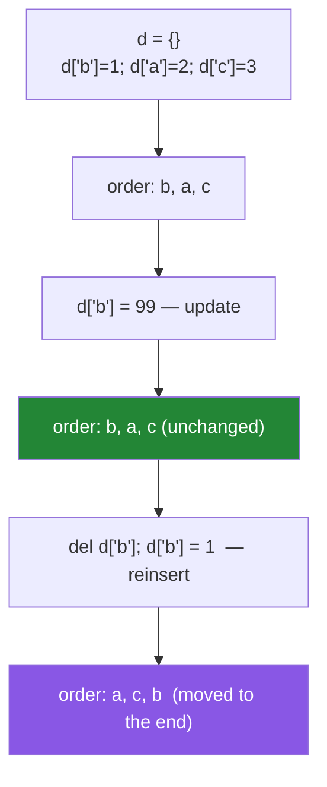

# 2.3 — A dict is a hash table with values, and it is ordered now

## One-line answer

A dict is a set of keys with a value attached to each — same O(1) lookup, same hashability requirement
— except that since Python 3.7 it **also preserves insertion order**, which is a language guarantee and
the reason `dict.fromkeys` is the one-line order-preserving deduplicator.

---

## The story

A configuration merger, written by someone who learned Python in 2015.

```text
from collections import OrderedDict
merged = OrderedDict()
merged.update(defaults)
merged.update(overrides)
```

The reviewer asks why it is not a plain dict. The author says dicts do not preserve order.

That was true. In Python 3.6 it became true by accident — a side effect of a memory optimisation — and
in **3.7 it became a language guarantee**. Since then a plain `dict` preserves insertion order, and
`OrderedDict` exists only for the two things it still does that a dict does not.

The same afternoon, a different file: a deduplication that keeps first-seen order, written as a loop
with a `seen` set and a result list — eight lines. The reviewer replaces it with
`list(dict.fromkeys(items))`, which works precisely *because* of the ordering guarantee, and which is
one line.

Neither change fixes a bug. Both are the same lesson: **a fact about the language changed, and code
written against the old fact keeps working while being wrong about why.** Knowing what is guaranteed —
and what is merely true today — is the difference between a habit and an understanding.

---

## The idea in plain language

### A dict is a set with values attached

Everything from [2.1](2.1-a-set-is-a-hash-table.md) applies to the **keys**:

- Lookup is O(1): hash the key, go to the slot, one comparison.
- Keys must be **hashable** — strings, numbers, tuples of hashables, not lists or dicts.
- Equal keys collapse: `{1: "a", 1.0: "b"}` has one entry, and the **value** is the later one while the
  **key** is the earlier one. (Assigning to an existing key replaces the value and leaves the stored key
  object alone.)

Values have no restrictions at all. Any object, mutable or not, duplicated freely.

`x in d` tests the **keys**, never the values
([Day 5, 3.2](../../../day-05-operators-and-conditionals/parts/03-the-or-trap/3.2-in-is-an-operator.md)).
`x in d.values()` is a scan, which is what
[2.5](2.5-view-objects-are-windows.md) is about.

### The ordering guarantee, and what exactly it promises

Since **Python 3.7**, a dict iterates in **insertion order**. That is a language guarantee, not an
implementation detail, and it holds for `keys()`, `values()`, `items()`, `repr()` and `for k in d`.

What it promises precisely:

- A key keeps the position where it was **first** inserted.
- **Re-assigning an existing key does not move it.** `d["a"] = 2` on an existing `"a"` updates the value
  in place.
- Deleting and re-inserting **does** move it to the end.



That last rule is the one that surprises people, and it is why `OrderedDict.move_to_end()` still
exists.

### What `OrderedDict` is still for

Two things, and they are narrow:

1. **`move_to_end(key, last=True/False)`** — reposition a key without deleting it. This is the core of
   an LRU cache.
2. **Order-sensitive equality.** `OrderedDict([("a",1),("b",2)]) == OrderedDict([("b",2),("a",1)])` is
   `False`; the same comparison between plain dicts is `True`. A plain dict's `==` ignores order.

If you need neither, use a plain dict. It is faster and uses less memory.

### `dict.fromkeys` — the one-line ordered dedup

`dict.fromkeys(items)` builds a dict whose keys are the items (values all `None`). Duplicates collapse
because keys are unique, and **the surviving order is first-seen** because of the guarantee.

```text
list(dict.fromkeys(["b", "a", "b", "c"]))   ->  ["b", "a", "c"]
```

Compare with `list(set(items))`, which deduplicates and destroys the order
([3.2](../03-dedup/3.2-order-preserving-dedup.md) builds both).

### Keys are hashable; values are anything

The asymmetry matters for design. A dict of `id → record` where the record is a mutable dict is normal
and fine. A dict keyed on a record is not possible unless the record is a tuple or a frozen dataclass
([1.3](../01-sequences/1.3-a-tuple-is-a-record.md)).

And the key stored is the **first** one inserted, even when a later equal key is a different object —
which is why `{True: "a", 1: "b"}` prints as `{True: 'b'}`: the key is `True`, the value is `"b"`.

### Memory: a dict is not much bigger than a set

Since 3.6 dicts use a **compact** layout: a dense array of `(hash, key, value)` entries in insertion
order, plus a sparse index array of positions into it. That is where the ordering comes from — it is a
by-product of the design that made dicts about 20% smaller — and it is why iteration is a walk down a
dense array rather than a scan over mostly-empty slots.

---

## Why Setu needs it

- **[2.4](2.4-get-setdefault-and-counter.md), next,** is the vocabulary for reading and building dicts
  safely.
- **[3.2](../03-dedup/3.2-order-preserving-dedup.md), today,** uses `dict.fromkeys` as one of its two
  answers, and the ordering guarantee is why it is correct.
- **[Day 6, 2.4](../../../day-06-loops/parts/02-control-flow/2.4-mutating-while-iterating.md)** showed
  a dict raising `RuntimeError` when its size changes during iteration; the compact layout is why it can
  detect that.
- **Day 12's `Paper`** (`PY-13`) is a record that starts as a dict and graduates to a class; knowing
  what a dict gives you is how you tell when it stops being enough.
- **Day 19's Pydantic** (`PY-24`) parses JSON into models, and JSON objects map onto dicts with the same
  key rules — including that JSON keys are always strings, so `{1: "a"}` does not round-trip.
- **Day 42's databases** (`SQL-`) return rows as dicts or mappings, and Day 26's pandas builds a
  DataFrame from a dict of columns where **the dict's order becomes the column order** — a direct
  consequence of this guarantee.

---

## The mechanism

The ordering guarantee, and its one surprise:

```python
"""Insertion order is guaranteed. Updating keeps the position; re-inserting does not."""

from collections import OrderedDict

d: dict[str, int] = {}
for key, value in (("b", 1), ("a", 2), ("c", 3)):
    d[key] = value
print(f"insertion order      : {list(d)}")

d["b"] = 99
print(f"after d['b'] = 99    : {list(d)}   <- unchanged, an update keeps its slot")

del d["b"]
d["b"] = 1
print(f"after delete+reinsert: {list(d)}   <- moved to the end")

print()
print("every view follows the same order:")
print(f"    keys()   : {list(d.keys())}")
print(f"    values() : {list(d.values())}")
print(f"    items()  : {list(d.items())}")
print(f"    repr     : {d}")

print()
print("dict equality IGNORES order; OrderedDict equality does not:")
print(f"    {{'a': 1, 'b': 2}} == {{'b': 2, 'a': 1}}")
print(f"    as plain dicts   : {dict(a=1, b=2) == dict(b=2, a=1)}")
print(f"    as OrderedDicts  : {OrderedDict(a=1, b=2) == OrderedDict(b=2, a=1)}")
```

**Line by line:**

- Building the dict in the order `b, a, c` and printing `list(d)` gives `['b', 'a', 'c']`. **Not
  sorted** — insertion order, which is a different guarantee from the set's non-guarantee
  ([2.1](2.1-a-set-is-a-hash-table.md)).
- `d["b"] = 99` — the key already exists, so the **value** is replaced in its existing slot and the
  order does not change. This is the behaviour you want for a configuration merge.
- `del d["b"]` then `d["b"] = 1` — now it is a *new* insertion, and it goes to the end. **Delete plus
  re-insert is not the same as update**, and code that "refreshes" an entry by removing and re-adding it
  silently reorders the dict.
- All four views agree, because they all walk the same dense entry array.
- Plain-dict `==` is `True` for the two orderings; `OrderedDict.__eq__` is order-sensitive and gives
  `False`. That is the second of `OrderedDict`'s two remaining reasons to exist.

Keys, values, and the collapse:

```python
"""Keys follow the set rules. Values follow none of them."""

print("keys must be hashable:")
for key in ("str", 42, (1, 2), frozenset({1})):
    d = {key: "ok"}
    print(f"    {key!r:<14} fine")
for key in ([1, 2], {"k": 1}, {1, 2}):
    try:
        {key: "ok"}
    except TypeError as exc:
        print(f"    {key!r:<14} {exc}")

print()
print("values have no restrictions at all:")
anything = {"a": [1, 2], "b": {"nested": True}, "c": None, "d": [1, 2]}
print(f"    mutable, nested, None, duplicated: {anything}")

print()
print("equal keys collapse - and the FIRST key object wins, the LAST value does:")
collapsed = {1: "int", 1.0: "float", True: "bool"}
print(f"    {{1: 'int', 1.0: 'float', True: 'bool'}} = {collapsed}")
print(f"    one entry, key is the integer 1: {list(collapsed)[0]!r} -> {collapsed[1]!r}")

print()
print("`in` tests KEYS, never values:")
config = {"host": "localhost", "port": 8080}
print(f"    'host' in config    : {'host' in config}")
print(f"    8080 in config      : {8080 in config}")
print(f"    8080 in config.values(): {8080 in config.values()}   <- a scan, O(n)")
```

**Line by line:**

- The hashability loop is [2.1](2.1-a-set-is-a-hash-table.md)'s rule applied to keys. The error names
  the offending type.
- `anything` holds a list, a nested dict, `None`, and a duplicated value — **all fine**. The asymmetry
  between keys and values is the single most useful thing to remember about the structure.
- `{1: "int", 1.0: "float", True: "bool"}` becomes `{1: 'bool'}`. All three keys are equal, so there is
  one entry; the **key** is the first one inserted (the integer `1`) and the **value** is the last one
  assigned. That split catches people, and it is why a dict keyed on mixed booleans and integers loses
  entries silently.
- `8080 in config` is `False` — `in` on a dict asks about keys. `8080 in config.values()` is `True` and
  is a **linear scan**, because values are not indexed
  ([2.5](2.5-view-objects-are-windows.md)). If you need value lookups, you need a second dict.

`fromkeys`, and what `OrderedDict` is still for:

```python
"""The ordering guarantee makes a one-line ordered dedup possible."""

from collections import OrderedDict

items = ["b", "a", "b", "c", "a"]

print(f"raw                     : {items}")
print(f"set(items)              : {sorted(set(items))}   <- deduped, order destroyed")
print(f"list(dict.fromkeys(...)) : {list(dict.fromkeys(items))}   <- deduped, first-seen order")

print()
print("fromkeys with a default value, too:")
print(f"    dict.fromkeys(['a','b'], 0) = {dict.fromkeys(['a', 'b'], 0)}")
print("    CAREFUL: one shared value object -")
shared = dict.fromkeys(["a", "b"], [])
shared["a"].append(1)
print(f"        after shared['a'].append(1): {shared}   <- both changed")

print()
print("what OrderedDict still does that dict does not:")
lru = OrderedDict([("a", 1), ("b", 2), ("c", 3)])
lru.move_to_end("a")
print(f"    move_to_end('a')      : {list(lru)}")
lru.move_to_end("c", last=False)
print(f"    move_to_end('c', False): {list(lru)}")
print(f"    order-sensitive equality: {OrderedDict(a=1, b=2) == OrderedDict(b=2, a=1)}")
print(f"    and popitem(last=False) : {OrderedDict([('a', 1), ('b', 2)]).popitem(last=False)}")
```

**Line by line:**

- `dict.fromkeys(items)` — keys are the items, values all `None`. Duplicates collapse because keys are
  unique; the order is first-seen because of the guarantee. `list(...)` extracts the keys.
  **One line, linear, order-preserving** ([3.2](../03-dedup/3.2-order-preserving-dedup.md)).
- `dict.fromkeys(["a", "b"], [])` with a **mutable** default — all keys share **one list object**, so
  appending through one key is visible through every other. This is
  [Day 4, 3.1](../../../day-04-objects/parts/03-identity-trap/3.1-the-mutable-default-argument.md)'s
  mutable-default bug in a new costume, and it is the one real trap in `fromkeys`. Use a comprehension
  when the value must be per-key: `{k: [] for k in keys}`.
- `move_to_end("a")` — repositions without deleting. This is the operation an LRU cache needs on every
  hit, and a plain dict cannot do it without `del` plus re-insert (which works, and is slower and
  clumsier).
- `move_to_end("c", last=False)` — to the **front**. There is no plain-dict equivalent at all.
- `popitem(last=False)` — pop from the front. A plain dict's `popitem()` always pops the **last** item,
  with no option.

---

## When it breaks

**The unhashable key:**

```text
>>> {[1, 2]: "value"}
Traceback (most recent call last):
  File "<stdin>", line 1, in <module>
TypeError: unhashable type: 'list'
>>> {(1, 2): "value"}
{(1, 2): 'value'}
```

**What it means.** Keys follow the set rules ([2.1](2.1-a-set-is-a-hash-table.md)). The fix is usually a
tuple, and the error is the language asking whether this is a collection or a composite value
([1.3](../01-sequences/1.3-a-tuple-is-a-record.md)).

**The missing key:**

```text
>>> config = {"host": "localhost"}
>>> config["port"]
Traceback (most recent call last):
  File "<stdin>", line 1, in <module>
KeyError: 'port'
>>> config.get("port")
>>> config.get("port", 8080)
8080
```

**The `KeyError` names the key**, which is usually enough. Whether to use `[]` or `.get()` is the same
design question as [Day 7, 2.4](../../../day-07-strings/parts/02-methods/2.4-find-index-and-in.md)'s
`find` versus `index` — is absence a bug or a normal case — and
[2.4](2.4-get-setdefault-and-counter.md) is about it.

**The reorder nobody intended:**

```text
>>> d = {"a": 1, "b": 2, "c": 3}
>>> d["b"] = 99
>>> list(d)
['a', 'b', 'c']
>>> del d["b"]; d["b"] = 99
>>> list(d)
['a', 'c', 'b']
```

**What it means.** Update keeps the slot; delete-and-reinsert does not. A "refresh this entry" helper
written as `d.pop(k); d[k] = v` silently moves the key to the end — and if the dict's order is the
column order of a DataFrame or the field order of a serialised record, the output changes shape with no
error.

**The shared mutable default from `fromkeys`:**

```text
>>> buckets = dict.fromkeys(["a", "b", "c"], [])
>>> buckets["a"].append(1)
>>> buckets
{'a': [1], 'b': [1], 'c': [1]}
>>> buckets["a"] is buckets["b"]
True
```

**What it means.** One list, three keys pointing at it
([Day 4, 2.3](../../../day-04-objects/parts/02-containers/2.3-aliasing-two-names-one-object.md)).
`fromkeys` evaluates the default **once**. The fix is a dict comprehension —
`{k: [] for k in keys}` — which evaluates `[]` per key
([Day 9, 2.1](../../../day-09-comprehensions/parts/02-dict-set-gen/2.1-dict-comprehensions.md)).

**And the entry that vanished:**

```text
>>> flags = {1: "one", True: "yes", 1.0: "float"}
>>> flags
{1: 'float'}
>>> len(flags)
1
>>> list(flags)[0] is True
False
```

**What it means.** `1 == True == 1.0`, so all three are the same key. One entry, the key is the integer
`1` (first inserted) and the value is `'float'` (last assigned). **No error**, and two entries you
thought you had are gone. This is the same collapse as `{1, True}` in a set, with the added subtlety
that the surviving key and the surviving value come from different assignments.

---

## In production

**Use a plain dict; reach for `OrderedDict` only for `move_to_end` or order-sensitive equality.** Code
still importing `OrderedDict` "for ordering" is code written against a pre-3.7 fact, and replacing it is
a safe, small cleanup that makes the remaining `OrderedDict` uses meaningful — when one appears in a
diff, a reviewer should be able to assume it is there for a reason. `functools.lru_cache` already
implements the LRU pattern, so even that case is often solved for you.

**Do not depend on dict order for correctness where the *source* order is arbitrary.** The guarantee is
that a dict preserves the order things were inserted — it says nothing about whether that order is
meaningful. A dict built by iterating a **set** has arbitrary order preserved faithfully
([2.1](2.1-a-set-is-a-hash-table.md)), which is exactly
[1.5](../01-sequences/1.5-sort-sorted-and-key.md)'s non-deterministic report. Sort at the boundary if
the output order matters.

**Where dict order *is* load-bearing, say so.** A DataFrame built from a dict takes its column order
from the dict; a serialised record's field order comes from insertion; a config merge's precedence is
the order of the `update` calls. All of these are correct and all of them are invisible to a reader who
does not know the guarantee — so a one-line comment (`# column order follows this dict`) is worth
writing, and a test asserting `list(df.columns) == [...]` is worth having.

**JSON round-trips lose non-string keys, silently.** `json.dumps({1: "a"})` produces `{"1": "a"}` and
loading it back gives the **string** `"1"`. Any dict keyed on integers, tuples or dates that passes
through JSON comes back with different keys and no error — the lookup simply misses. If a dict must
survive a JSON round-trip, key it on strings deliberately, or serialise as a list of records.

**What changes at scale.** Lookup stays O(1) and iteration is a walk down a dense array, which is
cache-friendly and genuinely fast. The costs are memory — a dict of a million small records is
substantially larger than a columnar equivalent, because each entry stores a hash, a key pointer and a
value pointer plus the sparse index — and hashing long keys, which is proportional to key length. When
you have millions of uniform records, a dict-per-record is the wrong shape and a columnar structure
(pandas, Arrow) is the right one, which is Day 26's argument. For many small dicts with the same keys,
`__slots__` on a class or a `NamedTuple` is dramatically smaller.

**Under concurrency, single dict operations are atomic under CPython's interpreter lock**, so
`d[k] = v` and `d.get(k)` are individually safe. `if k not in d: d[k] = compute()` is **not** — two
threads can both compute. `d.setdefault(k, v)` is atomic and is the correct idiom for that specific
race, though it evaluates `v` eagerly ([2.4](2.4-get-setdefault-and-counter.md)). And mutating a dict
while another thread iterates it raises `RuntimeError: dictionary changed size during iteration`
([Day 6, 2.4](../../../day-06-loops/parts/02-control-flow/2.4-mutating-while-iterating.md)).

**The review comment a senior engineer leaves.** On an `OrderedDict` used only for ordering: *"Plain
`dict` — insertion order has been guaranteed since 3.7 and we pin 3.12. Keep `OrderedDict` only where
we use `move_to_end`. And the dedup below is `list(dict.fromkeys(items))`, which is the same eight
lines in one."*

**The interview question.** *"Are Python dictionaries ordered?"* The answer is yes since 3.7, as a
language guarantee — insertion order, where re-assigning an existing key keeps its position and
deleting then re-inserting moves it to the end. The follow-up that finds real understanding is *"why
did that change?"* — it fell out of the compact-dict layout introduced in 3.6 to reduce memory, was an
implementation detail then, and was promoted to a guarantee in 3.7 once everyone was relying on it. And
*"so what is `OrderedDict` for?"* — `move_to_end` and order-sensitive equality, nothing else. A strong
answer adds `list(dict.fromkeys(items))` as the order-preserving one-line dedup that the guarantee makes
possible.

---

## Check yourself

```bash
uv run python -c "
d = {}
for k, v in (('b',1), ('a',2), ('c',3)): d[k] = v
print('insertion order    :', list(d))
d['b'] = 99
print('after update       :', list(d))
del d['b']; d['b'] = 1
print('after del+reinsert :', list(d))
print('dedup ordered      :', list(dict.fromkeys(['b','a','b','c','a'])))
print('dedup via set      :', sorted(set(['b','a','b','c','a'])), '<- order gone')
print('collapse           :', {1: 'int', 1.0: 'float', True: 'bool'})
shared = dict.fromkeys(['a','b'], [])
shared['a'].append(1)
print('fromkeys mutable   :', shared, '| same object:', shared['a'] is shared['b'])
print('per-key value      :', {k: [] for k in ['a','b']})
"
```

The `after del+reinsert` line and the `fromkeys mutable` line are the two traps.

**Answer out loud, without scrolling up:**

> State exactly what the dict ordering guarantee promises, including what happens when you update an
> existing key versus delete and re-insert it. Then name the two things `OrderedDict` still does, and
> give the one-line ordered dedup.

---

**Next:** [2.4 — `get`, `setdefault`, `defaultdict`, and `Counter`](2.4-get-setdefault-and-counter.md)
