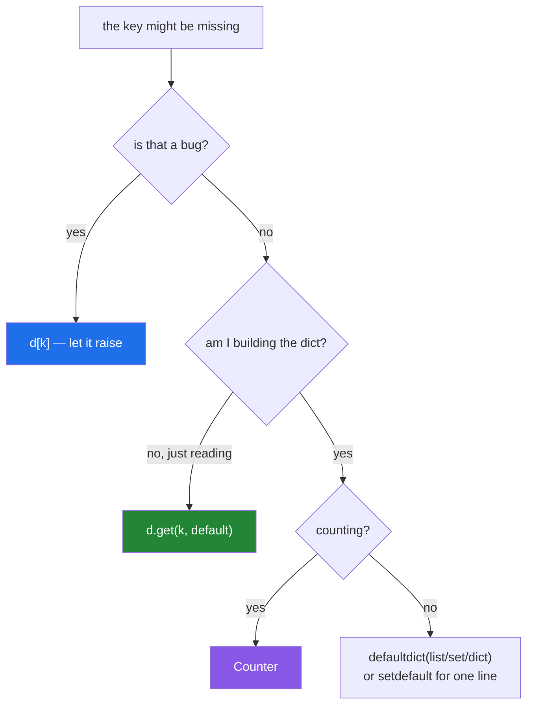

# 2.4 — `get`, `setdefault`, `defaultdict`, and `Counter`

## One-line answer

`d[k]` raises, `d.get(k)` returns `None`, `d.setdefault(k, v)` inserts and returns, `defaultdict`
creates on access, and `Counter` counts — five tools for "the key might not be there", and picking the
wrong one either hides a bug or creates entries you did not want.

---

## The story

A grouping loop, written four different ways in the same codebase.

The first is the version everybody starts with:

```text
by_year = {}
for paper in papers:
    if paper["year"] not in by_year:
        by_year[paper["year"]] = []
    by_year[paper["year"]].append(paper)
```

Correct, four lines, and three lookups per paper.

The second uses `defaultdict(list)` and is one line inside the loop. It is also the source of a bug two
weeks later: a report does `if year in by_year` to check whether a year had papers, someone changes it
to `if by_year[year]`, and **the mere act of asking creates an empty entry**. The report now lists every
year anyone ever queried, each with zero papers, and the counts do not reconcile.

The third counts papers per year with `by_year[year] = by_year.get(year, 0) + 1` — correct, and it is
`Counter` written out longhand.

The fourth is the one that took an afternoon:

```text
cache.setdefault(key, expensive_lookup(key))
```

`expensive_lookup` runs on **every call**, including every cache hit, because arguments are evaluated
before the method is entered. The cache works perfectly and saves nothing.

Five tools, four uses, and the differences between them are exactly the kind of thing that produces
correct-looking code with a wrong cost or a wrong side effect.

---

## The idea in plain language

### The five tools

| Tool | Missing key | Inserts? | Use when |
|---|---|---|---|
| `d[k]` | raises `KeyError` | no | absence is a **bug** |
| `d.get(k, default)` | returns `default` | **no** | absence is normal, read-only |
| `d.setdefault(k, v)` | returns `v` **and inserts it** | **yes** | building, one line |
| `defaultdict(factory)` | calls `factory()` and inserts | **yes, on any access** | building, many lines |
| `Counter` | returns `0`, does **not** insert | no | counting |

The column that causes bugs is "inserts?". `get` never modifies the dict; `setdefault` and
`defaultdict` do — and `defaultdict` does it on a **read**, which is the story's second bug.



### `get` returns `None` by default, and `None` may be a stored value

`d.get(k)` with no default returns `None` when the key is absent — **and also when the key is present
with the value `None`**. Those are different situations, and if you must tell them apart the test is
`k in d`, not the return value. This is
[Day 5, 3.1](../../../day-05-operators-and-conditionals/parts/03-the-or-trap/3.1-the-or-default-and-falsy-zero.md)'s
JSON-null case, and it is the reason `config.get("timeout", 30)` returns `None` rather than `30` when
the config contains `"timeout": null`.

### `setdefault` evaluates its default eagerly

`d.setdefault(k, make_default())` calls `make_default()` **every time**, because arguments are
evaluated before the call. On a cache hit that is wasted work; if the factory has a side effect, it is
a wrong one. That is the story's fourth bug, and it is why `setdefault` is fine for cheap literals
(`[]`, `0`, `""`) and wrong for anything computed.

The upside: `setdefault` is a **single atomic operation**, which matters under concurrency
([2.3](2.3-a-dict-is-ordered-now.md)).

### `defaultdict` creates on access — including a read

```text
d = defaultdict(list)
if d["missing"]:      # this READ inserts d["missing"] = []
    ...
len(d)                # 1
```

That is the whole hazard. A membership test written as `if d[k]:` instead of `if k in d:` silently
grows the dict, and a later `len()` or iteration reports entries nobody added.

Two defences: use `k in d` for tests, and convert to a plain dict (`dict(d)`) before returning it or
storing it, so downstream code cannot accidentally extend it.

The factory takes **no arguments**, so `defaultdict(lambda: {"count": 0})` is how you get a computed
default — and note each call produces a **new** object, which is exactly what
`dict.fromkeys(keys, [])` fails to do
([2.3](2.3-a-dict-is-ordered-now.md)).

### `Counter` is the counting one, and it does more than count

`Counter(iterable)` counts occurrences. Beyond that:

- `c[missing]` returns `0` and does **not** insert — unlike `defaultdict(int)`.
- `c.most_common(n)` gives the top `n` as `(item, count)` pairs, sorted descending.
- `+`, `-`, `&`, `|` work on Counters: add counts, subtract (dropping non-positives), take minimums and
  maximums. `c1 - c2` is "what the first has that the second does not", by count.
- `c.total()` sums the counts (Python 3.10+).

Ties in `most_common` are broken by **insertion order**, which is
[2.3](2.3-a-dict-is-ordered-now.md)'s guarantee — so it is deterministic given the same input order, and
arbitrary if the input came from a set
([1.5](../01-sequences/1.5-sort-sorted-and-key.md)).

### The other three

`d.pop(k, default)` removes and returns, with a default instead of raising. `d.popitem()` removes and
returns the **last** inserted pair. `d.update(other)` merges in place, later values winning —
[2.6](2.6-merging-dicts.md) covers the merge properly.

---

## Why Setu needs it

- **[2.6](2.6-merging-dicts.md), soon,** is `update` and `|`, the bulk versions of these.
- **[3.2](../03-dedup/3.2-order-preserving-dedup.md), today,** uses a dict as a seen-set with a value
  attached — the "first occurrence wins" pattern that `setdefault` expresses in one line.
- **[Day 5, 3.1](../../../day-05-operators-and-conditionals/parts/03-the-or-trap/3.1-the-or-default-and-falsy-zero.md)**
  established that `dict.get(k, default)` is the right tool for a config default and that a stored
  `None` defeats it; this is the rest of that family.
- **[Day 7, 2.4](../../../day-07-strings/parts/02-methods/2.4-find-index-and-in.md)** made the same
  raise-versus-sentinel choice for `str.find`/`str.index`. **Recognising it as one design question
  rather than two APIs is the point.**
- **Day 30's pandas** (`PD-`) replaces most grouping loops with `groupby`, and `value_counts()` is
  `Counter` at frame scale — but the loop version is what you reach for on a stream that does not fit in
  a frame.
- **Day 164's chunk statistics** (`RAG-`) and **Day 150's token counting** (`LLM-`) are `Counter`
  problems, and `most_common` is how you find the vocabulary.

---

## The mechanism

The five tools on the same missing key:

```python
"""Five answers to 'the key might not be there', and which of them modify the dict."""

from collections import Counter, defaultdict

base = {"a": 1}

print("d[k] - raises:")
try:
    base["missing"]
except KeyError as exc:
    print(f"    KeyError: {exc}")

print("d.get(k) - returns None, does NOT insert:")
d = dict(base)
print(f"    value: {d.get('missing')!r}   dict after: {d}")

print("d.get(k, default):")
d = dict(base)
print(f"    value: {d.get('missing', 0)!r}   dict after: {d}")

print("d.setdefault(k, v) - returns AND inserts:")
d = dict(base)
print(f"    value: {d.setdefault('missing', 0)!r}   dict after: {d}")

print("defaultdict - creates on ANY access, including a read:")
dd = defaultdict(list, base)
value = dd["missing"]
print(f"    value: {value!r}   dict after: {dict(dd)}   <- the read inserted it")

print("Counter - returns 0, does NOT insert:")
c = Counter(base)
print(f"    value: {c['missing']!r}   dict after: {dict(c)}")
```

**Line by line:**

- `base["missing"]` raises `KeyError: 'missing'` — the key is in the message, which is usually enough to
  find the bug. **Use this when a missing key means something upstream is wrong.**
- `d.get('missing')` returns `None` and leaves the dict at `{'a': 1}`. **No insertion.**
- `d.setdefault('missing', 0)` returns `0` **and** the dict becomes `{'a': 1, 'missing': 0}`. It is a
  read *and* a write, which is what its name is trying to say.
- `dd["missing"]` on a `defaultdict` — a plain read, and the dict grows. **This is the trap.** Note the
  value was never assigned by any line of your code.
- `c['missing']` on a `Counter` returns `0` and does **not** grow the dict. `Counter` and
  `defaultdict(int)` look interchangeable and differ exactly here, which matters when you iterate the
  result afterwards.
- `dict(dd)` and `dict(c)` in the printouts — converting to a plain dict so the `repr` is comparable and,
  for the defaultdict, so the printed form does not include the factory.

The four ways to group, and their costs:

```python
"""The same grouping, four ways. Count the lookups."""

from collections import Counter, defaultdict

papers = [
    {"title": "Attention", "year": 2017},
    {"title": "BERT", "year": 2018},
    {"title": "ResNet", "year": 2015},
    {"title": "GPT", "year": 2018},
]

by_year_manual: dict[int, list[str]] = {}
for paper in papers:
    year = paper["year"]
    if year not in by_year_manual:
        by_year_manual[year] = []
    by_year_manual[year].append(paper["title"])
print(f"manual      : {by_year_manual}")

by_year_sd: dict[int, list[str]] = {}
for paper in papers:
    by_year_sd.setdefault(paper["year"], []).append(paper["title"])
print(f"setdefault  : {by_year_sd}")

by_year_dd = defaultdict(list)
for paper in papers:
    by_year_dd[paper["year"]].append(paper["title"])
print(f"defaultdict : {dict(by_year_dd)}")

counts = Counter(paper["year"] for paper in papers)
print(f"Counter     : {dict(counts)}")
print(f"most_common : {counts.most_common(2)}")
print(f"total       : {counts.total()}")
```

**Line by line:**

- The manual version does **three** dict lookups per paper: the `in` test, the assignment, and the
  append's lookup. It is the clearest to a beginner and the slowest.
- `by_year_sd.setdefault(year, []).append(...)` — **one** lookup, and the `[]` is a cheap literal so
  eager evaluation costs nothing. Note it allocates a fresh empty list on every call even when the key
  exists, which is wasted but trivial; that waste is why `defaultdict` is preferred for hot loops.
- `by_year_dd[year].append(...)` — one lookup, and the factory is called only when the key is genuinely
  missing. **This is the fastest and the one with the read hazard.**
- `Counter(paper["year"] for paper in papers)` — a generator expression
  ([Day 9, 2.3](../../../day-09-comprehensions/parts/02-dict-set-gen/2.3-the-generator-expression.md)),
  so nothing intermediate is built. This replaces the whole loop when you only want counts.
- `most_common(2)` gives `[(2018, 2), (2017, 1)]` — sorted by count descending, ties broken by insertion
  order. `total()` is 3.10+ and sums the counts.

The two hazards, reproduced:

```python
"""The defaultdict read that inserts, and the setdefault that computes eagerly."""

from collections import defaultdict

print("HAZARD 1 - a membership test that grows the dict:")
by_year = defaultdict(list)
by_year[2017].append("Attention")
print(f"    after one real insert : {dict(by_year)}  len={len(by_year)}")

if by_year[1999]:
    print("    1999 had papers")
print(f"    after `if by_year[1999]`: {dict(by_year)}  len={len(by_year)}   <- grew")

print("    the safe test:")
by_year_clean = defaultdict(list)
by_year_clean[2017].append("Attention")
if 1999 in by_year_clean:
    print("    1999 had papers")
print(f"    after `if 1999 in ...` : {dict(by_year_clean)}  len={len(by_year_clean)}")

print()
print("HAZARD 2 - setdefault evaluates its default eagerly:")
calls = {"n": 0}


def expensive(key: str) -> str:
    calls["n"] += 1
    return f"computed-{key}"


cache = {"a": "cached-a"}
for _ in range(3):
    cache.setdefault("a", expensive("a"))
print(f"    setdefault on an EXISTING key, 3 times -> expensive() ran {calls['n']} times")

calls["n"] = 0
cache = {"a": "cached-a"}
for _ in range(3):
    if "a" not in cache:
        cache["a"] = expensive("a")
print(f"    guarded version,          3 times -> expensive() ran {calls['n']} times")
```

**Line by line:**

- `if by_year[1999]:` — a **read** on a `defaultdict`, which calls the factory and inserts. `len` goes
  from 1 to 2, and nothing in the source looks like an insertion. **This is the story's second bug.**
- `if 1999 in by_year_clean:` — membership, which never inserts. Same question, no side effect.
- `cache.setdefault("a", expensive("a"))` — `expensive("a")` is evaluated **before** `setdefault` is
  called, so it runs three times for three cache hits and its result is discarded each time. The cache
  is working; the saving is not.
- The guarded version runs `expensive` **zero** times, because the key is present. For a genuinely
  expensive factory this is the correct shape, and `defaultdict` — whose factory takes no arguments and
  is called only on a miss — is the other.
- `calls` as a dict rather than an integer so the inner function can mutate it without `global`
  ([Day 4, 1.2](../../../day-04-objects/parts/01-objects/1.2-names-are-labels.md)).

`Counter`'s algebra, which is the part people miss:

```python
"""Counter does more than count: arithmetic, top-n, and set-like operations."""

from collections import Counter

expected = Counter({"nlp": 5, "vision": 3, "audio": 1})
actual = Counter({"nlp": 5, "vision": 1, "robotics": 2})

print(f"expected : {dict(expected)}")
print(f"actual   : {dict(actual)}")
print()
print(f"sum      e + a : {dict(expected + actual)}")
print(f"shortfall e - a : {dict(expected - actual)}   <- non-positive counts are DROPPED")
print(f"surplus   a - e : {dict(actual - expected)}")
print(f"minimum   e & a : {dict(expected & actual)}")
print(f"maximum   e | a : {dict(expected | actual)}")

print()
words = "the cat sat on the mat the end".split()
c = Counter(words)
print(f"counts        : {dict(c)}")
print(f"most_common(2): {c.most_common(2)}")
print(f"least common  : {c.most_common()[-1]}")
print(f"total         : {c.total()}")
print(f"missing key   : {c['zebra']!r}, and the dict is unchanged: {'zebra' in c}")
c.update(["cat", "cat"])
print(f"after update  : {dict(c)}   <- update ADDS counts, it does not replace")
```

**Line by line:**

- `expected - actual` gives `{'vision': 2, 'audio': 1}` — **`nlp` is gone**, because `5 - 5 = 0` and
  `Counter` subtraction drops zero and negative counts. That is deliberate (it keeps a Counter a
  multiset) and it is the behaviour that surprises people; `Counter.subtract()` is the in-place version
  that **keeps** negatives.
- `expected & actual` — the elementwise minimum: `{'nlp': 5, 'vision': 1}`. This is the "how many do
  both agree on" question, and it is the numerator of a recall calculation.
- `most_common()[-1]` — the least common. There is no `least_common`, and this is the idiom.
- `c['zebra']` returns `0` and `'zebra' in c` stays `False`. **Unlike `defaultdict(int)`**, reading a
  missing key does not create it — which makes `Counter` safe to probe.
- `c.update(["cat", "cat"])` **adds** to the existing counts rather than replacing them, which is
  different from `dict.update`. Reading `Counter.update` as `dict.update` is a real source of confusion.

---

## When it breaks

**The `KeyError` that names the key:**

```text
>>> config = {"host": "localhost"}
>>> config["port"]
Traceback (most recent call last):
  File "<stdin>", line 1, in <module>
KeyError: 'port'
```

**What it means.** The key is in the message. This is the **good** failure when a missing key means a
malformed config or a changed schema — it fires at the line making the assumption. Replacing it with
`.get()` to "make it robust" pushes the failure downstream where a `None` becomes a `TypeError` in
unrelated code.

**The `get` that could not tell two situations apart:**

```text
>>> import json
>>> config = json.loads('{"timeout": null}')
>>> config.get("timeout", 30)
>>> repr(config.get("timeout", 30))
'None'
>>> "timeout" in config
True
```

**What it means.** The key **is** present, so the default never applies; its stored value is `None`. The
REPL prints nothing for `None`, which is its own small trap. If "absent" and "present but null" mean
different things, the test is `in`, not the return value
([Day 5, 3.1](../../../day-05-operators-and-conditionals/parts/03-the-or-trap/3.1-the-or-default-and-falsy-zero.md)).

**The defaultdict that grew from a question:**

```text
>>> from collections import defaultdict
>>> d = defaultdict(list)
>>> d["a"].append(1)
>>> len(d)
1
>>> if d["b"]:
...     pass
...
>>> len(d)
2
>>> dict(d)
{'a': [1], 'b': []}
```

**What it means.** The `if` inserted `"b"`. **No assignment appears anywhere in that code.** A report
built by iterating this dict now includes a `"b"` with zero items, and the totals do not reconcile with
the source. The fix is `if "b" in d:`, and the defence is converting to `dict(d)` before the value
leaves the function.

**The setdefault that computed anyway:**

```text
>>> cache = {"a": 1}
>>> def expensive():
...     print("    ...expensive() ran")
...     return 2
...
>>> cache.setdefault("a", expensive())
    ...expensive() ran
1
```

**What it means.** It returned the cached `1` — correct — after running `expensive()` and throwing its
result away. Arguments are evaluated before the call, always. For a cheap literal this is free; for a
network call in a loop it is the whole cost of the thing you were caching.

**And the mutable default shared across keys:**

```text
>>> from collections import defaultdict
>>> good = defaultdict(list)
>>> good["a"].append(1); good["b"].append(2)
>>> good["a"] is good["b"]
False
>>> bad = dict.fromkeys(["a", "b"], [])
>>> bad["a"].append(1)
>>> bad
{'a': [1], 'b': [1]}
```

**What it means.** `defaultdict(list)` calls `list()` **per missing key**, so each gets its own list.
`dict.fromkeys(keys, [])` evaluates `[]` **once** and shares it
([2.3](2.3-a-dict-is-ordered-now.md)) — the same one-object-many-names bug as the mutable default
argument ([Day 4, 3.1](../../../day-04-objects/parts/03-identity-trap/3.1-the-mutable-default-argument.md)).
`{k: [] for k in keys}` is the comprehension form that also gets it right.

---

## In production

**Pick by whether absence is a bug, and make the choice visible.** `d[k]` for required fields — a
missing one should stop the pipeline at the line that assumed it. `d.get(k, default)` for optional
reads, with the default spelled out rather than relying on `None`. Reviewers read a bare `.get(k)` with
no default as a question: what happens downstream when this is `None`? Often the honest answer is that
nobody checked.

**Return plain dicts, not `defaultdict`s.** A `defaultdict` that escapes the function that built it is
a landmine: any consumer probing it with `d[k]` silently extends it, and the entries look identical to
real ones. `return dict(grouped)` is one call, removes the factory, and makes the result inert. The same
argument applies to `Counter` when the consumer might iterate it — although `Counter` at least does not
insert on read.

**`setdefault` for cheap literals, `defaultdict` for hot loops, and neither for expensive factories.**
The rule is about evaluation: `setdefault` evaluates eagerly, `defaultdict`'s factory runs only on a
miss but takes no arguments. When the default depends on the key **and** is expensive, neither fits —
write the explicit `if k not in d:` guard, or use `functools.lru_cache` if what you are building is
really a cache.

**`Counter` is the right tool more often than people reach for it.** Frequency of anything —
error codes, tokens, categories, HTTP statuses — plus `most_common` for the top-N and the arithmetic
operators for comparing two distributions. `expected - actual` as a shortfall report and
`len(retrieved & relevant)` as a recall numerator are both one line. The one thing to watch is that
subtraction drops non-positive counts, so a "difference" report built with `-` shows only shortfalls
and never surpluses — you need both directions, exactly as with set difference
([2.2](2.2-set-algebra.md)).

**What changes at scale.** All of these are O(1) per operation; the differences are constant factors and
allocations. The manual `if k not in d` grouping does three lookups per item where `defaultdict` does
one, which on ten million items is a measurable fraction of the loop. `setdefault` allocates a fresh
default on every call even on a hit, so in a hot loop `defaultdict` wins on allocation as well. And at
frame scale none of this is the right shape at all — `groupby` and `value_counts` do the same work in
compiled code ([Day 6, 4.2](../../../day-06-loops/parts/04-loop-cost/4.2-the-loop-you-should-not-write.md)).

**Under concurrency, `setdefault` is atomic and the `if k not in d: d[k] = v` guard is not.** Two threads
can both pass the guard and both compute; `setdefault` cannot be interleaved, so exactly one value is
stored — at the cost of both threads having computed the default eagerly. `defaultdict`'s factory is
**not** protected: two threads missing the same key can both call it. When correctness depends on the
default being created once, use a lock or a purpose-built cache.

**The review comment a senior engineer leaves.** On `if by_year[year]:` — *"That is a `defaultdict`, so
this test inserts an empty entry for every year you ask about; the report is listing years with zero
papers that were never in the data. Use `if year in by_year:`, and return `dict(by_year)` from the
builder so callers cannot do this by accident."*

**The interview question.** *"What is the difference between `d[k]`, `d.get(k)` and
`d.setdefault(k, v)`?"* The answer is what each does when the key is missing — raise, return a default,
or insert a default and return it — and the detail that matters is that only the third **modifies the
dict**. The follow-up worth being ready for is *"when would you use `defaultdict` instead?"* — when
building a grouping, because its factory runs only on a miss and takes no arguments so it is cheaper
than `setdefault`'s eager default — followed by the hazard: `defaultdict` creates entries on **any**
access including a read, so a membership test written `if d[k]:` silently grows the dict. Strong
candidates add that `Counter` returns `0` for a missing key **without** inserting, which makes it the
safe one to probe, and that `setdefault` is atomic under threading where the `if not in` guard is not.

---

## Check yourself

```bash
uv run python -c "
from collections import defaultdict, Counter
base = {'a': 1}
d = dict(base); d.get('x');            print('get       :', d)
d = dict(base); d.setdefault('x', 0);  print('setdefault:', d)
dd = defaultdict(list, base); dd['x']; print('defaultdict read:', dict(dd), '<- grew')
c = Counter(base); c['x'];             print('Counter read    :', dict(c), '<- did not')
calls = {'n': 0}
def exp():
    calls['n'] += 1
    return 'v'
cache = {'a': 1}
for _ in range(3): cache.setdefault('a', exp())
print('setdefault ran the factory', calls['n'], 'times on cache HITS')
e = Counter({'nlp': 5, 'vision': 3}); a = Counter({'nlp': 5, 'vision': 1})
print('shortfall e - a:', dict(e - a), '<- zero counts dropped')
print('minimum   e & a:', dict(e & a))
"
```

The `defaultdict read` and the `setdefault ran the factory` lines are the two bugs.

**Answer out loud, without scrolling up:**

> Give the five tools and say, for each, what happens on a missing key and whether the dict changes.
> Then explain why `d.setdefault(k, expensive())` does not save any work, and why `if d[k]:` on a
> `defaultdict` is a bug.

---

**Next:** [2.5 — View objects are windows, not snapshots](2.5-view-objects-are-windows.md)
