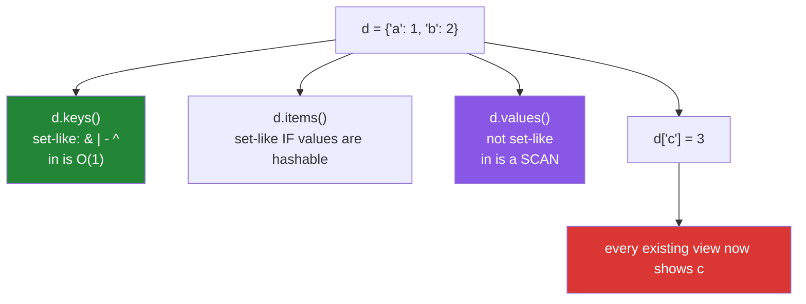

# 2.5 — View objects are windows, not snapshots

## One-line answer

`keys()`, `values()` and `items()` return **live views** onto the dict — they take no memory, they
change when the dict changes, and `keys()` and `items()` support set operations directly, which is why
`a.keys() & b.keys()` is the common-keys question with no conversion.

---

## The story

There is a window in the office looking onto the car park, and there is a photograph of the car park
pinned to the noticeboard.

Glance out of the window and you see what is out there now. Glance at the photograph and you see what
was out there when somebody took it. If you look out of the window, go and move your car, and look
again, the window has changed. The photograph has not, and that is the entire reason anybody bothered
to take one.

Both show you the car park. Only one of them remembers.

A schema validator, three lines:

```text
required = {"doi", "title", "year"}
present = row.keys()
missing = required - present
```

It works. A colleague reviewing it says `present` should be `set(row.keys())`, because "`keys()`
gives you a list-like thing and you cannot do set arithmetic on it". The author says it already
works.

Both are half right. `keys()` is neither a list nor a set — it is a **window**, and windows support
set arithmetic precisely so that this line can read the way it reads.

The other half arrives a week later, in a different function:

```text
def audit(row):
    before = row.keys()
    row["checked_at"] = now()
    return before          # for the audit log: which keys the row had BEFORE
```

`before` includes `checked_at`. It was never a photograph. It is a window onto the live dictionary,
and the dictionary changed while nobody was looking through it. The audit log records the state after
the change, every single time.

**The same property makes the first line elegant and the second line wrong.** A window is cheap
because it holds nothing — and holding nothing is exactly why it cannot remember anything.

---

## The idea in plain language

### Three views, no copies

`d.keys()`, `d.values()` and `d.items()` each return a small object holding a **reference to the dict**
and nothing else. Building one is O(1) and costs no memory regardless of the dict's size.

Because they hold a reference rather than data:

- They are **dynamic**: add or remove a key and every existing view reflects it immediately.
- They are **iterable** but not sequences: no indexing (`d.keys()[0]` raises), no slicing.
- They support `len()` and `in`, both O(1) for `keys()` — and `in` on `values()` is a **scan**.

This is different from Python 2, where these methods returned lists. Code that does `d.keys()[0]` or
`d.keys().sort()` was written for that version, and the fix is `list(d.keys())` — or usually
`sorted(d)`.

### `keys()` and `items()` are set-like; `values()` is not

`keys()` supports `&`, `|`, `-` and `^` against any set **or any other view**
([2.2](2.2-set-algebra.md)), because keys are unique and hashable — the same properties a set has.

`items()` is set-like too, but only when the **values** are hashable: an `(key, value)` pair containing a
list cannot be hashed, so `a.items() & b.items()` raises for such a dict.

`values()` supports none of it. Values need not be unique or hashable, so there is no set structure to
exploit. `x in d.values()` is a linear scan, and `set(d.values())` may be smaller than the dict.



### Iterating a dict gives you keys

`for k in d:` is `for k in d.keys():` — the default iteration is over keys, which is why `list(d)`,
`sorted(d)` and `x in d` all work on keys without naming them.

`for k, v in d.items():` is the idiomatic pairs loop, and it unpacks each `(key, value)` tuple
([1.4](../01-sequences/1.4-unpacking-and-star-rest.md)). It is also **faster** than
`for k in d: v = d[k]`, because it avoids a lookup per pass.

### The live-view hazard, in two forms

**Form one — the stale snapshot that is not stale.** The story: a view captured "before" a change shows
the state "after". The fix is to materialise: `set(row.keys())` or `list(row.items())`.

**Form two — mutation during iteration.** Changing a dict's **size** while iterating any of its views
raises `RuntimeError: dictionary changed size during iteration`
([Day 6, 2.4](../../../day-06-loops/parts/02-control-flow/2.4-mutating-while-iterating.md)). Changing a
**value** does not, because the size is unchanged and the view's position stays valid.

The defence for both is the same one word: **materialise when you need a snapshot.**
`for k in list(d):` is safe to delete from; `for k in d:` is not.

### When to materialise

| You want | Write |
|---|---|
| a live window (the common case) | the view itself |
| a stable snapshot | `list(view)` or `set(view)` |
| to delete keys while looping | `for k in list(d):` |
| an order | `sorted(d)` — a view has the dict's insertion order, and sorting materialises anyway |
| an index | `list(d)[0]` — but ask why you need positional access to a mapping |

---

## Why Setu needs it

- **[2.6](2.6-merging-dicts.md), next,** merges dicts, and `a.keys() & b.keys()` is how you find the
  keys that will collide before you merge.
- **[2.2](2.2-set-algebra.md)'s algebra applies directly to `keys()`**, which is what makes schema
  checks one line.
- **[Day 6, 2.4](../../../day-06-loops/parts/02-control-flow/2.4-mutating-while-iterating.md)** showed
  the `RuntimeError`; this is why the view can detect it and why `list(d)` fixes it.
- **Day 26's pandas** (`PD-`) uses `df.columns` the same way —
  `REQUIRED - set(df.columns)` is the frame-scale version of the story's validator, and
  `df.columns.intersection(other)` is `keys() & keys()`.
- **Day 19's Pydantic** (`PY-24`) validates that a payload's keys match a model's fields, which is
  exactly `payload.keys() - model_fields` for the extras and the reverse for the missing.
- **Day 192's graph state** (`LG-`) is a dict passed between nodes. A node that captures `state.keys()`
  and expects it to be a snapshot has the story's bug with concurrency added.

---

## The mechanism

Views are windows, and they cost nothing:

```python
"""A view holds a reference to the dict, not a copy of it. Watch it change."""

import sys

row = {"doi": "10.1000/xyz", "title": "Attention"}

keys = row.keys()
values = row.values()
items = row.items()

print(f"keys   : {keys}")
print(f"values : {values}")
print(f"items  : {items}")

print()
print("they cost nothing, whatever the dict's size:")
big = {f"k{i}": i for i in range(100_000)}
print(f"    the dict          : {sys.getsizeof(big):>9,} bytes")
print(f"    a view of it      : {sys.getsizeof(big.keys()):>9,} bytes")
print(f"    a list of its keys: {sys.getsizeof(list(big.keys())):>9,} bytes")

print()
print("and they are LIVE:")
row["year"] = 2017
print(f"    after row['year'] = 2017")
print(f"    keys   : {keys}   <- the same view object, updated")
print(f"    len    : {len(keys)}")

print()
print("a snapshot has to be taken explicitly:")
snapshot = set(row.keys())
row["checked_at"] = "2026-08-25"
print(f"    live view : {sorted(row.keys())}")
print(f"    snapshot  : {sorted(snapshot)}   <- taken before, and it stayed")
```

**Line by line:**

- `row.keys()` prints as `dict_keys(['doi', 'title'])` — a distinct type, not a list. Its `repr` shows
  the contents, which is what makes people think it *is* a list.
- `sys.getsizeof(big.keys())` — a small constant regardless of the 100,000 entries. **The view holds no
  data**, which is both why it is free and why it cannot remember anything.
- `sys.getsizeof(list(big.keys()))` — the materialised version, proportional to the dict. That is the
  price of a snapshot, and it is worth paying when you need one.
- `row["year"] = 2017` then printing the **same `keys` object** — it now includes `year`. Nobody
  re-fetched the view.
- `snapshot = set(row.keys())` — the fix. A `set` (or a `list`) copies the keys out, so a later change
  to the dict does not touch it. **This one line is the difference between the story's audit log being
  right and wrong.**

Set operations on views, which is why the validator reads well:

```python
"""keys() and items() are set-like. values() is not."""

required = {"doi", "title", "year"}
row = {"doi": "10.1000/xyz", "title": "Attention", "extra": "unexpected"}

print(f"required : {sorted(required)}")
print(f"row keys : {sorted(row.keys())}")
print()
print(f"missing  required - row.keys() : {sorted(required - row.keys())}")
print(f"extra    row.keys() - required : {sorted(row.keys() - required)}")
print(f"present  row.keys() & required : {sorted(row.keys() & required)}")
print(f"any overlap at all             : {not row.keys().isdisjoint(required)}")

print()
print("view-to-view works too - the common keys of two dicts:")
defaults = {"host": "localhost", "port": 8080, "debug": False}
overrides = {"port": 9090, "debug": True, "workers": 4}
print(f"    will collide  : {sorted(defaults.keys() & overrides.keys())}")
print(f"    only in either: {sorted(defaults.keys() ^ overrides.keys())}")

print()
print("items() is set-like only when the values are hashable:")
a = {"x": 1, "y": 2}
b = {"x": 1, "y": 99}
print(f"    identical pairs: {a.items() & b.items()}")
unhashable = {"x": [1]}
try:
    unhashable.items() & a.items()
except TypeError as exc:
    print(f"    with a list value: TypeError: {exc}")

print()
print("values() supports none of it:")
try:
    row.values() & {"Attention"}
except TypeError as exc:
    print(f"    values() & set : TypeError: {exc}")
print(f"    membership works, as a SCAN: {'Attention' in row.values()}")
```

**Line by line:**

- `required - row.keys()` — a `set` minus a **view**, and it works: `dict_keys` implements the set
  protocol. This is the story's validator, and it needs no conversion in either direction.
- `row.keys() - required` — the reverse direction, giving unexpected fields. **A schema check wants
  both**, exactly as a reconciliation wants both differences
  ([2.2](2.2-set-algebra.md)).
- `row.keys().isdisjoint(required)` — views have the set *methods* too, including the short-circuiting
  one.
- `defaults.keys() & overrides.keys()` — view against view. The keys that will collide in a merge,
  which is [2.6](2.6-merging-dicts.md)'s subject.
- `a.items() & b.items()` gives `{('x', 1)}` — the pairs both dicts agree on, which is a genuinely
  useful "what is identical between these two records" question.
- `unhashable.items() & a.items()` raises, because `("x", [1])` cannot be hashed
  ([1.3](../01-sequences/1.3-a-tuple-is-a-record.md)). **`items()` is set-like conditionally**, and the
  condition is the values.
- `row.values() & {...}` raises `TypeError: unsupported operand type(s)` — values are neither unique nor
  necessarily hashable, so there is no set structure. `'Attention' in row.values()` works and is a
  linear scan.

The two live-view hazards, and the one-word fix:

```python
"""A view is not a snapshot, and iterating one while changing the dict's size raises."""

print("HAZARD 1 - the 'before' that is not before:")
row = {"doi": "x", "title": "y"}


def audit_wrong(record: dict) -> object:
    before = record.keys()
    record["checked_at"] = "now"
    return before


def audit_right(record: dict) -> set:
    before = set(record.keys())
    record["checked_at"] = "now"
    return before


print(f"    view returned : {sorted(audit_wrong(dict(row)))}   <- includes checked_at")
print(f"    set returned  : {sorted(audit_right(dict(row)))}")

print()
print("HAZARD 2 - changing the SIZE during iteration:")
counts = {"a": 0, "b": 3, "c": 0}

try:
    for key in counts:
        if counts[key] == 0:
            del counts[key]
except RuntimeError as exc:
    print(f"    RuntimeError: {exc}")

print("    changing a VALUE is fine - the size never changes:")
values_only = {"a": 1, "b": 2}
for key in values_only:
    values_only[key] *= 10
print(f"        {values_only}")

print("    the fix: iterate a materialised list of keys")
counts = {"a": 0, "b": 3, "c": 0}
for key in list(counts):
    if counts[key] == 0:
        del counts[key]
print(f"        {counts}")

print("    or build a new dict, which is usually better:")
counts = {"a": 0, "b": 3, "c": 0}
print(
    f"        {{k: v for k, v in counts.items() if v}}  -> {dict((k, v) for k, v in counts.items() if v)}"
)
```

**Line by line:**

- `audit_wrong` returns the view, and by the time the caller looks at it the dict has changed. **The
  function is not wrong at the line where it returns; it is wrong at the line where it captured.**
- `audit_right` returns `set(record.keys())` — materialised at capture time. The `-> set` annotation
  also documents that this is a snapshot rather than a window, which is worth doing.
- `del counts[key]` inside `for key in counts:` raises `RuntimeError: dictionary changed size during
  iteration`. The dict carries a version counter and refuses rather than returning wrong data
  ([Day 6, 2.4](../../../day-06-loops/parts/02-control-flow/2.4-mutating-while-iterating.md)) — which is
  the **kind** failure compared with a list's silent skipping.
- `values_only[key] *= 10` inside the loop — **no error.** The size never changes, so the view's
  position stays valid. Knowing this is what lets you normalise values in place without a copy.
- `for key in list(counts):` — materialises the keys first, so the loop walks a stable list while the
  deletions hit the dict.
- The dict comprehension — building a new dict rather than editing one
  ([Day 9, 2.1](../../../day-09-comprehensions/parts/02-dict-set-gen/2.1-dict-comprehensions.md)). It
  says what the result *is* rather than describing a sequence of edits, and it does not mutate the
  caller's dict.

---

## When it breaks

**Indexing a view:**

```text
>>> d = {"a": 1, "b": 2}
>>> d.keys()[0]
Traceback (most recent call last):
  File "<stdin>", line 1, in <module>
TypeError: 'dict_keys' object is not subscriptable
>>> list(d.keys())[0]
'a'
>>> next(iter(d))
'a'
```

**What it means.** A view is iterable, not a sequence — no positions, no slicing. This is the most
common Python-2-era leftover, along with `d.keys().sort()`. `next(iter(d))` gets the first key without
building a list, which matters when the dict is large.

**The size change during iteration:**

```text
>>> d = {"a": 1, "b": 2}
>>> for k in d:
...     if d[k] == 1:
...         del d[k]
...
Traceback (most recent call last):
  File "<stdin>", line 1, in <module>
RuntimeError: dictionary changed size during iteration
>>> d = {"a": 1, "b": 2}
>>> for k in d:
...     d[k] = 0
...
>>> d
{'a': 0, 'b': 0}
```

**What it means.** Deleting raises; assigning to an **existing** key does not, because the size is
unchanged. Adding a **new** key raises for the same reason deleting does. The error names the detected
condition precisely, which is more than a list gives you.

**The unhashable pair:**

```text
>>> a = {"x": [1, 2]}
>>> b = {"x": [1, 2]}
>>> a.items() == b.items()
True
>>> a.items() & b.items()
Traceback (most recent call last):
  File "<stdin>", line 1, in <module>
TypeError: unhashable type: 'list'
```

**What it means.** Equality works — it compares pairwise — but **set operations need hashing**, and
`("x", [1, 2])` cannot be hashed. So `items()` is set-like exactly when the values are, and a dict with
list values silently loses that capability.

**And the view that outlived its dict's contents:**

```text
>>> d = {"a": 1}
>>> v = d.values()
>>> list(v)
[1]
>>> d.clear()
>>> list(v)
[]
>>> len(v)
0
```

**What it means.** `clear()` emptied the dict and the view emptied with it. **No error** — the view is
still valid, it is just looking at an empty dict now. A view held across any operation that reassigns
or clears the underlying dict is a bug that produces empty results rather than a traceback.

---

## In production

**Use the view when you want a window and materialise when you want a snapshot — and let the type say
which.** A function returning `dict_keys` is handing back a live window onto its own state, which is
almost never the intent and is invisible at the call site. Annotating `-> set[str]` and returning
`set(d.keys())` costs one call and makes the contract explicit. The general rule: **a view should not
outlive the expression that created it**, except in a `for` header.

**Schema validation is one line in each direction, and both directions matter.**
`missing = REQUIRED - row.keys()` and `unexpected = row.keys() - ALLOWED`. Raising on the first is
usually right; whether to raise on the second is a real decision — strict rejection catches typos in a
payload, lenient acceptance survives an upstream adding a field. Pydantic makes that choice a model
setting (`extra="forbid"` versus `"ignore"`) precisely because both are defensible, and picking one
deliberately is better than discovering yours by accident.

**`for k, v in d.items()` rather than `for k in d: v = d[k]`.** One lookup instead of two, and it states
that both parts are being used. Where only keys are needed, `for k in d:` is the idiom — writing
`d.keys()` there is redundant, and reviewers will say so.

**Deleting from a dict while iterating: build a new one.** `{k: v for k, v in d.items() if keep(v)}` is
clearer than a delete loop, does not mutate anybody's dict, and cannot raise the `RuntimeError`. The
`for k in list(d):` form is correct and is the right choice only when the dict is large enough that a
second one would not fit, or when the mutation must be visible to another holder of the same dict.

**What changes at scale.** Views are O(1) to create and iterate lazily, so `for k in d:` on a
million-entry dict allocates nothing — while `for k in list(d):` allocates a million-pointer list. In a
hot loop that difference is real, and it is the reason to reach for the view by default and materialise
only when the semantics require it. Under memory pressure the same trade appears as `d.items()` versus
`list(d.items())` when passing a mapping around.

**Under concurrency, a view is precisely the wrong thing to hand to another thread.** It reflects the
dict's live state, so the receiving thread sees changes it did not expect and can hit
`RuntimeError` mid-iteration if the size changes. The standard defence is a materialised snapshot taken
under a lock — `snapshot = dict(shared)` or `list(shared.items())` — and iterating that outside the
lock, which is the same shape as
[1.2](../01-sequences/1.2-slicing-and-the-copy-you-missed.md)'s snapshot for lists. Note it fixes the
container and not the values: shared mutable values are still shared.

**The review comment a senior engineer leaves.** On `before = record.keys()`: *"That is a live view, so
by the time the caller reads it, the `checked_at` we add on the next line is in there — the audit log
has been recording post-change state. Use `set(record.keys())` and annotate the return as `set[str]`
so it is obvious this is a snapshot."*

**The interview question.** *"What does `dict.keys()` return?"* The answer is a **view object** — not a
list — that holds a reference to the dict rather than a copy, so it costs nothing to create, reflects
later changes to the dict, and supports set operations like `&` and `-` because keys are unique and
hashable. The follow-up worth having ready is *"when does that bite?"* — capturing a view expecting a
snapshot, and iterating one while changing the dict's size, which raises `RuntimeError`; both are fixed
by materialising with `list()` or `set()`. Strong answers add that `values()` is **not** set-like
because values need be neither unique nor hashable, and that `items()` is set-like only when the values
happen to be hashable.

---

## Check yourself

```bash
uv run python -c "
row = {'doi': 'x', 'title': 'y'}
keys = row.keys()
row['year'] = 2017
print('live view      :', sorted(keys), '<- the same object, updated')
print('snapshot       :', sorted(set(row.keys()) - {'year'}))
required = {'doi', 'title', 'year', 'venue'}
print('missing        :', sorted(required - row.keys()))
print('unexpected     :', sorted(row.keys() - required))
a = {'x': 1, 'y': 2}; b = {'x': 1, 'y': 9}
print('identical pairs:', a.items() & b.items())
try:
    a.values() & {1}
except TypeError as exc:
    print('values() & set :', exc)
d = {'a': 0, 'b': 1}
try:
    for k in d:
        if d[k] == 0: del d[k]
except RuntimeError as exc:
    print('delete in loop :', exc)
d = {'a': 0, 'b': 1}
for k in d: d[k] += 100
print('value change ok:', d)
"
```

The first two lines are the story; the last two are the `RuntimeError` and its exception.

**Answer out loud, without scrolling up:**

> Say what a view object holds and what that buys and costs. Then explain why `keys()` supports set
> operations and `values()` does not, and give the one-word fix for both live-view hazards.

---

**Next:** [2.6 — Merging dicts, and the merge that only went one level deep](2.6-merging-dicts.md)
