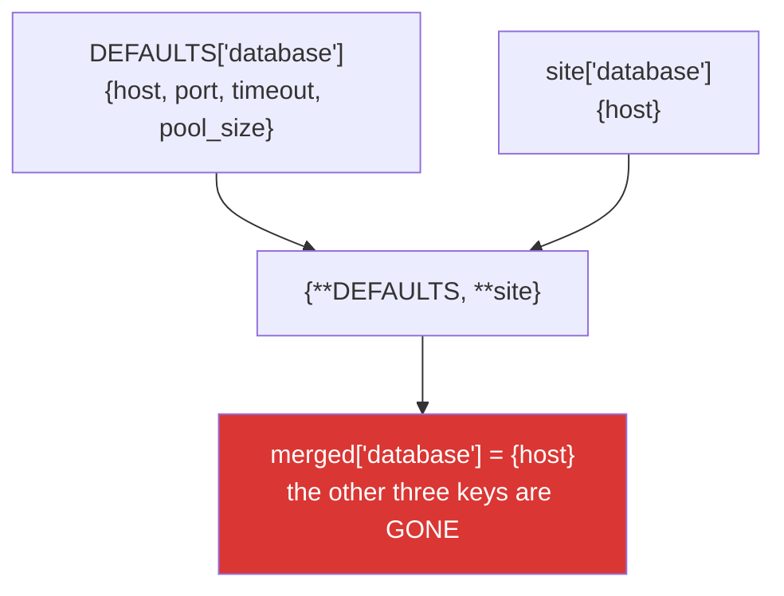

# 2.6 — Merging dicts, and the merge that only went one level deep

## One-line answer

`a | b` and `{**a, **b}` build a new dict with `b` winning on collisions, `a.update(b)` does the same
in place — and all three are **shallow**, so a nested section in `b` replaces the one in `a` entirely
rather than merging into it.

---

## The story

A configuration system with three layers: packaged defaults, a site file, and environment overrides.

```text
config = {**DEFAULTS, **site_config, **env_config}
```

Clean, one line, and correct for a year. The defaults look like this:

```text
DEFAULTS = {
    "database": {"host": "localhost", "port": 5432, "timeout": 30, "pool_size": 10},
    "logging": {"level": "INFO", "format": "json"},
}
```

A site file sets one thing:

```text
site_config = {"database": {"host": "db.internal"}}
```

The merged config's `database` section is `{"host": "db.internal"}`. **The port, the timeout and the
pool size are gone** — not overridden, *absent*. The site file replaced the whole nested dict rather
than merging into it.

Nothing raises. The port falls back to the driver's own default, which happens to be 5432, so it
works. The timeout falls back to *no timeout*, and eighteen months later a network partition leaves
connections hanging until the process is restarted.

The merge did exactly what it says: for the key `"database"`, the later value wins. It is a
**shallow** merge, and every one of the three spellings is.

---

## The idea in plain language

### The three spellings

| Form | Result | Mutates? | Since |
|---|---|---|---|
| `a \| b` | a new dict | no | 3.9 |
| `{**a, **b}` | a new dict | no | 3.5 |
| `a.update(b)` | `None` | **yes, `a`** | always |
| `a \|= b` | `None`-ish (rebinds/mutates `a`) | **yes, `a`** | 3.9 |

All four have the same collision rule: **later wins.** In `{**a, **b}`, `b`'s value for a shared key is
the one kept.

`update` also accepts things `|` does not — another mapping, an iterable of pairs, or keyword arguments
(`d.update(host="x")`) — which is the same operator-strict/method-lenient split as
[2.2](2.2-set-algebra.md)'s set operations.

And like every mutating method, `update` returns `None`
([Day 4, 2.2](../../../day-04-objects/parts/02-containers/2.2-what-in-place-means.md)) — so
`config = defaults.update(overrides)` gives you `None`, which is the same shape as
`papers = papers.sort()` ([1.5](../01-sequences/1.5-sort-sorted-and-key.md)).

### Shallow means one level

The merge copies **references** to the values, one level down
([1.2](../01-sequences/1.2-slicing-and-the-copy-you-missed.md)). It never looks inside them.

So for a shared key whose value is itself a dict, `b`'s dict *replaces* `a`'s. It does not merge into
it. That is the story, and it is the single most common surprise with configuration.



There is a second, quieter consequence: the merged dict's values are the **same objects** as the
originals'. Mutating `merged["logging"]["level"]` changes `DEFAULTS["logging"]["level"]` too, because
there is one dict.

### Deep merge is a decision, not a function

There is no deep merge in the standard library, and that is deliberate — because "merge two nested
structures" has no single correct answer:

- Two dicts at the same key: recurse. Probably.
- Two **lists** at the same key: replace, concatenate, or union? Genuinely ambiguous.
- A dict in one and a scalar in the other: which wins, and is it an error?
- A key present in `b` with the value `None`: does that mean "unset it" or "set it to null"?

Every configuration library answers these differently, and the answers are why they are libraries. If
you write your own recursive merge — about fifteen lines — **the value is not the code, it is writing
the four answers down.**

### Key order after a merge

Insertion order applies ([2.3](2.3-a-dict-is-ordered-now.md)): keys from `a` keep their positions, keys
only in `b` are appended in `b`'s order, and a **shared** key keeps `a`'s position with `b`'s value —
because assigning to an existing key does not move it.

That matters when the dict's order is load-bearing, such as column order in a DataFrame.

### The two-argument form of `dict()`

`dict(a, **b)` also merges, and is worth recognising in existing code. It has a real limitation:
keyword arguments must be valid identifiers, so a key like `"log-level"` or `2` raises `TypeError`. Use
`{**a, **b}`, which has no such restriction.

---

## Why Setu needs it

- **[2.5](2.5-view-objects-are-windows.md), just before this,** gives `a.keys() & b.keys()` — the keys
  that will collide, computable *before* you merge, which is how you log or reject unexpected
  overrides.
- **[Day 5, 3.1](../../../day-05-operators-and-conditionals/parts/03-the-or-trap/3.1-the-or-default-and-falsy-zero.md)**
  argued for `dict.get(key, default)` over `or`-defaults; a layered config is the same problem solved
  by merging instead of by per-read defaults, and it has this trap instead.
- **Day 19's Pydantic settings** (`PY-24`) exists partly to make layered configuration correct once:
  nested models merge field by field, types are validated, and an unknown key can be rejected rather
  than silently accepted.
- **Day 3's key loading** built configuration from `.env` plus environment
  ([Day 3, 1.2](../../../day-03-keys-and-budget/parts/01-secrets/1.2-dotenv-and-os-environ.md)), which
  is a two-layer merge with flat keys — the case where shallow is correct.
- **Day 26's pandas** (`PD-`) merges dicts of options and builds frames from dicts of columns, where the
  merged key order becomes the column order.
- **Day 130's prompt templates** (`LLM-`) merge a base template's parameters with per-call overrides,
  and a nested `generation_config` replaced wholesale is exactly the story with a model attached.

---

## The mechanism

The three spellings, and the collision rule:

```python
"""Later wins, in every form. Two build a new dict; two mutate."""

defaults = {"host": "localhost", "port": 5432, "debug": False}
overrides = {"port": 9090, "workers": 4}

print(f"defaults  : {defaults}")
print(f"overrides : {overrides}")
print()
print(f"a | b        : {defaults | overrides}")
print(f"{{**a, **b}}   : {{**defaults, **overrides}}")
print(f"dict(a, **b) : {dict(defaults, **overrides)}")

print()
print("key ORDER: a's keys keep their positions, b's new keys are appended")
print(f"    merged order : {list(defaults | overrides)}")
print("    note 'port' stayed in position 1 with b's value")

print()
print("update mutates and returns None:")
copy_of_defaults = dict(defaults)
returned = copy_of_defaults.update(overrides)
print(f"    returned     : {returned!r}   <- the classic mistake is assigning this")
print(f"    the dict now : {copy_of_defaults}")
print(f"    the original : {defaults}   <- untouched, because we copied first")

print()
print("update is lenient about its argument; | is not:")
d = dict(defaults)
d.update([("a", 1), ("b", 2)])
d.update(extra=True)
print(f"    from pairs and kwargs: {d}")
try:
    defaults | [("a", 1)]
except TypeError as exc:
    print(f"    defaults | pairs     : TypeError: {exc}")
```

**Line by line:**

- `defaults | overrides` — `port` becomes `9090` (later wins), `workers` is added, `host` and `debug`
  survive. A **new** dict; neither input is touched.
- `{**defaults, **overrides}` — identical result. The `**` spreads a mapping into a literal, the same
  star family as [1.4](../01-sequences/1.4-unpacking-and-star-rest.md). It works on any number of
  mappings, which is why the story's three-layer merge is written that way.
- `dict(defaults, **overrides)` — also works, and fails for keys that are not identifiers. Recognise it
  in old code; do not write it.
- `list(defaults | overrides)` — `['host', 'port', 'debug', 'workers']`. **`port` kept position 1** even
  though its value came from `overrides`, because updating an existing key does not move it
  ([2.3](2.3-a-dict-is-ordered-now.md)).
- `returned` is `None`. `config = a.update(b)` is the mistake, and it is silent until `config` is used.
- `d.update([("a", 1), ...])` and `d.update(extra=True)` — pairs and keyword arguments, neither of which
  `|` accepts. The strictness of the operator is the same feature as in
  [2.2](2.2-set-algebra.md): it refuses things that are probably a mistake.

The story: shallow, and what it costs:

```python
"""A nested section is REPLACED, not merged. And the values are shared objects."""

DEFAULTS = {
    "database": {"host": "localhost", "port": 5432, "timeout": 30, "pool_size": 10},
    "logging": {"level": "INFO", "format": "json"},
}
site_config = {"database": {"host": "db.internal"}}

merged = {**DEFAULTS, **site_config}
print(f"merged database : {merged['database']}")
print("                  <- port, timeout and pool_size are GONE, not overridden")

print()
print("and the sections that were NOT overridden are shared objects:")
print(f"    merged['logging'] is DEFAULTS['logging'] : {merged['logging'] is DEFAULTS['logging']}")
merged["logging"]["level"] = "DEBUG"
print(f"    after merged['logging']['level'] = 'DEBUG'")
print(f"    DEFAULTS['logging'] : {DEFAULTS['logging']}   <- the module constant changed")

print()
print("which keys will collide - ask BEFORE merging (part 2.5):")
print(f"    {sorted(DEFAULTS.keys() & site_config.keys())}")
```

**Line by line:**

- `merged['database']` is `{'host': 'db.internal'}`. **One key, where there were four.** The merge saw
  a collision on `"database"` and took the later value, which happens to be a dict, and did not look
  inside either.
- `merged['logging'] is DEFAULTS['logging']` is `True` — the merge copied the **reference**
  ([1.2](../01-sequences/1.2-slicing-and-the-copy-you-missed.md)), so there is one logging dict.
- `merged["logging"]["level"] = "DEBUG"` changes `DEFAULTS` too. **A module-level "constant" is not
  constant if anything reachable from it is mutable**
  ([Day 4, 2.3](../../../day-04-objects/parts/02-containers/2.3-aliasing-two-names-one-object.md)), and
  a merged config handed to code that edits it in place will corrupt the defaults for the rest of the
  process.
- `DEFAULTS.keys() & site_config.keys()` — the colliding keys, computed from views with no conversion
  ([2.5](2.5-view-objects-are-windows.md)). Logging this before a merge is a cheap way to make an
  override visible in the startup log rather than silent.

A deep merge, and the four decisions it forces:

```python
"""Fifteen lines. The value is the four documented answers, not the recursion."""

from __future__ import annotations

from typing import Any


def deep_merge(base: dict[str, Any], override: dict[str, Any]) -> dict[str, Any]:
    """Recursively merge `override` into `base`, returning a NEW dict.

    Decisions, all four of them, made explicitly:
      1. two dicts at the same key   -> recurse
      2. two lists at the same key   -> REPLACE (not concatenate) - a config list
                                        is a complete statement, not an addition
      3. dict vs scalar at one key   -> raise; the shapes disagree and guessing
                                        would hide a typo in the override file
      4. an explicit None in override -> treated as a value, so it CAN unset a
                                        default. Change this if null means "leave it".
    """
    result = dict(base)
    for key, override_value in override.items():
        base_value = result.get(key)
        if isinstance(base_value, dict) and isinstance(override_value, dict):
            result[key] = deep_merge(base_value, override_value)
        elif isinstance(base_value, dict) != isinstance(override_value, dict) and key in result:
            raise TypeError(
                f"cannot merge {type(override_value).__name__} over "
                f"{type(base_value).__name__} at key {key!r}"
            )
        else:
            result[key] = override_value
    return result


DEFAULTS = {
    "database": {"host": "localhost", "port": 5432, "timeout": 30},
    "logging": {"level": "INFO", "format": "json"},
    "tags": ["prod"],
}
site_config = {"database": {"host": "db.internal"}, "tags": ["staging"]}

shallow = {**DEFAULTS, **site_config}
deep = deep_merge(DEFAULTS, site_config)

print(f"shallow database : {shallow['database']}")
print(f"deep    database : {deep['database']}")
print(f"deep    tags     : {deep['tags']}   <- decision 2: replaced, not concatenated")
print(f"originals intact : {DEFAULTS['database']}")

try:
    deep_merge(DEFAULTS, {"logging": "verbose"})
except TypeError as exc:
    print(f"decision 3       : TypeError: {exc}")
```

**Line by line:**

- The docstring lists **four decisions**, and that is the deliverable. A deep-merge function without
  them documented is a function whose behaviour on the interesting cases is discovered during an
  incident.
- `result = dict(base)` — a shallow copy at this level, so `base` is never mutated. The recursion
  produces new dicts all the way down for merged branches; **unmerged branches are still shared
  references**, which is worth knowing and is usually acceptable for a config read at startup.
- `isinstance(base_value, dict) and isinstance(override_value, dict)` — the recurse case. `isinstance`
  rather than `type(x) is dict` so subclasses of dict work
  ([Day 5, 1.1](../../../day-05-operators-and-conditionals/parts/01-operators/1.1-an-operator-is-a-method-call.md)).
- The `!=` on two `isinstance` results plus `key in result` — a shape mismatch on a key that exists in
  both. **Decision 3: raise.** Silently taking the override would hide a typo like `"logging":
  "verbose"` where a section was meant, which is exactly the class of config error that is hardest to
  find.
- `else: result[key] = override_value` — everything else, including lists (decision 2) and `None`
  (decision 4). Both are *choices*, and a different project would reasonably choose differently.
- `deep['tags']` is `['staging']`, not `['prod', 'staging']`. Concatenating is defensible and this
  implementation says it does not, in the docstring, which is the point.
- `DEFAULTS['database']` is unchanged — the function returns new data rather than editing its inputs
  ([1.2](../01-sequences/1.2-slicing-and-the-copy-you-missed.md)).

---

## When it breaks

**The nested section that vanished:**

```text
>>> defaults = {"db": {"host": "local", "port": 5432, "timeout": 30}}
>>> site = {"db": {"host": "remote"}}
>>> {**defaults, **site}
{'db': {'host': 'remote'}}
>>> {**defaults, **site}["db"].get("timeout")
>>>
```

**What it means.** The merged `db` has one key. `get("timeout")` returns `None`, printed as nothing by
the REPL — and downstream, `None` for a timeout usually means "wait forever". **No error at any point**,
and the failure appears months later as a hung connection.

**The `None` from `update`:**

```text
>>> defaults = {"a": 1}
>>> config = defaults.update({"b": 2})
>>> config
>>> config["a"]
Traceback (most recent call last):
  File "<stdin>", line 1, in <module>
TypeError: 'NoneType' object is not subscriptable
```

**What it means.** `update` mutated `defaults` and returned `None`. The error arrives at the next use,
one step from its cause — the same shape as
[1.5](../01-sequences/1.5-sort-sorted-and-key.md)'s `papers = papers.sort()`.

**The module constant that got edited:**

```text
>>> DEFAULTS = {"logging": {"level": "INFO"}}
>>> config = {**DEFAULTS}
>>> config["logging"]["level"] = "DEBUG"
>>> DEFAULTS
{'logging': {'level': 'DEBUG'}}
```

**What it means.** `{**DEFAULTS}` is a shallow copy, so the inner dict is shared. Every later reader of
`DEFAULTS` in this process now sees `DEBUG`. **A constant in capitals is not constant** when its values
are mutable, and the defence is either `copy.deepcopy` at load time or making the defaults immutable
(nested `MappingProxyType`, or frozen dataclasses).

**The identifier restriction:**

```text
>>> dict({"a": 1}, **{"log-level": "INFO"})
Traceback (most recent call last):
  File "<stdin>", line 1, in <module>
TypeError: keywords must be strings
>>> {**{"a": 1}, **{"log-level": "INFO"}}
{'a': 1, 'log-level': 'INFO'}
```

**What it means.** `dict(a, **b)` routes `b` through keyword arguments, and a hyphenated key is not a
valid identifier. (Exact wording varies by version; some raise `keyword arguments must be strings` and
non-string keys raise similarly.) `{**a, **b}` has no such restriction — which is why it is the form to
use for data-driven keys.

**And the operand that is not a mapping:**

```text
>>> {"a": 1} | [("b", 2)]
Traceback (most recent call last):
  File "<stdin>", line 1, in <module>
TypeError: unsupported operand type(s) for |: 'dict' and 'list'
>>> d = {"a": 1}
>>> d.update([("b", 2)])
>>> d
{'a': 1, 'b': 2}
```

**What it means.** The operator requires a mapping; `update` accepts an iterable of pairs. The
strictness catches the case where a variable holds a list of tuples when you thought it held a dict —
and the method is the deliberate escape hatch when you did mean pairs.

---

## In production

**Layered configuration needs a deep merge, and the merge strategy belongs in writing.** A shallow
merge is correct for flat key-value configuration — environment variables, a `.env` file — and wrong
the moment there is a nested section, which is the moment somebody adds one. The four decisions (dicts
recurse, lists replace or concatenate, shape mismatches raise or coerce, explicit null unsets or is
ignored) are policy, and a team that has not written them down has four different answers in four
different files.

**Prefer a settings model to hand-rolled merging.** Pydantic's `BaseSettings` (Day 19, `PY-24`) merges
layers with type validation, rejects unknown keys when you ask it to, and — the part that matters most
— **fails at startup with a message naming the field** rather than producing a config that is subtly
incomplete. The story's incident is unfindable from the config dump because the dump shows what was
merged, not what was lost; a model that requires `database.timeout` cannot lose it.

**Log the overrides, not just the result.** `defaults.keys() & overrides.keys()` before the merge gives
you the list of keys that were overridden, which belongs in the startup log
([2.5](2.5-view-objects-are-windows.md)). A config system where you cannot see which layer supplied
each value is one where every configuration question becomes an investigation.

**Do not mutate the defaults, and consider making them unmutatable.** `{**DEFAULTS, **overrides}`
protects the top level and shares the nested values, so any consumer that edits a section corrupts the
process-wide defaults. `copy.deepcopy(DEFAULTS)` at load is the blunt fix;
`types.MappingProxyType` around each level is the one that makes the mistake raise instead of
succeeding. In practice, loading config once into an immutable structure at startup and passing it
explicitly removes the whole class of problem.

**What changes at scale.** All the merge forms are O(total keys) and allocate a new dict except
`update`, which is why `update` is the right choice when accumulating in a loop —
`result = result | batch` per iteration is quadratic
([Day 6, 4.1](../../../day-06-loops/parts/04-loop-cost/4.1-the-accidental-quadratic.md)), exactly like
`rebuilt = rebuilt | batch` for sets ([2.2](2.2-set-algebra.md)). A recursive deep merge over a large
nested structure allocates at every level; for configuration that is irrelevant, and for merging
millions of records it is the wrong tool entirely.

**Under concurrency, `update` is a sequence of individual assignments and is not atomic as a whole.**
Two threads updating the same dict can interleave, so the result is a mix rather than one winning
wholesale. Building a new dict and rebinding a single name is closer to atomic — a name rebinding is a
single bytecode — which is another reason to prefer `merged = {**a, **b}` over `a.update(b)` for shared
state.

**The review comment a senior engineer leaves.** On the three-layer `{**DEFAULTS, **site, **env}`:
*"This is a shallow merge, so a site file that sets only `database.host` drops `port`, `timeout` and
`pool_size` — I think that is where our missing connection timeout came from. Either flatten the config
to dotted keys or add a `deep_merge` with the list and shape-mismatch decisions documented. And log
`DEFAULTS.keys() & site.keys()` at startup so overrides are visible."*

**The interview question.** *"How do you merge two dictionaries?"* The answer is `a | b` (3.9+) or
`{**a, **b}` for a new dict, or `a.update(b)` to merge in place — with later values winning. The
follow-up that finds experience is *"what happens with nested dictionaries?"* — all of them are
**shallow**, so a nested value in `b` replaces `a`'s entirely rather than merging into it, which is the
classic configuration bug where setting one field in a section silently discards the rest. Strong
answers add that the merged dict shares the value objects with its inputs, so editing a nested section
mutates the original; that `update` returns `None`; and that there is no deep merge in the standard
library because the behaviour for lists, shape mismatches and explicit nulls is genuinely ambiguous and
has to be decided per project.

---

## Check yourself

```bash
uv run python -c "
DEFAULTS = {'db': {'host': 'local', 'port': 5432, 'timeout': 30}, 'log': {'level': 'INFO'}}
site = {'db': {'host': 'remote'}}
merged = {**DEFAULTS, **site}
print('merged db      :', merged['db'], '<- port and timeout gone')
print('timeout now    :', repr(merged['db'].get('timeout')))
print('log is shared  :', merged['log'] is DEFAULTS['log'])
merged['log']['level'] = 'DEBUG'
print('DEFAULTS log   :', DEFAULTS['log'], '<- the module constant changed')
d = {'a': 1}
print('update returns :', repr(d.update({'b': 2})), '| d is now', d)
print('collisions     :', sorted(DEFAULTS.keys() & site.keys()))
try:
    {'a': 1} | [('b', 2)]
except TypeError as exc:
    print('operator       :', exc)
"
```

Lines 1–2 are the story; lines 3–4 are the quieter half of it.

**Answer out loud, without scrolling up:**

> Give the three ways to merge two dicts and say which mutate. Then explain what "shallow" costs you
> with a nested config section, and name two of the four decisions a deep merge has to make.

---

**Next:** [3.1 — Ten thousand identifiers, timed both ways](../03-dedup/3.1-ten-thousand-ids-timed.md)
