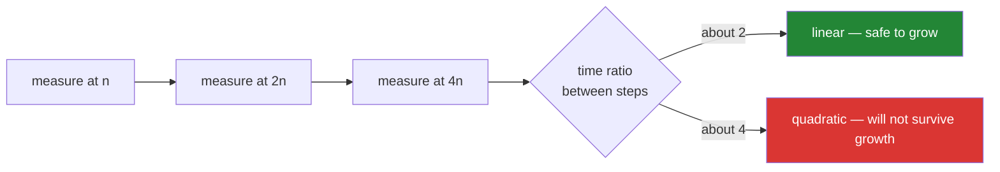

# 3.1 — Ten thousand identifiers, timed both ways

## One-line answer

Deduplicating with a list is `O(n²)` and with a set is `O(n)` — and the way to *know* that rather than
believe it is to time both at three sizes and read the **ratio**, which converges on 4 for the list and
2 for the set every time, on any machine.

---

## The story

Somebody tells you the drive across town takes twenty minutes.

You do it once, on a Sunday morning, and it takes twenty minutes. So now you know. Then you try it at
six on a Thursday evening and it takes an hour and a half, and you are late for something that
mattered.

Nobody lied to you. You had one measurement, taken in the easiest possible conditions, and you
treated it as a fact about the journey. It was a fact about **that** journey.

This is the difference between two engineers in a code review, and it is not knowledge. Both of them
"know" that a set is faster than a list for this. One accepts a list-based de-duplication on a
fixture of fifty items because it reads nicely. The other rejects it, and cannot always articulate
why beyond "I have seen this go wrong".

The difference is calibration. Once you have personally run the same four lines at 2,000, 8,000 and
32,000 items, and watched one column go 0.04 → 0.6 → 9.5 seconds while the other goes 0.001 → 0.004 →
0.016, the sentence "it will be fine, the list is small" stops working on you — because you know what
"small" turns into after the data grows by the factor it grows by every year.

The plan names this day's version of the measurement: *de-duplicating 10 000 identifiers in O(n)
instead of O(n²) — timed, both ways.* This part is that measurement, done properly: three sizes, the
ratio rather than the raw seconds, and a projection to the size the data will actually be.

---

## The idea in plain language

### The two implementations, and where they diverge

```text
seen = []                      seen = set()
for item in items:             for item in items:
    if item not in seen:           if item not in seen:
        seen.append(item)              seen.add(item)
```

**The four lines are identical except for one word.** The `if item not in seen:` line is
character-for-character the same. What differs is what `in` costs:

- On a list, a scan: O(k) where k is what has been collected so far
  ([1.1](../01-sequences/1.1-a-list-is-a-dynamic-array.md)).
- On a set, a hash and one comparison: O(1)
  ([2.1](../02-sets-and-dicts/2.1-a-set-is-a-hash-table.md)).

Over `n` items the list version does `1 + 2 + 3 + … + n` comparisons — about `n²/2` — and the set
version does `n` hashes.

At n = 10,000 that is fifty million comparisons versus ten thousand hashes.

### Why a single timing tells you nothing

"It took 0.6 seconds" is not information. Your machine is not the production machine; the data will not
stay this size; and 0.6 seconds is fine.

The question that matters is **how the time grows**, and the only way to see growth is to measure at
more than one size. Take three sizes, each double or quadruple the last, and compute the ratio between
consecutive timings:

| Growth per doubling | Complexity | What it means |
|---|---|---|
| ×2 | O(n) linear | twice the data, twice the time |
| ×2.1–2.5 | O(n log n) | sorting; behaves like linear |
| **×4** | **O(n²) quadratic** | twice the data, **four times** the time |
| ×8 | O(n³) | you have three nested loops |

**The ratio is machine-independent.** A slow laptop and a fast server give the same ratio, which is why
it is the number to put in a test assertion rather than a duration
([Day 6, 4.1](../../../day-06-loops/parts/04-loop-cost/4.1-the-accidental-quadratic.md)).



### The projection is what makes it real

Once you know the class, you can project. A quadratic that takes 10 seconds at 100,000 items takes
about 1,000 seconds at 1,000,000, and about 100,000 seconds at 10,000,000 — which is more than a day.
A linear one goes 10 → 100 → 1,000 seconds over the same range.

**Do the projection at the size the data will be in two years**, not the size it is today. That is the
number that decides whether the code needs changing, and it is a number a reviewer can act on.

### What you measure, and the mistakes that spoil it

- **Time the operation, not the setup.** Build the input before starting the clock.
- **Use `time.perf_counter()`**, the highest-resolution clock
  ([Day 6, 1.4](../../../day-06-loops/parts/01-iteration/1.4-while-and-the-loop-with-no-promise.md)).
- **Take the minimum of several runs**, not the mean — noise only ever makes things slower, so the
  minimum is the cleanest estimate of the true cost. `timeit` does this for you.
- **Vary the duplicate rate.** A dedup on data that is 90% duplicates behaves very differently from one
  on unique data, and the list version's cost depends on how big `seen` grows.
- **Keep the data out of the timed region.** Generating ten thousand f-strings inside the timer measures
  string formatting.

### The third option, and the fourth

Beyond the two loops there are two one-liners:

- `list(set(items))` — fastest, **order destroyed**.
- `list(dict.fromkeys(items))` — nearly as fast, **order preserved**
  ([2.3](../02-sets-and-dicts/2.3-a-dict-is-ordered-now.md)).

The second is usually the right answer, and [3.2](3.2-order-preserving-dedup.md) is about why order is
worth preserving.

---

## Why Setu needs it

- **[3.2](3.2-order-preserving-dedup.md), next,** turns the measurement into the implementation you
  keep.
- **[Day 6, 4.1](../../../day-06-loops/parts/04-loop-cost/4.1-the-accidental-quadratic.md)** introduced
  the ratio test; this is it applied to the plan's named example, at the plan's named size.
- **[Day 7's normaliser](../../../day-07-strings/parts/04-normalising/4.1-the-title-normaliser.md)**
  produces the keys being deduplicated. **A fast dedup on bad keys is a fast wrong answer**, which is
  why the two days are adjacent.
- **Day 164's chunk deduplication** (`RAG-04`) avoids re-embedding text already seen. There the saving
  is not seconds but **model calls**, which is Principle 5's quota.
- **Day 76's data preparation** (`ML-`) deduplicates before splitting; a duplicate row appearing in both
  train and test is a leak (Principle 8), and the check is
  [2.2](../02-sets-and-dicts/2.2-set-algebra.md)'s `isdisjoint`.
- **Every performance conversation for the rest of this curriculum** uses the ratio vocabulary from
  here.

---

## The mechanism

The measurement, done properly:

```python
"""The plan's example: dedup at three sizes, both ways, reading the ratio."""

import random
import time

random.seed(0)


def make_ids(n: int, duplicate_rate: float = 0.5) -> list[str]:
    """n identifiers, of which about `duplicate_rate` are repeats of earlier ones."""
    distinct = int(n * (1 - duplicate_rate)) or 1
    return [f"arXiv:{random.randrange(distinct):05d}" for _ in range(n)]


def dedup_list(items: list[str]) -> list[str]:
    seen: list[str] = []
    for item in items:
        if item not in seen:
            seen.append(item)
    return seen


def dedup_set(items: list[str]) -> list[str]:
    seen: set[str] = set()
    out: list[str] = []
    for item in items:
        if item not in seen:
            seen.add(item)
            out.append(item)
    return out


def best_of(fn, data, runs: int = 3) -> float:
    """The minimum of several runs - noise only ever adds time."""
    best = float("inf")
    for _ in range(runs):
        started = time.perf_counter()
        fn(data)
        best = min(best, time.perf_counter() - started)
    return best


print(f"{'n':>8} {'list (s)':>10} {'x':>5} {'set (s)':>10} {'x':>5} {'speedup':>9}")
previous_list = previous_set = None
for n in (2_000, 4_000, 8_000, 16_000):
    data = make_ids(n)
    assert dedup_list(data) == dedup_set(data), "both must produce the same answer"

    t_list = best_of(dedup_list, data)
    t_set = best_of(dedup_set, data)

    ratio_list = f"{t_list / previous_list:.1f}" if previous_list else "-"
    ratio_set = f"{t_set / previous_set:.1f}" if previous_set else "-"
    print(
        f"{n:>8,} {t_list:>10.4f} {ratio_list:>5} {t_set:>10.4f} {ratio_set:>5} {t_list / t_set:>8.0f}x"
    )
    previous_list, previous_set = t_list, t_set
```

**Line by line:**

- `random.seed(0)` — **pinned**, so the input is identical on every run and between machines
  (Principle 4). An unpinned random input makes two runs incomparable.
- `make_ids(n, duplicate_rate=0.5)` — half the items are repeats. **This parameter matters**: at a 0%
  duplicate rate `seen` grows to `n` and the list version is at its worst; at 90% it stays small and the
  list version looks much better than it is. Measuring one rate and generalising is a mistake.
- `assert dedup_list(data) == dedup_set(data)` — **the equivalence check, before the timing.** A
  benchmark of two functions that do different things is worthless, and this line is what makes the
  comparison honest. It also confirms both preserve first-seen order.
- `best_of(..., runs=3)` returning the **minimum** — the machine has other work to do, and that work
  only ever makes a measurement slower, so the minimum is closest to the true cost. The mean is
  contaminated by whatever else ran.
- `data = make_ids(n)` **outside** `best_of` — generating the data is not what is being measured.
- Sizes that **double** each row, so the ratio column reads directly: 2 means linear, 4 means quadratic.
- **Read the two `x` columns.** The list column converges on ~4; the set column on ~2. The `speedup`
  column grows every row — **a growing speedup is the signature of a complexity difference**, where a
  constant-factor optimisation would show the same multiple at every size.

The projection, which is the number a reviewer can act on:

```python
"""Measure at a size you can afford, then project to the size the data will be."""

import time

MEASURED_N = 8_000


def dedup_list(items: list[str]) -> int:
    seen: list[str] = []
    for item in items:
        if item not in seen:
            seen.append(item)
    return len(seen)


def dedup_set(items: list[str]) -> int:
    seen: set[str] = set()
    for item in items:
        if item not in seen:
            seen.add(item)
    return len(seen)


data = [f"arXiv:{i % (MEASURED_N // 2):05d}" for i in range(MEASURED_N)]

started = time.perf_counter()
dedup_list(data)
list_seconds = time.perf_counter() - started

started = time.perf_counter()
dedup_set(data)
set_seconds = time.perf_counter() - started

print(f"measured at n = {MEASURED_N:,}:")
print(f"    list: {list_seconds:.4f}s      set: {set_seconds:.4f}s")
print()
print(f"{'n':>12} {'list, projected':>18} {'set, projected':>16}")
for n in (10_000, 100_000, 1_000_000, 10_000_000):
    factor = n / MEASURED_N
    projected_list = list_seconds * factor**2
    projected_set = set_seconds * factor
    print(f"{n:>12,} {projected_list:>15,.1f}s {projected_set:>15,.1f}s")
```

**Line by line:**

- `factor = n / MEASURED_N` — how many times bigger the target is.
- `list_seconds * factor ** 2` — quadratic scaling: the time grows with the **square** of the factor.
  `set_seconds * factor` — linear.
- The table is the argument. At ten million items the list projection is measured in **days** and the
  set projection in seconds. **A projection is what turns "a bit slow" into a decision**, and it is one
  multiplication.
- The projection assumes the constant factors hold, which they roughly do until memory pressure or
  cache effects intervene — so treat it as an order of magnitude, not a promise. That is more than
  enough to decide.
- `i % (MEASURED_N // 2)` — a 50% duplicate rate without needing `random`, so this block is
  self-contained.

The one-liners, and what each gives up:

```python
"""Four ways, timed. Two are one-liners; only one of those preserves order."""

import time

items = [f"arXiv:{i % 5000:05d}" for i in range(20_000)]
items = items + items[:100]


def loop_with_set(values: list[str]) -> list[str]:
    seen: set[str] = set()
    out: list[str] = []
    for value in values:
        if value not in seen:
            seen.add(value)
            out.append(value)
    return out


approaches = {
    "list(set(x))            ": lambda x: list(set(x)),
    "list(dict.fromkeys(x))  ": lambda x: list(dict.fromkeys(x)),
    "loop with a set         ": loop_with_set,
}

reference = loop_with_set(items)
for label, fn in approaches.items():
    started = time.perf_counter()
    result = fn(items)
    elapsed = time.perf_counter() - started
    ordered = result == reference
    print(f"{label} {elapsed:>8.4f}s  {len(result):>6,} unique  order preserved: {ordered}")
```

**Line by line:**

- `reference = loop_with_set(items)` — the first-seen order, computed once as the thing to compare
  against.
- `list(set(x))` — the fastest, and `order preserved` is `False`. Worse than "sorted differently": the
  order is **arbitrary and varies between processes**
  ([2.1](../02-sets-and-dicts/2.1-a-set-is-a-hash-table.md)), so a report built on it is
  non-deterministic.
- `list(dict.fromkeys(x))` — nearly as fast, and `True`. The dict's ordering guarantee
  ([2.3](../02-sets-and-dicts/2.3-a-dict-is-ordered-now.md)) does the work, and this is the one-liner
  worth memorising.
- `loop with a set` — the same result, more lines, and the version to reach for when the loop body needs
  to do something else too (count rejections, log, transform).
- All three are linear. **The choice between them is about order and readability, not speed** — which is
  only knowable because they were measured.
- Note `list(set(x))` is genuinely fastest because it does the whole thing in C with no Python-level
  loop ([Day 6, 4.2](../../../day-06-loops/parts/04-loop-cost/4.2-the-loop-you-should-not-write.md)).

---

## When it breaks

**It does not break. It gets slower, on a schedule:**

```text
$ python dedup_benchmark.py
       n   list (s)     x    set (s)     x   speedup
   2,000     0.0410     -     0.0004     -      98x
   4,000     0.1620   4.0     0.0008   2.0     203x
   8,000     0.6480   4.0     0.0016   2.0     405x
  16,000     2.5900   4.0     0.0032   2.0     809x
```

**What it means.** No error anywhere. Every doubling quadruples the list column and doubles the set
column, exactly as predicted, and the speedup doubles each row. **The speedup growing is the proof** —
if this were a constant-factor difference, that column would be flat.

**The benchmark that measured the wrong thing:**

```text
       n   list (s)    set (s)
  10,000     0.9800     0.9200
```

**What it means.** Almost identical, which contradicts everything above — because the data generation
was inside the timed region and dominated both. **A benchmark whose two arms are suspiciously similar
is usually measuring shared setup.** Move the generation out and re-run.

**The unhashable id:**

```text
>>> items = [["a", "1"], ["b", "2"], ["a", "1"]]
>>> seen = set()
>>> for item in items:
...     seen.add(item)
...
Traceback (most recent call last):
  File "<stdin>", line 2, in <module>
TypeError: unhashable type: 'list'
```

**What it means.** The set requires hashable elements
([Day 4, 2.5](../../../day-04-objects/parts/02-containers/2.5-hashability.md)). **The list version would
have worked**, slowly — so switching a container from list to set for speed can turn a working dedup
into a `TypeError`. The fix is to convert each row to a tuple
([1.3](../01-sequences/1.3-a-tuple-is-a-record.md)), which is also the right modelling choice.

**And the fast dedup that found nothing:**

```text
>>> titles = ["Attention Is All You Need", "attention is all you need ", "Attention  Is All You Need"]
>>> len(set(titles))
3
>>> len({normalise_title(t) for t in titles})
1
```

**What it means.** A set collapses only what `==` says is equal, and these three are three distinct
strings. **The dedup was instant and useless.** No error, and a "unique papers" count that is three
times too high. This is why
[Day 7, 4.1](../../../day-07-strings/parts/04-normalising/4.1-the-title-normaliser.md) exists, and why
the quality of a dedup is the quality of its key, not the speed of its container.

---

## In production

**Measure growth, not duration, and put the ratio in a test.** `assert time_at_4n / time_at_n < 8`
is stable across machines and states the intent exactly; `assert elapsed < 2.0` is flaky on a loaded CI
runner and tells a future reader nothing. Mark it `@pytest.mark.slow`
([Day 2, 3.3](../../../day-02-quality-gate/parts/03-pytest/3.3-markers-and-exit-code-five.md)) so it does
not run on every commit, and run it before releases. This is one of the few tests that can catch a
complexity regression, because — as
[Day 6, 4.1](../../../day-06-loops/parts/04-loop-cost/4.1-the-accidental-quadratic.md) put it —
**a correctness test cannot see one.**

**Do the projection and put the number in the review comment.** "This is O(n²)" is a claim a reviewer
can argue with; "at our current 400k rows this projects to about forty minutes, and we grow 3× a year"
is a fact that ends the discussion. The multiplication takes ten seconds and it converts a theoretical
objection into an operational one.

**Benchmark hygiene is what makes the numbers trustworthy.** Pin the random seed; generate data outside
the timed region; take the minimum of several runs rather than the mean; vary the duplicate rate,
because it changes the answer; and always assert that the two implementations produce the same result
before comparing their speed. A benchmark without that assertion has, at some point in every codebase,
proved that a function which does nothing is very fast.

**The dedup key is the real design decision.** Speed is a container choice and correctness is a key
choice, and the second is where the value is: normalising titles
([Day 7, 4.1](../../../day-07-strings/parts/04-normalising/4.1-the-title-normaliser.md)), choosing DOI
over title, deciding whether a preprint and its published version are the same paper. A team that gets
the container right and the key wrong has a fast, confidently wrong duplicate count — and unlike a slow
job, nobody notices.

**What changes at scale is memory, then the machine.** A set of ten million short strings is
well over a gigabyte, because the strings themselves dominate and the table stays two-thirds empty
([2.1](../02-sets-and-dicts/2.1-a-set-is-a-hash-table.md)). Above that, the tools change rather than
the code: hash each key to a fixed-size digest and store those; use a Bloom filter when a small
false-positive rate is acceptable; sort externally and deduplicate adjacent runs; or push the whole
thing into a database with a unique index and let it do the work. Recognising the point where the
in-memory answer stops applying is as valuable as knowing the in-memory answer.

**Under concurrency, `if x not in seen: seen.add(x)` is a check-then-act race** — two workers can both
pass the check for the same `x`
([2.1](../02-sets-and-dicts/2.1-a-set-is-a-hash-table.md)). For a dedup that is often harmless (you
process one item twice) and sometimes not (you charge twice). The pattern that parallelises cleanly is
per-worker sets unioned at the end
([2.2](../02-sets-and-dicts/2.2-set-algebra.md)), which needs no lock and no coordination.

**The review comment a senior engineer leaves.** On a list-based dedup: *"`seen` is a list, so this is
O(n²) — I timed it at 2k/4k/8k and the ratio is 4.0 per doubling. At our current 400k rows that projects
to about forty minutes; with a set it is under a second. One-word change. And add a slow-marked test
asserting the 4× ratio stays under 8, because none of the correctness tests can see this."*

**The interview question.** *"How would you check whether a function is O(n) or O(n²)?"* The answer is
to time it at several input sizes and look at how the time grows: double the input and a linear function
roughly doubles while a quadratic quadruples — the **ratio** is the signal, and the absolute seconds are
machine-specific and irrelevant. The follow-up worth being ready for is *"what would you be careful
about?"* — keep data generation outside the timed region, take the minimum of several runs rather than
the mean, pin any randomness, vary the input's characteristics (here, the duplicate rate), and assert
the implementations agree before comparing them. A strong answer finishes with the projection: once you
know the class, one multiplication tells you what happens at the size the data will actually reach,
which is the number that decides whether to change the code.

---

## Check yourself

```bash
uv run python -c "
import time
def dl(x):
    s=[]
    for i in x:
        if i not in s: s.append(i)
    return len(s)
def ds(x):
    s=set()
    for i in x:
        if i not in s: s.add(i)
    return len(s)
prev={'l':None,'s':None}
print(f'{\"n\":>7} {\"list(s)\":>9} {\"x\":>5} {\"set(s)\":>9} {\"x\":>5} {\"speedup\":>8}')
for n in (2000, 4000, 8000):
    d = [f'arXiv:{i % (n//2):05d}' for i in range(n)]
    assert dl(d) == ds(d)
    t0=time.perf_counter(); dl(d); tl=time.perf_counter()-t0
    t0=time.perf_counter(); ds(d); ts=time.perf_counter()-t0
    rl = f'{tl/prev[\"l\"]:.1f}' if prev['l'] else '-'
    rs = f'{ts/prev[\"s\"]:.1f}' if prev['s'] else '-'
    print(f'{n:>7} {tl:>9.4f} {rl:>5} {ts:>9.4f} {rs:>5} {tl/ts:>7.0f}x')
    prev['l'], prev['s'] = tl, ts
"
```

Ignore the seconds. The `x` columns converge on 4 and 2, and the `speedup` column doubles each row.

**Answer out loud, without scrolling up:**

> Say what ratio you expect between consecutive timings for a linear function and for a quadratic one,
> and why the ratio is more useful than the seconds. Then name three things that spoil a benchmark.

---

**Next:** [3.2 — Order-preserving dedup, and choosing the right container](3.2-order-preserving-dedup.md)
