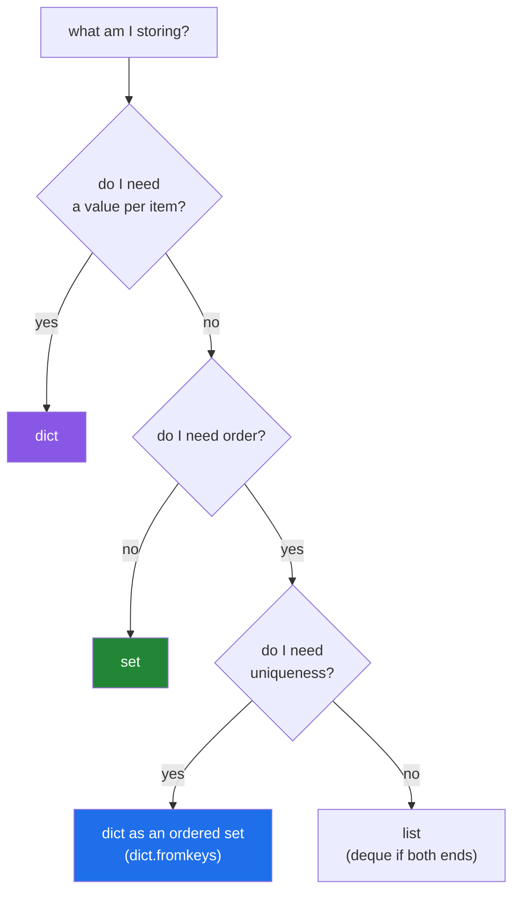

# 3.2 — Order-preserving dedup, and choosing the right container

## One-line answer

`list(dict.fromkeys(items))` deduplicates in one linear pass **and keeps first-seen order** — and
choosing between it, `set`, and a hand-written loop is the same three-question decision that picks
every container in this day: do I need order, do I need the value, do I need to do something else per
item.

---

## The story

A report of the top papers by citation count, deduplicated.

```text
top = list(set(ranked_papers))[:20]
```

It works, and the report is wrong every day in a different way. `set` destroys the ranking, so the
"top 20" is twenty arbitrary papers from the full list — and because set order depends on hash values
and is randomised per process
([2.1](../02-sets-and-dicts/2.1-a-set-is-a-hash-table.md)), it is twenty *different* arbitrary papers
each run.

The developer's fix is `sorted(set(ranked_papers))[:20]`, which is deterministic and sorts
alphabetically by title — still not the ranking.

The correct fix is one word: `list(dict.fromkeys(ranked_papers))[:20]`. Deduplicated, linear, and the
order is the order the papers arrived in, which is the ranking.

The lesson generalises past dedup. **`set` answers "which distinct values are here"; it does not answer
"which distinct values are here, in order".** Reaching for it because it is the fast container and then
losing a property you needed is the most common container mistake there is — and the fix is almost
always a dict, because a dict is a set that also remembers.

---

## The idea in plain language

### Four dedups, and what each keeps

| Written | Order | Cost | Use when |
|---|---|---|---|
| `set(items)` | **destroyed** | O(n) | you only need membership or a count |
| `sorted(set(items))` | sorted | O(n log n) | you want a deterministic, sorted output |
| `list(dict.fromkeys(items))` | **first-seen** | O(n) | the default — order is meaningful |
| explicit loop with a `seen` set | first-seen | O(n) | you must also count, log, or transform |

`dict.fromkeys` works because dict keys are unique **and** insertion-ordered
([2.3](../02-sets-and-dicts/2.3-a-dict-is-ordered-now.md)): the first occurrence of each value inserts a
key, later occurrences update its (unused) value without moving it, and `list()` extracts the keys in
order.

**First-seen is the meaningful default.** In ranked data it is the ranking; in a log it is chronology;
in a user's input it is what they typed. Preserving it costs nothing over `set`, so the only reason to
choose `set` is that you genuinely do not want it.

### Deduplicating by a key, not by the whole value

Most real deduplication is not on the item itself but on a **field**: papers by DOI, users by email,
rows by a normalised title
([Day 7, 4.1](../../../day-07-strings/parts/04-normalising/4.1-the-title-normaliser.md)).

`dict.fromkeys` cannot do that — it uses the item as the key. The shape is either a loop with a `seen`
set, or a dict comprehension read in reverse:

```text
{paper["doi"]: paper for paper in papers}     # LAST occurrence wins
```

That is a genuinely useful one-liner, and the direction is the thing to notice: because assigning to an
existing key **replaces the value while keeping the position**, this keeps the last occurrence at the
first occurrence's position. To keep the **first**, reverse the input or use `setdefault`
([2.4](../02-sets-and-dicts/2.4-get-setdefault-and-counter.md)).

Which one you want is a domain question — the newest record, or the original — and it should be in the
function's name.

### The three questions that pick every container

Everything in this day reduces to these:



There is no `OrderedSet` in the standard library, and a dict with ignored values **is** one. That is
not a hack — it is the reason `dict.fromkeys` exists as a classmethod.

### What deduplication silently loses

A dedup that reports only its output has thrown away information:

- **How many duplicates were removed** — a rate that changes is an upstream change worth knowing about.
- **Which values were duplicated** — a single id appearing 400 times is a different problem from 400
  ids appearing twice, and `Counter` distinguishes them
  ([2.4](../02-sets-and-dicts/2.4-get-setdefault-and-counter.md)).
- **Which occurrence survived** — first or last, and whether they differed in any field.

`len(items) - len(deduped)` is one subtraction and belongs in the log.

---

## Why Setu needs it

- **[3.1](3.1-ten-thousand-ids-timed.md), before this,** established that all the linear options cost
  about the same, so the choice is about **properties**, not speed.
- **[Day 7's normaliser](../../../day-07-strings/parts/04-normalising/4.1-the-title-normaliser.md)**
  produces the keys; this is the consumer. Together they are the deduplication pipeline.
- **Day 9's comprehensions** (`PY-09`) writes the dict-comprehension form —
  [Day 9, 2.1](../../../day-09-comprehensions/parts/02-dict-set-gen/2.1-dict-comprehensions.md).
- **Day 11's generators** (`PY-11`) turns this into a streaming dedup that never holds the output list,
  which is what you need for a file larger than memory
  ([Day 6, 1.1](../../../day-06-loops/parts/01-iteration/1.1-what-a-for-loop-actually-does.md)).
- **Day 76's data preparation** (`ML-`) deduplicates before splitting; a duplicate row landing in both
  train and test is a leak (Principle 8), and the assertion is
  [2.2](../02-sets-and-dicts/2.2-set-algebra.md)'s `isdisjoint`.
- **Day 164's chunking** (`RAG-04`) deduplicates chunks before embedding them, where each duplicate
  avoided is a model call not spent (Principle 5) — and where the *order* of chunks is the order of the
  document.

---

## The mechanism

The four dedups, and what each keeps:

```python
"""Same input, four outputs. Only two of them are usable as a ranking."""

ranked = [
    "Attention Is All You Need",
    "BERT",
    "Deep Residual Learning",
    "BERT",
    "AlexNet",
    "Attention Is All You Need",
]

print(f"input (ranked)          : {ranked}")
print()
print(f"set(...)                : {list(set(ranked))}")
print("                          ^ arbitrary, and different in another process")
print(f"sorted(set(...))        : {sorted(set(ranked))}")
print("                          ^ deterministic, but alphabetical - not the ranking")
print(f"list(dict.fromkeys(...)): {list(dict.fromkeys(ranked))}")
print("                          ^ first-seen order = the ranking")

print()
print("the explicit loop, when the body must do more than dedup:")
seen: set[str] = set()
unique: list[str] = []
duplicates: list[str] = []
for title in ranked:
    if title in seen:
        duplicates.append(title)
        continue
    seen.add(title)
    unique.append(title)

print(f"    unique     : {unique}")
print(f"    duplicates : {duplicates}")
print(f"    removed {len(ranked) - len(unique)} of {len(ranked)}")
```

**Line by line:**

- `list(set(ranked))` — the order is a hash artefact. **Run this in two processes and the two lists
  differ**, which is the story's non-deterministic report
  ([2.1](../02-sets-and-dicts/2.1-a-set-is-a-hash-table.md)).
- `sorted(set(ranked))` — deterministic and alphabetical. Better, and still not the ranking. The fix for
  non-determinism is not always the fix for the actual requirement.
- `list(dict.fromkeys(ranked))` — first-seen order preserved, in one linear pass. **One word longer than
  `set` and it keeps the property that mattered.**
- The explicit loop produces the same `unique` list and also collects the duplicates and reports a
  count. **That is the reason to write four lines instead of one**: the one-liner cannot tell you what
  it removed.
- `if title in seen: ... continue` — the guard-at-the-top shape from
  [Day 6, 2.2](../../../day-06-loops/parts/02-control-flow/2.2-continue-and-the-skipped-increment.md),
  with the counter above nothing that could skip it.

Deduplicating by a key, in both directions:

```python
"""Real dedup is usually on a field. First-wins and last-wins are different requirements."""

papers = [
    {"doi": "10.1/a", "title": "Attention", "version": 1},
    {"doi": "10.1/b", "title": "BERT", "version": 1},
    {"doi": "10.1/a", "title": "Attention Is All You Need", "version": 2},
    {"doi": "10.1/c", "title": "ResNet", "version": 1},
]


def dedup_by_first(records: list[dict], key: str) -> list[dict]:
    """Keep the FIRST record for each key, in first-seen order."""
    seen: set = set()
    out: list[dict] = []
    for record in records:
        value = record[key]
        if value in seen:
            continue
        seen.add(value)
        out.append(record)
    return out


def dedup_by_last(records: list[dict], key: str) -> list[dict]:
    """Keep the LAST record for each key, at the FIRST one's position."""
    return list({record[key]: record for record in records}.values())


for label, fn in (("first wins", dedup_by_first), ("last wins ", dedup_by_last)):
    result = fn(papers, "doi")
    print(f"{label}: {[(r['doi'], r['version']) for r in result]}")

print()
print("why last-wins keeps the FIRST position:")
print("    assigning to an existing dict key replaces the value and keeps the slot (part 2.3)")

print()
print("and the count of what was removed - always log this:")
deduped = dedup_by_first(papers, "doi")
print(
    f"    {len(papers)} in, {len(deduped)} out, {len(papers) - len(deduped)} duplicate(s) dropped"
)

from collections import Counter

counts = Counter(p["doi"] for p in papers)
repeated = {doi: n for doi, n in counts.items() if n > 1}
print(f"    repeated keys: {repeated}")
```

**Line by line:**

- `dedup_by_first` — a `seen` set of **key values**, not of whole records. Records are dicts and
  therefore unhashable ([2.1](../02-sets-and-dicts/2.1-a-set-is-a-hash-table.md)), so deduplicating them
  directly is impossible; deduplicating by a field is the only option and is what you wanted anyway.
- `{record[key]: record for record in records}` — a dict comprehension
  ([Day 9, 2.1](../../../day-09-comprehensions/parts/02-dict-set-gen/2.1-dict-comprehensions.md)). Later
  records with the same DOI **overwrite** earlier ones, so the value is the last and the position is the
  first's.
- The printed versions show it: first-wins keeps `version 1` for `10.1/a`, last-wins keeps `version 2`.
  **Both are one line apart and answer different questions** — "the original record" versus "the most
  recent record" — and the function names say which.
- `Counter(p["doi"] for p in papers)` then filtering to `n > 1` — **which** keys were duplicated and how
  often. One id appearing 400 times and 400 ids appearing twice are different upstream problems, and the
  count distinguishes them.
- `len(papers) - len(deduped)` — the number to log. A dedup rate that jumps is a signal; a dedup that
  reports only its output hides it.

The three questions, applied:

```python
"""One decision procedure for every container in this day."""

items = ["b", "a", "b", "c", "a"]

print("Q1: do I need a VALUE per item?")
print(f"    yes -> dict          : {dict.fromkeys(items, 0)}")
print("Q2: (no value) do I need ORDER?")
print(f"    no  -> set           : {sorted(set(items))} (shown sorted; it has no order)")
print("Q3: (order) do I need UNIQUENESS?")
print(f"    yes -> dict as an ordered set : {list(dict.fromkeys(items))}")
print(f"    no  -> list                   : {items}")

print()
print("the operations each one makes cheap:")
rows = [("list ", items), ("set  ", set(items)), ("dict ", dict.fromkeys(items))]
for label, container in rows:
    print(
        f"    {label} membership O(1): {not isinstance(container, list):<5} "
        f"ordered: {not isinstance(container, set):<5} "
        f"values: {isinstance(container, dict)}"
    )

print()
print("there is no OrderedSet in the standard library - a dict with ignored values IS one:")
ordered_set = dict.fromkeys(items)
ordered_set["d"] = None
del ordered_set["b"]
print(f"    add, remove, membership, order: {list(ordered_set)}, 'a' in it: {'a' in ordered_set}")
```

**Line by line:**

- `dict.fromkeys(items, 0)` — keys are the distinct items, values all `0`. **Careful with a mutable
  default here** — every key would share one object
  ([2.3](../02-sets-and-dicts/2.3-a-dict-is-ordered-now.md)); `0` is immutable so it is safe.
- The `sorted(set(items))` in the printout is there because a set has no order to display honestly, and
  printing one unsorted in a document would imply it does.
- The properties table is the decision procedure made concrete: membership is O(1) for everything except
  a list, order exists for everything except a set, values exist only for a dict.
- The final block uses a dict as an **ordered set**: `dict.fromkeys` to build, `d[x] = None` to add,
  `del d[x]` to remove, `x in d` to test, `list(d)` to read in order. All O(1), all ordered. **This is
  the standard Python answer to "I need an ordered set"**, and knowing it saves reaching for a
  dependency.

---

## When it breaks

**The order that was never there:**

```text
$ python -c "print(list(set(['b','a','c'])))"
['b', 'a', 'c']
$ python -c "print(list(set(['b','a','c'])))"
['c', 'a', 'b']
$ python -c "print(list(dict.fromkeys(['b','a','c'])))"
['b', 'a', 'c']
$ python -c "print(list(dict.fromkeys(['b','a','c'])))"
['b', 'a', 'c']
```

**What it means.** Two runs of the `set` version, two orders. **No error** — the report is simply
different every day, and a diff against yesterday is unreadable. The `dict.fromkeys` version is stable
across processes because insertion order is a guarantee, not a hash artefact.

**The unhashable record:**

```text
>>> papers = [{"doi": "a"}, {"doi": "a"}]
>>> list(dict.fromkeys(papers))
Traceback (most recent call last):
  File "<stdin>", line 1, in <module>
TypeError: unhashable type: 'dict'
>>> list({p["doi"]: p for p in papers}.values())
[{'doi': 'a'}]
```

**What it means.** `fromkeys` uses the **item** as the key, and a dict cannot be a key
([Day 4, 2.5](../../../day-04-objects/parts/02-containers/2.5-hashability.md)). The fix is to
deduplicate by a field, which is what you meant. The same applies to lists of lists — convert the rows
to tuples ([1.3](../01-sequences/1.3-a-tuple-is-a-record.md)) if the whole row is the key.

**The wrong occurrence survived:**

```text
>>> records = [{"id": 1, "status": "draft"}, {"id": 1, "status": "published"}]
>>> list({r["id"]: r for r in records}.values())
[{'id': 1, 'status': 'published'}]
>>> seen = set(); out = []
>>> for r in records:
...     if r["id"] not in seen:
...         seen.add(r["id"]); out.append(r)
...
>>> out
[{'id': 1, 'status': 'draft'}]
```

**What it means.** Two correct implementations, two different answers. The dict comprehension keeps the
**last**; the loop keeps the **first**. Neither raises, and which is right depends entirely on whether
the later record is a correction or a stale duplicate. **The function name must say which**, or the next
reader will assume the other.

**The dedup that found nothing:**

```text
>>> titles = ["Attention Is All You Need", "attention is all you need", "Attention  Is All You Need"]
>>> len(list(dict.fromkeys(titles)))
3
```

**What it means.** Three distinct strings, three "unique" papers. The dedup ran perfectly on keys that
were never normalised
([Day 7, 4.1](../../../day-07-strings/parts/04-normalising/4.1-the-title-normaliser.md)). **Speed is a
container choice; correctness is a key choice**, and only one of them shows up in a benchmark.

**And the memory that ran out:**

```text
$ python dedup_large.py
Killed
```

**What it means.** `list(dict.fromkeys(items))` holds the input list, the dict of unique keys, **and**
the output list simultaneously. On a file that barely fits, that is three copies and the kernel
intervenes with no traceback
([Day 6, 4.1](../../../day-06-loops/parts/04-loop-cost/4.1-the-accidental-quadratic.md)). The streaming
form — read, check a `seen` set, write, never materialising the output — holds only the keys, and is
what Day 11 (`PY-11`) builds.

---

## In production

**`list(dict.fromkeys(items))` should be the default and `set` the exception you justify.** They cost
the same, and one of them keeps a property that is usually meaningful and always harmless. In review, a
`set()` used to deduplicate something that will be displayed, written to a file, or compared against a
previous run is worth a question: is the order genuinely irrelevant, or was it just not noticed? The
non-determinism is the tell, and it does not appear until the output is compared with itself.

**Name the function after the rule it implements.** `dedup_by_doi_keeping_latest` is long and removes an
entire class of misunderstanding; `dedup` does not. When first-wins and last-wins are both plausible —
which is most of the time with versioned records — the choice belongs in the name, the docstring, and a
test with two records sharing a key and differing in a field.

**Log what was removed.** `len(items) - len(deduped)` plus, when it matters, a `Counter` of the
repeated keys. A dedup rate that changes overnight means an upstream job started emitting duplicates,
and that is a signal you want on the day it happens rather than in a quarterly reconciliation. This is
the same argument as the reconciliation line in
[Day 6, 2.2](../../../day-06-loops/parts/02-control-flow/2.2-continue-and-the-skipped-increment.md):
**a filter that reports only what it kept is half a result.**

**At scale, stream and then push it down.** The in-memory form holds every distinct key; when that stops
fitting, the options in order are: hash each key to a fixed-size digest and store the digests; a Bloom
filter if a small false-positive rate is acceptable; an external sort followed by dropping adjacent
duplicates; or a unique index in a database, which is the same algorithm implemented by people who do
this for a living. Recognising which regime you are in is the skill — and the in-memory answer covers
almost everything up to tens of millions of short keys.

**Under concurrency, deduplicate per worker and merge.** `if x not in seen: seen.add(x)` is a
check-then-act race ([2.1](../02-sets-and-dicts/2.1-a-set-is-a-hash-table.md)), so two workers can both
emit the same item. Per-worker `seen` sets unioned at the end
([2.2](../02-sets-and-dicts/2.2-set-algebra.md)) needs no lock and no coordination — at the cost of
each worker possibly emitting an item another worker also emitted, so the final merge must dedup again.
When exactly-once matters, the deduplication belongs in the sink: a unique constraint, or an
idempotency key ([Day 6, 3.3](../../../day-06-loops/parts/03-capped-retry/3.3-which-errors-are-retryable.md)).

**The review comment a senior engineer leaves.** On `top = list(set(ranked))[:20]`: *"`set` throws away
the ranking, and its order is randomised per process — so this is twenty arbitrary papers, different
every run. Use `list(dict.fromkeys(ranked))[:20]`, which is the same cost and keeps first-seen order.
And log `len(ranked) - len(deduped)`; if that number moves we want to know."*

**The interview question.** *"How would you remove duplicates from a list while preserving order?"* The
answer is `list(dict.fromkeys(items))` — one linear pass, and it works because dict keys are unique and
insertion-ordered since Python 3.7. The follow-up worth being ready for is *"what if you need to
deduplicate by a field rather than the whole item?"* — a loop with a `seen` set of key values to keep
the first, or `{r[key]: r for r in records}.values()` to keep the last, and the choice between them is a
domain decision that belongs in the function's name. Strong answers add that a set would also work and
destroys the order in a way that is randomised per process, that records are unhashable so you must
deduplicate on a field, and that the dedup is only as good as the key — so normalisation comes first.

---

## Check yourself

```bash
uv run python -c "
ranked = ['Attention', 'BERT', 'ResNet', 'BERT', 'AlexNet', 'Attention']
print('set        :', list(set(ranked)), '<- run twice, compare')
print('sorted(set):', sorted(set(ranked)), '<- deterministic, not the ranking')
print('fromkeys   :', list(dict.fromkeys(ranked)), '<- the ranking')
print('removed    :', len(ranked) - len(dict.fromkeys(ranked)))
recs = [{'id': 1, 's': 'draft'}, {'id': 1, 's': 'published'}]
print('last wins  :', list({r['id']: r for r in recs}.values()))
seen = set(); first = []
for r in recs:
    if r['id'] not in seen:
        seen.add(r['id']); first.append(r)
print('first wins :', first)
try:
    dict.fromkeys(recs)
except TypeError as exc:
    print('records    :', exc)
"
```

Run the first line in two separate commands and compare. Then decide which of the two `wins` lines you
would actually want.

**Answer out loud, without scrolling up:**

> Give the one-liner for an order-preserving dedup and say why it works. Then state the three questions
> that pick a container, and explain why `{r[key]: r for r in records}` keeps the last record at the
> first record's position.

---

**Next:** the two documents underneath today's containers — [the timsort note](../../papers/01-the-timsort-note.md).

**Back to the hub:** [Day 8 — Lists, tuples, sets, dictionaries, and view objects](../../LESSON.md)
