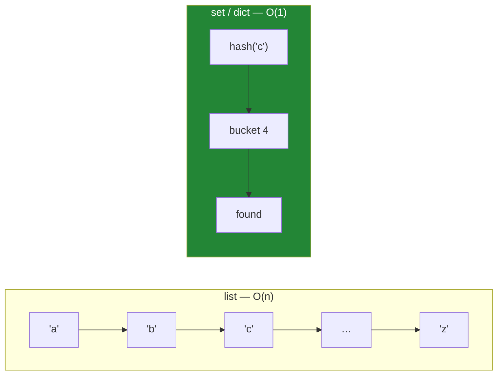

# Day 8 — Lists, tuples, sets, dictionaries

**Phase 1 · Module 1** · IDs: **PY-07** (lists, tuples), **PY-08** (sets, dictionaries, view objects)

> **Yesterday:** strings.
> **Today:** the four containers — and the single measurement that makes the choice between them
> obvious rather than stylistic.
> **Tomorrow:** comprehensions.

```bash
./m start 8 && ./m scaffold 8
```

**Time:** 90 minutes. **Request budget:** 0 model calls.

---

## §1 The story

Beginners choose a container by habit. Everyone uses lists. Lists work.

Then on Day 227 you ingest 500 000 documents and want to skip the ones you have already seen. You
write `if doc_id not in seen:` where `seen` is a list, and the ingestion takes forty minutes instead
of four seconds. Nothing is broken. It is just quadratic.

Here is why, and it is the only complexity fact you need in Phase 1:

- **A list** stores items in order. To find out whether something is in it, Python must look at each
  item until it finds a match. 500 000 items → up to 500 000 comparisons. That is **O(n)**.
- **A set** stores items by their **hash** — a number computed from the value that says roughly
  "which bucket does this live in". Membership is: compute the hash, look in that bucket. That is
  **O(1)** — the same cost whether there are ten items or ten million.

A dictionary is a set with a value attached to each key, and it has exactly the same lookup story.



The price of that speed is the reason today also revisits Day 4: **only immutable objects can be
hashed.** A list cannot be a set member or a dict key, because if you changed it after insertion it
would be sitting in the wrong bucket and would become invisible. A tuple can.

That is the whole day: **order and duplicates → list. Fixed record → tuple. Membership and
uniqueness → set. Lookup by key → dict.** And you are going to *measure* it, not take it on trust.

---

## §2 Setup — run this

```bash
mkdir -p days/day-08/lab
touch days/day-08/lab/containers.py
touch src/setu/collections.py
touch tests/test_collections.py
```

`time` and `random` are standard library. No new packages.

---

## §3 PY-07 — lists and tuples

`days/day-08/lab/containers.py`:

```python
"""PY-07 / PY-08: the four containers, and the measurement that decides between them."""

from __future__ import annotations

import random
import time


def lists() -> None:
    papers = ["attention", "bert"]
    papers.append("gpt")
    papers.extend(["t5", "llama"])
    papers.insert(0, "word2vec")
    print(f"\n{papers=}")

    print(f"{papers.pop()=}      {papers=}")
    papers.remove("bert")
    print(f"after remove('bert'): {papers}")

    print(f"{papers[1:3]=}  {papers[::-1]=}  {papers[::2]=}")

    nums = [3, 1, 2]
    print(f"\n{sorted(nums)=}  original still {nums}   <- sorted() returns new")
    nums.sort()
    print(f"{nums=}  after .sort()                  <- sort() mutates, returns None")


def tuples() -> None:
    point = (2017, "Vaswani")
    year, author = point
    print(f"\n{point=} -> {year=} {author=}")

    try:
        point[0] = 2018
    except TypeError as exc:
        print(f"  immutable: {exc}")

    print(f"{(1,)=}   <- the comma makes the tuple, not the brackets")
    print(f"{type((1))=}  <- no comma: this is just an int")
```

**Line by line:**

- `append` adds one item; `extend` adds every item of an iterable. `papers.append(["a","b"])` puts a
  *list* inside your list — a common and confusing mistake.
- `insert(0, x)` — inserts at the front, which requires shifting **every** other element. Fine once;
  quadratic in a loop. If you need to add at the front repeatedly, use `collections.deque`.
- `pop()` removes and returns the **last** item; `pop(0)` the first (and shifts everything).
- `remove("bert")` removes the **first match by value** and raises `ValueError` if absent.
- `papers[::-1]` — reversed copy. `papers[::2]` — every second item. The third slice number is the step.
- `sorted(nums)` returns a **new** list; `nums.sort()` mutates and returns `None`. Day 4's split,
  visible in two methods that do nearly the same thing. `x = nums.sort()` gives you `None`, and that
  bug appears in real code weekly.
- `point[0] = 2018` raises `TypeError` — tuples are immutable, which is exactly what makes them
  hashable in §4.
- `(1,)` versus `(1)` — **the comma creates the tuple.** `(1)` is an integer in brackets. A missing
  comma in a one-element tuple is a genuinely nasty bug.

**When to use a tuple:** a fixed-size record whose positions have meaning — a coordinate, an
`(id, score)` pair, a `(provider, model)` role from Day 3. If it can grow, it is a list.

---

## §4 PY-08 — sets, dicts, and the measurement

```python
def sets() -> None:
    a = {"attention", "bert", "gpt"}
    b = {"bert", "t5"}
    print(f"\n{a | b=}   <- union")
    print(f"{a & b=}   <- intersection")
    print(f"{a - b=}   <- difference: in a, not in b")
    print(f"{a ^ b=}   <- symmetric difference")
    print(f"{'bert' in a=}")

    print(f"\n{set([3, 1, 2, 1, 3])=}   <- deduped, ORDER NOT PRESERVED")
    try:
        {[1, 2]}
    except TypeError as exc:
        print(f"  unhashable: {exc}   <- a list cannot be a set member")


def dicts() -> None:
    paper = {"title": "Attention", "year": 2017}
    print(f"\n{paper['title']=}")
    print(f"{paper.get('venue')=}          <- None, no exception")
    print(f"{paper.get('venue', 'unknown')=}  <- with a default")

    paper.setdefault("authors", []).append("Vaswani")
    print(f"{paper=}")

    print(f"\n{list(paper.keys())=}")
    print(f"{list(paper.items())[:2]=}")

    view = paper.keys()
    paper["new"] = 1
    print(f"{len(view)=}   <- the VIEW updated; it is a window, not a snapshot")

    merged = {"year": 2016, "venue": "NeurIPS"} | paper
    print(f"{merged['year']=}   <- right-hand side wins")


def measure() -> None:
    n = 200_000
    ids = [f"paper-{i}" for i in range(n)]
    as_list, as_set = ids, set(ids)
    probes = [f"paper-{random.randrange(n)}" for _ in range(1_000)]

    start = time.perf_counter()
    sum(p in as_list for p in probes)
    list_time = time.perf_counter() - start

    start = time.perf_counter()
    sum(p in as_set for p in probes)
    set_time = time.perf_counter() - start

    print(f"\n1000 membership tests over {n:,} items")
    print(f"  list: {list_time:.4f}s")
    print(f"  set:  {set_time:.4f}s")
    print(f"  set is ~{list_time / set_time:,.0f}x faster")


if __name__ == "__main__":
    lists()
    tuples()
    sets()
    dicts()
    measure()
```

**Line by line:**

- `a | b`, `a & b`, `a - b`, `a ^ b` — union, intersection, difference, symmetric difference. On
  Day 169 you will compute retrieval precision and recall, and both are set operations between the
  documents you retrieved and the documents that were relevant. Learn the operators here.
- `set([3, 1, 2, 1, 3])` — duplicates gone, **order not preserved**. If you need order *and*
  uniqueness, that is `dedupe_preserving_order` from Day 4, and now you know it should use a set
  internally for the "have I seen this" test.
- `{[1, 2]}` raises `TypeError: unhashable type` — the Day-4 mutability rule, enforced by the language.
- `paper.get('venue')` returns `None` rather than raising. `paper['venue']` raises `KeyError`.
  **Choose deliberately:** `get` for optional data, `[]` for data whose absence is a bug you want to
  hear about immediately.
- `setdefault("authors", []).append(...)` — "get this key, or create it with `[]` first, then append".
  One line instead of an `if key not in d` dance.
- `paper.keys()` is a **view object**, not a list. It is a live window onto the dict — add a key and
  `len(view)` changes. That is why `list(paper.keys())` exists: to take a snapshot. Iterating a view
  while adding keys raises `RuntimeError`, and correctly so.
- `{"year": 2016, ...} | paper` — dict union (3.9+). **The right operand wins on conflicts.** This is
  the config-override pattern: `defaults | user_settings`.
- `time.perf_counter()` — the correct clock for measuring durations. Not `time.time()`, which can
  jump if the system clock is adjusted.
- `sum(p in as_list for p in probes)` — a generator expression (Day 9/11); here it just forces the
  membership tests to actually run.

**Run it and read the last number.** Whatever it says on your machine — typically several thousand
times — that ratio is the reason this day exists.

---

## §5 Build brief

`src/setu/collections.py`:

```python
"""Container helpers for Setu. Built on the O(1) membership rule from Day 8."""

from __future__ import annotations

from collections.abc import Hashable, Iterable, Sequence
from typing import TypeVar

H = TypeVar("H", bound=Hashable)
T = TypeVar("T")


def unique(items: Iterable[H]) -> list[H]:
    """TODO(me): dedupe, preserving first-seen order, in O(n).

    A list-based `if x not in result` is O(n^2) and will fail the timing test.
    """
    raise NotImplementedError


def counts(items: Iterable[H]) -> dict[H, int]:
    """TODO(me): {item: how many times it appeared}. Do not import Counter - build it."""
    raise NotImplementedError


def chunked(items: Sequence[T], size: int) -> list[Sequence[T]]:
    """TODO(me): split into consecutive chunks of at most `size`. Raise ValueError if size < 1.

    This is Day 164's document chunker with the overlap removed. Same shape.
    """
    raise NotImplementedError
```

- `TypeVar("H", bound=Hashable)` — "any type, as long as it can be hashed". The annotation encodes
  today's rule: you cannot dedupe unhashable things this way.
- `counts` without `collections.Counter` — Principle 2. You will use `Counter` freely from Day 121;
  building it once means you know what it is.
- `chunked` is deliberately the same shape as the RAG chunker on Day 164. Recognising it there is the
  point.

---

## §6 The eval that must be able to fail

`tests/test_collections.py`:

```python
import time

import pytest

from setu.collections import chunked, counts, unique


def test_unique_preserves_first_seen_order():
    assert unique(["b", "a", "b", "c", "a"]) == ["b", "a", "c"]


def test_unique_does_not_mutate_input():
    original = ["b", "a", "b"]
    unique(original)
    assert original == ["b", "a", "b"]


def test_unique_is_not_quadratic():
    """A list-based membership check would take minutes here."""
    items = [f"id-{i}" for i in range(100_000)] * 2
    start = time.perf_counter()
    result = unique(items)
    elapsed = time.perf_counter() - start
    assert len(result) == 100_000
    assert elapsed < 1.0, f"took {elapsed:.1f}s - are you using `in` on a list?"


def test_counts():
    assert counts("abracadabra") == {"a": 5, "b": 2, "r": 2, "c": 1, "d": 1}


def test_counts_of_empty_is_empty():
    assert counts([]) == {}


@pytest.mark.parametrize(
    ("items", "size", "expected"),
    [
        ([1, 2, 3, 4, 5], 2, [[1, 2], [3, 4], [5]]),
        ([1, 2, 3, 4], 2, [[1, 2], [3, 4]]),
        ([], 3, []),
        ([1], 5, [[1]]),
    ],
)
def test_chunked(items, size, expected):
    assert [list(c) for c in chunked(items, size)] == expected


def test_chunked_rejects_zero_size():
    with pytest.raises(ValueError):
        chunked([1, 2, 3], 0)
```

**Line by line:**

- `test_unique_is_not_quadratic` — **the day's real assessment.** It is a *performance* test, and it
  is legitimate here because the difference between O(n) and O(n²) at 200 000 items is not milliseconds,
  it is minutes. A correct-but-quadratic implementation passes every other test and fails this one,
  with a message that tells you exactly what you did.
- `elapsed < 1.0` — a deliberately loose bound. A tight one would be flaky on a loaded machine; this
  one only catches the algorithmic mistake, which is what it is for.
- `test_unique_does_not_mutate_input` — the Day-4 mutation test, third appearance. It is becoming a
  habit, which is the intent.
- `counts("abracadabra")` — a string is iterable, so this works character by character. Free extra
  coverage.
- `[1, 2, 3, 4], 2` **and** `[1, 2, 3, 4, 5], 2` — even and odd. The ragged last chunk is where the
  off-by-one lives.
- `([], 3, [])` — the empty case. Chunkers famously return `[[]]` here, which is wrong.

```bash
uv run python -m pytest tests/test_collections.py -v
```

---

## §7 Request budget

| Resource | Spent today |
|---|---|
| LLM calls | **0** |

---

## §8 Traps

- **`in` against a list in a loop.** O(n²). Today's timing test exists for exactly this.
- **`append` when you meant `extend`.** You get a nested list.
- **`x = nums.sort()`.** `sort()` returns `None`. You wanted `sorted(nums)`.
- **Assuming sets preserve order.** They do not. Dicts do (insertion order, since 3.7).
- **A missing comma in a one-element tuple.** `(1)` is an int.
- **`d[key]` for optional data.** `KeyError` in production. Use `.get(key, default)`.
- **Mutating a dict while iterating its view.** `RuntimeError`. Iterate `list(d.keys())`.
- **Trying to use a list as a dict key.** Unhashable. Use a tuple.
- **`insert(0, x)` in a loop.** Shifts everything each time. Use `deque`.

---

## §9 Verify before you code

Written **2026-08-21**:

- <https://docs.python.org/3/tutorial/datastructures.html> — the canonical tour.
- <https://wiki.python.org/moin/TimeComplexity> — the complexity table for list, set and dict operations.
- <https://docs.python.org/3/library/stdtypes.html#dictionary-view-objects> — what a view is and is not.

---

## §10 Say it in an interview

> "The container choice is a complexity decision, not a style one. Membership in a list is O(n) and in
> a set it's O(1), and at a few hundred thousand items that's the difference between four seconds and
> forty minutes — I've measured it rather than assumed it. The trade is that only hashable, immutable
> things can go in a set or be a dict key, which is the same mutability rule from earlier showing up
> as a language constraint. So my dedupe helper keeps order with a list and does the seen-check with a
> set, and there's a timing test that fails if someone rewrites it with `if x not in result`."

---

## §11 Done when

Tick [`CHECKLIST.md`](CHECKLIST.md), then `./m check && ./m done 8`.
