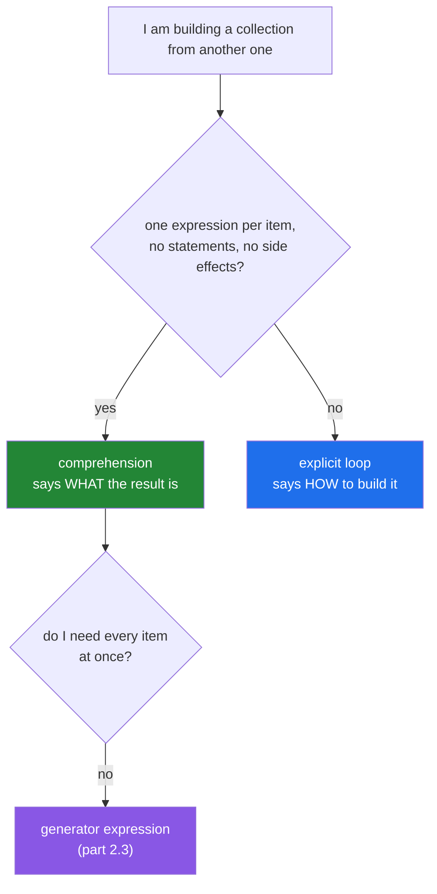

# 1.1 — The loop and the comprehension, read aloud

## One-line answer

A comprehension is an **expression that builds a list**, so it says what the result *is* rather than
describing the steps to accumulate it — and the plan's exercise is to write the same transform both
ways and read both aloud, because the reading is what tells you which one belongs.

---

## The story

Two ways of telling somebody what is for dinner.

The first: *"Get a bowl. For every person at the table, put one portion of rice into the bowl."*

The second: *"Dinner is one portion of rice per person."*

Both get you the same bowl. Only one of them tells you what dinner **is** without your having to
follow along and keep track. If somebody interrupts the first sentence halfway through, you have to
go back to the start; if somebody interrupts the second, you already know the answer.

That is the whole difference between today's tool and yesterday's, and it is not about being shorter.
The plan names this day's exercise directly: *the same transform written as a loop and a
comprehension; read both aloud.*

Here is the pair, on real work:

```text
titles = []
for paper in papers:
    titles.append(paper["title"].strip())
```

```text
titles = [paper["title"].strip() for paper in papers]
```

Read the first aloud: *"titles is an empty list; for each paper, append the tidied title to titles."*
Four nouns, one of which — `titles` — turns up three times and does nothing except collect.

Read the second: *"titles is the tidied title of each paper."*

The loop describes **a procedure that ends with the answer**. The comprehension describes **the
answer**. A reader of the loop has to run it in their head to know what `titles` holds at the end. A
reader of the comprehension does not.

Which is also exactly why a comprehension stops being the right tool the moment the body does more
than produce one value per item — because then there is no single sentence left to read.

---

## The idea in plain language

### The shape

```text
[ <expression>  for <name> in <iterable> ]
```

Three pieces, and they map onto the loop directly:

| Loop | Comprehension |
|---|---|
| `result = []` | the `[` `]` |
| `for paper in papers:` | `for paper in papers` |
| `result.append(expr)` | `expr`, at the front |

The **expression comes first**, which is the part that reads oddly at first and is the reason it reads
well afterwards: the sentence starts with what you are collecting.

It is an **expression**, not a statement
([Day 5, 2.5](../../../day-05-operators-and-conditionals/parts/02-conditionals/2.5-the-conditional-expression.md)),
so it can go anywhere a value goes — as an argument, inside another literal, on the right of an `=`. A
`for` statement cannot.

### It is a loop, and it is faster

A comprehension really does iterate — same `iter`, same `next`, same `StopIteration`
([Day 6, 1.1](../../../day-06-loops/parts/01-iteration/1.1-what-a-for-loop-actually-does.md)). It is not
vectorised and it does not escape the interpreter
([Day 6, 4.2](../../../day-06-loops/parts/04-loop-cost/4.2-the-loop-you-should-not-write.md)).

It is nonetheless measurably faster than the explicit loop, for one specific reason: **the explicit loop
looks up `result.append` on every pass** — an attribute lookup and a method call — while the
comprehension uses a dedicated bytecode that appends directly. Typically 20–40% on a simple body.

That is a nice side effect and it is not the argument. The argument is the reading.

### The three things a comprehension cannot do

1. **Statements.** No `if x:` with a colon, no `while`, no `try`, no `return`, no assignment (except the
   walrus, [3.2](../03-when-not-to/3.2-comprehension-scope.md)).
2. **Side effects, legibly.** `[print(x) for x in items]` works, builds a list of `None`s nobody wants,
   and is a loop written in a costume.
3. **More than one output per input.** One item in, at most one item out — unless you nest
   ([1.4](1.4-nested-comprehensions.md)).

Those three are the boundary. When you need any of them, the loop is not a fallback; it is the correct
tool.



### The four shapes, one syntax

The same three-piece structure builds all four containers
([Day 8](../../../day-08-containers/parts/02-sets-and-dicts/2.1-a-set-is-a-hash-table.md)):

```text
[expr for x in it]        -> a list
{expr for x in it}        -> a set          (part 2.2)
{k: v for x in it}        -> a dict         (part 2.1)
(expr for x in it)        -> a GENERATOR    (part 2.3) - not a tuple
```

The last one is the one to note now: parentheses do **not** give a tuple. There is no tuple
comprehension; `tuple(expr for x in it)` is how you get one, and the thing in the middle is a generator.

### `map` exists and is usually not the answer

`list(map(str.strip, titles))` does the same as `[t.strip() for t in titles]`. It is marginally faster
when the function is already a built-in C function, and it is worse the moment the expression is
anything other than a bare function call — `list(map(lambda p: p["title"].strip(), papers))` reads worse
than the comprehension by any measure.

Day 11 (`PY-12`) covers `map` and `lambda` properly. The comprehension is the default.

---

## Why Setu needs it

- **[1.2](1.2-the-filter-clause.md), next,** adds the filter, which is where the comprehension starts
  replacing whole loop bodies.
- **[Day 8's containers](../../../day-08-containers/parts/03-dedup/3.2-order-preserving-dedup.md)** were
  built with explicit loops; several of them are one line today, and
  [Day 8's build brief](../../../day-08-containers/parts/02-sets-and-dicts/2.4-get-setdefault-and-counter.md)
  functions get rewritten.
- **[Day 7's normaliser](../../../day-07-strings/parts/04-normalising/4.1-the-title-normaliser.md)**
  applied to five hundred titles is `[normalise_title(t) for t in raw]`.
- **Day 20's NumPy** (`NP-01`) replaces even the comprehension for numeric work, and knowing that a
  comprehension is still a Python-level loop is what makes that a real distinction rather than a rule.
- **Day 26's pandas** (`PD-`) has the same lesson at frame scale: `df["x"].str.strip()` beats a
  comprehension over rows, for the same reason a comprehension beats an explicit loop only slightly.
- **Day 76 onwards** (`ML-`), feature-building code is almost entirely comprehensions, and readability
  there is the difference between a pipeline you can audit for leakage (Principle 8) and one you cannot.

---

## The mechanism

The pair, and the reading:

```python
"""The plan's exercise: the same transform, both ways. Read each aloud."""

papers = [
    {"title": "  Attention Is All You Need  ", "year": 2017},
    {"title": "BERT\n", "year": 2018},
    {"title": " Deep Residual Learning ", "year": 2015},
]

titles_loop = []
for paper in papers:
    titles_loop.append(paper["title"].strip())

titles_comp = [paper["title"].strip() for paper in papers]

print(f"loop          : {titles_loop}")
print(f"comprehension : {titles_comp}")
print(f"identical     : {titles_loop == titles_comp}")

print()
print("read them aloud:")
print("    loop : 'titles is empty; for each paper, append the stripped title to titles'")
print("    comp : 'titles is the stripped title of each paper'")
```

**Line by line:**

- `titles_loop = []` then `.append(...)` — the accumulator appears **three times** and carries no meaning
  of its own. It exists because the loop has to put the result somewhere.
- `[paper["title"].strip() for paper in papers]` — the expression `paper["title"].strip()` comes first.
  There is no accumulator to name, so there is no name to get wrong.
- `titles_loop == titles_comp` is `True` — **the equivalence check**, which is the assertion to keep in a
  test whenever you replace one form with the other
  ([Day 8, 3.1](../../../day-08-containers/parts/03-dedup/3.1-ten-thousand-ids-timed.md)).
- The two spoken sentences are the deliverable of this part. If the comprehension version cannot be said
  in one sentence, it is the wrong form — which is
  [3.1](../03-when-not-to/3.1-when-a-comprehension-is-wrong.md)'s rule.

The four shapes, and the one that is not a tuple:

```python
"""One syntax, four containers - and parentheses do not give you a tuple."""

papers = [
    {"title": "Attention", "year": 2017},
    {"title": "BERT", "year": 2018},
    {"title": "ResNet", "year": 2015},
    {"title": "GPT", "year": 2018},
]

as_list = [p["year"] for p in papers]
as_set = {p["year"] for p in papers}
as_dict = {p["title"]: p["year"] for p in papers}
as_gen = (p["year"] for p in papers)

print(f"list   : {as_list}")
print(f"set    : {sorted(as_set)}   <- duplicates gone, order arbitrary")
print(f"dict   : {as_dict}")
print(f"gen    : {as_gen}")
print(f"         type is {type(as_gen).__name__}, NOT a tuple")
print(f"         consumed once: {list(as_gen)}")
print(f"         and now empty: {list(as_gen)}")
print(f"a real tuple needs a call: {tuple(p['year'] for p in papers)}")
```

**Line by line:**

- `{p["year"] for p in papers}` — a **set** comprehension, so `2018` appears once and the order is
  arbitrary ([Day 8, 2.1](../../../day-08-containers/parts/02-sets-and-dicts/2.1-a-set-is-a-hash-table.md)).
  `sorted()` in the printout for that reason.
- `{p["title"]: p["year"] for p in papers}` — a **dict** comprehension. The colon is what distinguishes
  it from a set comprehension, and it is the only difference in the syntax
  ([2.1](../02-dict-set-gen/2.1-dict-comprehensions.md)).
- `(p["year"] for p in papers)` — prints as `<generator object <genexpr> at 0x...>`. **Not a tuple**, not
  a list, and consumed on first use: the second `list(as_gen)` is `[]`
  ([Day 6, 1.1](../../../day-06-loops/parts/01-iteration/1.1-what-a-for-loop-actually-does.md)).
- `tuple(p['year'] for p in papers)` — the call materialises the generator into a tuple. **There is no
  tuple comprehension**, and this is why.

The speed difference, and where it comes from:

```python
"""A comprehension is a loop. It is faster only because it skips the attribute lookup."""

import time

data = list(range(500_000))


def with_loop(values: list[int]) -> list[int]:
    out = []
    for value in values:
        out.append(value * 2)
    return out


def with_loop_bound(values: list[int]) -> list[int]:
    out = []
    append = out.append
    for value in values:
        append(value * 2)
    return out


def with_comprehension(values: list[int]) -> list[int]:
    return [value * 2 for value in values]


def with_map(values: list[int]) -> list[int]:
    return list(map(lambda v: v * 2, values))


reference = with_comprehension(data)
for label, fn in (
    ("explicit loop           ", with_loop),
    ("loop, append pre-bound  ", with_loop_bound),
    ("comprehension           ", with_comprehension),
    ("map + lambda            ", with_map),
):
    started = time.perf_counter()
    result = fn(data)
    elapsed = time.perf_counter() - started
    print(f"{label} {elapsed:>7.4f}s   same answer: {result == reference}")
```

**Line by line:**

- `with_loop` — `out.append` is looked up on the object **every pass**: an attribute lookup, then a
  method call ([Day 5, 1.1](../../../day-05-operators-and-conditionals/parts/01-operators/1.1-an-operator-is-a-method-call.md)).
- `with_loop_bound` — `append = out.append` hoists the lookup out of the loop. **It closes most of the
  gap**, which is the evidence for what the comprehension's advantage actually is: not magic, just one
  fewer lookup per item.
- `with_comprehension` — a dedicated `LIST_APPEND` bytecode, no lookup at all.
- `with_map` with a lambda — usually the slowest here, because every item is a Python-level function
  call. `map(str.strip, ...)` with a built-in C function would be competitive.
- `result == reference` on every row — **the equivalence assertion again.** A benchmark of four functions
  that do different things proves nothing.
- **The gaps are tens of percent, not orders of magnitude.** A comprehension does not escape the
  interpreter; that is [Day 6, 4.2](../../../day-06-loops/parts/04-loop-cost/4.2-the-loop-you-should-not-write.md)'s
  subject and it needs NumPy.

---

## When it breaks

**A statement where an expression belongs:**

```text
>>> [x = 1 for x in range(3)]
  File "<stdin>", line 1
    [x = 1 for x in range(3)]
     ^^^^^
SyntaxError: invalid syntax
>>> [if x > 1: x for x in range(3)]
  File "<stdin>", line 1
    [if x > 1: x for x in range(3)]
     ^^
SyntaxError: invalid syntax
```

**What it means.** A comprehension's first slot takes an **expression**. Assignment is a statement, and
so is `if ... :`. The conditional *expression* `x if x > 1 else 0` is legal there, and the difference
between that and the filter `if` is
[1.3](1.3-the-two-ifs.md)'s entire subject.

**The comprehension used for its side effect:**

```text
>>> results = [print(x) for x in ["a", "b"]]
a
b
>>> results
[None, None]
```

**What it means.** It ran, it printed, and it built a two-element list of `None` that nobody wants.
**Ruff flags this** (`C417`/`B015` family, depending on the shape) because it is a loop wearing a
costume: the value is discarded, so the brackets are pure waste and the intent is hidden. Write the
loop.

**The generator mistaken for a tuple:**

```text
>>> t = (x * 2 for x in range(3))
>>> t
<generator object <genexpr> at 0x7f3c8a1b2d10>
>>> t[0]
Traceback (most recent call last):
  File "<stdin>", line 1, in <module>
TypeError: 'generator' object is not subscriptable
>>> len(t)
Traceback (most recent call last):
  File "<stdin>", line 1, in <module>
TypeError: object of type 'generator' has no len()
```

**What it means.** Parentheses give a generator, which has no length and no positions
([2.3](../02-dict-set-gen/2.3-the-generator-expression.md)). The `repr` is the tell — if you see
`<generator object>` where you expected data, you wrote parentheses where you wanted brackets.

**And the one that is not an error at all:**

```text
>>> papers = [{"title": "a"}, {"title": "b"}]
>>> titles = [p["title"] for p in papers]
>>> papers.append({"title": "c"})
>>> titles
['a', 'b']
```

**What it means.** A list comprehension is evaluated **immediately** and completely: `titles` is a
snapshot, not a view onto `papers`
([Day 8, 2.5](../../../day-08-containers/parts/02-sets-and-dicts/2.5-view-objects-are-windows.md)). That
is usually what you want, and it is the opposite of a generator expression, which would see the new
item. Knowing which one you have is the difference between a stale result and a surprising one.

---

## In production

**The comprehension is the default for building a collection, and the loop is the deliberate choice.**
In a mature codebase, `[f(x) for x in items]` is so routine that a reviewer reads it as a single token,
and an explicit accumulate-and-append loop draws a question: what else is the body doing? That question
is a good one — usually the answer is "nothing", and the loop should be a comprehension; sometimes it is
"logging and counting", and then the loop is right and the reviewer has learned something about the
code.

**Assert the equivalence when you convert one to the other.** Rewriting a loop as a comprehension is a
refactor, and the test is `assert old_impl(data) == new_impl(data)` on a realistic input before deleting
the old one. This catches the two mistakes that conversions make: dropping a side effect that mattered,
and changing the order of a filter relative to a transform
([1.3](1.3-the-two-ifs.md)).

**Do not chase the speed.** The 20–40% is real and is almost never the reason a function is slow; the
reasons are the ones from [Day 6](../../../day-06-loops/parts/04-loop-cost/4.1-the-accidental-quadratic.md)
— an accidental quadratic, I/O that should be batched, or numeric work that should be vectorised. A
comprehension is still a Python-level loop paying an interpreter dispatch per item, so converting a hot
numeric loop to a comprehension is polishing the wrong surface.

**What changes at scale is memory, and that is the real decision.** `[f(x) for x in huge]` materialises
every result at once; on a file-sized input that is the out-of-memory kill with no traceback
([Day 6, 1.1](../../../day-06-loops/parts/01-iteration/1.1-what-a-for-loop-actually-does.md)). The
generator expression — one character different — streams and holds one item at a time
([2.3](../02-dict-set-gen/2.3-the-generator-expression.md)). The habit worth building is to ask, every
time you write a comprehension over something unbounded, whether the consumer needs the whole list or
just to iterate it once. Usually it is the second.

**The review comment a senior engineer leaves.** On an accumulate-and-append loop: *"This is
`[p['title'].strip() for p in papers]` — the accumulator does not carry any meaning and the loop makes a
reader simulate it to know what comes out. If the body is going to grow a logging line, keep the loop
and say so in a comment; otherwise convert it and add an equality assertion in the test."*

**The interview question.** *"What is a list comprehension and why use one?"* The answer is that it is an
expression that builds a list from an iterable, so it states what the result **is** rather than
describing the procedure that accumulates it — and it can go anywhere a value goes, which a `for`
statement cannot. The follow-up worth being ready for is *"is it faster?"* — yes, modestly, because it
uses a dedicated append bytecode instead of looking up `list.append` every pass, but it is still a
Python-level loop and that is not the reason to use one. And *"when would you not?"* — when the body
needs statements, has side effects, or produces more than one value per item; and when the result is
large enough that you want a generator instead.

---

## Check yourself

```bash
uv run python -c "
papers = [{'t': '  a  '}, {'t': 'b\n'}, {'t': ' c '}]
loop = []
for p in papers: loop.append(p['t'].strip())
comp = [p['t'].strip() for p in papers]
print('identical:', loop == comp, comp)
print('list :', [p['t'].strip() for p in papers])
print('set  :', {len(p['t']) for p in papers})
print('dict :', {p['t'].strip(): len(p['t']) for p in papers})
g = (p['t'].strip() for p in papers)
print('paren:', type(g).__name__, '<- NOT a tuple')
print('first pass :', list(g))
print('second pass:', list(g), '<- consumed')
print('tuple needs a call:', tuple(p['t'].strip() for p in papers))
"
```

Say both versions of the first transform aloud before running it.

**Answer out loud, without scrolling up:**

> Read a loop and its comprehension aloud and say what the difference is, in terms of *what* versus
> *how*. Then name the three things a comprehension cannot do, and say what parentheses give you
> instead of a tuple.

---

**Next:** [1.2 — The filter clause, and where the `if` goes](1.2-the-filter-clause.md)
