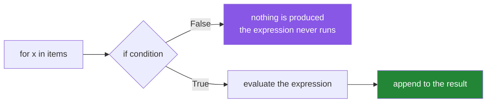

# 1.2 — The filter clause, and where the `if` goes

## One-line answer

An `if` **after** the `for` filters — items failing it produce nothing at all — and because the filter
runs before the expression, `[int(x) for x in values if x.isdigit()]` is safe where the same
conversion without the guard raises.

---

## The story

You are copying an old address book into a new one.

Most entries have a name and a phone number. Some have only a name — the number was never written
down, or it got scribbled out years ago. You copy across the complete ones and skip the rest, because
an entry with no number is no use in the new book.

You have just made a decision, and you did not write it down anywhere. Forty people are no longer in
your address book, and there is nothing on any page to say they ever were, or how many of them there
were. In a year you will look for one of them, not find them, and assume you never had their number
in the first place.

Here is the same quiet decision, in code. A parser turning a column of text into numbers:

```text
years = [int(value) for value in column]
```

It runs for months. Then a row arrives where the year is empty — a blank cell from a spreadsheet
export — and the whole job stops with
`ValueError: invalid literal for int() with base 10: ''`.

The first fix somebody reaches for is a `try`. Comprehensions do not take statements
([1.1](1.1-the-loop-and-the-comprehension.md)), so that means giving up the comprehension and writing
a loop, which is what happens: eight lines, a `try`, a `continue`, and a counter that nobody thought
to add.

The one-word fix is a filter:

```text
years = [int(value) for value in column if value.strip().isdigit()]
```

Blank cells produce nothing at all. The conversion never sees them, because **the filter runs first**.

And here is the sting. The fixed version quietly drops rows. Two hundred blank cells become two
hundred missing years, and the report's total is quietly lower than it should be. **A filter is a
decision to throw things away**, and a filter nobody counted is a data loss nobody logged — which is
why the loop version, with its counter, was not entirely wrong.

---

## The idea in plain language

### The shape, and the order of evaluation

```text
[ <expression>  for <name> in <iterable>  if <condition> ]
```

The reading order and the execution order are **different**, and that is the thing to hold:

- **You read**: expression, then source, then filter.
- **It runs**: source, then filter, then expression.

So the expression only ever sees items that passed. That is why the story's fix works: `int(value)` is
never evaluated for a blank string.

Written as a loop, the equivalence is exact:

```text
result = []
for name in iterable:
    if condition:
        result.append(expression)
```

The filter `if` is the loop's guard, and it maps onto
[Day 6, 2.2](../../../day-06-loops/parts/02-control-flow/2.2-continue-and-the-skipped-increment.md)'s
`continue` — with the same property that everything after it is skipped.



### Several filters chain with `and`

```text
[x for x in items if x.isdigit() if int(x) > 2000]
```

Each `if` must pass, and they are evaluated **left to right with short-circuiting**
([Day 5, 2.4](../../../day-05-operators-and-conditionals/parts/02-conditionals/2.4-and-or-return-operands.md)).
So `int(x)` in the second filter is safe, because the first already established that `x` is digits.

`if a if b` and `if a and b` are equivalent. The chained form is useful exactly when the later
condition depends on the earlier one having passed; otherwise `and` reads better.

### The filter cannot see the expression

The condition is evaluated against the loop variable, not against the expression's result. So this does
**not** work:

```text
[normalise(t) for t in titles if normalise(t)]      # calls normalise TWICE
```

Two calls per item, and if `normalise` is expensive that is double the cost. Two fixes:

- **The walrus operator**: `[n for t in titles if (n := normalise(t))]` — computed once, filtered on,
  and used ([3.2](../03-when-not-to/3.2-comprehension-scope.md)).
- **Nest the comprehensions**: `[n for n in (normalise(t) for t in titles) if n]` — the inner one
  transforms, the outer filters.

Both are legitimate; the walrus is shorter and the nested form is clearer to more readers.

### Filtering is discarding, and discarding should be counted

`len(source) - len(result)` is the number of rows the filter removed. In a pipeline that number belongs
in a log line, for the same reason
[Day 6, 2.2](../../../day-06-loops/parts/02-control-flow/2.2-continue-and-the-skipped-increment.md)
insists on a reconciliation: **a filter that reports only what it kept is half a result**, and a rate
that changes overnight is an upstream change worth knowing about.

That is the one genuine argument for the loop over the comprehension here — the loop has somewhere to
put the counter. The comprehension's answer is to compute the difference afterwards, which is one
subtraction and is usually enough.

### Filter then transform, or transform then filter?

They are different operations and produce different results when the transform can fail:

- `[int(x) for x in xs if x.isdigit()]` — filter on the **raw** value; the transform is protected.
- `[y for y in (convert(x) for x in xs) if y > 0]` — filter on the **converted** value; the transform
  runs on everything.

Choosing the wrong one either lets a bad value into the transform or filters on the wrong thing. The
question to ask is **which value the condition is really about**.

---

## Why Setu needs it

- **[1.3](1.3-the-two-ifs.md), next,** is the other `if` — the conditional expression in the value slot
  — and the two are constantly confused. This part is half of that comparison.
- **[Day 6, 2.2](../../../day-06-loops/parts/02-control-flow/2.2-continue-and-the-skipped-increment.md)**
  is the loop form, with the counters that a comprehension has nowhere to put.
- **[Day 7's normaliser](../../../day-07-strings/parts/04-normalising/4.1-the-title-normaliser.md)**
  returns `None` for a blank title, so the pipeline that applies it is
  `[key for t in raw if (key := normalise_title(t))]` — a filter and a walrus.
- **Day 26's pandas** (`PD-`) replaces this with a boolean mask, and the mask uses `&` rather than `and`
  for the reason in
  [Day 5, 1.5](../../../day-05-operators-and-conditionals/parts/01-operators/1.5-bitwise-and-the-mask.md).
- **Day 76's data preparation** (`ML-`) filters rows before splitting. **Every filter is a decision about
  what the model never sees**, and an uncounted one is a silent change to the population (Principle 8's
  neighbourhood).
- **Day 164's chunking** (`RAG-04`) drops empty and near-duplicate chunks before embedding, where each
  one filtered out is a model call saved (Principle 5).

---

## The mechanism

The filter, and the order that makes it safe:

```python
"""The filter runs before the expression. That is why the guard works."""

column = ["2017", "2018", "", "2015", "n/a", "  2019  "]

print("without a filter:")
try:
    [int(value) for value in column]
except ValueError as exc:
    print(f"    ValueError: {exc}")

years = [int(value) for value in column if value.strip().isdigit()]
print(f"with a filter   : {years}")
print(f"kept {len(years)} of {len(column)}, dropped {len(column) - len(years)}")

print()
print("the loop it is equivalent to:")
years_loop = []
for value in column:
    if value.strip().isdigit():
        years_loop.append(int(value))
print(f"    {years_loop}   identical: {years_loop == years}")
```

**Line by line:**

- `[int(value) for value in column]` raises on the empty string. **The comprehension has no way to
  recover** — no `try`, no `continue` — which is the constraint that makes the filter the answer rather
  than an optimisation.
- `if value.strip().isdigit()` — the guard. `.strip()` first because `" 2019 "` is a legitimate year
  with whitespace ([Day 7, 2.1](../../../day-07-strings/parts/02-methods/2.1-normalising-strip-and-case.md)),
  and `.isdigit()` because it answers exactly the question `int()` cares about. Note `isdigit()` is
  `False` for `"-5"` and `"3.0"`, so this filter also silently drops negatives and floats — **a filter
  is a specification, and this one says "unsigned whole numbers only"**.
- `len(column) - len(years)` — **the count of what was discarded.** One subtraction, and it is the line
  the story's report was missing.
- The loop version is character-for-character the mapping from the idea section: `if` becomes the guard,
  `append(expr)` becomes the expression at the front.
- `years_loop == years` — the equivalence assertion
  ([1.1](1.1-the-loop-and-the-comprehension.md)).

Chained filters, short-circuiting, and the double call:

```python
"""Several ifs chain with and, left to right. And the filter cannot see the expression."""

values = ["2017", "", "1999", "n/a", "2021"]

print("two filters, the second depending on the first:")
recent = [int(v) for v in values if v.isdigit() if int(v) > 2000]
print(f"    {recent}")
print("    the second filter is safe because the first already proved v is digits")

print()
print("the same thing with `and`:")
print(f"    {[int(v) for v in values if v.isdigit() and int(v) > 2000]}")

print()
calls = {"n": 0}


def normalise(title: str) -> str:
    calls["n"] += 1
    return title.strip().casefold()


titles = ["  Attention  ", "", "   ", "BERT"]

calls["n"] = 0
naive = [normalise(t) for t in titles if normalise(t)]
print(f"naive  : {naive}   normalise called {calls['n']} times for {len(titles)} titles")

calls["n"] = 0
walrus = [n for t in titles if (n := normalise(t))]
print(f"walrus : {walrus}   normalise called {calls['n']} times")

calls["n"] = 0
nested = [n for n in (normalise(t) for t in titles) if n]
print(f"nested : {nested}   normalise called {calls['n']} times")
```

**Line by line:**

- `if v.isdigit() if int(v) > 2000` — two filters, both must pass, evaluated left to right. **`int(v)`
  in the second cannot raise**, because the first filter already excluded non-digits — the same
  short-circuit guarantee as `and`
  ([Day 5, 2.4](../../../day-05-operators-and-conditionals/parts/02-conditionals/2.4-and-or-return-operands.md)).
- The `and` version is identical in behaviour and reads better here. **Use chained `if`s when the
  conditions are conceptually separate filters**, and `and` when they are one condition.
- `[normalise(t) for t in titles if normalise(t)]` — **eight calls for four titles.** The filter cannot
  see the expression's result, so the work is done twice. On an expensive normaliser over five hundred
  titles that is five hundred wasted calls.
- `[n for t in titles if (n := normalise(t))]` — the walrus assigns and tests in one step, so `n` is
  computed **once** and reused in the value slot. Four calls
  ([3.2](../03-when-not-to/3.2-comprehension-scope.md) covers the scope rules).
- `[n for n in (normalise(t) for t in titles) if n]` — the inner generator transforms, the outer
  comprehension filters. Also four calls, no walrus, and arguably clearer.
- Both fixes preserve the filter-on-truthiness behaviour, which is correct here because an empty
  normalised title and a missing one mean the same thing
  ([Day 5, 2.2](../../../day-05-operators-and-conditionals/parts/02-conditionals/2.2-truthiness.md)).

Filter-then-transform versus transform-then-filter:

```python
"""Two orders, two meanings. The question is which value the condition is about."""

raw = ["10", "-3", "abc", "0", "25"]


def to_score(text: str) -> int:
    return int(text)


print("filter the RAW value (the transform is protected):")
safe = [to_score(x) for x in raw if x.lstrip("-").isdigit()]
print(f"    {safe}")

print("filter the CONVERTED value (the transform runs on everything):")
positives = [score for score in (to_score(x) for x in raw if x.lstrip("-").isdigit()) if score > 0]
print(f"    {positives}")

print()
print("filtering the converted value WITHOUT the guard raises:")
try:
    [score for score in (to_score(x) for x in raw) if score > 0]
except ValueError as exc:
    print(f"    ValueError: {exc}")

print()
print("and the count of everything discarded, at each stage:")
convertible = [x for x in raw if x.lstrip("-").isdigit()]
print(f"    {len(raw)} raw -> {len(convertible)} convertible -> {len(positives)} positive")
print(
    f"    dropped {len(raw) - len(convertible)} unparseable, "
    f"{len(convertible) - len(positives)} non-positive"
)
```

**Line by line:**

- `x.lstrip("-").isdigit()` — handles the negative case that plain `isdigit()` rejects. Note this is
  `lstrip` with a **character set**, which is correct here because a leading minus is exactly what we
  are removing ([Day 7, 2.1](../../../day-07-strings/parts/02-methods/2.1-normalising-strip-and-case.md)).
- The second version has **both** filters: one on the raw value to protect the conversion, one on the
  converted value to express the actual requirement. **Two filters because there are two questions.**
- Removing the raw-value guard raises on `"abc"` — the generator's expression runs on everything before
  the outer filter sees anything.
- The three-stage count is the shape a production filter chain should report: how many arrived, how many
  survived each stage, and how many were dropped for each reason. **Without it, "we processed 3 rows" is
  indistinguishable from "we processed 3 of 5 rows".**

---

## When it breaks

**The expression that raised because there was no filter:**

```text
>>> [int(v) for v in ["2017", ""]]
Traceback (most recent call last):
  File "<stdin>", line 1, in <module>
ValueError: invalid literal for int() with base 10: ''
```

**What it means.** The traceback points at the comprehension line and names the offending value, which
is more than the equivalent loop would give you in a stack trace. The fix is a filter, not a `try` —
and if you genuinely need per-item error handling, you need a loop
([3.1](../03-when-not-to/3.1-when-a-comprehension-is-wrong.md)).

**The filter in the wrong place:**

```text
>>> values = ["2017", "", "2018"]
>>> [int(v) if v else 0 for v in values]
[2017, 0, 2018]
>>> [int(v) for v in values if v]
[2017, 2018]
```

**What it means.** Both are legal and they do different things: the first **keeps** every item, replacing
the bad ones with `0`; the second **drops** them. Three items versus two. Neither raises, and choosing
the wrong one silently changes the row count or invents data. This is
[1.3](1.3-the-two-ifs.md)'s subject, and it is the most confusing thing about comprehensions.

**The double evaluation, which is silent:**

```text
>>> calls = 0
>>> def f(x):
...     global calls; calls += 1; return x * 2
...
>>> [f(x) for x in range(5) if f(x) > 2]
[4, 6, 8]
>>> calls
10
```

**What it means.** Ten calls for five items. **No error**, just twice the work — and if `f` had a side
effect (a counter, a log line, a network call) it happened twice per item. The walrus or a nested
generator fixes it, and the tell is seeing the same call in both the expression and the filter.

**And the rows that vanished:**

```text
>>> column = ["2017", "2018", "", "2015", "n/a", "-5", "3.0"]
>>> years = [int(v) for v in column if v.isdigit()]
>>> years
[2017, 2018, 2015]
>>> len(column), len(years)
(7, 3)
```

**What it means.** Four of seven rows gone: the blank, the `n/a`, **the negative and the float**. The
last two are legitimate numbers that `isdigit()` rejects, and nothing said so. A filter is a
specification of what you accept, and an over-narrow one discards valid data with no error at all —
which is why the count belongs in the log and why the filter deserves a test with a negative in it.

---

## In production

**A filter is a discard, so count it and log it.** `len(source) - len(result)` is one subtraction, and a
pipeline that emits it turns a silent data loss into an observable metric. Real filter chains log a
count per stage and per reason, because "3 of 7 rows survived" prompts a question and "3 rows
processed" does not. When the reasons matter individually, the loop with its counters
([Day 6, 2.2](../../../day-06-loops/parts/02-control-flow/2.2-continue-and-the-skipped-increment.md)) is
the honest form and the comprehension is not.

**Write the filter against the value the condition is really about.** Guarding the raw value protects
the transform; filtering the converted value expresses the requirement. Most real pipelines need both,
in that order, and conflating them produces either a crash on bad input or a filter that tests the wrong
thing. Naming the stages — `convertible`, then `positive` — makes the two-stage structure visible and
gives each one somewhere to report from.

**Beware the over-narrow predicate.** `isdigit()` looks like "is this a number" and is not: it rejects
negatives, decimals, and — because it is Unicode-aware — accepts superscripts and other digit characters
that `int()` then handles differently. The general lesson is that a filter's predicate is a
specification, and the way to pin it down is a parametrised test with the edge cases in it: a negative,
a decimal, a blank, a `None`, and something with whitespace
([Day 2, 3.1](../../../day-02-quality-gate/parts/03-pytest/3.1-the-test-that-can-go-red.md)).

**What changes at scale.** The filter runs per item and short-circuits, so **order the conditions
cheapest and most selective first** — exactly as with the operands of `and`
([Day 5, 2.4](../../../day-05-operators-and-conditionals/parts/02-conditionals/2.4-and-or-return-operands.md)).
A cheap `if x` before a filter that hits the network is the difference between a minute and an hour. And
if the filter is highly selective over a huge source, the comprehension still materialises only what
survives — but it consumes the whole source, so a generator expression is the form that also streams
([2.3](../02-dict-set-gen/2.3-the-generator-expression.md)).

**The review comment a senior engineer leaves.** On `years = [int(v) for v in column if v.isdigit()]`:
*"`isdigit()` rejects negatives and decimals, so we are silently dropping valid rows on top of the blank
ones — and nothing counts them. Log `len(column) - len(years)`, and add test cases for `'-5'` and
`'3.0'` so the predicate's actual specification is pinned down."*

**The interview question.** *"Where does the `if` go in a list comprehension?"* The answer is that a
filter `if` goes **after** the `for`, and items that fail it produce nothing — and the important
consequence is that the filter runs **before** the expression, so it can guard a conversion that would
otherwise raise. The follow-up worth being ready for is *"what about an `if` before the `for`?"* — that
is a conditional expression in the value slot and it **keeps** every item while changing its value,
which is a completely different operation and the most common confusion in comprehensions. Strong
answers add that multiple filters chain with short-circuiting `and`, that the filter cannot see the
expression's result so a naive `[f(x) for x in xs if f(x)]` calls `f` twice, and that the walrus or a
nested generator fixes it.

---

## Check yourself

```bash
uv run python -c "
column = ['2017', '2018', '', '2015', 'n/a', '-5', '3.0']
try:
    [int(v) for v in column]
except ValueError as exc:
    print('no filter :', exc)
years = [int(v) for v in column if v.isdigit()]
print('filtered  :', years, f'| kept {len(years)} of {len(column)}')
print('the two ifs:')
print('   drops  :', [int(v) for v in column if v.isdigit()])
print('   keeps  :', [int(v) if v.isdigit() else 0 for v in column])
calls = {'n': 0}
def f(x):
    calls['n'] += 1
    return x * 2
print('naive  :', [f(x) for x in range(5) if f(x) > 2], 'calls:', calls['n'])
calls['n'] = 0
print('walrus :', [y for x in range(5) if (y := f(x)) > 2], 'calls:', calls['n'])
"
```

The `drops`/`keeps` pair produce different lengths. That is the next part.

**Answer out loud, without scrolling up:**

> Say where the filter `if` goes and in what order the pieces are evaluated. Then explain why
> `[f(x) for x in xs if f(x)]` calls `f` twice, and give one way to fix it.

---

**Next:** [1.3 — The two `if`s that look identical](1.3-the-two-ifs.md)
