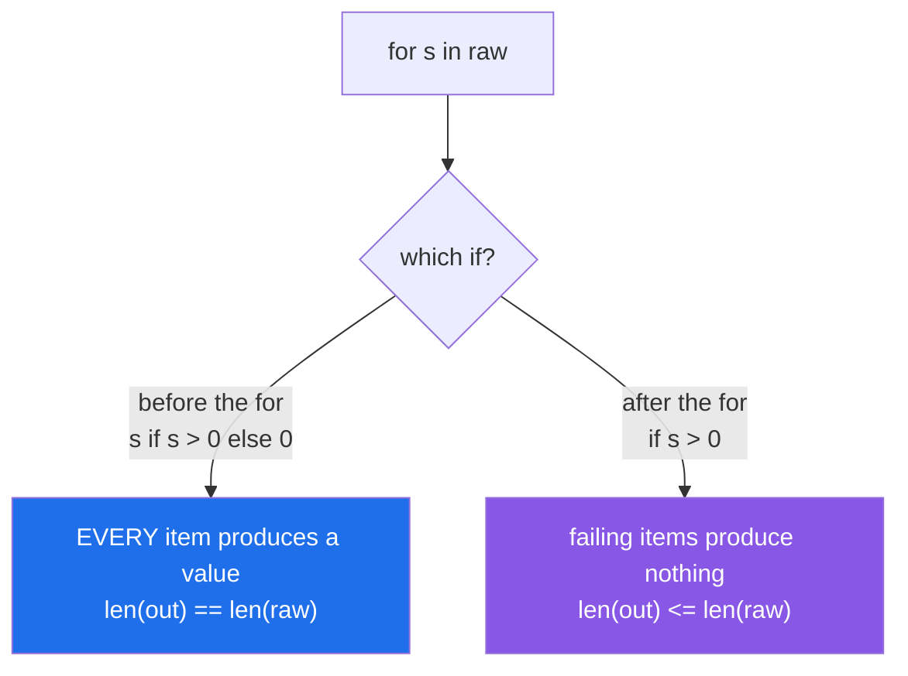

# 1.3 — The two `if`s that look identical

## One-line answer

An `if` **before** the `for` is a conditional expression that changes each item's **value** and keeps
every one; an `if` **after** the `for` is a filter that **drops** items — so one preserves the length
and the other does not, and choosing the wrong one either invents data or loses rows.

---

## The story

A scoring pipeline, one line, changed once.

```text
scores = [s if s > 0 else 0 for s in raw_scores]
```

Every raw score is kept; negatives become zero. Two thousand rows in, two thousand rows out. Correct
for the requirement, which was "clamp negatives at zero".

Six months later the requirement changes to "ignore negative scores". Somebody moves the `if`:

```text
scores = [s for s in raw_scores if s > 0]
```

Also correct — and the downstream code computes a mean by dividing the sum by a **stored** row count
from earlier in the pipeline. The list is now shorter than that count. The mean is silently too low,
by exactly the proportion of negative scores, and it stays wrong for a quarter because 0.71 is as
plausible as 0.83.

The two lines differ by moving five characters. One preserves length and one does not, and **the type
system, the linter and the tests all see two valid comprehensions**. The only thing that catches it is
knowing that these are different operations and asserting the length.

---

## The idea in plain language

### Two positions, two jobs

```text
[ s if s > 0 else 0    for s in raw ]      <- the VALUE slot: a conditional expression
[ s                    for s in raw  if s > 0 ]   <- after the for: a FILTER
```

| | before the `for` | after the `for` |
|---|---|---|
| Called | conditional expression (ternary) | filter clause |
| Job | choose **which value** | choose **whether** |
| `else` | **mandatory** | not allowed |
| Output length | **same as input** | ≤ input |
| Loop equivalent | `append(a if c else b)` | `if c: append(x)` |

The `else` is the tell. A conditional expression must produce a value on every path
([Day 5, 2.5](../../../day-05-operators-and-conditionals/parts/02-conditionals/2.5-the-conditional-expression.md)),
so it always has one; a filter never does. **If you see an `else`, it is in the value slot.**



### They compose, and then it gets hard to read

Both can appear at once:

```text
[ s if s > 0 else 0  for s in raw  if s is not None ]
```

Read it in execution order: for each `s` in `raw`, **if it is not None** (filter), produce **`s` or `0`**
(value). Nulls are dropped; negatives are clamped. Two different decisions in one line, and both are
deliberate.

This is legal and it is the point at which most readers stop being sure. When a line has both, a
reviewer will want either a comment or two lines.

### Reading it in execution order

The reliable technique, every time:

1. Find the `for`. That is the source.
2. Look **right** of it for an `if` — that is the filter, and it runs first.
3. Look **left** for the expression — that runs on what survived.

Reading left to right is what makes the two `if`s confusable; reading `for` outwards makes them
obvious.

### Why the ternary form is not a filter substitute

People reach for `if c else None` to "skip" items:

```text
[x if x > 0 else None for x in raw]
```

That does **not** skip anything — it produces `None` in place of each failing item, and now every
downstream consumer has to handle `None`
([Day 5, 2.2](../../../day-05-operators-and-conditionals/parts/02-conditionals/2.2-truthiness.md)). If
you want to drop, use the filter. If you want a placeholder, use the ternary and pick a placeholder that
means something.

### The default: clamp or drop?

This is a domain question, not a style one, and it is worth stating explicitly because the two answers
lead to different bugs:

- **Clamping** keeps the row count stable, so joins and per-row alignment survive — and it **invents
  data**: a clamped `0` is indistinguishable from a real `0`.
- **Dropping** keeps the data honest — and it **breaks alignment** with any parallel sequence, and
  silently changes any denominator.

When the result is paired with another sequence — predictions against labels
([Day 6, 1.3](../../../day-06-loops/parts/01-iteration/1.3-enumerate-and-zip.md)), features against row
ids — **dropping is almost always wrong** and the clamp or a sentinel is right.

---

## Why Setu needs it

- **[1.2](1.2-the-filter-clause.md), before this,** is the filter alone; this is the comparison.
- **[Day 5, 2.5](../../../day-05-operators-and-conditionals/parts/02-conditionals/2.5-the-conditional-expression.md)**
  introduced the conditional expression on its own, deliberately, so that meeting it in a comprehension
  is a second exposure rather than a first.
- **[Day 6, 1.3](../../../day-06-loops/parts/01-iteration/1.3-enumerate-and-zip.md)** is the reason
  dropping is dangerous: a filtered list zipped against an unfiltered one truncates silently, and the
  evaluation reports a real accuracy on the wrong rows.
- **Day 26's pandas** (`PD-`) has both operations as `df[mask]` (drop) and `df["x"].clip(lower=0)` or
  `np.where` (clamp), and the same choice with the same consequences at frame scale.
- **Day 76's feature engineering** (`ML-`) clamps outliers and drops invalid rows constantly. **Dropping
  rows after a split changes the test set's population**, which is a Principle 8 problem, and the length
  assertion is the guard.
- **Day 30's cleaning** (`PD-`) fills missing values or drops them, and `fillna` versus `dropna` is this
  document with a library's names on it.

---

## The mechanism

The two, side by side, on the same input:

```python
"""One moves five characters. One preserves length and one does not."""

raw = [0.9, -0.2, 0.0, 0.7, -0.5, 0.4]

clamped = [s if s > 0 else 0 for s in raw]
dropped = [s for s in raw if s > 0]

print(f"raw     : {raw}   len={len(raw)}")
print(f"clamped : {clamped}   len={len(clamped)}   <- if BEFORE the for")
print(f"dropped : {dropped}   len={len(dropped)}   <- if AFTER the for")

print()
print("the means differ, and neither is an error:")
print(f"    mean of clamped : {sum(clamped) / len(clamped):.3f}")
print(f"    mean of dropped : {sum(dropped) / len(dropped):.3f}")
print(
    f"    dropped, but divided by the ORIGINAL count: {sum(dropped) / len(raw):.3f}   <- the story"
)

print()
print("the loops they correspond to:")
clamped_loop = []
for s in raw:
    clamped_loop.append(s if s > 0 else 0)

dropped_loop = []
for s in raw:
    if s > 0:
        dropped_loop.append(s)

print(f"    clamped: {clamped_loop == clamped}   dropped: {dropped_loop == dropped}")
```

**Line by line:**

- `[s if s > 0 else 0 for s in raw]` — six in, **six out**. The `0.0` in the input stays `0` and the two
  negatives become `0`, so three of the six values are now zero and **two of those are invented**.
- `[s for s in raw if s > 0]` — six in, **three out**. Note `0.0` is also dropped, because `0 > 0` is
  false — a detail that is easy to miss and changes the count.
- The three means are all different and all plausible. **The third line is the story's bug**: dividing a
  filtered sum by an unfiltered count.
- The two loops show the structural difference: `append(a if c else b)` versus `if c: append(x)`. In the
  loop form nobody confuses them, which is worth noticing — the confusion is created by the
  comprehension's compact syntax.

Both at once, read in execution order:

```python
"""A filter and a conditional expression in one line. Read the `for` outwards."""

raw = [0.9, None, -0.2, 0.7, None, -0.5]

both = [s if s > 0 else 0 for s in raw if s is not None]
print(f"raw  : {raw}")
print(f"both : {both}   len {len(raw)} -> {len(both)}")
print()
print("read it in EXECUTION order:")
print("    1. for s in raw            <- the source")
print("    2. if s is not None        <- the filter, to the RIGHT of the for, runs first")
print("    3. s if s > 0 else 0       <- the expression, to the LEFT, on what survived")

print()
print("the same thing as a loop, which nobody misreads:")
out = []
for s in raw:
    if s is None:
        continue
    out.append(s if s > 0 else 0)
print(f"    {out}   identical: {out == both}")

print()
print("why the filter must come first here:")
try:
    [s if s > 0 else 0 for s in raw]
except TypeError as exc:
    print(f"    without it: TypeError: {exc}")
```

**Line by line:**

- `[s if s > 0 else 0 for s in raw if s is not None]` — two decisions: drop the `None`s, clamp the
  negatives. Four values out of six inputs.
- The three-step reading is the technique. **Find the `for`, look right for the filter, look left for the
  expression** — and the numbers in the printout are the execution order, not the reading order.
- The loop version uses a `continue` guard
  ([Day 6, 2.2](../../../day-06-loops/parts/02-control-flow/2.2-continue-and-the-skipped-increment.md))
  and a ternary in the append. It is longer and it is unambiguous, which is the trade.
- Without the filter, `s > 0` on `None` raises `TypeError: '>' not supported between instances of
  'NoneType' and 'int'`
  ([Day 5, 1.3](../../../day-05-operators-and-conditionals/parts/01-operators/1.3-comparison-and-chaining.md)).
  **The filter protects the expression**, which is
  [1.2](1.2-the-filter-clause.md)'s ordering rule doing real work.

The alignment failure, which is what makes dropping dangerous:

```python
"""Dropping breaks alignment with any parallel sequence. Clamping does not."""

scores = [0.9, -0.2, 0.7, -0.5, 0.4]
labels = ["a", "b", "c", "d", "e"]

clamped = [s if s > 0 else 0 for s in scores]
dropped = [s for s in scores if s > 0]

print(f"scores  : {scores}")
print(f"labels  : {labels}")
print()
print(f"clamped ({len(clamped)}): {clamped}")
print(f"    paired: {list(zip(labels, clamped, strict=True))}")

print()
print(f"dropped ({len(dropped)}): {dropped}")
try:
    list(zip(labels, dropped, strict=True))
except ValueError as exc:
    print(f"    strict zip: ValueError: {exc}   <- caught")
print(f"    non-strict zip: {list(zip(labels, dropped))}")
print("    ^ silently pairs 'a' with 0.9, 'b' with 0.7, 'c' with 0.4 - all WRONG")

print()
print("if you must drop, drop the PAIR:")
kept = [(label, score) for label, score in zip(labels, scores, strict=True) if score > 0]
print(f"    {kept}")
```

**Line by line:**

- `zip(labels, clamped, strict=True)` — works, because clamping preserved the length. Every label is
  paired with its own score.
- `zip(labels, dropped, strict=True)` raises `ValueError`, which is the **good** outcome and the reason
  [Day 6, 1.3](../../../day-06-loops/parts/01-iteration/1.3-enumerate-and-zip.md) argues for `strict=True`
  as a default.
- The non-strict `zip` **silently pairs the wrong things**: `"b"` gets `0.7`, which belonged to `"c"`.
  Every downstream row is shifted, no error, and the result is a plausible-looking evaluation of the
  wrong pairs.
- `[(label, score) for label, score in zip(labels, scores, strict=True) if score > 0]` — **the correct
  way to drop**: filter the pairs, not one side. The alignment is inside each tuple and cannot come
  apart.
- This is the practical rule: **when a sequence is paired with another, either clamp or drop the pairs
  together.** Filtering one side alone is a silent misalignment, which is the worst failure in this
  whole day.

---

## When it breaks

**Neither of them raises:**

```text
>>> raw = [1, -2, 3]
>>> [x if x > 0 else 0 for x in raw]
[1, 0, 3]
>>> [x for x in raw if x > 0]
[1, 3]
```

**What it means.** Two valid comprehensions, two different lengths, no error and no warning. **A linter
cannot help**, because both are correct code; only a length assertion in a test can distinguish them.
The `else` is the visual tell: its presence means the value slot, its absence means the filter.

**The `else` where it cannot go:**

```text
>>> [x for x in range(5) if x > 2 else 0]
  File "<stdin>", line 1
    [x for x in range(5) if x > 2 else 0]
                                  ^^^^
SyntaxError: expected 'else' after 'if' expression
>>> [x if x > 2 for x in range(5)]
  File "<stdin>", line 1
    [x if x > 2 for x in range(5)]
     ^^^^^^^^^^
SyntaxError: expected 'else' after 'if' expression
```

**What it means.** A filter takes no `else`; a conditional expression **requires** one. Both errors say
the same thing from opposite directions, and both are compile-time — which is the language enforcing the
distinction. Note the second message is slightly misleading: the real problem is that a ternary in the
value slot is missing its `else`.

**The `None` placeholder that was meant to be a skip:**

```text
>>> raw = [1, -2, 3]
>>> [x if x > 0 else None for x in raw]
[1, None, 3]
>>> sum([x if x > 0 else None for x in raw])
Traceback (most recent call last):
  File "<stdin>", line 1, in <module>
TypeError: unsupported operand type(s) for +: 'int' and 'NoneType'
```

**What it means.** The ternary **kept** the item and gave it the value `None`. Every consumer now has to
handle `None`, and the first one that does not raises somewhere far from this line. If the intent was
"skip", the filter is the tool.

**The order that raises:**

```text
>>> raw = [1, None, 3]
>>> [x * 2 for x in raw if x is not None]
[2, 6]
>>> [x * 2 if x is not None else 0 for x in raw]
[2, 0, 6]
>>> [x * 2 for x in raw]
Traceback (most recent call last):
  File "<stdin>", line 1, in <module>
TypeError: unsupported operand type(s) for *: 'NoneType' and 'int'
```

**What it means.** Three versions: drop the nulls, replace them, or crash. All three are one line and
they differ only in where the `if` is. **The filter runs before the expression**
([1.2](1.2-the-filter-clause.md)), which is why the first is safe.

**And the silent misalignment:**

```text
>>> labels = ["a", "b", "c"]
>>> scores = [0.9, -0.1, 0.7]
>>> kept = [s for s in scores if s > 0]
>>> dict(zip(labels, kept))
{'a': 0.9, 'b': 0.7}
```

**What it means.** `"b"` now has `"c"`'s score, and `"c"` has vanished. **No error.** The dict is
plausible, the keys are real, and every value after the first drop is attributed to the wrong label. This
is the bug that a `strict=True` zip catches and a plain one does not, and it is why filtering one side of
a pair is a rule to avoid rather than a technique to be careful with.

---

## In production

**Assert the length whenever it should be preserved.** `assert len(out) == len(raw)` is one line and it
is the only thing that distinguishes the two `if`s mechanically. In any transform that is supposed to be
one-to-one — a clamp, a fill, a normalisation applied per row — that assertion belongs in the function,
not only in the test, because the failure mode when it is wrong is a shifted alignment rather than a
crash.

**When a sequence is paired with another, filter the pairs.** `[(a, b) for a, b in zip(xs, ys,
strict=True) if cond]` keeps the alignment inside the tuple where it cannot come apart. Filtering one
side and relying on the other to match is the single most dangerous pattern in this document, and it
produces evaluations, joins and reports that are wrong in a way that looks right. The columnar answer
(a DataFrame with a boolean mask applied to all columns at once) exists for exactly this reason.

**Choose clamp versus drop as a documented decision.** Both are defensible and they fail differently:
clamping invents data that is indistinguishable from real data, dropping changes the population and
every denominator computed from it. Write which one and why in the function's docstring, and — when
clamping — consider a sentinel that is *not* a plausible real value, or a parallel boolean column
recording which rows were clamped, so the invention stays visible downstream.

**A line with both `if`s wants a comment or two lines.** It is legal, it is occasionally the clearest
thing, and it is where most readers become unsure. The version that survives review is either split —
filter into a named intermediate, then transform — or annotated with one line saying which decision is
which. The split also gives each stage somewhere to report a count from
([1.2](1.2-the-filter-clause.md)).

**What changes at scale.** Neither form costs more than the other per item; the filter is marginally
cheaper because it skips the expression for rejected items, and the ternary is marginally cheaper than
the filter when almost everything passes. Both are irrelevant next to the real cost, which is the
Python-level loop itself
([Day 6, 4.2](../../../day-06-loops/parts/04-loop-cost/4.2-the-loop-you-should-not-write.md)). At frame
scale the two operations become `np.where(mask, a, b)` (clamp) and `df[mask]` (drop), both vectorised,
and the choice between them is the same one with the same consequences.

**The review comment a senior engineer leaves.** On the changed line: *"Moving the `if` changed this from
a clamp to a filter, so the output is shorter than the input — and the mean below still divides by
`row_count` from before the filter. Either clamp, or recompute the denominator from `len(scores)`, and
add `assert len(scores) == len(raw)` to whichever version is supposed to be one-to-one."*

**The interview question.** *"What is the difference between `[x if c else y for x in items]` and
`[x for x in items if c]`?"* The answer is position and job: before the `for` it is a conditional
expression choosing **which value**, so every item produces one and the length is preserved; after the
`for` it is a filter choosing **whether**, so failing items produce nothing and the output is shorter.
The follow-up worth being ready for is *"how do you remember which is which?"* — the `else` is mandatory
in the first and forbidden in the second, so seeing an `else` tells you it is in the value slot. Strong
answers add that the filter runs **before** the expression so it can guard a conversion that would
otherwise raise, and that filtering one side of a pair of parallel sequences silently misaligns them —
which is why you filter the zipped pairs instead.

---

## Check yourself

```bash
uv run python -c "
raw = [0.9, -0.2, 0.0, 0.7, -0.5, 0.4]
clamp = [s if s > 0 else 0 for s in raw]
drop  = [s for s in raw if s > 0]
print(f'raw   len={len(raw)} {raw}')
print(f'clamp len={len(clamp)} {clamp}')
print(f'drop  len={len(drop)} {drop}')
print('mean clamp        :', round(sum(clamp)/len(clamp), 3))
print('mean drop         :', round(sum(drop)/len(drop), 3))
print('drop / RAW count  :', round(sum(drop)/len(raw), 3), '<- the story')
labels = ['a','b','c','d','e','f']
print('misaligned zip    :', list(zip(labels, drop)))
print('filter the PAIRS  :', [(l, s) for l, s in zip(labels, raw, strict=True) if s > 0])
"
```

The `misaligned zip` line is the one to stare at: every label after the first is wrong.

**Answer out loud, without scrolling up:**

> Say where each `if` goes, what each one does to the output length, and which one requires an `else`.
> Then explain why filtering one of two parallel sequences is dangerous, and what to do instead.

---

**Next:** [1.4 — Nested comprehensions, and the order that surprises everyone](1.4-nested-comprehensions.md)
