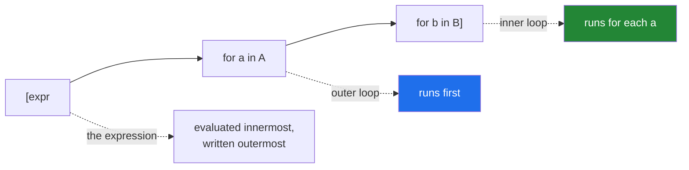

# 1.4 — Nested comprehensions, and the order that surprises everyone

## One-line answer

Two `for` clauses in one comprehension read **left to right in the same order as the nested loops** —
outer first — which is the opposite of what the syntax suggests, because the innermost loop is the one
furthest to the right and the expression that uses it is furthest to the left.

---

## The story

A hall with two rows of three chairs, and a list of six names to seat.

You can fill it row by row: everybody in row one first, left to right, then everybody in row two. Or
you can fill it column by column: the two front-and-back seats on the left, then the middle pair,
then the right pair.

Six chairs either way. Six names either way. **Completely different people in completely different
seats**, and if you are reading names off a list while somebody else fills the chairs in the other
order, everyone ends up in the wrong place and nobody notices until the photographs come back.

Here is that hall, written twice by the same person on the same afternoon.

```text
flat = [item for row in rows for item in row]
```

Correct. Then a colleague asks for a grid built from two ranges, and the same person writes:

```text
grid = [[r, c] for c in range(3) for r in range(2)]
```

and gets six pairs in the wrong order — `[0,0], [1,0], [0,1], [1,1], [0,2], [1,2]` — because they
wrote the clauses in the order the *front part* mentions them, rather than the order they actually
run.

The rule is one sentence, and it is worth learning by heart rather than working out each time:
**write the `for` clauses in exactly the order you would write the nested loops.** Which variable is
mentioned first in the expression at the front has nothing to do with it.

The same afternoon produces a third bug, and this one is quieter. Flattening a list of rows where one
row turns out to be empty of any content at all:

```text
flat = [item for row in rows for item in row]
# TypeError: 'NoneType' object is not iterable
```

The filter that fixes it goes **immediately after the clause it guards**, not at the end — and
getting that wrong gives you a `TypeError` in one position and quietly wrong output in the other.

---

## The idea in plain language

### The rule: same order as the nested loops

```text
[expr for a in A for b in B]
```

is

```text
result = []
for a in A:
    for b in B:
        result.append(expr)
```

**Left to right = outer to inner.** No exceptions, and any number of clauses chain the same way.

The confusion comes from the expression sitting at the front while referring to the *innermost*
variable. Read the `for` clauses first, in order, and only then the expression.



### A later clause can use an earlier variable

```text
[item for row in rows for item in row]
```

`row` comes from the first clause and is used by the second. That is the whole flattening idiom, and it
only works because the clauses run in order.

The reverse does not: an earlier clause cannot see a later variable, exactly as an outer loop cannot see
the inner loop's variable.

### Where each filter goes

Each `for` clause can have its own `if`, and the position decides **when** it runs:

```text
[item                      # 4. the expression
 for row in rows           # 1. outer
 if row is not None        # 2. filters ROWS - runs once per row
 for item in row           # 3. inner
 if item > 0]              # 4. filters ITEMS - runs once per item
```

A filter placed after a clause guards **that clause's variable** and everything after it. Putting the
row-guard at the end would be too late — the inner `for row` would already have tried to iterate
`None`.

That is also the efficiency argument: a filter high in the chain skips a whole inner loop, where the
same condition at the bottom runs for every item.

### Nesting a comprehension *inside* another is different

Two distinct things share the word "nested":

```text
[item for row in rows for item in row]        # two for CLAUSES  -> flattens
[[cell * 2 for cell in row] for row in rows]  # a comprehension inside another -> keeps the shape
```

The first produces a flat list; the second produces a list of lists. **The brackets tell you which** —
an inner `[` means an inner list per outer item.

And in the second form the order reads the way people expect, because the inner comprehension is a
complete unit: "for each row, a list of doubled cells".

### The readability limit

Two `for` clauses is normal. Three is where most readers slow down. Four is a loop.

The honest test is the one from
[1.1](1.1-the-loop-and-the-comprehension.md): if you cannot say it in one sentence, write the loop. "The
positive items of every non-empty row" is a sentence; "the product of every pair of every group of every
batch where the batch is active" is not.

---

## Why Setu needs it

- **[2.1](../02-dict-set-gen/2.1-dict-comprehensions.md), next,** uses two clauses to invert a dict of
  lists into a flat mapping.
- **[Day 8, 1.4](../../../day-08-containers/parts/01-sequences/1.4-unpacking-and-star-rest.md)** gave
  `zip(*rows)` as a transpose; the comprehension form is
  `[[row[i] for row in rows] for i in range(len(rows[0]))]` and shows what `zip` is doing.
- **[Day 6, 4.1](../../../day-06-loops/parts/04-loop-cost/4.1-the-accidental-quadratic.md)** applies
  directly: two `for` clauses is `n × m` work, and a comprehension makes that look like one line rather
  than two nested loops. **The syntax hides the cost.**
- **Day 20's NumPy** (`NP-01`) replaces nested comprehensions over numeric grids entirely, and Day 24's
  reshaping is the vectorised version of the transpose above.
- **Day 164's chunking** (`RAG-04`) flattens documents into chunks: `[chunk for doc in docs for chunk in
  split(doc)]` — one line, and a filter on empty chunks belongs in it.
- **Day 30's cleaning** (`PD-`) flattens nested JSON, where a `None` where a list was expected is the
  routine case rather than the exception.

---

## The mechanism

The order rule, and the bug it prevents:

```python
"""Left to right is outer to inner. Write the clauses in loop order, not expression order."""

rows = [[1, 2], [3, 4], [5, 6]]

flat = [item for row in rows for item in row]
print(f"flatten            : {flat}")

flat_loop = []
for row in rows:
    for item in row:
        flat_loop.append(item)
print(f"the loop it maps to: {flat_loop}   identical: {flat == flat_loop}")

print()
print("the order bug - same expression, two clause orders:")
outer_first = [(r, c) for r in range(2) for c in range(3)]
inner_first = [(r, c) for c in range(3) for r in range(2)]
print(f"    for r ... for c : {outer_first}")
print(f"    for c ... for r : {inner_first}")
print("    ^ same pairs, different ORDER - and the expression looks identical")

print()
print("a later clause can use an earlier variable:")
groups = [["a", "b"], ["c"]]
print(f"    {[(i, item) for i, group in enumerate(groups) for item in group]}")
print("    but not the reverse - an outer clause cannot see an inner variable")
```

**Line by line:**

- `[item for row in rows for item in row]` — the flattening idiom. `row` is bound by the first clause and
  consumed by the second, which is only possible because they run in order.
- `flat == flat_loop` — **the equivalence assertion**, and the fastest way to check that a nested
  comprehension does what you think.
- `for r ... for c` versus `for c ... for r` — **the expression `(r, c)` is identical in both.** Only the
  clause order differs, and the results differ. This is the story's second bug, and it does not raise.
- `for i, group in enumerate(groups) for item in group` — the first clause unpacks a pair
  ([Day 8, 1.4](../../../day-08-containers/parts/01-sequences/1.4-unpacking-and-star-rest.md)) and the
  second uses `group`. Both variables are available to the expression.

Where each filter goes, and why it matters:

```python
"""A filter guards the clause it follows. Position it wrong and it is too late."""

rows = [[1, -2, 3], None, [], [4, -5]]

print(f"rows: {rows}")

print()
print("no filter - the None is not iterable:")
try:
    [item for row in rows for item in row]
except TypeError as exc:
    print(f"    TypeError: {exc}")

print("filter AFTER the outer clause - guards the inner one:")
guarded = [item for row in rows if row for item in row]
print(f"    {guarded}")

print("two filters, one per level:")
positives = [item for row in rows if row for item in row if item > 0]
print(f"    {positives}")

print()
print("the loop it maps to, which shows why each filter is where it is:")
out = []
for row in rows:
    if not row:
        continue
    for item in row:
        if item <= 0:
            continue
        out.append(item)
print(f"    {out}   identical: {out == positives}")

print()
print("efficiency: a high filter skips a whole inner loop")
calls = {"n": 0}


def is_positive(x: int) -> bool:
    calls["n"] += 1
    return x > 0


calls["n"] = 0
[i for row in rows if row for i in row if is_positive(i)]
print(f"    row filter first : is_positive called {calls['n']} times")
```

**Line by line:**

- `for item in row` on `None` raises `TypeError: 'NoneType' object is not iterable`
  ([Day 6, 1.1](../../../day-06-loops/parts/01-iteration/1.1-what-a-for-loop-actually-does.md)).
- `if row` placed **between** the two `for` clauses — it runs once per row and guards the inner
  iteration. Truthiness handles both `None` and `[]` here, correctly, because an empty row and a missing
  row mean the same thing to this flattening
  ([Day 5, 2.2](../../../day-05-operators-and-conditionals/parts/02-conditionals/2.2-truthiness.md)).
- `if item > 0` at the **end** — it runs once per item, on the innermost variable. **Two filters, two
  levels, and each one is positioned by which variable it tests.**
- The loop version makes the positions obvious: the row guard is in the outer body, the item guard in the
  inner. Every filter in a comprehension corresponds to a `continue` at that nesting level.
- The call counter shows the efficiency point: the row filter eliminated `None` and `[]` before the inner
  loop ran, so `is_positive` was called only for items that exist. **Order filters cheapest and most
  selective first**, exactly as with `and`
  ([Day 5, 2.4](../../../day-05-operators-and-conditionals/parts/02-conditionals/2.4-and-or-return-operands.md)).

Two clauses versus a nested comprehension, and the transpose:

```python
"""Two for clauses flatten. A comprehension inside a comprehension keeps the shape."""

rows = [[1, 2, 3], [4, 5, 6]]

flattened = [cell for row in rows for cell in row]
shaped = [[cell * 2 for cell in row] for row in rows]

print(f"rows      : {rows}")
print(f"flattened : {flattened}   <- two for CLAUSES")
print(f"shaped    : {shaped}   <- a comprehension INSIDE one")
print("    the inner [ ] is the whole difference")

print()
print("the transpose, which shows what zip(*rows) does:")
transposed = [[row[i] for row in rows] for i in range(len(rows[0]))]
print(f"    comprehension : {transposed}")
print(f"    zip(*rows)    : {[list(t) for t in zip(*rows, strict=True)]}")

print()
print("cost: two clauses is n x m, and the syntax hides it")
import time

big_rows = [list(range(200)) for _ in range(200)]
started = time.perf_counter()
total = len([c for row in big_rows for c in row])
print(
    f"    {len(big_rows)} rows x {len(big_rows[0])} cells = {total:,} items "
    f"in {time.perf_counter() - started:.4f}s"
)
```

**Line by line:**

- `[cell for row in rows for cell in row]` — flat, six items. `[[cell * 2 for cell in row] for row in
  rows]` — two lists of three. **The inner brackets are the only syntactic difference** and they change
  the shape of the result entirely.
- The nested form reads in the expected order because the inner comprehension is a self-contained unit:
  "for each row, the doubled cells".
- `[[row[i] for row in rows] for i in range(len(rows[0]))]` — the transpose. Note the inner comprehension
  loops over **rows** while the outer loops over **column indices**, which is the inversion that makes a
  transpose a transpose. `zip(*rows)` does the same thing in one call
  ([Day 8, 1.4](../../../day-08-containers/parts/01-sequences/1.4-unpacking-and-star-rest.md)) and is
  what you should write.
- The timing block: forty thousand items from one line of code. **Two `for` clauses is a nested loop with
  nested-loop cost**, and the compactness of the syntax is exactly why it is easy to write an
  `O(n·m)` line without noticing
  ([Day 6, 4.1](../../../day-06-loops/parts/04-loop-cost/4.1-the-accidental-quadratic.md)).
- The `import time` mid-file is for readability of the example; real code puts imports at the top.

---

## When it breaks

**The `None` in the middle:**

```text
>>> rows = [[1, 2], None, [3]]
>>> [x for row in rows for x in row]
Traceback (most recent call last):
  File "<stdin>", line 1, in <module>
TypeError: 'NoneType' object is not iterable
>>> [x for row in rows if row for x in row]
[1, 2, 3]
```

**What it means.** The inner `for` tried to iterate `None`. The traceback points at the comprehension
line and names the type, which is enough — and the fix is a filter positioned **between** the two
clauses, because it has to run before the inner iteration.

**The filter at the end, which is too late:**

```text
>>> rows = [[1, 2], None]
>>> [x for row in rows for x in row if row]
Traceback (most recent call last):
  File "<stdin>", line 1, in <module>
TypeError: 'NoneType' object is not iterable
```

**What it means.** `if row` at the end runs **per item**, and there are no items because iterating `None`
already failed. The filter is syntactically valid, positionally useless, and looks almost identical to
the working version. **Position, not presence.**

**The undefined variable from the wrong order:**

```text
>>> [x for x in row for row in rows]
Traceback (most recent call last):
  File "<stdin>", line 1, in <module>
NameError: name 'row' is not defined
```

**What it means.** The first clause refers to `row`, which the second clause has not yet bound.
Left-to-right is outer-to-inner, so a clause can only use variables bound to its **left**. This is the
loud version of the ordering rule — the quiet version is the story's reversed pairs, which produces the
wrong order with no error at all.

**The shape that was not what you wanted:**

```text
>>> rows = [[1, 2], [3, 4]]
>>> [cell for row in rows for cell in row]
[1, 2, 3, 4]
>>> [[cell for cell in row] for row in rows]
[[1, 2], [3, 4]]
>>> len([cell for row in rows for cell in row]), len([[c for c in r] for r in rows])
(4, 2)
```

**What it means.** Four items or two, from lines that differ by a pair of brackets. **No error either
way**, and downstream code that indexes `result[2]` gets a number in one case and an `IndexError` in the
other. The brackets are the shape.

**And the cost that is invisible:**

```text
>>> docs = [list(range(1000)) for _ in range(1000)]
>>> len([c for doc in docs for c in doc])
1000000
```

**What it means.** One million items from one line. It runs, it is correct, and it materialises a
million-element list — which on a larger input is the out-of-memory kill with no traceback
([Day 6, 1.1](../../../day-06-loops/parts/01-iteration/1.1-what-a-for-loop-actually-does.md)). A nested
comprehension looks like one operation and is a nested loop, and the generator form
([2.3](../02-dict-set-gen/2.3-the-generator-expression.md)) is what streams it.

---

## In production

**Two clauses is the practical limit, and the sentence test decides.** `[chunk for doc in docs for chunk
in split(doc)]` is a sentence — "every chunk of every document" — and is the right form. Three clauses
with two filters is not, and the version that survives review is a named intermediate: flatten into
`chunks`, then filter `chunks`, each on its own line with its own count. That also gives the pipeline
somewhere to report from
([1.2](1.2-the-filter-clause.md)).

**Guard the outer level, always.** Real nested data has `None` where a list was expected, empty lists,
and occasionally a scalar where a sequence was expected — JSON from an API that omits a field, a
database column that is nullable, a parse that half-succeeded. `if row` between the clauses handles the
first two; a `isinstance(row, list)` guard handles the third, and deciding whether the third should raise
instead is the kind of decision
[Day 8, 2.6](../../../day-08-containers/parts/02-sets-and-dicts/2.6-merging-dicts.md) argues should be
written down.

**Remember that the compactness hides the complexity.** Two `for` clauses is `O(n·m)` and looks like one
line, which is precisely why it slips past review where two indented loops would not. When both
dimensions come from data, do the projection
([Day 8, 3.1](../../../day-08-containers/parts/03-dedup/3.1-ten-thousand-ids-timed.md)) before assuming
it is fine — a thousand documents of a thousand chunks is a million-element list, and the memory is the
constraint before the time is.

**Prefer the library form when there is one.** `zip(*rows)` for a transpose,
`itertools.chain.from_iterable(rows)` for a flatten, `itertools.product(a, b)` for a Cartesian product.
Each is clearer than the comprehension that reimplements it, and `chain.from_iterable` in particular is
lazy — so it flattens a stream without materialising anything, which the comprehension cannot. Writing
the comprehension once to understand what they do is Principle 2; reaching for them afterwards is the
professional habit.

**What changes at scale.** The nested comprehension materialises everything. `chain.from_iterable` and a
generator expression stream, holding one item at a time — the difference between a flat memory profile
and one that grows with the input
([Day 6, 1.1](../../../day-06-loops/parts/01-iteration/1.1-what-a-for-loop-actually-does.md)). For
numeric grids, NumPy replaces both: a nested comprehension over a 1000×1000 grid is a million
interpreter dispatches where an array operation is one
([Day 6, 4.2](../../../day-06-loops/parts/04-loop-cost/4.2-the-loop-you-should-not-write.md)).

**The review comment a senior engineer leaves.** On a three-clause flatten with two filters: *"Split
this — flatten into `chunks` on one line, filter on the next, and log both counts. Also add the `if doc`
guard between the first two clauses; the ingest returns `None` for documents it could not parse, and
right now that is a `TypeError` in the middle of the batch. And consider
`itertools.chain.from_iterable`, which is lazy — this materialises every chunk of every document at
once."*

**The interview question.** *"In `[x for a in A for b in B]`, which loop is the outer one?"* The answer
is `A` — the clauses read left to right in exactly the order you would write the nested loops, outer
first — and the confusion comes from the expression sitting at the front while referring to the
innermost variable. The follow-up worth being ready for is *"where does a filter go?"* — immediately
after the clause whose variable it tests, because it must run before the clauses that follow; a guard at
the end runs per innermost item and is too late to protect the inner loop. Strong answers distinguish
two `for` **clauses** (which flatten) from a comprehension **inside** a comprehension (which preserves
the shape), and note that two clauses is `O(n·m)` in a syntax compact enough to hide it.

---

## Check yourself

```bash
uv run python -c "
rows = [[1, -2, 3], None, [], [4, -5]]
try:
    [x for r in rows for x in r]
except TypeError as exc:
    print('no guard    :', exc)
print('guard mid   :', [x for r in rows if r for x in r])
print('two filters :', [x for r in rows if r for x in r if x > 0])
try:
    [x for r in rows for x in r if r]
except TypeError as exc:
    print('guard late  :', exc, '<- same filter, wrong position')
print()
print('for r for c :', [(r, c) for r in range(2) for c in range(3)])
print('for c for r :', [(c2, r2) for c2 in range(3) for r2 in range(2)])
m = [[1, 2, 3], [4, 5, 6]]
print('flat        :', [c for r in m for c in r])
print('shaped      :', [[c * 2 for c in r] for r in m])
print('transposed  :', [[r[i] for r in m] for i in range(len(m[0]))])
"
```

The two `guard` lines differ only in where the filter sits. Predict which raises.

**Answer out loud, without scrolling up:**

> State the rule for the order of `for` clauses, and say why the expression's variable order does not
> matter. Then say where a filter goes and what happens if it is one clause too late.

---

**Next:** [2.1 — Dict comprehensions, and building an index](../02-dict-set-gen/2.1-dict-comprehensions.md)
