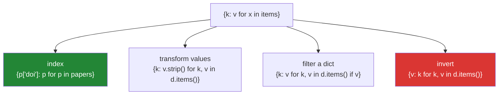

# 2.1 — Dict comprehensions, and building an index

## One-line answer

`{key_expr: value_expr for x in items}` builds a dict in one pass — and because a later duplicate key
**overwrites** the earlier one silently, a comprehension that builds an index is also a deduplication
you may not have noticed you performed.

---

## The story

A lookup table, built from a list of papers.

```text
by_doi = {paper["doi"]: paper for paper in papers}
```

One line, one pass, and it replaces the six-line loop it grew out of. Everybody is pleased.

Three weeks later a reconciliation shows 9,847 papers in the index and 10,000 in the source. Nothing
raised, nothing logged, and no code changed.

The source contains 153 duplicate DOIs — versions of the same paper from two feeds. The comprehension
built the index perfectly and **kept the last occurrence of each DOI**, discarding the earlier ones. It
is a dict, keys are unique, and that is what a dict does.

The bug is not the comprehension. The bug is that a **deduplication happened and nobody decided it
should**. Which occurrence survives — first or last — is a domain question
([Day 8, 3.2](../../../day-08-containers/parts/03-dedup/3.2-order-preserving-dedup.md)), and here the
later feed had *less* metadata, so the index silently lost author lists for 153 papers.

**Building an index from a non-unique key is a deduplication.** The line is right; the missing part is
the count and the decision.

---

## The idea in plain language

### The shape, and the one character that changes everything

```text
{ key_expr : value_expr  for x in items }       -> a dict
{ expr                   for x in items }       -> a SET  (part 2.2)
```

The **colon** is the entire difference. Everything else — the `for`, the filters, multiple clauses — is
identical to a list comprehension
([1.2](../01-list-comprehensions/1.2-the-filter-clause.md),
[1.4](../01-list-comprehensions/1.4-nested-comprehensions.md)).

The loop it maps to:

```text
result = {}
for x in items:
    result[key_expr] = value_expr
```

Note it is `result[k] = v`, **not** `setdefault` — so a repeated key overwrites.

### Duplicate keys: last wins, at the first one's position

Because assigning to an existing key replaces the value and **keeps the slot**
([Day 8, 2.3](../../../day-08-containers/parts/02-sets-and-dicts/2.3-a-dict-is-ordered-now.md)):

- The **value** is from the last occurrence.
- The **position** is from the first.
- The **key object** stored is the first one.

To keep the *first* value instead, reverse the source (`reversed(items)`) or use an explicit loop with
`setdefault` ([Day 8, 2.4](../../../day-08-containers/parts/02-sets-and-dicts/2.4-get-setdefault-and-counter.md)).

Either way it should be a decision with a name: `index_by_doi_keeping_latest`, not `build_index`.

### The four shapes it covers



- **Index** — turn a list into a lookup. The story.
- **Transform values** — `{k: clean(v) for k, v in d.items()}` builds a **new** dict rather than
  mutating, which is the safe form
  ([Day 6, 2.4](../../../day-06-loops/parts/02-control-flow/2.4-mutating-while-iterating.md)).
- **Filter** — `{k: v for k, v in d.items() if v}` is the "drop the empties" idiom, and it cannot raise
  the `RuntimeError` a delete-loop can.
- **Invert** — swap keys and values. **Marked red because it is the dangerous one**: values need not be
  unique or hashable, so inverting collapses duplicates and can raise
  ([Day 8, 2.5](../../../day-08-containers/parts/02-sets-and-dicts/2.5-view-objects-are-windows.md)).

### `.items()` and the unpacking

`for k, v in d.items()` unpacks each `(key, value)` pair
([Day 8, 1.4](../../../day-08-containers/parts/01-sequences/1.4-unpacking-and-star-rest.md)). It is one
lookup per pass rather than two, and it states that both halves are used.

`for k in d` gives keys only; `{k: d[k] for k in d}` works and does a redundant lookup per item.

### Where it beats the alternatives

`dict.fromkeys(items)` gives every key the same value
([Day 8, 2.3](../../../day-08-containers/parts/02-sets-and-dicts/2.3-a-dict-is-ordered-now.md)) — and if
that value is mutable, **one shared object across every key**. The comprehension `{k: [] for k in keys}`
evaluates `[]` per key, which is the fix.

`dict(zip(keys, values))` is the right tool when you have two parallel sequences, and `strict=True`
belongs in that zip ([Day 6, 1.3](../../../day-06-loops/parts/01-iteration/1.3-enumerate-and-zip.md)).

---

## Why Setu needs it

- **[2.2](2.2-set-comprehensions.md), next,** is the same syntax without the colon.
- **[Day 8, 3.2](../../../day-08-containers/parts/03-dedup/3.2-order-preserving-dedup.md)** used
  `{r[key]: r for r in records}` as the last-wins dedup; this is where that line is explained.
- **[Day 8, 2.4](../../../day-08-containers/parts/02-sets-and-dicts/2.4-get-setdefault-and-counter.md)**'s
  `dict.fromkeys(keys, [])` bug is fixed by a dict comprehension.
- **[Day 6, 4.1](../../../day-06-loops/parts/04-loop-cost/4.1-the-accidental-quadratic.md)**'s "build the
  index once" is literally this line: one pass to build, then O(1) lookups.
- **Day 26's pandas** (`PD-`) builds a DataFrame from a dict of columns, and **the dict's order becomes
  the column order** — a direct consequence of the ordering guarantee.
- **Day 76 onwards** (`ML-`), feature dictionaries, label mappings and id-to-index tables are all dict
  comprehensions, and a silently-deduplicated label map is a silently wrong model.

---

## The mechanism

Building an index, and the deduplication nobody asked for:

```python
"""An index built from a non-unique key is also a dedup. Count it."""

papers = [
    {"doi": "10.1/a", "title": "Attention", "authors": ["Vaswani", "Shazeer"]},
    {"doi": "10.1/b", "title": "BERT", "authors": ["Devlin"]},
    {"doi": "10.1/a", "title": "Attention Is All You Need", "authors": []},
    {"doi": "10.1/c", "title": "ResNet", "authors": ["He"]},
]

by_doi = {paper["doi"]: paper for paper in papers}

print(f"{len(papers)} papers in, {len(by_doi)} in the index")
print(f"dropped silently: {len(papers) - len(by_doi)}   <- the story")
print()
print("which occurrence survived:")
print(f"    10.1/a title   : {by_doi['10.1/a']['title']!r}")
print(f"    10.1/a authors : {by_doi['10.1/a']['authors']}   <- the LAST one, with less metadata")
print(f"    key order      : {list(by_doi)}   <- 10.1/a is still FIRST")

print()
print("keeping the FIRST occurrence instead:")
by_doi_first = {paper["doi"]: paper for paper in reversed(papers)}
print(f"    10.1/a authors : {by_doi_first['10.1/a']['authors']}")

print()
print("and the count that should have been logged:")
from collections import Counter

repeated = {doi: n for doi, n in Counter(p["doi"] for p in papers).items() if n > 1}
print(f"    repeated keys: {repeated}")
```

**Line by line:**

- `{paper["doi"]: paper for paper in papers}` — four papers, **three** entries. The dict did what a dict
  does; nothing warned.
- `by_doi['10.1/a']['authors']` is `[]` — the **last** occurrence won, and it happens to be the one with
  no authors. That is the incident: the index is complete-looking and missing data.
- `list(by_doi)` shows `10.1/a` **first**, because assigning to an existing key keeps its position
  ([Day 8, 2.3](../../../day-08-containers/parts/02-sets-and-dicts/2.3-a-dict-is-ordered-now.md)). Last
  value, first position — a combination that surprises people.
- `reversed(papers)` — the one-word fix for first-wins. It works because reversing makes the *first*
  occurrence the last one assigned. `reversed()` needs a sequence; for a stream, use an explicit loop
  with a `seen` set.
- `Counter(...)` filtered to `n > 1` — **which** keys collided and how often
  ([Day 8, 2.4](../../../day-08-containers/parts/02-sets-and-dicts/2.4-get-setdefault-and-counter.md)).
  One id appearing 153 times and 153 ids appearing twice are different upstream problems.
- Note the `repeated` line is itself a dict comprehension with a filter — the "filter a dict" shape.

The four shapes:

```python
"""Index, transform, filter, invert - one syntax, four jobs."""

config = {"host": "  localhost  ", "port": "8080", "debug": "", "region": "eu-west"}

print("1. transform the values, building a NEW dict:")
cleaned = {key: value.strip() for key, value in config.items()}
print(f"    {cleaned}")
print(f"    the original is untouched: {config['host']!r}")

print()
print("2. filter, without the RuntimeError a delete-loop would raise:")
non_empty = {key: value for key, value in cleaned.items() if value}
print(f"    {non_empty}")

print()
print("3. transform keys and values at once:")
upper_keys = {key.upper(): len(value) for key, value in cleaned.items()}
print(f"    {upper_keys}")

print()
print("4. invert - and here is why it is the dangerous one:")
scores = {"a": 1, "b": 2, "c": 1}
inverted = {value: key for key, value in scores.items()}
print(f"    {scores} -> {inverted}")
print(f"    3 keys in, {len(inverted)} out - 'a' was overwritten by 'c'")

unhashable = {"a": [1, 2]}
try:
    {value: key for key, value in unhashable.items()}
except TypeError as exc:
    print(f"    inverting a dict with list values: TypeError: {exc}")

print()
print("the safe inversion, when values repeat:")
from collections import defaultdict

grouped = defaultdict(list)
for key, value in scores.items():
    grouped[value].append(key)
print(f"    {dict(grouped)}")
```

**Line by line:**

- `{key: value.strip() for key, value in config.items()}` — a **new** dict. The original is unchanged,
  which is the property that makes this safer than editing in place, and it is why the delete-loop
  `RuntimeError` cannot happen
  ([Day 6, 2.4](../../../day-06-loops/parts/02-control-flow/2.4-mutating-while-iterating.md)).
- `if value` — the filter, dropping the empty `debug`. Truthiness is right here because empty and absent
  mean the same thing for a config value that is a string
  ([Day 5, 2.2](../../../day-05-operators-and-conditionals/parts/02-conditionals/2.2-truthiness.md)).
- `{key.upper(): len(value) ...}` — both slots can be arbitrary expressions.
- The inversion loses a key: `"a"` and `"c"` both map to `1`, so one entry survives. **Three in, two
  out, no error.** Inverting is only safe when the values are known-unique, which is a property of the
  data, not of the code.
- Inverting a dict with list values raises `TypeError: unhashable type: 'list'` — values become keys, and
  keys must be hashable
  ([Day 8, 2.1](../../../day-08-containers/parts/02-sets-and-dicts/2.1-a-set-is-a-hash-table.md)).
- The `defaultdict(list)` version is the honest inversion when values repeat: value → list of keys.
  **It cannot be a comprehension**, because a comprehension produces one entry per item and this needs
  accumulation — which is [3.1](../03-when-not-to/3.1-when-a-comprehension-is-wrong.md)'s rule.

The `fromkeys` fix, and the two-sequence form:

```python
"""A comprehension evaluates the value per key. dict.fromkeys does not."""

keys = ["a", "b", "c"]

shared = dict.fromkeys(keys, [])
shared["a"].append(1)
print(f"dict.fromkeys(keys, []) : {shared}")
print(f"    all one object      : {shared['a'] is shared['b']}   <- the bug")

per_key = {key: [] for key in keys}
per_key["a"].append(1)
print(f"{{k: [] for k in keys}}   : {per_key}")
print(f"    separate objects    : {per_key['a'] is per_key['b']}")

print()
print("two parallel sequences - zip, strictly:")
names = ["host", "port", "debug"]
values = ["localhost", 8080, False]
print(f"    dict(zip(...))      : {dict(zip(names, values, strict=True))}")
print(f"    same as a comp      : {{n: v for n, v in zip(names, values, strict=True)}}")

try:
    dict(zip(names, values[:2], strict=True))
except ValueError as exc:
    print(f"    mismatched lengths  : ValueError: {exc}")
print(f"    without strict      : {dict(zip(names, values[:2]))}   <- silently short")
```

**Line by line:**

- `dict.fromkeys(keys, [])` — the default is evaluated **once**, so all three keys share one list
  ([Day 8, 2.3](../../../day-08-containers/parts/02-sets-and-dicts/2.3-a-dict-is-ordered-now.md)). This
  is [Day 4, 3.1](../../../day-04-objects/parts/03-identity-trap/3.1-the-mutable-default-argument.md)'s
  mutable-default bug wearing a different hat.
- `{key: [] for key in keys}` — the expression runs **per key**, so each gets its own list. `is` returns
  `False`. **This is the fix, and it is the main reason to prefer a comprehension over `fromkeys`.**
- `dict(zip(names, values, strict=True))` — the two-sequence form, and it is clearer than the equivalent
  comprehension. Use the comprehension only when the key or value needs transforming.
- `strict=True` raises on a length mismatch; without it the dict is silently short
  ([Day 6, 1.3](../../../day-06-loops/parts/01-iteration/1.3-enumerate-and-zip.md)). **A config dict
  built from a truncating zip is missing keys nobody counted** — the same failure family as the story.

---

## When it breaks

**The silent overwrite:**

```text
>>> rows = [{"id": 1, "v": "first"}, {"id": 1, "v": "second"}]
>>> index = {r["id"]: r for r in rows}
>>> len(rows), len(index)
(2, 1)
>>> index[1]["v"]
'second'
```

**What it means.** Two rows in, one out, no error. **The count is the only evidence**, and it is only
evidence if somebody computes it. The general rule: whenever a comprehension builds a dict from a key
that is not provably unique, `len(source) - len(result)` belongs in a log line or an assertion.

**The unhashable key expression:**

```text
>>> rows = [{"tags": ["a", "b"], "n": 1}]
>>> {r["tags"]: r["n"] for r in rows}
Traceback (most recent call last):
  File "<stdin>", line 1, in <module>
TypeError: unhashable type: 'list'
>>> {tuple(r["tags"]): r["n"] for r in rows}
{('a', 'b'): 1}
```

**What it means.** Keys must be hashable
([Day 8, 1.3](../../../day-08-containers/parts/01-sequences/1.3-a-tuple-is-a-record.md)). The fix is a
tuple, and if order should not matter, a `frozenset`. This one is loud, which is the good case.

**The inversion that collapsed:**

```text
>>> statuses = {"draft": 0, "review": 1, "archived": 0}
>>> {v: k for k, v in statuses.items()}
{0: 'archived', 1: 'review'}
```

**What it means.** Two names mapped to `0`; one survives. A "reverse lookup table" built this way is
**wrong for every duplicated value**, and there is no error. When values repeat, the inversion is
value → list of keys, which needs a loop or `defaultdict`.

**The dict built by mistake:**

```text
>>> {x for x in range(3)}
{0, 1, 2}
>>> {x: x for x in range(3)}
{0: 0, 1: 1, 2: 2}
>>> type({x for x in range(3)}).__name__
'set'
```

**What it means.** No colon, no dict. The braces are shared between the two literals
([2.2](2.2-set-comprehensions.md)), so a missing colon silently gives you a set — and a set supports
`in` and `len` and iteration, so the mistake can travel a long way before something asks for `[key]`
and gets a `TypeError`.

**And the comprehension that needed to accumulate:**

```text
>>> papers = [{"year": 2017, "t": "a"}, {"year": 2017, "t": "b"}]
>>> {p["year"]: p["t"] for p in papers}
{2017: 'b'}
>>> from collections import defaultdict
>>> g = defaultdict(list)
>>> for p in papers: g[p["year"]].append(p["t"])
>>> dict(g)
{2017: ['a', 'b']}
```

**What it means.** A comprehension produces **one entry per item**, so grouping — many items into one
entry — is not something it can express. Every attempt produces the last item instead of the group.
Grouping needs a loop with an accumulator, and that is
[3.1](../03-when-not-to/3.1-when-a-comprehension-is-wrong.md)'s boundary.

---

## In production

**An index built from a non-unique key is a deduplication, so name it and count it.**
`index_by_doi_keeping_latest(papers)` with a logged `len(papers) - len(index)` turns a silent data loss
into a metric. When the key is supposed to be unique, assert it — `assert len(index) == len(papers)` —
so a duplicate in the source fails loudly at the point it arrives rather than showing up in a
reconciliation weeks later. Which of those two you want is a decision about whether duplicates are
expected.

**Prefer building a new dict to mutating one.** `{k: clean(v) for k, v in d.items()}` cannot raise the
`RuntimeError` that a delete-or-add loop can
([Day 6, 2.4](../../../day-06-loops/parts/02-control-flow/2.4-mutating-while-iterating.md)), does not
touch the caller's data, and reads as a statement about the result rather than a sequence of edits. The
loop is right when you also need to count what you dropped, and then the counting is the reason.

**Treat inversion as suspicious until the values are proven unique.** In a real system a
`{value: key}` inversion is correct only for an enumeration or an identity mapping, and wrong for
anything derived from data. When you genuinely need reverse lookups on non-unique values, the structure
is value → list of keys, and building it needs a loop. Writing an inversion without checking is one of
the quietest ways to lose rows.

**Use a comprehension rather than `dict.fromkeys` whenever the value is mutable.** `{k: [] for k in
keys}` gives each key its own list; `dict.fromkeys(keys, [])` gives them all the same one, and the bug
appears the first time anything appends. This is the same class of error as the mutable default argument
([Day 4, 3.1](../../../day-04-objects/parts/03-identity-trap/3.1-the-mutable-default-argument.md)), and
it is worth grepping for.

**What changes at scale.** A dict comprehension is one pass and O(n), and the cost is dominated by
hashing the keys — proportional to key length, so long string keys are not free
([Day 8, 2.1](../../../day-08-containers/parts/02-sets-and-dicts/2.1-a-set-is-a-hash-table.md)). The
memory is the real constraint: an index over a million records holds every record, which is often the
whole dataset a second time if the values are the records themselves. Storing an index of key → **row
number** rather than key → row is the standard fix, and at a size where even that does not fit, the
index belongs in a database.

**The review comment a senior engineer leaves.** On `by_doi = {p["doi"]: p for p in papers}`: *"This is a
dedup as well as an index — DOIs repeat across our two feeds and we are keeping the last, which is the
feed with sparser metadata. Rename it to say which occurrence wins, log `len(papers) - len(by_doi)`, and
add a `Counter` of the repeated DOIs to the run summary so we can see whether it is one paper 150 times
or 150 papers twice."*

**The interview question.** *"What happens if two items produce the same key in a dict comprehension?"*
The answer is that the later one wins — it is `result[k] = v` per item, so a repeat overwrites — and the
consequence is that building an index from a non-unique key silently deduplicates, keeping the last
value at the first occurrence's position. The follow-up worth being ready for is *"how would you keep
the first instead?"* — reverse the source, or use an explicit loop with `setdefault` — and the strongest
answers add that the count of dropped entries should be logged, because nothing else reveals it, and
that grouping (many items into one entry) cannot be a comprehension at all and needs a loop with an
accumulator.

---

## Check yourself

```bash
uv run python -c "
papers = [{'doi': 'a', 'n': 1}, {'doi': 'b', 'n': 2}, {'doi': 'a', 'n': 3}]
idx = {p['doi']: p['n'] for p in papers}
print('in', len(papers), '-> out', len(idx), '| dropped', len(papers) - len(idx))
print('last wins :', idx, '| order:', list(idx))
print('first wins:', {p['doi']: p['n'] for p in reversed(papers)})
s = {'a': 1, 'b': 2, 'c': 1}
print('inverted  :', {v: k for k, v in s.items()}, '<- 3 in, 2 out')
shared = dict.fromkeys(['x','y'], [])
shared['x'].append(1)
print('fromkeys  :', shared, '| same object:', shared['x'] is shared['y'])
print('comp      :', {k: [] for k in ['x','y']})
print('no colon  :', type({x for x in range(3)}).__name__, '<- a set, not a dict')
"
```

The first two lines are the story. The `fromkeys` line is the bug the comprehension fixes.

**Answer out loud, without scrolling up:**

> Say what happens when two items produce the same key, including which value and which position
> survive. Then explain why `{k: [] for k in keys}` is not the same as `dict.fromkeys(keys, [])`.

---

**Next:** [2.2 — Set comprehensions, and dedup in one line](2.2-set-comprehensions.md)
