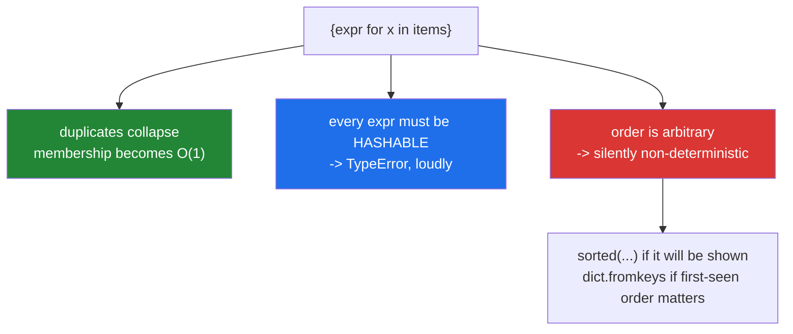

# 2.2 — Set comprehensions, and dedup in one line

## One-line answer

`{expr for x in items}` transforms and deduplicates in one pass — and the two things it silently
requires are that every result is **hashable** and that you did not need the **order**, which is the
same pair of costs a set always charges.

---

## The story

A count of distinct authors across a batch of papers.

```text
authors = {author for paper in papers for author in paper["authors"]}
print(f"{len(authors)} distinct authors")
```

Correct, one line, and it replaced a loop with a `seen` set and an explicit append.

Then two things happen in the same sprint.

The first: someone changes `paper["authors"]` from a list of strings to a list of `{"name": ..., "orcid":
...}` dicts. The comprehension raises `TypeError: unhashable type: 'dict'` — loud, immediate, and the
fix is obvious once you read it.

The second is quieter. Somebody uses the same shape to build a report:

```text
for author in {a for p in papers for a in p["authors"]}:
    print(author)
```

The report is correct and comes out in a different order every run
([Day 8, 2.1](../../../day-08-containers/parts/02-sets-and-dicts/2.1-a-set-is-a-hash-table.md)), because
string hashing is randomised per process. The daily diff is unreadable, and it takes a week to work out
that nothing changed except the order.

**A set comprehension buys deduplication and charges order.** The exchange is fine when you wanted a
count and wrong the moment the result is displayed.

---

## The idea in plain language

### The shape, and the missing colon

```text
{ expr        for x in items }        -> a set
{ key : value for x in items }        -> a dict  (part 2.1)
```

The colon is the only difference
([2.1](2.1-dict-comprehensions.md)). Everything else — filters, multiple `for` clauses, the expression
slot — is identical to a list comprehension.

The loop it maps to:

```text
result = set()
for x in items:
    result.add(expr)
```

`add`, not `append` — so duplicates collapse silently, exactly as
[Day 8, 2.1](../../../day-08-containers/parts/02-sets-and-dicts/2.1-a-set-is-a-hash-table.md) describes.

### The two costs, both silent-ish

**Hashability is loud.** A result that cannot be hashed raises immediately, and the message names the
type. That is the good failure.

**Losing the order is silent.** The result is correct and its iteration order is arbitrary and varies
between processes. Nothing warns, and the symptom appears downstream as non-deterministic output.

The rule that follows: **use a set comprehension when the result feeds a membership test, a count, or
set algebra; use `sorted()` or a dict-based dedup when it will be displayed**
([Day 8, 3.2](../../../day-08-containers/parts/03-dedup/3.2-order-preserving-dedup.md)).



### Transform *then* deduplicate

The order matters and it is the main reason to reach for the comprehension rather than
`set(items)`:

```text
set(titles)                              # dedups the RAW titles
{normalise(t) for t in titles}           # dedups the NORMALISED titles
```

The second collapses variants that the first keeps as distinct
([Day 7, 4.1](../../../day-07-strings/parts/04-normalising/4.1-the-title-normaliser.md)). **The
transform happens before the deduplication**, which is exactly what makes a normalise-then-dedup
pipeline one line.

### `{}` is not an empty set

There is no empty-set literal — `{}` is an empty dict
([Day 8, 2.1](../../../day-08-containers/parts/02-sets-and-dicts/2.1-a-set-is-a-hash-table.md)). A set
comprehension with a filter that matches nothing gives you an empty **set**, correctly, because the
comprehension's braces are unambiguous; only the bare literal is.

### `frozenset` needs a call

`frozenset(expr for x in items)` — a generator expression passed to the constructor
([2.3](2.3-the-generator-expression.md)). There is no frozenset comprehension, for the same reason there
is no tuple comprehension.

### The set is the right home for a membership test

The most common good use is building a lookup:

```text
allowed_ids = {row["id"] for row in permitted_rows}
...
if candidate["id"] in allowed_ids:      # O(1), and it says what it is
```

One pass to build, then constant-time membership
([Day 5, 3.2](../../../day-05-operators-and-conditionals/parts/03-the-or-trap/3.2-in-is-an-operator.md)).
This is [Day 6, 4.1](../../../day-06-loops/parts/04-loop-cost/4.1-the-accidental-quadratic.md)'s
"build the index once" in one line.

---

## Why Setu needs it

- **[2.3](2.3-the-generator-expression.md), next,** is the fourth bracket, and the one that does not
  build a container at all.
- **[Day 8, 2.2](../../../day-08-containers/parts/02-sets-and-dicts/2.2-set-algebra.md)**'s operators
  work directly on the result, so `{f(x) for x in a} & {f(y) for y in b}` is a one-line
  transform-and-intersect.
- **[Day 7's normaliser](../../../day-07-strings/parts/04-normalising/4.1-the-title-normaliser.md)** plus
  a set comprehension is the whole dedup pipeline: `{normalise_title(t) for t in raw if
  normalise_title(t)}` — and that double call is
  [1.2](../01-list-comprehensions/1.2-the-filter-clause.md)'s trap, fixed with a walrus.
- **Day 76's data preparation** (`ML-`) builds the set of ids in the training split, and
  `train_ids.isdisjoint(test_ids)` is the leakage check (Principle 8) — one line each.
- **Day 164's chunking** (`RAG-04`) deduplicates chunk hashes before embedding, where each collapse is a
  model call saved (Principle 5).
- **Day 30's cleaning** (`PD-`) collects the distinct values of a column to decide whether it is
  categorical — a set comprehension, and then `sorted()` to display it.

---

## The mechanism

The shape, and the two costs:

```python
"""Transform and dedup in one pass. Then the two things it charges you."""

papers = [
    {"title": "Attention", "authors": ["Vaswani", "Shazeer", "Parmar"]},
    {"title": "BERT", "authors": ["Devlin", "Chang"]},
    {"title": "GPT", "authors": ["Radford", "Devlin"]},
]

authors = {author for paper in papers for author in paper["authors"]}
print(f"{len(authors)} distinct authors")
print(f"as a set   : {authors}")
print(f"for display: {sorted(authors)}   <- ask for an order if you need one")

print()
print("the loop it maps to:")
seen = set()
for paper in papers:
    for author in paper["authors"]:
        seen.add(author)
print(f"    identical: {seen == authors}")

print()
print("COST 1 - hashability, and it is loud:")
with_dicts = [{"authors": [{"name": "Vaswani"}]}]
try:
    {a for p in with_dicts for a in p["authors"]}
except TypeError as exc:
    print(f"    TypeError: {exc}")
print(f"    the fix - extract a hashable field:")
print(
    f"    {{a['name'] for p in with_dicts for a in p['authors']}} = "
    f"{ {a['name'] for p in with_dicts for a in p['authors']} }"
)

print()
print("COST 2 - order, and it is silent:")
print(f"    one iteration order: {list(authors)}")
print("    run this script again and compare - string hashing is randomised per process")
```

**Line by line:**

- `{author for paper in papers for author in paper["authors"]}` — two `for` clauses
  ([1.4](../01-list-comprehensions/1.4-nested-comprehensions.md)) flattening and deduplicating in one
  pass. `Devlin` appears in two papers and once in the result.
- `sorted(authors)` for display — **the habit**. Anything that reaches output gets an explicit order
  ([Day 8, 1.5](../../../day-08-containers/parts/01-sequences/1.5-sort-sorted-and-key.md)).
- The loop version uses `seen.add`, which is what the comprehension compiles to. `seen == authors`
  confirms it.
- The dict-authors version raises `TypeError: unhashable type: 'dict'`
  ([Day 8, 2.1](../../../day-08-containers/parts/02-sets-and-dicts/2.1-a-set-is-a-hash-table.md)). The
  fix is to put a hashable field in the expression slot — which is also the better model, because "the
  set of author names" is what was meant.
- `list(authors)` prints *an* order. **Running the script twice gives two different lines**, which is
  cost 2 and is the story's quiet bug.

Transform-then-dedup, which is the reason to use the comprehension:

```python
"""set(items) dedups the raw values. A comprehension dedups the transformed ones."""

titles = [
    "Attention Is All You Need",
    "attention is all you need",
    "  Attention Is All You Need  ",
    "BERT",
    "bert",
]


def normalise(title: str) -> str:
    return " ".join(title.split()).casefold()


raw_distinct = set(titles)
normalised_distinct = {normalise(t) for t in titles}

print(f"{len(titles)} titles")
print(f"    set(titles)                 -> {len(raw_distinct)} distinct")
print(f"    {{normalise(t) for t in ...}} -> {len(normalised_distinct)} distinct")
print(f"    normalised: {sorted(normalised_distinct)}")

print()
print("with a filter, and the double-call trap:")
calls = {"n": 0}


def counting_normalise(title: str) -> str:
    calls["n"] += 1
    return normalise(title)


messy = titles + ["", "   "]

calls["n"] = 0
naive = {counting_normalise(t) for t in messy if counting_normalise(t)}
print(
    f"    naive  : {len(naive)} distinct, normalise called {calls['n']} times for {len(messy)} titles"
)

calls["n"] = 0
walrus = {n for t in messy if (n := counting_normalise(t))}
print(f"    walrus : {len(walrus)} distinct, normalise called {calls['n']} times")
```

**Line by line:**

- `set(titles)` gives 5 — every string is distinct. `{normalise(t) for t in titles}` gives 2, because the
  transform runs **before** the deduplication. **That difference is the whole value of the
  comprehension form** over `set()`.
- `" ".join(title.split()).casefold()` — the collapse-and-fold from
  [Day 7, 2.1](../../../day-07-strings/parts/02-methods/2.1-normalising-strip-and-case.md) and
  [Day 7, 2.2](../../../day-07-strings/parts/02-methods/2.2-split-and-join.md), enough for this example.
- `{counting_normalise(t) for t in messy if counting_normalise(t)}` — **fourteen calls for seven
  titles**, because the filter cannot see the expression
  ([1.2](../01-list-comprehensions/1.2-the-filter-clause.md)).
- `{n for t in messy if (n := counting_normalise(t))}` — the walrus computes once and filters on the
  result. Seven calls ([3.2](../03-when-not-to/3.2-comprehension-scope.md) covers the scope rules).
- Both produce the same set; only the cost differs. On five hundred titles with a real normaliser —
  which includes `unicodedata.normalize`
  ([Day 7, 4.2](../../../day-07-strings/parts/04-normalising/4.2-unicode-normalisation.md)) — that is
  five hundred wasted calls.

The membership lookup, and set algebra on the results:

```python
"""The most common good use: build a lookup in one pass, then O(1) membership."""

import time

permitted = [{"id": f"user-{i}"} for i in range(50_000)]
candidates = [{"id": f"user-{i}"} for i in range(49_990, 50_010)]

allowed_ids = {row["id"] for row in permitted}

started = time.perf_counter()
found_fast = [c for c in candidates if c["id"] in allowed_ids]
fast = time.perf_counter() - started

permitted_list = [row["id"] for row in permitted]
started = time.perf_counter()
found_slow = [c for c in candidates if c["id"] in permitted_list]
slow = time.perf_counter() - started

print(f"set lookup  : {len(found_fast)} matches in {fast:.5f}s")
print(f"list lookup : {len(found_slow)} matches in {slow:.5f}s")
print(f"same answer : {found_fast == found_slow}   ratio: {slow / fast:.0f}x")

print()
print("set algebra works directly on the results (day 8, part 2.2):")
feed_a = ["10.1/a", "10.1/b", "10.1/c"]
feed_b = ["10.1/B", "10.1/c", "10.1/d"]
keys_a = {doi.casefold() for doi in feed_a}
keys_b = {doi.casefold() for doi in feed_b}
print(f"    in both        : {sorted(keys_a & keys_b)}")
print(f"    only in feed a : {sorted(keys_a - keys_b)}")
print(f"    disagreements  : {sorted(keys_a ^ keys_b)}")
```

**Line by line:**

- `allowed_ids = {row["id"] for row in permitted}` — **one pass to build**, then every membership test is
  O(1). This is the line that turns a quadratic filter into a linear one.
- `c["id"] in permitted_list` — the same filter against a **list**, which scans
  ([Day 5, 3.2](../../../day-05-operators-and-conditionals/parts/03-the-or-trap/3.2-in-is-an-operator.md)).
  The `ratio` column is the cost of the wrong container.
- `found_fast == found_slow` — **the equivalence assertion.** Same answer, different cost.
- `{doi.casefold() for doi in feed_a}` — transform then dedup, twice, and then set algebra
  ([Day 8, 2.2](../../../day-08-containers/parts/02-sets-and-dicts/2.2-set-algebra.md)) on the results.
  Note `10.1/B` and `10.1/b` collapse **because of the casefold in the expression slot** — which the raw
  sets would not have done.
- `sorted(...)` on every printed result, for the reason cost 2 gives.

---

## When it breaks

**The unhashable expression:**

```text
>>> rows = [{"tags": ["a", "b"]}, {"tags": ["a"]}]
>>> {r["tags"] for r in rows}
Traceback (most recent call last):
  File "<stdin>", line 1, in <module>
TypeError: unhashable type: 'list'
>>> {tuple(r["tags"]) for r in rows}
{('a', 'b'), ('a',)}
>>> {frozenset(r["tags"]) for r in rows}
{frozenset({'a'}), frozenset({'a', 'b'})}
```

**What it means.** Every element of a set must be hashable
([Day 8, 1.3](../../../day-08-containers/parts/01-sequences/1.3-a-tuple-is-a-record.md)). `tuple`
preserves order and `frozenset` does not — and which you want is a modelling decision: are `["a","b"]`
and `["b","a"]` the same set of tags or two different sequences?

**The missing colon:**

```text
>>> {x for x in range(3)}
{0, 1, 2}
>>> {x: x for x in range(3)}
{0: 0, 1: 1, 2: 2}
>>> d = {row["id"] for row in [{"id": 1, "n": "a"}]}
>>> d[1]
Traceback (most recent call last):
  File "<stdin>", line 1, in <module>
TypeError: 'set' object is not subscriptable
```

**What it means.** Braces are shared between the two comprehensions
([2.1](2.1-dict-comprehensions.md)). A missing colon gives a **set**, which supports `in`, `len` and
iteration — so the mistake survives until something asks for a key, and the error arrives far from the
line that caused it.

**The order that was never promised:**

```text
$ python -c "print(list({s.casefold() for s in ['B','a','C']}))"
['b', 'a', 'c']
$ python -c "print(list({s.casefold() for s in ['B','a','C']}))"
['c', 'b', 'a']
```

**What it means.** Two runs, two orders. **No error** — the report is simply different every day
([Day 8, 2.1](../../../day-08-containers/parts/02-sets-and-dicts/2.1-a-set-is-a-hash-table.md)). The fix
for display is `sorted()`; the fix when *first-seen* order matters is `dict.fromkeys` with the transform
applied first ([Day 8, 3.2](../../../day-08-containers/parts/03-dedup/3.2-order-preserving-dedup.md)).

**The collapse across types:**

```text
>>> {1, True, 1.0}
{1}
>>> {x for x in [1, True, 1.0, "1"]}
{1, '1'}
```

**What it means.** `1 == True == 1.0`, so they hash equal and one survives; `"1"` is genuinely distinct.
A set built from mixed integers and booleans is smaller than the input in a way that has nothing to do
with the data being duplicated.

**And the dedup that found nothing:**

```text
>>> titles = ["Attention Is All You Need", "Attention Is All You Need "]
>>> len({t for t in titles})
2
>>> len({" ".join(t.split()).casefold() for t in titles})
1
```

**What it means.** A set collapses only what `==` says is equal. Two visually identical titles, one
trailing space, two "distinct" papers
([Day 7, 3.3](../../../day-07-strings/parts/03-formatting/3.3-repr-and-the-debugging-f-string.md) on
finding it). **The comprehension's expression slot is where the normalisation belongs**, and putting it
there is the difference between a real dedup and a fast one.

---

## In production

**Use a set comprehension for membership, counts and algebra; use `sorted()` the moment it is
displayed.** The rule is mechanical and worth applying without thinking: any set that reaches a report,
a filename, a log line, an API response or a test fixture gets wrapped in `sorted()`, or the output is
non-deterministic and every diff is noise. This is the same discipline as
[Day 8, 1.5](../../../day-08-containers/parts/01-sequences/1.5-sort-sorted-and-key.md)'s total sort key,
applied one level up.

**Put the normalisation in the expression slot.** `{normalise(t) for t in titles}` is the entire
transform-and-dedup pipeline in one line, and it is strictly better than `set(titles)` followed by a
normalisation, which deduplicates the wrong things first. The quality of the dedup is the quality of the
expression, not the speed of the container
([Day 8, 3.1](../../../day-08-containers/parts/03-dedup/3.1-ten-thousand-ids-timed.md)).

**Watch the double call when a filter repeats the expression.** `{f(x) for x in xs if f(x)}` runs `f`
twice per item, and with a real normaliser — which does Unicode normalisation and several string passes
— that is a measurable fraction of an ingestion job. The walrus or a nested generator fixes it, and the
tell is seeing the same call on both sides of the `if`.

**Count what collapsed.** `len(items) - len(result)` is the number of duplicates, and it belongs in the
run summary for the same reason every filter's count does
([1.2](../01-list-comprehensions/1.2-the-filter-clause.md)). A distinct-count that halves overnight
means an upstream job started emitting duplicates, or that somebody changed the normaliser — both worth
knowing on the day.

**What changes at scale.** The comprehension is one pass and the memory is the set: unique elements plus
the hash table's deliberate slack
([Day 8, 2.1](../../../day-08-containers/parts/02-sets-and-dicts/2.1-a-set-is-a-hash-table.md)). For tens
of millions of long string keys that is gigabytes, and the standard mitigations are hashing each key to
a fixed-size digest, a Bloom filter when a small false-positive rate is acceptable, or pushing the
distinct-count into a database. Note also that a set comprehension over a huge source **consumes the
whole source** even though it only keeps the distinct values — so for a stream, the generator form plus
an explicit `seen` set is what keeps memory proportional to the distinct count rather than the input
([2.3](2.3-the-generator-expression.md)).

**The review comment a senior engineer leaves.** On a report iterating a set comprehension: *"Wrap this
in `sorted()` — set order is a hash artefact and randomised per process, so this report comes out in a
different order every run. And move the `casefold()` into the comprehension's expression rather than
applying it afterwards; right now we are deduplicating the raw values and then folding, which keeps the
case variants as distinct entries."*

**The interview question.** *"What is the difference between `{x for x in items}` and `[x for x in
items]`?"* The answer is that the first builds a set — duplicates collapse, membership becomes O(1), and
the order is lost — while the second preserves everything. The follow-up that finds real experience is
*"what does the set cost you?"* — the elements must be hashable, which raises loudly, and the order is
arbitrary and randomised per process, which fails silently in any output. Strong answers add that the
comprehension form is meaningfully different from `set(items)` because the transform runs **before** the
deduplication, so it collapses variants that a raw set would keep — which is exactly why a
normalise-then-dedup pipeline is one line.

---

## Check yourself

```bash
uv run python -c "
titles = ['Attention Is All You Need', 'attention is all you need', '  Attention Is All You Need  ', 'BERT']
print('set(titles)   :', len(set(titles)), 'distinct')
norm = {' '.join(t.split()).casefold() for t in titles}
print('normalised set:', len(norm), 'distinct ->', sorted(norm))
print('collapsed     :', len(titles) - len(norm))
rows = [{'tags': ['a','b']}]
try:
    {r['tags'] for r in rows}
except TypeError as exc:
    print('unhashable    :', exc)
print('as tuples     :', {tuple(r['tags']) for r in rows})
print('no colon      :', type({x for x in range(3)}).__name__)
print('order         :', list({'b','a','c'}), '<- run twice, compare')
print('collapse      :', {1, True, 1.0})
"
```

Run the `order` line twice in separate commands. The `collapsed` count is what belongs in a log.

**Answer out loud, without scrolling up:**

> Say what a set comprehension gives you and the two things it charges. Then explain why
> `{normalise(t) for t in titles}` collapses more than `set(titles)` does.

---

**Next:** [2.3 — The generator expression, and the parenthesis that changes everything](2.3-the-generator-expression.md)
