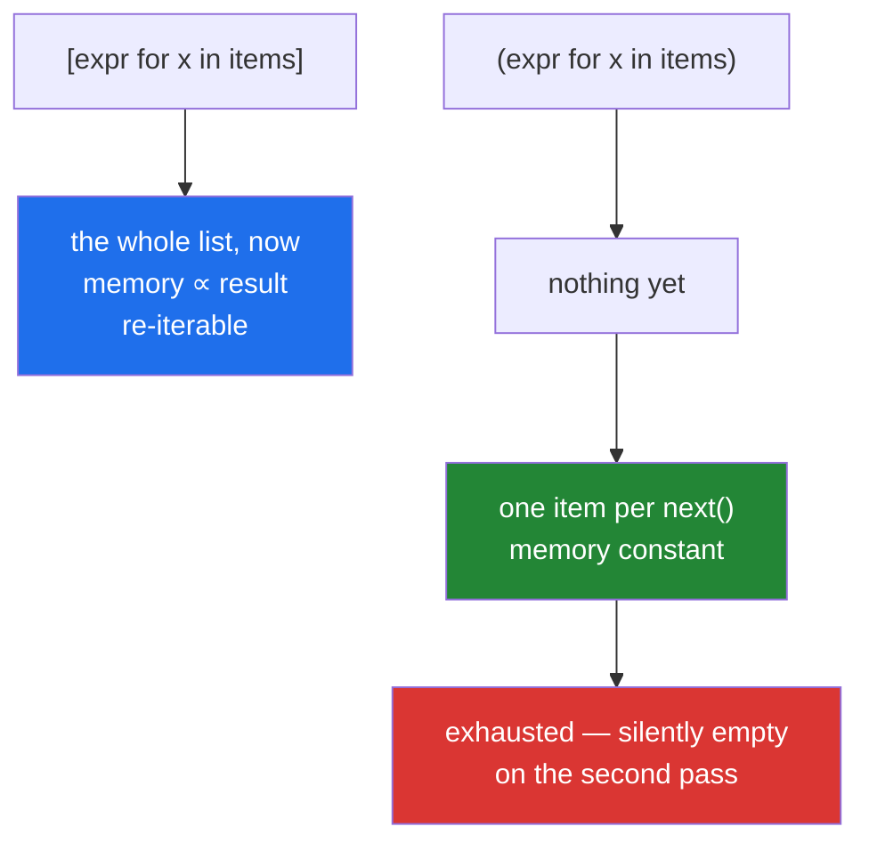

# 2.3 — The generator expression, and the parenthesis that changes everything

## One-line answer

`(expr for x in items)` is not a tuple — it is a **generator**: it builds nothing, produces one item at
a time when asked, and is consumed once, which makes it the difference between a job with flat memory
and one the kernel kills.

---

## The story

A log analyser, one character from working on any file size.

```text
total = sum([len(line) for line in open(path)])
```

On the 5 MB sample: instant. On the two-gigabyte production log: `Killed`, exit code 137, and no
Python traceback at all
([Day 6, 4.1](../../../day-06-loops/parts/04-loop-cost/4.1-the-accidental-quadratic.md)).

The comprehension materialised a list of twenty million integers before `sum` saw a single one. Remove
two characters:

```text
total = sum(len(line) for line in open(path))
```

Flat memory, same answer, and it finishes.

The same week, the opposite mistake. Someone writes a helper that "returns the parsed rows":

```text
def parse(path):
    return (parse_line(line) for line in open(path))
```

A caller does `rows = parse(path)`, computes `len(rows)` — `TypeError` — switches to
`sum(1 for _ in rows)`, gets the count, and then iterates `rows` to process them and gets **nothing**.
No error. The generator was consumed by the count.

**One character decides whether you have a container or a stream**, and the two have opposite
strengths. Knowing which you are holding is the whole subject.

---

## The idea in plain language

### What a generator expression is

`(expr for x in items)` creates a **generator object** — an iterator
([Day 6, 1.1](../../../day-06-loops/parts/01-iteration/1.1-what-a-for-loop-actually-does.md)) that
computes `expr` for one item each time `next()` is called on it.

Nothing runs when you create it. The source is not touched, the expression is not evaluated, and no
memory is allocated for results.

| | list comprehension | generator expression |
|---|---|---|
| Written | `[expr for x in it]` | `(expr for x in it)` |
| Evaluates | immediately, all of it | lazily, one item at a time |
| Memory | proportional to the result | **constant** |
| `len()` | yes | **no** |
| Indexing / slicing | yes | **no** |
| Re-iterable | yes | **no — consumed once** |
| Best for | small results used repeatedly | large or streamed data used once |

### The parentheses can disappear

When a generator expression is the **only** argument to a function, its parentheses are optional:

```text
sum(len(line) for line in lines)          # clean
sum((len(line) for line in lines))        # identical, noisier
max(scores, default=0)                    # two args -> the genexp needs its own parens
any(x > 0 for x in values)
```

That is why `sum(...)`, `any(...)`, `all(...)`, `min`, `max`, `join` and the container constructors read
so naturally with one — and it is why the difference from a list comprehension is genuinely just two
characters at the call site.

### Consumed once, and silently

This is the property that produces wrong answers rather than errors:

```text
gen = (x for x in range(3))
sum(gen)      # 3
max(gen)      # ValueError: max() arg is an empty sequence
list(gen)     # []
```

The first consumer drains it. The second sees an empty stream. Sometimes that raises; often it just
returns an empty result, which is the dangerous case
([Day 6, 1.1](../../../day-06-loops/parts/01-iteration/1.1-what-a-for-loop-actually-does.md)).



### Short-circuiting is the other half of the win

`any(is_bad(row) for row in rows)` stops at the **first** true value. With a list comprehension it would
evaluate `is_bad` for every row first and then check. On a million rows where the second one is bad,
that is the difference between two calls and a million.

The same applies to `next(gen, default)`, which is the "first match or nothing" idiom
([Day 6, 2.1](../../../day-06-loops/parts/02-control-flow/2.1-break-and-which-loop-it-leaves.md)).

### When to materialise deliberately

Reach for the list when you need any of: a length, an index, a second pass, a sort, or the result held
while something else runs. **Write `list(...)` and mean it** — the explicit call documents that you
needed the whole thing.

The failure mode of over-using generators is a function that returns one, a caller that iterates it
twice, and an empty second pass with no error. Which is why a public function usually returns a `list`
and an internal pipeline stage usually returns a generator.

### The type annotation says which

`-> list[Row]` can be iterated twice. `-> Iterator[Row]` cannot, and the annotation is the warning
([Day 6, 1.1](../../../day-06-loops/parts/01-iteration/1.1-what-a-for-loop-actually-does.md)). `Iterable`
is the weaker promise — it can be iterated *at least* once — and using the precise one is a real
kindness.

---

## Why Setu needs it

- **[3.3](../03-when-not-to/3.3-the-list-you-never-needed.md), later today,** is the memory argument in
  full, with measurements.
- **Day 11's generators** (`PY-11`) is the plan's named "stream a 2 GB log line-by-line without loading
  it" example — the story, written as a `yield` function rather than an expression.
- **[Day 6, 1.1](../../../day-06-loops/parts/01-iteration/1.1-what-a-for-loop-actually-does.md)**
  established the iterator protocol and the one-shot property; this is the expression form.
- **[Day 8, 2.4](../../../day-08-containers/parts/02-sets-and-dicts/2.4-get-setdefault-and-counter.md)**
  used `Counter(p["year"] for p in papers)` — a generator expression as a single argument, so nothing
  intermediate was built.
- **Day 16's file handling** (`PY-19`) reads files line by line, where the generator is the only shape
  that works on a file larger than memory.
- **Day 164's chunking** (`RAG-04`) streams documents into chunks; materialising every chunk of every
  document at once is exactly the story, and **Day 196's context trimming** (`LG-12`) streams messages
  for the same reason.

---

## The mechanism

Nothing happens until you ask:

```python
"""A generator expression evaluates nothing at creation. Watch when the work happens."""


def announce(value: int) -> int:
    print(f"        computing {value}")
    return value * 2


print("creating a LIST comprehension:")
as_list = [announce(x) for x in range(3)]
print(f"    created, and all the work is already done: {as_list}")

print()
print("creating a GENERATOR expression:")
as_gen = (announce(x) for x in range(3))
print(f"    created, and nothing has run: {as_gen}")

print("    now asking for one item:")
first = next(as_gen)
print(f"        got {first}")

print("    now asking for the rest:")
print(f"        {list(as_gen)}")

print()
print("and it is exhausted:")
print(f"    second pass: {list(as_gen)}   <- empty, no error")
```

**Line by line:**

- The list comprehension prints all three `computing` lines **before** the `created` line — the work is
  done eagerly at the moment the brackets are evaluated.
- The generator prints **nothing** at creation. Its `repr` is `<generator object <genexpr> at 0x...>`,
  which is the tell whenever you see it where you expected data.
- `next(as_gen)` — one item, one `computing` line. This is the protocol from
  [Day 6, 1.1](../../../day-06-loops/parts/01-iteration/1.1-what-a-for-loop-actually-does.md) made
  visible.
- `list(as_gen)` after the `next` — the **remaining** two items, not all three. The generator carries a
  position.
- The second `list(as_gen)` is `[]`. **No error, no warning.** This is the property that turns a
  double-consumption bug into a wrong answer rather than a crash.

The memory difference, measured:

```python
"""The story: same answer, one materialises everything and one does not."""

import sys
import tempfile
import tracemalloc
from pathlib import Path

path = Path(tempfile.gettempdir()) / "setu-day09-sample.log"
path.write_text("".join(f"line {i} with some padding\n" for i in range(200_000)), encoding="utf-8")

print("the objects themselves:")
with path.open(encoding="utf-8") as handle:
    lengths_list = [len(line) for line in handle]
with path.open(encoding="utf-8") as handle:
    lengths_gen = (len(line) for line in handle)
    print(
        f"    list      : {sys.getsizeof(lengths_list):>10,} bytes for {len(lengths_list):,} items"
    )
    print(f"    generator : {sys.getsizeof(lengths_gen):>10,} bytes, holding nothing")

print()
print("peak memory while summing:")
for label, build in (
    ("sum([...])", lambda h: sum([len(line) for line in h])),
    ("sum(...)  ", lambda h: sum(len(line) for line in h)),
):
    tracemalloc.start()
    with path.open(encoding="utf-8") as handle:
        total = build(handle)
    _, peak = tracemalloc.get_traced_memory()
    tracemalloc.stop()
    print(f"    {label}: total={total:,}  peak={peak:>10,} bytes")

path.unlink()
```

**Line by line:**

- `sys.getsizeof(lengths_list)` — proportional to the item count. `sys.getsizeof(lengths_gen)` — a small
  constant, because the generator holds a frame and a position, not results
  ([Day 8, 1.1](../../../day-08-containers/parts/01-sequences/1.1-a-list-is-a-dynamic-array.md) on what
  `getsizeof` does and does not count).
- `tracemalloc` — the standard library's allocation tracker, and the right tool for "how much did this
  actually use" as opposed to "how big is this object". No dependency.
- `sum([len(line) for line in h])` versus `sum(len(line) for line in h)` — **two characters apart**, same
  total, and the peak differs by orders of magnitude.
- `with path.open(...)` reopened for each measurement, because a file object is itself a one-shot
  iterator ([Day 6, 1.1](../../../day-06-loops/parts/01-iteration/1.1-what-a-for-loop-actually-does.md))
  — the second `build` would see an exhausted handle otherwise. **That detail is the story's second bug
  in miniature.**
- `path.unlink()` — clean up the scratch file.

Short-circuiting, and the one-shot trap:

```python
"""any/all/next stop early on a generator and cannot on a list."""

calls = {"n": 0}


def is_bad(row: dict) -> bool:
    calls["n"] += 1
    return row["score"] < 0


rows = [{"score": 1.0}, {"score": -0.5}] + [{"score": 0.5} for _ in range(100_000)]

calls["n"] = 0
any([is_bad(r) for r in rows])
print(f"any([...]) : is_bad called {calls['n']:,} times")

calls["n"] = 0
any(is_bad(r) for r in rows)
print(f"any(...)   : is_bad called {calls['n']:,} times   <- stopped at the second row")

print()
print("next(gen, default) - the 'first match or nothing' idiom:")
first_bad = next((r for r in rows if is_bad(r)), None)
print(f"    {first_bad}")
print(f"    and if nothing matches: {next((r for r in rows if r['score'] > 99), None)}")

print()
print("THE TRAP - a generator consumed by the first thing that touches it:")
gen = (r["score"] for r in rows[:5])
print(f"    sum  : {sum(gen)}")
print(f"    max  : ", end="")
try:
    print(max(gen))
except ValueError as exc:
    print(f"ValueError: {exc}")
print(f"    list : {list(gen)}   <- empty, silently")

print()
print("the fix - materialise once, deliberately:")
scores = [r["score"] for r in rows[:5]]
print(f"    sum={sum(scores)} max={max(scores)} len={len(scores)}   all three work")
```

**Line by line:**

- `any([is_bad(r) for r in rows])` — the list is built **first**, so `is_bad` runs 100,002 times, and
  only then does `any` look at the result.
- `any(is_bad(r) for r in rows)` — **two calls.** `any` stops at the first `True`, and the generator
  never computed the rest. On this input that is a 50,000× difference in work for two characters.
- `next((r for r in rows if is_bad(r)), None)` — the first match, or `None`. This is the extracted-search
  shape from [Day 6, 2.1](../../../day-06-loops/parts/02-control-flow/2.1-break-and-which-loop-it-leaves.md)
  in one expression, and the `None` default is what makes it safe.
- `sum(gen)` then `max(gen)` — the second raises `ValueError: max() arg is an empty sequence`, and the
  message says nothing about exhaustion. `list(gen)` afterwards returns `[]` with **no** error at all.
  **The same bug produces a loud failure or a silent one depending on which function meets it second.**
- The materialised version supports all three. `list(...)` written explicitly is the documentation that
  the whole thing was needed.

---

## When it breaks

**The generator where a sequence was expected:**

```text
>>> g = (x * 2 for x in range(5))
>>> len(g)
Traceback (most recent call last):
  File "<stdin>", line 1, in <module>
TypeError: object of type 'generator' has no len()
>>> g[0]
Traceback (most recent call last):
  File "<stdin>", line 1, in <module>
TypeError: 'generator' object is not subscriptable
```

**What it means.** A generator has no length and no positions — it does not know what it will produce
until it produces it. Both errors are loud and immediate. The `repr` is the tell: seeing
`<generator object>` printed where you expected data means you wrote `(` instead of `[`.

**The double consumption, loud version:**

```text
>>> g = (x for x in range(3))
>>> sum(g)
3
>>> max(g)
Traceback (most recent call last):
  File "<stdin>", line 1, in <module>
ValueError: max() arg is an empty sequence
```

**What it means.** `sum` drained it; `max` found nothing. **The message mentions an empty sequence, not
an exhausted generator**, so it points away from the real cause — which is why this takes longer to
diagnose than it should.

**The double consumption, silent version:**

```text
>>> def parse(rows):
...     return (r.strip() for r in rows)
...
>>> parsed = parse(["a ", "b "])
>>> count = sum(1 for _ in parsed)
>>> count
2
>>> for row in parsed:
...     print(row)
...
>>>
```

**What it means.** The count consumed it. The loop runs **zero times** and prints nothing — no error, no
empty-list warning, just a processing step that silently did nothing. This is the worst failure in this
part, and it is why a function returning a generator should say so in its annotation.

**The parentheses that were needed:**

```text
>>> max(x for x in [1, 2, 3], default=0)
  File "<stdin>", line 1
    max(x for x in [1, 2, 3], default=0)
        ^^^^^^^^^^^^^^^^^^^^
SyntaxError: Generator expression must be parenthesized
>>> max((x for x in [1, 2, 3]), default=0)
3
```

**What it means.** The bare form is allowed only when the generator is the **sole** argument. With a
second argument the parser cannot tell where the expression ends, and it says so precisely.

**And the closure that read the wrong value:**

```text
>>> multiplier = 2
>>> g = (x * multiplier for x in range(3))
>>> multiplier = 10
>>> list(g)
[0, 10, 20]
```

**What it means.** The **source** iterable (`range(3)`) is evaluated when the generator is created, but
the **expression** is evaluated lazily — so `multiplier` is read at consumption time, not creation time.
A list comprehension would have given `[0, 2, 4]`. When a generator outlives the variables it references,
this is a real and subtle bug, and the defence is to consume it promptly or bind the value with a default
argument in a function.

---

## In production

**Generators for pipeline stages, lists at the boundaries.** An internal stage that reads, transforms
and passes on should be lazy — that is what keeps memory flat regardless of input size. A function on a
module's public surface should usually return a `list`, because its callers will index it, count it, or
iterate it twice, and the failure when they do is silent. The annotation carries the contract:
`-> list[Row]` versus `-> Iterator[Row]`, and choosing the precise one is what lets a type checker catch
the double consumption.

**`sum(...)`, `any(...)`, `all(...)`, `join(...)` — never with brackets inside.** These consume once and
short-circuit, so the list adds memory and removes the early exit. `any([...])` on a large collection is
one of the most common wasteful patterns in Python, and it is invisible because it is correct. Ruff's
`C419` flags exactly this.

**When a generator is consumed by mistake, look at what touched it first.** The symptom is an empty
result or an "empty sequence" error from a function that should have had data, and the cause is a
`len()`, a `sum(1 for _ in ...)`, a logging line, or a debugger repr that drained it. The reflex worth
building: if a stream produced nothing, ask what read it earlier — and if a value must be used twice,
materialise it once with an explicit `list(...)` and use that name everywhere.

**`itertools` is the generator toolkit.** `chain.from_iterable` flattens lazily where a nested
comprehension materialises ([1.4](../01-list-comprehensions/1.4-nested-comprehensions.md)); `islice`
takes a prefix without draining the rest; `tee` duplicates a stream when you genuinely need two passes —
at the cost of buffering everything one consumer has seen and the other has not, which is often worse
than just making a list. Knowing `tee` exists **and** knowing it usually is not the answer is the
professional position.

**What changes at scale is the whole point.** A list comprehension's memory is proportional to the
result, so it has a size beyond which the process dies with no traceback; a generator's is constant, so
it fails gracefully by being slow instead. That is the difference between an incident and a ticket. The
cost is that laziness makes profiling harder — the work appears at the consumer, not the producer — and
that exceptions surface from inside the generator at the point of consumption, which is a stack trace
one layer removed from the code that looks responsible.

**Under concurrency, a generator is stateful and must not be shared.** Two threads calling `next()` on
one generator each get *some* of the items, non-deterministically, and neither sees all of them — data
loss with no error
([Day 6, 1.1](../../../day-06-loops/parts/01-iteration/1.1-what-a-for-loop-actually-does.md)). One
producer feeding a `queue.Queue`, or one generator per worker over its own slice, are the shapes that
work.

**The review comment a senior engineer leaves.** On `total = sum([len(line) for line in handle])`:
*"Drop the brackets — `sum(len(line) for line in handle)` is the same answer with flat memory, and this
one will get OOM-killed on a full day's log. Same for the `any([...])` on line 60, which builds a
hundred thousand booleans to find out about the second one."*

**The interview question.** *"What is the difference between `[x for x in items]` and `(x for x in
items)`?"* The answer is that the first builds the whole list immediately and the second creates a
generator that produces items lazily, one at a time, using constant memory. The follow-up worth having
ready is *"when does that matter?"* — when the data is large enough that materialising it does not fit,
and when a consumer short-circuits, because `any(...)` over a generator stops at the first match while
`any([...])` evaluates everything first. Strong answers add the cost: a generator has no length, no
indexing, and is consumed once — so a second pass silently produces nothing, which is why a public
function usually returns a list and the annotation should say which you are handing back.

---

## Check yourself

```bash
uv run python -c "
def announce(v):
    print('   computing', v)
    return v
print('list comprehension:')
lst = [announce(x) for x in range(2)]
print('generator expression:')
gen = (announce(x) for x in range(2))
print('   created, nothing ran:', type(gen).__name__)
print('   first:', next(gen))
print('   rest :', list(gen))
print('   again:', list(gen), '<- empty, no error')
try:
    len(x for x in range(3))
except TypeError as exc:
    print('len(gen):', exc)
calls = {'n': 0}
def bad(x):
    calls['n'] += 1
    return x < 0
rows = [1, -1] + [1] * 50_000
calls['n'] = 0; any([bad(r) for r in rows]); print('any([...]):', calls['n'], 'calls')
calls['n'] = 0; any(bad(r) for r in rows);   print('any(...)  :', calls['n'], 'calls')
"
```

The last two lines differ by two characters and by fifty thousand calls.

**Answer out loud, without scrolling up:**

> Say what `(expr for x in items)` produces and what happens at the moment you create it. Then name the
> three things it cannot do that a list can, and give one case where the laziness is a large win.

---

**Next:** [3.1 — When a comprehension is the wrong tool](../03-when-not-to/3.1-when-a-comprehension-is-wrong.md)
