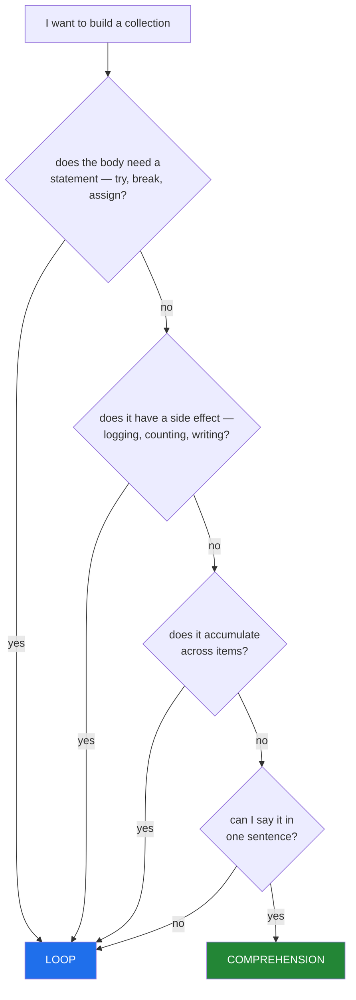

# 3.1 — When a comprehension is the wrong tool

## One-line answer

A comprehension is wrong when the body needs a **statement**, when it has a **side effect**, when it
**accumulates** across items, or when the result cannot be said in one sentence — and reaching for a
loop in those cases is the correct choice, not a fallback.

---

## The story

A pipeline function, refactored into a single expression by someone who had just finished this day's
first two sections.

```text
records = [
    {**normalise(r), "score": score}
    for r in raw
    if r.get("id")
    for score in [compute_score(r)]
    if score is not None
    if score > THRESHOLD
]
```

It works. It replaced fourteen lines. And in review, three separate people ask what
`for score in [compute_score(r)]` is doing — it is a way of binding a temporary variable inside a
comprehension, which is a real technique and is here doing what the walrus operator does more
honestly ([3.2](3.2-comprehension-scope.md)).

The fourteen lines it replaced contained: a count of rows rejected for each of three reasons, a log
line for records whose score failed to compute, and a `try` around `normalise` because one feed
occasionally sends a malformed title.

**All three are gone.** Not because the author removed them deliberately — because a comprehension has
nowhere to put them, so making the code a comprehension meant deleting them. The refactor did not
compress fourteen lines into one; it deleted eleven lines of operational instrumentation and kept
three.

That is the failure mode. A comprehension is a good tool with a narrow contract, and the pressure to
use one where it does not fit shows up as **quietly dropped requirements** rather than as bad code.

---

## The idea in plain language

### The four boundaries

A comprehension takes an **expression** and produces **one value per item**. Everything it cannot do
follows:

1. **Statements.** No `try`, no `while`, no `return`, no plain assignment, no `break`/`continue`. A
   comprehension cannot handle a per-item error, and that is the most common reason to keep the loop.
2. **Side effects.** Logging, counting, writing, calling an API — legal, and it makes the brackets a
   lie: the list of `None`s is discarded and the real work is hidden inside an expression.
3. **Accumulation.** Many items into one entry — grouping, running totals, "the best so far". A
   comprehension produces one output per input, so grouping cannot be expressed
   ([2.1](../02-dict-set-gen/2.1-dict-comprehensions.md)).
4. **Legibility.** More than two `for` clauses, more than two filters, or a value expression that needs
   a comment. The sentence test from
   [1.1](../01-list-comprehensions/1.1-the-loop-and-the-comprehension.md) is the check.



### The one that catches people: per-item error handling

```text
years = [int(v) for v in column]      # one bad value kills the whole batch
```

There is no `try` to add. The options are a filter that pre-validates
([1.2](../01-list-comprehensions/1.2-the-filter-clause.md)), a helper function that returns a sentinel,
or a loop.

The filter is right when "invalid" is a **category** you can test for. The loop is right when you need
to know **which** rows failed and why — which in a pipeline is usually the requirement.

### The one people do not notice: instrumentation

The story's real loss. A loop body has room for:

```text
for row in raw:
    if not row.get("id"):
        rejected["no id"] += 1
        continue
    ...
    logger.debug("kept %s", row["id"])
```

A comprehension has room for none of it. When you convert a loop to a comprehension, **check what you
are deleting**, and if the answer is "the counters", the loop was doing two jobs and only one of them
fits.

### The compromise that usually wins

Split it. A comprehension for the transform, a loop for the parts that need statements:

```text
valid = [r for r in raw if r.get("id")]           # one line, one job
logger.info("dropped %d rows with no id", len(raw) - len(valid))
records = [transform(r) for r in valid]            # one line, one job
```

Two comprehensions and a log line, each readable, each with a countable stage. This is almost always
better than either the fourteen-line loop or the six-clause comprehension.

### What the linters say

Ruff flags several of these:

- `C416` — a comprehension that only copies (`[x for x in items]` → `list(items)`).
- `C417` — `map` with a lambda where a comprehension is clearer.
- `C419` — a list comprehension inside `any`/`all`, where a generator belongs
  ([2.3](../02-dict-set-gen/2.3-the-generator-expression.md)).
- `B015`/`B018` — an expression statement whose value is discarded, which catches the
  comprehension-for-side-effects pattern in some positions.

None of them catches the story's bug, because the story's bug is a missing requirement rather than a
bad expression.

---

## Why Setu needs it

- **[3.3](3.3-the-list-you-never-needed.md), later,** is the fifth boundary — a comprehension that is
  correct and materialises more than it should.
- **[Day 6, 2.2](../../../day-06-loops/parts/02-control-flow/2.2-continue-and-the-skipped-increment.md)**
  is the guard-and-count loop shape that a comprehension cannot express, and it is the shape the story
  deleted.
- **[Day 8, 2.4](../../../day-08-containers/parts/02-sets-and-dicts/2.4-get-setdefault-and-counter.md)**'s
  grouping is boundary 3: `defaultdict(list)` plus a loop, because grouping is many-to-one.
- **Day 18's exceptions** (`PY-22`) is boundary 1 in full — per-item error handling, and the design
  choice between a sentinel return and an exception.
- **Day 76 onwards** (`ML-`), a feature pipeline that silently drops rows without counting them is a
  changed population nobody agreed to (Principle 8's neighbourhood), and it is exactly this refactor.
- **Day 182's agent loops** (`AGT-`) are boundaries 1 and 3 together: sequential, stateful, with
  per-attempt error handling. They will never be comprehensions.

---

## The mechanism

Boundary 1 — a statement in the body:

```python
"""A comprehension has no try. Three ways out, and which requirement each satisfies."""

column = ["2017", "2018", "", "n/a", "2015"]


def to_year(text: str) -> int:
    return int(text)


print("1. the comprehension - one bad value kills the batch:")
try:
    [to_year(v) for v in column]
except ValueError as exc:
    print(f"    ValueError: {exc}")

print()
print("2. a pre-validating filter - right when 'invalid' is a testable category:")
print(f"    {[to_year(v) for v in column if v.isdigit()]}")
print("    but it cannot tell you WHICH rows failed, or why")

print()
print("3. a helper returning a sentinel - right when the caller only needs the good ones:")


def to_year_or_none(text: str) -> int | None:
    try:
        return int(text)
    except ValueError:
        return None


print(f"    {[y for v in column if (y := to_year_or_none(v)) is not None]}")

print()
print("4. the loop - right when you need to know what failed:")
years = []
failures = []
for value in column:
    try:
        years.append(to_year(value))
    except ValueError as exc:
        failures.append((value, str(exc)))
print(f"    kept    : {years}")
print(f"    failures: {failures}")
print(f"    {len(years)} of {len(column)} parsed, {len(failures)} failed")
```

**Line by line:**

- Option 1 raises on `""`. **There is no `try` you can add to a comprehension**, which is the boundary.
- Option 2's filter works and **discards the reasons**. `isdigit()` is also a narrower specification
  than `int()` accepts, which [1.2](../01-list-comprehensions/1.2-the-filter-clause.md) covers — so this
  option silently drops negatives too.
- Option 3 pushes the `try` into a helper, which is legitimate and is what you do when the caller
  genuinely only wants the successes. The walrus keeps it to one call
  ([3.2](3.2-comprehension-scope.md)).
- Option 4 is the loop, and it is the only one that produces `failures`. **The requirement decides**: if
  a report has to say "153 rows could not be parsed, here are three examples", options 1–3 cannot
  produce it.
- `(value, str(exc))` — keeping the message, not just the value. An error report that names the value
  and not the reason sends the reader back to reproduce it.

Boundary 2 — side effects, and what the brackets become:

```python
"""A comprehension used for its side effect is a loop in a costume."""

rows = [{"id": "a"}, {"id": "b"}]
written = []


def write(row: dict) -> None:
    written.append(row["id"])


print("the comprehension form:")
result = [write(row) for row in rows]
print(f"    it worked: {written}")
print(f"    and built: {result}   <- a list of None nobody wants")
print(f"    which is {len(result)} discarded objects, at scale")

written.clear()
print()
print("the loop form - same work, no waste, and the intent is visible:")
for row in rows:
    write(row)
print(f"    {written}")

print()
print("the honest middle ground - the comprehension does the transform,")
print("the loop does the effect:")
written.clear()
payloads = [{"id": row["id"], "size": len(row["id"])} for row in rows]
for payload in payloads:
    write(payload)
print(f"    transformed: {payloads}")
print(f"    written    : {written}")
```

**Line by line:**

- `[write(row) for row in rows]` — it runs, and it builds a list of `None` proportional to the input.
  **On a million rows that is a million discarded objects**, and the brackets suggest a result that is
  not there.
- The loop version does the same work with no allocation and states the intent: this is for its effect.
- The split version is what a reviewer will suggest: **a comprehension for the pure transform, a loop
  for the effect.** Each half is now testable on its own, which is the deeper argument — you can assert
  what `payloads` contains without performing any writes.

Boundary 3 — accumulation, which cannot be expressed at all:

```python
"""One output per input. Grouping is many-to-one, so it needs a loop."""

from collections import defaultdict

papers = [
    {"year": 2017, "title": "Attention"},
    {"year": 2018, "title": "BERT"},
    {"year": 2017, "title": "Transformer-XL"},
]

print("the comprehension attempt - the LAST paper wins:")
print(
    f"    {{p['year']: p['title'] for p in papers}} = { ({p['year']: p['title'] for p in papers}) }"
)
print("    2017 has two papers and one survived (part 2.1)")

print()
print("the loop, which is the only way to accumulate:")
by_year = defaultdict(list)
for paper in papers:
    by_year[paper["year"]].append(paper["title"])
print(f"    {dict(by_year)}")

print()
print("the standard-library answer, which is a loop underneath:")
import itertools

ordered = sorted(papers, key=lambda p: p["year"])
grouped = {
    year: [p["title"] for p in group]
    for year, group in itertools.groupby(ordered, key=lambda p: p["year"])
}
print(f"    {grouped}")
print("    note groupby needs the input SORTED by the key, or it splits groups")

print()
print("running totals are the same boundary:")
scores = [0.5, 0.2, 0.9]
running = list(itertools.accumulate(scores))
print(f"    itertools.accumulate: {running}")
print("    a comprehension cannot do this - each output depends on the previous one")
```

**Line by line:**

- `{p['year']: p['title'] for p in papers}` — 2017 appears twice, so one title survives
  ([2.1](../02-dict-set-gen/2.1-dict-comprehensions.md)). **Every attempt to group with a comprehension
  produces the last item instead of the group**, because the shape is one-to-one.
- `defaultdict(list)` plus a loop — the accumulation, and it is
  [Day 8, 2.4](../../../day-08-containers/parts/02-sets-and-dicts/2.4-get-setdefault-and-counter.md)'s
  shape. Note `dict(by_year)` when it escapes, for that part's read-inserts hazard.
- `itertools.groupby` — the library form, and **it requires the input sorted by the same key** or it
  produces several groups for the same value. That caveat is why the `defaultdict` version is the safer
  default.
- The nested comprehension inside the `groupby` dict is fine, because each `group` is a fresh iterable
  and the outer structure is one entry per group.
- `itertools.accumulate` — a running total, where each output depends on the previous one. **Sequential
  dependency is the general form of this boundary**
  ([Day 6, 4.2](../../../day-06-loops/parts/04-loop-cost/4.2-the-loop-you-should-not-write.md)), and the
  retry loop from Day 6 is another instance.

---

## When it breaks

**The statement that will not fit:**

```text
>>> [try: int(v) except: 0 for v in ["1", "x"]]
  File "<stdin>", line 1
    [try: int(v) except: 0 for v in ["1", "x"]]
     ^^^
SyntaxError: invalid syntax
```

**What it means.** `try` is a statement and the value slot takes an expression. There is no version of
this that works, which is the point: the language is telling you the tool does not cover the case.

**The side effect that built a list of nothing:**

```text
>>> rows = ["a", "b", "c"]
>>> result = [print(r) for r in rows]
a
b
c
>>> result
[None, None, None]
>>> import sys; sys.getsizeof(result)
88
```

**What it means.** It worked and it allocated. Eighty-eight bytes here, and proportional to the input in
general. Ruff flags the pattern in some positions and not all, so the real defence is noticing that the
brackets promise a result nobody uses.

**The grouping that kept one:**

```text
>>> papers = [{"y": 2017, "t": "a"}, {"y": 2017, "t": "b"}]
>>> {p["y"]: p["t"] for p in papers}
{2017: 'b'}
>>> {p["y"]: [p["t"]] for p in papers}
{2017: ['b']}
```

**What it means.** The second attempt looks like it groups — it wraps the value in a list — and does
not: each item still produces one entry, and the last one overwrites. **No error**, and the result has
the right *shape*, which makes it worse. Grouping needs accumulation, and accumulation needs a loop.

**The `groupby` that split a group:**

```text
>>> import itertools
>>> rows = [{"y": 2017}, {"y": 2018}, {"y": 2017}]
>>> {y: len(list(g)) for y, g in itertools.groupby(rows, key=lambda r: r["y"])}
{2017: 1, 2018: 1}
```

**What it means.** `groupby` groups **consecutive** equal keys, so the unsorted input produced three
groups — and then the dict comprehension collapsed the two `2017` entries into one, showing a count of
1. Two bugs stacked, no error, and a plausible-looking result. Sort first, or use `defaultdict`.

**And the refactor that deleted the instrumentation:**

```text
$ git diff --stat
 pipeline.py | 14 +-------------
 1 file changed, 1 insertion(+), 13 deletions(-)
```

**What it means.** Thirteen lines removed and one added, and the diff looks like a clean simplification.
Reading the removed lines shows three counters and a log line. **The tests still pass**, because they
assert on the output and not on the counters. This is the story, and no tool catches it — only a
reviewer asking what the deleted lines were for.

---

## In production

**Convert a loop to a comprehension only when the loop body is a single expression.** The moment there is
a `try`, a counter, a log line, or a second statement, the conversion means deleting something. Read the
diff for what is being removed, not for what is being added — a fourteen-to-one refactor is almost never
a pure simplification, and the honest version usually splits into two or three comprehensions with the
counted stages between them.

**Keep the instrumentation and split the work.** `valid = [r for r in raw if ok(r)]` followed by a log
line and then `out = [transform(r) for r in valid]` gives you one-line stages, a countable drop at each
boundary, and a testable transform. Production filter chains report a count per stage and per reason
([Day 6, 2.2](../../../day-06-loops/parts/02-control-flow/2.2-continue-and-the-skipped-increment.md)),
and this shape preserves that while staying readable.

**Per-item error handling is the strongest reason to keep a loop.** In a batch job, "one row failed" and
"the batch failed" are very different outcomes, and only the loop can produce the first. The pattern that
works is a loop collecting `results` and `failures`, a summary log naming counts and a few examples, and
a decision — configurable — about whether a failure rate above some threshold should abort. None of that
fits in brackets.

**Grouping and running state are not comprehension-shaped, and knowing that saves an argument.** Anything
where an output depends on more than one input — grouping, running totals, deduplication with a `seen`
set, a state machine, a retry — is a loop, and `itertools` covers several of the common cases
(`groupby`, `accumulate`, `pairwise`). Reaching for one of those instead of a clever comprehension is
what a reviewer wants to see.

**What changes at scale.** A comprehension used for side effects allocates one discarded object per item
— irrelevant at a thousand, real at ten million. More importantly, the *readability* boundary is a
production concern rather than an aesthetic one: an expression that takes a reader two minutes to verify
is one nobody will modify confidently under pressure, and the code most likely to be modified under
pressure is the code in the incident. The comprehension is the right tool exactly as far as one sentence
carries it.

**The review comment a senior engineer leaves.** On the six-clause refactor: *"This deletes the three
rejection counters and the malformed-title `try`. Split it: filter into `valid` with a logged count,
then a comprehension for the transform, and keep a loop for the scoring so we can log which rows failed
to score. One line is not worth losing the instrumentation — and `for score in [compute_score(r)]` is a
walrus in disguise; if the sequential form survives, write it as one."*

**The interview question.** *"When would you not use a list comprehension?"* The answer is the four
boundaries: when the body needs a statement such as a `try` for per-item errors, when it has a side
effect and the resulting list is discarded, when it accumulates across items — grouping and running
totals are many-to-one and a comprehension is one-to-one — and when the expression can no longer be read
as a single sentence. The follow-up worth being ready for is *"how do you decide in review?"* — look at
what a conversion **deletes**: counters, logs and error handling have nowhere to go in a comprehension,
so a large reduction in line count is often a reduction in instrumentation, and the usual fix is to split
into several one-line stages with the counts between them.

---

## Check yourself

```bash
uv run python -c "
col = ['2017', '', 'n/a', '2015']
try:
    [int(v) for v in col]
except ValueError as exc:
    print('no try in a comp :', exc)
years, failures = [], []
for v in col:
    try:
        years.append(int(v))
    except ValueError as exc:
        failures.append((v, str(exc)))
print('loop keeps both  :', years, '|', len(failures), 'failures')
r = [print('   side effect', x) for x in ['a']]
print('and built        :', r, '<- discarded')
papers = [{'y': 2017, 't': 'a'}, {'y': 2017, 't': 'b'}]
print('grouping attempt :', {p['y']: [p['t']] for p in papers}, '<- right shape, wrong data')
from collections import defaultdict
g = defaultdict(list)
for p in papers: g[p['y']].append(p['t'])
print('the loop         :', dict(g))
"
```

The `grouping attempt` line is the one that looks correct and is not.

**Answer out loud, without scrolling up:**

> Name the four boundaries where a comprehension is the wrong tool, with an example of each. Then say
> what to look for in a diff that converts a loop into one.

---

**Next:** [3.2 — Comprehension scope, and the walrus](3.2-comprehension-scope.md)
