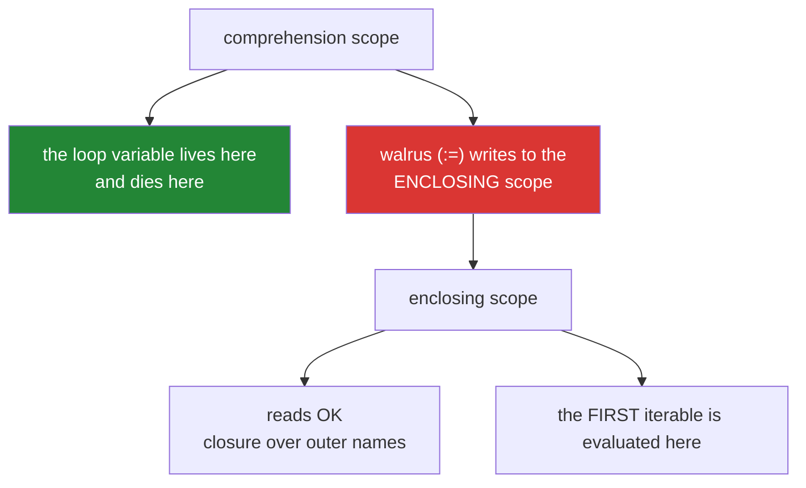

# 3.2 — Comprehension scope, and the walrus

## One-line answer

A comprehension has its **own scope**, so its loop variable does not leak into the surrounding function
— but a walrus assignment inside one deliberately **does** leak, which is what makes
`[y for x in xs if (y := f(x))]` compute `f` once instead of twice.

---

## The story

Two bugs, and the second only exists because the first was fixed.

The first is old. In Python 2, a comprehension's loop variable leaked:

```text
x = "important"
squares = [x * x for x in range(5)]
print(x)          # 4, in Python 2 - the variable was overwritten
```

A comprehension could silently destroy a variable in the enclosing function. Python 3 gave
comprehensions their own scope and the bug disappeared.

The second is new. Somebody writes a filter-and-transform:

```text
keys = [normalise(t) for t in titles if normalise(t)]
```

and a reviewer points out it calls `normalise` twice per title
([1.2](../01-list-comprehensions/1.2-the-filter-clause.md)). The fix is a walrus:

```text
keys = [key for t in titles if (key := normalise(t))]
```

One call, correct — and `key` now **exists after the comprehension**, holding the last computed value.
A later line in the same function that happens to use `key` for something else silently reads a
leftover.

The scope isolation was added deliberately. The walrus was given an escape from it, also deliberately.
Both decisions are right, and knowing which one is operating in a given line is what stops you being
surprised by either.

---

## The idea in plain language

### The comprehension's own scope

In Python 3, a comprehension is compiled as an **implicit function**. It has its own local namespace, so:

- The loop variable is **local to the comprehension** and does not exist afterwards.
- It **shadows** an outer variable of the same name for the duration, without changing it.
- It can **read** enclosing variables — closures work as usual.
- It cannot **assign** to an enclosing variable (except via the walrus, below).

```text
x = "important"
[x * 2 for x in range(3)]
x                          # still "important"
```

The one exception to the isolation is the **first** iterable: `[y for y in some_source]` evaluates
`some_source` in the *enclosing* scope, before the implicit function is entered. That is why a
comprehension at class level can use a class attribute as its source and not inside its expression —
a genuine oddity worth knowing about and rarely worth writing.



### The walrus, and why it leaks on purpose

`:=` — the assignment expression, added in Python 3.8 — assigns **and** produces the value, so it can
appear where only expressions are allowed.

Inside a comprehension it binds in the **enclosing** scope, not the comprehension's. That was a
deliberate design decision: the whole point of allowing it there is to make a computed value available
to the expression slot, and — as a documented consequence — after the comprehension too.

The three shapes it enables:

```text
[y for x in xs if (y := f(x))]              # compute once, filter on it, use it
[y for x in xs if (y := f(x)) > THRESHOLD]  # filter on a derived value
total = 0
[total := total + x for x in xs]            # a running total - legal, and see part 3.1
```

The third is legal and is exactly the accumulation that
[3.1](3.1-when-a-comprehension-is-wrong.md) says belongs in a loop. Being able to write it does not
make it the right form.

### The parentheses are usually required

`if (y := f(x))` needs its parentheses in most positions — the grammar requires them wherever the
result would be ambiguous, which is nearly everywhere in a comprehension. When in doubt, add them; they
are never wrong.

And the walrus **cannot** be used on the iterable of the first `for` clause, which is a specific
prohibition in the language to avoid exactly the confusion of a variable being bound in two scopes at
once.

### The alternative that needs no walrus

Nesting a generator does the same job with no leak:

```text
[key for key in (normalise(t) for t in titles) if key]
```

The inner generator transforms; the outer comprehension filters. One call per title, nothing escapes,
and — for many readers — clearer than the walrus.

Which to prefer is a team decision. The walrus is shorter; the nested form is more obvious.

### Two names, one danger

Because the walrus writes outward, a name used inside a comprehension can collide with one used outside
it. The defence is a name that could only mean the comprehension's temporary: `key`, `parsed`, `score`
— and *not* a name the function already uses for something else.

---

## Why Setu needs it

- **[1.2](../01-list-comprehensions/1.2-the-filter-clause.md)** introduced the double-call problem and
  named the walrus as the fix; this is that fix explained.
- **[2.2](../02-dict-set-gen/2.2-set-comprehensions.md)** and
  **[2.1](../02-dict-set-gen/2.1-dict-comprehensions.md)** both hit the same pattern when a normaliser
  is filtered on.
- **[Day 7's normaliser](../../../day-07-strings/parts/04-normalising/4.1-the-title-normaliser.md)**
  returns `str | None`, so `[k for t in raw if (k := normalise_title(t))]` is the exact production use —
  and it is expensive enough that halving the calls matters.
- **Day 10's scope** (`PY-10`) covers local, enclosing, global and built-in namespaces properly; this is
  a preview of the rules on a construct you now use constantly.
- **Day 6's capped retry** ([Day 6, 3.2](../../../day-06-loops/parts/03-capped-retry/3.2-the-capped-retry-from-scratch.md))
  uses the same walrus idiom in `while` conditions, which is its other natural home.
- **Day 30's cleaning** (`PD-`) applies expensive per-row transforms; a doubled call there is a doubled
  pass over a frame.

---

## The mechanism

The scope, and what does and does not survive:

```python
"""A comprehension has its own scope. Watch what leaks and what does not."""

x = "important"
squares = [x * x for x in range(5)]
print(f"after the comprehension, x is {x!r}")
print(f"    (in Python 2 this would print 4)")

print()
print("the loop variable does not exist afterwards:")
[item for item in range(3)]
try:
    print(item)
except NameError as exc:
    print(f"    NameError: {exc}")

print()
print("but enclosing variables are readable - closures work:")
multiplier = 10
print(f"    {[n * multiplier for n in range(4)]}")

print()
print("and a plain assignment inside is impossible:")
print("    [total = total + n for n in range(3)]  -> SyntaxError")

print()
print("the walrus DOES leak, deliberately:")
values = [1, 2, 3]
doubled = [d for n in values if (d := n * 2) > 2]
print(f"    result: {doubled}")
print(f"    d after the comprehension: {d}   <- the LAST computed value")
```

**Line by line:**

- `x` is still `"important"` — the comprehension's `x` lived in its own scope and died there. **In Python
  2 this printed `4`**, which is why the change was made.
- `print(item)` raises `NameError` — the loop variable does not outlive the comprehension. That is the
  isolation working.
- `[n * multiplier for n in range(4)]` — `multiplier` is read from the enclosing scope. **Reading out is
  fine; writing out is not**, which is the asymmetry.
- `(d := n * 2)` — the walrus. `d` exists afterwards and holds `6`, the last value computed — **not the
  last value kept**. If the final item had been filtered out, `d` would hold that filtered value, which
  is a genuinely confusing thing to read later.
- The parentheses around `d := n * 2` are required here.

The double call, and the two fixes:

```python
"""Compute once. The walrus and the nested generator both do it; they differ in what escapes."""

calls = {"n": 0}


def normalise(title: str) -> str:
    calls["n"] += 1
    return " ".join(title.split()).casefold()


titles = ["  Attention  ", "", "BERT", "   "]

calls["n"] = 0
naive = [normalise(t) for t in titles if normalise(t)]
print(f"naive   : {naive}")
print(f"          normalise called {calls['n']} times for {len(titles)} titles")

calls["n"] = 0
with_walrus = [key for t in titles if (key := normalise(t))]
print(f"walrus  : {with_walrus}")
print(f"          normalise called {calls['n']} times")
print(f"          and `key` escaped, holding {key!r}")

calls["n"] = 0
nested = [key for key in (normalise(t) for t in titles) if key]
print(f"nested  : {nested}")
print(f"          normalise called {calls['n']} times")
print("          and nothing escaped:")
try:
    print(f"          key is {key!r}")
except NameError as exc:
    print(f"          NameError: {exc}")

print()
print("filtering on a DERIVED value, which is the walrus's best use:")
scores = ["0.9", "abc", "0.2", "1.5"]


def parse(text: str) -> float | None:
    try:
        return float(text)
    except ValueError:
        return None


high = [value for text in scores if (value := parse(text)) is not None and value > 0.5]
print(f"    {high}")
```

**Line by line:**

- `[normalise(t) for t in titles if normalise(t)]` — **eight calls for four titles.** The filter cannot
  see the expression ([1.2](../01-list-comprehensions/1.2-the-filter-clause.md)).
- `[key for t in titles if (key := normalise(t))]` — **four calls.** The walrus binds `key`, the filter
  tests it, and the expression slot reuses it.
- `key` printing after the comprehension — it escaped. Note it holds `'   '` normalised to `''` in this
  run, because the last title was whitespace and was **filtered out**: the leaked value is the last
  *computed* one, not the last *kept* one.
- The nested-generator version also makes four calls and leaks nothing — the `key` name here is the
  outer comprehension's loop variable, which is local. **Same cost, different leak profile**, and the
  `NameError` proves it.
- `if (value := parse(text)) is not None and value > 0.5` — the walrus's strongest case: parse once,
  check for failure, and filter on the parsed value, all in one clause. Writing this without a walrus
  needs either three calls or a nested generator.
- `parse` returning `None` rather than raising is the sentinel-helper option from
  [3.1](3.1-when-a-comprehension-is-wrong.md), and it is what lets a `try` live outside the
  comprehension.

The leak as a bug, and the naming defence:

```python
"""The walrus writes outward. That is useful, and it can collide."""


def process(rows: list[dict]) -> dict:
    total = 0
    for row in rows:
        total += row["n"]

    kept = [total for row in rows if (total := row["n"]) > 1]

    return {"kept": kept, "total": total}


print(process([{"n": 1}, {"n": 5}, {"n": 2}]))
print("    `total` was 8 before the comprehension and is now the LAST row's n")

print()
print("the same function with a name that cannot collide:")


def process_safe(rows: list[dict]) -> dict:
    total = sum(row["n"] for row in rows)
    kept = [candidate for row in rows if (candidate := row["n"]) > 1]
    return {"kept": kept, "total": total}


print(process_safe([{"n": 1}, {"n": 5}, {"n": 2}]))

print()
print("running totals are legal and belong in a loop (part 3.1):")
running = 0
accumulated = [running := running + n for n in (1, 2, 3)]
print(f"    walrus version : {accumulated}, running={running}")
import itertools

print(f"    the readable one: {list(itertools.accumulate((1, 2, 3)))}")
```

**Line by line:**

- `(total := row["n"])` — the walrus overwrote `total`, which the function had already computed. The
  returned `total` is `2` (the last row's `n`) instead of `8`. **No error**, and the two uses of the name
  are twelve lines apart.
- `kept` is `[5, 2]` and is correct, which is what makes this dangerous: **the visible result is right
  and the returned `total` is silently wrong.** A test asserting on `kept` passes; only a test asserting
  the total catches it.
- `process_safe` uses `candidate` — a name that could only be the comprehension's temporary — and
  computes `total` with a generator expression that has no walrus at all.
- `[running := running + n for n in (1, 2, 3)]` — a running total, legal, and exactly what
  [3.1](3.1-when-a-comprehension-is-wrong.md) says is a loop's job. `itertools.accumulate` says the same
  thing without the leak or the cleverness.

---

## When it breaks

**The loop variable that does not exist:**

```text
>>> [i for i in range(3)]
[0, 1, 2]
>>> i
Traceback (most recent call last):
  File "<stdin>", line 1, in <module>
NameError: name 'i' is not defined
```

**What it means.** The comprehension's scope is gone. This surprises people porting Python 2 code, where
`i` would be `2` — and the Python 3 behaviour is the fix, not a regression. Note that a plain `for` loop
**does** leak its variable, which is the inconsistency to remember: loops leak, comprehensions do not.

**The assignment that is not allowed:**

```text
>>> total = 0
>>> [total = total + n for n in range(3)]
  File "<stdin>", line 1
    [total = total + n for n in range(3)]
     ^^^^^
SyntaxError: invalid syntax
>>> [total := total + n for n in range(3)]
[0, 1, 3]
```

**What it means.** Plain assignment is a statement and is refused; the walrus is an expression and is
allowed. The second line also *works* and mutates `total` in the enclosing scope — legal, and the
running-total shape [3.1](3.1-when-a-comprehension-is-wrong.md) argues belongs in a loop.

**The missing parentheses:**

```text
>>> [y for x in range(3) if y := x * 2]
  File "<stdin>", line 1
    [y for x in range(3) if y := x * 2]
                            ^^^^^^^^^^
SyntaxError: invalid syntax
>>> [y for x in range(3) if (y := x * 2)]
[2, 4]
```

**What it means.** The grammar requires the parentheses in this position. They are never wrong, so the
habit is to always write them.

**The walrus on the first iterable:**

```text
>>> [x for x in (items := [1, 2, 3])]
[1, 2, 3]
>>> [x for x in range(3) for y in (row := [x])]
[0, 1, 2]
```

**What it means.** The first works — the first iterable is evaluated in the **enclosing** scope, so the
walrus there is an ordinary outer assignment. The prohibition people half-remember is narrower than
"never on an iterable": it is that the walrus cannot rebind the comprehension's own loop variable. Both
of these are legal and both are worth avoiding, because working out which scope is being written to
costs a reader more than the line saves.

**And the leak that read a stale value:**

```text
>>> titles = ["a", "", "b", ""]
>>> kept = [k for t in titles if (k := t.strip())]
>>> kept
['a', 'b']
>>> k
''
```

**What it means.** `k` holds `''` — the **last computed** value, from a title that was filtered out. Code
after the comprehension that reads `k` expecting "the last kept item" gets the opposite. No error, and
the value is plausible.

---

## In production

**Use the walrus in a comprehension for exactly one thing: computing a value once so both the filter and
the expression can use it.** That is a real and frequent need — an expensive normaliser, a parse that
can fail, a lookup — and the alternative is either two calls or a nested generator. Outside that use,
a walrus in a comprehension is usually cleverness, and the running-total form in particular is a loop
pretending otherwise.

**Name the walrus target so it cannot collide.** Because it writes to the enclosing scope, a name the
function already uses will be silently overwritten, and the two uses can be far apart. `key`, `parsed`,
`candidate`, `score` — names that read as "the comprehension's temporary" — and never a name that
carries meaning elsewhere in the function. A reviewer should be able to see the walrus and the enclosing
scope in one screen; if they cannot, that is an argument for the nested-generator form.

**Prefer the nested generator when the team is mixed.** `[k for k in (normalise(t) for t in titles) if
k]` has the same cost, leaks nothing, and needs no knowledge of assignment expressions. The walrus is
shorter and demands a reader who knows the scoping rule. Both are defensible; what is not defensible is
having no convention, so that some files leak names and some do not.

**Do not rely on the leaked value.** It is the last **computed** value, not the last kept one, and the
distinction is invisible. If you need the last kept item, take it from the result: `kept[-1]`, with an
emptiness guard. Code that reads a walrus target after the comprehension is code that will confuse
somebody, including its author in six months.

**What changes at scale.** Halving the calls to an expensive function is the whole point: on five hundred
titles with a real normaliser — Unicode normalisation, several string passes
([Day 7, 4.2](../../../day-07-strings/parts/04-normalising/4.2-unicode-normalisation.md)) — the double
call is five hundred wasted passes, and on a million rows it is a doubled job. The scoping itself costs
nothing; the implicit function is created once per comprehension, not per item, and the slight overhead
of that is why a very small comprehension is marginally slower than the equivalent loop and completely
irrelevant next to the work.

**The review comment a senior engineer leaves.** On `[normalise(t) for t in titles if normalise(t)]`:
*"This calls `normalise` twice per title, and it is our most expensive per-row function. Use
`[key for t in titles if (key := normalise(t))]` — and pick a name that is not used elsewhere in the
function, since the walrus binds in the enclosing scope. If you would rather not leak, the nested
generator form does the same thing."*

**The interview question.** *"Does a list comprehension's loop variable leak into the enclosing scope?"*
The answer is no in Python 3 — a comprehension gets its own scope, compiled as an implicit function —
though it did in Python 2, and a plain `for` loop still does. The follow-up worth being ready for is
*"is there any way to assign outward from a comprehension?"* — the walrus operator, which binds in the
enclosing scope deliberately, and whose purpose is to compute a value once so that both the filter and
the value expression can use it, avoiding the double call in
`[f(x) for x in xs if f(x)]`. Strong answers add that the leaked value is the last *computed* one rather
than the last *kept* one, and that a nested generator expression achieves the same saving with no leak.

---

## Check yourself

```bash
uv run python -c "
x = 'important'
[x * 2 for x in range(3)]
print('x survived    :', repr(x))
[i for i in range(3)]
try:
    i
except NameError as exc:
    print('loop var      :', exc)
calls = {'n': 0}
def f(t):
    calls['n'] += 1
    return t.strip()
titles = ['  a  ', '', 'b', '   ']
calls['n'] = 0; naive = [f(t) for t in titles if f(t)]
print('naive         :', naive, '|', calls['n'], 'calls')
calls['n'] = 0; walrus = [k for t in titles if (k := f(t))]
print('walrus        :', walrus, '|', calls['n'], 'calls')
print('k leaked as   :', repr(k), '<- the last COMPUTED value, which was filtered out')
calls['n'] = 0; nested = [k2 for k2 in (f(t) for t in titles) if k2]
print('nested        :', nested, '|', calls['n'], 'calls, nothing leaked')
"
```

The `k leaked as` line is the one to look at hardest: it is not the last item in the result.

**Answer out loud, without scrolling up:**

> Say whether a comprehension's loop variable leaks, and what changed between Python 2 and 3. Then
> explain what the walrus is for inside a comprehension, and why the value it leaves behind is not the
> last item of the result.

---

**Next:** [3.3 — The list you never needed](3.3-the-list-you-never-needed.md)
