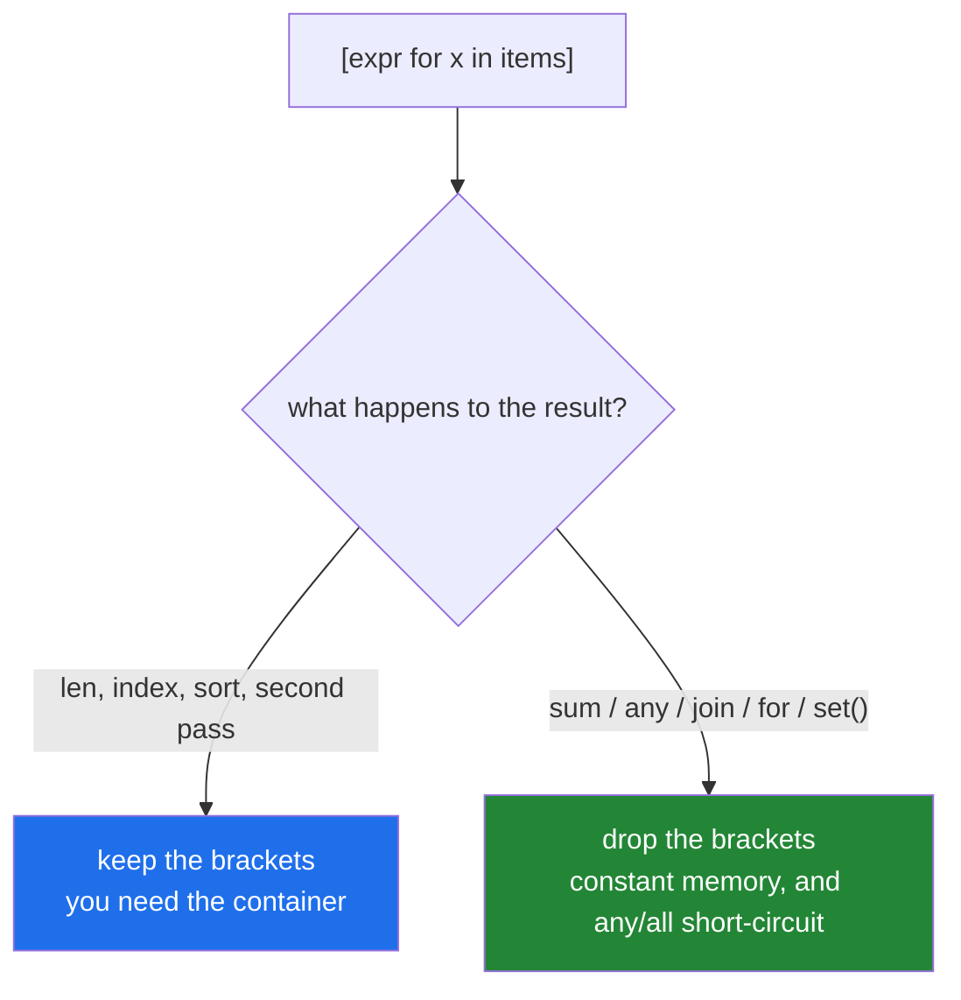

# 3.3 — The list you never needed

## One-line answer

A comprehension whose result is consumed once — summed, counted, joined, searched, iterated — builds a
container nobody keeps, and replacing the brackets with parentheses turns memory proportional to the
data into memory that does not grow at all.

---

## The story

An overnight aggregation, three lines, and a memory profile that grew with the data until it did not
fit.

```text
lengths = [len(line) for line in handle]
total = sum(lengths)
count = len(lengths)
```

Twenty million lines, twenty million integers held simultaneously so that two numbers could be
computed from them. The list existed for the duration of two function calls and was then garbage.

The rewrite is two lines and holds nothing:

```text
total = count = 0
for line in handle:
    total += len(line)
    count += 1
```

or, keeping the declarative shape:

```text
total = sum(len(line) for line in handle)
```

— and the count needs a second pass or the loop, because a generator is consumed once
([2.3](../02-dict-set-gen/2.3-the-generator-expression.md)).

That last constraint is the real content of this part. Laziness is not free: it trades memory for
*single use*, and knowing when you genuinely need a second pass is the difference between a correct
optimisation and a silent empty result.

---

## The idea in plain language

### The question to ask

**Does anything need this collection to exist?**

Materialise when you need: a length, an index, a slice, a sort, a second pass, or the whole thing held
while something else runs.

Stream when the result is consumed once by: `sum`, `min`, `max`, `any`, `all`, `next`, `join`, a `for`
loop, or a constructor like `set()`, `dict()`, `Counter()`.



### The five idioms worth converting on sight

| Written | Better | Why |
|---|---|---|
| `sum([f(x) for x in xs])` | `sum(f(x) for x in xs)` | no intermediate list |
| `any([p(x) for x in xs])` | `any(p(x) for x in xs)` | **and it short-circuits** |
| `"".join([str(x) for x in xs])` | `"".join(str(x) for x in xs)` | no intermediate list |
| `set([f(x) for x in xs])` | `{f(x) for x in xs}` | a set comprehension |
| `len([x for x in xs if p(x)])` | `sum(1 for x in xs if p(x))` | counts without collecting |

`any` and `all` are the ones that change complexity rather than just memory: with a list they evaluate
everything, with a generator they stop at the first decisive item
([2.3](../02-dict-set-gen/2.3-the-generator-expression.md)).

Ruff flags several of these — `C419` for the `any`/`all` case, `C400`–`C403` for the redundant
constructor calls.

### `join` is the exception that is not

`"".join(...)` accepts a generator and is one of the cases where the list version is sometimes
*faster* — `join` needs the total length to allocate once, so with a generator it materialises
internally anyway. The memory is the same; the speed difference is small and can go either way.

Write the generator form for consistency and do not worry about it. What matters is the sixty other
places where the list is pure waste.

### What laziness costs

Three things, all covered in [2.3](../02-dict-set-gen/2.3-the-generator-expression.md) and worth
restating as costs rather than properties:

1. **Single use.** A second consumer sees nothing, silently.
2. **No length, no indexing.** `len()` and `[0]` raise.
3. **Deferred errors.** An exception inside the expression surfaces at the *consumer*, so the traceback
   points at `sum(...)` rather than at the line that built the generator — one layer removed from the
   code that looks responsible.

The third is the one that makes debugging lazy pipelines harder, and it is the honest argument for
materialising during development and streaming in production.

### Two passes over a stream

If you genuinely need `sum` and `count`, the options are:

- **A loop** — one pass, both numbers, and room for a log line. Usually the right answer.
- **Re-open the source** — two passes over a file, twice the I/O, no memory.
- **`itertools.tee`** — duplicates an iterator, and buffers everything one consumer has read that the
  other has not. For two passes over the whole thing that buffer *is* the list you were avoiding.

`tee` is the one people reach for and it is rarely the answer. Knowing why is the professional
position.

---

## Why Setu needs it

- **[2.3](../02-dict-set-gen/2.3-the-generator-expression.md)** established the mechanism; this is the
  decision procedure.
- **[3.1](3.1-when-a-comprehension-is-wrong.md)**'s four boundaries plus this one are the complete set of
  reasons not to write a comprehension as-is.
- **Day 11's generators** (`PY-11`) writes the `yield` form of the same idea — the plan's "stream a 2 GB
  log line-by-line" example.
- **Day 16's file handling** (`PY-19`) is where this stops being an optimisation and becomes the only
  option.
- **Day 164's chunking** (`RAG-04`) streams documents into chunks; materialising every chunk of every
  document at once is the story, and **Day 196's context trimming** (`LG-12`) streams messages for the
  same reason.
- **Day 20's NumPy** (`NP-01`) is the other direction entirely: for numeric work you *want* the
  contiguous array, and streaming is the wrong shape. Knowing which regime you are in is the point.

---

## The mechanism

The five idioms, measured:

```python
"""Same answers. One set of them allocates a list nobody keeps."""

import tracemalloc

N = 500_000


def peak_bytes(fn) -> tuple[object, int]:
    tracemalloc.start()
    result = fn()
    _, peak = tracemalloc.get_traced_memory()
    tracemalloc.stop()
    return result, peak


cases = [
    ("sum([...])       ", lambda: sum([x * 2 for x in range(N)])),
    ("sum(...)         ", lambda: sum(x * 2 for x in range(N))),
    ("len([x for ...]) ", lambda: len([x for x in range(N) if x % 3 == 0])),
    ("sum(1 for ...)   ", lambda: sum(1 for x in range(N) if x % 3 == 0)),
    ("set([...])       ", lambda: len(set([x % 100 for x in range(N)]))),
    ("{...}            ", lambda: len({x % 100 for x in range(N)})),
]

print(f"{'form':<20} {'result':>12} {'peak bytes':>14}")
for label, fn in cases:
    result, peak = peak_bytes(fn)
    print(f"{label:<20} {result:>12,} {peak:>14,}")
```

**Line by line:**

- `tracemalloc` — the standard library allocation tracker, and the right tool for "how much did this
  actually use" rather than `sys.getsizeof`, which measures one object
  ([Day 8, 1.1](../../../day-08-containers/parts/01-sequences/1.1-a-list-is-a-dynamic-array.md)).
- `sum([x * 2 for x in range(N)])` versus `sum(x * 2 for x in range(N))` — **identical results, and the
  peak differs by megabytes.** Two characters.
- `len([x for x in range(N) if x % 3 == 0])` builds a list purely to call `len` on it.
  `sum(1 for x in ...)` counts without collecting — the same number, constant memory.
- `set([x % 100 for x in range(N)])` builds a list of half a million items and then a set of a hundred.
  `{x % 100 for x in range(N)}` builds only the set
  ([2.2](../02-dict-set-gen/2.2-set-comprehensions.md)).
- **Read the peak column, not the result column.** Every pair agrees on the answer, which is exactly why
  this is invisible in tests.

Short-circuiting, which changes the work rather than the memory:

```python
"""any and all stop early on a generator. That is a complexity difference, not a memory one."""

import time

calls = {"n": 0}


def expensive_check(value: int) -> bool:
    calls["n"] += 1
    return value < 0


values = [1, -1] + [1] * 500_000

for label, fn in (
    ("any([...])", lambda: any([expensive_check(v) for v in values])),
    ("any(...)  ", lambda: any(expensive_check(v) for v in values)),
    ("all([...])", lambda: all([not expensive_check(v) for v in values])),
    ("all(...)  ", lambda: all(not expensive_check(v) for v in values)),
):
    calls["n"] = 0
    started = time.perf_counter()
    result = fn()
    print(
        f"{label} -> {result!s:<5} {calls['n']:>9,} calls  {time.perf_counter() - started:>7.4f}s"
    )

print()
print("next() is the same idea for 'the first match':")
calls["n"] = 0
first = next((v for v in values if expensive_check(v)), None)
print(f"    next(genexp, None) -> {first}   {calls['n']:,} calls")
calls["n"] = 0
matches = [v for v in values if expensive_check(v)]
print(f"    [comprehension][0] -> {matches[0]}   {calls['n']:,} calls")
```

**Line by line:**

- `any([...])` — the list is built **first**, so `expensive_check` runs half a million times, and only
  then does `any` inspect the result.
- `any(...)` — **two calls.** It stops at the second value. This is not a 30% saving; it is a different
  amount of work, and the ratio grows with the input.
- The `all` pair behaves the same way: `all` stops at the first `False`.
- `next((v for v in values if expensive_check(v)), None)` — the "first match or nothing" idiom
  ([Day 6, 2.1](../../../day-06-loops/parts/02-control-flow/2.1-break-and-which-loop-it-leaves.md)). Two
  calls.
- The comprehension version finds **every** match and then takes the first — half a million calls and a
  list of results, to answer a question about one item. **`matches[0]` also raises `IndexError` when
  nothing matches**, where `next(..., None)` returns the default.

The story, and the cost of the second pass:

```python
"""Two numbers from one stream. Three ways, and only one of them is free."""

import itertools
import tempfile
import tracemalloc
from pathlib import Path

path = Path(tempfile.gettempdir()) / "setu-day09-agg.log"
path.write_text("".join(f"line {i} padding\n" for i in range(300_000)), encoding="utf-8")


def with_list() -> tuple[int, int, int]:
    tracemalloc.start()
    with path.open(encoding="utf-8") as handle:
        lengths = [len(line) for line in handle]
    result = (sum(lengths), len(lengths))
    _, peak = tracemalloc.get_traced_memory()
    tracemalloc.stop()
    return (*result, peak)


def with_loop() -> tuple[int, int, int]:
    tracemalloc.start()
    total = count = 0
    with path.open(encoding="utf-8") as handle:
        for line in handle:
            total += len(line)
            count += 1
    _, peak = tracemalloc.get_traced_memory()
    tracemalloc.stop()
    return (total, count, peak)


def with_two_passes() -> tuple[int, int, int]:
    tracemalloc.start()
    with path.open(encoding="utf-8") as handle:
        total = sum(len(line) for line in handle)
    with path.open(encoding="utf-8") as handle:
        count = sum(1 for _ in handle)
    _, peak = tracemalloc.get_traced_memory()
    tracemalloc.stop()
    return (total, count, peak)


for label, fn in (
    ("list      ", with_list),
    ("loop      ", with_loop),
    ("two passes", with_two_passes),
):
    total, count, peak = fn()
    print(f"{label}: total={total:,} count={count:,} peak={peak:>12,} bytes")

print()
print("itertools.tee, which people reach for and usually should not:")
gen = (x for x in range(10))
left, right = itertools.tee(gen, 2)
print(f"    sum(left)  = {sum(left)}")
print(f"    max(right) = {max(right)}")
print("    it worked - and tee buffered every item left had seen that right had not,")
print("    which for two full passes IS the list you were avoiding")

path.unlink()
```

**Line by line:**

- `with_list` — the story. It holds three hundred thousand integers so that two numbers can be computed.
  The peak is the whole list.
- `with_loop` — **one pass, both numbers, constant memory**, and there is room in the body for a log
  line or a filter count
  ([Day 6, 2.2](../../../day-06-loops/parts/02-control-flow/2.2-continue-and-the-skipped-increment.md)).
  This is usually the right answer, and it is a loop, which is
  [3.1](3.1-when-a-comprehension-is-wrong.md)'s point arriving again.
- `with_two_passes` — constant memory and **twice the I/O**. Right when the source is cheap to re-read
  and wrong for a network stream or a paid API.
- `itertools.tee(gen, 2)` — it works, and the buffer grows to hold everything the faster consumer has
  read. For two complete passes the buffer reaches the full length, so **`tee` uses the memory you were
  trying to avoid** plus overhead. It earns its place only when the two consumers stay roughly in step.
- `path.unlink()` — clean up the scratch file.

---

## When it breaks

**It does not break — until it does, with no traceback:**

```text
$ python aggregate.py            # 5 MB sample
total=142,905 count=5,000
$ python aggregate.py            # 2 GB log
Killed
$ echo $?
137
```

**What it means.** Exit 137 is `SIGKILL` from the kernel's out-of-memory killer
([Day 6, 4.1](../../../day-06-loops/parts/04-loop-cost/4.1-the-accidental-quadratic.md)). **No Python
traceback**, because the process was executed rather than failing — which is what makes a memory bug
harder to diagnose than a slow one.

**The generator consumed by the count:**

```text
>>> lengths = (len(line) for line in ["a", "bb"])
>>> count = sum(1 for _ in lengths)
>>> count
2
>>> total = sum(lengths)
>>> total
0
```

**What it means.** The count drained it; the sum saw nothing and returned `0` — **a plausible number, not
an error.** This is the trade laziness makes, and it is why the loop is usually better than two
generator passes when you need two numbers.

**The error that surfaces at the wrong line:**

```text
>>> values = ["1", "x", "3"]
>>> gen = (int(v) for v in values)
>>> gen
<generator object <genexpr> at 0x7f3c8a1b2d10>
>>> sum(gen)
Traceback (most recent call last):
  File "<stdin>", line 1, in <module>
  File "<stdin>", line 1, in <genexpr>
ValueError: invalid literal for int() with base 10: 'x'
```

**What it means.** The traceback names `sum` first and the generator expression second. The line that
*created* the generator ran without incident. In a real pipeline the consumer can be several functions
away from the producer, so the stack trace points at code that merely asked for data. **Reading the
`<genexpr>` frame is the tell.**

**The `len` that cannot work:**

```text
>>> len(x for x in range(3))
Traceback (most recent call last):
  File "<stdin>", line 1, in <module>
TypeError: object of type 'generator' has no len()
>>> sum(1 for x in range(3))
3
```

**What it means.** A generator does not know how many items it will produce. `sum(1 for ...)` counts by
consuming, which is the correct idiom — and note it **consumes**, so the generator is spent afterwards.

**And the one that is correct and still wasteful:**

```text
>>> import sys
>>> data = [x for x in range(1_000_000)]
>>> sys.getsizeof(data)
8448728
>>> total = sum(data)
>>> del data
```

**What it means.** Eight megabytes held for one `sum`. Nothing failed, the tests pass, and the memory
profile of the job is eight megabytes higher than it needs to be for the duration — multiplied by
however many such lines the codebase has. **This is the shape to notice in review**, because it is
correct code.

---

## In production

**Ask what happens to the result, and drop the brackets when the answer is "consumed once".** The five
idioms — `sum`, `any`/`all`, `join`, a container constructor, and `len` of a filtered list — cover most
of the real occurrences, and converting them is mechanical, safe, and catchable by a linter. `any([...])`
is the one worth prioritising, because it changes the amount of work rather than just the memory.

**Materialise deliberately and say so.** When you need the list, write `list(...)` or keep the brackets
and let the shape carry the intent. The failure mode of over-applying laziness is a function that returns
a generator, a caller that iterates it twice, and an empty second pass with no error — so a public
function usually returns a `list` and the annotation says which
([2.3](../02-dict-set-gen/2.3-the-generator-expression.md)).

**For two aggregates over one stream, write the loop.** One pass, both numbers, constant memory, and room
for the counters and log lines a real pipeline needs. `itertools.tee` looks like the clever answer and
buffers what it defers, so for two full passes it costs the memory you were avoiding. Re-reading the
source is right only when the source is cheap — a local file, not a paid API
([Day 6, 3.1](../../../day-06-loops/parts/03-capped-retry/3.1-why-the-cap-comes-first.md)'s budget
thinking applies).

**Profile memory the way you profile time: at two sizes.** `tracemalloc` around a suspect block, run at
`n` and `4n`, tells you whether the peak grows with the input — which is the memory equivalent of the
ratio test ([Day 8, 3.1](../../../day-08-containers/parts/03-dedup/3.1-ten-thousand-ids-timed.md)). A
peak that grows linearly with the input has a size at which the job dies, and knowing that number before
production does is the whole exercise.

**What changes at scale is the failure mode, not the speed.** A materialising pipeline is fine, fine,
fine, and then killed — a step change with no warning and no traceback. A streaming one degrades
gracefully by being slower. That difference is why memory shape is an architectural property of a data
pipeline rather than an optimisation, and it is why "does this need to exist?" is worth asking of every
comprehension over something unbounded.

**The review comment a senior engineer leaves.** On `lengths = [len(line) for line in handle]` followed
by a `sum` and a `len`: *"This holds twenty million integers to compute two numbers. Use a loop —
`total += len(line); count += 1` — which is one pass and constant memory and leaves room for the
malformed-line counter we wanted. And the `any([...])` on line 88 builds the whole list before checking;
drop the brackets and it stops at the first match."*

**The interview question.** *"What is wrong with `sum([x * 2 for x in big])`?"* The answer is that it
builds a list of every result before summing, so memory is proportional to the input for no reason —
dropping the brackets makes it a generator expression with constant memory and the same answer. The
follow-up worth being ready for is *"where does that matter most?"* — `any` and `all`, because a
generator lets them short-circuit at the first decisive item while a list evaluates everything first,
which is a change in the amount of work rather than just memory. Strong answers add the cost of
laziness: single use, no length, and errors surfacing at the consumer rather than the producer — and
that when you need two aggregates over one stream, a loop beats both a materialised list and
`itertools.tee`.

---

## Check yourself

```bash
uv run python -c "
import tracemalloc, time
N = 300_000
def peak(fn):
    tracemalloc.start(); r = fn(); _, p = tracemalloc.get_traced_memory(); tracemalloc.stop(); return r, p
for label, fn in (('sum([...])', lambda: sum([x*2 for x in range(N)])),
                  ('sum(...)  ', lambda: sum(x*2 for x in range(N))),
                  ('len([...])', lambda: len([x for x in range(N) if x % 3 == 0])),
                  ('sum(1 ...)', lambda: sum(1 for x in range(N) if x % 3 == 0))):
    r, p = peak(fn); print(f'{label} -> {r:>12,}  peak {p:>12,} bytes')
calls = {'n': 0}
def check(v):
    calls['n'] += 1
    return v < 0
vals = [1, -1] + [1] * 200_000
calls['n'] = 0; any([check(v) for v in vals]); print('any([...]):', f\"{calls['n']:,}\", 'calls')
calls['n'] = 0; any(check(v) for v in vals);   print('any(...)  :', f\"{calls['n']:,}\", 'calls')
"
```

Every pair gives the same answer. Read the peak and the call counts.

**Answer out loud, without scrolling up:**

> Give the one question that decides between brackets and parentheses, and name three consumers that
> mean you can drop the brackets. Then say what laziness costs, and why a loop beats two generator
> passes when you need two aggregates.

---

**Back to the hub:** [Day 9 — List and dict comprehensions](../../LESSON.md)
