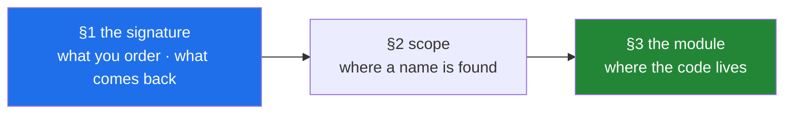

# Day 10 — Functions, scope, and your first `src/setu/` module

**Phase 1 · Python foundations · Module 1** · `PY-10` — functions, parameters, `*args`/`**kwargs` and
scope. The plan's named example for this ID is *your first `src/setu/` module — a tested
`clean_title()`*, and that module is what Phase 1's deliverable is built out of.

> **Yesterday:** the same loop said in one line, and the four boundaries where the one line is the
> wrong tool.
> **Today:** how to give a piece of work a name, a signature and a home — and the two scope rules
> that decide what a name means inside it.
> **Tomorrow:** iterators, generators, `lambda` and `map` — the last day of Module 1, and Phase 1's
> gate.

> **Read this hub first**, then work through `parts/` in order. No time estimate here or anywhere — a
> day is a unit of subject, not of hours (Principle 17).

---

## §1 The story

You walk up to a coffee counter and say four words: *"one flat white, please."*

A minute later a flat white arrives. You did not grind anything and you do not know which machine
they used. Say the same four words in a different shop and the same thing happens, because those
words are a **promise**: give us this, and you get that.

Everything in today is somewhere at that counter.

- The **order** is the signature: what you have to say, and what comes back.
- The **house default** — "a coffee" means medium, cow's milk — is a card taped to the wall, written
  once when the shop opened, shared by every customer who does not say otherwise.
- The **"anything else?" box** at the bottom of the order form is `**kwargs`: it catches what the
  three labelled boxes cannot, and everything in it is unlabelled.
- The **pharmacist's label** next door — *dose: 2 tablets, frequency: 3 times daily* — is a
  keyword-only parameter. Some things must be said with their name attached, and a good form makes
  the mistake impossible rather than asking you not to make it.
- The **board above the counter** is the docstring and the type hints. Nobody reads it for pleasure;
  they read it so that they can order without a conversation. When it is out of date, the cost is
  paid at every transaction, by both people, forever.

Then the day turns to a different question, which is not *what did you order* but *where does
Python look when it meets a name*. That one has its own scene, and it is the scissors: your own
drawer, then the drawer in this room, then the kitchen drawer, then the fire extinguisher the
building provides. Four places, nearest first, stopping at the first one that has what you need.

Two things go wrong there, and both are famous:

- Sticking a label on a drawer changes where everybody looks **immediately**, including before you
  have put anything in it. That is `UnboundLocalError`, and it is why `total += 1` inside a function
  raises when there is a perfectly good `total` at the top of the file.
- A note that says "use the number on the whiteboard" is not a note containing a number. Post three
  of those and all three read the board on the day they are opened. That is late binding, and it is
  why three functions built in a loop all give the same answer.

The day ends where the plan says it should: the recipe on the back of an envelope goes into the
family book. `clean_title()` gets a name, a signature, a docstring, a home in `src/setu/textutils.py`
and a test — on the day you wrote it, while you still remember why.



---

## §2 The map

**What the section numbers mean today.** One ID, so the sections follow the plan's `lab` split from
mechanism to production use: **1.x** is the signature — everything about what goes in and what comes
back; **2.x** is scope — what a name means once you are inside; **3.x** is where both meet, in the
first module of this project that anything else imports.

### Section 1 — the signature

| Part | What it answers | Level |
|---|---|---|
| [1.1 A function is a named promise](parts/01-the-signature/1.1-a-function-is-a-promise.md) | Why does a function that did the work still hand back nothing? | `foundation` |
| [1.2 Positional and keyword arguments](parts/01-the-signature/1.2-positional-and-keyword.md) | Which mistake can Python catch — a wrong position, or a mistyped name? | `foundation` |
| [1.3 Default values, and when they are worked out](parts/01-the-signature/1.3-defaults-and-when-they-run.md) | Exactly when is `into=[]` evaluated, and how many times? | `working` |
| [1.4 `*args` and `**kwargs` — the catch-all box](parts/01-the-signature/1.4-args-and-kwargs.md) | What does the same star mean in a definition and in a call? | `working` |
| [1.5 Keyword-only and positional-only parameters](parts/01-the-signature/1.5-keyword-only-and-positional-only.md) | Why does the error say "1 positional argument" for a three-parameter function? | `production` |
| [1.6 The signature is the contract](parts/01-the-signature/1.6-the-signature-is-the-contract.md) | If Python ignores type hints, who are they for? | `production` |

### Section 2 — scope

| Part | What it answers | Level |
|---|---|---|
| [2.1 LEGB — the four places Python looks](parts/02-scope/2.1-legb-where-a-name-is-found.md) | What stops the search, and why is shadowing a feature? | `foundation` |
| [2.2 `UnboundLocalError`, and the assignment that changes everything](parts/02-scope/2.2-unboundlocalerror.md) | How can a line that never runs break the line above it? | `working` |
| [2.3 `global` and `nonlocal`, and why you rarely want either](parts/02-scope/2.3-global-and-nonlocal.md) | Why do you need a keyword to write an outer name but not to read one? | `working` |
| [2.4 Closures, and the loop that captured the wrong number](parts/02-scope/2.4-closures-and-late-binding.md) | Why do three functions built in a loop all give the same answer? | `production` |

### Section 3 — the module

| Part | What it answers | Level |
|---|---|---|
| [3.1 From notebook to module](parts/03-the-module/3.1-from-notebook-to-module.md) | What exactly is being preserved by doing it the same day? | `working` |
| [3.2 Designing `clean_title()`](parts/03-the-module/3.2-designing-clean-title.md) | Which of its three options is off by default, and why? | `production` |
| [3.3 Pure functions and the seam a test needs](parts/03-the-module/3.3-pure-functions-and-the-seam.md) | What one move makes a function that reads the clock testable? | `production` |

---

## §3 Setup — run this

**No new packages today.** Everything is the language itself plus `inspect`, `functools`,
`dataclasses` and `datetime` from the standard library. Module 1 is the language before any library.

```bash
mkdir -p src/setu tests notebooks
touch src/setu/textutils.py tests/test_textutils.py

# a scratchpad for today - the notebook is never the deliverable (P6)
touch notebooks/day-10-scratch.ipynb

# prove the package is importable BEFORE you write anything into it (part 3.1)
uv run python -c "import setu; print('package at:', setu.__file__)"

# the three facts the day is built on, before any part names them
uv run python -c "
def f(a, b=1, *args, **kwargs): pass
import inspect
print('signature   :', inspect.signature(f))
print('defaults    :', f.__defaults__, '<- evaluated ONCE, at def (part 1.3)')
late = [lambda: i for i in range(3)]
print('late binding:', [g() for g in late], '<- not [0, 1, 2] (part 2.4)')
"

# the two rules that catch today's headline bugs
uv run ruff rule B006
uv run ruff rule B023
```

| What | Where it comes from | Part |
|---|---|---|
| `def`, `return`, `__name__` | language | [1.1](parts/01-the-signature/1.1-a-function-is-a-promise.md) |
| positional and keyword arguments | language | [1.2](parts/01-the-signature/1.2-positional-and-keyword.md) |
| `__defaults__`, `__kwdefaults__` | language | [1.3](parts/01-the-signature/1.3-defaults-and-when-they-run.md) |
| `*args`, `**kwargs`, `functools.partial` | language, standard library | [1.4](parts/01-the-signature/1.4-args-and-kwargs.md) |
| the bare `*` and the `/` marker | language | [1.5](parts/01-the-signature/1.5-keyword-only-and-positional-only.md) |
| `inspect.signature`, `__annotations__`, `from __future__ import annotations` | standard library, language | [1.6](parts/01-the-signature/1.6-the-signature-is-the-contract.md) |
| `__code__.co_varnames` | language | [2.2](parts/02-scope/2.2-unboundlocalerror.md) |
| `global`, `nonlocal` | language | [2.3](parts/02-scope/2.3-global-and-nonlocal.md) |
| `__closure__`, `co_freevars`, `functools.partial` | language, standard library | [2.4](parts/02-scope/2.4-closures-and-late-binding.md) |
| `casefold`, `removesuffix` | already met on [Day 7](../day-07-strings/parts/02-methods/2.3-replace-and-removeprefix.md) | [3.2](parts/03-the-module/3.2-designing-clean-title.md) |
| ruff's `B006` and `B023` | already selected on [Day 2](../day-02-quality-gate/parts/01-linting/1.2-choosing-rule-families.md) | [1.3](parts/01-the-signature/1.3-defaults-and-when-they-run.md), [2.4](parts/02-scope/2.4-closures-and-late-binding.md) |

---

## §4 Build brief

One module, and it is the one Phase 1's deliverable is measured against — the plan asks for a
ten-function `src/setu/textutils.py`, fully tested. Today writes it; tomorrow's gate finishes it.

**1. `src/setu/textutils.py`** — the text utilities, with every signature decided before any body
([3.2](parts/03-the-module/3.2-designing-clean-title.md)).

```python
"""Text utilities for Setu: cleaning, keying, and comparing titles.

Every function here is pure unless its docstring says otherwise (part 3.3), and the
comparison form is a separate function from the display form on purpose (part 3.2).
"""

from __future__ import annotations

from datetime import date


def clean_title(
    raw: str,
    *,
    collapse_spaces: bool = True,
    strip_trailing_dot: bool = True,
    strip_bracketed_year: bool = False,
) -> str:
    """Return `raw` tidied for display, or as the input to `title_key`.

    Args:
        raw: the title as it arrived, including surrounding whitespace.
        collapse_spaces: replace every run of whitespace with a single space.
        strip_trailing_dot: remove ONE trailing full stop.
        strip_bracketed_year: remove a trailing "(2017)". Off by default because two
            conference versions of one paper differ only by this (part 3.2).

    Returns:
        Always a string. A title of only whitespace returns "".

    Does not lowercase - see `title_key`. Does not change `raw`.
    """
    # TODO(me): the four steps, in an order you can defend. Day 7's normaliser
    # (day-07, part 4.1) has the list; the decision about ORDER is yours, and one
    # ordering makes strip_trailing_dot behave differently. Say which in a comment.
    raise NotImplementedError


def clean_titles(raws: list[str]) -> list[str]:
    """Return `clean_title` applied to each entry, same order, same length."""
    # TODO(me): one comprehension, and no filter clause. Part 1.3 of day 9 says why
    # a filter here would be a silent length change.
    raise NotImplementedError


def title_key(raw: str) -> str:
    """Return a comparison key: cleaned, then case-folded. Never use for display."""
    # TODO(me): two calls, one line. Use casefold, not lower - day 7, part 2.1
    # says what breaks with lower(), and your test should include that case.
    raise NotImplementedError


def same_title(left: str, right: str) -> bool:
    """True when two titles are the same work by this module's definition."""
    # TODO(me): one line, and it MUST go through title_key - that is the whole
    # reason this function exists rather than each caller comparing for itself.
    raise NotImplementedError


def count_titles(text: str) -> int:
    """Return the number of non-empty lines in `text`. Pure: takes text, not a path."""
    # TODO(me): one line. Part 3.3 explains why this takes text rather than a Path.
    raise NotImplementedError


def summarise_years(rows: list[dict], *, today: date) -> str:
    """Return "N of M rows are from YYYY", using the year of `today`.

    `today` is a parameter rather than a call to date.today() so that this function
    can be tested with a fixed date (part 3.3). The caller does the reaching.
    """
    # TODO(me): two lines. Do NOT give `today` a default of date.today() - part 1.3
    # explains what that would freeze, and it is worse than reaching.
    raise NotImplementedError


def make_prefixer(prefix: str, width: int):
    """Return a function that formats one title with this prefix, cut to `width`.

    A deliberate closure (part 2.4): each call to this builds an independent
    formatter. Annotate the return type yourself - part 1.6 says why it matters here
    more than anywhere else in this file.
    """
    # TODO(me): a factory. Build several in a LOOP in your notebook and confirm they
    # do not all use the last prefix - if they do, you have found part 2.4's bug in
    # your own code, which is the point.
    raise NotImplementedError
```

**2. Fix a signature you already wrote.** Open `src/setu/text.py` from
[Day 7](../day-07-strings/LESSON.md) and `src/setu/pipeline.py` from
[Day 9](../day-09-comprehensions/LESSON.md). For each function, ask
[3.2](parts/03-the-module/3.2-designing-clean-title.md)'s four questions and fix what fails: any
boolean option that can be passed positionally gets a bare `*`
([1.5](parts/01-the-signature/1.5-keyword-only-and-positional-only.md)), any missing `-> ` gets one
([1.6](parts/01-the-signature/1.6-the-signature-is-the-contract.md)), and any docstring that does not
say whether it mutates its argument gets that sentence. **Run the existing tests before and after** —
an unchanged green suite is the proof the change was cosmetic.

**3. Reproduce the two headline bugs in the notebook, then throw the notebook away.** In
`notebooks/day-10-scratch.ipynb`: call a function with `into=[]` three times and print
`func.__defaults__` between calls; build three functions in a `for` loop over a list of provider names
and watch all three use the last one; then print `co_freevars` on both the broken and the fixed
version. Principle 2 asks you to reproduce before you fix. **The notebook is not committed**
(Principle 6); `src/setu/textutils.py` and its tests are.

---

## §5 The eval that must be able to fail

Create `tests/test_textutils.py`. Every one of these runs offline and belongs in `./m check`.

```python
"""Day 10: prove the contracts in textutils.py, rather than believing them."""

from __future__ import annotations

from datetime import date

import pytest

from setu.textutils import (
    clean_title,
    clean_titles,
    count_titles,
    make_prefixer,
    same_title,
    summarise_years,
    title_key,
)


def test_clean_title_collapses_trims_and_drops_one_dot() -> None:
    """Part 3.2: the three default behaviours, in one input."""
    # TODO(me): one assertion on an input with leading space, a doubled inner space,
    # a tab or newline, and a trailing dot. Write the expected value out in full -
    # a test that computes its own expectation tests nothing.
    raise NotImplementedError


def test_clean_title_keeps_the_year_by_default() -> None:
    """Part 3.2: the option that is OFF by default, and why."""
    # TODO(me): assert the year survives with the default, and disappears when the
    # option is passed. Then add a comment naming the two real records that would
    # be wrongly merged if this defaulted to True.
    raise NotImplementedError


def test_clean_title_options_cannot_be_passed_positionally() -> None:
    """Part 1.5: the bare `*` is load-bearing, so assert it."""
    # TODO(me): pytest.raises(TypeError) on a positional call. Then assert on the
    # MESSAGE - it names a positional-argument count that is not the parameter
    # count, and that number is the whole lesson.
    raise NotImplementedError


def test_clean_titles_preserves_length_and_order() -> None:
    """Part 3.2: the promise in the docstring, made executable."""
    # TODO(me): assert the length FIRST, as its own assertion, then the values.
    # Include an entry that cleans to "" - that is the one a stray filter drops.
    raise NotImplementedError


def test_title_key_uses_casefold_not_lower() -> None:
    """Day 7 part 2.1: the case that separates the two methods."""
    # TODO(me): the German sharp s. Assert the two spellings produce the SAME key.
    # This test goes red if somebody "simplifies" casefold() to lower().
    raise NotImplementedError


def test_same_title_goes_through_the_key() -> None:
    """Part 3.2: one definition of sameness, in one place."""
    # TODO(me): two titles differing only by case, spacing and a trailing dot.
    # Then one pair that must NOT match, or the test passes for a function that
    # always returns True.
    raise NotImplementedError


@pytest.mark.parametrize(
    ("text", "expected"),
    [("a\nb\n", 2), ("a\n\n\nb", 2), ("   \n\t\n", 0), ("", 0)],
)
def test_count_titles_ignores_blank_lines(text: str, expected: int) -> None:
    """Part 3.3: a pure function, so the test needs no file."""
    # TODO(me): one assertion. Note that not one of these cases opens anything -
    # that is a property of the FUNCTION, not of the test.
    raise NotImplementedError


def test_summarise_years_is_fixed_by_its_arguments() -> None:
    """Part 3.3: the same assertion must still be true in five years."""
    # TODO(me): call it twice with two different fixed dates and assert both.
    # Then add a comment saying which single line, added to the function, would
    # make this test start failing on the first of January.
    raise NotImplementedError


def test_prefixers_built_in_a_loop_are_independent() -> None:
    """Part 2.4: the late-binding trap, asserted rather than described."""
    # TODO(me): build one prefixer per name in a list, in a loop, then call them
    # all. Assert they produce DIFFERENT prefixes. This is the test that goes red
    # if make_prefixer is ever rewritten to close over a loop variable.
    raise NotImplementedError
```

Run them and watch every one fail before you write a line:

```bash
uv run python -m pytest tests/test_textutils.py -v
```

Then implement, then **break each one on purpose**:

- Remove the bare `*` from `clean_title` → the positional test goes green when it should be red.
  **Restore it, and say out loud why a passing test was the failure here.**
- Change `casefold()` to `lower()` in `title_key` → the sharp-s test goes red. Restore it.
- Add `if cleaned` as a filter inside `clean_titles` → the length test goes red and the value test
  goes red with a confusing diff. Note which one told you the truth faster. Restore it.
- Give `summarise_years` a default of `today: date = date.today()` → **every test still passes
  today.** Do not restore it until you can say what would happen after the process had been running
  since before midnight ([1.3](parts/01-the-signature/1.3-defaults-and-when-they-run.md)).

That last item is the most important line in this section. A test suite that stays green through a
genuine defect is exactly the failure mode Principle 7 exists to prevent, and here it is caused by a
default value rather than by a missing test.

---

## §6 Request budget

| Resource | Today |
|---|---|
| LLM API calls | **0** — no model is called on this day |
| Network requests | **0** — nothing today leaves your machine |
| Free-tier quota | none consumed |
| Cost | **$0** (Principle 5) |

Module 1 is the language before any library, so the whole day runs offline. `./m check` still runs
`-m "not live"`, so today's tests join the free path only
([Day 2, 5.3](../day-02-quality-gate/parts/05-ci/5.3-caching-and-never-spending-a-quota.md)).

---

## §7 Traps

- **A function with no `return` hands back `None`, silently** —
  [1.1](parts/01-the-signature/1.1-a-function-is-a-promise.md).
- **`answer = total` without brackets stores the function, not the result** —
  [1.1](parts/01-the-signature/1.1-a-function-is-a-promise.md).
- **Code after `return` never runs, and nothing warns you** —
  [1.1](parts/01-the-signature/1.1-a-function-is-a-promise.md).
- **Three strings in the wrong three positions raise nothing** —
  [1.2](parts/01-the-signature/1.2-positional-and-keyword.md).
- **`f(1, a=2)` is "multiple values for argument"; `f(a=1, 2)` is a `SyntaxError`** —
  [1.2](parts/01-the-signature/1.2-positional-and-keyword.md).
- **A mistyped keyword raises — unless the function takes `**kwargs`** —
  [1.2](parts/01-the-signature/1.2-positional-and-keyword.md),
  [1.4](parts/01-the-signature/1.4-args-and-kwargs.md).
- **A default is evaluated once, when the `def` runs** —
  [1.3](parts/01-the-signature/1.3-defaults-and-when-they-run.md).
- **`into=[]` shares one list across every call, and `__defaults__` proves it** —
  [1.3](parts/01-the-signature/1.3-defaults-and-when-they-run.md).
- **The fix needs `is None`, not `if not into` — or a caller's empty list is discarded** —
  [1.3](parts/01-the-signature/1.3-defaults-and-when-they-run.md).
- **`when=datetime.now()` as a default freezes the import time forever** —
  [1.3](parts/01-the-signature/1.3-defaults-and-when-they-run.md).
- **`total([1, 2, 3])` on a `*args` function passes one list, not three numbers** —
  [1.4](parts/01-the-signature/1.4-args-and-kwargs.md).
- **Anything after `*args` is keyword-only, whether you meant it or not** —
  [1.4](parts/01-the-signature/1.4-args-and-kwargs.md).
- **A wrapper that forgets `return` runs the work and hands back nothing** —
  [1.4](parts/01-the-signature/1.4-args-and-kwargs.md).
- **"takes 1 positional argument but 2 were given" on a two-parameter function means a bare `*`** —
  [1.5](parts/01-the-signature/1.5-keyword-only-and-positional-only.md).
- **A positional boolean flag is unreadable and silently swappable** —
  [1.5](parts/01-the-signature/1.5-keyword-only-and-positional-only.md).
- **Python does not check type hints; the body fails instead** —
  [1.6](parts/01-the-signature/1.6-the-signature-is-the-contract.md).
- **A docstring that was true before a `return` became a `yield` is now a lie** —
  [1.6](parts/01-the-signature/1.6-the-signature-is-the-contract.md).
- **Naming a variable `list` or `id` shadows a builtin until something needs it** —
  [2.1](parts/02-scope/2.1-legb-where-a-name-is-found.md).
- **Assigning anywhere makes a name local everywhere in that function** —
  [2.2](parts/02-scope/2.2-unboundlocalerror.md).
- **`x += 1` is a read and a write, so it fails on the read** —
  [2.2](parts/02-scope/2.2-unboundlocalerror.md).
- **An assignment inside an `if` that never runs still breaks the line above it** —
  [2.2](parts/02-scope/2.2-unboundlocalerror.md).
- **`import json` inside a function shadows `json` for the whole function** —
  [2.2](parts/02-scope/2.2-unboundlocalerror.md).
- **You need no keyword to read an outer name, only to write one** —
  [2.3](parts/02-scope/2.3-global-and-nonlocal.md).
- **A `global` counter makes two tests in one process interfere** —
  [2.3](parts/02-scope/2.3-global-and-nonlocal.md).
- **Three functions built in a loop all see the loop variable's final value** —
  [2.4](parts/02-scope/2.4-closures-and-late-binding.md).
- **A `for` loop leaks its variable; a comprehension does not** —
  [2.4](parts/02-scope/2.4-closures-and-late-binding.md).
- **A closure keeps its captured objects alive, including large ones** —
  [2.4](parts/02-scope/2.4-closures-and-late-binding.md).
- **A notebook cell that depends on cell 3 has an invisible, unenforceable dependency** —
  [3.1](parts/03-the-module/3.1-from-notebook-to-module.md).
- **A step that can merge two genuinely different records is never on by default** —
  [3.2](parts/03-the-module/3.2-designing-clean-title.md).
- **A cleaner that also lowercases has decided you were comparing, not displaying** —
  [3.2](parts/03-the-module/3.2-designing-clean-title.md).
- **A test that can fail without a code change is not a test** —
  [3.3](parts/03-the-module/3.3-pure-functions-and-the-seam.md).
- **A test that only fails when the whole suite runs is a bug in the function, not the test** —
  [3.3](parts/03-the-module/3.3-pure-functions-and-the-seam.md).

---

## §8 Verify before you code

Written **2026-08-26**. This day is about the language itself, so the language reference is the
authority rather than any library's documentation:

- <https://docs.python.org/3/reference/compound_stmts.html#function-definitions> — the grammar of a
  `def`, including the exact position of `/` and the bare `*`, and the sentence stating that default
  values are evaluated once when the definition executes. That sentence is
  [1.3](parts/01-the-signature/1.3-defaults-and-when-they-run.md).
- <https://docs.python.org/3/tutorial/controlflow.html#more-on-defining-functions> — the tutorial's
  walkthrough of default values, keyword arguments and arbitrary argument lists, with the shared-list
  example spelled out.
- <https://docs.python.org/3/reference/executionmodel.html#naming-and-binding> — the definition of a
  binding, and the rule that a name bound anywhere in a code block is local to that whole block. This
  is [2.2](parts/02-scope/2.2-unboundlocalerror.md) in the language's own words.
- <https://docs.python.org/3/reference/simple_stmts.html#the-global-statement> — `global` and
  `nonlocal`, including why the declaration must precede every use of the name.
- <https://docs.python.org/3/faq/programming.html#why-are-default-values-shared-between-objects> —
  the official answer to today's headline bug, worth reading for its tone as well as its content.
- <https://docs.python.org/3/library/inspect.html#inspect.signature> — reading a signature back off a
  function object, which is what [1.6](parts/01-the-signature/1.6-the-signature-is-the-contract.md)
  prints.
- <https://docs.python.org/3/library/functools.html#functools.partial> — the named alternative to the
  default-argument trick in [2.4](parts/02-scope/2.4-closures-and-late-binding.md).
- `uv run ruff rule B006` and `uv run ruff rule B023` — the two rules that catch today's headline
  bugs, read from the linter you have installed rather than from memory.

---

## §9 Say it in an interview

> "A function is a named promise: its signature says what you have to supply and what comes back, and
> the body is the part you can change without telling anybody. So the signature is where I spend the
> design effort — the subject goes positionally, and every option goes after a bare `*` so it has to
> be named at the call site, because a positional boolean is unreadable and silently swappable, and
> because keyword-only parameters can be added and reordered later without breaking a caller. Default
> values are the thing people get wrong, and the reason is *when*: the default expression runs once,
> when the `def` executes at import, and the resulting object is stored on the function — so a
> mutable default is not re-used, there only ever was one, and every call that falls back to it sees
> every other call's changes. The fix is `None` plus an `is None` check, not a truthiness check,
> because an empty list is falsy and you would silently discard a caller's deliberate empty. On
> scope, reading a name searches local, enclosing, global, built-in and stops at the first hit — but
> *assigning* is different: a name assigned anywhere in a function is local for the whole function,
> decided at compile time, which is why `total += 1` raises `UnboundLocalError` even with a
> module-level `total`, and why an assignment on a branch that never runs still breaks the line above
> it. The related one is late binding: a closure holds a reference to the name, not the value, so
> functions built in a loop all see the loop variable's final value, and you fix it by binding at
> definition with a default argument or `functools.partial` — which is the same evaluated-once rule
> as the mutable default, used deliberately instead of tripped over. And the habit I actually care
> about is that a function's answer should depend only on its arguments: if it needs a clock or a
> file, it takes them as parameters and the caller does the reaching, because that is what makes it
> testable with two literals, safe to cache, safe to retry, and safe to run in parallel."

---

## §10 Done when

Every box in [`CHECKLIST.md`](CHECKLIST.md) is ticked, `./m check` is green, and you have **watched a
test stay green through a real defect** — the `date.today()` default in §5 — not when a particular
amount of time has passed. Then:

```bash
./m done 10
```

Tomorrow is iterators, generators, `lambda` and `map` — the last day of Module 1 and Phase 1's gate,
where `src/setu/textutils.py` grows to the ten tested functions the plan asks for.
