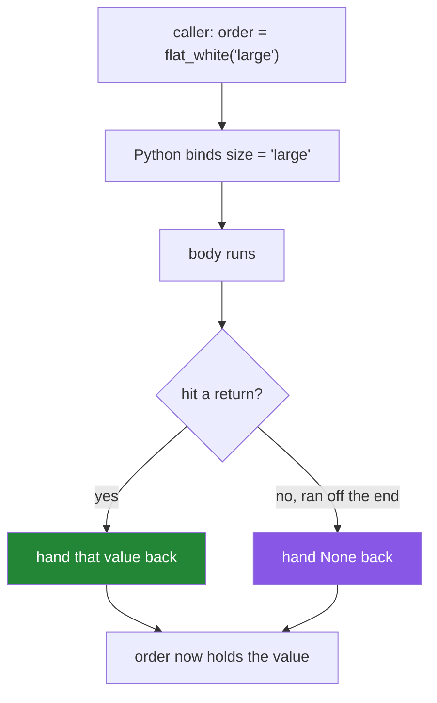

# 1.1 — A function is a named promise

## One-line answer

A function puts a piece of work behind a name, so that the rest of the program can ask for the result
without knowing how it is produced — and the only two things that define it are **what you have to
give it** and **what it hands back**.

---

## The story

You walk up to a coffee counter and say four words: *"one flat white, please."*

A minute later a flat white arrives. You did not grind anything. You do not know which machine they
used, whether the milk came from the fridge on the left or the one under the counter, or which of the
three people behind the bar actually made it. None of that was your problem, and that is the point of
the counter existing.

Say those four words in a different shop, in a different city, and the same thing happens. The words
are a **promise**: give us this order, and you will get that drink. If they replace the machine
tomorrow, your four words do not change.

Now the version where it goes wrong.

You order. You pay. The barista nods, does something behind the counter, and turns away. You are
standing there holding nothing, and nobody has said anything is wrong — there was no shouting, no
error, no apology. Just no coffee.

That is a real thing that happens in code, on the first day anybody writes a function:

```text
>>> def clean(title):
...     title.strip()
...
>>> result = clean("  Attention Is All You Need  ")
>>> print(result)
None
```

The work happened. `title.strip()` genuinely ran and genuinely produced a tidied title. Then the
function ended without handing it over, so what came across the counter was nothing at all.

The whole of this section is about the counter: what you have to say, what you get back, and what
happens when the two do not match.

---

## The idea in plain language

### The three parts

A function has exactly three parts you have to know about, and every one of them has an ordinary
name.

| Part | What it is | At the counter |
|---|---|---|
| the **name** | how the rest of the program asks for it | the words "flat white" |
| the **parameters** | what you must supply for it to do its job | the size, the milk |
| the **return value** | what comes back | the drink |

That is it. Everything else in this day is a refinement of one of those three.

### The two verbs: defining and calling

**Defining** a function is writing down what it will do, using the word `def`. Nothing runs when you
define it. Writing a menu board does not make coffee.

**Calling** a function is asking for the work to happen, by writing its name followed by round
brackets. This is the moment the work is actually done.

The gap between those two matters more than it looks, and [1.3](1.3-defaults-and-when-they-run.md)
is entirely about a bug that lives in it.

### Why bother at all

The obvious answer is "so you do not repeat yourself", and it is the least interesting one. Three
better ones:

- **A name is an explanation.** `clean_title(raw)` tells a reader what the next line does.
  Five lines of stripping, lowering and collapsing does not, and the reader has to work it out.
- **You can change the inside without touching the outside.** Every caller keeps working as long as
  the promise is kept. That is why the shop can replace the machine.
- **You can test it.** A named thing that takes something and gives something back can be checked
  by a test (Principle 7). Five loose lines in the middle of a script cannot.

### Returning nothing is a decision, not an accident

Every function returns something. A function that runs off the end without a `return` returns
`None` — Python's word for "no value here". That is deliberate and it is occasionally what you want,
but it is far more often the coffee that never arrived.

`None` is quiet. It does not raise. It travels through your program, gets stored, gets passed to
another function, and finally blows up somewhere with a message about `NoneType` that names a line
nowhere near the mistake. You met exactly this on
[Day 4, 2.2](../../../day-04-objects/parts/02-containers/2.2-what-in-place-means.md), with
`list.sort()`.

---

## Why Setu needs it

- **Today's build brief is the first real module in `src/setu/`** — `textutils.py`, the file the
  plan names as Phase 1's deliverable. Everything in it is a function, and every function in it is a
  promise something else will rely on.
- **Day 12 builds the `Paper` class**, and a method is a function that has been handed an object
  to work on. There is no separate skill to learn there; there is this skill, plus one extra
  parameter.
- **Day 14's `@timed` and `@retry` decorators** are functions that take a function and return a
  function. That sentence is unreadable until this document is obvious, and trivial afterwards.
- **Day 95's gradient descent, Day 182's agent loop and Day 216's five-agent workflow** are all
  built out of small named promises calling each other. The largest thing in this curriculum is made
  of the smallest thing in this document.

---

## The mechanism

The smallest complete function, and the four things happening in it:

```python
"""The four parts of a function, in the order Python reads them."""


def flat_white(size):
    """Return a description of the drink. One job, one value back."""
    return f"a {size} flat white"


order = flat_white("large")
print(order)
print(type(flat_white))
print(flat_white.__name__)
```

**Line by line:**

- `def flat_white(size):` — `def` is the keyword that says *what follows is a definition, not an
  instruction to run now*. `flat_white` is the name it will be known by. `size` is the parameter: a
  name that will exist inside the function and hold whatever the caller supplies. The colon opens
  the block, exactly as it does for an `if` or a `for`
  ([Day 5, 2.1](../../../day-05-operators-and-conditionals/parts/02-conditionals/2.1-if-elif-else-and-the-indent.md)).
- `"""Return a description..."""` — the docstring. It is the first statement in the body and Python
  keeps it, which is why `help(flat_white)` can show it. It says what the function *returns*, not
  what it *does*, because the return value is what the caller cares about.
- `return f"a {size} flat white"` — `return` does two things at once, and only one of them is
  obvious. It hands the value back, **and** it ends the function immediately. Anything written after
  it in the same branch never runs.
- `order = flat_white("large")` — this is the call. The brackets are what make it happen; without
  them you get the function itself rather than its result, which is the subject of the *When it
  breaks* section below.
- `print(type(flat_white))` — prints `<class 'function'>`. A function is an object like everything
  else ([Day 4, 1.1](../../../day-04-objects/parts/01-objects/1.1-identity-type-value.md)), which is
  why it can be stored in a list, passed to another function and given a second name.
- `flat_white.__name__` — a function knows what it is called. Day 14's decorators depend on this,
  and on remembering to preserve it.

Now the difference between a function that hands something back and one that does not:

```python
"""Two functions that do the same work. Only one of them delivers it."""


def clean_broken(title):
    """Looks finished. Hands back nothing."""
    title.strip()


def clean_working(title):
    """The same work, delivered."""
    return title.strip()


raw = "  Attention Is All You Need  "

print("broken :", repr(clean_broken(raw)))
print("working:", repr(clean_working(raw)))
```

**Line by line:**

- `title.strip()` on its own line in `clean_broken` — the work is done and the tidied text is built,
  and then nothing holds on to it, so it is thrown away the instant the line ends. Strings cannot be
  changed in place ([Day 4, 1.4](../../../day-04-objects/parts/01-objects/1.4-strings-are-immutable.md)),
  so `strip()` had to build a new one, and this line dropped it on the floor.
- `return title.strip()` — the same expression, with the value handed across the counter.
- `repr(...)` rather than `print(...)` — `repr` puts quotation marks around text, so an empty result
  and a result of `None` look different on screen. This is
  [Day 7, 3.3](../../../day-07-strings/parts/03-formatting/3.3-repr-and-the-debugging-f-string.md),
  used the moment it is needed rather than admired in the abstract.
- The output is `broken : None` and `working: 'Attention Is All You Need'`. Nothing raised. That is
  the entire danger.

And the shape of what happens when a call runs:



---

## When it breaks

**The brackets you forgot:**

```text
>>> def total():
...     return 42
...
>>> answer = total
>>> print(answer + 1)
Traceback (most recent call last):
  File "<stdin>", line 1, in <module>
TypeError: unsupported operand type(s) for +: 'function' and 'int'
```

**What it means.** `answer = total` gave the function a second name; it did not call it. The error is
precise and unusually helpful: it names `'function'` as the type on the left, which tells you exactly
what you are holding. Add the brackets — `answer = total()` — and it is fixed. The same mistake with
no arithmetic afterwards is far worse, because storing a function where a number was expected raises
nothing at all until much later.

**The value that was never handed over:**

```text
>>> def clean(title):
...     title.strip()
...
>>> titles = [clean(t) for t in ["  a  ", "  b  "]]
>>> titles
[None, None]
>>> "-".join(titles)
Traceback (most recent call last):
  File "<stdin>", line 1, in <module>
TypeError: sequence item 0: expected str instance, NoneType found
```

**What it means.** The `TypeError` names `join`, which is innocent. The mistake is a missing `return`
in a different function, several lines earlier. This is the classic shape of a `None` bug: **the
error appears a long way from the cause**, because `None` is a perfectly legal value to store and
pass around, and only becomes a problem when somebody finally tries to use it as something. If a
function is supposed to give you a value, check that it does, at the moment you write it.

**The code after `return`:**

```text
>>> def check(value):
...     return value > 0
...     print("checking", value)
...
>>> check(5)
True
```

**What it means.** No error, and the `print` never runs. `return` ends the function on the spot, so
everything below it in the same branch is dead. The reason this survives in real code is that it
usually appears *after* somebody adds an early `return` near the top of a function during a hurried
fix, orphaning the lines below it. Nothing in this project's linter flags it, so the defence is a
test that would have noticed the missing side effect (Principle 7).

---

## In production

**A function's real cost is its signature, not its body.** You can rewrite a body whenever you like;
nobody outside the file will notice. Change what it takes or what it gives back, and every caller has
to change with it — which, in a codebase of any size, is a migration rather than an edit. Senior
engineers spend a disproportionate amount of review effort on the first line of a function and very
little on the rest, and that is not fussiness. It is where the expensive mistakes are.

**One function, one job — and "job" means one sentence with no "and" in it.** A function called
`clean_and_save_title` is two functions wearing one name, and it cannot be tested without a disk. The
test for that name will always be worse than the tests for `clean_title` and `save_title` written
separately. This is the same one-idea test the plan applies to documents (Part 11.4), applied to
code, for the same reason: a thing that does two jobs cannot be understood, replaced or checked
without doing both.

**Returning `None` on failure is a design decision people make by accident.** Three common ways for a
function to say "I could not do it": return `None`, raise an exception, or return a pair of
`(value, error)`. Each is defensible; the one that hurts is choosing it without noticing. `None`
travels silently and blows up later, which is why a function whose failure mode matters usually
raises instead (Day 18 is the whole subject). Whatever you choose, the docstring says so.

**What degrades at scale.** A function call in Python is not free — it builds a frame, binds the
parameters and tears the frame down again. That is measured in fractions of a microsecond and is
irrelevant almost everywhere. It stops being irrelevant inside a loop running eight million times,
which is [Day 6, 4.2](../../../day-06-loops/parts/04-loop-cost/4.2-the-loop-you-should-not-write.md):
the answer there is not "write fewer functions", it is "do not write that loop at all". Never break
up a clear function for speed until a profiler has named it.

**The review comment a senior engineer leaves.** On a function with no `return` on one of its
branches: *"This returns `None` when `records` is empty, and the caller does `len()` on the result.
Either return an empty list on that branch or raise — but pick one and say which in the docstring,
because right now the empty case is the only one that is not documented and it is the one that will
happen at 3am."*

**The interview question.** *"What does a Python function return if it has no `return` statement?"*
Everybody answers `None`. The answer that lands adds why it matters: `None` is a legal value, so it
propagates silently through assignments, list-building and dictionary storage, and surfaces as a
`NoneType` error somewhere far from the cause — which is why a missing `return` is one of the few
bugs that is genuinely harder to find than a crash. If you can add that this is the same shape as
`list.sort()` returning `None`, you are describing something you have actually debugged.

---

## Check yourself

```bash
uv run python -c "
def clean(t):
    t.strip()

def clean_ok(t):
    return t.strip()

print('broken :', repr(clean('  x  ')))
print('working:', repr(clean_ok('  x  ')))
print('the function itself:', clean_ok)
print('the result:', clean_ok('  x  '))
"
```

Predict all four lines before running it. The third and fourth differ by two characters, and the
difference between them is the whole document.

**Answer out loud, without scrolling up:**

> Name the three parts of a function. Then explain, without using the word "return", why a function
> that does its work correctly can still leave the caller with nothing — and say where in the program
> the resulting error will appear.

---

**Next:** [1.2 — Positional and keyword arguments](1.2-positional-and-keyword.md)
