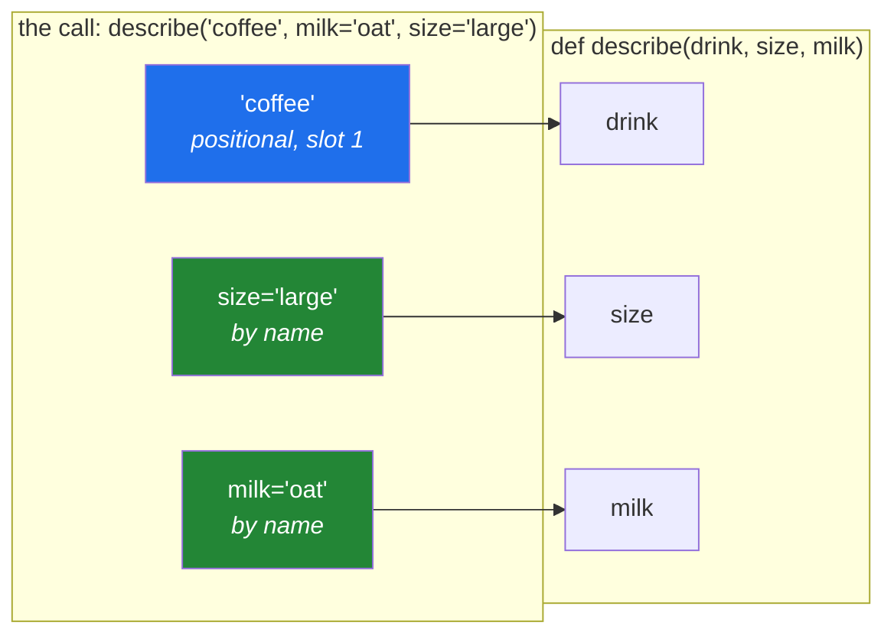

# 1.2 — Positional and keyword arguments

## One-line answer

You can hand a function its values **by position** — first one goes to the first parameter — or **by
name**, and the difference is not style: position is short and depends on an order nobody can see at
the call site, while name is longer and cannot be got wrong.

---

## The story

Back at the coffee counter, and this time the order is longer.

*"One coffee, large, oat, no sugar."*

A person behind the counter handles that easily, and they would handle it just as easily if you said
*"one coffee, oat, large, no sugar"* — because they know what oat is and they know what large is, and
neither word could possibly mean the other. The order of your words does not carry any information
that the words themselves do not already carry.

Now imagine a machine that takes orders through four slots on a screen, in a fixed order: drink,
size, milk, sugar. It has no idea what the words mean. It simply puts the first thing in the first
slot.

Say your order the second way to that machine and you get a coffee of size "oat", made with "large"
milk. It will not complain. It has no way to complain, because the only thing it knew was position,
and you gave it four valid-looking things in the wrong four positions.

There is a third way to order, and it is what the machine's screen actually does when it is designed
well. Each slot has a label:

```text
drink: coffee
size:  large
milk:  oat
sugar: none
```

Now the order can be filled in any order at all, and nobody has to remember which slot was which.
It takes longer to say. It cannot be got wrong.

That is the whole of this document. Python lets you order both ways, and the choice between them is a
choice about **who has to remember the order**.

---

## The idea in plain language

### Two words for two ends of the same thing

The words get used loosely, and it is worth being exact once:

- A **parameter** is a name in the function's definition — `def greet(name, greeting):` has two
  parameters.
- An **argument** is a value at the call site — `greet("Priya", "Hello")` passes two arguments.

Parameters are what the function asks for. Arguments are what you actually hand over. When people
say "argument" for both, nothing bad happens; when a traceback says "argument", it means the value.

### Positional: the order is the meaning

`greet("Priya", "Hello")` works because `"Priya"` is first and `name` is first. Nothing in that call
mentions either parameter name. To read the line, you have to go and look at the definition — or
remember it, which is the same thing with an extra failure mode.

Positional arguments are short, and for one or two obvious values they are perfectly clear.
`max(3, 9)` needs no labels. Nor does `clean_title(raw)`.

### Keyword: the name is the meaning

`greet(greeting="Hello", name="Priya")` says what each value is for, at the point where it is
handed over. The order stops mattering entirely, because the labels carry the information the order
used to carry.

The cost is that the call is longer. The benefit is that a reader — including you, next year — does
not have to open another file to know what the third `True` was for.

### The rule about mixing them

You may use both in one call, and there is exactly one rule: **every positional argument comes before
every keyword argument**. `f(1, b=2)` is fine; `f(a=1, 2)` is a syntax error, and it is a syntax
error rather than a runtime error, which means Python refuses to even build the file.

The reason is not arbitrary. Once a value has been given a name, its position no longer means
anything, so a positional value after it would have no position left to occupy.

### The trap in the middle

There is one bad case, and it is the one worth remembering: giving the same parameter a value twice,
once by position and once by name. `f(1, a=2)` on `def f(a, b=1)` sends `1` into `a` by position and
then tries to send `2` into `a` by name. Python catches it and says so clearly, but only at the
moment of the call — so a rarely-taken branch can carry this bug for a long time.

---

## Why Setu needs it

- **Every library call for the next two hundred days is this decision.** `train_test_split(X, y,
  test_size=0.2, random_state=42)` on Day 91 is two positional arguments and two keyword ones, and
  the plan requires `random_state=` to be typed out on every estimator (Principle 4) — which is a
  keyword argument, spelled out, precisely so that nothing is left to a default nobody read.
- **Day 3's model calls** already follow this rule: `model=` is typed out on every LLM call, never
  taken from a default. That is Principle 4 as a call-site habit.
- **Day 14's decorators** forward arguments they have never seen, using `*args, **kwargs`
  ([1.4](1.4-args-and-kwargs.md)), and that only works because Python keeps positional and keyword
  arguments as two separate things all the way through the call.
- **Today's `clean_title()`** takes one positional argument — the text — and everything else by
  keyword, and [3.2](../03-the-module/3.2-designing-clean-title.md) explains why that shape was
  chosen rather than inherited.

---

## The mechanism

The same function called four different ways:

```python
"""One function, four call styles, three of them identical in effect."""


def describe(drink, size, milk):
    """Return a one-line order description."""
    return f"{size} {drink} with {milk} milk"


print(describe("coffee", "large", "oat"))
print(describe(drink="coffee", size="large", milk="oat"))
print(describe("coffee", milk="oat", size="large"))
print(describe("coffee", "oat", "large"))
```

**Line by line:**

- `describe("coffee", "large", "oat")` — all positional. Short, and correct only because the order
  in the call happens to match the order in the definition. Nothing on this line would tell a reader
  that the second slot is the size.
- `describe(drink="coffee", size="large", milk="oat")` — all keyword. Longer, and it is impossible
  to read it wrong. Note that this call would still be correct if somebody reordered the parameters
  in the definition, which the first call would not.
- `describe("coffee", milk="oat", size="large")` — mixed, and legal: the one positional argument
  comes first, then the keywords in whatever order suits. This is the shape most real calls take.
- `describe("coffee", "oat", "large")` — **also legal, and wrong**. It prints
  `oat coffee with large milk`. Python cannot help here: three strings went into three string
  parameters, and nothing about the values says which was meant to be which. This is the machine
  with four slots.

Now the two errors that come out of getting it wrong:

```python
"""The two mistakes Python does catch, and what each message actually says."""


def greet(name, greeting):
    return f"{greeting}, {name}"


for call in ("greet('Priya')", "greet('Priya', greetings='Hi')"):
    try:
        eval(call)
    except TypeError as exc:
        print(f"{call:<34} -> TypeError: {exc}")
```

**Line by line:**

- `for call in (...)` — a tuple of two source strings, so both mistakes can be shown in one runnable
  block rather than two blocks that each stop the file.
- `eval(call)` — runs a string as an expression. **This is a teaching device only.** `eval` on
  anything a user can influence is the injection hole from
  [Day 7, 3.4](../../../day-07-strings/parts/03-formatting/3.4-when-not-to-use-an-f-string.md), and
  it does not belong in `src/setu/`.
- `except TypeError as exc:` — `as exc` binds the exception object so the message can be printed.
  Both of these mistakes are `TypeError`, because in both cases the call does not fit the function —
  which is a "wrong kind of thing" problem, not a "wrong value" problem
  ([Day 4, 1.5](../../../day-04-objects/parts/01-objects/1.5-why-str-plus-int-is-a-typeerror.md)).
- `f"{call:<34}"` — left-align in a 34-character column, so the two messages line up and can be
  compared at a glance. The format spec is
  [Day 7, 3.2](../../../day-07-strings/parts/03-formatting/3.2-the-format-spec.md).
- The output is two lines, and they are worth reading closely:
  `greet() missing 1 required positional argument: 'greeting'` names the parameter that went unfed,
  and `greet() got an unexpected keyword argument 'greetings'` names the keyword that matched
  nothing. Both messages name the exact thing to fix, which is unusual and worth noticing.

And the picture of where each argument lands:



---

## When it breaks

**The value that arrived twice:**

```text
>>> def f(a, b=1):
...     return a + b
...
>>> f(1, a=2)
Traceback (most recent call last):
  File "<stdin>", line 1, in <module>
TypeError: f() got multiple values for argument 'a'
```

**What it means.** The `1` went into `a` by position, and then `a=2` tried to fill the same
parameter by name. The message is exact — it names `a` — and the fix is to drop whichever of the two
you did not mean. This turns up most often after a refactor that adds a parameter to the front of a
signature: every existing call now feeds the new first parameter positionally, and any call that also
named the old first parameter breaks.

**The positional argument that came too late:**

```text
>>> f(a=1, 2)
  File "<stdin>", line 1
    f(a=1, 2)
            ^
SyntaxError: positional argument follows keyword argument
```

**What it means.** This is a `SyntaxError`, not a `TypeError`, which means Python refused to compile
the file at all — the mistake is in the *shape* of the call rather than in the values. That is good
news: it cannot reach production, and it is caught by `./m check` before any test runs, because
`scripts/check_blocks.py` parses every block in the lesson too
([Day 2, 4.1](../../../day-02-quality-gate/parts/04-the-gate/4.1-what-m-check-actually-runs.md)).

**The keyword that was almost right:**

```text
>>> def connect(host, timeout=30):
...     return host, timeout
...
>>> connect("db.internal", timout=5)
Traceback (most recent call last):
  File "<stdin>", line 1, in <module>
TypeError: connect() got an unexpected keyword argument 'timout'
```

**What it means.** A typo in a keyword name is caught, loudly, at the call. This is one of the
strongest arguments for keyword arguments over positional ones: a mistyped **name** raises, whereas a
value in the wrong **position** does not. Note what a function accepting `**kwargs`
([1.4](1.4-args-and-kwargs.md)) does to this protection — it swallows the typo silently, which is why
that feature has to be used deliberately.

---

## In production

**The professional default is: positional for the obvious subject, keyword for everything else.** A
function that takes the thing it operates on plus some options takes the thing positionally and the
options by name. `clean_title(raw, collapse_spaces=True)` reads correctly out loud;
`clean_title(raw, True)` does not, and the `True` is unreadable without opening another file. Once
you have more than one option, this stops being a preference and starts being the only maintainable
shape.

**The boolean in the third slot is a genuine code smell with a name.** Reviewers call it a "boolean
trap": `send(message, True, False)` is unreadable, unsearchable and impossible to get right from
memory. In real codebases this is enforced rather than encouraged —
[1.5](1.5-keyword-only-and-positional-only.md) shows the one character that makes those options
*impossible* to pass positionally, which is what mature libraries do.

**Keyword arguments make a signature evolvable; positional ones freeze it.** Adding a new option
with a default at the end of a signature breaks nothing if everybody calls it by keyword. If callers
pass things positionally, you can only ever append — never reorder, never insert, never remove — and
after a few years the signature is an archaeology exercise. This is why every widely-used Python
library reached the same conclusion and made options keyword-only.

**What changes at scale.** In a codebase with hundreds of call sites, `grep` is a real maintenance
tool, and keyword arguments are greppable in a way positional ones are not. `grep -rn "random_state="
src/` finds every estimator that pinned its randomness; nothing finds every call that passed `42` in
the fourth position. Principle 4 asks for `random_state=` on every estimator specifically so that the
grep works.

**The review comment a senior engineer leaves.** On `resize(img, 800, 600, True, False)`: *"Four
positional arguments and two of them are booleans. I cannot tell from this line whether it preserves
the aspect ratio or the metadata, and neither can the next person. Make the flags keyword-only and
name them at the call site."*

**The interview question.** *"When would you make an argument keyword-only?"* The weak answer is
"when there are a lot of them". The answer that lands: when the value is an *option* rather than the
*subject* of the call — because an option's meaning lives in its name, not its position, so a
positional option forces every reader to leave the line they are reading. Then add the maintenance
half: keyword-only parameters can be reordered, inserted and deprecated without breaking a single
caller, which is why every library that expects to live more than a couple of years converges on it.

---

## Check yourself

```bash
uv run python -c "
def describe(drink, size, milk):
    return f'{size} {drink} with {milk} milk'

print(describe('coffee', 'large', 'oat'))
print(describe('coffee', 'oat', 'large'))
try:
    describe('coffee', size='large', milk='oat', sugar='none')
except TypeError as e:
    print('TypeError:', e)
"
```

The first two lines both run and only one is right. Say why Python cannot tell them apart before you
read the output.

**Answer out loud, without scrolling up:**

> Explain the difference between a parameter and an argument. Then say which of the two mistakes —
> a value in the wrong position, or a keyword with a typo in it — Python can catch, and use that to
> argue for one calling style over the other.

---

**Next:** [1.3 — Default values, and when they are worked out](1.3-defaults-and-when-they-run.md)
