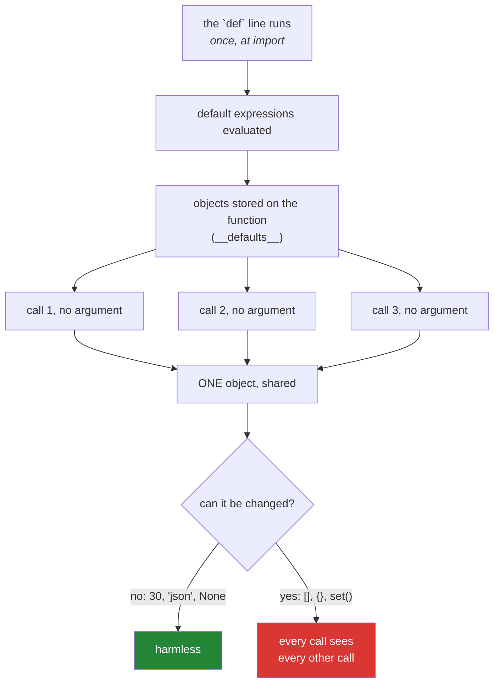

# 1.3 — Default values, and when they are worked out

## One-line answer

A default value is worked out **once, when the `def` line runs**, and then reused by every call that
does not supply its own — which is convenient for a number and a disaster for anything that can be
changed.

---

## The story

Behind the coffee counter there is a small card taped to the wall:

```text
"a coffee" means:  medium, cow's milk, one sugar
```

Nobody wrote that card this morning. It was written when the shop opened, and it has been there ever
since. That is the whole point of it — the staff do not renegotiate what "a coffee" means with every
customer, and a customer who does not care can say two words and get something reasonable.

The card has one property that is easy to miss: **there is exactly one of it.** If somebody takes a
marker and changes "one sugar" to "two sugar", then every customer from that moment who just says
"a coffee" gets two sugars. Nobody is told. Nothing looks different. The orders that specified their
own sugar carry on unaffected, so most of the shop notices nothing.

Now the version that is genuinely dangerous.

Imagine the card said *"a coffee means: the usual cup"* — and *the usual cup* was a specific,
physical cup sitting on the shelf. Not "a cup like this one". **That cup.** The first customer's
coffee goes in it. The second customer's coffee goes in the same cup, on top. By the fifth customer
you have a cup with five coffees' worth of history in it, and every one of those customers thought
they were getting a fresh cup because that is what "a cup" means to a human being.

That is not a joke about coffee. It is one of the most famous bugs in Python, and you met it on
[Day 4, 3.1](../../../day-04-objects/parts/03-identity-trap/3.1-the-mutable-default-argument.md) as
the clinic that ran out of blank forms. Today it gets its proper explanation, because now you know
what a `def` line actually is: **a line that runs**, once, and builds the card.

---

## The idea in plain language

### A default is a promise the function makes to itself

Writing `def connect(host, timeout=30)` says: *if the caller does not tell me a timeout, use 30.*
Callers who care can say so. Callers who do not get a sensible answer without having to think.

That is genuinely valuable, and it is why almost every real function has some.

### The word "when" is the whole subject

Here is the fact that surprises everybody, and it is the reason this part exists:

> **The default expression is evaluated once, at the moment the `def` statement runs** — which is
> normally when the file is first imported — and the resulting object is stored on the function.

Not once per call. Once, ever.

For a number that makes no difference at all. `30` is `30` for the life of the process, and reusing
one `30` is exactly as good as making a fresh one each time.

For anything that can be **changed** — a list, a dictionary, a set, an object of your own — it makes
every difference in the world, because every call that falls back to the default is handed **the same
object** ([Day 4, 2.3](../../../day-04-objects/parts/02-containers/2.3-aliasing-two-names-one-object.md)),
and a change made through one call is visible to the next.

### The rule that follows from it

**A default must be something that cannot change.** A number, a piece of text, `True`, `False`,
`None`, a tuple of those. Never a list, never a dictionary, never a set, never an instance of a class
you wrote.

When you want a fresh empty list per call, the way to say so is to default to `None` and build the
list inside the function. That is not a workaround; it is the honest spelling of what you meant, and
it says out loud that "not supplied" is a real state the function knows about.

### The second trap: `None` is not the same as empty

Once you are defaulting to `None`, there is one more decision, and getting it wrong throws away a
caller's data. Inside the function, you must check `if items is None:` and **not** `if not items:`.

An empty list is falsy ([Day 5, 2.2](../../../day-05-operators-and-conditionals/parts/02-conditionals/2.2-truthiness.md)),
so `if not items:` fires both when the caller supplied nothing *and* when the caller deliberately
supplied an empty list — and quietly replaces their empty list with a new one. That is the same
mistake as the `or` default from
[Day 5, 3.1](../../../day-05-operators-and-conditionals/parts/03-the-or-trap/3.1-the-or-default-and-falsy-zero.md),
in a new costume.

---

## Why Setu needs it

- **Principle 4 is a rule about defaults.** *Never accept a framework default* — pin the version,
  type out `random_state=`, type out `model=`. Every one of those is a decision somebody made once,
  stored on a function, and did not tell you about. This part is why that principle exists.
- **Ruff's `B006` rule** was switched on for this repository on
  [Day 2](../../../day-02-quality-gate/parts/01-linting/1.2-choosing-rule-families.md) precisely to
  catch the mutable default before a human has to. Today is where you find out what it was
  protecting.
- **Today's `clean_title()`** has three options with defaults
  ([3.2](../03-the-module/3.2-designing-clean-title.md)), and all three are booleans on purpose.
- **Day 91's estimators, Day 155's embedding calls and Day 162's retriever** all have defaults that
  are chosen numbers rather than obvious ones, and the plan's habit of typing them out is the same
  habit as reading the card on the wall.

---

## The mechanism

First, proving that a default is built once and stored:

```python
"""Where a default value actually lives."""


def connect(host, timeout=30, retries=3):
    """Return the settings this call will use."""
    return {"host": host, "timeout": timeout, "retries": retries}


print(connect("db.internal"))
print(connect("db.internal", timeout=5))
print("stored on the function:", connect.__defaults__)
```

**Line by line:**

- `timeout=30, retries=3` — two defaults. Both are numbers, both are unchangeable, and both are
  therefore completely safe to share between every call for the life of the process.
- `connect("db.internal")` — one argument supplied, two taken from the card on the wall.
- `connect("db.internal", timeout=5)` — the second call overrides one and inherits the other, which
  is the whole point of defaults existing.
- `connect.__defaults__` — this is the card. It prints `(30, 3)`: a tuple, attached to the function
  object itself, built when the `def` ran. **A function is an object**
  ([Day 4, 1.1](../../../day-04-objects/parts/01-objects/1.1-identity-type-value.md)), and this is
  one of its attributes. You can read it, which means you can prove all of this rather than believe
  it.

Now the same attribute, on a function with a mutable default, before and after some calls:

```python
"""The cup on the shelf. Watch __defaults__ change."""


def collect(item, into=[]):  # noqa: B006 - reproducing the bug on purpose (Principle 2)
    """The buggy version. Do not copy this into src/setu/."""
    into.append(item)
    return into


print("before any call:", collect.__defaults__)
print(collect("a"))
print(collect("b"))
print(collect("c"))
print("after three calls:", collect.__defaults__)
```

**Line by line:**

- `into=[]` — the default is an empty list, built once when the `def` line ran. There is one list,
  and it lives on the function.
- `# noqa: B006` — this project's linter refuses mutable defaults, so the suppression is required to
  make the bug reproducible at all. **This is one of the rare legitimate uses of a suppression**
  ([Day 2, 1.3](../../../day-02-quality-gate/parts/01-linting/1.3-fix-and-noqa-as-debt.md)): it
  carries the rule code and a comment saying why, and it exists to demonstrate the thing the rule
  prevents. Principle 2 asks you to reproduce before you fix.
- `into.append(item)` — a change made **in place**
  ([Day 4, 2.2](../../../day-04-objects/parts/02-containers/2.2-what-in-place-means.md)) to the one
  shared list. There is no assignment here, so nothing is rebound and nothing is copied.
- The three calls print `['a']`, then `['a', 'b']`, then `['a', 'b', 'c']`. Each caller asked for a
  fresh list and got the accumulated history of everybody before them.
- `collect.__defaults__` prints `([],)` before and `(['a', 'b'],)` after two calls. **That is the
  proof**: the default itself has changed, permanently, and the next import of this module in this
  process will not reset it.

And the fix, with the second trap avoided:

```python
"""The correct spelling, and the check that must be `is None`."""


def collect(item, into=None):
    """Append `item` to `into`, or to a fresh list when none was supplied."""
    if into is None:
        into = []
    into.append(item)
    return into


print(collect("a"))
print(collect("b"))

caller_list = []
collect("x", caller_list)
print("the caller's own list:", caller_list)
```

**Line by line:**

- `into=None` — `None` cannot be changed, so sharing one of it between every call is harmless. It
  also *says something*: "not supplied" is now a state the function can see and react to.
- `if into is None:` — `is`, not `==`, because `None` is a singleton and `is` is the one comparison
  no class can override
  ([Day 4, 3.2](../../../day-04-objects/parts/03-identity-trap/3.2-is-versus-equals.md)). Writing
  `if not into:` here would also fire on a caller's genuinely empty list and silently throw it away.
- `into = []` — a **new** list, built inside the call, so each call that reaches this line gets its
  own.
- `collect("x", caller_list)` — when the caller does supply a list, the function appends to theirs
  and they see it. That is a deliberate part of this function's promise, and the docstring says so.
  A function that mutates something the caller handed it must say so out loud, or it is the sorted
  list from [Day 4, 1.2](../../../day-04-objects/parts/01-objects/1.2-names-are-labels.md).



---

## When it breaks

**The linter refusing to let you write it:**

```text
$ uv run ruff check src/setu/textutils.py
src/setu/textutils.py:12:24: B006 Do not use mutable data structures for argument defaults
   |
12 | def collect(item, into=[]):
   |                        ^^ B006
   |
help: Replace with `None`; initialize within function
Found 1 error.
```

**What it means.** Exactly what it says, and note the `help:` line — ruff names the fix, including
the second half that people miss ("initialize within function"). This is the rule doing its job
before a human has to. If you ever find yourself adding `# noqa: B006` outside a teaching document,
stop and write out what you actually meant.

**The dataclass that refuses outright:**

```text
>>> from dataclasses import dataclass
>>> @dataclass
... class Batch:
...     items: list = []
...
Traceback (most recent call last):
  File "<stdin>", line 2, in <module>
ValueError: mutable default <class 'list'> for field items is not allowed: use default_factory
```

**What it means.** The language itself refuses here, which it does not do for a plain function. The
message names the fix — `field(default_factory=list)` — and `default_factory` is the general answer
to "I want a fresh one per call": a **function** that builds the value, stored instead of the value
itself. You will use this constantly from Day 19 onward.

**The empty list a caller lost:**

```text
>>> def add_tags(record, tags=None):
...     if not tags:
...         tags = ["untagged"]
...     record["tags"] = tags
...     return record
...
>>> add_tags({"id": 1}, [])
{'id': 1, 'tags': ['untagged']}
```

**What it means.** The caller passed an empty list on purpose — *this record has no tags* — and got
`["untagged"]` back. Nothing raised. `if not tags:` cannot tell "you gave me nothing" from "you gave
me an empty list", and only `if tags is None:` can. This is the same falsy-zero mistake as
[Day 5, 3.1](../../../day-05-operators-and-conditionals/parts/03-the-or-trap/3.1-the-or-default-and-falsy-zero.md),
and it is the reason that document is on Day 5 rather than here.

---

## In production

**Every default is a decision somebody made without telling you, and Principle 4 exists because of
it.** A retry count of 3, a timeout of 30, a `test_size` of 0.25, a temperature of 1.0 — those are
numbers a person chose, for a workload that was probably not yours. The plan's rule is not "defaults
are bad"; it is that the ones that affect your results get typed out at the call site so that they
are visible in review and greppable in six months. `model=` on every model call and `random_state=`
on every estimator are that rule made concrete.

**A default that reads the world at import time is the mutable-default bug wearing a suit.**
`def report(when=datetime.now()):` freezes the time the module was imported and hands it to every
call for the rest of the process. A long-running service imported at midnight will stamp *midnight*
on every report it writes at noon. Nothing raises, the timestamp is a valid timestamp, and the bug is
only visible if somebody compares two reports. The fix is the same shape as the list:
`when=None`, then `when = when or datetime.now()` inside — or better, pass a clock in, which is
[3.3](../03-the-module/3.3-pure-functions-and-the-seam.md).

**Mutable defaults occasionally get used on purpose, and it is worth recognising when you meet one.**
`def fib(n, _cache={}):` is a real caching idiom, and it works precisely *because* the dictionary is
shared across calls. It is also unclear, untestable and not thread-safe, and `functools.lru_cache`
does the same job with a name. If you see it, the question is whether the author meant it; if you
write it, use the decorator instead.

**What changes at scale.** Under concurrency, a shared mutable default is a shared mutable object
with no lock around it, which means two requests can append to the same list at the same time. In
practice the corruption is rarely a crash; it is a list containing another request's data, which
turns a puzzling bug into a data-leak incident. This is the specific reason the rule is a linter
error and not a style preference.

**The review comment a senior engineer leaves.** On `def parse(rows, errors=[]):` — *"This list is
created once at import, so `errors` accumulates across every call for the lifetime of the process.
Default it to `None` and build it inside. And check `is None`, not truthiness, or you will throw away
a caller's empty list."*

**The interview question.** *"Why is a mutable default argument a bug?"* Everybody can recite that
the list is shared. The answer that lands says **when** and **why**: the default expression is
evaluated once, when the `def` statement executes at import, and the resulting object is stored on
the function — so it is not that Python re-uses the value, it is that there only ever was one. Then
give the second half, which most candidates miss: the fix is `None` *plus* an `is None` check,
because a truthiness check silently discards a caller's deliberately empty collection. If you can add
that `dataclass` raises a `ValueError` on this while a plain `def` does not, you have read something
other than a tutorial.

---

## Check yourself

```bash
uv run python -c "
def collect(item, into=[]):
    into.append(item)
    return into

print(collect('a'))
print(collect('b'))
print(collect('c'))
print('the default itself is now:', collect.__defaults__)
"
```

Predict the four lines before running it. The fourth is the one that turns this from a rule you
memorised into a fact you can see.

**Answer out loud, without scrolling up:**

> Say exactly when a default value is worked out, and use that to explain why `timeout=30` is safe
> and `into=[]` is not. Then explain why the fix needs `is None` rather than `if not into` — and what
> a caller loses if you get that half wrong.

---

**Next:** [1.4 — `*args` and `**kwargs`](1.4-args-and-kwargs.md)
