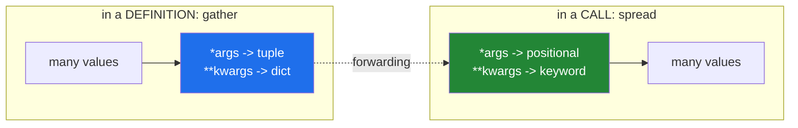

# 1.4 — `*args` and `**kwargs` — the catch-all box

## One-line answer

`*args` gathers any leftover positional arguments into a **tuple** and `**kwargs` gathers any
leftover named ones into a **dictionary**, which makes them perfect for passing a call along to
somebody else and dangerous as a substitute for knowing what your function takes.

---

## The story

The order form at the counter has three boxes on it — drink, size, milk — and at the bottom there is
a wider box with no label except **"anything else?"**.

Ninety-nine orders out of a hundred fit the three boxes. The hundredth is somebody who wants it in
their own cup, or extra hot, or split across two cups because they are carrying one to a colleague.
Without the wide box, the person taking the order has to say "we cannot do that", which is silly,
because the shop absolutely can. With the wide box, the order gets taken.

The wide box has one property worth noticing, and it is why this document exists. **Everything in it
is unlabelled prose.** The three boxes above it are checked, counted and understood by every person
in the building. What is in the wide box is a sentence somebody wrote in a hurry, and the barista has
to read it, interpret it and hope.

So a shop that puts *everything* in the wide box has not built a flexible ordering system. It has
built a system where nothing can be checked, nothing can be counted, and every order is a small
negotiation.

That is the trade in this document. Python's wide box is real, and it is what makes the retry
decorator on Day 14 and the model router on Day 172 possible at all. It is also, used carelessly, the
reason a function's own documentation cannot tell you what to pass it.

---

## The idea in plain language

### One star gathers positions, two stars gather names

Inside a definition:

- `*args` means *"any positional arguments beyond the ones I named, collect them here"*, and what
  arrives is a **tuple** ([Day 8, 1.3](../../../day-08-containers/parts/01-sequences/1.3-a-tuple-is-a-record.md)).
- `**kwargs` means *"any keyword arguments I did not name, collect them here"*, and what arrives is a
  **dictionary**.

Neither is a keyword. `args` and `kwargs` are just conventional names — `*rest` and `**options` work
identically — and the convention is worth keeping because every Python reader recognises it on sight.

### The same stars, at a call, do the opposite

This is the part that confuses people, and it is symmetrical once you see it.

- In a **definition**, `*` and `**` **gather**: many values arrive, one container is made.
- In a **call**, `*` and `**` **spread**: one container is given, many values are handed over.

`f(*[1, 2, 3])` is `f(1, 2, 3)`. `f(**{"a": 1})` is `f(a=1)`.

That symmetry is the whole reason forwarding works. A function can gather with `*args, **kwargs`,
hold the call for a moment, and then spread it back out into somebody else's function without ever
knowing what was in it.

### What "leftover" means precisely

`*args` only catches positional arguments that no named parameter claimed. `**kwargs` only catches
keyword arguments whose names match no parameter. If you have `def f(a, *args)`, then `f(1, 2, 3)`
puts `1` in `a` and `(2, 3)` in `args`.

The consequence worth remembering: **anything after `*args` in the definition can only be given by
name.** That is not a special rule about `*args` — it is the same rule as
[1.5](1.5-keyword-only-and-positional-only.md)'s bare `*`, and it falls out of there being no
positions left to occupy.

### The cost

A function whose signature is `def process(*args, **kwargs)` tells a reader nothing, tells an editor
nothing, and tells a type checker nothing. Worse, it swallows typos: a caller who writes
`timout=5` gets no error at all, because `timout` is a perfectly good key for a dictionary that
accepts every key. The protection from
[1.2](1.2-positional-and-keyword.md)'s *unexpected keyword argument* is gone the moment you add
`**kwargs`.

---

## Why Setu needs it

- **Day 14 builds `@timed` and `@retry`**, and a decorator's inner function is
  `def wrapper(*args, **kwargs)` — it must accept and forward a call whose shape it cannot know. That
  day is unreadable without this one, and trivial with it.
- **Day 172's free-provider router** takes a request and forwards it to Gemini, Groq or OpenRouter,
  each of which takes slightly different keyword arguments. The forwarding is exactly this, and the
  discipline of *not* letting `**kwargs` hide a typo is what keeps a provider swap from silently
  dropping a parameter.
- **Today's `clean_title()` does not use either**, on purpose, and
  [3.2](../03-the-module/3.2-designing-clean-title.md) says why. A function whose options are known
  should name them.
- **`functools.wraps`, `partial` and every logging call you write** are built on this. `log.info("%s
  failed", name)` is a `*args` signature.

---

## The mechanism

Gathering, and what actually arrives:

```python
"""What *args and **kwargs contain, and what type each one is."""


def show(first, *args, **kwargs):
    """Print exactly what each part of the signature caught."""
    print(f"first  = {first!r}")
    print(f"args   = {args!r}   type={type(args).__name__}")
    print(f"kwargs = {kwargs!r}   type={type(kwargs).__name__}")


show("coffee", "large", "oat", sugar="none", temperature="extra hot")
```

**Line by line:**

- `def show(first, *args, **kwargs):` — the order is fixed by the language: named positional
  parameters, then `*args`, then `**kwargs`. You cannot put `**kwargs` in the middle, because there
  would be nothing for it to be the end of.
- `first` claims `"coffee"` because it is the first named parameter and `"coffee"` is the first
  positional argument.
- `args` catches `("large", "oat")` — a **tuple**, not a list, and it is a tuple because the group of
  leftover positional arguments is a fixed record of what this one call passed, not a collection
  anybody should be appending to.
- `kwargs` catches `{'sugar': 'none', 'temperature': 'extra hot'}` — a **dictionary**, in the order
  the caller wrote them, because dictionaries have kept insertion order since Python 3.7
  ([Day 8, 2.3](../../../day-08-containers/parts/02-sets-and-dicts/2.3-a-dict-is-ordered-now.md)).
- `{args!r}` — the `!r` conversion asks for the `repr`, so a one-element tuple prints as `('x',)`
  and a reader can see the trailing comma that makes it a tuple
  ([Day 7, 3.3](../../../day-07-strings/parts/03-formatting/3.3-repr-and-the-debugging-f-string.md)).
- `type(args).__name__` — prints `tuple` and `dict` rather than `<class 'tuple'>`, which keeps the
  line readable. It is the same object-has-a-type fact from
  [Day 4, 1.1](../../../day-04-objects/parts/01-objects/1.1-identity-type-value.md).

Now spreading, which is the same two symbols doing the reverse:

```python
"""The stars at a call site: one container in, many arguments out."""


def describe(drink, size, milk):
    return f"{size} {drink} with {milk} milk"


parts = ["coffee", "large", "oat"]
options = {"drink": "tea", "size": "small", "milk": "soy"}

print(describe(*parts))
print(describe(**options))
print(describe("coffee", **{"size": "regular", "milk": "cow"}))
```

**Line by line:**

- `describe(*parts)` — the list is spread into three positional arguments. It is identical to typing
  `describe("coffee", "large", "oat")`, and it fails in exactly the same way if the list has the
  wrong length, with `missing 1 required positional argument` or `takes 3 positional arguments but 4
  were given`.
- `describe(**options)` — the dictionary is spread into three keyword arguments. **The keys must be
  strings and must match parameter names**, which is why a key of `"drink "` with a stray space
  raises rather than being ignored.
- `describe("coffee", **{...})` — mixing is fine, and the ordering rule from
  [1.2](1.2-positional-and-keyword.md) still applies: positional first.
- Nothing here has anything to do with multiplication. The symbols are reused, and which meaning
  applies is decided by whether you are in a definition, a call, or an arithmetic expression.

And the reason both exist — forwarding a call you have never seen:

```python
"""Forwarding: gather at the door, spread at the counter."""


def log_call(fn, *args, **kwargs):
    """Call `fn` with whatever was passed, after saying so."""
    print(f"calling {fn.__name__} with args={args} kwargs={kwargs}")
    return fn(*args, **kwargs)


print(log_call(max, 3, 9, 4, key=abs))
```

**Line by line:**

- `def log_call(fn, *args, **kwargs)` — `fn` is claimed by name; everything else is caught without
  `log_call` knowing or caring what it is. This function works for `max`, for `clean_title`, for a
  function that does not exist yet.
- `fn.__name__` — a function knows its own name ([1.1](1.1-a-function-is-a-promise.md)), which is
  what makes the log line useful. Day 14's decorators have to work to keep this true, and
  `functools.wraps` is how.
- `fn(*args, **kwargs)` — the spread. `args` was a tuple and becomes positional arguments again;
  `kwargs` was a dictionary and becomes keyword arguments again. **The call arrives at `max` exactly
  as it was written at the top.**
- The real output is
  `calling max with args=(3, 9, 4) kwargs={'key': <built-in function abs>}` followed by `9`. Note
  that `key=abs` passed a **function** as a value, which works because a function is an object —
  and note that `max(3, 9, 4, key=abs)` is `9`, since `abs` does not change the ordering of positive
  numbers.
- `return fn(...)` — without the `return`, `log_call` would do the work and hand back `None`, which
  is [1.1](1.1-a-function-is-a-promise.md)'s bug in a wrapper, and it is the single most common
  mistake in a first decorator.



---

## When it breaks

**The list you meant to pass as one argument:**

```text
>>> def total(*numbers):
...     return sum(numbers)
...
>>> total([1, 2, 3])
Traceback (most recent call last):
  File "<stdin>", line 2, in total
TypeError: unsupported operand type(s) for +: 'int' and 'list'
```

**What it means.** `total([1, 2, 3])` passed **one** argument that happens to be a list, so
`numbers` is `([1, 2, 3],)` — a tuple containing one list — and `sum` tries to add a list to zero.
The fix is `total(*[1, 2, 3])`, spreading it. This is the single most common `*args` mistake, and the
error message points at `sum` rather than at the call, which is why it takes longer to find than it
should.

**The keyword that matched nothing and was swallowed:**

```text
>>> def connect(host, **options):
...     timeout = options.get("timeout", 30)
...     return host, timeout
...
>>> connect("db.internal", timout=5)
('db.internal', 30)
```

**What it means.** **No error at all.** `timout` is a typo, but `**options` accepts every keyword
name, so it landed in the dictionary and was never looked at. The timeout is 30 and the caller
believes it is 5. Compare this with
[1.2](1.2-positional-and-keyword.md)'s version, where the same typo raised immediately. This is the
price of the wide box, and it is why a function with known options should name them.

**The argument that could not be reached:**

```text
>>> def order(drink, *extras, size):
...     return drink, extras, size
...
>>> order("coffee", "oat", "large")
Traceback (most recent call last):
  File "<stdin>", line 1, in <module>
TypeError: order() missing 1 required keyword-only argument: 'size'
```

**What it means.** Everything after `*extras` is keyword-only, because `*extras` has already eaten
every remaining position. The message says `keyword-only` even though the author never wrote a bare
`*`, which is the language telling you a rule you did not know you had invoked. `order("coffee",
"oat", size="large")` works. This is exactly the mechanism [1.5](1.5-keyword-only-and-positional-only.md)
uses deliberately.

---

## In production

**The professional rule is: `**kwargs` for forwarding, named parameters for everything else.** If
your function knows what its options are, it should say so in the signature, because that is the only
place an editor, a type checker, a documentation generator and a reviewer can all read it. `**kwargs`
is correct when the options genuinely belong to *somebody else's* function and you are only passing
them along — a decorator, a wrapper, a factory, an adapter between two libraries.

**Every wrapper is a `*args, **kwargs` function, and the two things that go wrong are always the
same.** The first is a missing `return`, so the wrapper runs the work and hands back nothing
([1.1](1.1-a-function-is-a-promise.md)). The second is losing the wrapped function's identity, so
tracebacks, logs and `help()` all say `wrapper` instead of the real name — which is what
`functools.wraps` exists to fix, and which you will meet properly on Day 14.

**What degrades at scale.** A `**kwargs` signature that spans several layers of forwarding becomes
untraceable: a parameter set at the top and read four functions down has no declared path between the
two, so nothing can tell you where it came from or whether anybody consumed it. The practical defence
in mature codebases is to *stop forwarding at a boundary* — one layer that unpacks `**kwargs` into
real named parameters, validates them, and passes named arguments from then on. Day 19's typed
settings objects are that boundary made concrete.

**The security note.** `f(**user_supplied_dict)` lets whatever produced that dictionary decide which
parameters of your function get set. If the dictionary comes from a request body, a configuration
file somebody else writes, or a model's tool call, that is a decision you have handed to an
untrusted source — the same shape as
[Day 7, 3.4](../../../day-07-strings/parts/03-formatting/3.4-when-not-to-use-an-f-string.md), where
data and instructions ended up in one channel. From Day 197 the plan gates this explicitly
(Principle 12): validate into a typed object first, then call with named arguments.

**The review comment a senior engineer leaves.** On `def build_index(*args, **kwargs):` — *"I cannot
tell what this takes without reading the body, and neither can the editor. It has three options and
they are all known — name them. Keep `**kwargs` only if you are genuinely forwarding to something
whose signature you do not control, and if you are, say which function in the docstring."*

**The interview question.** *"What is the difference between `*args` in a definition and `*args` in a
call?"* The answer that lands names the symmetry: in a definition the star **gathers** loose
arguments into a tuple, and at a call site it **spreads** a sequence back into loose arguments — same
symbol, opposite direction — and that symmetry is precisely what makes it possible to write a wrapper
that forwards a call whose shape it does not know. If you can add the cost — that `**kwargs` silently
accepts a mistyped keyword that a named parameter would have rejected — you are describing a bug you
have shipped.

---

## Check yourself

```bash
uv run python -c "
def show(first, *args, **kwargs):
    print('first =', repr(first))
    print('args  =', args, type(args).__name__)
    print('kwargs=', kwargs, type(kwargs).__name__)

show('coffee', 'large', 'oat', sugar='none')

def total(*numbers):
    return sum(numbers)

print('spread   :', total(*[1, 2, 3]))
print('not spread:', end=' ')
try:
    print(total([1, 2, 3]))
except TypeError as e:
    print('TypeError:', e)
"
```

Say what type `args` and `kwargs` will be before you run it, and say why the last call fails when the
one above it does not.

**Answer out loud, without scrolling up:**

> Explain what the same star means in a definition and in a call, and why those two meanings are
> opposites of each other. Then name the protection you give up the moment you add `**kwargs` to a
> signature, and say when giving it up is the right call.

---

**Next:** [1.5 — Keyword-only and positional-only parameters](1.5-keyword-only-and-positional-only.md)
