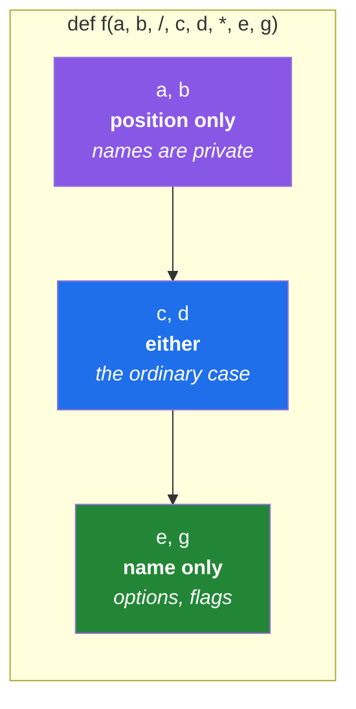

# 1.5 — Keyword-only and positional-only parameters

## One-line answer

A bare `*` in a signature makes everything after it **impossible to pass by position**, and a `/`
makes everything before it **impossible to pass by name** — which turns two calling conventions you
merely preferred into two the language enforces.

---

## The story

A pharmacist writes a label for a bottle of medicine.

They could write *"2, 3"*. Both numbers are on the box, the pharmacist knows what they mean, and it
would fit on a much smaller sticker. What they actually write is:

```text
Dose:      2 tablets
Frequency: 3 times daily
```

The labels are not decoration and they are not politeness. They are there because the consequence of
reading those two numbers the wrong way round is somebody taking three tablets twice a day instead of
two tablets three times a day, and because the person reading the label at 6am will not have the box.

Now walk over to the till in the same shop. The cashier says *"forty rupees."* They do not say
*"amount: forty rupees."* Nobody has ever said that, and if they did you would think something was
wrong, because there is only one number in that sentence and it could not possibly be anything else.

So: some things must be said with their name attached, and some things are worse for it. That is not
a matter of taste, and a good system does not leave it to the customer to remember which is which.
The pharmacist's label is printed with the words already on it. **The form makes the mistake
impossible rather than asking you not to make it.**

Python has both halves of that, and they are one character each.

---

## The idea in plain language

### The bare star: everything after me must be named

Putting a lone `*` in a parameter list draws a line. Parameters before it can be passed positionally
or by name, as usual. Parameters after it can **only** be passed by name.

```text
def connect(host, *, timeout=30, retries=3):
```

`connect("db", 5)` now raises, rather than quietly setting the timeout. The only way to say five is
`connect("db", timeout=5)`, and the word `timeout` is right there in the call for the next reader.

You already met this rule by accident in [1.4](1.4-args-and-kwargs.md): anything after `*args` is
keyword-only too, because `*args` has taken every remaining position. The bare `*` is the same rule
without the collecting.

### The slash: everything before me must not be named

A `/` draws the opposite line. Parameters before it can **only** be passed by position; their names
are private to the function.

```text
def distance(x, y, /):
```

`distance(x=1, y=2)` now raises. Only `distance(1, 2)` works.

This is much rarer, and it exists for one specific reason: it lets you rename a parameter later
without breaking anybody, because nobody could have been depending on the name. Many builtins have
always worked this way — `len(obj)` has no keyword form — and the `/` syntax exists so that ordinary
Python functions can express what builtins already did.

### Reading a full signature

The two markers can appear together, and the order is fixed:

```text
def f(a, b, /, c, d, *, e, f):
#        ^^^      ^^^     ^^^
#   position   either    name
#     only                only
```

- `a, b` — position only.
- `c, d` — either way, the ordinary case.
- `e, f` — name only.

You will see this in library documentation constantly once you know to look for it, and it is the
fastest way to read what a function actually permits.

### Why enforce rather than encourage

Because a convention that lives in a style guide is followed by the people who read the style guide,
and a convention that lives in the signature is followed by everybody. The specific thing being
prevented is the **boolean trap**: `send(msg, True, False)`, where a reader cannot tell what either
flag is, and where swapping them raises nothing.

---

## Why Setu needs it

- **Today's `clean_title(raw, *, collapse_spaces=True, ...)`** uses a bare `*` for exactly this
  reason ([3.2](../03-the-module/3.2-designing-clean-title.md)): the text is the subject and goes
  positionally, and every option is a boolean, which means every option must be named or the call
  site becomes unreadable.
- **Principle 4 asks you to type out `random_state=` and `model=`.** From Day 91 you will notice
  that scikit-learn, and every library like it, has already made those keyword-only — so the plan's
  rule and the library's signature are saying the same thing, and the library says it in a way that
  cannot be forgotten.
- **Day 19's Pydantic models and frozen dataclasses** are keyword-only by default for the same
  reason: a record with six fields cannot be constructed positionally by anybody who is not
  currently looking at its definition.
- **Day 197's approval step** (Principle 12) is a function whose flags decide whether a write
  happens. Those flags are keyword-only in every serious codebase, because a positional `True` in a
  permission check is exactly the mistake nobody can afford.

---

## The mechanism

The bare star, and what it refuses:

```python
"""A keyword-only option, and the two ways to call it."""


def connect(host, *, timeout=30, retries=3):
    """Return the settings this call will use. Options are keyword-only on purpose."""
    return {"host": host, "timeout": timeout, "retries": retries}


print(connect("db.internal"))
print(connect("db.internal", timeout=5))
print(connect("db.internal", retries=0, timeout=5))
try:
    connect("db.internal", 5)
except TypeError as exc:
    print("TypeError:", exc)
```

**Line by line:**

- `def connect(host, *, timeout=30, retries=3):` — the `*` is a parameter position that can never be
  filled. It is a marker, not a name, and everything to its right is keyword-only.
- `connect("db.internal")` — one positional argument, both options from their defaults
  ([1.3](1.3-defaults-and-when-they-run.md)).
- `connect("db.internal", retries=0, timeout=5)` — keyword arguments have no order among themselves,
  so this reads fine and does the same as writing them the other way round. Note `retries=0`: a
  keyword argument passes zero cleanly, which an `or`-style default would have thrown away
  ([Day 5, 3.1](../../../day-05-operators-and-conditionals/parts/03-the-or-trap/3.1-the-or-default-and-falsy-zero.md)).
- `connect("db.internal", 5)` — the mistake this signature exists to prevent. The real message is
  `connect() takes 1 positional argument but 2 were given`, which is worth reading carefully: it says
  **1 positional argument**, not 3, because the two options no longer count as positions at all.
- `except TypeError as exc:` — catching it here so the block runs to the end and prints all four
  lines. In real code this call would simply be a bug that fails immediately, which is the point.

The slash, and what it protects:

```python
"""A positional-only parameter, and the freedom it buys."""


def distance(x, y, /):
    """Return the sum of two coordinates. The parameter names are private."""
    return x + y


print(distance(3, 4))
try:
    distance(x=3, y=4)
except TypeError as exc:
    print("TypeError:", exc)
```

**Line by line:**

- `def distance(x, y, /):` — the `/` says *everything to my left is position-only*. As with `*`, it
  is a marker rather than a parameter.
- `distance(3, 4)` — the only legal form, and the natural one for a function whose arguments have no
  meaningful names beyond "the first" and "the second".
- `distance(x=3, y=4)` — raises `TypeError: distance() got some positional-only arguments passed as
  keyword arguments: 'x, y'`. The message names both offending parameters, which is unusually
  precise.
- The benefit is invisible today and real later: because nobody can write `x=`, the author is free
  to rename `x` to `first` in a future version without breaking one caller. Every keyword-capable
  parameter name is part of your public interface whether you meant it to be or not.

Both markers in one signature, read as a diagram:



---

## When it breaks

**The option passed as a position:**

```text
>>> def connect(host, *, timeout=30):
...     return host, timeout
...
>>> connect("db.internal", 5)
Traceback (most recent call last):
  File "<stdin>", line 1, in <module>
TypeError: connect() takes 1 positional argument but 2 were given
```

**What it means.** Read the count. The signature has two parameters and the message says **one**
positional argument, because `timeout` is not a position any more. This message confuses people the
first time precisely because they count the parameters and get a different number — and once you know
why, it is the fastest way to spot a keyword-only signature you did not know you were calling.

**The name that was never public:**

```text
>>> def distance(x, y, /):
...     return x + y
...
>>> distance(x=3, y=4)
Traceback (most recent call last):
  File "<stdin>", line 1, in <module>
TypeError: distance() got some positional-only arguments passed as keyword arguments: 'x, y'
```

**What it means.** Both offending names are listed. You meet this most often when calling a builtin
or a C-implemented library function that has always been positional-only, long before the `/` syntax
existed to describe it — which is why the error can appear on a function whose source shows no slash
at all.

**The keyword-only parameter you created by accident:**

```text
>>> def order(drink, *extras, size):
...     return drink, extras, size
...
>>> order("coffee", "oat", "large")
Traceback (most recent call last):
  File "<stdin>", line 1, in <module>
TypeError: order() missing 1 required keyword-only argument: 'size'
```

**What it means.** Nobody wrote a bare `*` here, and yet `size` is keyword-only, because `*extras`
already claimed every remaining position ([1.4](1.4-args-and-kwargs.md)). The message uses the words
`keyword-only` to tell you about a rule you invoked without meaning to. If `size` was supposed to be
positional, it belongs **before** `*extras`.

---

## In production

**Every widely-used Python library has converged on the same shape, and it is worth copying.** The
subject of the call is positional; everything that configures the call is keyword-only. You will see
it in `pandas.read_csv`, in scikit-learn's estimators, in `dataclasses.field`, in `sorted(iterable,
*, key=None, reverse=False)`. That last one is worth staring at: `sorted` has had exactly this
signature for years, which is why nobody has ever written `sorted(items, my_key, True)` and wondered
what the `True` did.

**The `/` is a library author's tool, not an application author's.** Its whole value is that it keeps
a parameter name out of your public interface, so you can change it later. That matters enormously if
strangers import your module and never if the only caller is three files away in the same repository.
Recognising it when you read a signature is the skill; reaching for it in `src/setu/` mostly is not.

**Keyword-only parameters are what make a signature safe to grow.** Adding a new option at the end of
a keyword-only group breaks nothing, because no caller was relying on position. Adding one to a
positional group is a breaking change for anybody who passed the following argument positionally, and
you will not find them all. This is the difference between a signature you can evolve for years and
one you can only append to.

**What changes at scale.** In a large codebase, `grep -rn "timeout=" src/` finds every call that set
a timeout, and finds nothing at all if timeouts are passed positionally. Making an option
keyword-only does not just improve one call site; it makes an entire class of question answerable
across the repository. That is the practical reason Principle 4's "type it out" habit and this
language feature reinforce each other.

**The review comment a senior engineer leaves.** On
`def export(rows, path, True, False):` — *"Two positional booleans. Put a bare `*` after `path` so
these have to be named at the call site, and name them something a reader can act on — `overwrite=`
and `include_header=`. Right now the only way to know which is which is to open this file, and the
person who gets paged at 3am will not."*

**The interview question.** *"Why would a library make a parameter keyword-only?"* The answer that
lands has two halves. For the **reader**: an option's meaning lives in its name, so a positional
option forces everybody to leave the line they are reading — and a positional boolean is unreadable
and silently swappable. For the **author**: keyword-only parameters can be added, reordered and
deprecated without breaking a caller, whereas every positional parameter freezes its position
forever. If you can add that the mirror image exists — that `/` keeps a *name* out of the public
interface so it can be renamed later — you are describing something you have actually maintained.

---

## Check yourself

```bash
uv run python -c "
def connect(host, *, timeout=30):
    return host, timeout

print(connect('db.internal', timeout=5))
try:
    connect('db.internal', 5)
except TypeError as e:
    print('TypeError:', e)

def distance(x, y, /):
    return x + y

print(distance(3, 4))
try:
    distance(x=3, y=4)
except TypeError as e:
    print('TypeError:', e)
"
```

Before running it, predict how many positional arguments the first error message will claim
`connect` takes. If your prediction is 2, read the mechanism again — the answer is the whole point.

**Answer out loud, without scrolling up:**

> Say what a bare `*` does and what a `/` does, in one sentence each. Then explain why a library
> author cares about the `/` in a way an application author usually does not — and give the reason a
> positional boolean flag is a bug rather than a preference.

---

**Next:** [1.6 — The signature is the contract](1.6-the-signature-is-the-contract.md)
