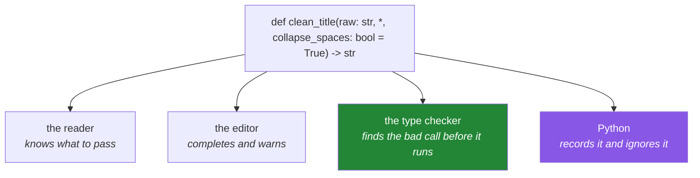

# 1.6 — The signature is the contract — type hints and the docstring

## One-line answer

The first line of a function plus its docstring is the only part of it that other people read, so it
has to say what goes in, what comes back, and what happens when it cannot — and a type hint is a
promise to the reader and the checker, never an instruction to Python.

---

## The story

Above the coffee counter there is a board.

The board says what you can order and what each thing costs. Nobody reads the board because they
enjoy boards. They read it because it means they can walk up and order without a conversation, and
because they know what will happen when they do.

Now suppose the board is out of date. The oat milk went up last month and nobody changed the number.
Nothing dramatic happens: every single customer who orders oat milk has a short, slightly awkward
exchange at the till, and the person on the till has that exchange forty times a day, and after a
week they are correcting the board verbally in their sleep and a customer has complained.

The board was wrong for one line. The cost was paid at every transaction, by both people, forever.

**A signature is a board.** It is read far more often than the body is, by people who will not open
the body, and when it is wrong or silent the cost is paid at every call site by somebody who then has
to go and read the body to find out what is true.

---

## The idea in plain language

### What a type hint is, and what it is not

A type hint is an annotation written into the signature:

```text
def clean_title(raw: str) -> str:
```

`raw: str` says the parameter is expected to be text. `-> str` says the function hands back text.

Here is the part that surprises people: **Python does not check any of that.** It records the
annotations and carries on. You can call `clean_title(42)` and Python will happily try, and fail
inside the body with a message about `int` having no `strip` method — not with a message about the
signature.

So what are they for? Three real audiences, none of them the interpreter:

- **The reader**, who now knows what to pass without opening the body.
- **The editor**, which can now complete `.strip(` and flag `.stirp(` before you run anything.
- **The type checker** — a separate tool you run like a linter — which reads the whole codebase and
  finds the call that passes a number where text was promised.

### The docstring says what the types cannot

Types say what shape a value has. They cannot say what it *means*, what the function does when it
goes wrong, or whether it changes anything the caller handed it. That is the docstring's job, and
there are exactly four things worth writing:

1. **What it returns**, in one sentence, phrased as a result rather than a procedure.
2. **What each non-obvious parameter is for** — not `raw: the raw title`, which is noise.
3. **What it raises**, if anything, and when.
4. **Whether it changes anything it was given** — the most-forgotten one, and the one that causes
   [Day 4, 1.2](../../../day-04-objects/parts/01-objects/1.2-names-are-labels.md)'s bug.

### A function object knows its own contract

Everything above is stored on the function and can be read back at run time. `inspect.signature`
prints the whole thing, `__doc__` holds the docstring, `__annotations__` holds the hints. That is not
a curiosity — it is how `help()` works, how documentation generators work, and how Day 14's
decorators know what they are wrapping.

### The rule that keeps a board accurate

**Change the body, re-read the first line.** Almost every wrong docstring in the world was correct
once. It became wrong when somebody added a parameter, changed a return type from a list to a
generator, or started raising instead of returning `None` — and did not scroll up.

---

## Why Setu needs it

- **Today's `src/setu/textutils.py`** is the first module in this repository that other days import.
  From tomorrow, `clean_title`'s signature is the only thing Day 11, Day 12 and the Phase 1 gate will
  read.
- **Day 19 makes this enforceable.** `PY-23` brings typing, dataclasses and Pydantic v2, where the
  hints stop being advice and start rejecting bad data at run time. Today's habit is what makes that
  day feel like a small addition rather than a new subject.
- **Day 209's MCP server** publishes its tools' signatures to a model, and a model chooses which tool
  to call by reading exactly this: names, types and the docstring. A vague docstring is a wrong tool
  call, and by Phase 26 that is not a style problem.
- **Principle 10 asks for interview-ready artifacts.** A reviewer's first impression of any module
  you have written is its signatures, before they read a line of logic.

---

## The mechanism

A signature that says everything it needs to:

```python
"""One well-described function, and the three places its contract is stored."""

import inspect


def clean_title(raw: str, *, collapse_spaces: bool = True) -> str:
    """Return `raw` tidied for use as a comparison key.

    Strips surrounding whitespace and, when `collapse_spaces` is true, replaces every
    run of whitespace with a single space. Does not change `raw`, which is text and
    therefore cannot be changed at all.

    Raises:
        TypeError: if `raw` is not a string.
    """
    if not isinstance(raw, str):
        raise TypeError(f"clean_title() needs a string, got {type(raw).__name__}")
    tidied = raw.strip()
    return " ".join(tidied.split()) if collapse_spaces else tidied


print("signature  :", inspect.signature(clean_title))
print("annotations:", clean_title.__annotations__)
print("first line :", clean_title.__doc__.splitlines()[0])
print(repr(clean_title("  Attention   Is  All You Need  ")))
```

**Line by line:**

- `raw: str` — the annotation. Python stores it and does not act on it, which is why the explicit
  `isinstance` check below is not redundant: the hint is for humans and tools, the check is for run
  time.
- `*` — the bare star from [1.5](1.5-keyword-only-and-positional-only.md). `collapse_spaces` is a
  boolean option and so must be named at the call site.
- `-> str` — the return annotation. This is the single most useful hint in any signature, because it
  is the thing a caller most needs and the thing a body most easily changes without anybody noticing.
- `"""Return `raw` tidied..."""` — the first line starts with the word **Return** and describes the
  result. Compare it with "This function cleans a title", which describes the function and tells the
  reader nothing they could not guess from the name.
- **"Does not change `raw`"** — the sentence most docstrings omit. Here it is easy, because text cannot
  be changed ([Day 4, 1.4](../../../day-04-objects/parts/01-objects/1.4-strings-are-immutable.md));
  when the parameter is a list, this sentence is the difference between a safe function and a
  surprise.
- `Raises:` — the third thing types cannot express. A caller who reads this knows to wrap the call
  or to validate first; a caller who does not gets a traceback in production.
- `raise TypeError(f"...")` — a `TypeError` because the wrong *kind* of thing was passed, not a
  `ValueError`, which is for the right kind of thing with a bad value
  ([Day 4, 1.5](../../../day-04-objects/parts/01-objects/1.5-why-str-plus-int-is-a-typeerror.md)).
  The message names the type it actually got, which is what a reader needs.
- `" ".join(tidied.split())` — split on any whitespace and rejoin with single spaces, which is
  [Day 7, 4.3](../../../day-07-strings/parts/04-normalising/4.3-methods-before-regex.md)'s method
  version of a regular expression.
- `... if collapse_spaces else tidied` — a conditional expression
  ([Day 5, 2.5](../../../day-05-operators-and-conditionals/parts/02-conditionals/2.5-the-conditional-expression.md)),
  which is correct here because it is one decision producing one value.
- `inspect.signature(clean_title)` — prints `(raw: str, *, collapse_spaces: bool = True) -> str`.
  **The board, read back from the function itself.** This is what `help()` shows and what a
  documentation generator reads.

And the thing that makes hints more than decoration:

```python
"""What a type checker sees that Python does not."""


def total_length(titles: list[str]) -> int:
    """Return the combined character count of every title."""
    return sum(len(t) for t in titles)


print(total_length(["one", "two"]))
print(total_length("just a string"))
```

**Line by line:**

- `list[str]` — a list whose elements are strings. Since Python 3.9 the builtin names work directly
  in annotations, so `List` from `typing` is no longer needed.
- `-> int` — a whole number comes back.
- `sum(len(t) for t in titles)` — a generator expression rather than a list comprehension, so nothing
  is held ([Day 9, 3.3](../../../day-09-comprehensions/parts/03-when-not-to/3.3-the-list-you-never-needed.md)).
- `total_length(["one", "two"])` prints `6`. Correct.
- `total_length("just a string")` prints `13`, **and it should not have been called at all.** A
  string is iterable, so `len(t)` runs on each character and produces a number that looks entirely
  plausible. Python raised nothing because Python does not read the annotation. A type checker reads
  it and reports `Argument of type "str" cannot be assigned to parameter "titles" of type
  "list[str]"` — before the program ever runs. **That gap is the entire argument for running one.**



---

## When it breaks

**The hint that did not stop anything:**

```text
>>> def clean_title(raw: str) -> str:
...     return raw.strip()
...
>>> clean_title(42)
Traceback (most recent call last):
  File "<stdin>", line 2, in clean_title
AttributeError: 'int' object has no attribute 'strip'
```

**What it means.** The annotation said `str` and Python passed the `42` through anyway. The error
comes from **inside the body**, names `strip` rather than the signature, and would name something far
less obvious in a longer function. This is exactly what a type checker prevents, and exactly why an
`isinstance` check at the top of a public function is not paranoia.

**The docstring that used to be true:**

```text
>>> import inspect
>>> def load(path, encoding="utf-8"):
...     """Return the file's lines as a list."""
...     with open(path, encoding=encoding) as fh:
...         yield from fh
...
>>> print(inspect.signature(load))
(path, encoding='utf-8')
>>> rows = load("data/papers.csv")
>>> len(rows)
Traceback (most recent call last):
  File "<stdin>", line 1, in <module>
TypeError: object of type 'generator' has no len()
```

**What it means.** Somebody changed `return list(fh)` to `yield from fh` — a genuine improvement,
because it stops loading the whole file — and did not change the sentence above it. The docstring now
lies, and the caller who believed it gets an error about generators having no length
([Day 9, 2.3](../../../day-09-comprehensions/parts/02-dict-set-gen/2.3-the-generator-expression.md)).
Nothing in the toolchain catches this; only `-> Iterator[str]` would have, which is the strongest
practical argument for return annotations.

**The annotation that is a string on purpose:**

```text
>>> def merge(a: dict, b: dict) -> dict:
...     return a | b
...
>>> merge.__annotations__
{'a': <class 'dict'>, 'b': <class 'dict'>, 'return': <class 'dict'>}
```

**What it means.** No error here — this is the thing to *notice*. The annotations are stored as real
objects on the function, which means an annotation naming a class defined later in the file will
raise `NameError` at import. The standard fix is `from __future__ import annotations` at the top of
the module, which stores every annotation as text instead and is why you will see that line at the
top of every file in `src/setu/`.

---

## In production

**The signature is the part you cannot change cheaply, so it is the part to get right first.** A body
can be rewritten on a Tuesday afternoon and nobody outside the file notices. A parameter added,
removed or retyped is a migration across every caller — and if the module is imported by other
people, it is a version bump and a deprecation cycle
([Day 1, 1.1](../../../day-01-pins/parts/01-versions/1.1-semantic-versioning.md)). Reviewers who
spend most of their attention on the first line are not being pedantic; they are reviewing the part
that is expensive to undo.

**Type hints pay for themselves at the boundary, not everywhere.** In real codebases the discipline
is: annotate everything that crosses a module boundary, everything public, and everything whose
return type is not obvious from its name. A three-line private helper directly above its only caller
gains very little. Annotating `-> None` on a function that returns nothing is worth doing anyway,
because it is a claim a checker can enforce, and it catches the missing `return` from
[1.1](1.1-a-function-is-a-promise.md).

**A checker is a gate, not an opinion.** Run it the way ruff and pytest are run
([Day 2, 4.1](../../../day-02-quality-gate/parts/04-the-gate/4.1-what-m-check-actually-runs.md)) — on
every commit, failing the build — or it becomes a wall of warnings nobody reads, which is worse than
not having it. The plan brings this in properly on Day 19 with `PY-23`.

**What changes at scale.** Annotations are objects evaluated at import time, so a module with heavy
annotations imports slightly more slowly and a circular type reference can break the import
altogether. `from __future__ import annotations` makes every annotation lazy text and removes both
problems; it is close to free and is standard practice in any codebase large enough to have noticed.

**The review comment a senior engineer leaves.** On a well-typed function with a thin docstring:
*"The types are good but the docstring only restates them. Say the two things they cannot: this
mutates `records` in place, and it raises `KeyError` when a row has no `doi`. Those are the two facts
a caller needs and neither is in the signature."*

**The interview question.** *"Does Python enforce type hints?"* Everybody says no. The answer that
lands says what they are *for* instead: they are a contract read by humans, editors and a separate
checking tool, and their value is that a wrong call is found before the program runs rather than
inside a body several frames away. Then give the case where it genuinely matters: a function that
starts returning a generator instead of a list is a breaking change that no test of *this* function
catches — only the return annotation, or the caller's own test, will. If you can add that annotations
are ordinary objects evaluated at import, and that `from __future__ import annotations` makes them
lazy text, you have hit a real import-time bug at some point.

---

## Check yourself

```bash
uv run python -c "
import inspect

def clean_title(raw: str, *, collapse_spaces: bool = True) -> str:
    '''Return raw tidied for use as a comparison key.'''
    return ' '.join(raw.split()) if collapse_spaces else raw.strip()

print(inspect.signature(clean_title))
print(clean_title.__annotations__)
print(repr(clean_title('  a   b  ')))
try:
    clean_title(42)
except AttributeError as e:
    print('AttributeError:', e)
"
```

The last two lines are the point: the annotation said `str`, and the `42` went in anyway. Say what
would have stopped it.

**Answer out loud, without scrolling up:**

> Name the three audiences a type hint is written for, and say which of them is not Python. Then give
> the four things a docstring must carry that a type hint cannot — and say which of the four is the
> one people forget.

---

**Next:** [2.1 — LEGB: the four places Python looks for a name](../02-scope/2.1-legb-where-a-name-is-found.md)
