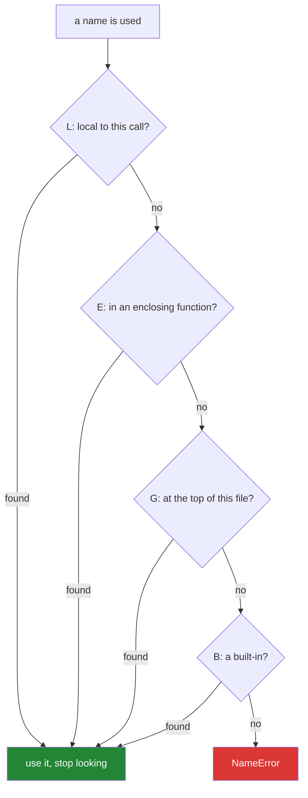

# 2.1 — LEGB — the four places Python looks for a name

## One-line answer

When Python meets a name it does not know, it looks in exactly four places in exactly one order —
**this function, the function around it, the file, and the built-in names** — and stops at the first
place that has it.

---

## The story

Somebody in the house shouts, "where are the scissors?"

Nobody answers with a philosophy of scissors. They start looking, and everybody looks in the same
order without ever having agreed on it:

1. **My own drawer**, the one next to where I am sitting. If they are there, I stop.
2. **The drawer in this room**, the one everybody in here uses.
3. **The kitchen drawer**, which is where household things live.
4. **The building** — is this one of those things the landlord provides, like the fire extinguisher?

Four places, nearest first, and the search stops at the first one that has a pair of scissors in it.
Nobody carries on to the kitchen after finding a pair in their own drawer, and nobody starts at the
kitchen.

There is one more thing about this that everybody knows and nobody says out loud. If you keep a pair
of scissors in your own drawer, then for you, "the scissors" means yours — and you will never even
notice the kitchen pair exists. That is not a bug in the house. It is how the search works, and it is
why your own drawer is worth having.

Python does exactly this, in exactly that order, with names.

---

## The idea in plain language

### The four places, with their real names

The order has an ugly initialism, **LEGB**, and the initialism is worth learning because every error
message and every article about scope assumes it.

| Letter | Place | The house |
|---|---|---|
| **L** | **Local** — names created inside the function running right now | my own drawer |
| **E** | **Enclosing** — names in a function that this one is written inside | the drawer in this room |
| **G** | **Global** — names at the top level of this file (properly: this *module*) | the kitchen drawer |
| **B** | **Built-in** — names Python provides everywhere, like `len`, `print`, `list` | the fire extinguisher |

Python searches L, then E, then G, then B, and **stops at the first hit**. If none of the four has
the name, you get a `NameError`.

### "Global" means the file, not the program

This trips people up because the word sounds bigger than it is. A "global" name in Python is global
to **one module** — one `.py` file — not to the whole program. Two files can each have a `config` at
the top level and they are two different names that know nothing about each other.

### Shadowing is the point, not a mistake

When you write `total = 0` inside a function and there is also a `total` at the top of the file, the
one inside wins *inside that function*. That is called **shadowing**, and it is the feature that makes
functions usable at all: you can name a local variable `count` without first checking whether anybody
else in a two-hundred-day-old codebase used that name.

The one place shadowing does bite is the fourth drawer. Naming a local variable `list`, `id`, `type`,
`sum`, `dict`, `input` or `max` shadows a built-in, and everything carries on working until something
in the same function tries to *use* the built-in.

### Reading is not the same as writing

Everything above is about **reading** a name. Assigning to one plays by a different rule, and that
rule is the whole of [2.2](2.2-unboundlocalerror.md) — it is the single most confusing thing about
Python scope and it deserves its own document.

---

## Why Setu needs it

- **Today's module is the first one anything else imports.** Every name in
  `src/setu/textutils.py` is either local to a function or global to that file, and knowing which
  is what stops a helper accidentally depending on a module-level value nobody passed in.
- **[Day 9, 3.2](../../../day-09-comprehensions/parts/03-when-not-to/3.2-comprehension-scope.md)
  already used this.** A comprehension has a scope of its own, which is why its loop variable does
  not leak and the walrus does. That document stated the fact; this one is the reason.
- **[2.4](2.4-closures-and-late-binding.md) needs the E**, and closures need the E, and Day 14's
  decorators are closures. The `enclosing` row of that table is the entire mechanism.
- **Day 192's graph state** (`LG-*`) is a value threaded explicitly through functions rather than
  read from a module-level variable, and the reason is exactly this: a function that reads a global
  cannot be tested, run twice, or run in parallel without surprises.

---

## The mechanism

All four places, visible at once:

```python
"""One name, found in four different drawers."""

scissors = "the kitchen pair"  # G - global to this file


def room():
    scissors = "the pair in this room"  # E - enclosing, from inner()'s point of view

    def inner():
        scissors = "my own pair"  # L - local to inner()
        print("inner  sees:", scissors)

    inner()
    print("room   sees:", scissors)


room()
print("module sees:", scissors)
print("built-in    :", len)
```

**Line by line:**

- `scissors = "the kitchen pair"` — at the top level of the file, so this name is **global**: visible
  to every function in this module, and to nothing outside it.
- `def inner():` written inside `def room():` — this nesting is what creates the **enclosing** scope.
  Without it there is no E, and most functions do not have one.
- `scissors = "my own pair"` inside `inner` — a **local** name. It does not overwrite either of the
  other two; it hides them, for the duration of this call.
- `print("inner sees:", scissors)` — prints `my own pair`. The search found it in drawer one and
  stopped.
- `print("room sees:", scissors)` — prints `the pair in this room`. `inner`'s local name never
  existed as far as `room` is concerned; it was created when `inner` was called and destroyed when it
  returned.
- `print("module sees:", scissors)` — prints `the kitchen pair`, unchanged. **Nothing that happened
  inside either function touched it**, which is the property that makes functions safe to call.
- `print("built-in :", len)` — `len` was never defined in this file and is found anyway, in the
  fourth drawer. It prints `<built-in function len>`.

Now what happens when the nearer drawers are empty:

```python
"""The search falling through, one drawer at a time."""

setting = "from the module"


def outer():
    def inner():
        # no local `setting`, and no enclosing one either -> falls through to global
        print("inner found:", setting)
        print("and len is :", len("abc"), "<- from the built-ins")

    inner()


outer()
print(undefined_name)
```

**Line by line:**

- `def inner():` has no `setting` of its own and `outer` has none either, so the search goes L (miss),
  E (miss), G (hit) and prints `from the module`.
- `len("abc")` — L, E and G all miss; the built-in drawer has it, and the answer is `3`. This
  fall-through is why you never have to import `len`, and it is also why shadowing it is so quietly
  destructive ([2.2](2.2-unboundlocalerror.md)).
- `print(undefined_name)` — all four drawers miss, and Python raises
  `NameError: name 'undefined_name' is not defined`. In modern Python the message often adds a
  suggestion, which is worth knowing about because it makes typos much faster to find.
- Note that this last line is at the bottom **on purpose**: it stops the file, so everything above it
  has already printed. That is a deliberate way to demonstrate a failure without hiding it in a
  `try`.



---

## When it breaks

**The name that is in none of the four drawers:**

```text
>>> def summarise(rows):
...     return f"{len(rows)} rows, {total} total"
...
>>> summarise([1, 2, 3])
Traceback (most recent call last):
  File "<stdin>", line 2, in summarise
NameError: name 'total' is not defined
```

**What it means.** `total` is not local, not enclosing, not global and not built-in. The traceback
points at the line inside `summarise` — usefully, at the moment the name was *used*, which is not
necessarily where it should have been created. The two ordinary causes are a typo and a value that
was supposed to be a parameter and never became one.

**The typo Python guesses at:**

```text
>>> import math
>>> math.piii
Traceback (most recent call last):
  File "<stdin>", line 1, in <module>
AttributeError: module 'math' has no attribute 'piii'. Did you mean: 'pi'?
```

**What it means.** Since Python 3.10 the interpreter suggests near-miss names on `NameError` and
`AttributeError`. It is a genuinely large quality-of-life improvement and it means an unfamiliar
`NameError` is worth reading to the end of the line rather than the end of the word.

**The built-in you took over:**

```text
>>> list = [1, 2]
>>> list("abc")
Traceback (most recent call last):
  File "<stdin>", line 1, in <module>
TypeError: 'list' object is not callable
```

**What it means.** `list = [1, 2]` created a name in a nearer drawer than the built-in one, so
`list(...)` now finds your list and tries to call it. The message is precise and confusing at the
same time: `'list' object is not callable` is exactly right, and it is only obvious once you realise
that `list` no longer means the type. In a function this damage is contained to that function. **At
the top level of a module it lasts for the whole session**, which is why this is a genuinely nasty
one to meet in a notebook. Ruff's `A001` and `A002` rules exist to catch it.

---

## In production

**The professional rule is to read as little as possible from outside the function.** A function that
takes everything it needs as a parameter can be called twice, called in parallel, called from a test
with made-up values, and read without opening the rest of the file. A function that reaches out to a
module-level value can do none of those things reliably, and the day it breaks it will break in a
way that depends on what ran before it.

**The genuine exceptions are small and worth naming.** Module-level constants — a compiled regular
expression, a lookup table, a frozen set of stopwords — are read from the global scope all the time
and that is correct: they are built once at import and never change. The rule is not "never touch a
global"; it is *never read a global that anything mutates*. Note that "constant" here has to be a
real promise, not just capital letters
([Day 4, 2.3](../../../day-04-objects/parts/02-containers/2.3-aliasing-two-names-one-object.md)).

**Shadowing a built-in is a bug, not a style question, and the cost is delayed.** `id`, `type`,
`list`, `dict`, `sum`, `input`, `max`, `filter` and `hash` are all tempting variable names. Nothing
goes wrong until, twenty lines later in the same scope, somebody uses the built-in — and the error
they get names a type rather than a name, so the search starts in the wrong place. This is why the
linter rule is switched on rather than left to review.

**What changes at scale and under concurrency.** A module-level mutable value shared by several
functions is shared by every thread and every request in the process. Two requests appending to the
same list is the same object-identity problem as
[Day 4, 3.1](../../../day-04-objects/parts/03-identity-trap/3.1-the-mutable-default-argument.md), and
in a web service it becomes one user seeing another user's data. Everything the plan does from Day
192 onward — explicit state, checkpointed threads, values passed rather than read — is this concern
taken seriously.

**The review comment a senior engineer leaves.** On a function that reads a module-level `CONFIG`:
*"This reads `CONFIG` directly, so I cannot test it without setting a module global, and two tests
that need different settings cannot run in the same process. Pass the settings in. The default can
still be `CONFIG` at the call site — I just need a seam."*

**The interview question.** *"What is LEGB?"* Reciting the four words is the entry fee. The answer
that lands adds two things: that the search **stops at the first hit**, which is why shadowing is a
feature rather than a collision, and that "global" means *module-level*, not program-level, so two
files with the same top-level name never interfere. If you can add that reading follows LEGB while
*assigning* follows a completely different rule that makes a name local for the entire function, you
are describing the `UnboundLocalError` you have actually debugged.

---

## Check yourself

```bash
uv run python -c "
scissors = 'kitchen'

def room():
    scissors = 'this room'
    def inner():
        scissors = 'mine'
        print('inner :', scissors)
    inner()
    print('room  :', scissors)

room()
print('module:', scissors)
print('len is:', len('abc'))
"
```

Predict all four lines before running it, and in particular predict whether the last `scissors` is
still `kitchen`.

**Answer out loud, without scrolling up:**

> Name the four scopes in search order and say what stops the search. Then explain why naming a
> variable `list` inside a function is survivable and naming it `list` at the top of a notebook is
> not.

---

**Next:** [2.2 — `UnboundLocalError`, and the assignment that changes everything](2.2-unboundlocalerror.md)
