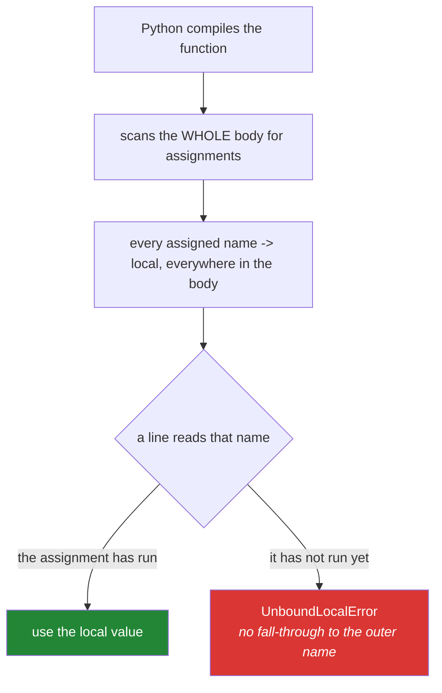

# 2.2 — `UnboundLocalError`, and the assignment that changes everything

## One-line answer

Assigning to a name **anywhere** inside a function makes that name local for the **whole** function —
including the lines above the assignment — so reading it before that line raises rather than falling
through to the outer value.

---

## The story

Back to the house and the scissors.

Somebody sticks a label on the drawer in the living room: **"SCISSORS LIVE HERE."**

They have not put any scissors in it yet. They are going to, later this afternoon, when they get back
from the shop. But the label is already on the drawer, and from the moment it went up, the rule
changed for everybody in the room: if you want scissors, you look in *that* drawer.

So somebody walks in at two o'clock, wants scissors, goes straight to the labelled drawer — and finds
it empty. They do not then wander off to the kitchen. Why would they? The label says the scissors are
here. There is a labelled, empty, authoritative drawer, and the perfectly good pair in the kitchen
has become invisible to everyone in the room.

The label was not a description of where the scissors are. It was a **declaration about where to
look**, and it took effect immediately, for the whole room, including before the scissors arrived.

Python does exactly this, and the label is an `=` sign.

---

## The idea in plain language

### The rule, stated plainly

When Python compiles a function — before it runs a single line — it looks at the whole body and makes
a list of every name that gets **assigned to** anywhere in it. Every one of those names is local for
the entire function.

"Assigned to" is broader than it sounds. All of these count:

- `x = 1`
- `x += 1`
- `for x in ...:`
- `with open(p) as x:`
- `import x`
- `def x():`
- `except E as x:`

If any of those appears anywhere in the body, `x` is local everywhere in that body.

### Why this makes reading fail

If a name is local, the four-drawer search from [2.1](2.1-legb-where-a-name-is-found.md) never
happens for it. Python does not look outward at all; it goes straight to the local slot. If the
assignment has not run yet, that slot is empty, and you get:

```text
UnboundLocalError: cannot access local variable 'total' where it is not associated with a value
```

Read that message carefully. It says **local variable**, which is the whole diagnosis: Python is
telling you it already decided this name was local, and you were expecting it to look outward.

### The `+=` version, which catches everybody

`total += n` is `total = total + n`. It **reads** `total` and then **assigns** to it, on one line.
The assignment half makes it local; the reading half then happens first and finds an empty slot. So
the most natural way anybody would write "add to the running total" is precisely the shape that
fails.

### Why the language does it this way

The alternative sounds friendlier and is much worse. If assignment silently created a local only when
no outer name existed, then adding an unrelated module-level variable months later could turn a local
into a global write, and a function that used to be self-contained would start changing something
outside it. Making the decision at compile time, from the function's own body alone, means **a
function's behaviour never depends on what else happens to exist in the file**.

---

## Why Setu needs it

- **Every counter you write for the rest of this plan** is this. Day 6's capped retry
  ([Day 6, 3.2](../../../day-06-loops/parts/03-capped-retry/3.2-the-capped-retry-from-scratch.md))
  increments an attempt count; Day 9's pipeline counts what each stage dropped; Day 95's training
  loop accumulates a loss. All of them are `x += 1` in a function.
- **Today's `src/setu/textutils.py`** must not accumulate anything at module level, and the reason
  a shared counter is tempting is exactly that it looks like it should work.
- **[2.3](2.3-global-and-nonlocal.md) is the escape hatch** for the rare case where you genuinely
  meant to write outward, and it is easier to judge once you know what it is escaping.
- **[2.4](2.4-closures-and-late-binding.md)'s closures** read enclosing names without assigning to
  them, which is exactly why they work without any keyword at all.

---

## The mechanism

The failure, and the proof that it is decided before anything runs:

```python
"""The label goes up when the function is compiled, not when the line runs."""

count = 10


def broken():
    print("about to read count")
    count = count + 1
    return count


print("module-level count:", count)
print("local names Python decided on:", broken.__code__.co_varnames)
try:
    broken()
except UnboundLocalError as exc:
    print("UnboundLocalError:", exc)
```

**Line by line:**

- `count = 10` at the top of the file — a global name, perfectly readable from inside any function in
  this module ([2.1](2.1-legb-where-a-name-is-found.md)).
- `print("about to read count")` — this line **does** run. The failure is not at the top of the
  function; it is at the line that reads the name.
- `count = count + 1` — the assignment on the left is the label on the drawer. It makes `count` local
  for the whole of `broken`, so the `count` on the right looks in the empty local slot rather than
  falling through to the global 10.
- `broken.__code__.co_varnames` — **this is the proof.** It prints `('count',)`, and it prints that
  *before `broken` has ever been called*. Python worked out the list of local names when it compiled
  the function. Nothing at run time was involved, which is why moving the assignment or removing it
  changes the answer and the value of the global never does.
- `except UnboundLocalError as exc:` — catching it so the rest of the block runs. The real message
  is `cannot access local variable 'count' where it is not associated with a value`.

The three fixes, in the order you should reach for them:

```python
"""Three ways out, best first."""

count = 10


def by_parameter(current):
    """Best: take what you need, return what you produced. Nothing outside is touched."""
    return current + 1


def by_local(start):
    """Also fine: a local accumulator, initialised inside the function."""
    total = start
    for _ in range(3):
        total += 1
    return total


def by_global():
    """Last resort: say out loud that you are writing to the module-level name."""
    global count
    count = count + 1
    return count


print("by_parameter:", by_parameter(count), "| module count still:", count)
print("by_local    :", by_local(0))
print("by_global   :", by_global(), "| module count now:", count)
```

**Line by line:**

- `def by_parameter(current):` — the value comes in as an argument and the new value goes out as a
  return. There is no outer name involved at all, which is why this version can be tested with any
  number, called twice, and called from two threads without a thought.
- `return current + 1` — no assignment to `current`, so nothing is labelled and nothing can be
  unbound.
- `total = start` in `by_local` — the assignment still makes `total` local, and that is fine
  **because this line runs before any read of it**. The `UnboundLocalError` was never about
  assignment being forbidden; it was about reading before the assignment ran.
- `for _ in range(3):` — `_` is the conventional name for a loop variable nobody uses. It is an
  ordinary name, and note that it too is assigned, so it too is local
  ([Day 6, 1.2](../../../day-06-loops/parts/01-iteration/1.2-range-is-lazy.md)).
- `global count` in `by_global` — the declaration that removes the label and points it at the
  module-level name instead. It must appear **before** any use of `count` in that function.
  [2.3](2.3-global-and-nonlocal.md) is why this is the last resort rather than the obvious answer.
- The printed line `module count still: 10` versus `module count now: 11` is the whole difference,
  and it is what a reviewer is looking for: the first two functions cannot surprise a caller, and the
  third can.



---

## When it breaks

**The counter that will not count:**

```text
>>> total = 0
>>> def add(n):
...     total += n
...
>>> add(5)
Traceback (most recent call last):
  File "<stdin>", line 1, in <module>
  File "<stdin>", line 2, in add
UnboundLocalError: cannot access local variable 'total' where it is not associated with a value
```

**What it means.** `total += n` is `total = total + n`, so `total` is local, and the read on the right
happens before anything has been put in the local slot. The message names the variable, which is the
fast way to find it in a long function. The fix is almost never `global`; it is to pass `total` in and
return the new value.

**The assignment fifty lines below the read:**

```text
>>> path = "/data"
>>> def load(name):
...     print("loading from", path)
...     if name.startswith("/"):
...         path = name
...     return path
...
>>> load("papers.csv")
Traceback (most recent call last):
  File "<stdin>", line 2, in load
UnboundLocalError: cannot access local variable 'path' where it is not associated with a value
```

**What it means.** This is the version that costs an afternoon. The `print` on the **first** line of
the function fails, because of an assignment inside an `if` further down that **did not even run**.
The label went up at compile time; whether the branch is taken is irrelevant. When somebody says a
line "worked yesterday", this is often what changed: a conditional assignment was added at the bottom
of the function.

**The import that shadowed itself:**

```text
>>> import json
>>> def dump(obj):
...     print(json.dumps(obj))
...     import json
...
>>> dump({"a": 1})
Traceback (most recent call last):
  File "<stdin>", line 2, in dump
UnboundLocalError: cannot access local variable 'json' where it is not associated with a value
```

**What it means.** `import json` inside the function is an assignment to the name `json`, so `json`
is local for the whole function, and the `json.dumps` on the line above it finds an empty slot. This
turns up in real code when somebody moves an import into a function to break a circular dependency
and does not move it to the top of the body.

---

## In production

**The professional habit is that a function's state lives in its parameters and its return value,
full stop.** `total = update(total, row)` at the call site is longer than `update(row)` mutating a
global, and it is the version that can be tested, retried, run twice and run in parallel. Every
serious codebase converges on this, and the `UnboundLocalError` is the language nudging you towards
it on the day you first reach for the shortcut.

**This error is one of Python's better ones, and it got better recently.** Before Python 3.11 the
message was `local variable 'total' referenced before assignment`, which named the symptom. The
current wording — *cannot access local variable 'x' where it is not associated with a value* — says
the actual state of affairs: the variable exists and is local, and there is nothing in it. If you
meet the older wording, you are on an older interpreter, and it is the same bug.

**The dangerous version of this is the one that does not raise.** If the outer name happens to have
been given a value earlier in the same function by some other path, you get no error at all and a
value that came from somewhere you did not intend. This is why reviewers ask for a single assignment
point per name in a long function, and why a function long enough to lose track of its own
assignments is a function that should be split.

**What changes under concurrency.** The `global` escape hatch is not just untestable; it is a shared
mutable value with no lock. Two requests running `count = count + 1` at the same time can read the
same number, both add one, and both write back — so two increments become one. Python's global
interpreter lock makes this *less* likely than in some languages and does not make it impossible,
because the read and the write are separate operations. A counter that matters belongs in something
built for it.

**The review comment a senior engineer leaves.** On a function with `global processed` in it:
*"This writes a module-level counter, so the function's result depends on how many times it has been
called before. Two tests in the same process will interfere, and so will two requests. Return the
count and let the caller accumulate."*

**The interview question.** *"Why does this raise `UnboundLocalError` when there is clearly a global
with that name?"* The weak answer is "because Python thinks it is local". The answer that lands says
**when** the decision is made: Python scans the entire function body at compile time, and any name
assigned anywhere in it becomes local for the whole body — so the four-scope search never runs for
that name, and an assignment on a line that never executes still causes the error. If you can add
that `x += 1` fails because it is a read and a write on one line, and that the honest fix is a
parameter rather than `global`, you are describing something you have actually hit.

---

## Check yourself

```bash
uv run python -c "
total = 10

def broken():
    total += 1
    return total

print('names Python decided are local:', broken.__code__.co_varnames)
try:
    broken()
except UnboundLocalError as e:
    print('UnboundLocalError:', e)
print('the module-level total is still:', total)
"
```

The first line prints before anything is called. Say what it will contain, and say what that proves
about when the decision was made.

**Answer out loud, without scrolling up:**

> Explain why an assignment on a line that never runs can still break a line above it. Then say why
> `x += 1` is the shape that catches everybody, and name the fix you should reach for before
> `global`.

---

**Next:** [2.3 — `global` and `nonlocal`, and why you rarely want either](2.3-global-and-nonlocal.md)
