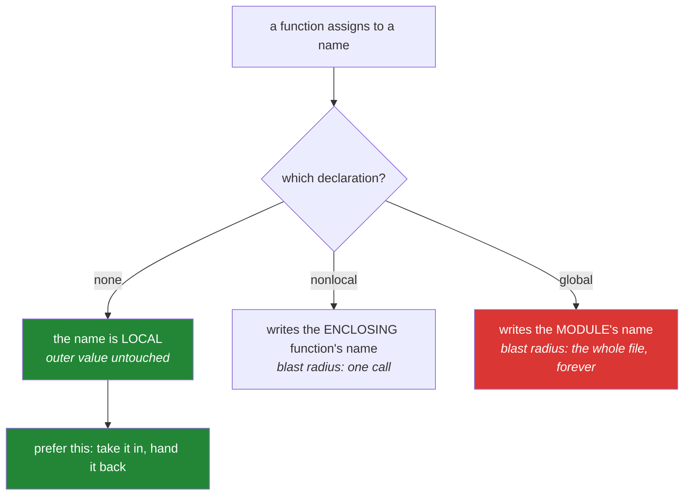

# 2.3 — `global` and `nonlocal`, and why you rarely want either

## One-line answer

`global` and `nonlocal` are declarations that let a function **write** to a name outside itself —
`global` reaches the top of the file, `nonlocal` reaches the enclosing function — and both should be
the answer only after you have decided that passing a value in and returning one out genuinely will
not do.

---

## The story

There are three ways to deal with the scissors problem, and only one of them is usually right.

**Change the household rule.** You announce at dinner that from now on the scissors live in the
living room. Everybody has to remember. Anybody who looks in the kitchen finds nothing. It works, and
it works for everyone, whether or not they were at dinner.

**Change the rule for one room.** You tell the three people who use the study that in *this* room,
the scissors are in the desk. The rest of the house carries on unaffected.

**Just hand somebody the scissors.** Which is what actually happens ninety-nine times out of a
hundred, because the person who wants scissors is standing right there and the whole conversation
about where scissors live is a conversation nobody needed.

The first two are real and occasionally necessary. The third is almost always what was meant, and the
reason it wins is not tidiness — it is that handing something over involves exactly two people and
leaves nothing behind, while changing a rule involves everybody, forever, including people who are
not in the room and code you have not written yet.

---

## The idea in plain language

### What each keyword actually does

Neither keyword creates anything or moves anything. Each one is a **statement about where a name
lives**, and it exists purely to switch off the rule from
[2.2](2.2-unboundlocalerror.md) — the one that makes any assigned name local.

- **`global name`** says: *in this function, `name` refers to the module-level name, and assigning to
  it changes that one.*
- **`nonlocal name`** says: *in this function, `name` refers to a name in the enclosing function, and
  assigning to it changes that one.*

Both must appear before any use of the name in that function.

### The asymmetry that surprises people

You do not need either keyword to **read** an outer name. The four-drawer search from
[2.1](2.1-legb-where-a-name-is-found.md) already finds it. `print(config)` inside a function works
with no declaration at all.

You only need a keyword to **write**. That is the entire scope of these two features, and it is why
they feel like they appear from nowhere: everything worked fine right up until the first assignment.

### `nonlocal` will not invent a variable

`global x` on a name that does not exist yet is fine — the assignment creates it at module level.
`nonlocal x` on a name that does not exist in any enclosing function is a **syntax error**, refused
before the file will even run. The reason is that "enclosing" has to mean a specific, already-existing
function scope; there is no sensible place for `nonlocal` to create something.

### Why the advice is "rarely"

A function that writes to something outside itself has three properties, and all three are expensive:

1. **Its result depends on history.** Calling it twice does not do the same thing twice.
2. **It cannot be tested in isolation.** Every test has to set up and tear down the outer value, and
   two tests in one process interfere ([Day 2, 3.2](../../../day-02-quality-gate/parts/03-pytest/3.2-fixtures-and-tmp-path.md)).
3. **It is unsafe to run twice at once.** Two callers writing the same name is a data race with no
   lock around it.

`nonlocal` is the milder of the two, because the thing it writes is confined to one enclosing call
rather than the whole module — which is exactly what makes a counter inside a decorator a reasonable
use.

---

## Why Setu needs it

- **You will read `nonlocal` before you write it.** Day 14's `@retry` keeps an attempt count in the
  enclosing scope, and a great deal of published decorator code does the same. Recognising it is
  necessary; reaching for it is not.
- **`global` shows up in exactly one legitimate shape in this project** — a module-level
  singleton created once and never re-created, such as a cached client or a compiled pattern — and
  even then the modern answer is usually `functools.lru_cache` rather than a global plus a check.
- **Principle 11 is the same idea at a different scale.** *Blast radius first*: name what a thing can
  reach before you give it the ability to change anything. A `global` is a tool whose blast radius is
  the whole module.
- **Day 192's checkpointed graph state** is the plan's final answer to this question. State is a
  value that gets passed in and replaced, never a variable that gets written to from wherever — and
  the reason is that a checkpoint you can save, resume and time-travel (Day 197) has to *be* a value.

---

## The mechanism

`global`, and what it costs:

```python
"""Writing to a module-level name, and why the caller cannot ignore it."""

processed = 0


def count_one_bad():
    """Writes to the module. Its answer depends on how many times it has run."""
    global processed
    processed += 1
    return processed


def count_one_good(so_far):
    """Takes the count in, hands the new one back. Nothing outside is touched."""
    return so_far + 1


print("bad :", count_one_bad(), count_one_bad(), count_one_bad())
print("module-level processed is now:", processed)

total = 0
for _ in range(3):
    total = count_one_good(total)
print("good:", total, "| module-level processed still:", processed)
```

**Line by line:**

- `global processed` — the declaration. Without it, `processed += 1` would raise
  `UnboundLocalError` ([2.2](2.2-unboundlocalerror.md)), because `+=` is an assignment and would have
  made the name local.
- `processed += 1` — this now changes the module-level name, permanently, for everything else in the
  file and for anything that imported it.
- `print("bad :", count_one_bad(), count_one_bad(), count_one_bad())` — prints `1 2 3`. **Three
  identical calls, three different answers.** That is the property that makes this function
  impossible to reason about in isolation, and it is not a subtle one: a test that asserts the result
  is `1` passes on its own and fails when any other test in the file ran first.
- `def count_one_good(so_far):` — the same job with the value handed over. The answer depends on the
  argument and on nothing else.
- `total = count_one_good(total)` — the caller holds the state and the function stays a pure
  calculation. This is the shape that survives being tested, retried and run in parallel.
- The last line's `module-level processed still: 3` is the point: the good version left it exactly
  where the bad version put it, because it never touched it.

`nonlocal`, in the one place it earns its keep:

```python
"""A counter that belongs to one enclosing call, not to the module."""


def make_counter(start=0):
    """Return a function that counts up from `start`. Each counter is independent."""
    current = start

    def bump():
        nonlocal current
        current += 1
        return current

    return bump


first = make_counter()
second = make_counter(100)

print("first :", first(), first(), first())
print("second:", second(), second())
print("first again:", first())
```

**Line by line:**

- `current = start` — a local of `make_counter`. It is created fresh on every call to
  `make_counter`, which is why the two counters below do not interfere.
- `def bump():` written inside — this is what creates the **enclosing** scope from
  [2.1](2.1-legb-where-a-name-is-found.md). `bump` can see `current` without any keyword at all.
- `nonlocal current` — needed only because the next line **assigns**. Reading `current` would have
  worked with no declaration; writing it needs one, or `current` would become local to `bump` and
  raise.
- `return bump` — the inner function is handed back as a value. It is an object, like everything
  else ([Day 4, 1.1](../../../day-04-objects/parts/01-objects/1.1-identity-type-value.md)), and it
  keeps hold of the `current` it grew up with. That combination is called a **closure**, and it is
  [2.4](2.4-closures-and-late-binding.md)'s subject.
- `first` and `second` print `1 2 3` and `101 102`, then `first again: 4`. **Two independent
  counters**, because each call to `make_counter` made its own `current`. A `global` could not have
  done this — there is only one module.
- `start=0` is a number, so it is a safe default ([1.3](../01-the-signature/1.3-defaults-and-when-they-run.md)).



---

## When it breaks

**`nonlocal` with nothing to bind to:**

```text
>>> def outer():
...     def inner():
...         nonlocal missing
...         missing = 1
...     inner()
...
  File "<stdin>", line 3
    nonlocal missing
    ^^^^^^^^^^^^^^^^
SyntaxError: no binding for nonlocal 'missing' found
```

**What it means.** There is no `missing` in any enclosing function, so there is nothing for the
declaration to point at, and `nonlocal` refuses to create one. Note this is a `SyntaxError` — the
file will not even compile, so it cannot reach production. The usual causes are a typo in the name,
or expecting `nonlocal` to reach a module-level variable, which is `global`'s job.

**The declaration that came too late:**

```text
>>> count = 0
>>> def bump():
...     print(count)
...     global count
...     count += 1
...
  File "<stdin>", line 4
SyntaxError: name 'count' is used prior to global declaration
```

**What it means.** The declaration has to come before every use of the name in that function, and
Python refuses to compile the function otherwise. That is a good outcome — it cannot reach production
— and it exists because a `global` halfway down would mean the same name referred to two different
things in one function body. The habit that avoids it entirely is to put the declaration on the first
line of the body, or to not need one at all.

**The two tests that passed separately:**

```text
$ uv run python -m pytest tests/test_counter.py -v
tests/test_counter.py::test_first_call PASSED
tests/test_counter.py::test_counts_from_one FAILED

E       assert 2 == 1
E        +  where 2 = count_one_bad()
```

**What it means.** Both tests are correct and both pass when run alone. The second one fails because
the first one already incremented the module-level counter, so the state leaked between tests. This
is the same shape as the flaky test in
[Day 2, 3.2](../../../day-02-quality-gate/parts/03-pytest/3.2-fixtures-and-tmp-path.md), and no
fixture can fix it, because the shared state is not in the test file. The fix is in the function.

---

## In production

**The practical rule is: `nonlocal` occasionally, `global` almost never.** `nonlocal` writes
something that was created by a specific call and dies with it, so its blast radius is one closure.
`global` writes something that lives for the life of the process and is visible to every function in
the module and to everything that imported it. Those are different sizes of decision, and reviewers
treat them differently.

**The one shape where a module-level write is normal is lazy initialisation**, and even that has a
better answer now. `_client = None` at module level with a function that creates it on first use is a
recognised pattern; `functools.lru_cache` or `functools.cache` on a zero-argument factory does the
same job without the global, and is thread-safe, which the hand-rolled version usually is not.

**Under concurrency, `global` is a shared variable with no lock.** `count += 1` reads, adds and
writes as separate steps, so two threads can read the same value, both add one, and both store the
same result — two increments becoming one. Python's global interpreter lock makes this less frequent
than in some languages and does not prevent it. A counter that anybody will act on belongs in
something built for the job.

**The testability argument is the one that actually changes minds.** A function that reads its inputs
and returns its outputs can be tested with made-up values in one line. A function that writes to a
module-level name needs a fixture to reset it, needs the tests ordered or isolated, and will
eventually produce a failure that only appears when the whole suite runs — the worst kind, because it
cannot be reproduced by running the failing test. Principle 7 asks for tests that can go red for the
right reason; global state produces tests that go red for the wrong one.

**The review comment a senior engineer leaves.** On a module with `global cache` in three functions:
*"Three functions write to one module-level dictionary, so the behaviour of any of them depends on
which of the others ran first. Wrap them in a small class or pass the cache in — I need to be able to
construct a fresh one per test, and right now the only way to do that is to reload the module."*

**The interview question.** *"When would you use `global`?"* The answer that lands starts by narrowing
it: almost never, because the alternative — take the value as a parameter and return the new one — is
shorter to test, safe to call twice, and safe under concurrency. Then give the real distinction:
`nonlocal` is a different proposition, because it writes a name created by one enclosing call, so its
blast radius is that call rather than the whole module — which is why a counter in a decorator is
reasonable and a counter at module level is not. If you can add that neither keyword is needed to
*read* an outer name, and that this is exactly why the need for them appears out of nowhere at the
first assignment, you have explained the feature rather than recited it.

---

## Check yourself

```bash
uv run python -c "
def make_counter(start=0):
    current = start
    def bump():
        nonlocal current
        current += 1
        return current
    return bump

a = make_counter()
b = make_counter(100)
print('a:', a(), a(), a())
print('b:', b(), b())
print('a again:', a())
"
```

Predict all three lines. In particular, predict whether `b` starting at 100 has any effect on `a`,
and say why.

**Answer out loud, without scrolling up:**

> Say why you need a keyword to write an outer name but not to read one. Then explain the difference
> in blast radius between `global` and `nonlocal`, and give the version of a counter that needs
> neither.

---

**Next:** [2.4 — Closures, and the loop that captured the wrong number](2.4-closures-and-late-binding.md)
