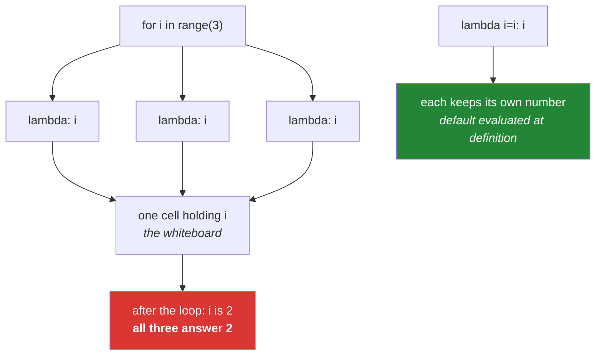

# 2.4 — Closures, and the loop that captured the wrong number

## One-line answer

A function defined inside another function keeps a live link to the outer function's names — not a
copy of their values — so a function made inside a loop sees whatever the loop variable **ended up**
being, not what it was at the moment the function was written.

---

## The story

There is a whiteboard on the office wall with a number on it.

You write three notes to three colleagues. Each note says the same thing: **"do the job for the
number on the whiteboard."** You write the first note when the board says 0, the second when it says
1, and the third when it says 2. Then you put all three in envelopes and post them.

Two days later your colleagues open their envelopes. All three walk over to the whiteboard. It says
**2**, because that is what it said when you left, and nobody has changed it since.

All three of them do the job for 2.

You are baffled, and then you are not, because you re-read what you wrote. Not one of those notes
contained a number. Every one of them contained **directions to a whiteboard**. The number was never
copied into the note; the note only ever pointed at where the number lives, and by the time anybody
read it, the board said what it said.

That is a closure, and that is the bug. The note is genuinely useful — pointing at a shared board is
often exactly what you want, and it is why the note is still correct if somebody updates the board
for a good reason. It is only a bug when you *thought* you were writing the number down.

---

## The idea in plain language

### What a closure is

A **closure** is a function that was defined inside another function and that uses one of the outer
function's names. Python keeps the outer name alive for as long as the inner function exists, even
after the outer function has finished and returned.

That last clause is the surprising part. Normally a function's local names disappear when it returns.
If an inner function refers to one, it does not disappear — it is kept, attached to the inner
function.

You already built one on [2.3](2.3-global-and-nonlocal.md): `make_counter` returned `bump`, and
`bump` kept working with its own `current` long after `make_counter` had finished.

### The link is to the name, not to the value

This is the whole document in one line. A closure stores **where to look**, not **what was there**.

So if the outer name changes after the inner function is defined — by a later assignment, or by a
loop moving on to the next item — the inner function sees the new value. It has to: it never had the
old one.

This is called **late binding**, and it is not a quirk. Any other rule would make a closure a
snapshot, and then `make_counter`'s counter could never count.

### Where it bites: functions made in a loop

```text
handlers = [lambda: i for i in range(3)]
```

Three functions, each of which reads `i`. Not one of them stored a number. By the time anybody calls
them, the loop has finished and `i` is `2`, so all three return `2`.

The same shape appears with `def` inside a `for`, with callbacks registered in a loop, and with
partial functions built in a loop. It is one of the most reliably confusing bugs in the language,
because the code reads exactly like it should work.

### The fix: bind the value at definition time

The standard fix uses the one thing on this day that *is* evaluated immediately — a default value
([1.3](../01-the-signature/1.3-defaults-and-when-they-run.md)):

```text
handlers = [lambda i=i: i for i in range(3)]
```

`i=i` is evaluated when each `lambda` is created, so each function gets its own copy of the number at
that moment. The alternative is `functools.partial`, which does the same thing with a clearer name.

Note that this is the **same fact** as the mutable-default bug from
[Day 4, 3.1](../../../day-04-objects/parts/03-identity-trap/3.1-the-mutable-default-argument.md),
used deliberately rather than tripped over. Defaults are evaluated once, at definition; there it is a
hazard, here it is the tool.

---

## Why Setu needs it

- **Day 14's decorators are closures.** `@retry(3)` returns a function that remembers `3`, and
  `@timed` returns a wrapper that remembers the function it wrapped. There is nothing else in a
  decorator except this.
- **Every callback you register in a loop** — a set of handlers, a list of partially-applied model
  calls, a row of buttons in the Day 52 dashboard — is the late-binding trap waiting to happen.
- **[Day 9, 3.2](../../../day-09-comprehensions/parts/03-when-not-to/3.2-comprehension-scope.md)
  showed the walrus leaking out of a comprehension.** This document is why comprehensions have their
  own scope at all: without it, the loop variable would leak into the enclosing function and every
  closure built in one would capture it.
- **Day 172's provider router** builds one calling function per provider, from a list of provider
  configurations. Building those in a loop without binding is precisely how all three end up calling
  the last provider.

---

## The mechanism

The bug, and the proof of what the function actually stored:

```python
"""Three functions that all point at the same name."""

late = [lambda: i for i in range(3)]

print("all three return:", [f() for f in late])
print("what they closed over:", late[0].__code__.co_freevars)
print("the cell they share :", late[0].__closure__[0])
print("the value in it now :", late[0].__closure__[0].cell_contents)
```

**Line by line:**

- `[lambda: i for i in range(3)]` — a list comprehension that builds three tiny functions, one per
  loop value ([Day 9, 1.1](../../../day-09-comprehensions/parts/01-list-comprehensions/1.1-the-loop-and-the-comprehension.md)).
  Nothing is called yet; three functions are made and stored.
- `[f() for f in late]` — **now** they are called, and all three print `2`. The loop finished long
  ago and left `i` at its last value.
- `late[0].__code__.co_freevars` — prints `('i',)`. A "free variable" is exactly the thing this
  document is about: a name the function uses but did not create. Python knows the list, and you can
  read it.
- `late[0].__closure__[0]` — prints something like `<cell at 0x...: int object at 0x...>`. **The
  cell is the whiteboard.** It is a small box holding one value, and every one of the three functions
  points at the same box.
- `.cell_contents` — prints `2`, the number currently on the board. Change the board and every
  function's answer changes with it, which is the whole idea.

The fix, and the one thing it relies on:

```python
"""Binding the value at the moment the function is made."""

from functools import partial

late = [lambda: i for i in range(3)]
bound = [lambda i=i: i for i in range(3)]
explicit = [partial(lambda n: n, i) for i in range(3)]

print("late    :", [f() for f in late])
print("bound   :", [f() for f in bound])
print("explicit:", [f() for f in explicit])
print("bound[0] closed over:", bound[0].__code__.co_freevars)
```

**Line by line:**

- `lambda i=i: i` — the right-hand `i` is the loop variable, read **now**, while the loop is on that
  value. The left-hand `i` is a parameter with that value as its default. Because defaults are
  evaluated when the function is defined
  ([1.3](../01-the-signature/1.3-defaults-and-when-they-run.md)), each function ends up owning a
  number rather than pointing at a board.
- `bound` prints `[0, 1, 2]` — the answer everybody expected from `late`.
- `partial(lambda n: n, i)` — `functools.partial` builds a new callable with `i` already supplied.
  It does the same job as the default trick and says so in a word, which is why reviewers prefer it
  when the reader is not expected to know this document.
- `bound[0].__code__.co_freevars` — prints `()`, an empty tuple. **That is the proof the fix worked**:
  `bound[0]` closes over nothing at all, because `i` is now its own parameter rather than somebody
  else's name.
- The `i=i` spelling is deliberately ugly, and that is a feature: it is unusual enough that a reader
  stops and asks why, which is what you want on a line whose whole job is to defeat a default
  behaviour.

Where the same mechanism is exactly what you want:

```python
"""A closure used on purpose: one configured function per provider."""


def make_formatter(prefix, width):
    """Return a function that formats a title with this prefix and width."""

    def formatter(title):
        return f"{prefix}{title[:width]}"

    return formatter


short = make_formatter("[paper] ", 20)
long = make_formatter("[full]  ", 40)

print(short("Attention Is All You Need"))
print(long("Attention Is All You Need"))
print("short closed over:", short.__code__.co_freevars)
```

**Line by line:**

- `def make_formatter(prefix, width):` — a **factory**: a function whose job is to build and return
  another function. This is the shape Day 14's `@retry(3)` uses and the shape Day 172's router uses.
- `def formatter(title):` — the inner function reads `prefix` and `width` without any declaration,
  because reading an enclosing name needs none ([2.3](2.3-global-and-nonlocal.md)).
- `return formatter` — the outer function ends here, and its locals would normally be gone. They are
  not, because `formatter` is still pointing at them.
- `short` and `long` are two independent functions with two independent sets of captured values,
  because each call to `make_formatter` created its own `prefix` and `width`. **This is the same
  mechanism as the loop bug**, and here it is the entire point.
- `short.__code__.co_freevars` — prints `('prefix', 'width')`, in alphabetical order. Reading this on
  an unfamiliar closure tells you exactly what it is carrying, which is a genuinely useful debugging
  move.



---

## When it breaks

**The handlers that all do the last thing:**

```text
>>> callbacks = []
>>> for name in ["gemini", "groq", "openrouter"]:
...     callbacks.append(lambda: print("calling", name))
...
>>> for cb in callbacks:
...     cb()
...
calling openrouter
calling openrouter
calling openrouter
```

**What it means.** No error, no warning, three identical results where three different ones were
intended. This is the shape that reaches production, because every individual line is obviously
correct and the list has the right length. It is worth noticing that a `for` loop leaks its variable
into the enclosing scope — unlike a comprehension, which does not
([Day 9, 3.2](../../../day-09-comprehensions/parts/03-when-not-to/3.2-comprehension-scope.md)) —
so after the loop, `name` is still `"openrouter"` and you can print it to confirm the diagnosis in
one line.

**The linter that saw it coming:**

```text
$ uv run ruff check --select B023 handlers.py
B023 Function definition does not bind loop variable `name`
 --> handlers.py:3:36
  |
1 | callbacks = []
2 | for name in ["a", "b"]:
3 |     callbacks.append(lambda: print(name))
  |                                    ^^^^
  |

Found 1 error.
```

**What it means.** `B023` exists for exactly this bug, and the wording is precise: the function
*does not bind* the loop variable, it merely refers to it. If this rule is in your selected set, the
bug never reaches a review. It is worth checking that it is, because it is one of the few linter
rules that catches a genuine logic error rather than a style preference
([Day 2, 1.2](../../../day-02-quality-gate/parts/01-linting/1.2-choosing-rule-families.md)).

**The name that vanished before the call:**

```text
>>> def make():
...     value = "temporary"
...     del value
...     return lambda: value
...
>>> make()()
Traceback (most recent call last):
  File "<stdin>", line 4, in <lambda>
NameError: cannot access free variable 'value' where it is not associated with a value in enclosing scope. Did you mean: 'False'?
```

**What it means.** The closure kept a link to the *name*, and the name was deleted before anybody
followed the link. The message says **free variable**, which is the same vocabulary as
`co_freevars` above, and it is worth recognising because it tells you immediately that the problem is
in an enclosing scope rather than in the function you are looking at. Ignore the "did you mean"
suggestion here — Python offers the nearest name it can find, and when there is nothing close it
reaches for a built-in, which is unhelpful rather than wrong.

---

## In production

**Every decorator you will ever write is this document.** `@retry(3)` is a factory that returns a
decorator that returns a wrapper, and each layer closes over the layer above it: the wrapper
remembers the function, the decorator remembers the `3`. Day 14 will feel like new syntax and no new
ideas, which is the correct feeling.

**The loop bug has a name and it is worth using it in review.** Say "late binding" and any
experienced Python programmer knows exactly what you have found. The two accepted fixes are the
default-argument trick and `functools.partial`, and in a shared codebase `partial` usually wins,
because `lambda i=i: i` requires the reader to know this document while `partial(f, i)` requires them
to know one function.

**A closure holds its captured objects alive, which is a memory decision.** If an inner function
captures a large object — a loaded dataframe, a model, an open connection — that object cannot be
freed for as long as the inner function is referenced anywhere. A list of a thousand callbacks that
each captured a batch of rows is a thousand batches still in memory. `co_freevars` is how you find
out what a suspicious closure is carrying, and it is a genuinely useful thing to reach for during a
memory investigation.

**Closures are the small answer to a problem classes solve at a larger size.** A function plus some
remembered configuration is a closure; a function plus some remembered configuration plus five more
functions is a class. Day 12 builds the class version, and knowing that the two are the same idea at
different scales is what stops you writing a class with one method or a closure with six.

**The review comment a senior engineer leaves.** On a list of functions built in a loop:
*"These all close over `name`, so they will all use the last one. Bind it at definition — `partial`
is clearer here than a default argument. And add `B023` to the ruff selection while you are in here,
because this will happen again."*

**The interview question.** *"What does this print, and why?"* followed by the three-lambda loop. The
answer that lands does not stop at "they all print 2". It says the closure stores a reference to the
**name**, not the value, so every function reads whatever the name holds at call time — which is late
binding, and which is exactly what makes a counter in a closure able to count. Then give the fix and
why it works: a default argument is evaluated at definition, so `lambda i=i: i` copies the value at
the moment the function is made. If you can add that this is the same evaluated-once rule as the
mutable-default bug, used on purpose instead of by accident, you have connected two things most
people learn separately.

---

## Check yourself

```bash
uv run python -c "
late = [lambda: i for i in range(3)]
bound = [lambda i=i: i for i in range(3)]
print('late :', [f() for f in late])
print('bound:', [f() for f in bound])
print('late[0] closed over :', late[0].__code__.co_freevars)
print('bound[0] closed over:', bound[0].__code__.co_freevars)
print('the shared cell holds:', late[0].__closure__[0].cell_contents)
"
```

Predict the last three lines especially. The two `co_freevars` results are the difference between the
bug and the fix, stated by Python rather than by this document.

**Answer out loud, without scrolling up:**

> Explain, using the whiteboard, why three functions built in a loop all give the same answer. Then
> say why adding `i=i` fixes it, and name the rule from earlier today that makes that work.

---

**Next:** [3.1 — From notebook to module](../03-the-module/3.1-from-notebook-to-module.md)
