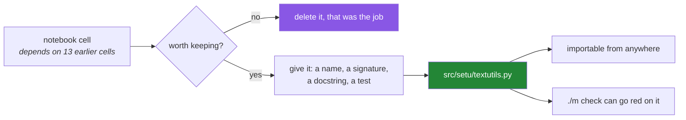

# 3.1 — From notebook to module — what "graduates" means

## One-line answer

A notebook is where you find out what the code should be, and a module is where that code lives once
you know — so "graduating" a function means giving it a file, a name, a signature and a test, on the
day you wrote it, before you have forgotten why.

---

## The story

Somebody works out a really good dal recipe on a Tuesday evening, mostly by tasting.

They write the important bits on the back of an envelope as they go: *"more cumin than you think",
"3 tomatoes", "low heat, lid on"*. It works. Dinner is excellent. The envelope goes on the counter, then
under the post, then into a drawer.

Six months later they want to make it again. Three things can happen, and all three are common.

The envelope is gone. Or the envelope is there and says *"3 tomatoes"*, and they cannot remember
whether that was three large ones or the small tinned kind, because on Tuesday it was obvious. Or —
worst — there are **two envelopes**, from two different attempts, and one of them is the version that
was too salty, and there is nothing on either to say which.

The fix is not to write on better envelopes. It is that when the dish worked, it goes in the family
book: a name at the top, the quantities written out, and a line at the bottom saying *"this is the
one, the earlier version was too salty"*. That takes a few minutes on Tuesday, while it is all still
in your head, and it is the only version that is still usable in six months.

Nobody thinks the envelope was a mistake. **The envelope is how you found the recipe.** It is just
not where the recipe lives.

---

## The idea in plain language

### Principle 6, restated

The plan's sixth principle says it directly: *the notebook is a scratchpad, not the deliverable.
Every notebook that produces something worth keeping graduates into `src/setu/` as a tested function
the same day.*

Both halves matter, and the second one is the one people drop.

- **A scratchpad is for finding out.** Run it, print it, change one thing, run it again. Nothing in
  that loop should be careful, and making it careful would slow down the only thing a notebook is
  good at.
- **A module is for keeping.** It has a filename, an import path, a signature, a docstring and a
  test. That is what makes it findable, callable, checkable and safe to change.

### What "graduating" actually involves

Four things, and none of them is copying and pasting:

1. **Give it a name and a signature.** In a notebook the inputs were whatever happened to be in
   scope. In a module they have to be parameters ([1.2](../01-the-signature/1.2-positional-and-keyword.md)),
   which forces you to decide what the function actually depends on.
2. **Cut it loose from the notebook's state.** A cell that reads `df` works because a cell above it
   ran. A function that reads a module-level `df` is the global-state problem from
   [2.3](../02-scope/2.3-global-and-nonlocal.md), moved rather than fixed.
3. **Write the docstring while you still know.** What it returns, what it raises, whether it changes
   anything you gave it ([1.6](../01-the-signature/1.6-the-signature-is-the-contract.md)).
4. **Write one test that can go red.** Principle 7. Not a test that proves it works — a test that
   would notice if somebody broke it.

### Why "the same day" is in the principle

Because the thing being preserved is not the code. The code is the easy part; you could reconstruct
it. What is being preserved is **the reason** — why the year is stripped, why `casefold` and not
`lower`, which input made you add that branch. That lives in your head on Tuesday and nowhere at all
by Friday.

### Why the notebook is not committed

A notebook file stores its outputs alongside its code, in an order that reflects the order cells were
*run* rather than the order they appear. Two people running the same notebook produce different
files, which makes every diff unreadable and every merge a fight. The understanding gets committed;
the notebook does not.

---

## Why Setu needs it

- **Today is the day this becomes real.** `src/setu/textutils.py` is the file the plan names as
  Phase 1's deliverable — ten tested functions — and everything Day 11's gate checks is in it.
- **Days 4 to 9 have each left a module behind** — `objects.py`, `conditions.py`, `retry.py`,
  `text.py`, `containers.py`, `pipeline.py` — and this is the day you find out that a module is a
  thing with a shape rather than a place to put functions.
- **Every phase from here ends in a deliverable that is a module or a package**, and Day 17
  (`PY-21`) turns `src/setu/` from a folder of files into a package with an interface.
- **Day 239's final test is that a stranger can run Setu from the README.** A stranger cannot run a
  notebook they were not there for.

---

## The mechanism

The shape of the folder, and what makes an import work at all:

```bash
# the layout this project has had since Day 0 - nothing new is created today
ls src/setu/
uv run python -c "import setu; print(setu.__file__)"
```

**Line by line:**

- `ls src/setu/` — lists the package. The file that matters is `__init__.py`, which has been there
  since [Day 0, 2.1](../../../day-00-setup/parts/02-skeleton/2.1-the-folder-skeleton.md): its
  presence is what makes the folder importable as `setu` rather than being a folder that happens to
  contain Python files.
- `uv run python` rather than bare `python` — `uv run` activates the project's own environment, so
  `setu` is on the import path. Bare `python` uses whichever interpreter the shell finds first, which
  is the trap from
  [Day 0, 1.5](../../../day-00-setup/parts/01-toolchain/1.5-the-editor-and-the-interpreter-trap.md).
- `import setu; print(setu.__file__)` — prints the path of the package's `__init__.py`. **Run this
  before writing a module, not after.** If it prints a path, every import problem you meet later is
  about the module name; if it fails, the problem is the environment, and those are two completely
  different afternoons.

Now the graduation itself. Here is a cell that worked, and the module function it becomes:

```python
"""What a notebook cell looks like. Correct, and not keepable."""

# in notebooks/day-07-scratch.ipynb, cell 14, after eleven other cells have run
titles = [t.strip() for t in raw_titles]  # noqa: F821 - raw_titles came from cell 3
titles = [" ".join(t.split()) for t in titles]
titles = [t.removesuffix(".") for t in titles]
print(titles[:5])
```

**Line by line:**

- `raw_titles` — never defined in this cell. It came from cell 3, which read a file, which means this
  cell only runs if cells 1 to 13 ran first, in order, in this session. **That dependency is
  invisible and unenforceable**, and it is the single biggest difference between a notebook and a
  module.
- `# noqa: F821` — the linter's *undefined name* rule, suppressed so that this teaching block can be
  shown. In a real notebook there is no linter to complain, which is exactly the problem.
- Three separate list comprehensions, each rebuilding the whole list
  ([Day 9, 1.1](../../../day-09-comprehensions/parts/01-list-comprehensions/1.1-the-loop-and-the-comprehension.md)).
  Fine while you are exploring, because you want to see each step.
- `print(titles[:5])` — the output is the point of the cell. Nothing is returned, nothing is named,
  and nothing can be called from anywhere else.
- There is no way to test any of this. **That is the tell.** If you cannot see where a test would
  attach, the code has not got a shape yet.

The same work, graduated:

```python
"""src/setu/textutils.py - the module version of the same three steps."""

from __future__ import annotations


def clean_title(raw: str) -> str:
    """Return `raw` with surrounding space removed, inner runs of space collapsed to one,
    and a single trailing full stop removed.

    Does not change `raw`; text cannot be changed in place. Raises nothing: a title of
    only whitespace comes back as the empty string, which the caller must decide about.
    """
    collapsed = " ".join(raw.split())
    return collapsed.removesuffix(".")


def clean_titles(raws: list[str]) -> list[str]:
    """Return `clean_title` applied to every entry, in the same order and the same length."""
    return [clean_title(raw) for raw in raws]
```

**Line by line:**

- `from __future__ import annotations` — makes every annotation lazy text rather than an object
  evaluated at import ([1.6](../01-the-signature/1.6-the-signature-is-the-contract.md)). It costs one
  line and removes a whole class of import-order problem, so every file in `src/setu/` has it.
- `def clean_title(raw: str) -> str:` — one input, one output, both annotated. The invisible
  dependency on cell 3 is gone: **everything this function needs arrives through the door.**
- The docstring says what it returns, says it does not change `raw`, and says what happens in the
  empty case — which is the case the notebook never hit and the caller definitely will.
- `" ".join(raw.split())` — one expression rather than three passes, because now the steps are being
  *kept* rather than *watched*. `split()` with no argument splits on any run of whitespace and drops
  empties, which is [Day 7, 4.3](../../../day-07-strings/parts/04-normalising/4.3-methods-before-regex.md)'s
  point about methods before patterns.
- `removesuffix(".")` rather than `replace(".", "")` — only at the end, and only one. This is the
  bug from [Day 7, 2.3](../../../day-07-strings/parts/02-methods/2.3-replace-and-removeprefix.md),
  avoided by choosing the method that means what you meant.
- `clean_titles` is a separate function rather than a flag on the first one. One job each
  ([1.1](../01-the-signature/1.1-a-function-is-a-promise.md)), and the list version is one line
  because the single version exists.
- `same order and the same length` in the docstring — a promise the test will check, and the one that
  [Day 9, 1.3](../../../day-09-comprehensions/parts/01-list-comprehensions/1.3-the-two-ifs.md) showed
  is easy to break with one moved `if`.

And the test that makes it a graduation rather than a move:

```python
"""tests/test_textutils.py - the smallest test that can go red for the right reason."""

from setu.textutils import clean_title, clean_titles


def test_clean_title_collapses_and_trims() -> None:
    assert clean_title("  Attention   Is  All You Need.  ") == "Attention Is All You Need"


def test_clean_titles_preserves_length_and_order() -> None:
    raws = ["  b  ", "a.", "  c   c "]
    out = clean_titles(raws)
    assert len(out) == len(raws)
    assert out == ["b", "a", "c c"]
```

**Line by line:**

- `from setu.textutils import ...` — the import path is the proof the graduation happened. If this
  line works from a test file, it works from anywhere in the project, which a notebook cell never
  does.
- `test_clean_title_collapses_and_trims` — one assertion covering all three behaviours in one input,
  because they are one function's one job. The input deliberately has leading space, doubled inner
  space, and a trailing full stop.
- `assert len(out) == len(raws)` — the length check written as its **own** assertion, before the
  value check. If somebody adds a filter to `clean_titles` later, this line goes red and names the
  actual problem, where the value comparison would go red with a confusing diff.
- `out == ["b", "a", "c c"]` — the order check. Together with the length check, these two lines are
  the docstring's promise, made executable.
- Neither test uses a file, a network call or a fixture. That is a property of the function, not of
  the test, and it is what [3.3](3.3-pure-functions-and-the-seam.md) is about.



---

## When it breaks

**The import that cannot find the package:**

```text
>>> import setu.textutils
Traceback (most recent call last):
  File "<stdin>", line 1, in <module>
ModuleNotFoundError: No module named 'setu'
```

**What it means.** Almost always one of two things. Either you are running bare `python` instead of
`uv run python`, so the project's own environment is not active
([Day 0, 1.5](../../../day-00-setup/parts/01-toolchain/1.5-the-editor-and-the-interpreter-trap.md)),
or `src/` is not configured as the package root in `pyproject.toml`. The fast check is
`uv run python -c "import setu; print(setu.__file__)"` — if that prints a path, the package is fine
and the problem is the module name.

**The circular import:**

```text
ImportError: cannot import name 'clean_title' from partially initialized module 'setu.textutils'
(most likely due to a circular import)
```

**What it means.** `textutils` imports something from `pipeline`, and `pipeline` imports something
from `textutils`, so whichever loads first is only half-built when the other asks it for a name. The
message says `partially initialized`, which is a precise description of the state. The real fix is
almost never to move an import inside a function — it is to notice that two modules depend on each
other and that one of them should not.

**The notebook that will not diff:**

```text
$ git diff notebooks/day-10-scratch.ipynb
-    "execution_count": 14,
+    "execution_count": 3,
-       "image/png": "iVBORw0KGgoAAAANSUhEUgAAAoAAAAHgCAYAAAA10dzk..."
+       "image/png": "iVBORw0KGgoAAAANSUhEUgAAAoAAAAHgCAYAAAA10dzk..."
```

**What it means.** Nothing changed except which order the cells were run in, and the diff is
thousands of lines of encoded image data. This is not a tooling failure; it is what a notebook file
*is*. It is also the practical reason Principle 6 says the notebook is not the artifact, and why
`notebooks/` is in `.gitignore` from
[Day 0, 2.2](../../../day-00-setup/parts/02-skeleton/2.2-gitignore-before-secrets-exist.md).

---

## In production

**The professional version of this rule is that exploratory code and shipped code are different
crafts, and the transition is a deliberate step with a name.** In a data team the notebook is the
experiment log and the module is the product; the failure mode everybody has seen is a notebook that
quietly became the product, at which point nobody can test it, schedule it or hand it over. The cost
does not arrive gradually — it arrives the first time somebody other than the author has to run it.

**The specific thing that breaks a promoted notebook is hidden state.** A cell that works because a
variable is still in memory from an hour ago is not reproducible, and "restart and run all" is the
one-command test for it. Running that before you graduate anything is cheap and catches the
dependency you forgot you had.

**A module's public surface is a decision, not an accident.** Everything in a file is importable, so
every function you write is something somebody can depend on, whether you meant it or not. The
convention is a leading underscore for helpers that are nobody else's business, and Day 17 (`PY-21`)
makes it explicit with `__init__.py` and `__all__`. Until then, the useful habit is to notice which
of your functions you would be embarrassed to have somebody import.

**What changes at scale.** Import time is real. A module that reads a file, compiles a large pattern
or builds a lookup table at the top level pays that cost every time anything imports it, including
every test collection and every CLI invocation. Module level is for cheap constants; anything
expensive belongs behind a function, and behind `functools.cache` if it should only happen once.

**The review comment a senior engineer leaves.** On a pull request that adds a notebook and no
module: *"The analysis is good and I cannot reuse any of it. `normalise` and `bucket_by_year` are
doing real work and they only exist inside cells — move them into `src/setu/` with a test each, and
keep the notebook as the write-up. Right now if this needs to run next month, somebody has to run
your cells in your order."*

**The interview question.** *"How do you get from a notebook to production code?"* The weak answer is
"refactor it". The answer that lands names the actual transitions: the inputs stop being whatever was
in memory and become parameters, the outputs stop being printed and start being returned, the
behaviour stops being demonstrated and starts being asserted in a test — and the reason it happens
the same day is that what you are preserving is the *why*, which is gone by the end of the week. If
you can add that a notebook is not committed as the artifact because its file records execution order
and outputs, and therefore cannot be diffed or merged, you have worked on a team.

---

## Check yourself

```bash
uv run python -c "import setu; print('package at:', setu.__file__)"
uv run python -c "
from setu.textutils import clean_title
print(repr(clean_title('  Attention   Is  All You Need.  ')))
" 2>&1 | tail -2
```

The first command should print a path. The second will fail until you have written today's build
brief — and the error it gives you is the one to recognise: `ImportError` means the module exists and
the name does not, `ModuleNotFoundError` means the file is not there yet.

**Answer out loud, without scrolling up:**

> Name the four things a function gains when it graduates out of a notebook. Then say what is being
> preserved by doing it the same day — and why it is not the code.

---

**Next:** [3.2 — Designing `clean_title()`](3.2-designing-clean-title.md)
