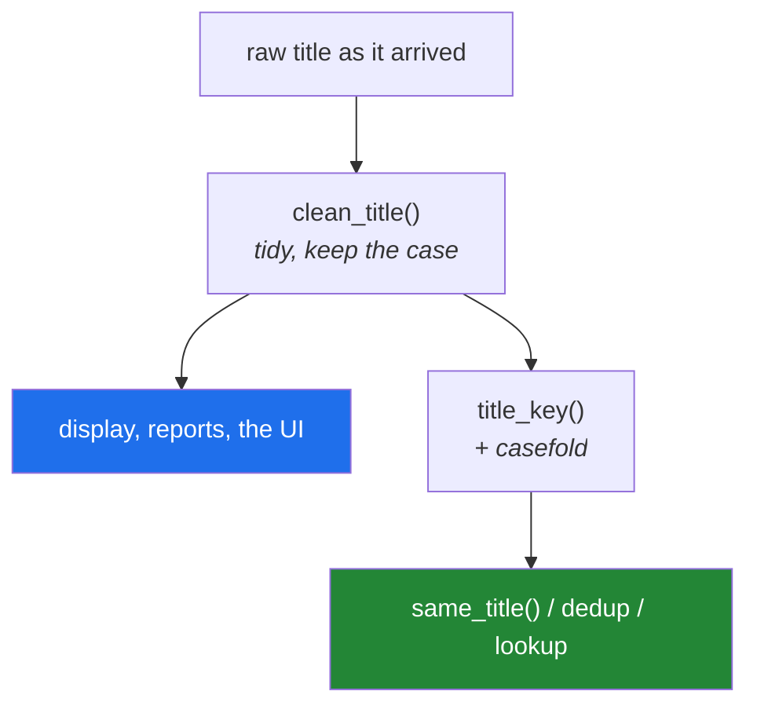

# 3.2 — Designing `clean_title()` — the signature before the body

## One-line answer

The plan names a tested `clean_title()` as this day's deliverable, and every interesting decision in
it is made **before the first line of the body** — what it takes, what it gives back, which
behaviours are options, and what it refuses to do at all.

---

## The story

Somebody in the office volunteers to tidy the guest list.

They come back an hour later, pleased, with a much shorter list. Then the questions start.

*"Did you take out the duplicates?"* Yes. *"How did you decide two lines were the same person?"*
Well — ignoring capitals, and extra spaces. *"So Anna Smith and A. Smith are two people?"* Yes.
*"And ANNA SMITH is the same as Anna Smith?"* Yes. *"Did you keep the first one or the last one?"*
…

Every one of those questions has a reasonable answer, and the person who did the work had a
reasonable answer to each in the moment. The problem is that nobody else knows what they were, the
answers are not written anywhere, and the old list has been thrown away. The tidying was fine. The
**decisions** are gone, and the decisions were the valuable part.

The fix is not to tidy more carefully. It is to write the rules down first, in an order, so that the
question *"why is A. Smith still here?"* has an answer that is not somebody's memory of an hour on
Tuesday.

A function signature is where those rules get written down.

---

## The idea in plain language

### Design the interface before the implementation

There are four questions to answer before writing a body, and they are the same four every time:

1. **What is the subject?** The one thing this function is about. It goes first, positionally.
2. **What are the options?** Things a caller might reasonably want different. They go after a bare
   `*`, so they must be named ([1.5](../01-the-signature/1.5-keyword-only-and-positional-only.md)).
3. **What comes back?** One value, of one type, always — not "a string, or `None` if it was empty,
   or a list if you passed a list".
4. **What does it refuse to do?** The behaviours you deliberately leave out, so that the function
   stays one job.

### Applying them to `clean_title`

**The subject** is one title, as text. Not a list, not a record, not a file. A function that takes
one thing and a separate one-line function that maps it over a list
([3.1](3.1-from-notebook-to-module.md)) is easier to test than one function with a mode switch.

**The options.** Day 7's normaliser
([Day 7, 4.1](../../../day-07-strings/parts/04-normalising/4.1-the-title-normaliser.md)) listed
several steps, and they are not all equally safe. Collapsing runs of whitespace is something nobody
will ever object to. Stripping a trailing full stop is *almost* always right. Stripping a year in
brackets throws away information that distinguishes two real conference versions of one paper. The
first two can be defaults; the third has to be a decision the caller makes deliberately.

**What comes back** is always a string, including for input that is nothing but whitespace, where the
answer is the empty string. Returning `None` in that case would be the
[1.1](../01-the-signature/1.1-a-function-is-a-promise.md) bug by design — a value that travels
silently and fails somewhere else.

**What it refuses.** `clean_title` does not lowercase, does not remove duplicates, does not decide
whether two titles are the same, and does not touch Unicode normalisation. Each of those is a
separate decision with its own consequences, and each gets its own function.

### Why "does not lowercase" is the interesting one

Because it is the one people argue about, and the argument is the point. Lowercasing is right for
*comparison* and wrong for *display*. A function that does both has silently decided the caller was
comparing, and the day somebody prints the result, every title in the report is lowercase.

So `clean_title` tidies, and a separate `title_key` lowercases for comparison. Two functions, two
names, and a caller who has to say which one they meant.

---

## Why Setu needs it

- **The plan names this function.** `PY-10`'s stated example is *your first `src/setu/` module — a
  tested `clean_title()`*, and Phase 1's deliverable is ten tested functions in
  `src/setu/textutils.py`.
- **Day 8's deduplication is only as good as this key.**
  [Day 8, 3.2](../../../day-08-containers/parts/03-dedup/3.2-order-preserving-dedup.md) removes
  duplicates by exact match, so every difference `clean_title` fails to remove is a duplicate that
  survives, and every difference it removes too aggressively is two records wrongly merged.
- **Day 164's chunker and Day 162's retriever** both compare text for a living. The habit of writing
  down *which differences are being thrown away* starts here and never stops being the question.
- **Day 91 onwards, every feature transformation is this shape**: a decision about what to discard,
  applied identically to training and to production data — and a mismatch between the two is
  leakage's quieter cousin (Principle 8).

---

## The mechanism

The signature, decided first, with nothing in the body yet:

```python
"""The design, before any implementation. This block does not do the work."""

from __future__ import annotations


def clean_title(
    raw: str,
    *,
    collapse_spaces: bool = True,
    strip_trailing_dot: bool = True,
    strip_bracketed_year: bool = False,
) -> str:
    """Return `raw` tidied for display or as the input to a comparison key.

    The subject is one title. Use `clean_titles` for a list.

    Args:
        raw: the title as it arrived, including any surrounding whitespace.
        collapse_spaces: replace every run of whitespace, including tabs and newlines,
            with a single space. Safe: no title means anything different because of it.
        strip_trailing_dot: remove ONE trailing full stop. Safe in almost all data, and
            wrong for a title that genuinely ends in an abbreviation.
        strip_bracketed_year: remove a trailing "(2017)". Off by default, because two
            conference versions of one paper differ ONLY by this.

    Returns:
        The tidied title. Always a string; a title of only whitespace returns "".

    Does not lowercase - see `title_key` for the comparison form. Does not change `raw`.
    """
    raise NotImplementedError  # TODO(me): the body is yours (Principle 6)
```

**Line by line:**

- `raw: str` first and positional — the subject. Every call reads `clean_title(title)`, which is a
  sentence.
- `*,` — everything after it must be named ([1.5](../01-the-signature/1.5-keyword-only-and-positional-only.md)).
  **All three options are booleans**, so this is not a preference: `clean_title(t, True, True, False)`
  is unreadable and silently wrong if two of them are swapped.
- `collapse_spaces: bool = True` — on by default because it is the one step with no downside. The
  docstring says *why* it is safe rather than just what it does.
- `strip_trailing_dot: bool = True` — on by default, and the docstring names the case where it is
  wrong. A default with a stated exception is an honest default; a default with no comment is the
  card on the wall nobody read ([1.3](../01-the-signature/1.3-defaults-and-when-they-run.md)).
- `strip_bracketed_year: bool = False` — **off** by default, because it destroys a real distinction.
  The rule worth taking away: *a step that can merge two genuinely different records is never on by
  default.*
- `-> str` — always a string. No `str | None`, so no caller has to check.
- `Always a string; a title of only whitespace returns ""` — the edge case, decided and written down
  before it is met.
- `Does not lowercase` — the refusal, stated in the docstring, with the name of the function that
  does. This is what stops the next person adding a `lowercase=True` option.
- `raise NotImplementedError  # TODO(me)` — the body is the reader's rep (Principle 6). The signature
  and the docstring are the teaching; doing the exercise would remove it.

The companion functions, which exist because `clean_title` refuses to do their jobs:

```python
"""Three small functions instead of one function with three modes."""

from __future__ import annotations


def clean_titles(raws: list[str]) -> list[str]:
    """Return `clean_title` applied to each entry, same order, same length."""
    raise NotImplementedError  # TODO(me): one comprehension, and no filter


def title_key(raw: str) -> str:
    """Return a comparison key for `raw`: cleaned, then case-folded.

    Two titles that a human would call the same should produce the same key. Use this
    for deduplication and lookup; never for display.
    """
    raise NotImplementedError  # TODO(me): two calls, one line


def same_title(left: str, right: str) -> bool:
    """True when two titles are the same paper by this module's definition."""
    raise NotImplementedError  # TODO(me): one line, and it must use title_key
```

**Line by line:**

- `clean_titles` returns `list[str]` and the docstring promises *same order, same length*. That is a
  contract a test can check, and it is the promise that a stray filter would break
  ([Day 9, 1.3](../../../day-09-comprehensions/parts/01-list-comprehensions/1.3-the-two-ifs.md)).
- `and no filter` in the TODO — said out loud because the temptation to drop empty results is real
  and would silently change the length.
- `title_key` is where case folding lives. `casefold()` rather than `lower()`, for the reason in
  [Day 7, 2.1](../../../day-07-strings/parts/02-methods/2.1-normalising-strip-and-case.md): only
  `casefold` gets `"STRASSE"` and `"Straße"` to the same answer.
- `never for display` — the sentence that stops somebody using this in a report.
- `same_title` exists so that the definition of "the same" lives in **one** place. Without it, three
  callers will each write `title_key(a) == title_key(b)` and the fourth will write
  `clean_title(a).lower() == clean_title(b).lower()`, and now there are two definitions.
- `it must use title_key` — a constraint rather than a hint. It is the whole reason the function
  exists.



---

## When it breaks

**The option that was passed positionally:**

```text
>>> clean_title("A Study.", True, False)
Traceback (most recent call last):
  File "<stdin>", line 1, in <module>
TypeError: clean_title() takes 1 positional argument but 3 were given
```

**What it means.** The bare `*` did its job. Note the count — **one** positional argument, not four —
which is [1.5](../01-the-signature/1.5-keyword-only-and-positional-only.md)'s message and the fastest
way to recognise a keyword-only signature. Without the `*` this call would have run and silently
turned off the trailing-dot removal.

**The list passed where a title was expected:**

```text
>>> clean_title(["A Study.", "Another."])
Traceback (most recent call last):
  File "<stdin>", line 1, in <module>
AttributeError: 'list' object has no attribute 'split'
```

**What it means.** The annotation said `str` and Python does not check annotations
([1.6](../01-the-signature/1.6-the-signature-is-the-contract.md)), so the error comes from inside the
body and names a method rather than the parameter. This is precisely the call a type checker catches
before it runs, and precisely why `clean_titles` exists as a separate name rather than as a mode of
`clean_title`.

**The trailing dot that should have stayed:**

```text
>>> clean_title("A Study of Cell Growth in E. coli.")
'A Study of Cell Growth in E. coli'
>>> clean_title("Sequencing Methods, Vol. II.")
'Sequencing Methods, Vol. II'
```

**What it means.** No error, and the second one is arguably wrong — `Vol. II.` may end with an
abbreviation's full stop rather than a sentence's. This is the case the docstring names, and it is
here to make a point: **a default that is right 99% of the time is still a default that is wrong 1%
of the time**, and the only defence is that it is written down where the next person will read it.
The alternative — refusing to strip anything — would be worse, and pretending there is a rule with no
exceptions would be worst.

---

## In production

**The professional habit is to write the signature and the docstring before the body, and to treat
disagreement about them as the actual design review.** Once a body exists, discussion drifts towards
how it is written; while only a signature exists, discussion stays on what it should do. Teams that
review interfaces separately from implementations ship fewer functions that do two jobs.

**Every normalisation function is a list of things you have decided to throw away, and it belongs in
the docstring.** This matters far beyond titles. On Day 76 a feature transformation is the same
object: a decision about which differences do not count, applied identically to training and serving
data. When those two drift apart, the model degrades in a way that no test catches, because both
sides individually are correct. The habit of writing down *what is discarded and why* is the thing
that transfers.

**A boolean option is a fine answer for two or three, and the wrong answer for six.** Once a function
has half a dozen flags, the real design is a small configuration object — a frozen dataclass, from
Day 19 (`PY-23`) — passed as one parameter. The signal to watch for is a call site with four keyword
arguments in it, or two flags that are never used independently, which means they were one decision
all along.

**What changes at scale.** `clean_title` will run over millions of rows. Two things then matter that
do not matter now: it should not compile a regular expression per call (module-level constant, or use
methods, which is [Day 7, 4.3](../../../day-07-strings/parts/04-normalising/4.3-methods-before-regex.md)'s
argument), and it should not build more intermediate strings than it needs, because each one is a new
object ([Day 4, 1.4](../../../day-04-objects/parts/01-objects/1.4-strings-are-immutable.md)). Neither
justifies making the code unclear today; both justify knowing where to look when a profiler names
this function.

**The review comment a senior engineer leaves.** On a `clean_title` that also lowercases:
*"This lowercases, so it cannot be used for anything a person will read, and the name does not say
so. Split it: `clean_title` for display, `title_key` for comparison. Right now the first person to
put this in a report will ship a page of lowercase titles and it will be a UI bug that traces back to
a text utility."*

**The interview question.** *"How would you decide what goes in the signature of a text-cleaning
function?"* The answer that lands is not a list of steps. It is: the subject goes positionally,
every option that a caller could reasonably want different goes keyword-only, and **any step that can
merge two genuinely different records is off by default** — because a false merge is silent and
unrecoverable while a missed merge is visible and fixable. Then add the split: cleaning for display
and keying for comparison are different jobs, and a function that does both has decided for the
caller which one they wanted. If you can name the case where your own default is wrong, you have
actually run this on real data.

---

## Check yourself

```bash
uv run python -c "
import inspect
from setu.textutils import clean_title
print(inspect.signature(clean_title))
print(clean_title.__doc__.strip().splitlines()[0])
" 2>&1 | tail -3
```

Once the build brief is done, this prints your signature and the first line of your docstring. Read
them as a stranger would: can you tell what to pass and what comes back, without opening the file?

**Answer out loud, without scrolling up:**

> Give the four questions to answer before writing a body. Then say which of `clean_title`'s three
> options is off by default and why — and state the general rule that decision is an instance of.

---

**Next:** [3.3 — Pure functions and the seam a test needs](3.3-pure-functions-and-the-seam.md)
