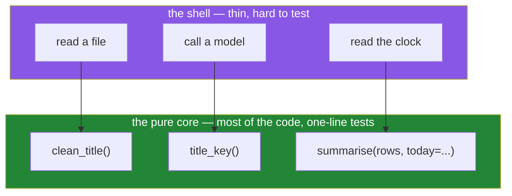

# 3.3 — Pure functions and the seam a test needs

## One-line answer

A function whose answer depends only on its arguments, and which changes nothing outside itself, can
be tested with one line — and the ones that read a clock, a file or the environment can be made just
as testable by taking that thing as a parameter instead of reaching for it.

---

## The story

Two versions of the same recipe, both for the same dish.

The first says: **"add salt to taste."**

The second says: **"add 4 grams of salt."**

Both work. Cooks with experience prefer the first, because it is honest about what actually matters,
and it will produce a better dish in the hands of somebody paying attention.

But now imagine the dish comes out too salty and somebody wants to find out why. With the second
recipe, you weigh the salt and the question is settled in seconds — it was 4 grams, or it was not.
With the first, there is nothing to check. "To taste" depends on whose tongue, on the day, on what
they ate for lunch, and on how much salt was already in the stock. The recipe is not wrong. It is
simply **not the kind of thing a disagreement can be settled against**.

There is a third version, and it is the one a test kitchen writes: **"add salt to taste — we used 4
grams."** Now the judgement is still there for the cook who wants it, and there is a number underneath
for the day somebody needs to reproduce exactly what happened.

That third version is what this document is about. Most useful programs have to read a clock, open a
file or call a service. The trick is not to pretend otherwise. It is to make the number visible so
that somebody can pin it down when they need to.

---

## The idea in plain language

### What "pure" means, exactly

A function is **pure** when both of these are true:

1. **Same inputs, same output, every time.** It does not consult anything that can change — no clock,
   no random number, no file, no environment variable, no module-level counter, no network.
2. **It changes nothing outside itself.** No writing to a global
   ([2.3](../02-scope/2.3-global-and-nonlocal.md)), no mutating a list the caller handed it
   ([Day 4, 1.2](../../../day-04-objects/parts/01-objects/1.2-names-are-labels.md)), no writing a
   file, no printing.

`clean_title` from [3.2](3.2-designing-clean-title.md) is pure. Give it the same string twice and you
get the same answer twice, on any machine, in any order, in any year.

### Why pure functions are cheap to test

A test for a pure function is one line: give it something, assert what comes back. No setup, no
fixture, no cleanup, no ordering between tests, no flakiness. It can run in parallel with a thousand
others and cannot interfere with any of them.

Compare that with a function that reads today's date. To test it you have to either accept whatever
today happens to be — so the test asserts something different every day and passes for the wrong
reason — or reach into the module and replace the clock, which is a technique
([Day 2, 3.2](../../../day-02-quality-gate/parts/03-pytest/3.2-fixtures-and-tmp-path.md) shows the
fixture version) but is a lot of machinery for a function that could just have been handed the date.

### The seam

A **seam** is a place where you can hand a function a different version of something it depends on,
without changing the function.

The whole technique is one move: **stop reaching, start receiving.**

- A function that calls `datetime.now()` reaches. A function that takes `now` as a parameter
  receives.
- A function that calls `open(path)` reaches. A function that takes the text, or takes a reader,
  receives.
- A function that reads `os.environ["MODEL"]` reaches. A function that takes `model` receives.

In each case the caller can still do the reaching — `report(rows, now=datetime.now())` is one line —
and now the test can hand over a fixed date instead.

### The shape this pushes you towards

Most programs end up in three layers once you take this seriously:

- **A pure core.** The decisions, the transformations, the arithmetic. Easy to test, boring to run.
- **A thin shell.** The clock, the files, the network calls, the printing. Hard to test, and there is
  very little of it.
- **One place that wires them together.** Usually a `main` or a single entry point.

The goal is not to eliminate the shell. It is to keep it thin enough that almost everything worth
testing is in the core.

---

## Why Setu needs it

- **Principle 7 asks for tests that can go red.** A test that depends on today's date, or on which
  other test ran first, goes red for reasons that have nothing to do with the code — and a suite that
  goes red for the wrong reasons gets ignored, which is worse than having no suite.
- **Day 3's model calls are the shell.** Every free-tier call is a network call with a rate limit
  (Principle 5), so the parts of the pipeline that can be tested without one need to be separable
  from the parts that cannot. `./m check` runs `-m "not live"` for exactly this reason
  ([Day 2, 3.3](../../../day-02-quality-gate/parts/03-pytest/3.3-markers-and-exit-code-five.md)).
- **Principle 4 says pin the randomness.** `random_state=` is a seam: it turns a function that
  consults a source of randomness into one that receives its starting point, which is the only reason
  a model run is reproducible at all.
- **Day 192's graph state and Day 197's time travel** depend on this completely. You can only resume
  a run from a checkpoint, or replay it with one answer changed, if the steps between checkpoints are
  functions of their input rather than of whatever the world looked like at the time.

---

## The mechanism

The same function, reaching and then receiving:

```python
"""One function that cannot be tested, and one that can."""

from __future__ import annotations

from datetime import date


def summarise_reaching(rows: list[dict]) -> str:
    """Impure: consults the clock. Two runs on different days differ."""
    today = date.today()
    recent = [r for r in rows if r["year"] == today.year]
    return f"{len(recent)} of {len(rows)} rows are from {today.year}"


def summarise_receiving(rows: list[dict], *, today: date) -> str:
    """Pure: the date arrives through the door, so the answer is fixed by the arguments."""
    recent = [r for r in rows if r["year"] == today.year]
    return f"{len(recent)} of {len(rows)} rows are from {today.year}"


data = [{"year": 2024}, {"year": 2026}, {"year": 2026}]

print(summarise_reaching(data))
print(summarise_receiving(data, today=date(2026, 1, 1)))
print(summarise_receiving(data, today=date(2024, 1, 1)))
```

**Line by line:**

- `today = date.today()` — the reach. This one line is what makes the function impossible to pin
  down: nothing the caller passes can change what it returns next January.
- `*, today: date` — the seam, and it is keyword-only
  ([1.5](../01-the-signature/1.5-keyword-only-and-positional-only.md)) because it is a dependency
  rather than the subject of the call. A reader seeing `today=` at the call site knows immediately
  that this function's answer depends on a date.
- `summarise_receiving(data, today=date(2026, 1, 1))` and the line below it — **the same function,
  two different fixed dates, two answers that will still be those answers in five years.** That is
  the whole benefit, and it is not a testing trick; it is the function becoming honest about what it
  depends on.
- Note that no default was given for `today`. A default of `date.today()` would be evaluated once at
  import ([1.3](../01-the-signature/1.3-defaults-and-when-they-run.md)) and freeze the date the
  module was loaded, which is worse than reaching. If a default is wanted, it is `today: date | None
  = None` with `today = today or date.today()` inside.

The test each version needs:

```python
"""Two tests. One of them is a real test."""

from datetime import date

from setu.textutils import summarise_receiving


def test_summarise_counts_the_named_year() -> None:
    rows = [{"year": 2024}, {"year": 2026}, {"year": 2026}]
    assert summarise_receiving(rows, today=date(2026, 1, 1)) == "2 of 3 rows are from 2026"


def test_summarise_counts_zero_for_a_year_with_no_rows() -> None:
    rows = [{"year": 2024}]
    assert summarise_receiving(rows, today=date(2030, 1, 1)) == "0 of 1 rows are from 2030"
```

**Line by line:**

- `rows = [...]` — three made-up records, written out in the test. No file, no fixture, no database.
  Anybody reading the test can see the whole input, which is the property that makes a failure
  diagnosable.
- `today=date(2026, 1, 1)` — the fixed date. **This assertion is true today and will be true in
  2031**, because nothing in it depends on when it runs. The version that reached for the clock could
  not have this test at all: `== "2 of 3 rows are from 2026"` would start failing on 1 January.
- The second test picks a year with no matching rows, which is the boundary the first test does not
  cover. Two one-line tests, no shared state, safe to run in any order or in parallel
  ([Day 2, 3.2](../../../day-02-quality-gate/parts/03-pytest/3.2-fixtures-and-tmp-path.md)).
- Both tests can go red for a real reason — change the filter to `>=` and the first one fails — which
  is Principle 7's actual requirement.

The seam for a file, which is the same move:

```python
"""Reading is a shell concern. Deciding is a core concern. Keep them apart."""

from __future__ import annotations

from pathlib import Path


def count_titles(text: str) -> int:
    """Pure: how many non-empty lines this text has."""
    return sum(1 for line in text.splitlines() if line.strip())


def count_titles_in_file(path: Path) -> int:
    """The thin shell: read the file, then hand the text to the pure function."""
    return count_titles(path.read_text(encoding="utf-8"))
```

**Line by line:**

- `count_titles(text: str)` — the core. It takes text and returns a number, so its test needs no
  file at all: `assert count_titles("a\\n\\nb\\n") == 2`.
- `sum(1 for line in ...)` — a generator expression, so nothing is held
  ([Day 9, 3.3](../../../day-09-comprehensions/parts/03-when-not-to/3.3-the-list-you-never-needed.md)).
  On a large file this matters, and it is free to write it this way.
- `if line.strip()` — the filter, which is where the definition of "a title" actually lives. Having
  it in a pure function means a disagreement about that definition can be settled by a test rather
  than by a file.
- `count_titles_in_file(path: Path)` — **two lines, one of which is the reach.** This is the shell,
  and it is deliberately trivial: there is almost nothing here that could be wrong, so it needs
  almost no testing.
- `encoding="utf-8"` typed out rather than left to the platform default — the bug from
  [Day 7, 1.1](../../../day-07-strings/parts/01-text/1.1-a-string-is-code-points.md), and an instance
  of Principle 4's rule about never accepting a default you did not choose.



---

## When it breaks

**The test that passes for the wrong reason, then stops:**

```text
$ uv run python -m pytest tests/test_summary.py -v
tests/test_summary.py::test_counts_this_year FAILED

E       AssertionError: assert '0 of 3 rows are from 2027' == '2 of 3 rows are from 2026'
E         - 2 of 3 rows are from 2026
E         + 0 of 3 rows are from 2027
```

**What it means.** Nobody changed the code. It is 1 January, and the function reads the clock. The
test was never testing the counting logic; it was testing the counting logic **and** what year it
happened to be, and one of those two changed. A test that can fail without a code change is not a
test, and it is worse than no test, because it trains the team to ignore red.

**The test that only fails when the whole suite runs:**

```text
$ uv run python -m pytest tests/test_textutils.py::test_counts -v
tests/test_textutils.py::test_counts PASSED

$ uv run python -m pytest -v
tests/test_pipeline.py::test_run PASSED
tests/test_textutils.py::test_counts FAILED
E       assert 7 == 0
```

**What it means.** Some function is writing to a module-level value
([2.3](../02-scope/2.3-global-and-nonlocal.md)) and another test already ran it. The failure cannot
be reproduced by running the failing test, which is the most expensive kind of failure there is. The
fix is never in the test; it is in the function that reached outside itself.

**The mutation nobody asked for:**

```text
>>> rows = [{"title": "  A Study.  "}]
>>> cleaned = clean_all(rows)
>>> rows
[{'title': 'A Study'}]
```

**What it means.** No error, and the caller's own data has been changed. `clean_all` mutated the
dictionaries it was given rather than building new ones
([Day 4, 2.4](../../../day-04-objects/parts/02-containers/2.4-shallow-and-deep-copy.md)), which
breaks the second half of purity even though the first half — same input, same output — still holds.
A function that does this must say so in its name or its docstring, and the safer default is to build
and return.

---

## In production

**The professional shape is a thick pure core and a thin impure shell, and the giveaway is the test
suite.** A codebase where most tests need a fixture, a temporary directory or a mocked clock has its
decisions tangled up in its input and output. One where most tests are two lines of literals has them
separated. Nobody sets out to build the first kind; it happens one convenient `datetime.now()` at a
time.

**Injecting a dependency is not the same as mocking it, and the difference is worth being firm
about.** A parameter is a seam you designed. A mock that reaches into a module and replaces an
attribute is a seam you did not design, imposed from outside, which breaks the moment the function
moves or the import style changes. Mocks are occasionally necessary — a third-party client with no
seam of its own — and they are a sign you are working around a design rather than using one.

**Purity is also what makes a thing safe to retry, cache and run in parallel.** Day 6's capped retry
([Day 6, 3.2](../../../day-06-loops/parts/03-capped-retry/3.2-the-capped-retry-from-scratch.md)) is
only correct if calling the wrapped thing twice is acceptable, which is a question about purity.
`functools.cache` is only correct on a pure function, and putting it on an impure one produces stale
answers that look right. Day 216's five-agent workflow runs steps concurrently, which is only safe
because the steps do not write to shared state.

**What changes at scale.** The clock and the environment are the two dependencies that break
*silently* in a different environment rather than loudly. A container running in UTC and a laptop
running in local time will disagree about which day a row belongs to, and both are "working". Passing
the date in means the disagreement becomes a visible argument at the call site, which is where it can
be resolved.

**The review comment a senior engineer leaves.** On a function that calls `datetime.now()` in its
middle: *"This reads the clock halfway through, so the test has to freeze time and the function
cannot be replayed against yesterday's data. Take `now` as a keyword argument and pass
`datetime.now()` at the call site. Same behaviour, and I can test the interesting part with two
literals."*

**The interview question.** *"What makes a function easy to test?"* The answer that lands does not
say "small". It says: its answer depends only on its arguments and it changes nothing outside itself,
so the test is one line of literals with no setup, no teardown and no ordering — and the way to get
there for a function that genuinely needs a clock or a file is to take that thing as a parameter
rather than reaching for it, which the caller supplies in one line. If you can add that this is also
what makes a function safe to cache, retry and run in parallel, and that a test which fails only when
the whole suite runs is a global-state problem in the *function* rather than in the test, you are
describing a suite you have had to rescue.

---

## Check yourself

```bash
uv run python -c "
from datetime import date

def summarise(rows, *, today):
    recent = [r for r in rows if r['year'] == today.year]
    return f'{len(recent)} of {len(rows)} rows are from {today.year}'

data = [{'year': 2024}, {'year': 2026}, {'year': 2026}]
print(summarise(data, today=date(2026, 1, 1)))
print(summarise(data, today=date(2024, 1, 1)))
print('same call twice:', summarise(data, today=date(2026, 1, 1)) == summarise(data, today=date(2026, 1, 1)))
"
```

Both printed answers will still be those answers in five years. Say which single line you would have
to add to make that stop being true.

**Answer out loud, without scrolling up:**

> Give the two conditions for a function to be pure. Then describe the one move that makes an impure
> function testable, and say why passing the date in is better than a default of `date.today()`.

---

**Next:** that is the last document of Day 10. Back to the hub —
[`../../LESSON.md`](../../LESSON.md) §4 — to build `src/setu/textutils.py` and the tests that hold it
to every promise in [3.2](3.2-designing-clean-title.md).
