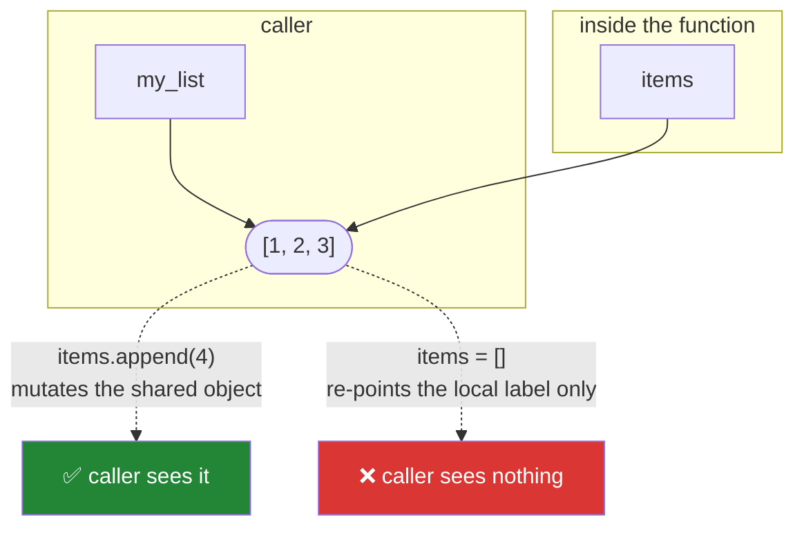

# Day 10 — Functions, parameters, and scope

**Phase 1 · Module 1** · ID: **PY-10** (function basics and parameter passing)

> **Yesterday:** comprehensions.
> **Today:** the unit of reuse. Everything in `src/setu/` for the next 230 days is a function, and
> today decides what a good one looks like here.
> **Tomorrow:** iterators, generators, `lambda` and `map` — and Phase 1 closes.

```bash
./m start 10 && ./m scaffold 10
```

**Time:** 90 minutes. **Request budget:** 0 model calls.

---

## §1 The story

You have been writing functions since Day 1. Today is about what separates one that survives 230 days
from one you rewrite in a fortnight.

**A good function in this project has one job, takes what it needs as parameters, returns a value,
and touches nothing else.** That last clause is the one that matters. A function that reads a global,
writes to a file, or mutates its argument is a function you cannot test without a whole environment
around it — and a function you cannot test is a function you will be afraid to change on Day 200.

The technical content today is **how arguments actually get passed**, and Python's model gets
described wrongly constantly. It is not "by value" and it is not "by reference". It is:

> **The parameter name inside the function becomes a new label on the caller's object.**

That is Day 4 again, and every consequence follows from it:

- Rebinding the parameter (`items = []`) only re-points the local label. The caller sees nothing.
- Mutating the object (`items.append(1)`) changes the shared object. The caller sees everything.



Which is why the house rule from Day 4 is now a *signature* rule: **say in the docstring whether you
mutate or return new, and never do both.**

---

## §2 Setup — run this

```bash
mkdir -p days/day-10/lab
touch days/day-10/lab/functions.py
touch src/setu/papers.py
touch tests/test_papers.py
```

No new packages.

---

## §3 PY-10 — parameters, in order

`days/day-10/lab/functions.py`:

```python
"""PY-10: how arguments are passed, and every parameter kind, in signature order."""

from __future__ import annotations


def rebind_vs_mutate() -> None:
    def rebinds(items: list[int]) -> None:
        items = [99]          # new local label; caller unaffected

    def mutates(items: list[int]) -> None:
        items.append(99)      # same object; caller affected

    a = [1, 2]
    rebinds(a)
    print(f"\nafter rebinds:  {a}   <- unchanged")
    mutates(a)
    print(f"after mutates:  {a}   <- changed")


def parameter_kinds() -> None:
    def signature(pos, /, normal, *args, kw_only, default="d", **kwargs):
        return {
            "pos": pos,
            "normal": normal,
            "args": args,
            "kw_only": kw_only,
            "default": default,
            "kwargs": kwargs,
        }

    print(f"\n{signature(1, 2, 3, 4, kw_only=5, extra=6)=}")

    try:
        signature(pos=1, normal=2, kw_only=3)
    except TypeError as exc:
        print(f"  positional-only: {exc}")


def scope() -> None:
    total = 0

    def broken():
        # total += 1   # UnboundLocalError: assignment makes `total` local
        return total    # reading the enclosing name is fine

    def fixed():
        nonlocal total
        total += 1

    print(f"\n{broken()=}")
    fixed()
    print(f"after fixed(): {total=}")


def default_evaluated_once() -> None:
    import time

    def stamped(when: float = time.time()) -> float:
        return when

    first = stamped()
    time.sleep(0.01)
    print(f"\n{first == stamped()=}   <- True: the default was frozen at def time")


def early_return() -> None:
    def deep(value: str | None) -> str:
        if value is not None:
            if value.strip():
                return value.strip().lower()
            else:
                return "(blank)"
        else:
            return "(none)"

    def flat(value: str | None) -> str:
        if value is None:
            return "(none)"
        if not value.strip():
            return "(blank)"
        return value.strip().lower()

    print(f"\n{[deep(v) for v in (None, ' ', ' Hi ')]=}")
    print(f"{[flat(v) for v in (None, ' ', ' Hi ')]=}   <- same result, guards first")


if __name__ == "__main__":
    rebind_vs_mutate()
    parameter_kinds()
    scope()
    default_evaluated_once()
    early_return()
```

**Line by line:**

- `items = [99]` inside `rebinds` — creates a new list and points the **local** name at it. The
  caller's list is untouched. This is why "Python is pass by reference" is wrong.
- `items.append(99)` inside `mutates` — no rebinding, so the shared object changes. This is why
  "Python is pass by value" is also wrong.
- `def signature(pos, /, normal, *args, kw_only, default="d", **kwargs)` — every parameter kind, in
  the only legal order:
  - `pos, /` — everything **before the slash is positional-only**. Callers cannot use `pos=1`. Useful
    when the parameter name is an implementation detail you may want to rename.
  - `normal` — positional or keyword.
  - `*args` — collects extra positionals into a tuple.
  - `kw_only` — after `*args`, parameters are **keyword-only**. This is the same `*` trick you used
    on Day 6 for `with_retry`.
  - `default="d"` — keyword-only with a default.
  - `**kwargs` — collects extra keywords into a dict.
- `nonlocal total` — without it, `total += 1` makes `total` a **local** name, and reading it before
  assignment raises `UnboundLocalError`. Note that *reading* an enclosing name needs no declaration;
  only assignment does. (`global` is the module-level equivalent, and this project does not use it —
  if you need `global`, you needed a parameter.)
- `def stamped(when: float = time.time())` — the default is evaluated **once, at definition time**, so
  every call returns the same frozen timestamp. This is Day 4's mutable-default bug in its immutable
  disguise: the mechanism is identical, only the symptom differs.
- `deep` versus `flat` — identical behaviour. `flat` handles each failure case and returns
  immediately, so the happy path is never indented. **Every function in `src/setu/` should look like
  `flat`.** Guards first, work last.

---

## §4 Build brief

`src/setu/papers.py` — the record type the whole project passes around. The Reader agent on Day 229
produces these.

```python
"""The Paper record and helpers. Pure functions over a plain dict for now;
Day 12 turns this into a class and Day 19 into a Pydantic model."""

from __future__ import annotations

from collections.abc import Iterable
from typing import Any

REQUIRED = ("id", "title", "year")


class InvalidPaper(ValueError):
    """Raised when a record is missing required fields or has the wrong types."""


def make_paper(
    id: str,
    title: str,
    year: int,
    /,
    *,
    authors: list[str] | None = None,
    venue: str | None = None,
) -> dict[str, Any]:
    """TODO(me): build a validated paper dict.

    - strip and normalise the title (reuse textutils - do not reimplement)
    - raise InvalidPaper if id or title is blank, or year is outside 1900..2100
    - `authors` defaults to a NEW empty list on every call (Day 4)
    - the returned dict must NOT share the caller's `authors` list
    """
    raise NotImplementedError


def summarise(paper: dict[str, Any], width: int = 60) -> str:
    """TODO(me): 'Title (year) - First Author' truncated to `width`.

    Reuse textutils.truncate. Handle an empty author list.
    Must NOT modify `paper`.
    """
    raise NotImplementedError


def newest(papers: Iterable[dict[str, Any]], n: int = 3) -> list[dict[str, Any]]:
    """TODO(me): the n most recent by year, ties broken by title A-Z. Do not mutate the input."""
    raise NotImplementedError
```

- `id, title, year, /` — positional-only. `id` shadows a builtin, and positional-only means callers
  never have to type `id=`, so the shadowing stays an internal detail.
- `*` before `authors` — keyword-only. `make_paper("x", "T", 2017, ["A"])` is now a `TypeError`
  instead of silently working, which is what you want when a signature grows.
- "must not share the caller's `authors` list" — Day 4's lesson as an explicit contract. §5 tests it.

---

## §5 The eval that must be able to fail

`tests/test_papers.py`:

```python
import pytest

from setu.papers import InvalidPaper, make_paper, newest, summarise


def test_make_paper_normalises_the_title():
    paper = make_paper("p1", "  Attention   Is  All ", 2017)
    assert paper["title"] == "Attention Is All"


@pytest.mark.parametrize(
    ("pid", "title", "year"),
    [("", "T", 2017), ("p1", "   ", 2017), ("p1", "T", 1800), ("p1", "T", 2200)],
)
def test_make_paper_rejects_bad_input(pid, title, year):
    with pytest.raises(InvalidPaper):
        make_paper(pid, title, year)


def test_authors_default_is_not_shared_between_calls():
    a = make_paper("p1", "A", 2017)
    b = make_paper("p2", "B", 2018)
    a["authors"].append("Vaswani")
    assert b["authors"] == [], "the default list is shared - see Day 4"


def test_authors_are_copied_from_the_caller():
    mine = ["Vaswani"]
    paper = make_paper("p1", "A", 2017, authors=mine)
    mine.append("Someone Else")
    assert paper["authors"] == ["Vaswani"], "the paper aliased the caller's list"


def test_extra_positional_args_are_rejected():
    with pytest.raises(TypeError):
        make_paper("p1", "A", 2017, ["Vaswani"])


def test_summarise_does_not_modify_the_paper():
    paper = make_paper("p1", "A very long title indeed", 2017, authors=["Vaswani"])
    before = dict(paper)
    summarise(paper, width=20)
    assert paper == before


def test_summarise_respects_width():
    paper = make_paper("p1", "A very long title indeed", 2017, authors=["Vaswani"])
    assert len(summarise(paper, width=20)) <= 20


def test_newest_breaks_ties_alphabetically():
    papers = [
        make_paper("1", "Zebra", 2018),
        make_paper("2", "Alpha", 2018),
        make_paper("3", "Old", 2001),
    ]
    assert [p["title"] for p in newest(papers, n=2)] == ["Alpha", "Zebra"]


def test_newest_does_not_mutate_the_input():
    papers = [make_paper("1", "B", 2018), make_paper("2", "A", 2019)]
    order = [p["id"] for p in papers]
    newest(papers, n=1)
    assert [p["id"] for p in papers] == order, "did you call .sort() on the caller's list?"
```

**Line by line:**

- `test_authors_default_is_not_shared_between_calls` — the mutable-default bug, caught at the library
  level. A `authors: list[str] = []` signature passes every other test here and fails this one.
- `test_authors_are_copied_from_the_caller` — the *other* half. Even with `= None`, storing the
  caller's list directly aliases it, so a later `mine.append(...)` mutates your record from a
  distance. Both tests are needed; each catches a different mistake.
- `test_extra_positional_args_are_rejected` — asserts the keyword-only `*` is really there. Delete the
  `*` and this goes red.
- `test_newest_does_not_mutate_the_input` — Day 8's `sorted` vs `.sort()` distinction, with a failure
  message that names the likely cause.
- `test_newest_breaks_ties_alphabetically` — deterministic ordering. Two 2018 papers must come back in
  a defined order, or your Day-229 output changes between runs for no reason. Deterministic beats
  clever, always.

```bash
uv run python -m pytest tests/test_papers.py -v
```

---

## §6 Request budget

| Resource | Spent today |
|---|---|
| LLM calls | **0** |

---

## §7 Traps

- **`def f(x, acc=[])`.** Evaluated once at definition. Use `= None`.
- **Any mutable or *computed* default** — `time.time()`, `datetime.now()`, `{}`. Same mechanism.
- **Storing a caller's list without copying it.** You have aliased their object.
- **Mutating a parameter and also returning it.** Callers cannot tell which contract they got. Pick one.
- **`global`.** If you need it, you needed a parameter.
- **`UnboundLocalError` from `x += 1`** on an enclosing name. Assignment makes a name local.
- **A function that reads config or opens a file directly.** Pass it in; now it is testable.
- **Deep nesting instead of early returns.** Guards first.
- **Doing real work at import time.** `src/setu/` modules define names and nothing else.

---

## §8 Verify before you code

Written **2026-08-21**:

- <https://docs.python.org/3/tutorial/controlflow.html#special-parameters> — the `/` and `*` markers.
- <https://docs.python.org/3/faq/programming.html#why-are-default-values-shared-between-objects> —
  the official explanation of the default-argument mechanism.
- <https://docs.python.org/3/reference/executionmodel.html#naming-and-binding> — scope and binding rules.

---

## §9 Say it in an interview

> "Python passes a new name bound to the caller's object — so rebinding a parameter is invisible to
> the caller and mutating it isn't. That means a function's docstring has to say which one it does,
> and never both. My constructors take mutable data as keyword-only with a `None` default and copy it
> in, and I have two separate tests for that: one that two calls don't share a default list, and one
> that mutating the caller's list afterwards doesn't reach into my record. Those catch two different
> bugs that look identical from the outside."

---

## §10 Done when

Tick [`CHECKLIST.md`](CHECKLIST.md), then `./m check && ./m done 10`.
