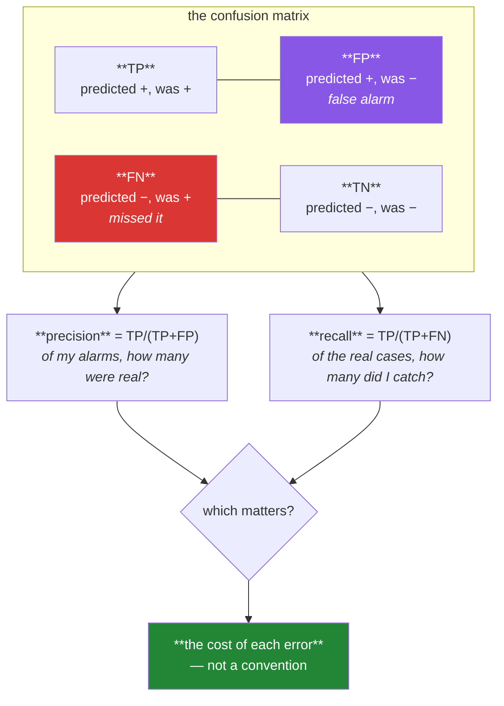

# Day 100 — The confusion matrix

**Phase 12 · Module 12** · ID: **ML-11** (confusion matrix, precision, recall, F1, and metric choice)

> **Yesterday:** logistic regression, and the module that deliberately has no `predict()`.
> **Today:** what to do with those probabilities. Every classification metric is four numbers
> rearranged — and **the right one is decided by what a mistake costs**, not by convention. Day 63's
> disease test returns as a design problem you have to solve.
> **Tomorrow:** ROC, PR curves, calibration, and choosing the threshold.

```bash
./m start 100 && ./m scaffold 100
```

**Time:** 110 minutes. **Request budget:** 0 model calls.

---

## §1 The story

Once you pick a threshold, every prediction lands in one of four boxes:



Every metric is those four numbers rearranged. Accuracy is `(TP+TN)/total`. Precision and recall each
ignore one box entirely — **precision never looks at FN, recall never looks at FP** — which is exactly
why you cannot optimise one without watching the other.

**Accuracy is the default and it is usually wrong.** On data that is 1% positive, predicting "negative"
always scores 99%. Day 78 established this; today it becomes the reason to compute a baseline before
any metric.

**F1 is the default fallback and it is also a decision.** It is the harmonic mean of precision and
recall, which weights them **equally** — and that is a claim that a false alarm costs the same as a
miss. For fraud, or cancer screening, or content moderation, that claim is plainly false.

The honest approach is the one Day 63 already taught: **start from the cost.** If a false negative
costs ten times a false positive, say so, and the metric follows. §3 builds that as an actual
calculation rather than an attitude — and shows that the threshold minimising expected cost is
almost never 0.5.

One more thing, and it is the reason this day sits before Day 101: **precision depends on the base
rate and recall does not.** Deploy a model into a population with fewer positives and its precision
falls even though the model has not changed. That is Day 63's disease test, and it is why a precision
number without a base rate is unquotable.

---

## §2 Setup — run this

```bash
mkdir -p days/day-100/lab
touch days/day-100/lab/confusion.py
```

`src/setu/models.py` grows today. No new packages.

---

## §3 ML-11 — four numbers

`days/day-100/lab/confusion.py`:

```python
"""ML-11: the confusion matrix, and choosing a metric from the cost of an error."""

from __future__ import annotations

import numpy as np
from sklearn.linear_model import LogisticRegression
from sklearn.metrics import confusion_matrix

from setu.arrays import make_rng


def imbalanced(n=8_000, *, rate=0.03, seed=0):
    rng = make_rng(seed)
    x = rng.normal(0, 1, (n, 4))
    z = np.log(rate / (1 - rate)) + x @ np.array([1.4, -0.9, 0.5, 0.0])
    y = (rng.random(n) < 1 / (1 + np.exp(-z))).astype(int)
    return x, y


def the_four_boxes() -> None:
    x, y = imbalanced()
    model = LogisticRegression(max_iter=2_000).fit(x, y)
    predicted = model.predict_proba(x)[:, 1] >= 0.5

    tn, fp, fn, tp = confusion_matrix(y, predicted).ravel()

    print(f"\n  {y.sum()} positives in {len(y)} rows ({y.mean():.1%})")
    print(f"\n                  predicted −   predicted +")
    print(f"    actual −      {tn:>10,}   {fp:>10,}")
    print(f"    actual +      {fn:>10,}   {tp:>10,}")

    print(f"\n    accuracy  = (TP+TN)/n     = {(tp + tn) / len(y):.4f}")
    print(f"    precision = TP/(TP+FP)    = {tp / max(tp + fp, 1):.4f}")
    print(f"    recall    = TP/(TP+FN)    = {tp / max(tp + fn, 1):.4f}")
    print(f"    F1        = harmonic mean = "
          f"{2 * tp / max(2 * tp + fp + fn, 1):.4f}")

    print("\n  ⚠️ Note which box each metric IGNORES:")
    print("     precision never looks at FN. recall never looks at FP.")
    print("     That is why you cannot optimise one without watching the other.")


def accuracy_is_usually_the_wrong_default() -> None:
    x, y = imbalanced()
    model = LogisticRegression(max_iter=2_000).fit(x, y)
    predicted = model.predict(x)

    always_negative = np.zeros(len(y), dtype=int)

    print(f"\n  {'model':<22} {'accuracy':>10} {'recall':>9} {'precision':>11}")
    for label, prediction in (("logistic @ 0.5", predicted),
                              ("always predict −", always_negative)):
        tn, fp, fn, tp = confusion_matrix(y, prediction, labels=[0, 1]).ravel()
        print(f"  {label:<22} {(tp + tn) / len(y):>10.4f} "
              f"{tp / max(tp + fn, 1):>9.4f} {tp / max(tp + fp, 1):>11.4f}")

    print("\n  🚨 The useless model's accuracy is within a point of the real one's.")
    print("     On imbalanced data accuracy measures the base rate, not the model.")
    print("\n  Day 78's rule: compute the majority-class baseline BEFORE any metric,")
    print("  and report every score against it.")


def precision_and_recall_trade_off() -> None:
    x, y = imbalanced()
    model = LogisticRegression(max_iter=2_000).fit(x, y)
    probability = model.predict_proba(x)[:, 1]

    print(f"\n  {'threshold':>10} {'flagged':>9} {'TP':>6} {'FP':>6} {'FN':>6} "
          f"{'precision':>10} {'recall':>8} {'F1':>7}")
    for threshold in (0.90, 0.50, 0.20, 0.10, 0.05, 0.02, 0.01):
        predicted = probability >= threshold
        tn, fp, fn, tp = confusion_matrix(y, predicted, labels=[0, 1]).ravel()
        precision = tp / max(tp + fp, 1)
        recall = tp / max(tp + fn, 1)
        f1 = 2 * precision * recall / max(precision + recall, 1e-12)
        print(f"  {threshold:>10.2f} {int(predicted.sum()):>9,} {tp:>6} {fp:>6} {fn:>6} "
              f"{precision:>10.4f} {recall:>8.4f} {f1:>7.4f}")

    print("\n  One model, one set of probabilities, seven completely different results.")
    print("  Lowering the threshold catches more real cases and raises more false alarms.")
    print("  There is no threshold that improves both — that IS the trade-off.")


def f1_assumes_the_errors_cost_the_same() -> None:
    print(f"\n  F1 = 2·P·R/(P+R) — the HARMONIC mean, which weights P and R equally.")
    print(f"\n  {'precision':>10} {'recall':>8} {'F1':>8} {'arithmetic mean':>17}")
    for precision, recall in ((0.9, 0.9), (0.95, 0.85), (1.0, 0.5), (0.5, 1.0), (0.99, 0.01)):
        f1 = 2 * precision * recall / (precision + recall)
        print(f"  {precision:>10.2f} {recall:>8.2f} {f1:>8.4f} "
              f"{(precision + recall) / 2:>17.4f}")

    print("\n  The harmonic mean punishes IMBALANCE: 0.99/0.01 gives F1 ≈ 0.02, while")
    print("  the arithmetic mean would say 0.50. That is the useful part.")
    print("\n  ⚠️ But equal weighting is a CLAIM: that a false alarm costs the same as a")
    print("     miss. For fraud, cancer screening or moderation, that is plainly false.")
    print("\n  F_beta lets you say otherwise: beta > 1 favours recall, beta < 1 precision.")
    for beta in (0.5, 1.0, 2.0):
        precision, recall = 0.8, 0.4
        score = ((1 + beta**2) * precision * recall) / (beta**2 * precision + recall)
        print(f"    P=0.8 R=0.4, beta={beta}: F = {score:.4f}")


def start_from_the_cost() -> None:
    x, y = imbalanced()
    model = LogisticRegression(max_iter=2_000).fit(x, y)
    probability = model.predict_proba(x)[:, 1]

    cost_fp, cost_fn = 1.0, 20.0      # a miss costs 20x a false alarm

    print(f"\n  suppose a false alarm costs {cost_fp} and a miss costs {cost_fn}:")
    print(f"\n  {'threshold':>10} {'FP':>6} {'FN':>6} {'total cost':>12} {'per row':>9}")
    best_threshold, best_cost = None, float("inf")
    for threshold in (0.90, 0.50, 0.30, 0.20, 0.10, 0.05, 0.02, 0.01, 0.005):
        predicted = probability >= threshold
        tn, fp, fn, tp = confusion_matrix(y, predicted, labels=[0, 1]).ravel()
        cost = fp * cost_fp + fn * cost_fn
        if cost < best_cost:
            best_threshold, best_cost = threshold, cost
        print(f"  {threshold:>10.3f} {fp:>6} {fn:>6} {cost:>12,.0f} {cost / len(y):>9.4f}")

    theoretical = cost_fp / (cost_fp + cost_fn)
    print(f"\n  cheapest threshold tried : {best_threshold}")
    print(f"  theoretical optimum      : cost_fp/(cost_fp+cost_fn) = {theoretical:.4f}")

    print("\n  That formula is the whole answer, and it drops out of expected cost:")
    print("  flag a case when p·cost_fn > (1−p)·cost_fp, i.e. when p > cost_fp/(cost_fp+cost_fn).")
    print("\n  🚨 The optimum is nowhere near 0.5 — and 0.5 is only correct when the two")
    print("     errors cost EXACTLY the same. That is a coincidence, not a default.")


def precision_depends_on_the_base_rate() -> None:
    print(f"\n  the SAME model — fixed recall 0.80, fixed specificity 0.95 —")
    print(f"  deployed into populations with different positive rates:")
    print(f"\n  {'base rate':>11} {'recall':>8} {'precision':>11}")
    for rate in (0.50, 0.10, 0.03, 0.01, 0.001):
        tp = rate * 0.80
        fp = (1 - rate) * 0.05
        print(f"  {rate:>11.3f} {0.80:>8.2f} {tp / (tp + fp):>11.4f}")

    print("\n  Recall never moves. Precision collapses.")
    print("\n  🚨 This is Day 63's disease test EXACTLY: precision is P(positive | flagged),")
    print("     and it depends on how common positives are. The model did not change —")
    print("     the world did.")
    print("\n  Consequences: a precision number without its base rate is unquotable, and")
    print("  a model validated on a balanced sample will disappoint in production.")


def which_metric_when() -> None:
    rows = [
        ("cancer screening", "recall", "a miss is fatal; a false alarm is another test"),
        ("spam filter", "precision", "a lost real email costs more than a spam getting through"),
        ("fraud detection", "recall @ fixed precision", "capacity to investigate is the constraint"),
        ("balanced, equal costs", "accuracy or F1", "rare, and you must check it is true"),
        ("ranking for review", "precision@k", "you can only look at k of them"),
        ("costs are known", "expected cost", "always preferable — it needs no proxy"),
    ]
    print(f"\n  {'situation':<26} {'metric':<26} {'because'}")
    for situation, metric, because in rows:
        print(f"  {situation:<26} {metric:<26} {because}")

    print("\n  Read the last row twice. If you can state what each error costs, you do")
    print("  not need a proxy metric at all — you optimise cost directly.")
    print("  Precision, recall and F1 are what you use when the costs are unknown.")


def multiclass_needs_an_averaging_choice() -> None:
    rng = make_rng(3)
    n = 3_000
    y = rng.choice([0, 1, 2], n, p=[0.80, 0.15, 0.05])
    predicted = np.where(rng.random(n) < 0.75, y, rng.choice([0, 1, 2], n))

    from sklearn.metrics import f1_score, precision_score, recall_score

    print(f"\n  class counts: {np.bincount(y).tolist()}")
    print(f"\n  {'averaging':<12} {'precision':>10} {'recall':>9} {'F1':>8}")
    for average in ("micro", "macro", "weighted"):
        print(f"  {average:<12} "
              f"{precision_score(y, predicted, average=average, zero_division=0):>10.4f} "
              f"{recall_score(y, predicted, average=average, zero_division=0):>9.4f} "
              f"{f1_score(y, predicted, average=average, zero_division=0):>8.4f}")

    print("\n  micro    : pools all classes — dominated by the majority class")
    print("  macro    : unweighted mean per class — the rare class counts equally")
    print("  weighted : weighted by support — back to majority-dominated")
    print("\n  ⚠️ 'F1 = 0.82' means nothing without the averaging. If the rare class is")
    print("     the one you care about, macro is the honest choice — and micro will")
    print("     flatter you.")


if __name__ == "__main__":
    the_four_boxes()
    accuracy_is_usually_the_wrong_default()
    precision_and_recall_trade_off()
    f1_assumes_the_errors_cost_the_same()
    start_from_the_cost()
    precision_depends_on_the_base_rate()
    which_metric_when()
    multiclass_needs_an_averaging_choice()
```

**Line by line:**

- `the_four_boxes` — **note which box each metric ignores.** Precision never looks at FN; recall never
  looks at FP. That is not a curiosity — it is *why* the two trade off, and why quoting one alone is
  incomplete.
- `accuracy_is_usually_the_wrong_default` — the "always predict negative" model scores within a point
  of the real one. **On imbalanced data accuracy measures the base rate**, and Day 78's rule follows:
  compute the baseline before any metric.
- `precision_and_recall_trade_off` — **one model, one set of probabilities, seven different results.**
  Nothing about the model changed between rows. That makes the threshold visible as the free parameter
  it is.
- `f1_assumes_the_errors_cost_the_same` — the harmonic mean **punishes imbalance**, which is the useful
  part (0.99/0.01 gives F1 ≈ 0.02, not 0.50). But equal weighting is **a claim**, and `F_beta` is how
  you say otherwise: `β > 1` favours recall, `β < 1` favours precision.
- `start_from_the_cost` — **the day's centre.** With costs stated, the optimal threshold is
  `cost_fp/(cost_fp + cost_fn)`, which drops out of expected cost: flag when `p·cost_fn >
  (1−p)·cost_fp`. **The optimum is nowhere near 0.5**, and 0.5 is correct only when the two errors cost
  exactly the same — a coincidence, not a default.
- `precision_depends_on_the_base_rate` — **recall never moves; precision collapses.** This is Day 63's
  disease test exactly: precision is `P(positive | flagged)`, and it depends on how common positives
  are. Two consequences follow — a precision number without its base rate is unquotable, and a model
  validated on a balanced sample will disappoint in production.
- `which_metric_when` — **read the last row twice.** If you can state what each error costs, you do not
  need a proxy metric; you optimise cost directly. Precision, recall and F1 are what you use when the
  costs are *unknown*.
- `multiclass_needs_an_averaging_choice` — micro pools and is majority-dominated; macro treats the rare
  class equally; weighted returns to majority-dominated. **"F1 = 0.82" means nothing without the
  averaging**, and micro will flatter you when the rare class is the one that matters.

---

## §4 Build brief

Extend `src/setu/models.py`:

```python
def confusion(y_true, y_pred, *, labels=(0, 1)) -> dict:
    """TODO(me): the four boxes, plus everything derived from them.

    {"tp", "fp", "fn", "tn", "n", "accuracy", "precision", "recall", "specificity",
     "f1", "baseline_accuracy", "lift_over_baseline", "warnings": [...]}
    - baseline_accuracy is the majority-class rate; lift is accuracy minus it (Day 78)
    - WARN when lift_over_baseline is below 0.02 — the model is barely beating a constant
    - WARN when the positive rate is under 10%, saying accuracy is the wrong metric here
    - precision and recall must be 0.0 (not nan) when their denominator is zero, and
      that case must appear in warnings, naming which one degenerated
    - raise DataError if y_true is not binary, naming the values found
    - raise DataError on a length mismatch, naming both
    """
    raise NotImplementedError


def f_beta(precision: float, recall: float, *, beta: float = 1.0) -> dict:
    """TODO(me): the weighted harmonic mean, with its assumption stated. PURE.

    {"beta", "score", "favours": "recall" | "precision" | "neither", "assumption": str}
    - score = (1+β²)·P·R / (β²·P + R)
    - `assumption` must state what this beta CLAIMS about the relative cost of the
      two errors — beta=1 claims they cost the same, and that is a claim (§3.4)
    - both zero returns 0.0, not nan
    - raise DataError if beta <= 0, or if precision/recall are outside [0, 1]
    """
    raise NotImplementedError


def optimal_threshold(y_true, probability, *, cost_fp: float, cost_fn: float) -> dict:
    """TODO(me): §3.5 — the threshold that minimises expected cost.

    {"threshold", "theoretical_threshold", "total_cost", "cost_per_row",
     "at_default": {"threshold": 0.5, "total_cost": float}, "saving_vs_default": float,
     "tp", "fp", "fn", "tn"}
    - theoretical_threshold = cost_fp / (cost_fp + cost_fn) — derived, not searched
    - `threshold` is the empirical best over the observed probabilities, which can
      differ from the theoretical one on a small or miscalibrated sample
    - always report `at_default` and the saving, so the cost of using 0.5 is visible
    - raise DataError if either cost is negative or both are zero
    - the docstring must note this assumes CALIBRATED probabilities (Day 101)
    """
    raise NotImplementedError


def choose_metric(*, cost_fp: float | None = None, cost_fn: float | None = None,
                  positive_rate: float, capacity: int | None = None) -> dict:
    """TODO(me): §3.7's table, as a decision. PURE.

    {"metric", "reason", "beta": float | None, "warnings": [...]}
    - when BOTH costs are known -> 'expected cost', because no proxy is needed
    - capacity given -> 'precision@k', because you can only review k
    - positive_rate below 0.1 -> never 'accuracy'; say why in the reason
    - costs unknown and balanced -> 'f1', with a warning that this ASSUMES equal costs
    - the reason must cite the SITUATION, not restate the metric's definition
    - raise DataError if positive_rate is outside (0, 1)
    """
    raise NotImplementedError


def precision_at_base_rate(*, recall: float, specificity: float, base_rate: float) -> dict:
    """TODO(me): §3.6 — what precision would be in a population with this base rate.

    {"base_rate", "recall", "precision", "note"}
    - precision = (rate·recall) / (rate·recall + (1−rate)·(1−specificity))
    - reuse diagnostic_probabilities (Day 63) — it is the same arithmetic and there
      must not be two implementations
    - the note must say that recall is unaffected while precision is not
    - raise DataError on any input outside [0, 1]
    """
    raise NotImplementedError


def describe_classification(result: dict, *, base_rate: float | None = None) -> str:
    """TODO(me): one sentence, honestly. PURE.

    - must include the baseline accuracy alongside accuracy — a bare accuracy on
      imbalanced data is misleading (§3.2)
    - if precision is mentioned, the base rate MUST be mentioned too (§3.6)
    - must NOT call a model 'accurate' when lift_over_baseline is under 0.02
    - raise DataError if the result lacks the four counts
    """
    raise NotImplementedError
```

- `optimal_threshold` returning **`at_default` and the saving** is the design decision: it makes the
  cost of accepting 0.5 a visible number rather than an invisible default.
- `choose_metric` routing to **'expected cost' whenever both costs are known** encodes §3.7's last row.
  Proxy metrics exist for ignorance about costs, not as a first choice.
- `precision_at_base_rate` **reusing Day 63** matters — it is literally the same arithmetic with
  different vocabulary, and two implementations would drift.

---

## §5 The eval that must be able to fail

Add to `tests/test_models.py`:

```python
from setu.models import (
    choose_metric,
    confusion,
    describe_classification,
    f_beta,
    optimal_threshold,
    precision_at_base_rate,
)


@pytest.fixture
def rare():
    rng = make_rng(0)
    n = 6_000
    x = rng.normal(0, 1, (n, 4))
    z = np.log(0.03 / 0.97) + x @ np.array([1.4, -0.9, 0.5, 0.0])
    y = (rng.random(n) < 1 / (1 + np.exp(-z))).astype(int)
    return x, y


def test_the_four_counts_match_sklearn(rare):
    from sklearn.linear_model import LogisticRegression
    from sklearn.metrics import confusion_matrix

    x, y = rare
    predicted = LogisticRegression(max_iter=2_000).fit(x, y).predict(x)
    result = confusion(y, predicted)
    tn, fp, fn, tp = confusion_matrix(y, predicted, labels=[0, 1]).ravel()
    assert (result["tp"], result["fp"], result["fn"], result["tn"]) == (tp, fp, fn, tn)


def test_precision_ignores_false_negatives():
    """Which is exactly why it trades against recall."""
    a = confusion([1, 1, 0, 0], [1, 0, 0, 0])
    b = confusion([1, 1, 1, 0], [1, 0, 0, 0])
    assert a["precision"] == b["precision"]
    assert a["recall"] != b["recall"]


def test_recall_ignores_false_positives():
    a = confusion([1, 0, 0, 0], [1, 0, 0, 0])
    b = confusion([1, 0, 0, 0], [1, 1, 0, 0])
    assert a["recall"] == b["recall"]
    assert a["precision"] != b["precision"]


def test_a_useless_model_gets_a_low_lift(rare):
    """Accuracy on imbalanced data measures the base rate."""
    _, y = rare
    result = confusion(y, np.zeros(len(y), dtype=int))
    assert result["accuracy"] > 0.95
    assert result["lift_over_baseline"] == pytest.approx(0.0, abs=1e-9)
    assert result["warnings"], "a model with no lift went unwarned"


def test_an_imbalanced_target_warns_about_accuracy(rare):
    from sklearn.linear_model import LogisticRegression

    x, y = rare
    result = confusion(y, LogisticRegression(max_iter=2_000).fit(x, y).predict(x))
    assert any("accuracy" in w.lower() or "imbalan" in w.lower() for w in result["warnings"])


def test_a_degenerate_precision_is_zero_not_nan():
    """No positive predictions at all."""
    result = confusion([1, 0, 1, 0], [0, 0, 0, 0])
    assert result["precision"] == 0.0
    assert np.isfinite(result["precision"])
    assert result["warnings"]


def test_the_degenerate_case_names_which_metric_broke():
    result = confusion([1, 0, 1, 0], [0, 0, 0, 0])
    assert any("precision" in w.lower() for w in result["warnings"])


def test_a_perfect_classifier_scores_one():
    result = confusion([1, 0, 1, 0], [1, 0, 1, 0])
    assert result["precision"] == 1.0 and result["recall"] == 1.0 and result["f1"] == 1.0


def test_confusion_rejects_a_non_binary_target():
    with pytest.raises(DataError) as info:
        confusion([0, 1, 2], [0, 1, 1])
    assert "2" in str(info.value)


def test_confusion_rejects_a_length_mismatch():
    with pytest.raises(DataError) as info:
        confusion([0, 1, 1], [0, 1])
    assert "3" in str(info.value) and "2" in str(info.value)


def test_f1_punishes_imbalance_between_precision_and_recall():
    """The harmonic mean's useful property."""
    balanced = f_beta(0.5, 0.5)["score"]
    lopsided = f_beta(0.99, 0.01)["score"]
    assert lopsided < 0.05
    assert balanced == pytest.approx(0.5)


def test_f1_matches_sklearn():
    from sklearn.metrics import f1_score

    y = [1, 1, 0, 0, 1, 0, 1, 0]
    predicted = [1, 0, 0, 1, 1, 0, 1, 1]
    result = confusion(y, predicted)
    assert result["f1"] == pytest.approx(f1_score(y, predicted))


def test_beta_above_one_favours_recall():
    high_recall = f_beta(0.4, 0.9, beta=2.0)["score"]
    high_precision = f_beta(0.9, 0.4, beta=2.0)["score"]
    assert high_recall > high_precision
    assert f_beta(0.4, 0.9, beta=2.0)["favours"] == "recall"


def test_beta_below_one_favours_precision():
    high_recall = f_beta(0.4, 0.9, beta=0.5)["score"]
    high_precision = f_beta(0.9, 0.4, beta=0.5)["score"]
    assert high_precision > high_recall
    assert f_beta(0.9, 0.4, beta=0.5)["favours"] == "precision"


def test_f1_states_that_equal_weighting_is_an_assumption():
    """It is a claim about relative cost, not a neutral default."""
    assumption = f_beta(0.8, 0.6, beta=1.0)["assumption"].lower()
    assert "cost" in assumption or "equal" in assumption


def test_f_beta_handles_the_zero_case():
    assert f_beta(0.0, 0.0)["score"] == 0.0


def test_f_beta_rejects_a_bad_beta():
    for beta in (0.0, -1.0):
        with pytest.raises(DataError):
            f_beta(0.8, 0.6, beta=beta)


def test_the_optimal_threshold_follows_the_cost_ratio(rare):
    """cost_fp / (cost_fp + cost_fn) — derived, not searched."""
    from sklearn.linear_model import LogisticRegression

    x, y = rare
    probability = LogisticRegression(max_iter=2_000).fit(x, y).predict_proba(x)[:, 1]

    result = optimal_threshold(y, probability, cost_fp=1.0, cost_fn=19.0)
    assert result["theoretical_threshold"] == pytest.approx(0.05)


def test_a_costlier_miss_lowers_the_threshold(rare):
    from sklearn.linear_model import LogisticRegression

    x, y = rare
    probability = LogisticRegression(max_iter=2_000).fit(x, y).predict_proba(x)[:, 1]

    cheap = optimal_threshold(y, probability, cost_fp=1.0, cost_fn=2.0)
    expensive = optimal_threshold(y, probability, cost_fp=1.0, cost_fn=50.0)
    assert expensive["theoretical_threshold"] < cheap["theoretical_threshold"]


def test_equal_costs_give_a_threshold_of_a_half(rare):
    """0.5 is correct only in this one case."""
    from sklearn.linear_model import LogisticRegression

    x, y = rare
    probability = LogisticRegression(max_iter=2_000).fit(x, y).predict_proba(x)[:, 1]
    result = optimal_threshold(y, probability, cost_fp=1.0, cost_fn=1.0)
    assert result["theoretical_threshold"] == pytest.approx(0.5)


def test_the_cost_of_using_the_default_is_reported(rare):
    """Make the price of 0.5 a visible number."""
    from sklearn.linear_model import LogisticRegression

    x, y = rare
    probability = LogisticRegression(max_iter=2_000).fit(x, y).predict_proba(x)[:, 1]
    result = optimal_threshold(y, probability, cost_fp=1.0, cost_fn=20.0)

    assert result["at_default"]["threshold"] == 0.5
    assert result["saving_vs_default"] > 0
    assert result["total_cost"] <= result["at_default"]["total_cost"]


def test_optimal_threshold_rejects_negative_costs(rare):
    from sklearn.linear_model import LogisticRegression

    x, y = rare
    probability = LogisticRegression(max_iter=2_000).fit(x, y).predict_proba(x)[:, 1]
    with pytest.raises(DataError):
        optimal_threshold(y, probability, cost_fp=-1.0, cost_fn=5.0)
    with pytest.raises(DataError):
        optimal_threshold(y, probability, cost_fp=0.0, cost_fn=0.0)


def test_recall_is_unaffected_by_the_base_rate():
    """The model did not change — the world did."""
    values = [precision_at_base_rate(recall=0.8, specificity=0.95, base_rate=rate)
              for rate in (0.5, 0.1, 0.01)]
    assert all(v["recall"] == pytest.approx(0.8) for v in values)


def test_precision_collapses_as_positives_get_rarer():
    common = precision_at_base_rate(recall=0.8, specificity=0.95, base_rate=0.5)
    rare_case = precision_at_base_rate(recall=0.8, specificity=0.95, base_rate=0.01)
    assert common["precision"] > rare_case["precision"] * 10


def test_it_reuses_day_63s_arithmetic(monkeypatch):
    """Same calculation, different vocabulary — one implementation."""
    import setu.stats as stats

    calls = []
    original = stats.diagnostic_probabilities
    monkeypatch.setattr(stats, "diagnostic_probabilities",
                        lambda **kw: calls.append(1) or original(**kw))
    precision_at_base_rate(recall=0.8, specificity=0.95, base_rate=0.05)
    assert calls, "precision_at_base_rate reimplemented Day 63"


def test_known_costs_beat_every_proxy_metric():
    """If you know the costs, you do not need a proxy."""
    result = choose_metric(cost_fp=1.0, cost_fn=20.0, positive_rate=0.03)
    assert "cost" in result["metric"].lower()


def test_accuracy_is_never_chosen_for_imbalanced_data():
    result = choose_metric(positive_rate=0.02)
    assert "accuracy" not in result["metric"].lower()
    assert "rate" in result["reason"].lower() or "imbalan" in result["reason"].lower()


def test_capacity_gives_precision_at_k():
    result = choose_metric(positive_rate=0.05, capacity=200)
    assert "@" in result["metric"] or "k" in result["metric"].lower()


def test_f1_comes_with_its_assumption_flagged():
    result = choose_metric(positive_rate=0.45)
    if "f1" in result["metric"].lower():
        assert result["warnings"], "F1 assumes equal costs and must say so"


def test_the_reason_cites_the_situation_not_the_definition():
    for kwargs in ({"positive_rate": 0.02}, {"positive_rate": 0.5},
                   {"positive_rate": 0.1, "capacity": 50}):
        reason = choose_metric(**kwargs)["reason"].lower()
        assert len(reason) > 25
        assert "harmonic mean" not in reason, "that is a definition, not a reason"


def test_choose_metric_rejects_an_impossible_rate():
    for rate in (0.0, 1.0, -0.1):
        with pytest.raises(DataError):
            choose_metric(positive_rate=rate)


def test_the_description_reports_the_baseline_beside_accuracy(rare):
    """A bare accuracy on imbalanced data is misleading."""
    _, y = rare
    text = describe_classification(confusion(y, np.zeros(len(y), dtype=int)))
    assert "baseline" in text.lower() or "constant" in text.lower()


def test_the_description_refuses_to_call_a_no_lift_model_accurate(rare):
    _, y = rare
    text = describe_classification(confusion(y, np.zeros(len(y), dtype=int))).lower()
    assert "accurate" not in text or "baseline" in text


def test_a_precision_claim_requires_a_base_rate():
    """Precision without its base rate is unquotable."""
    result = confusion([1, 1, 0, 0, 0, 0], [1, 0, 1, 0, 0, 0])
    text = describe_classification(result, base_rate=0.33).lower()
    if "precision" in text:
        assert "base rate" in text or "33" in text or "0.33" in text
```

**Line by line:**

- `test_the_optimal_threshold_follows_the_cost_ratio` — **the day's real assessment.** With
  `cost_fn = 19` the theoretical optimum is exactly `1/20 = 0.05`, **derived rather than searched**.
  Anyone who searches a grid and reports the winner has not understood where the number comes from.
- `test_equal_costs_give_a_threshold_of_a_half` — 0.5 emerges as a **special case**, not a default,
  which is the point the whole day is making.
- `test_precision_ignores_false_negatives` with `test_recall_ignores_false_positives` — two tests that
  change one box and show one metric moving while the other does not. **That is the trade-off's
  mechanism**, asserted rather than described.
- `test_a_useless_model_gets_a_low_lift` — accuracy above 0.95 **and** zero lift, in the same
  assertion block. Reporting the first without the second is how a useless model gets shipped.
- `test_it_reuses_day_63s_arithmetic` — the architecture test. Precision-at-base-rate **is** the disease
  screen with different words, and two implementations would drift.
- `test_the_reason_cites_the_situation_not_the_definition` — bans "harmonic mean" from the reason
  string. **A definition is not a reason**, and a recommender that restates what the metric is has not
  helped anyone choose.
- `test_the_cost_of_using_the_default_is_reported` — the saving versus 0.5 must be positive and
  reported. **The price of accepting the default becomes a number** instead of an invisible loss.
- `test_a_precision_claim_requires_a_base_rate` — the seventh English test in this project, and §3.6's
  consequence: a precision figure without its base rate cannot be interpreted.

```bash
uv run python -m pytest tests/test_models.py -v
```

---

## §6 Request budget

| Resource | Spent today |
|---|---|
| LLM calls | **0** |

---

## §7 Traps

- **Accuracy on imbalanced data.** It measures the base rate.
- **Any metric without a baseline.** Day 78.
- **F1 as a neutral default.** It claims the two errors cost the same.
- **Threshold 0.5.** Correct only when the costs are equal.
- **Optimising a proxy when you know the costs.** Optimise cost directly.
- **Quoting precision without a base rate.** It changes with the population.
- **Validating on a balanced sample.** Precision will collapse in production.
- **Reporting F1 without the averaging on multiclass.** Micro flatters you.
- **`nan` from a degenerate precision.** Return 0.0 and say which metric broke.
- **Reading precision and recall as independent.** Each ignores a different box.
- **Assuming a threshold transfers across populations.** The base rate moved.

---

## §8 Verify before you code

Written **2026-08-21**:

- <https://scikit-learn.org/stable/modules/model_evaluation.html#classification-metrics> — every
  metric, and the `average` parameter's options.
- <https://scikit-learn.org/stable/modules/generated/sklearn.metrics.confusion_matrix.html> — note the
  ravel order is `tn, fp, fn, tp`, which is easy to get backwards.
- <https://scikit-learn.org/stable/modules/generated/sklearn.metrics.fbeta_score.html> — the `beta`
  parameterisation.
- <https://scikit-learn.org/stable/auto_examples/model_selection/plot_cost_sensitive_learning.html> —
  cost-sensitive thresholds, which is §3.5 in sklearn's own words.

---

## §9 Say it in an interview

> "Every classification metric is the same four numbers rearranged, and the choice between them is a
> claim about what a mistake costs. Accuracy is the default and it's usually wrong — on data that's
> three per cent positive, predicting negative always gets you ninety-seven, so accuracy measures the
> base rate rather than the model. F1 is the usual fallback and it's *also* a claim: the harmonic mean
> weights precision and recall equally, which says a false alarm costs the same as a miss, and for
> fraud or screening that's plainly false. The honest version is to start from the cost. If you can
> say a miss costs twenty times a false alarm, the optimal threshold falls straight out of expected
> cost — it's cost_fp over the sum of the costs, so one in twenty, nowhere near 0.5. Point-five is
> only correct when the errors cost the same. The other thing I'd flag is that precision depends on
> the base rate and recall doesn't: deploy the same model into a rarer population and its precision
> collapses while recall is unchanged. That's the same arithmetic as a screening test for a rare
> disease, so I made the two share one implementation, and a precision number without its base rate
> isn't quotable."

---

## §10 Done when

Tick [`CHECKLIST.md`](CHECKLIST.md), then `./m check && ./m done 100`.
