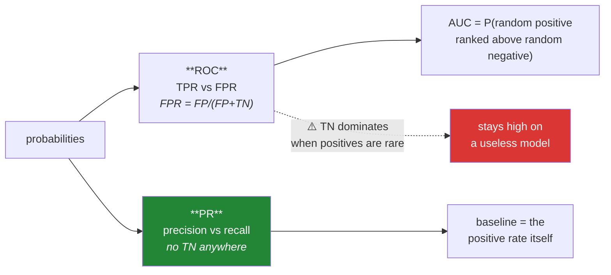

# Day 101 — ROC-AUC, PR-AUC, calibration, threshold tuning

**Phase 12 · Module 12** · ID: **ML-12** (ROC and PR curves, calibration, threshold selection)

> **Yesterday:** the confusion matrix at one threshold, and the cost formula that picks it.
> **Today:** evaluating across **every** threshold at once — and the fact that decides which curve
> to use: **ROC-AUC barely moves on severely imbalanced data while PR-AUC collapses.** Then
> calibration, which is what Day 100's cost formula quietly assumed.
> **Tomorrow:** Naive Bayes.

```bash
./m start 101 && ./m scaffold 101
```

**Time:** 110 minutes. **Request budget:** 0 model calls.

---

## §1 The story

Day 100 evaluated at one threshold. But a threshold is a **deployment decision**, and you often want
to compare models before making it. Curves sweep every threshold and summarise the whole sweep in one
number.

Two curves, and choosing between them matters more than people expect:



**The difference is one box.** ROC's false-positive rate is `FP/(FP+TN)`, and on data that is 1%
positive the `TN` term is enormous — so thousands of false alarms barely move the FPR. Precision is
`TP/(TP+FP)` and contains **no TN at all**, so it feels every false alarm immediately. That is the
whole reason PR-AUC is the right curve for rare positives, and §3 measures the gap.

**ROC-AUC has a beautiful interpretation** worth knowing: it is exactly the probability that a
randomly chosen positive is ranked above a randomly chosen negative. 0.5 is a coin flip regardless of
imbalance — which is convenient, and is also why it flatters models on rare classes.

**PR-AUC's baseline is not 0.5.** It is the positive rate. A PR-AUC of 0.30 on a 3%-positive problem
is a tenfold lift; the same number on balanced data is terrible. **Quoting PR-AUC without the base
rate is meaningless**, which is Day 100's precision lesson again.

Then **calibration**, which is the day's quiet centre. Day 100's cost-optimal threshold assumed
`p` was a real probability. If your model outputs 0.9 for cases that are actually right 60% of the
time, that threshold is wrong — and **AUC cannot detect this**, because AUC only sees the *ranking*.
A model can have perfect AUC and useless probabilities.

---

## §2 Setup — run this

```bash
mkdir -p days/day-101/lab
touch days/day-101/lab/curves.py
```

`src/setu/models.py` grows today. No new packages.

---

## §3 ML-12 — sweeping thresholds

`days/day-101/lab/curves.py`:

```python
"""ML-12: ROC vs PR, calibration, and choosing a threshold honestly."""

from __future__ import annotations

import numpy as np
from sklearn.calibration import CalibratedClassifierCV
from sklearn.ensemble import RandomForestClassifier
from sklearn.linear_model import LogisticRegression
from sklearn.metrics import (
    average_precision_score,
    brier_score_loss,
    precision_recall_curve,
    roc_auc_score,
    roc_curve,
)
from sklearn.model_selection import train_test_split

from setu.arrays import make_rng


def data(n=20_000, *, rate=0.5, seed=0, strength=1.2):
    rng = make_rng(seed)
    x = rng.normal(0, 1, (n, 5))
    z = np.log(rate / (1 - rate)) + strength * (x @ np.array([1.0, -0.7, 0.4, 0.2, 0.0]))
    return x, (rng.random(n) < 1 / (1 + np.exp(-z))).astype(int)


def the_roc_curve() -> None:
    x, y = data(rate=0.5)
    model = LogisticRegression(max_iter=2_000).fit(x, y)
    probability = model.predict_proba(x)[:, 1]
    fpr, tpr, thresholds = roc_curve(y, probability)

    print(f"\n  {'threshold':>10} {'TPR (recall)':>14} {'FPR':>8}")
    for target in (0.9, 0.7, 0.5, 0.3, 0.1):
        i = int(np.argmin(np.abs(thresholds - target)))
        print(f"  {thresholds[i]:>10.3f} {tpr[i]:>14.4f} {fpr[i]:>8.4f}")

    print(f"\n  AUC = {roc_auc_score(y, probability):.4f}")

    rng = make_rng(99)
    positives = probability[y == 1]
    negatives = probability[y == 0]
    pairs = 200_000
    wins = (rng.choice(positives, pairs) > rng.choice(negatives, pairs)).mean()
    print(f"  P(random positive ranked above random negative) = {wins:.4f}")

    print("\n  Those are the same number, and that is what AUC MEANS. It is a measure")
    print("  of RANKING, and it never looks at the probability values themselves —")
    print("  only at their order. §3.5 is about what that misses.")


def imbalance_breaks_roc() -> None:
    print(f"\n  the same model quality, at four positive rates:")
    print(f"  {'rate':>8} {'ROC-AUC':>9} {'PR-AUC':>8} {'PR baseline':>13} {'PR lift':>9}")

    for rate in (0.50, 0.10, 0.01, 0.001):
        x, y = data(n=60_000, rate=rate, seed=1)
        model = LogisticRegression(max_iter=2_000).fit(x, y)
        probability = model.predict_proba(x)[:, 1]
        roc = roc_auc_score(y, probability)
        pr = average_precision_score(y, probability)
        print(f"  {rate:>8.3f} {roc:>9.4f} {pr:>8.4f} {y.mean():>13.4f} "
              f"{pr / max(y.mean(), 1e-9):>8.1f}x")

    print("\n  🚨 ROC-AUC barely moves. PR-AUC collapses.")
    print("\n  Why: FPR = FP/(FP+TN). At a 0.1% positive rate TN is ~60,000, so a")
    print("  thousand false alarms move FPR by 0.017 — nearly invisible. Precision")
    print("  contains NO TN, so the same thousand false alarms are devastating.")
    print("\n  A 0.95 ROC-AUC on rare-positive data can hide a model that flags twenty")
    print("  false alarms for every real case.")


def pr_auc_needs_its_baseline() -> None:
    print(f"\n  a random model's PR-AUC IS the positive rate:")
    print(f"  {'rate':>8} {'random PR-AUC':>15} {'random ROC-AUC':>16}")
    for rate in (0.5, 0.1, 0.01):
        rng = make_rng(2)
        n = 40_000
        y = (rng.random(n) < rate).astype(int)
        noise = rng.random(n)
        print(f"  {rate:>8.2f} {average_precision_score(y, noise):>15.4f} "
              f"{roc_auc_score(y, noise):>16.4f}")

    print("\n  ROC-AUC's floor is 0.5 whatever the imbalance. PR-AUC's floor MOVES.")
    print("\n  ⚠️ So 'PR-AUC = 0.30' means nothing alone. On a 3% problem it is a 10x")
    print("     lift and excellent; on balanced data it is worse than guessing.")
    print("  Always report PR-AUC beside the positive rate — Day 100's rule again.")


def auc_cannot_see_calibration() -> None:
    x, y = data(n=20_000, rate=0.3, seed=3)
    model = LogisticRegression(max_iter=2_000).fit(x, y)
    probability = model.predict_proba(x)[:, 1]

    squashed = 0.5 + (probability - 0.5) * 0.2          # same order, compressed
    shifted = np.clip(probability ** 0.4, 1e-9, 1 - 1e-9)  # same order, inflated

    print(f"\n  {'version':<18} {'ROC-AUC':>9} {'Brier':>8} {'mean p':>9} {'actual rate':>13}")
    for label, p in (("original", probability), ("squashed", squashed), ("inflated", shifted)):
        print(f"  {label:<18} {roc_auc_score(y, p):>9.6f} "
              f"{brier_score_loss(y, p):>8.4f} {p.mean():>9.4f} {y.mean():>13.4f}")

    print("\n  🚨 IDENTICAL ROC-AUC in all three rows. The ranking never changed.")
    print("     But the probabilities are badly wrong in two of them, and the Brier")
    print("     score sees it while AUC cannot.")
    print("\n  This matters because Day 100's cost-optimal threshold assumed p was a real")
    print("  probability. On the 'inflated' model, thresholding at 0.05 flags far more")
    print("  than intended. AUC is necessary and not sufficient.")


def a_calibration_curve() -> None:
    x, y = data(n=30_000, rate=0.3, seed=4)
    x_train, x_test, y_train, y_test = train_test_split(x, y, test_size=0.4, random_state=0)

    logistic = LogisticRegression(max_iter=2_000).fit(x_train, y_train)
    forest = RandomForestClassifier(n_estimators=80, max_depth=6, random_state=0).fit(
        x_train, y_train
    )

    print(f"\n  {'bin':>14} {'logistic pred':>15} {'logistic actual':>17} "
          f"{'forest pred':>13} {'forest actual':>15}")
    edges = np.linspace(0, 1, 11)
    p_logistic = logistic.predict_proba(x_test)[:, 1]
    p_forest = forest.predict_proba(x_test)[:, 1]

    for low, high in zip(edges[:-1], edges[1:], strict=True):
        mask_l = (p_logistic >= low) & (p_logistic < high)
        mask_f = (p_forest >= low) & (p_forest < high)
        if mask_l.sum() < 30 and mask_f.sum() < 30:
            continue
        print(f"  [{low:.1f}, {high:.1f})   "
              f"{p_logistic[mask_l].mean() if mask_l.sum() else float('nan'):>13.3f} "
              f"{y_test[mask_l].mean() if mask_l.sum() else float('nan'):>17.3f} "
              f"{p_forest[mask_f].mean() if mask_f.sum() else float('nan'):>13.3f} "
              f"{y_test[mask_f].mean() if mask_f.sum() else float('nan'):>15.3f}")

    print("\n  A calibrated model's predicted and actual columns MATCH: of the cases it")
    print("  called 0.7, about 70% really are positive.")
    print("\n  Logistic regression is calibrated almost by construction — that is what")
    print("  minimising log loss does (Day 99). Tree ensembles are typically NOT:")
    print("  averaging votes pushes probabilities toward the middle.")


def fixing_calibration() -> None:
    x, y = data(n=30_000, rate=0.3, seed=5)
    x_train, x_rest, y_train, y_rest = train_test_split(x, y, test_size=0.5, random_state=0)
    x_cal, x_test, y_cal, y_test = train_test_split(x_rest, y_rest, test_size=0.5, random_state=0)

    forest = RandomForestClassifier(n_estimators=80, max_depth=6, random_state=0).fit(
        x_train, y_train
    )
    calibrated = CalibratedClassifierCV(forest, method="isotonic", cv="prefit").fit(x_cal, y_cal)

    print(f"\n  {'model':<24} {'ROC-AUC':>9} {'Brier':>9}")
    for label, p in (("forest, raw", forest.predict_proba(x_test)[:, 1]),
                     ("forest, calibrated", calibrated.predict_proba(x_test)[:, 1])):
        print(f"  {label:<24} {roc_auc_score(y_test, p):>9.4f} "
              f"{brier_score_loss(y_test, p):>9.4f}")

    print("\n  Calibration barely changes AUC — it is monotonic, so the RANKING survives.")
    print("  The Brier score improves, because the probabilities became meaningful.")
    print("\n  ⚠️ Note the THREE-way split: train, calibrate, test. Calibrating on the")
    print("     training data learns the model's own overconfidence and fixes nothing;")
    print("     calibrating on test is leakage (Day 79). This is the same discipline as")
    print("     Day 96's 'the validation set gets used up'.")


def choosing_a_threshold_properly() -> None:
    x, y = data(n=40_000, rate=0.04, seed=6)
    x_train, x_rest, y_train, y_rest = train_test_split(x, y, test_size=0.5, random_state=0)
    x_val, x_test, y_val, y_test = train_test_split(x_rest, y_rest, test_size=0.5, random_state=0)

    model = LogisticRegression(max_iter=2_000).fit(x_train, y_train)
    p_val = model.predict_proba(x_val)[:, 1]
    p_test = model.predict_proba(x_test)[:, 1]

    precision, recall, thresholds = precision_recall_curve(y_val, p_val)
    f1 = 2 * precision * recall / np.maximum(precision + recall, 1e-12)
    best_f1 = float(thresholds[int(np.argmax(f1[:-1]))])

    cost_fp, cost_fn = 1.0, 15.0
    cost_threshold = cost_fp / (cost_fp + cost_fn)

    print(f"\n  chosen on VALIDATION:")
    print(f"    best-F1 threshold        = {best_f1:.4f}")
    print(f"    cost-optimal (Day 100)   = {cost_threshold:.4f}")

    print(f"\n  applied to the untouched TEST set:")
    print(f"  {'threshold':>22} {'precision':>10} {'recall':>8} {'cost':>10}")
    for label, threshold in (("0.5 (default)", 0.5), ("best F1", best_f1),
                             ("cost-optimal", cost_threshold)):
        predicted = p_test >= threshold
        tp = int((predicted & (y_test == 1)).sum())
        fp = int((predicted & (y_test == 0)).sum())
        fn = int((~predicted & (y_test == 1)).sum())
        print(f"  {label:>22} {tp / max(tp + fp, 1):>10.4f} "
              f"{tp / max(tp + fn, 1):>8.4f} {fp * cost_fp + fn * cost_fn:>10,.0f}")

    print("\n  The threshold is TUNED on validation and REPORTED on test — it is a")
    print("  fitted parameter like any other (Day 96's winner's curse).")
    print("\n  And note the cost column: the default 0.5 is the most expensive by far.")


def curves_need_the_positive_class() -> None:
    rng = make_rng(7)
    y = (rng.random(2_000) < 0.5).astype(int)
    probability = rng.random(2_000)

    print(f"\n  degenerate cases every implementation must handle:")
    for label, truth in (("only negatives", np.zeros(100, dtype=int)),
                         ("only positives", np.ones(100, dtype=int))):
        try:
            roc_auc_score(truth, rng.random(100))
            print(f"    {label:<18} ROC-AUC computed")
        except ValueError as error:
            print(f"    {label:<18} 🚨 {type(error).__name__}: {str(error)[:52]}")

    print("\n  ROC-AUC is UNDEFINED with one class present — there are no pairs to rank.")
    print("  This bites in cross-validation on rare positives: an unstratified fold")
    print("  can contain zero positives (Day 97), and the whole CV returns nan.")
    print("\n  Handle it explicitly: stratify, and raise a message that says which fold.")


if __name__ == "__main__":
    the_roc_curve()
    imbalance_breaks_roc()
    pr_auc_needs_its_baseline()
    auc_cannot_see_calibration()
    a_calibration_curve()
    fixing_calibration()
    choosing_a_threshold_properly()
    curves_need_the_positive_class()
```

**Line by line:**

- `the_roc_curve` — the pairwise simulation and `roc_auc_score` give **the same number**, which is what
  AUC *means*: the probability a random positive outranks a random negative. It is a measure of
  **ranking**, and never looks at the probability values themselves.
- `imbalance_breaks_roc` — **the day's centre.** ROC-AUC barely moves across four orders of magnitude
  of imbalance; PR-AUC collapses. The reason is one box: `FPR = FP/(FP+TN)`, and at a 0.1% positive
  rate `TN` is enormous, so a thousand false alarms move FPR by 0.017. **Precision contains no TN**, so
  the same thousand are devastating.
- `pr_auc_needs_its_baseline` — **ROC-AUC's floor is 0.5 whatever the imbalance; PR-AUC's floor moves**
  and equals the positive rate. So "PR-AUC = 0.30" is excellent on a 3% problem and worse than guessing
  on balanced data. Report it beside the base rate.
- `auc_cannot_see_calibration` — **identical ROC-AUC in all three rows**, because the ranking never
  changed, while the probabilities are badly wrong in two. The Brier score sees what AUC cannot. And
  the consequence is concrete: **Day 100's cost threshold assumed `p` was a real probability**, so on
  the inflated model it flags far more than intended.
- `a_calibration_curve` — of the cases a calibrated model calls 0.7, **about 70% really are positive**.
  Logistic regression is calibrated almost by construction (that is what minimising log loss does);
  tree ensembles typically are not, because averaging votes pushes probabilities toward the middle.
- `fixing_calibration` — calibration **barely changes AUC** (it is monotonic, so ranking survives) and
  improves Brier. Note the **three-way split**: calibrating on training data learns the model's own
  overconfidence and fixes nothing; calibrating on test is leakage.
- `choosing_a_threshold_properly` — **tuned on validation, reported on test.** A threshold is a fitted
  parameter like any other, so Day 96's winner's curse applies. And the cost column shows the default
  0.5 is the most expensive option by a wide margin.
- `curves_need_the_positive_class` — **ROC-AUC is undefined with one class present.** This bites in
  cross-validation on rare positives: an unstratified fold can contain zero positives (Day 97) and the
  whole CV returns `nan`.

---

## §4 Build brief

Extend `src/setu/models.py`:

```python
def roc_auc(y_true, probability) -> dict:
    """TODO(me): ranking quality, with the interpretation attached.

    {"auc", "n_positive", "n_negative", "interpretation", "warnings": [...]}
    - interpretation must state the PAIRWISE meaning, not 'area under the curve' —
      the pairwise phrasing is what makes it usable (§3.1)
    - raise DataError when only one class is present, saying AUC is UNDEFINED and
      naming the class that is missing (§3.8) — never return nan
    - WARN when the positive rate is under 5%, saying PR-AUC is the better curve here
      and naming the rate
    - raise DataError on a length mismatch or a non-binary target
    """
    raise NotImplementedError


def pr_auc(y_true, probability) -> dict:
    """TODO(me): average precision, WITH its baseline.

    {"pr_auc", "baseline", "lift", "positive_rate", "interpretation"}
    - baseline IS the positive rate — a random model scores exactly that (§3.3)
    - lift = pr_auc / baseline; that ratio is the quotable number, not pr_auc alone
    - the interpretation must include the base rate; a bare PR-AUC is meaningless
    - raise DataError when no positives exist
    """
    raise NotImplementedError


def calibration_report(y_true, probability, *, n_bins: int = 10,
                       min_per_bin: int = 20) -> dict:
    """TODO(me): do the predicted probabilities mean what they say?

    {"bins": [{"low", "high", "n", "mean_predicted", "actual_rate", "gap"}],
     "brier", "expected_calibration_error", "max_gap", "is_calibrated",
     "direction": "overconfident" | "underconfident" | "calibrated", "warnings": [...]}
    - expected_calibration_error is the bin-count-weighted mean |gap|
    - skip bins with fewer than min_per_bin rows and report how many were skipped —
      an empty bin's 'actual rate' is noise, not evidence
    - is_calibrated when expected_calibration_error < 0.05
    - `direction` compares mean predicted with actual across bins: consistently
      predicting higher than reality is overconfident
    - raise DataError if n_bins < 2
    """
    raise NotImplementedError


def assert_calibrated_before_costing(y_true, probability, *, tolerance: float = 0.05) -> None:
    """TODO(me): raise DataError if cost-based thresholding would be unsound.

    - Day 100's optimal_threshold assumes p is a real probability (§3.4)
    - raise when expected_calibration_error exceeds tolerance, naming the error AND
      the direction, and pointing at calibration as the fix
    - this is the guard that connects the two days; without it a cost threshold on an
      uncalibrated model is confidently wrong
    """
    raise NotImplementedError


def tune_threshold(y_val, p_val, *, objective: str = "cost", cost_fp: float = 1.0,
                   cost_fn: float = 1.0, min_precision: float | None = None,
                   capacity: int | None = None) -> dict:
    """TODO(me): choose a threshold on VALIDATION data.

    {"threshold", "objective", "validation_score", "n_flagged", "warnings": [...]}
    - objective in {'cost', 'f1', 'recall_at_precision', 'precision_at_k'}
    - 'cost' delegates to Day 100's optimal_threshold — do not reimplement it
    - 'recall_at_precision' needs min_precision; raise DataError if absent
    - 'precision_at_k' needs capacity; raise DataError if absent
    - the result MUST carry a warning that validation_score is optimistic and the
      threshold must be re-evaluated on held-out data (§3.7, Day 96)
    """
    raise NotImplementedError


def evaluate_at_threshold(y_test, p_test, *, threshold: float, cost_fp: float = 1.0,
                          cost_fn: float = 1.0) -> dict:
    """TODO(me): the honest report, on data used for nothing else.

    {"threshold", "precision", "recall", "n_flagged", "total_cost",
     "vs_default": {...}, "positive_rate"}
    - reuse Day 100's confusion; do not recompute the four boxes
    - vs_default compares against threshold 0.5 so the default's cost stays visible
    - positive_rate must be included, because precision is uninterpretable without it
    """
    raise NotImplementedError
```

- `roc_auc` **raising rather than returning nan** on a single-class input is the day's small but real
  design decision: a silent `nan` propagates through a CV mean and turns the whole result into `nan`
  with no clue why.
- `pr_auc` returning **`lift` alongside the raw score** encodes §3.3 — the ratio to the base rate is
  the quotable number.
- `assert_calibrated_before_costing` is the guard that **connects Day 100 to today**. Without it a
  cost-optimal threshold on an uncalibrated model is confidently wrong, and nothing warns you.

---

## §5 The eval that must be able to fail

Add to `tests/test_models.py`:

```python
from sklearn.metrics import average_precision_score, roc_auc_score

from setu.models import (
    assert_calibrated_before_costing,
    calibration_report,
    evaluate_at_threshold,
    pr_auc,
    roc_auc,
    tune_threshold,
)


@pytest.fixture
def scored():
    rng = make_rng(0)
    n = 8_000
    x = rng.normal(0, 1, (n, 4))
    z = x @ np.array([1.2, -0.8, 0.4, 0.0])
    y = (rng.random(n) < 1 / (1 + np.exp(-z))).astype(int)
    return y, 1 / (1 + np.exp(-z)) + rng.normal(0, 0.05, n).clip(-0.2, 0.2)


def test_auc_matches_sklearn(scored):
    y, p = scored
    assert roc_auc(y, np.clip(p, 0, 1))["auc"] == pytest.approx(
        roc_auc_score(y, np.clip(p, 0, 1)), rel=1e-9
    )


def test_auc_is_the_pairwise_ranking_probability(scored):
    """That is what it MEANS."""
    y, p = scored
    p = np.clip(p, 0, 1)
    rng = make_rng(1)
    positives, negatives = p[y == 1], p[y == 0]
    wins = (rng.choice(positives, 200_000) > rng.choice(negatives, 200_000)).mean()
    assert roc_auc(y, p)["auc"] == pytest.approx(wins, abs=0.01)


def test_the_interpretation_uses_the_pairwise_phrasing(scored):
    y, p = scored
    text = roc_auc(y, np.clip(p, 0, 1))["interpretation"].lower()
    assert "rank" in text or "above" in text
    assert "area under" not in text, "that phrasing tells the reader nothing usable"


def test_a_single_class_raises_rather_than_returning_nan():
    """A silent nan propagates through a CV mean with no clue why."""
    with pytest.raises(DataError) as info:
        roc_auc(np.zeros(50, dtype=int), np.linspace(0, 1, 50))
    message = str(info.value).lower()
    assert "undefined" in message or "one class" in message
    assert "positive" in message


def test_rare_positives_get_a_pr_auc_recommendation():
    rng = make_rng(2)
    n = 5_000
    y = (rng.random(n) < 0.02).astype(int)
    p = rng.random(n)
    result = roc_auc(y, p)
    assert result["warnings"]
    assert any("pr" in w.lower() for w in result["warnings"])


def test_roc_auc_is_stable_across_imbalance_and_pr_auc_is_not():
    """The day's centre: one box makes all the difference."""
    rocs, prs = [], []
    for rate in (0.5, 0.01):
        rng = make_rng(3)
        n = 60_000
        x = rng.normal(0, 1, (n, 3))
        z = np.log(rate / (1 - rate)) + 1.2 * (x @ np.array([1.0, -0.7, 0.4]))
        p = 1 / (1 + np.exp(-z))
        y = (rng.random(n) < p).astype(int)
        rocs.append(roc_auc_score(y, p))
        prs.append(average_precision_score(y, p))

    assert abs(rocs[0] - rocs[1]) < 0.05, "ROC-AUC should barely notice the imbalance"
    assert prs[0] > prs[1] * 3, "PR-AUC should collapse"


def test_a_random_model_scores_the_positive_rate_on_pr():
    """PR-AUC's floor moves; ROC-AUC's does not."""
    rng = make_rng(4)
    n = 40_000
    for rate in (0.5, 0.05):
        y = (rng.random(n) < rate).astype(int)
        result = pr_auc(y, rng.random(n))
        assert result["pr_auc"] == pytest.approx(rate, abs=0.02)
        assert result["baseline"] == pytest.approx(rate, abs=0.005)
        assert result["lift"] == pytest.approx(1.0, abs=0.15)


def test_pr_auc_reports_lift_not_just_the_score(scored):
    y, p = scored
    result = pr_auc(y, np.clip(p, 0, 1))
    assert result["lift"] == pytest.approx(result["pr_auc"] / result["baseline"], rel=1e-9)


def test_the_pr_interpretation_names_the_base_rate(scored):
    """A bare PR-AUC is meaningless."""
    y, p = scored
    text = pr_auc(y, np.clip(p, 0, 1))["interpretation"]
    assert f"{y.mean():.2f}"[:3] in text or "base rate" in text.lower()


def test_pr_auc_needs_at_least_one_positive():
    with pytest.raises(DataError):
        pr_auc(np.zeros(100, dtype=int), np.random.default_rng(0).random(100))


def test_auc_cannot_see_a_calibration_failure(scored):
    """Identical ranking, ruined probabilities."""
    y, p = scored
    p = np.clip(p, 1e-6, 1 - 1e-6)
    squashed = 0.5 + (p - 0.5) * 0.2

    assert roc_auc(y, p)["auc"] == pytest.approx(roc_auc(y, squashed)["auc"], rel=1e-9)
    assert calibration_report(y, squashed)["expected_calibration_error"] > \
        calibration_report(y, p)["expected_calibration_error"]


def test_a_well_calibrated_model_is_recognised():
    rng = make_rng(5)
    n = 20_000
    p = rng.uniform(0.02, 0.98, n)
    y = (rng.random(n) < p).astype(int)          # calibrated by construction
    result = calibration_report(y, p)
    assert result["is_calibrated"] is True
    assert result["direction"] == "calibrated"
    assert result["max_gap"] < 0.1


def test_an_overconfident_model_is_named_as_such():
    rng = make_rng(6)
    n = 20_000
    true_p = rng.uniform(0.1, 0.9, n)
    y = (rng.random(n) < true_p).astype(int)
    overconfident = np.clip(0.5 + (true_p - 0.5) * 2.2, 0.01, 0.99)

    result = calibration_report(y, overconfident)
    assert result["is_calibrated"] is False
    assert result["direction"] == "overconfident"


def test_an_underconfident_model_is_named_as_such():
    """A checker that only detects one direction is half a checker."""
    rng = make_rng(7)
    n = 20_000
    true_p = rng.uniform(0.05, 0.95, n)
    y = (rng.random(n) < true_p).astype(int)
    underconfident = 0.5 + (true_p - 0.5) * 0.3

    result = calibration_report(y, underconfident)
    assert result["is_calibrated"] is False
    assert result["direction"] == "underconfident"


def test_sparse_bins_are_skipped_and_counted():
    """An almost-empty bin's actual rate is noise, not evidence."""
    rng = make_rng(8)
    n = 3_000
    p = np.concatenate([rng.uniform(0.0, 0.2, n - 12), rng.uniform(0.9, 1.0, 12)])
    y = (rng.random(n) < p).astype(int)
    result = calibration_report(y, p, n_bins=10, min_per_bin=50)
    assert result["warnings"], "skipped bins went unreported"
    assert all(b["n"] >= 50 for b in result["bins"])


def test_the_brier_score_matches_sklearn(scored):
    from sklearn.metrics import brier_score_loss

    y, p = scored
    p = np.clip(p, 0, 1)
    assert calibration_report(y, p)["brier"] == pytest.approx(brier_score_loss(y, p), rel=1e-9)


def test_calibration_needs_at_least_two_bins(scored):
    y, p = scored
    with pytest.raises(DataError):
        calibration_report(y, np.clip(p, 0, 1), n_bins=1)


def test_cost_thresholding_is_refused_on_an_uncalibrated_model():
    """Day 100's formula assumed p was a real probability."""
    rng = make_rng(9)
    n = 20_000
    true_p = rng.uniform(0.1, 0.9, n)
    y = (rng.random(n) < true_p).astype(int)
    overconfident = np.clip(0.5 + (true_p - 0.5) * 2.5, 0.01, 0.99)

    with pytest.raises(DataError) as info:
        assert_calibrated_before_costing(y, overconfident)
    message = str(info.value).lower()
    assert "calibrat" in message
    assert "overconfident" in message, "the direction must be named"


def test_cost_thresholding_is_allowed_on_a_calibrated_model():
    rng = make_rng(10)
    n = 20_000
    p = rng.uniform(0.02, 0.98, n)
    y = (rng.random(n) < p).astype(int)
    assert_calibrated_before_costing(y, p)


def test_calibration_is_monotonic_so_ranking_survives():
    """Which is why calibration barely moves AUC."""
    rng = make_rng(11)
    n = 10_000
    p = rng.uniform(0.01, 0.99, n)
    y = (rng.random(n) < p).astype(int)
    recalibrated = p ** 0.7                       # monotonic transform
    assert roc_auc(y, p)["auc"] == pytest.approx(roc_auc(y, recalibrated)["auc"], rel=1e-9)


def test_the_cost_objective_delegates_to_day_100(monkeypatch, scored):
    import setu.models as models

    calls = []
    original = models.optimal_threshold
    monkeypatch.setattr(models, "optimal_threshold",
                        lambda *a, **k: calls.append(1) or original(*a, **k))
    y, p = scored
    tune_threshold(y, np.clip(p, 0, 1), objective="cost", cost_fp=1.0, cost_fn=10.0)
    assert calls, "tune_threshold reimplemented Day 100's formula"


def test_tuning_warns_that_the_score_is_optimistic(scored):
    """You selected on it (Day 96)."""
    y, p = scored
    result = tune_threshold(y, np.clip(p, 0, 1), objective="f1")
    assert result["warnings"]
    assert any("optimistic" in w.lower() or "held-out" in w.lower() for w in result["warnings"])


def test_recall_at_precision_requires_the_precision_floor(scored):
    y, p = scored
    with pytest.raises(DataError):
        tune_threshold(y, np.clip(p, 0, 1), objective="recall_at_precision")


def test_precision_at_k_requires_a_capacity(scored):
    y, p = scored
    with pytest.raises(DataError):
        tune_threshold(y, np.clip(p, 0, 1), objective="precision_at_k")


def test_a_costlier_miss_lowers_the_tuned_threshold(scored):
    y, p = scored
    p = np.clip(p, 0, 1)
    cheap = tune_threshold(y, p, objective="cost", cost_fp=1.0, cost_fn=2.0)["threshold"]
    dear = tune_threshold(y, p, objective="cost", cost_fp=1.0, cost_fn=40.0)["threshold"]
    assert dear < cheap


def test_evaluation_reports_the_positive_rate(scored):
    """Precision is uninterpretable without it (Day 100)."""
    y, p = scored
    result = evaluate_at_threshold(y, np.clip(p, 0, 1), threshold=0.3)
    assert result["positive_rate"] == pytest.approx(y.mean(), rel=1e-9)


def test_evaluation_keeps_the_default_visible(scored):
    y, p = scored
    result = evaluate_at_threshold(y, np.clip(p, 0, 1), threshold=0.2,
                                   cost_fp=1.0, cost_fn=15.0)
    assert result["vs_default"]["threshold"] == 0.5
    assert "total_cost" in result["vs_default"]


def test_evaluation_reuses_day_100s_confusion(monkeypatch, scored):
    import setu.models as models

    calls = []
    original = models.confusion
    monkeypatch.setattr(models, "confusion",
                        lambda *a, **k: calls.append(1) or original(*a, **k))
    y, p = scored
    evaluate_at_threshold(y, np.clip(p, 0, 1), threshold=0.4)
    assert calls, "the four boxes were recomputed instead of reused"
```

**Line by line:**

- `test_auc_cannot_see_a_calibration_failure` — **the day's real assessment.** ROC-AUC is *identical*
  to nine decimal places while the calibration error rises. That single pair of assertions is why
  Brier and calibration curves exist, and why AUC is necessary but not sufficient.
- `test_roc_auc_is_stable_across_imbalance_and_pr_auc_is_not` — §3.2 as two assertions in opposite
  directions. ROC moves by under 0.05 while PR falls by more than a factor of three.
- `test_a_single_class_raises_rather_than_returning_nan` — a **silent `nan` propagates through a CV
  mean** and turns the whole result into `nan` with no explanation. Raising with the missing class
  named is the difference between a five-minute fix and an hour.
- `test_an_overconfident_model_is_named_as_such` with `test_an_underconfident_model_is_named_as_such` —
  **both directions.** A checker that only detects overconfidence is half a checker, and tree ensembles
  fail in the *under*-confident direction.
- `test_cost_thresholding_is_refused_on_an_uncalibrated_model` — the guard connecting Day 100 to today,
  and it requires the **direction** in the message so the fix is obvious.
- `test_calibration_is_monotonic_so_ranking_survives` — AUC is unchanged under a monotonic transform,
  which explains why calibration is nearly free: you improve the probabilities without disturbing the
  ranking.
- `test_a_random_model_scores_the_positive_rate_on_pr` — the floor **moves**, tested at two rates. This
  is what makes PR-AUC unquotable without its baseline.
- `test_the_interpretation_uses_the_pairwise_phrasing` — bans "area under", because that phrasing
  tells a reader nothing they can act on.

```bash
uv run python -m pytest tests/test_models.py -v
```

---

## §6 Request budget

| Resource | Spent today |
|---|---|
| LLM calls | **0** |

---

## §7 Traps

- **ROC-AUC on rare positives.** It stays high on a model with terrible precision.
- **PR-AUC without the base rate.** Its floor is the positive rate, not 0.5.
- **Trusting AUC to mean the probabilities are good.** It only sees ranking.
- **Cost-based thresholding on an uncalibrated model.** Day 100's formula assumed `p` was real.
- **Calibrating on the training set.** It learns the model's own overconfidence.
- **Calibrating on the test set.** Leakage (Day 79).
- **Tuning a threshold on test.** It is a fitted parameter (Day 96).
- **Assuming tree ensembles are calibrated.** Averaging votes pulls toward the middle.
- **`nan` from a single-class fold.** Stratify, and raise a message naming the fold.
- **Reading a calibration bin with 4 rows.** That is noise.
- **Reporting AUC alone.** Necessary, not sufficient.

---

## §8 Verify before you code

Written **2026-08-21**:

- <https://scikit-learn.org/stable/modules/generated/sklearn.metrics.roc_auc_score.html> — including
  the multiclass `average` options.
- <https://scikit-learn.org/stable/modules/generated/sklearn.metrics.average_precision_score.html> —
  and why it is preferred to trapezoidal PR-AUC.
- <https://scikit-learn.org/stable/modules/calibration.html> — Platt scaling versus isotonic, and the
  data requirements of each.
- <https://scikit-learn.org/stable/modules/generated/sklearn.calibration.calibration_curve.html> — the
  binning helper behind §3.5.

---

## §9 Say it in an interview

> "The choice between ROC and PR comes down to one box in the confusion matrix. ROC's false-positive
> rate is FP over FP-plus-TN, and when positives are rare that TN term is enormous — so thousands of
> false alarms barely move it, and you can have a 0.95 ROC-AUC on a model that flags twenty false
> alarms per real case. Precision has no TN in it at all, so PR-AUC feels every false alarm. And
> PR-AUC's baseline is the positive rate rather than 0.5, so quoting it without the base rate is
> meaningless. The thing I'd emphasise beyond that is calibration, because AUC is a *ranking* measure
> and literally cannot see it — I have a test where three versions of the same predictions have
> identical AUC to nine decimal places while two of them have badly wrong probabilities. That matters
> because cost-optimal thresholding assumes p is a real probability, so I have a guard that refuses to
> compute a cost threshold on an uncalibrated model and names the direction of the miscalibration.
> Logistic regression is calibrated almost by construction; tree ensembles usually aren't."

---

## §10 Done when

Tick [`CHECKLIST.md`](CHECKLIST.md), then `./m check && ./m done 101`.
