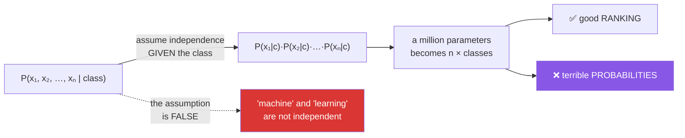

# Day 102 — Naive Bayes

**Phase 12 · Module 12** · ID: **ML-13** (Naive Bayes: multinomial, Gaussian, Bernoulli)

> **Yesterday:** curves and calibration.
> **Today:** Day 72's theorem becomes a classifier. It rests on an assumption everyone admits is
> **false** — and works anyway, which is the interesting part. It is also the model that makes
> yesterday's calibration lesson sharpest: **Naive Bayes ranks well and its probabilities are close
> to worthless.**
> **Tomorrow:** KNN and the curse of dimensionality.

```bash
./m start 102 && ./m scaffold 102
```

**Time:** 110 minutes. **Request budget:** 0 model calls.

---

## §1 The story

Day 72 gave you `P(H | data) ∝ P(data | H) · P(H)`. Turn it into a classifier and you need
`P(features | class)` — the probability of seeing this *entire* combination of features given each
class. With 20 binary features that is a million combinations per class, and you will never have
enough data.

The "naive" assumption cuts through it:



**Features are conditionally independent given the class.** In a document, that says knowing "machine"
appeared tells you nothing about whether "learning" appeared, once you know the topic. That is
obviously false.

**And it works anyway**, which needs explaining rather than hand-waving. Classification only needs the
**argmax** to be right, not the probabilities. Correlated features cause the model to count the same
evidence several times, which pushes the winning probability toward 1 — but usually **does not change
which class wins**. You get the right answer with an absurd confidence attached.

That is the day's real lesson, and it connects directly to Day 101: **Naive Bayes has good AUC and
appalling calibration.** If you need a ranking, it is excellent and nearly free. If you need
`P(spam) = 0.8` to mean 80%, it is unusable without calibration.

Three variants, differing only in what `P(feature | class)` looks like: **Multinomial** for counts
(word frequencies), **Bernoulli** for presence/absence, **Gaussian** for continuous features.

And two implementation details that are not optional: **work in log space**, because multiplying
hundreds of small probabilities underflows to zero; and **smooth**, because one unseen word would
otherwise multiply the entire posterior by zero.

---

## §2 Setup — run this

```bash
mkdir -p days/day-102/lab
touch days/day-102/lab/bayes_classifier.py
```

`src/setu/models.py` grows today. No new packages.

---

## §3 ML-13 — a classifier from Bayes

`days/day-102/lab/bayes_classifier.py`:

```python
"""ML-13: Naive Bayes from scratch — the false assumption, and why it survives it."""

from __future__ import annotations

import numpy as np
from sklearn.feature_extraction.text import CountVectorizer
from sklearn.metrics import brier_score_loss, roc_auc_score
from sklearn.naive_bayes import BernoulliNB, GaussianNB, MultinomialNB

from setu.arrays import make_rng

SPAM_WORDS = ["free", "winner", "urgent", "click", "offer", "cash"]
HAM_WORDS = ["meeting", "report", "schedule", "review", "project", "attached"]


def documents(n=4_000, *, seed=0):
    rng = make_rng(seed)
    texts, labels = [], []
    for _ in range(n):
        spam = rng.random() < 0.4
        vocabulary = SPAM_WORDS if spam else HAM_WORDS
        words = list(rng.choice(vocabulary, rng.integers(4, 12)))
        words += list(rng.choice(["the", "a", "to", "and", "of"], rng.integers(8, 20)))
        texts.append(" ".join(words))
        labels.append(int(spam))
    return texts, np.array(labels)


def why_the_assumption_is_needed() -> None:
    print(f"\n  to classify without the naive assumption you need P(x₁,…,xₙ | class):")
    print(f"  {'binary features':>17} {'combinations per class':>24}")
    for n in (5, 10, 20, 50):
        print(f"  {n:>17} {2 ** n:>24,}")

    print("\n  At 20 features that is a million cells to estimate PER CLASS, and most")
    print("  would never be observed at all.")
    print("\n  The naive assumption reduces it to n × classes parameters — 40 instead of")
    print("  two million. That is the trade, and it is why the model is fast and needs")
    print("  very little data.")


def counting_by_hand() -> None:
    texts, y = documents(n=2_000)
    vectorizer = CountVectorizer(min_df=2)
    counts = vectorizer.fit_transform(texts).toarray()
    vocabulary = np.array(vectorizer.get_feature_names_out())

    alpha = 1.0
    class_counts = np.array([counts[y == c].sum(axis=0) for c in (0, 1)], dtype=float)
    smoothed = class_counts + alpha
    likelihood = smoothed / smoothed.sum(axis=1, keepdims=True)
    prior = np.array([(y == 0).mean(), (y == 1).mean()])

    print(f"\n  prior: P(ham) = {prior[0]:.4f}, P(spam) = {prior[1]:.4f}")
    print(f"\n  {'word':<12} {'P(w|ham)':>10} {'P(w|spam)':>11} {'ratio':>10}")
    for word in ("free", "winner", "meeting", "report", "the"):
        if word in vocabulary:
            i = int(np.where(vocabulary == word)[0][0])
            ratio = likelihood[1, i] / likelihood[0, i]
            print(f"  {word:<12} {likelihood[0, i]:>10.6f} {likelihood[1, i]:>11.6f} "
                  f"{ratio:>10.2f}")

    print("\n  'the' has a ratio near 1 — it carries no evidence either way, and the")
    print("  model handles that automatically without a stopword list.")

    library = MultinomialNB(alpha=alpha).fit(counts, y)
    print(f"\n  my log P(w|spam) vs sklearn's: max difference = "
          f"{np.abs(np.log(likelihood[1]) - library.feature_log_prob_[1]).max():.2e}")


def why_logs_are_mandatory() -> None:
    probabilities = np.full(400, 0.01)

    print(f"\n  multiplying 400 probabilities of 0.01:")
    print(f"    direct product     = {np.prod(probabilities)}")
    print(f"    sum of logs        = {np.log(probabilities).sum():.2f}")
    print(f"    exp(sum of logs)   = {np.exp(np.log(probabilities).sum())}")

    print("\n  🚨 The direct product UNDERFLOWS to exactly 0.0. Every class scores zero,")
    print("     and the argmax becomes whichever class happens to come first.")
    print("\n  In log space the product becomes a sum, which cannot underflow.")
    print("  Documents routinely have hundreds of words, so this is not an edge case.")

    scores = np.array([-1_203.4, -1_198.7, -1_250.1])
    shifted = scores - scores.max()
    posterior = np.exp(shifted) / np.exp(shifted).sum()
    print(f"\n  converting log scores back to probabilities needs the LOG-SUM-EXP trick:")
    print(f"    raw scores       : {scores.tolist()}")
    print(f"    exp(raw)         : {np.exp(scores).tolist()}   <- all zero")
    print(f"    subtract the max : {np.round(posterior, 6).tolist()}   <- correct")
    print("  Subtracting the max before exponentiating changes nothing mathematically")
    print("  and everything numerically. scipy.special.logsumexp does it for you.")


def why_smoothing_is_mandatory() -> None:
    texts, y = documents(n=1_500)
    vectorizer = CountVectorizer(min_df=1)
    counts = vectorizer.fit_transform(texts).toarray()

    class_counts = np.array([counts[y == c].sum(axis=0) for c in (0, 1)], dtype=float)
    zeros = (class_counts == 0).sum()

    print(f"\n  vocabulary: {counts.shape[1]} words")
    print(f"  word/class cells with a count of ZERO: {zeros}")

    print(f"\n  without smoothing, P(word|class) = 0 for those cells. One such word in")
    print(f"  a document multiplies the ENTIRE posterior by zero — the class becomes")
    print(f"  impossible on the strength of a single unseen word.")

    print(f"\n  {'alpha':>8} {'min P(w|spam)':>16} {'zeros':>8}")
    for alpha in (0.0, 0.001, 0.01, 1.0):
        smoothed = class_counts + alpha
        likelihood = smoothed / smoothed.sum(axis=1, keepdims=True)
        print(f"  {alpha:>8.3f} {likelihood[1].min():>16.3e} "
              f"{int((likelihood[1] == 0).sum()):>8}")

    print("\n  alpha=1 is Laplace smoothing; alpha<1 is Lidstone. It is a PRIOR (Day 72):")
    print("  'pretend you saw every word alpha times in every class before you started'.")
    print("  Day 72's Beta prior expressed as pseudo-observations, exactly.")


def the_assumption_is_false() -> None:
    rng = make_rng(1)
    n = 6_000

    independent = np.zeros((n, 6), dtype=int)
    correlated = np.zeros((n, 6), dtype=int)
    y = (rng.random(n) < 0.5).astype(int)

    for i in range(n):
        rate = 0.7 if y[i] else 0.2
        independent[i] = (rng.random(6) < rate).astype(int)
        first = int(rng.random() < rate)
        correlated[i] = [first] * 3 + list((rng.random(3) < rate).astype(int))

    print(f"\n  {'features':<24} {'accuracy':>10} {'AUC':>8} {'mean max P':>12} {'Brier':>8}")
    for label, x in (("independent (assumption holds)", independent),
                     ("3 duplicated (violated)", correlated)):
        model = BernoulliNB().fit(x, y)
        probability = model.predict_proba(x)
        print(f"  {label:<24} {model.score(x, y):>10.4f} "
              f"{roc_auc_score(y, probability[:, 1]):>8.4f} "
              f"{probability.max(axis=1).mean():>12.4f} "
              f"{brier_score_loss(y, probability[:, 1]):>8.4f}")

    print("\n  When three features are duplicates, the model counts the same evidence")
    print("  three times. Accuracy and AUC barely suffer — but the confidence inflates")
    print("  and the Brier score worsens.")
    print("\n  ✅ That is why Naive Bayes survives its own false assumption: the ARGMAX")
    print("     is usually unchanged. Only the probability values are ruined.")


def rankings_are_good_probabilities_are_not() -> None:
    texts, y = documents(n=6_000)
    vectorizer = CountVectorizer(min_df=2)
    x = vectorizer.fit_transform(texts)

    from sklearn.linear_model import LogisticRegression

    naive = MultinomialNB().fit(x, y)
    logistic = LogisticRegression(max_iter=2_000).fit(x, y)

    print(f"\n  {'model':<22} {'AUC':>8} {'Brier':>9} {'mean max P':>12}")
    for label, model in (("MultinomialNB", naive), ("LogisticRegression", logistic)):
        probability = model.predict_proba(x)
        print(f"  {label:<22} {roc_auc_score(y, probability[:, 1]):>8.4f} "
              f"{brier_score_loss(y, probability[:, 1]):>9.4f} "
              f"{probability.max(axis=1).mean():>12.4f}")

    extreme = naive.predict_proba(x).max(axis=1)
    print(f"\n  Naive Bayes predictions above 0.99: {(extreme > 0.99).mean():.1%}")
    print(f"  above 0.999: {(extreme > 0.999).mean():.1%}")

    print("\n  🚨 Comparable AUC, far worse Brier, and almost every prediction is")
    print("     'virtually certain'. Yesterday's lesson in its sharpest form:")
    print("     good RANKING, worthless PROBABILITIES.")
    print("\n  If you need to threshold on cost (Day 100), calibrate first (Day 101).")


def the_three_variants() -> None:
    texts, y = documents(n=3_000)
    vectorizer = CountVectorizer(min_df=2)
    counts = vectorizer.fit_transform(texts).toarray()
    binary = (counts > 0).astype(int)

    rng = make_rng(2)
    continuous = np.c_[rng.normal(np.where(y == 1, 2.0, 0.0), 1.0),
                       rng.normal(np.where(y == 1, -1.0, 0.5), 1.2)]

    print(f"\n  {'variant':<16} {'feature type':<22} {'accuracy':>10}")
    print(f"  {'Multinomial':<16} {'counts':<22} {MultinomialNB().fit(counts, y).score(counts, y):>10.4f}")
    print(f"  {'Bernoulli':<16} {'presence/absence':<22} {BernoulliNB().fit(binary, y).score(binary, y):>10.4f}")
    print(f"  {'Gaussian':<16} {'continuous':<22} {GaussianNB().fit(continuous, y).score(continuous, y):>10.4f}")

    print("\n  Only P(feature | class) differs between them:")
    print("    Multinomial : a word's share of the class's total word count")
    print("    Bernoulli   : P(word present), and it PENALISES ABSENT words explicitly")
    print("    Gaussian    : a normal density per feature per class")
    print("\n  ⚠️ Gaussian NB assumes each feature is normal WITHIN each class. Day 61's")
    print("     skew check applies — a lognormal feature should be logged first.")
    print("  ⚠️ Multinomial on negative values raises; Day 80's StandardScaler produces")
    print("     negatives, so scale with MinMax or not at all.")


def when_it_is_the_right_choice() -> None:
    rows = [
        ("text classification baseline", "yes", "fast, strong, needs almost no data"),
        ("very little training data", "yes", "n × classes parameters, not millions"),
        ("thousands of features", "yes", "linear in features, no optimisation"),
        ("you need real probabilities", "no", "calibrate it, or use logistic regression"),
        ("features strongly correlated", "careful", "ranking survives, confidence does not"),
        ("you need coefficients to explain", "no", "log-likelihood ratios, not effects"),
    ]
    print(f"\n  {'situation':<30} {'use it?':<10} {'why'}")
    for situation, verdict, why in rows:
        print(f"  {situation:<30} {verdict:<10} {why}")

    print("\n  It trains in one pass over the data with no iteration at all — which makes")
    print("  it the right FIRST model on text: if a tuned model cannot beat Naive Bayes,")
    print("  the problem is the features, not the algorithm.")


if __name__ == "__main__":
    why_the_assumption_is_needed()
    counting_by_hand()
    why_logs_are_mandatory()
    why_smoothing_is_mandatory()
    the_assumption_is_false()
    rankings_are_good_probabilities_are_not()
    the_three_variants()
    when_it_is_the_right_choice()
```

**Line by line:**

- `why_the_assumption_is_needed` — at 20 binary features you need **a million cells per class**, most
  never observed. The naive assumption reduces that to `n × classes`, which is the trade and why the
  model needs so little data.
- `counting_by_hand` — **training is counting.** No iteration, no gradient. And note `'the'` has a
  likelihood ratio near 1: **it carries no evidence either way and the model handles that
  automatically**, without a stopword list.
- `why_logs_are_mandatory` — the direct product of 400 small probabilities **underflows to exactly
  0.0**, so every class scores zero and the argmax becomes arbitrary. In log space a product becomes a
  sum. And converting back needs the **log-sum-exp trick**: subtracting the max changes nothing
  mathematically and everything numerically.
- `why_smoothing_is_mandatory` — without it, one unseen word makes a class **impossible**, because a
  single zero multiplies the whole posterior away. And the framing is worth keeping: **α is a prior**
  — "pretend you saw every word α times in every class" — which is Day 72's Beta prior as
  pseudo-observations.
- `the_assumption_is_false` — **the explanation, not the excuse.** With three duplicated features the
  model counts the same evidence three times: accuracy and AUC barely move, but confidence inflates
  and Brier worsens. **The argmax is usually unchanged; only the probability values are ruined.**
- `rankings_are_good_probabilities_are_not` — comparable AUC to logistic regression, far worse Brier,
  and almost every prediction above 0.99. **Yesterday's lesson in its sharpest form**, and the fix is
  named: if you need to threshold on cost (Day 100), calibrate first (Day 101).
- `the_three_variants` — only `P(feature | class)` differs. Two real traps: **Gaussian NB assumes each
  feature is normal within each class** (Day 61's skew check applies), and **Multinomial rejects
  negative values**, so a `StandardScaler` output breaks it.
- `when_it_is_the_right_choice` — and the closing point is the useful one: **if a tuned model cannot
  beat Naive Bayes, the problem is your features, not your algorithm.**

---

## §4 Build brief

Extend `src/setu/models.py`:

```python
@dataclass(frozen=True)
class NaiveBayesFit:
    log_prior: np.ndarray            # (n_classes,)
    log_likelihood: np.ndarray       # (n_classes, n_features)
    classes: np.ndarray
    variant: str
    alpha: float
    n_features: int


def fit_naive_bayes(x, y, *, variant: str = "multinomial", alpha: float = 1.0) -> NaiveBayesFit:
    """TODO(me): training is COUNTING — one pass, no iteration.

    - variant in {'multinomial', 'bernoulli', 'gaussian'}; else DataError
    - multinomial: P(feature|class) = (count + alpha) / (class_total + alpha·n_features)
    - bernoulli: P(present|class), and the score must PENALISE absent features
    - gaussian: store mean and variance per feature per class; add a variance floor
      of 1e-9 so a constant feature within a class does not divide by zero
    - store LOG probabilities, never raw ones (§3.3)
    - raise DataError if alpha < 0, and if alpha == 0 warn that one unseen feature
      will zero an entire class
    - raise DataError on negative values for multinomial, naming the column and
      saying that a StandardScaler output cannot be used here (§3.7)
    - raise DataError if any class has fewer than 2 examples
    """
    raise NotImplementedError


def predict_log_proba(fit: NaiveBayesFit, x):
    """TODO(me): log P(class | x) for each row. Returns (n_rows, n_classes).

    - score = log_prior + sum over features of log_likelihood
    - normalise with the LOG-SUM-EXP trick: subtract the row max before exponentiating
      (§3.3). Doing it naively underflows to all-zeros on any real document.
    - must return finite values for a 500-word document
    """
    raise NotImplementedError


def naive_bayes_proba(fit: NaiveBayesFit, x):
    """TODO(me): exponentiate predict_log_proba. Rows must sum to 1.

    The docstring MUST state that these probabilities are poorly calibrated when
    features are correlated (§3.5), and point at Day 101's calibration before any
    cost-based thresholding. Returning them without that note invites misuse.
    """
    raise NotImplementedError


def evidence_per_feature(fit: NaiveBayesFit, *, feature_names=None, top: int = 15) -> dict:
    """TODO(me): which features push toward which class, and by how much.

    {"strongest_positive": [(name, log_ratio)], "strongest_negative": [...],
     "uninformative": [...], "n_features"}
    - log_ratio = log_likelihood[1] − log_likelihood[0]
    - uninformative are features with |log_ratio| < 0.05 — 'the' should land here (§3.2)
    - binary classification only; raise DataError otherwise, naming the class count
    - this is the model's interpretability story, and it is a LIKELIHOOD RATIO, not a
      coefficient — say so in the docstring
    """
    raise NotImplementedError


def independence_violation(x, y, *, threshold: float = 0.7) -> dict:
    """TODO(me): how badly is the naive assumption broken? (§3.5)

    {"max_within_class_correlation", "n_pairs_above_threshold", "worst_pair",
     "severity": "mild" | "moderate" | "severe", "consequence": str}
    - compute feature correlations WITHIN each class, not overall — the assumption
      is conditional independence, and overall correlation confuses signal with violation
    - `consequence` must say the RANKING usually survives and the PROBABILITIES do not,
      which is the actionable half (§3.5)
    - raise DataError with fewer than 2 features
    """
    raise NotImplementedError
```

- The **within-class** correlation in `independence_violation` is the detail that makes it correct.
  Two features that both predict the class are correlated *overall* even under perfect conditional
  independence — measuring overall correlation would flag every useful feature set.
- `naive_bayes_proba`'s docstring requirement is unusual but deliberate: the function returns numbers
  that **look like** probabilities and are not, and the warning belongs where someone will read it.
- `evidence_per_feature` naming its output a **likelihood ratio rather than a coefficient** prevents
  the Day 99 misreading from transferring here.

---

## §5 The eval that must be able to fail

Add to `tests/test_models.py`:

```python
from sklearn.naive_bayes import BernoulliNB, GaussianNB, MultinomialNB

from setu.models import (
    NaiveBayesFit,
    evidence_per_feature,
    fit_naive_bayes,
    independence_violation,
    naive_bayes_proba,
    predict_log_proba,
)


@pytest.fixture
def counts():
    rng = make_rng(0)
    n, vocabulary = 2_000, 40
    y = (rng.random(n) < 0.4).astype(int)
    x = np.zeros((n, vocabulary), dtype=int)
    for i in range(n):
        weights = np.ones(vocabulary)
        weights[:8 if y[i] else 8] = 1.0
        weights[(0 if y[i] else 8):(8 if y[i] else 16)] = 6.0
        weights = weights / weights.sum()
        x[i] = rng.multinomial(rng.integers(15, 40), weights)
    return x, y


def test_multinomial_matches_sklearn(counts):
    x, y = counts
    fit = fit_naive_bayes(x, y, variant="multinomial", alpha=1.0)
    theirs = MultinomialNB(alpha=1.0).fit(x, y)
    assert np.allclose(fit.log_likelihood, theirs.feature_log_prob_, atol=1e-10)
    assert np.allclose(fit.log_prior, theirs.class_log_prior_, atol=1e-10)


def test_probabilities_match_sklearn(counts):
    x, y = counts
    fit = fit_naive_bayes(x, y)
    mine = naive_bayes_proba(fit, x)
    theirs = MultinomialNB(alpha=1.0).fit(x, y).predict_proba(x)
    assert np.allclose(mine, theirs, atol=1e-8)


def test_probabilities_sum_to_one(counts):
    x, y = counts
    assert np.allclose(naive_bayes_proba(fit_naive_bayes(x, y), x).sum(axis=1), 1.0)


def test_log_space_survives_a_long_document(counts):
    """The direct product underflows to exactly zero."""
    x, y = counts
    fit = fit_naive_bayes(x, y)
    long_document = np.zeros((1, x.shape[1]), dtype=int)
    long_document[0, :20] = 40                      # 800 words

    log_probability = predict_log_proba(fit, long_document)
    assert np.all(np.isfinite(log_probability))
    probability = naive_bayes_proba(fit, long_document)
    assert probability.sum() == pytest.approx(1.0)
    assert probability.max() <= 1.0


def test_the_naive_exponential_would_underflow():
    """Demonstrating why log-sum-exp is required, not preferred."""
    scores = np.array([-1_203.4, -1_198.7, -1_250.1])
    assert np.exp(scores).sum() == 0.0, "the naive route gives 0/0"
    shifted = scores - scores.max()
    posterior = np.exp(shifted) / np.exp(shifted).sum()
    assert posterior.sum() == pytest.approx(1.0)
    assert int(np.argmax(posterior)) == 1


def test_smoothing_prevents_a_zero_likelihood(counts):
    """One unseen feature must not make a class impossible."""
    x, y = counts
    sparse = x.copy()
    sparse[y == 1, 0] = 0                           # class 1 never sees feature 0

    fit = fit_naive_bayes(sparse, y, alpha=1.0)
    assert np.all(np.isfinite(fit.log_likelihood))
    assert fit.log_likelihood[1, 0] > -np.inf


def test_zero_alpha_warns_or_produces_infinities(counts):
    x, y = counts
    sparse = x.copy()
    sparse[y == 1, 0] = 0
    with pytest.raises(DataError):
        fit_naive_bayes(sparse, y, alpha=-0.5)


def test_more_smoothing_flattens_the_likelihoods(counts):
    x, y = counts
    light = fit_naive_bayes(x, y, alpha=0.01)
    heavy = fit_naive_bayes(x, y, alpha=100.0)
    assert np.std(heavy.log_likelihood) < np.std(light.log_likelihood)


def test_multinomial_rejects_negative_values(counts):
    """A StandardScaler output cannot be used here."""
    x, y = counts
    scaled = (x - x.mean(axis=0)) / (x.std(axis=0, ddof=1) + 1e-9)
    with pytest.raises(DataError) as info:
        fit_naive_bayes(scaled, y, variant="multinomial")
    message = str(info.value).lower()
    assert "negative" in message
    assert "scal" in message, "the message should name the likely cause"


def test_gaussian_matches_sklearn():
    rng = make_rng(1)
    n = 3_000
    y = (rng.random(n) < 0.5).astype(int)
    x = np.c_[rng.normal(np.where(y == 1, 2.0, 0.0), 1.0),
              rng.normal(np.where(y == 1, -1.0, 0.5), 1.2)]

    fit = fit_naive_bayes(x, y, variant="gaussian")
    mine = naive_bayes_proba(fit, x)
    theirs = GaussianNB().fit(x, y).predict_proba(x)
    assert np.allclose(mine, theirs, atol=1e-6)


def test_gaussian_survives_a_constant_feature_within_a_class():
    """Zero variance would divide by zero without a floor."""
    rng = make_rng(2)
    n = 600
    y = np.r_[np.zeros(n // 2, dtype=int), np.ones(n // 2, dtype=int)]
    x = np.c_[rng.normal(0, 1, n), np.where(y == 1, 5.0, rng.normal(0, 1, n))]

    fit = fit_naive_bayes(x, y, variant="gaussian")
    assert np.all(np.isfinite(naive_bayes_proba(fit, x)))


def test_bernoulli_penalises_absent_features():
    """Bernoulli is not multinomial on binary data."""
    rng = make_rng(3)
    n = 2_000
    y = (rng.random(n) < 0.5).astype(int)
    x = (rng.random((n, 10)) < np.where(y[:, None] == 1, 0.7, 0.2)).astype(int)

    fit = fit_naive_bayes(x, y, variant="bernoulli")
    mine = naive_bayes_proba(fit, x)
    theirs = BernoulliNB().fit(x, y).predict_proba(x)
    assert np.allclose(mine, theirs, atol=1e-8)


def test_an_unknown_variant_raises(counts):
    x, y = counts
    with pytest.raises(DataError):
        fit_naive_bayes(x, y, variant="poisson-ish")


def test_a_class_with_one_example_raises(counts):
    x, y = counts
    lonely = y.copy()
    lonely[:] = 0
    lonely[0] = 1
    with pytest.raises(DataError):
        fit_naive_bayes(x, lonely)


def test_correlated_features_barely_hurt_the_ranking():
    """The argmax survives; that is why the model works at all."""
    rng = make_rng(4)
    n = 6_000
    y = (rng.random(n) < 0.5).astype(int)
    rate = np.where(y[:, None] == 1, 0.7, 0.2)

    independent = (rng.random((n, 6)) < rate).astype(int)
    first = (rng.random((n, 1)) < rate).astype(int)
    correlated = np.c_[np.repeat(first, 3, axis=1), (rng.random((n, 3)) < rate).astype(int)]

    from sklearn.metrics import roc_auc_score

    auc_independent = roc_auc_score(
        y, naive_bayes_proba(fit_naive_bayes(independent, y, variant="bernoulli"),
                             independent)[:, 1])
    auc_correlated = roc_auc_score(
        y, naive_bayes_proba(fit_naive_bayes(correlated, y, variant="bernoulli"),
                             correlated)[:, 1])
    assert auc_correlated > auc_independent - 0.08


def test_correlated_features_ruin_the_probabilities():
    """And that is what you must not ignore."""
    from sklearn.metrics import brier_score_loss

    rng = make_rng(5)
    n = 6_000
    y = (rng.random(n) < 0.5).astype(int)
    rate = np.where(y[:, None] == 1, 0.7, 0.2)

    independent = (rng.random((n, 6)) < rate).astype(int)
    first = (rng.random((n, 1)) < rate).astype(int)
    correlated = np.c_[np.repeat(first, 3, axis=1), (rng.random((n, 3)) < rate).astype(int)]

    brier_independent = brier_score_loss(
        y, naive_bayes_proba(fit_naive_bayes(independent, y, variant="bernoulli"),
                             independent)[:, 1])
    brier_correlated = brier_score_loss(
        y, naive_bayes_proba(fit_naive_bayes(correlated, y, variant="bernoulli"),
                             correlated)[:, 1])
    assert brier_correlated > brier_independent


def test_the_probabilities_are_overconfident(counts):
    """Yesterday's calibration lesson, in its sharpest form."""
    x, y = counts
    probability = naive_bayes_proba(fit_naive_bayes(x, y), x)
    assert probability.max(axis=1).mean() > 0.95


def test_the_proba_docstring_warns_about_calibration():
    """The numbers look like probabilities and are not."""
    import inspect

    text = inspect.getdoc(naive_bayes_proba).lower()
    assert "calibrat" in text
    assert "101" in text or "correlated" in text


def test_uninformative_features_are_identified(counts):
    """'the' carries no evidence, and the model finds that itself."""
    x, y = counts
    neutral = x.copy()
    neutral[:, -1] = 5                              # identical in both classes

    fit = fit_naive_bayes(neutral, y)
    result = evidence_per_feature(fit, top=10)
    assert (neutral.shape[1] - 1) in [i for i, _ in result["uninformative"]] or \
        any(abs(ratio) < 0.05 for _, ratio in result["uninformative"])


def test_evidence_ranks_by_the_likelihood_ratio(counts):
    x, y = counts
    result = evidence_per_feature(fit_naive_bayes(x, y), top=5)
    positives = [ratio for _, ratio in result["strongest_positive"]]
    assert positives == sorted(positives, reverse=True)
    assert all(ratio > 0 for ratio in positives)


def test_evidence_refuses_multiclass():
    rng = make_rng(6)
    x = rng.integers(0, 5, (600, 8))
    y = rng.integers(0, 3, 600)
    with pytest.raises(DataError) as info:
        evidence_per_feature(fit_naive_bayes(x, y))
    assert "3" in str(info.value)


def test_violation_uses_within_class_correlation():
    """Two features that both predict the class are correlated OVERALL even under
    perfect conditional independence."""
    rng = make_rng(7)
    n = 8_000
    y = (rng.random(n) < 0.5).astype(int)
    rate = np.where(y[:, None] == 1, 0.8, 0.15)
    x = (rng.random((n, 4)) < rate).astype(int)     # conditionally independent

    overall = np.corrcoef(x, rowvar=False)
    assert np.abs(overall - np.eye(4)).max() > 0.3, "they ARE correlated overall"

    result = independence_violation(x, y)
    assert result["severity"] == "mild", "but conditionally independent"


def test_duplicated_features_are_flagged_as_severe():
    rng = make_rng(8)
    n = 6_000
    y = (rng.random(n) < 0.5).astype(int)
    rate = np.where(y[:, None] == 1, 0.7, 0.2)
    first = (rng.random((n, 1)) < rate).astype(int)
    x = np.c_[np.repeat(first, 3, axis=1), (rng.random((n, 3)) < rate).astype(int)]

    result = independence_violation(x, y)
    assert result["severity"] == "severe"
    assert result["worst_pair"] is not None


def test_the_consequence_names_ranking_and_probabilities():
    rng = make_rng(9)
    n = 4_000
    y = (rng.random(n) < 0.5).astype(int)
    first = (rng.random((n, 1)) < np.where(y[:, None] == 1, 0.7, 0.2)).astype(int)
    x = np.c_[np.repeat(first, 3, axis=1), rng.integers(0, 2, (n, 3))]

    consequence = independence_violation(x, y)["consequence"].lower()
    assert "rank" in consequence
    assert "probabilit" in consequence or "calibrat" in consequence
```

**Line by line:**

- `test_correlated_features_barely_hurt_the_ranking` with `test_correlated_features_ruin_the_probabilities`
  — **the day's real assessment, as a pair.** AUC survives, Brier degrades. Neither test alone makes
  the point; together they are the entire explanation for why a model built on a false assumption is
  still useful, and where its output stops being trustworthy.
- `test_violation_uses_within_class_correlation` — **the subtle correctness point.** The test first
  asserts the features *are* correlated overall, then asserts the violation is still `mild`. An
  implementation measuring overall correlation flags every useful feature set as a severe violation.
- `test_the_naive_exponential_would_underflow` — asserts `np.exp(scores).sum() == 0.0` directly, so the
  need for log-sum-exp is demonstrated rather than asserted.
- `test_multinomial_rejects_negative_values` — requires the message to mention **scaling**, because
  that is how it happens: someone puts a `StandardScaler` in front of a `MultinomialNB` in a pipeline.
- `test_gaussian_survives_a_constant_feature_within_a_class` — zero within-class variance divides by
  zero without a floor, and it happens whenever a feature is constant for one class.
- `test_the_proba_docstring_warns_about_calibration` — tests a **docstring**, which is unusual and
  deliberate: the function returns numbers that look like probabilities and are not, so the warning
  must live where someone reads it.
- `test_uninformative_features_are_identified` — a feature identical in both classes must land in
  `uninformative`. That is §3.2's `'the'`, and it shows the model discounts stopwords without being
  told about them.

```bash
uv run python -m pytest tests/test_models.py -v
```

---

## §6 Request budget

| Resource | Spent today |
|---|---|
| LLM calls | **0** |

---

## §7 Traps

- **Multiplying probabilities directly.** Underflows to zero on any real document.
- **Exponentiating log scores naively.** Use log-sum-exp.
- **`alpha = 0`.** One unseen feature makes a class impossible.
- **Trusting the probabilities.** Good ranking, bad calibration.
- **Cost-based thresholding without calibrating.** Days 100 and 101.
- **Measuring overall correlation to test the assumption.** It is *conditional* independence.
- **`StandardScaler` before `MultinomialNB`.** Negative values are rejected.
- **Gaussian NB on skewed features.** It assumes normality within each class (Day 61).
- **Bernoulli treated as multinomial-on-binary.** Bernoulli penalises absent features.
- **Reading the log-likelihood ratios as coefficients.** Different object (Day 99).
- **Dismissing it as too simple.** If a tuned model cannot beat it, fix your features.

---

## §8 Verify before you code

Written **2026-08-21**:

- <https://scikit-learn.org/stable/modules/naive_bayes.html> — all variants, including sklearn's own
  note that the probabilities are poor.
- <https://docs.scipy.org/doc/scipy/reference/generated/scipy.special.logsumexp.html> — the stable
  normalisation.
- <https://scikit-learn.org/stable/modules/generated/sklearn.naive_bayes.ComplementNB.html> — the
  variant designed for imbalanced text (Day 78).

---

## §9 Say it in an interview

> "Naive Bayes assumes features are conditionally independent given the class, which for text is
> plainly false — 'machine' and 'learning' are not independent. The interesting question is why it
> works anyway, and the answer is that classification only needs the argmax to be right. Correlated
> features make the model count the same evidence several times, which pushes the winning probability
> toward one, but usually doesn't change *which* class wins. So you get good rankings and genuinely
> bad probabilities — I have a pair of tests showing AUC barely moves when you duplicate features
> while the Brier score clearly degrades. That matters because cost-based thresholding assumes real
> probabilities, so with Naive Bayes you calibrate first. Two implementation points that aren't
> optional: work in log space, because multiplying a few hundred small probabilities underflows to
> exactly zero and then the argmax is arbitrary; and smooth, because one unseen word would otherwise
> multiply an entire class's posterior by zero. The smoothing parameter is really a prior — pretend
> you saw every word alpha times before you started."

---

## §10 Done when

Tick [`CHECKLIST.md`](CHECKLIST.md), then `./m check && ./m done 102`.
