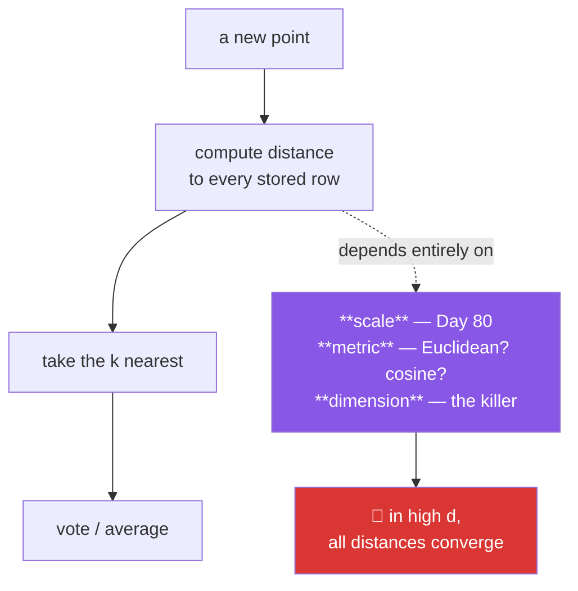

# Day 103 — KNN and the curse of dimensionality

**Phase 12 · Module 12** · ID: **ML-14** (k-nearest neighbours, distance metrics, dimensionality)

> **Yesterday:** Naive Bayes, and the assumption that fails harmlessly.
> **Today:** the simplest possible model — **memorise everything, predict by asking the neighbours** —
> and the phenomenon that quietly destroys it. In high dimensions **every point is nearly equidistant
> from every other**, so "nearest" stops meaning anything. You will measure that, and it matters far
> beyond KNN: it is why Day 202's vector search needs care.
> **Tomorrow:** support vector machines.

```bash
./m start 103 && ./m scaffold 103
```

**Time:** 110 minutes. **Request budget:** 0 model calls.

---

## §1 The story

KNN has no training. It stores the data and, at prediction time, finds the `k` closest rows and takes
a vote. That simplicity makes it useful for a reason beyond convenience: **it is a lower bound worth
knowing.** If a tuned gradient-boosted model cannot beat KNN, your features are the problem.

Everything about it reduces to one word: **close**.



**Scaling is not optional here, and the reason is the starkest yet.** Distance sums squared
differences across features, so a feature measured in thousands contributes a million times more than
one measured in units. **An unscaled KNN is a KNN on your largest-variance column.** Day 80 said
scale, Day 95 said scale, Day 98 said scale — this is the fourth reason and the most direct.

**Then the curse.** As dimensions grow, the distance from a point to its nearest neighbour and to its
farthest neighbour converge. At 500 dimensions the nearest point is only a few percent closer than
the farthest. "Nearest" carries almost no information, and a model built entirely on nearness has
nothing left to stand on.

This is not a KNN quirk. It is a property of high-dimensional space, and it affects clustering (Day
109), anomaly detection, and **every embedding-based retrieval system in Phase 17**. Understanding it
here, with a measurement in front of you, is what makes Day 202's design choices make sense.

`k` is the capacity dial (Day 96): `k = 1` is maximal variance — it memorises noise — and `k = n` is
maximal bias, predicting the global majority for everything.

---

## §2 Setup — run this

```bash
mkdir -p days/day-103/lab
touch days/day-103/lab/neighbours.py
```

`src/setu/models.py` grows today. No new packages.

---

## §3 ML-14 — asking the neighbours

`days/day-103/lab/neighbours.py`:

```python
"""ML-14: KNN from scratch, and the curse measured rather than described."""

from __future__ import annotations

import time

import numpy as np
from sklearn.metrics import accuracy_score
from sklearn.model_selection import train_test_split
from sklearn.neighbors import KNeighborsClassifier

from setu.arrays import make_rng


def blobs(n=2_000, p=4, *, seed=0, separation=2.0):
    rng = make_rng(seed)
    y = (rng.random(n) < 0.5).astype(int)
    centre = np.zeros(p)
    centre[0] = separation
    return rng.normal(0, 1, (n, p)) + np.where(y[:, None] == 1, centre, 0), y


def from_scratch() -> None:
    x, y = blobs()
    x_train, x_test, y_train, y_test = train_test_split(x, y, test_size=0.3, random_state=0)

    def predict(query, k):
        distances = np.sqrt(((x_train - query) ** 2).sum(axis=1))
        nearest = np.argsort(distances)[:k]
        return int(np.bincount(y_train[nearest]).argmax())

    mine = np.array([predict(row, 5) for row in x_test[:400]])
    theirs = KNeighborsClassifier(n_neighbors=5).fit(x_train, y_train).predict(x_test[:400])

    print(f"\n  my accuracy      : {accuracy_score(y_test[:400], mine):.4f}")
    print(f"  sklearn accuracy : {accuracy_score(y_test[:400], theirs):.4f}")
    print(f"  predictions agree: {(mine == theirs).mean():.4f}")

    print("\n  That is the entire algorithm: distance, sort, vote. There is no `fit`")
    print("  beyond storing the data — all the work happens at PREDICTION time, which")
    print("  is the opposite of every other model in this phase.")


def the_cost_is_at_prediction_time() -> None:
    print(f"\n  {'n train':>9} {'fit (ms)':>10} {'predict 500 (ms)':>18}")
    for n in (1_000, 10_000, 50_000):
        x, y = blobs(n=n, p=20)
        query, _ = blobs(n=500, p=20, seed=9)

        start = time.perf_counter()
        model = KNeighborsClassifier(n_neighbors=5, algorithm="brute").fit(x, y)
        fit_time = (time.perf_counter() - start) * 1_000

        start = time.perf_counter()
        model.predict(query)
        predict_time = (time.perf_counter() - start) * 1_000
        print(f"  {n:>9,} {fit_time:>10.2f} {predict_time:>18.2f}")

    print("\n  Fit is free; prediction is O(n·p) per query. This is a LAZY learner, and")
    print("  the trade is exactly inverted from everything else you have built.")
    print("\n  ⚠️ That makes KNN a poor fit for low-latency serving on large data — and")
    print("     it is why Phase 17's vector databases exist (approximate nearest")
    print("     neighbour indexes trade exactness for speed).")


def scale_decides_everything() -> None:
    rng = make_rng(1)
    n = 3_000
    signal = rng.normal(0, 1, n)
    y = (signal > 0).astype(int)

    x = np.c_[signal + rng.normal(0, 0.3, n),          # the informative feature
              rng.normal(0, 1_000, n)]                  # pure noise, huge scale

    x_train, x_test, y_train, y_test = train_test_split(x, y, test_size=0.3, random_state=0)
    scaled_train = (x_train - x_train.mean(axis=0)) / x_train.std(axis=0, ddof=1)
    scaled_test = (x_test - x_train.mean(axis=0)) / x_train.std(axis=0, ddof=1)

    print(f"\n  feature sds: {x.std(axis=0, ddof=1).round(2).tolist()}")
    print(f"    column 0 = signal + noise, column 1 = PURE NOISE at 1000x the scale")

    print(f"\n  {'data':<14} {'accuracy':>10}")
    for label, (train, test) in (("raw", (x_train, x_test)),
                                 ("standardised", (scaled_train, scaled_test))):
        model = KNeighborsClassifier(n_neighbors=15).fit(train, y_train)
        print(f"  {label:<14} {model.score(test, y_test):>10.4f}")

    print("\n  🚨 On raw features the accuracy is near chance. Squared distance sums")
    print("     across columns, so a column with 1000x the sd contributes 1,000,000x")
    print("     the distance. Every neighbour is chosen by the noise column.")
    print("\n  An unscaled KNN is a KNN on your largest-variance feature. That is the")
    print("  fourth distinct reason to scale in this phase, and the most direct.")
    print("\n  ⚠️ Note the scaling used TRAIN statistics on both (Day 80). Fitting the")
    print("     scaler on all the data is a leak.")


def the_curse_measured() -> None:
    rng = make_rng(2)
    n = 1_000

    print(f"\n  uniform random points; distance from a query to its nearest and")
    print(f"  farthest neighbour, as dimensions grow:")
    print(f"\n  {'dims':>6} {'nearest':>10} {'farthest':>10} {'ratio':>8} "
          f"{'contrast':>10}")
    for p in (1, 2, 5, 10, 50, 100, 500, 1_000):
        x = rng.random((n, p))
        query = rng.random(p)
        distances = np.sqrt(((x - query) ** 2).sum(axis=1))
        nearest, farthest = distances.min(), distances.max()
        print(f"  {p:>6} {nearest:>10.4f} {farthest:>10.4f} "
              f"{nearest / farthest:>8.4f} {(farthest - nearest) / nearest:>10.4f}")

    print("\n  🚨 Read the ratio column. At 1 dimension the nearest point is a tiny")
    print("     fraction of the farthest distance. At 1000 dimensions it is ~0.9 —")
    print("     the nearest neighbour is barely closer than the farthest.")
    print("\n  'Contrast' is (farthest − nearest)/nearest, and it goes to ZERO. When")
    print("  contrast vanishes, 'nearest' carries no information, and a model built")
    print("  entirely on nearness has nothing left.")


def volume_concentrates_in_the_shell() -> None:
    rng = make_rng(3)
    n = 200_000

    print(f"\n  fraction of a unit ball's points within 90% of its radius:")
    print(f"  {'dims':>6} {'inner 90%':>12} {'outer shell':>13}")
    for p in (1, 2, 3, 10, 50, 200):
        points = rng.normal(0, 1, (n, p))
        points /= np.linalg.norm(points, axis=1, keepdims=True)
        radii = rng.random(n) ** (1 / p)
        inner = (radii < 0.9).mean()
        print(f"  {p:>6} {inner:>12.4f} {1 - inner:>13.4f}")

    print(f"\n  the theoretical value is 0.9^d: "
          f"{[round(0.9 ** d, 4) for d in (1, 2, 3, 10, 50, 200)]}")

    print("\n  In 200 dimensions essentially EVERY point sits in the outer 10% shell.")
    print("  High-dimensional space is almost entirely surface — there is no 'middle'")
    print("  for points to cluster in, which is the geometric root of the curse.")


def how_much_data_you_would_need() -> None:
    print(f"\n  to keep the same density of points per unit of space:")
    print(f"  {'dims':>6} {'points for 10 per axis-bin':>28}")
    for p in (1, 2, 3, 5, 10):
        print(f"  {p:>6} {10 ** p:>28,}")

    print("\n  Covering 10 dimensions at the density you would have in 1 needs ten")
    print("  billion points. You never have that, so high-dimensional data is ALWAYS")
    print("  sparse, and every neighbourhood is empty.")
    print("\n  This is why 'more features' is not free — each one dilutes the data you")
    print("  already have. Day 96's variance problem, arriving geometrically.")


def knn_degrades_with_dimension() -> None:
    print(f"\n  KNN accuracy as noise dimensions are ADDED to the same real signal:")
    print(f"  {'extra noise dims':>18} {'accuracy':>10}")

    rng = make_rng(4)
    n = 3_000
    signal = rng.normal(0, 1, n)
    y = (signal > 0).astype(int)
    informative = (signal + rng.normal(0, 0.4, n)).reshape(-1, 1)

    for extra in (0, 2, 10, 50, 200):
        x = np.c_[informative, rng.normal(0, 1, (n, extra))]
        x = (x - x.mean(axis=0)) / x.std(axis=0, ddof=1)
        x_train, x_test, y_train, y_test = train_test_split(
            x, y, test_size=0.3, random_state=0, stratify=y
        )
        model = KNeighborsClassifier(n_neighbors=15).fit(x_train, y_train)
        print(f"  {extra:>18} {model.score(x_test, y_test):>10.4f}")

    print("\n  The signal never changed. Adding pure noise dimensions destroys the model,")
    print("  because they contribute to every distance and drown the one column that")
    print("  matters.")
    print("\n  ⚠️ KNN has NO feature selection of its own — unlike a tree (Day 105) or")
    print("     Lasso (Day 98), it cannot ignore a useless column. Feature selection")
    print("     before KNN is mandatory, not an optimisation.")


def k_is_the_capacity_dial() -> None:
    x, y = blobs(n=2_000, p=4, separation=1.4)
    x = (x - x.mean(axis=0)) / x.std(axis=0, ddof=1)
    x_train, x_test, y_train, y_test = train_test_split(x, y, test_size=0.3, random_state=0)

    print(f"\n  {'k':>6} {'train acc':>11} {'test acc':>10} {'gap':>8}")
    for k in (1, 3, 5, 15, 51, 201, len(x_train)):
        model = KNeighborsClassifier(n_neighbors=k).fit(x_train, y_train)
        train = model.score(x_train, y_train)
        test = model.score(x_test, y_test)
        label = "n" if k == len(x_train) else str(k)
        print(f"  {label:>6} {train:>11.4f} {test:>10.4f} {train - test:>8.4f}")

    print("\n  k=1 : training accuracy 1.0 — every point is its own nearest neighbour.")
    print("        That is memorisation, and the gap is pure variance (Day 96).")
    print("  k=n : predicts the global majority for everything. Pure bias.")
    print("\n  ⚠️ k=1 training accuracy of 1.0 is NOT a good sign, and if you ever see")
    print("     a KNN report perfect training accuracy, that is what happened.")
    print("\n  Use an ODD k for binary classification so votes cannot tie.")


def the_metric_is_a_choice() -> None:
    rng = make_rng(5)
    n = 1_500
    x = rng.random((n, 30)) * rng.lognormal(0, 1, (n, 1))     # same direction, varied magnitude
    y = (x[:, 0] / np.linalg.norm(x, axis=1) > np.median(x[:, 0] / np.linalg.norm(x, axis=1))).astype(int)

    x_train, x_test, y_train, y_test = train_test_split(x, y, test_size=0.3, random_state=0)

    print(f"\n  data where DIRECTION matters and magnitude does not:")
    print(f"  {'metric':<14} {'accuracy':>10}")
    for metric in ("euclidean", "manhattan", "cosine"):
        model = KNeighborsClassifier(n_neighbors=15, metric=metric).fit(x_train, y_train)
        print(f"  {metric:<14} {model.score(x_test, y_test):>10.4f}")

    print("\n  Cosine ignores magnitude and compares direction — which is why it is the")
    print("  default for text and embeddings (Phase 17), where document LENGTH should")
    print("  not decide similarity.")
    print("  Manhattan degrades more slowly than Euclidean in high dimensions, because")
    print("  it does not square the differences.")


if __name__ == "__main__":
    from_scratch()
    the_cost_is_at_prediction_time()
    scale_decides_everything()
    the_curse_measured()
    volume_concentrates_in_the_shell()
    how_much_data_you_would_need()
    knn_degrades_with_dimension()
    k_is_the_capacity_dial()
    the_metric_is_a_choice()
```

**Line by line:**

- `from_scratch` — **distance, sort, vote.** There is no `fit` beyond storing the data, and all the
  work happens at prediction time, which is inverted from every other model in this phase.
- `the_cost_is_at_prediction_time` — fit is free, prediction is `O(n·p)` per query. **A lazy learner**,
  and the reason Phase 17's vector databases exist: approximate nearest-neighbour indexes trade
  exactness for latency.
- `scale_decides_everything` — **the fourth and most direct reason to scale.** One informative column
  and one pure-noise column at 1000× the scale, and raw accuracy is near chance. Squared distance sums
  across columns, so 1000× the sd is **a million times** the distance contribution. And note the
  scaling uses train statistics on both (Day 80).
- `the_curse_measured` — **read the ratio column.** At one dimension the nearest point is a small
  fraction of the farthest distance; at 1000 dimensions it is around 0.9. **Contrast goes to zero**,
  and when contrast vanishes "nearest" carries no information.
- `volume_concentrates_in_the_shell` — the geometric root. At 200 dimensions essentially every point
  sits in the outer 10% shell, matching the theoretical `0.9^d`. **High-dimensional space is almost
  entirely surface** — there is no middle for points to occupy.
- `how_much_data_you_would_need` — covering 10 dimensions at 1-dimensional density needs **ten billion
  points**. You never have that, so high-dimensional data is always sparse and every neighbourhood is
  empty. "More features" is never free.
- `knn_degrades_with_dimension` — the signal never changes; adding pure noise dimensions destroys the
  model. **KNN has no feature selection of its own** — unlike a tree (Day 105) or Lasso (Day 98), it
  cannot ignore a useless column, so feature selection before KNN is mandatory.
- `k_is_the_capacity_dial` — `k=1` gives training accuracy 1.0 because **every point is its own nearest
  neighbour**. That is memorisation, and a KNN reporting perfect training accuracy is showing you
  exactly that. Use an **odd k** for binary classification so votes cannot tie.
- `the_metric_is_a_choice` — cosine ignores magnitude and compares direction, which is why it is the
  default for text and embeddings where **document length should not decide similarity**. Manhattan
  degrades more slowly in high dimensions because it does not square the differences.

---

## §4 Build brief

Extend `src/setu/models.py`:

```python
def knn_predict(x_train, y_train, x_query, *, k: int = 5, metric: str = "euclidean",
                weights: str = "uniform", task: str = "classification",
                require_scaled: bool = True) -> dict:
    """TODO(me): distance, sort, vote — with the guards this day earned.

    {"predictions", "neighbour_indices", "neighbour_distances", "k", "metric",
     "warnings": [...]}
    - metric in {'euclidean', 'manhattan', 'cosine'}; else DataError
    - weights='distance' weights votes by 1/d; guard against a zero distance
    - task in {'classification', 'regression'}
    - require_scaled=True raises when feature sds differ by more than 10x, and the
      message must say distance is DOMINATED by the largest-variance column (§3.3) —
      this reason differs from Days 95 and 98, so the message must too
    - WARN when k is even and the task is binary classification (votes can tie)
    - WARN when x_train has more than 30 features, naming the curse and pointing at
      feature selection (§3.7)
    - raise DataError if k > len(x_train), or k < 1
    - vectorise the distance computation; a Python loop over queries is unusable
    """
    raise NotImplementedError


def distance_contrast(x, *, n_queries: int = 100, metric: str = "euclidean",
                      seed: int = 42) -> dict:
    """TODO(me): §3.4 — is 'nearest' still meaningful in this space?

    {"n_features", "mean_nearest", "mean_farthest", "contrast", "ratio",
     "verdict": "meaningful" | "weak" | "meaningless", "recommendation": str}
    - contrast = (farthest − nearest) / nearest, averaged over random queries
    - verdict: contrast > 1.0 meaningful, > 0.3 weak, else meaningless
    - the recommendation must be actionable: reduce dimensions, select features, or
      use a different model class — not merely 'beware the curse'
    - raise DataError with fewer than 2 rows
    """
    raise NotImplementedError


def choose_k(x_train, y_train, *, candidates=None, cv_splits: int = 5,
             seed: int = 42) -> dict:
    """TODO(me): k is the capacity dial (Day 96), so tune it properly.

    {"k", "scores": {k: score}, "train_scores": {k: score}, "warnings": [...]}
    - candidates default to odd values only for binary classification (§3.8)
    - use StratifiedKFold for classification (Day 97) — do not hand-roll the split
    - report TRAIN scores too, so the k=1 memorisation is visible
    - the result must warn that the chosen score is optimistic (Day 96)
    - raise DataError if any candidate exceeds the smallest training fold's size
    """
    raise NotImplementedError


def curse_report(x, *, y=None) -> dict:
    """TODO(me): should you be using a distance-based method here at all?

    {"n_rows", "n_features", "points_per_dimension", "contrast", "verdict",
     "concerns": [...], "suggestion": str}
    - points_per_dimension = n_rows ** (1/n_features) — how densely the space is
      covered; below 2 means essentially no coverage (§3.6)
    - concerns ordered by severity, naming the specific numbers
    - reuse distance_contrast rather than recomputing
    - the suggestion must name a CONCRETE alternative (a tree, a linear model, PCA
      first), because 'use fewer dimensions' is not actionable on its own
    """
    raise NotImplementedError


def assert_scaled_for_distance(x, *, tolerance: float = 10.0,
                               feature_names=None) -> None:
    """TODO(me): raise DataError when distance would be dominated by one column.

    - compare the largest and smallest feature standard deviations
    - the message must name the offending columns AND state the squared effect:
      a 10x sd ratio means a 100x distance contribution (§3.3)
    - this guard belongs on every distance-based method: KNN, k-means (Day 109),
      and any embedding similarity — say so in the docstring
    """
    raise NotImplementedError
```

- `knn_predict`'s scaling message must **differ from Days 95 and 98** again — three guards, three
  distinct reasons, and a copied message teaches the wrong one. Here it is domination of the distance.
- `distance_contrast` returning a **verdict plus an actionable recommendation** is the day's design
  decision: "beware the curse" helps nobody, "reduce to under 30 features or use a tree" does.
- `assert_scaled_for_distance` is deliberately **not KNN-specific**. Day 109's k-means and Phase 17's
  embedding similarity need exactly the same check, and the docstring says so.

---

## §5 The eval that must be able to fail

Add to `tests/test_models.py`:

```python
from sklearn.neighbors import KNeighborsClassifier

from setu.models import (
    assert_scaled_for_distance,
    choose_k,
    curse_report,
    distance_contrast,
    knn_predict,
)


@pytest.fixture
def separable():
    rng = make_rng(0)
    n, p = 1_500, 4
    y = (rng.random(n) < 0.5).astype(int)
    centre = np.zeros(p)
    centre[0] = 2.5
    x = rng.normal(0, 1, (n, p)) + np.where(y[:, None] == 1, centre, 0)
    return x, y


def test_it_matches_sklearn(separable):
    x, y = separable
    query = x[:300]
    mine = knn_predict(x, y, query, k=5)["predictions"]
    theirs = KNeighborsClassifier(n_neighbors=5).fit(x, y).predict(query)
    assert (np.asarray(mine) == theirs).mean() > 0.98


def test_k_one_returns_the_point_itself(separable):
    """Every training point is its own nearest neighbour."""
    x, y = separable
    result = knn_predict(x, y, x[:200], k=1)
    assert (np.asarray(result["predictions"]) == y[:200]).all()


def test_the_neighbours_are_actually_the_nearest(separable):
    x, y = separable
    result = knn_predict(x, y, x[:50], k=7)
    for i, indices in enumerate(result["neighbour_indices"][:10]):
        distances = np.sqrt(((x - x[i]) ** 2).sum(axis=1))
        assert set(indices) == set(np.argsort(distances)[:7])


def test_distances_are_returned_sorted(separable):
    x, y = separable
    distances = knn_predict(x, y, x[:20], k=9)["neighbour_distances"]
    for row in distances:
        assert list(row) == sorted(row)


def test_prediction_is_vectorised(separable):
    """A Python loop over queries is unusable at any real scale."""
    x, y = separable
    start = time.perf_counter()
    knn_predict(x, y, x[:1_000], k=5)
    assert time.perf_counter() - start < 5.0, "are you looping over queries?"


def test_unscaled_features_are_refused_with_the_distance_reason():
    """The third guard, the third distinct reason."""
    rng = make_rng(1)
    n = 800
    x = np.c_[rng.normal(0, 1, n), rng.normal(0, 1_000, n)]
    y = (x[:, 0] > 0).astype(int)

    with pytest.raises(DataError) as info:
        knn_predict(x, y, x[:50], k=5)
    message = str(info.value).lower()
    assert "scal" in message
    assert "distance" in message or "dominat" in message, (
        "the message must explain distance domination, not repeat Days 95 or 98"
    )


def test_scaling_rescues_a_hopeless_model():
    """On raw features every neighbour is chosen by the noise column."""
    rng = make_rng(2)
    n = 3_000
    signal = rng.normal(0, 1, n)
    y = (signal > 0).astype(int)
    x = np.c_[signal + rng.normal(0, 0.3, n), rng.normal(0, 1_000, n)]

    raw = KNeighborsClassifier(n_neighbors=15).fit(x[:2_000], y[:2_000])
    scaled_x = (x - x[:2_000].mean(axis=0)) / x[:2_000].std(axis=0, ddof=1)
    scaled = KNeighborsClassifier(n_neighbors=15).fit(scaled_x[:2_000], y[:2_000])

    assert raw.score(x[2_000:], y[2_000:]) < 0.65
    assert scaled.score(scaled_x[2_000:], y[2_000:]) > 0.85


def test_an_even_k_warns_about_ties(separable):
    x, y = separable
    scaled = (x - x.mean(axis=0)) / x.std(axis=0, ddof=1)
    result = knn_predict(scaled, y, scaled[:20], k=4)
    assert any("tie" in w.lower() or "even" in w.lower() for w in result["warnings"])


def test_high_dimensional_input_warns_about_the_curse():
    rng = make_rng(3)
    x = rng.normal(0, 1, (500, 60))
    y = (rng.random(500) < 0.5).astype(int)
    result = knn_predict(x, y, x[:20], k=5)
    assert any("dimens" in w.lower() or "curse" in w.lower() for w in result["warnings"])


def test_k_larger_than_the_training_set_raises(separable):
    x, y = separable
    with pytest.raises(DataError):
        knn_predict(x, y, x[:10], k=len(x) + 1)


def test_an_unknown_metric_raises(separable):
    x, y = separable
    with pytest.raises(DataError):
        knn_predict(x, y, x[:10], k=5, metric="mahalanobis-ish")


def test_contrast_collapses_with_dimension():
    """The day's centre: 'nearest' stops meaning anything."""
    rng = make_rng(4)
    low = distance_contrast(rng.random((1_000, 2)))
    high = distance_contrast(rng.random((1_000, 500)))

    assert low["contrast"] > high["contrast"] * 10
    assert low["verdict"] == "meaningful"
    assert high["verdict"] == "meaningless"


def test_contrast_is_monotone_in_dimension():
    """A property across many dimensions, not two lucky points."""
    rng = make_rng(5)
    contrasts = [distance_contrast(rng.random((800, p)))["contrast"]
                 for p in (2, 5, 20, 100, 400)]
    assert contrasts == sorted(contrasts, reverse=True)


def test_the_recommendation_is_actionable():
    """'Beware the curse' helps nobody."""
    rng = make_rng(6)
    result = distance_contrast(rng.random((800, 400)))
    recommendation = result["recommendation"].lower()
    assert len(recommendation) > 25
    assert any(token in recommendation for token in
               ("pca", "select", "reduce", "tree", "linear", "fewer"))


def test_contrast_rejects_a_tiny_input():
    with pytest.raises(DataError):
        distance_contrast(np.array([[1.0, 2.0]]))


def test_choose_k_prefers_odd_values_for_binary(separable):
    x, y = separable
    scaled = (x - x.mean(axis=0)) / x.std(axis=0, ddof=1)
    result = choose_k(scaled, y)
    assert all(k % 2 == 1 for k in result["scores"]), "even k allows ties"


def test_choose_k_exposes_the_k_one_memorisation(separable):
    """Training accuracy of 1.0 is not a good sign."""
    x, y = separable
    scaled = (x - x.mean(axis=0)) / x.std(axis=0, ddof=1)
    result = choose_k(scaled, y, candidates=[1, 5, 25])
    assert result["train_scores"][1] == pytest.approx(1.0, abs=1e-9)
    assert result["train_scores"][25] < result["train_scores"][1]


def test_choose_k_warns_the_score_is_optimistic(separable):
    x, y = separable
    scaled = (x - x.mean(axis=0)) / x.std(axis=0, ddof=1)
    assert choose_k(scaled, y)["warnings"]


def test_choose_k_rejects_an_oversized_candidate(separable):
    x, y = separable
    scaled = (x - x.mean(axis=0)) / x.std(axis=0, ddof=1)
    with pytest.raises(DataError):
        choose_k(scaled, y, candidates=[3, len(x)])


def test_noise_dimensions_destroy_knn():
    """KNN cannot ignore a useless column the way a tree or Lasso can."""
    rng = make_rng(7)
    n = 3_000
    signal = rng.normal(0, 1, n)
    y = (signal > 0).astype(int)
    informative = (signal + rng.normal(0, 0.4, n)).reshape(-1, 1)

    scores = []
    for extra in (0, 100):
        x = np.c_[informative, rng.normal(0, 1, (n, extra))]
        x = (x - x.mean(axis=0)) / x.std(axis=0, ddof=1)
        model = KNeighborsClassifier(n_neighbors=15).fit(x[:2_000], y[:2_000])
        scores.append(model.score(x[2_000:], y[2_000:]))

    assert scores[0] > scores[1] + 0.15, "noise dimensions should visibly hurt"


def test_the_curse_report_names_concrete_numbers():
    rng = make_rng(8)
    result = curse_report(rng.normal(0, 1, (500, 200)))
    assert result["concerns"]
    joined = " ".join(result["concerns"])
    assert "200" in joined or "500" in joined, "the concerns must cite the actual shape"


def test_the_curse_report_suggests_a_named_alternative():
    rng = make_rng(9)
    suggestion = curse_report(rng.normal(0, 1, (400, 300)))["suggestion"].lower()
    assert any(token in suggestion for token in ("tree", "linear", "pca", "select"))


def test_low_dimensional_data_is_not_flagged():
    """A report that always warns is useless."""
    rng = make_rng(10)
    result = curse_report(rng.normal(0, 1, (5_000, 3)))
    assert result["verdict"] != "meaningless"


def test_points_per_dimension_is_reported():
    rng = make_rng(11)
    result = curse_report(rng.normal(0, 1, (1_000, 10)))
    assert result["points_per_dimension"] == pytest.approx(1_000 ** 0.1, rel=1e-6)


def test_the_scaling_guard_names_the_squared_effect():
    rng = make_rng(12)
    x = np.c_[rng.normal(0, 1, 300), rng.normal(0, 50, 300)]
    with pytest.raises(DataError) as info:
        assert_scaled_for_distance(x, feature_names=["small", "huge"])
    message = str(info.value)
    assert "huge" in message
    assert "2500" in message or "squar" in message.lower(), (
        "a 50x sd ratio is a 2500x distance contribution — say so"
    )


def test_the_scaling_guard_passes_on_scaled_data(separable):
    x, _ = separable
    assert_scaled_for_distance((x - x.mean(axis=0)) / x.std(axis=0, ddof=1))


def test_the_guard_docstring_covers_other_distance_methods():
    """k-means and embedding similarity need exactly this check."""
    import inspect

    text = inspect.getdoc(assert_scaled_for_distance).lower()
    assert "k-means" in text or "kmeans" in text or "embedding" in text
```

**Line by line:**

- `test_contrast_collapses_with_dimension` — **the day's real assessment.** Contrast at 2 dimensions is
  more than ten times that at 500, and the verdicts flip from `meaningful` to `meaningless`. That is
  the curse as a measured quantity rather than a warning.
- `test_contrast_is_monotone_in_dimension` — a **monotone property across five dimensionalities**,
  which is a structural claim rather than two lucky points.
- `test_scaling_rescues_a_hopeless_model` — two assertions bracketing the same data: below 0.65 raw,
  above 0.85 scaled. **The model was not broken; the distance was.**
- `test_unscaled_features_are_refused_with_the_distance_reason` — the **third** scaling guard in this
  phase, and the test requires a *distance-domination* message rather than Day 95's step-size or Day
  98's penalty-by-units. Three guards, three reasons, three messages.
- `test_the_scaling_guard_names_the_squared_effect` — a 50× sd ratio is a **2500×** distance
  contribution, and the message must say so. The squaring is what makes this guard more urgent than the
  others.
- `test_choose_k_exposes_the_k_one_memorisation` — training accuracy exactly 1.0 at `k=1`, lower at
  `k=25`. **Perfect training accuracy from a KNN is a diagnosis, not an achievement.**
- `test_noise_dimensions_destroy_knn` — a 0.15 drop from adding pure noise columns. **KNN has no
  feature selection**, which is the practical consequence of the curse and distinguishes it from Day
  98's Lasso and Day 105's trees.
- `test_low_dimensional_data_is_not_flagged` — the negative case. A curse report that always warns gets
  ignored within a week.
- `test_the_guard_docstring_covers_other_distance_methods` — the guard is deliberately general, and the
  docstring must say so, because Day 109 and Phase 17 need exactly this check.

```bash
uv run python -m pytest tests/test_models.py -v
```

---

## §6 Request budget

| Resource | Spent today |
|---|---|
| LLM calls | **0** |

---

## §7 Traps

- **Unscaled KNN.** It becomes a KNN on your largest-variance column.
- **Fitting the scaler on all the data.** Day 80's leak.
- **Ignoring dimensionality.** Contrast collapses and "nearest" stops meaning anything.
- **Assuming more features help.** Each one dilutes the space geometrically.
- **KNN without feature selection.** It cannot ignore a useless column.
- **`k = 1`.** Perfect training accuracy is memorisation, not skill.
- **An even `k` on binary classification.** Votes can tie.
- **Euclidean distance on text or embeddings.** Cosine ignores magnitude.
- **KNN for low-latency serving on large data.** Prediction is `O(n·p)` per query.
- **A Python loop over queries.** Unusable; vectorise.
- **Treating this as a KNN-only problem.** It affects k-means and all vector search.

---

## §8 Verify before you code

Written **2026-08-21**:

- <https://scikit-learn.org/stable/modules/neighbors.html> — including the `algorithm` options and
  when ball trees stop helping (which is itself a consequence of the curse).
- <https://scikit-learn.org/stable/modules/generated/sklearn.neighbors.KNeighborsClassifier.html> —
  the `weights` and `metric` parameters.
- <https://scikit-learn.org/stable/auto_examples/neighbors/plot_classification.html> — the decision
  boundary as `k` changes.

---

## §9 Say it in an interview

> "KNN is the simplest thing that works — store everything, find the k closest, vote — and its value
> is partly as a lower bound: if a tuned model can't beat it, the features are the problem, not the
> algorithm. Everything about it depends on the word *close*, which is why two things dominate.
> Scaling, because squared distance sums across features, so a column with a thousand times the
> standard deviation contributes a million times the distance — an unscaled KNN is a KNN on your
> largest-variance column, and I've measured it going from near-chance to 0.9 accuracy with nothing
> but a scaler. And dimensionality, which is the one worth internalising: as dimensions grow, the
> distance to your nearest and farthest neighbours converge. At five hundred dimensions the nearest
> point is only a few percent closer than the farthest, so 'nearest' carries almost no information.
> That's not a KNN quirk — it's a property of high-dimensional space, and it's why vector search over
> embeddings needs approximate indexes and careful dimensionality choices rather than naive nearest
> neighbour."

---

## §10 Done when

Tick [`CHECKLIST.md`](CHECKLIST.md), then `./m check && ./m done 103`.
