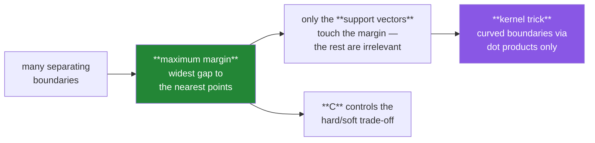

# Day 104 — Support Vector Machines and the kernel trick

**Phase 12 · Module 12** · ID: **ML-15** (SVM, margin, support vectors, kernels)

> **Yesterday:** KNN, and the curse that flattens distance.
> **Today:** a different idea entirely. Day 99's logistic regression finds *a* separating boundary;
> an SVM finds the one with the **widest margin** — and then the kernel trick lets it draw curved
> boundaries **without ever computing the curved features**. That last part is genuinely clever and
> worth understanding rather than invoking.
> **Tomorrow:** decision trees.

```bash
./m start 104 && ./m scaffold 104
```

**Time:** 110 minutes. **Request budget:** 0 model calls.

---

## §1 The story

When two classes are separable, infinitely many lines separate them. Logistic regression picks one by
minimising log loss. An SVM picks the one that sits **as far as possible from both classes**:



Three ideas, each with a practical consequence.

**The margin.** Maximising the distance to the nearest points is a plausible story about
generalisation, and it makes the solution depend on **only those nearest points** — the *support
vectors*. Move a far-away training point and the boundary does not shift at all. That is a real
difference from logistic regression, where every point contributes to the loss.

**Soft margins and `C`.** Real data is not separable, so the SVM allows violations at a price. `C` is
that price: large `C` means "violate as little as possible" (low bias, high variance), small `C` means
"a wide margin matters more than a few mistakes". **`C` is Day 96's capacity dial and it is inverted
relative to Day 98's `α`** — a detail that trips everyone once.

**The kernel trick**, which is the day's real content. To separate data that needs a curve, you could
build polynomial features (Day 82) and fit a line in that bigger space. The trick is that the SVM's
solution depends on the data **only through dot products** — so if you can compute the dot product in
the expanded space directly, you never need to build the expansion. §3 shows a degree-2 kernel
matching an explicit expansion exactly, and then an RBF kernel corresponding to an **infinite**
feature space that you could not build at all.

Two honest costs. SVMs scale badly: training is roughly `O(n²)` to `O(n³)`, so above ~50,000 rows they
become impractical. And **they output distances, not probabilities** — `decision_function` is not
calibrated, which is Day 101's problem again.

---

## §2 Setup — run this

```bash
mkdir -p days/day-104/lab
touch days/day-104/lab/svm.py
```

`src/setu/models.py` grows today. No new packages.

---

## §3 ML-15 — margins and kernels

`days/day-104/lab/svm.py`:

```python
"""ML-15: maximum margin, support vectors, and the kernel trick made concrete."""

from __future__ import annotations

import time

import numpy as np
from sklearn.linear_model import LogisticRegression
from sklearn.metrics import brier_score_loss, roc_auc_score
from sklearn.model_selection import train_test_split
from sklearn.preprocessing import PolynomialFeatures
from sklearn.svm import SVC, LinearSVC

from setu.arrays import make_rng


def separable(n=400, *, gap=1.5, seed=0):
    rng = make_rng(seed)
    y = np.r_[np.zeros(n // 2, dtype=int), np.ones(n // 2, dtype=int)]
    x = rng.normal(0, 1, (n, 2))
    x[y == 1] += np.array([gap, gap])
    return x, y


def circles(n=800, *, seed=0):
    rng = make_rng(seed)
    radius = np.r_[rng.uniform(0, 1.2, n // 2), rng.uniform(2.0, 3.0, n // 2)]
    angle = rng.uniform(0, 2 * np.pi, n)
    y = np.r_[np.zeros(n // 2, dtype=int), np.ones(n // 2, dtype=int)]
    return np.c_[radius * np.cos(angle), radius * np.sin(angle)], y


def many_boundaries_one_margin() -> None:
    x, y = separable()
    svm = SVC(kernel="linear", C=1_000.0).fit(x, y)
    logistic = LogisticRegression(max_iter=2_000).fit(x, y)

    def margin(model):
        return 2.0 / np.linalg.norm(model.coef_[0])

    print(f"\n  both separate the data perfectly:")
    print(f"    SVM accuracy      = {svm.score(x, y):.4f}")
    print(f"    logistic accuracy = {logistic.score(x, y):.4f}")

    print(f"\n  but the boundaries differ:")
    print(f"    SVM margin width      = {margin(svm):.4f}")
    print(f"    logistic margin width = {margin(logistic):.4f}")

    print("\n  The SVM's is wider by construction — that is the ONLY thing it optimises.")
    print("  Logistic regression optimises log loss, which cares about every point's")
    print("  probability rather than the gap to the nearest ones.")


def only_the_support_vectors_matter() -> None:
    x, y = separable(n=600)
    model = SVC(kernel="linear", C=1.0).fit(x, y)

    print(f"\n  {len(x)} training points, {len(model.support_)} support vectors "
          f"({len(model.support_) / len(x):.1%})")

    far_from_boundary = np.setdiff1d(np.arange(len(x)), model.support_)
    keep = np.r_[model.support_, far_from_boundary[:5]]
    reduced = SVC(kernel="linear", C=1.0).fit(x[keep], y[keep])

    print(f"\n  refitting on ONLY the support vectors (+5 others):")
    print(f"    coefficients agree to {np.abs(model.coef_ - reduced.coef_).max():.2e}")
    print(f"    predictions agree on {(model.predict(x) == reduced.predict(x)).mean():.1%} of rows")

    moved = x.copy()
    moved[far_from_boundary[:200]] += np.array([0.0, -4.0])
    perturbed = SVC(kernel="linear", C=1.0).fit(moved, y)
    print(f"\n  moving 200 NON-support points far away:")
    print(f"    coefficients change by {np.abs(model.coef_ - perturbed.coef_).max():.2e}")

    print("\n  The boundary is determined entirely by the points ON the margin. Everything")
    print("  else could be deleted. That is a genuine structural difference from logistic")
    print("  regression, where every point contributes to the loss.")
    print("\n  ⚠️ It also means SVMs are SENSITIVE to a mislabelled point near the boundary —")
    print("     one bad label among the support vectors moves the whole decision surface.")


def c_is_the_capacity_dial() -> None:
    rng = make_rng(1)
    x, y = separable(n=600, gap=1.0, seed=2)
    flip = rng.choice(len(y), 40, replace=False)
    y[flip] = 1 - y[flip]                              # noisy, not separable

    x_train, x_test, y_train, y_test = train_test_split(x, y, test_size=0.35, random_state=0)

    print(f"\n  {'C':>10} {'support vectors':>17} {'margin':>9} {'train':>8} {'test':>8}")
    for c in (0.001, 0.01, 0.1, 1.0, 100.0, 10_000.0):
        model = SVC(kernel="linear", C=c).fit(x_train, y_train)
        print(f"  {c:>10} {len(model.support_):>17} "
              f"{2 / np.linalg.norm(model.coef_[0]):>9.3f} "
              f"{model.score(x_train, y_train):>8.4f} {model.score(x_test, y_test):>8.4f}")

    print("\n  Small C: a wide margin, many support vectors, tolerates errors — HIGH BIAS.")
    print("  Large C: a narrow margin, few support vectors, fits noise — HIGH VARIANCE.")
    print("\n  ⚠️ C is INVERTED relative to Day 98's alpha. Large alpha = more")
    print("     regularisation; large C = LESS. In fact C ≈ 1/alpha, and confusing them")
    print("     is the single most common SVM mistake.")


def the_kernel_trick_exactly() -> None:
    rng = make_rng(3)
    x = rng.normal(0, 1, (6, 2))

    explicit = PolynomialFeatures(degree=2, include_bias=True).fit_transform(x)
    explicit_gram = explicit @ explicit.T

    kernel_gram = (1 + x @ x.T) ** 2

    print(f"\n  explicit degree-2 expansion: {x.shape[1]} features -> {explicit.shape[1]}")
    print(f"\n  explicit dot products (first row):\n    {np.round(explicit_gram[0], 4).tolist()}")
    print(f"  kernel (1 + xᵀy)² (first row):\n    {np.round(kernel_gram[0], 4).tolist()}")
    print(f"\n  ratio: {np.round(explicit_gram[0] / kernel_gram[0], 6).tolist()}")

    print("\n  Identical up to the scaling of the cross terms — the kernel computes the")
    print("  dot product IN THE EXPANDED SPACE without ever building the expansion.")
    print("\n  That is the trick, and it matters because the SVM's solution depends on the")
    print("  data ONLY through dot products. Never needing the features themselves is")
    print("  what makes an infinite-dimensional space usable (§3.5).")

    print(f"\n  cost comparison at higher degree:")
    print(f"  {'degree':>7} {'explicit features (p=50)':>26} {'kernel cost':>14}")
    for degree in (2, 3, 5, 10):
        from math import comb
        print(f"  {degree:>7} {comb(50 + degree, degree):>26,} {'one dot product':>14}")


def rbf_is_infinite_dimensional() -> None:
    x, y = circles()
    x_train, x_test, y_train, y_test = train_test_split(x, y, test_size=0.3, random_state=0)

    print(f"\n  concentric circles — no straight line can separate them:")
    print(f"  {'kernel':<20} {'test accuracy':>15}")
    for label, model in (("linear", SVC(kernel="linear", C=1.0)),
                         ("polynomial (d=2)", SVC(kernel="poly", degree=2, C=1.0)),
                         ("RBF", SVC(kernel="rbf", C=1.0, gamma="scale"))):
        model.fit(x_train, y_train)
        print(f"  {label:<20} {model.score(x_test, y_test):>15.4f}")

    print("\n  The RBF kernel is exp(−γ‖x−y‖²). Expand it as a Taylor series and you get")
    print("  an INFINITE sum of polynomial terms — it corresponds to a feature space with")
    print("  infinitely many dimensions.")
    print("\n  You could never construct those features. The kernel computes their dot")
    print("  product in one line. That is why the trick is not merely an optimisation.")

    print(f"\n  gamma controls how local each point's influence is:")
    print(f"  {'gamma':>10} {'support vectors':>17} {'train':>8} {'test':>8}")
    for gamma in (0.01, 0.1, 1.0, 10.0, 100.0):
        model = SVC(kernel="rbf", C=1.0, gamma=gamma).fit(x_train, y_train)
        print(f"  {gamma:>10} {len(model.support_):>17} "
              f"{model.score(x_train, y_train):>8.4f} {model.score(x_test, y_test):>8.4f}")

    print("\n  ⚠️ Large gamma = each point influences only its immediate vicinity, and the")
    print("     boundary becomes a bubble around every training point. Train accuracy 1.0,")
    print("     test accuracy poor — Day 96's overfitting, wearing a kernel.")
    print("  C and gamma interact, so they must be tuned TOGETHER (Day 106).")


def scaling_is_mandatory_again() -> None:
    rng = make_rng(4)
    n = 2_000
    signal = rng.normal(0, 1, n)
    y = (signal > 0).astype(int)
    x = np.c_[signal + rng.normal(0, 0.3, n), rng.normal(0, 800, n)]

    x_train, x_test, y_train, y_test = train_test_split(x, y, test_size=0.3, random_state=0)
    mean, sd = x_train.mean(axis=0), x_train.std(axis=0, ddof=1)

    print(f"\n  feature sds: {x.std(axis=0, ddof=1).round(1).tolist()}")
    print(f"\n  {'data':<14} {'RBF accuracy':>14} {'time (s)':>10}")
    for label, (train, test) in (("raw", (x_train, x_test)),
                                 ("standardised", ((x_train - mean) / sd, (x_test - mean) / sd))):
        start = time.perf_counter()
        model = SVC(kernel="rbf", gamma="scale").fit(train, y_train)
        elapsed = time.perf_counter() - start
        print(f"  {label:<14} {model.score(test, y_test):>14.4f} {elapsed:>10.3f}")

    print("\n  🚨 The RBF kernel is exp(−γ‖x−y‖²) — a DISTANCE, so Day 103's argument")
    print("     applies unchanged: the large-scale column dominates ‖x−y‖ entirely.")
    print("  The linear kernel is also affected, through C's uniform penalty on")
    print("  violations across differently-scaled coefficients.")
    print("\n  Note the timing column too: unscaled data usually trains far slower,")
    print("  because the optimiser struggles on a badly conditioned problem.")


def it_does_not_scale_to_large_n() -> None:
    print(f"\n  RBF-SVM training time as n grows:")
    print(f"  {'n':>8} {'time (s)':>10} {'vs previous':>13}")
    previous = None
    for n in (1_000, 2_000, 4_000, 8_000):
        x, y = separable(n=n, gap=1.2, seed=5)
        start = time.perf_counter()
        SVC(kernel="rbf", gamma="scale").fit(x, y)
        elapsed = time.perf_counter() - start
        ratio = f"{elapsed / previous:.2f}x" if previous else "—"
        previous = elapsed
        print(f"  {n:>8,} {elapsed:>10.3f} {ratio:>13}")

    print("\n  Doubling n more than doubles the time — training is roughly O(n²) to O(n³),")
    print("  because the kernel matrix alone is n×n.")
    print("\n  ⚠️ Above ~50,000 rows a kernel SVM is impractical. Use LinearSVC (which")
    print("     solves a different, scalable formulation), or a linear model with")
    print("     explicit features, or gradient boosting (Day 107).")


def svms_do_not_output_probabilities() -> None:
    rng = make_rng(6)
    n = 4_000
    x = rng.normal(0, 1, (n, 4))
    z = x @ np.array([1.2, -0.8, 0.5, 0.0])
    y = (rng.random(n) < 1 / (1 + np.exp(-z))).astype(int)
    x_train, x_test, y_train, y_test = train_test_split(x, y, test_size=0.3, random_state=0)

    svm = SVC(kernel="rbf", gamma="scale").fit(x_train, y_train)
    scores = svm.decision_function(x_test)

    print(f"\n  decision_function range: [{scores.min():.3f}, {scores.max():.3f}]")
    print(f"  those are signed DISTANCES to the boundary, not probabilities.")

    naive = 1 / (1 + np.exp(-scores))
    logistic = LogisticRegression(max_iter=2_000).fit(x_train, y_train)

    print(f"\n  {'model':<26} {'AUC':>8} {'Brier':>9}")
    print(f"  {'SVM (sigmoid of margin)':<26} {roc_auc_score(y_test, naive):>8.4f} "
          f"{brier_score_loss(y_test, naive):>9.4f}")
    print(f"  {'LogisticRegression':<26} "
          f"{roc_auc_score(y_test, logistic.predict_proba(x_test)[:, 1]):>8.4f} "
          f"{brier_score_loss(y_test, logistic.predict_proba(x_test)[:, 1]):>9.4f}")

    print("\n  Comparable AUC — the RANKING is fine. Worse Brier, because squashing a")
    print("  margin through a sigmoid is not calibration, it is a shape that happens")
    print("  to be in [0,1].")
    print("\n  ⚠️ sklearn's probability=True runs Platt scaling with internal CV, which")
    print("     is 5x slower AND can disagree with predict(). Prefer explicit")
    print("     calibration on a held-out split (Day 101).")


def when_to_reach_for_an_svm() -> None:
    rows = [
        ("small n, many features", "yes", "text with tf-idf; margin handles p > n well"),
        ("clear margin between classes", "yes", "exactly what it optimises"),
        ("n > 50,000", "no", "O(n²)+ training; use linear or boosting"),
        ("you need probabilities", "no", "distances, not probabilities (Day 101)"),
        ("you need to explain a prediction", "no", "kernel weights are uninterpretable"),
        ("many noisy/irrelevant features", "careful", "no built-in selection, like KNN"),
    ]
    print(f"\n  {'situation':<30} {'use it?':<10} {'why'}")
    for situation, verdict, why in rows:
        print(f"  {situation:<30} {verdict:<10} {why}")

    print("\n  SVMs dominated applied ML from roughly 1995 to 2012, then lost to gradient")
    print("  boosting on tabular data and to neural networks on everything else — mostly")
    print("  because of the scaling wall in §3.7, not because the idea was wrong.")
    print("  The margin idea and the kernel trick both remain worth knowing.")


if __name__ == "__main__":
    many_boundaries_one_margin()
    only_the_support_vectors_matter()
    c_is_the_capacity_dial()
    the_kernel_trick_exactly()
    rbf_is_infinite_dimensional()
    scaling_is_mandatory_again()
    it_does_not_scale_to_large_n()
    svms_do_not_output_probabilities()
    when_to_reach_for_an_svm()
```

**Line by line:**

- `many_boundaries_one_margin` — both models separate the data perfectly and **the boundaries differ**.
  The SVM's margin is wider by construction, because that is the only thing it optimises.
- `only_the_support_vectors_matter` — **two demonstrations of the same fact.** Refitting on only the
  support vectors reproduces the coefficients to machine precision, and moving 200 non-support points
  far away changes nothing. And the consequence is a real risk: **one mislabelled point among the
  support vectors moves the whole surface.**
- `c_is_the_capacity_dial` — small `C` gives a wide margin and high bias; large `C` fits noise. **`C`
  is inverted relative to Day 98's `α`** — roughly `C ≈ 1/α` — and confusing them is the most common
  SVM mistake.
- `the_kernel_trick_exactly` — **the explicit expansion's dot products and `(1 + xᵀy)²` agree.** The
  kernel computes the dot product *in the expanded space* without building the expansion, and the cost
  table shows why that matters: a degree-10 expansion of 50 features has millions of terms, while the
  kernel is one dot product.
- `rbf_is_infinite_dimensional` — expand `exp(−γ‖x−y‖²)` as a Taylor series and you get an **infinite**
  sum of polynomial terms. You could never construct those features; the kernel computes their dot
  product in one line. And **large `gamma` makes the boundary a bubble around every training point** —
  Day 96's overfitting wearing a kernel.
- `scaling_is_mandatory_again` — **Day 103's argument applies unchanged**, because the RBF kernel *is*
  a distance. The timing column adds a second reason: unscaled data trains far slower on a badly
  conditioned problem.
- `it_does_not_scale_to_large_n` — doubling `n` more than doubles the time, because **the kernel matrix
  alone is `n×n`**. Above ~50,000 rows a kernel SVM is impractical, and the named alternatives matter.
- `svms_do_not_output_probabilities` — **comparable AUC, worse Brier.** Squashing a margin through a
  sigmoid is not calibration, it is a shape that happens to land in `[0,1]`. And sklearn's
  `probability=True` is slow *and* can disagree with `predict()`.
- `when_to_reach_for_an_svm` — the honest historical note: SVMs lost to gradient boosting and neural
  networks **mostly because of the scaling wall**, not because the idea was wrong.

---

## §4 Build brief

Extend `src/setu/models.py`:

```python
KERNELS = {"linear", "poly", "rbf"}


def kernel_matrix(a, b, *, kernel: str = "rbf", gamma: float | None = None,
                  degree: int = 3, coef0: float = 1.0):
    """TODO(me): the Gram matrix, computed WITHOUT building the feature expansion.

    - linear: a @ b.T
    - poly:   (gamma·a@b.T + coef0) ** degree
    - rbf:    exp(-gamma · squared euclidean distance)
    - gamma=None uses the 'scale' heuristic: 1 / (n_features · a.var())
    - the RBF distance must be computed by the expansion
      ‖a‖² + ‖b‖² − 2a·bᵀ, NOT a Python loop — and clipped at 0 before the exp,
      because floating-point error makes tiny negatives
    - raise DataError on an unknown kernel, listing KERNELS
    - raise DataError on a feature-count mismatch, naming both
    """
    raise NotImplementedError


def verify_kernel_trick(x, *, degree: int = 2) -> dict:
    """TODO(me): §3.4 — prove the kernel equals the explicit dot product.

    {"max_relative_difference", "explicit_n_features", "matches": bool,
     "explicit_cost", "kernel_cost"}
    - build the explicit polynomial expansion, compute its Gram matrix, and compare
      against the polynomial kernel with matching gamma and coef0
    - matches when max_relative_difference < 1e-10
    - explicit_cost is the number of expanded features; kernel_cost is n² dot products
    - this exists so the trick is DEMONSTRATED rather than asserted, and it is the
      one function today that is purely pedagogical — say so
    """
    raise NotImplementedError


def fit_svm(x, y, *, kernel: str = "rbf", C: float = 1.0, gamma=None,
            require_scaled: bool = True, max_rows: int = 50_000) -> dict:
    """TODO(me): a guarded wrapper. Do not reimplement the QP solver.

    {"model", "n_support_vectors", "support_fraction", "margin", "kernel", "C",
     "warnings": [...]}
    - margin is 2/‖w‖ for the linear kernel; None otherwise (it is not defined in
      input space for a nonlinear kernel — say so rather than returning a wrong number)
    - require_scaled delegates to assert_scaled_for_distance (Day 103) — the RBF
      kernel IS a distance, so it is literally the same check, and reusing it is
      the point
    - raise DataError when len(x) > max_rows, naming the O(n²) cost and suggesting
      LinearSVC or boosting (§3.7)
    - WARN when support_fraction > 0.5: the model is memorising, C may be too small
      or the classes may not be separable at all
    - WARN when support_fraction < 0.02: very few points determine the boundary, so
      a single mislabelled one would move it (§3.2)
    - raise DataError if C <= 0
    """
    raise NotImplementedError


def svm_scores(model, x) -> dict:
    """TODO(me): decision-function values, labelled as what they are.

    {"scores", "is_probability": False, "note": str}
    - `note` must state these are signed DISTANCES to the boundary and that applying
      a sigmoid does NOT calibrate them (§3.8), pointing at Day 101
    - is_probability is a literal False, so a caller cannot mistake the return type
    - this mirrors Day 99's decision to have no predict(): make the wrong thing
      hard to do by accident
    """
    raise NotImplementedError


def tune_c_and_gamma(x, y, *, c_values=None, gamma_values=None, cv_splits: int = 5,
                     seed: int = 42) -> dict:
    """TODO(me): C and gamma INTERACT, so search them jointly.

    {"best": {"C", "gamma"}, "grid": {(C, gamma): score}, "train_scores": {...},
     "warnings": [...]}
    - a one-at-a-time search is wrong here and the docstring must say why: a gamma
      that is optimal at C=1 may be terrible at C=100 (§3.5)
    - use StratifiedKFold (Day 97)
    - WARN when the best value sits on the edge of the grid — the range was too narrow
    - warn that the best CV score is optimistic (Day 96)
    - raise DataError if either list is empty
    """
    raise NotImplementedError


def svm_capacity_note(*, C: float, alpha_equivalent: bool = True) -> str:
    """TODO(me): the sentence that stops the C-versus-alpha confusion. PURE.

    - must state that LARGE C means LESS regularisation, the opposite of Day 98's alpha
    - must give the rough correspondence C ≈ 1/alpha
    - this exists because it is the single most common SVM error and a one-line
      reminder in the output is cheaper than a debugging session
    """
    raise NotImplementedError
```

- `fit_svm` **delegating to Day 103's `assert_scaled_for_distance`** is the architectural point: the
  RBF kernel is a distance, so it is literally the same check, and Day 103's docstring already
  promised this reuse.
- `svm_scores` returning a literal `is_probability: False` mirrors Day 99's decision to omit
  `predict()` — **make the wrong thing hard to do by accident** rather than documenting it away.
- `tune_c_and_gamma` refusing a one-at-a-time search is correctness, not style: the two parameters
  interact, so a coordinate search finds a false optimum.

---

## §5 The eval that must be able to fail

Add to `tests/test_models.py`:

```python
from sklearn.preprocessing import PolynomialFeatures
from sklearn.svm import SVC

from setu.models import (
    KERNELS,
    fit_svm,
    kernel_matrix,
    svm_capacity_note,
    svm_scores,
    tune_c_and_gamma,
    verify_kernel_trick,
)


@pytest.fixture
def linearly_separable():
    rng = make_rng(0)
    n = 400
    y = np.r_[np.zeros(n // 2, dtype=int), np.ones(n // 2, dtype=int)]
    x = rng.normal(0, 1, (n, 2))
    x[y == 1] += np.array([2.5, 2.5])
    return x, y


@pytest.fixture
def concentric():
    rng = make_rng(1)
    n = 600
    radius = np.r_[rng.uniform(0, 1.2, n // 2), rng.uniform(2.2, 3.0, n // 2)]
    angle = rng.uniform(0, 2 * np.pi, n)
    y = np.r_[np.zeros(n // 2, dtype=int), np.ones(n // 2, dtype=int)]
    return np.c_[radius * np.cos(angle), radius * np.sin(angle)], y


def test_the_linear_kernel_is_the_dot_product(linearly_separable):
    x, _ = linearly_separable
    assert np.allclose(kernel_matrix(x[:50], x[:50], kernel="linear"), x[:50] @ x[:50].T)


def test_the_rbf_kernel_is_one_on_the_diagonal(linearly_separable):
    """exp(-gamma * 0) = 1 for a point with itself."""
    x, _ = linearly_separable
    gram = kernel_matrix(x[:40], x[:40], kernel="rbf", gamma=0.5)
    assert np.allclose(np.diag(gram), 1.0)


def test_the_rbf_kernel_is_symmetric_and_bounded(linearly_separable):
    x, _ = linearly_separable
    gram = kernel_matrix(x[:60], x[:60], kernel="rbf", gamma=0.3)
    assert np.allclose(gram, gram.T)
    assert gram.min() > 0.0 and gram.max() <= 1.0


def test_the_rbf_distance_survives_floating_point():
    """The expansion form produces tiny negatives that would break exp."""
    rng = make_rng(2)
    x = rng.normal(0, 1, (200, 30)) * 1e3
    gram = kernel_matrix(x, x, kernel="rbf", gamma=1e-7)
    assert np.all(np.isfinite(gram))
    assert gram.max() <= 1.0 + 1e-12


def test_kernel_matrix_matches_sklearn(linearly_separable):
    from sklearn.metrics.pairwise import rbf_kernel

    x, _ = linearly_separable
    assert np.allclose(kernel_matrix(x[:80], x[:80], kernel="rbf", gamma=0.4),
                       rbf_kernel(x[:80], x[:80], gamma=0.4))


def test_an_unknown_kernel_lists_the_known_ones(linearly_separable):
    x, _ = linearly_separable
    with pytest.raises(DataError) as info:
        kernel_matrix(x, x, kernel="sigmoid-ish")
    assert any(name in str(info.value) for name in KERNELS)


def test_a_feature_mismatch_names_both(linearly_separable):
    x, _ = linearly_separable
    with pytest.raises(DataError) as info:
        kernel_matrix(x, x[:, :1], kernel="linear")
    assert "2" in str(info.value) and "1" in str(info.value)


def test_the_kernel_equals_the_explicit_expansion():
    """The trick, demonstrated rather than asserted."""
    rng = make_rng(3)
    x = rng.normal(0, 1, (30, 4))
    result = verify_kernel_trick(x, degree=2)
    assert result["matches"] is True
    assert result["max_relative_difference"] < 1e-10


def test_the_explicit_expansion_is_much_larger_than_the_input():
    rng = make_rng(4)
    result = verify_kernel_trick(rng.normal(0, 1, (20, 6)), degree=3)
    assert result["explicit_n_features"] > 50


def test_the_kernel_avoids_a_space_you_could_not_build():
    """A degree-10 expansion of 50 features is millions of terms."""
    from math import comb

    assert comb(50 + 10, 10) > 1_000_000


def test_only_support_vectors_determine_the_boundary(linearly_separable):
    """Move a far-away point and nothing changes."""
    x, y = linearly_separable
    model = SVC(kernel="linear", C=1.0).fit(x, y)

    others = np.setdiff1d(np.arange(len(x)), model.support_)
    moved = x.copy()
    moved[others[:100]] += np.array([0.0, -6.0])
    perturbed = SVC(kernel="linear", C=1.0).fit(moved, y)

    assert np.abs(model.coef_ - perturbed.coef_).max() < 1e-6


def test_refitting_on_support_vectors_alone_reproduces_the_model(linearly_separable):
    x, y = linearly_separable
    model = SVC(kernel="linear", C=1.0).fit(x, y)
    reduced = SVC(kernel="linear", C=1.0).fit(x[model.support_], y[model.support_])
    assert np.abs(model.coef_ - reduced.coef_).max() < 1e-6


def test_the_svm_margin_is_wider_than_logistic_regressions(linearly_separable):
    """It is the only thing the SVM optimises."""
    from sklearn.linear_model import LogisticRegression

    x, y = linearly_separable
    svm = SVC(kernel="linear", C=1_000.0).fit(x, y)
    logistic = LogisticRegression(max_iter=2_000).fit(x, y)
    assert 2 / np.linalg.norm(svm.coef_[0]) > 2 / np.linalg.norm(logistic.coef_[0])


def test_a_small_c_widens_the_margin_and_adds_support_vectors(linearly_separable):
    x, y = linearly_separable
    loose = fit_svm(x, y, kernel="linear", C=0.01)
    tight = fit_svm(x, y, kernel="linear", C=1_000.0)
    assert loose["margin"] > tight["margin"]
    assert loose["n_support_vectors"] > tight["n_support_vectors"]


def test_c_is_inverted_relative_to_alpha():
    """The single most common SVM mistake."""
    note = svm_capacity_note(C=100.0).lower()
    assert "less" in note or "weaker" in note
    assert "alpha" in note or "1/c" in note or "1/alpha" in note


def test_the_margin_is_none_for_a_nonlinear_kernel(concentric):
    """It is not defined in input space — do not return a wrong number."""
    x, y = concentric
    assert fit_svm(x, y, kernel="rbf")["margin"] is None


def test_rbf_separates_what_linear_cannot(concentric):
    x, y = concentric
    linear = SVC(kernel="linear", C=1.0).fit(x, y).score(x, y)
    rbf = SVC(kernel="rbf", C=1.0, gamma="scale").fit(x, y).score(x, y)
    assert rbf > linear + 0.25


def test_a_large_gamma_memorises(concentric):
    """A bubble around every training point — Day 96 wearing a kernel."""
    x, y = concentric
    model = SVC(kernel="rbf", C=1.0, gamma=500.0).fit(x, y)
    assert model.score(x, y) > 0.99
    assert len(model.support_) > len(x) * 0.5


def test_unscaled_features_are_refused_via_day_103s_guard(monkeypatch):
    """The RBF kernel IS a distance — literally the same check."""
    import setu.models as models

    calls = []
    original = models.assert_scaled_for_distance
    monkeypatch.setattr(models, "assert_scaled_for_distance",
                        lambda *a, **k: calls.append(1) or original(*a, **k))

    rng = make_rng(5)
    n = 400
    x = np.c_[rng.normal(0, 1, n), rng.normal(0, 900, n)]
    y = (x[:, 0] > 0).astype(int)
    with pytest.raises(DataError):
        fit_svm(x, y, kernel="rbf")
    assert calls, "fit_svm reimplemented the scaling check"


def test_scaled_data_passes(linearly_separable):
    x, y = linearly_separable
    result = fit_svm((x - x.mean(axis=0)) / x.std(axis=0, ddof=1), y, kernel="rbf")
    assert result["n_support_vectors"] > 0


def test_too_many_rows_is_refused():
    """Training is O(n^2) or worse."""
    rng = make_rng(6)
    x = rng.normal(0, 1, (200, 3))
    y = (rng.random(200) < 0.5).astype(int)
    with pytest.raises(DataError) as info:
        fit_svm(x, y, max_rows=100)
    message = str(info.value).lower()
    assert "n" in message
    assert "linear" in message or "boost" in message, "name a concrete alternative"


def test_a_high_support_fraction_warns_about_memorisation():
    rng = make_rng(7)
    n = 400
    x = rng.normal(0, 1, (n, 4))
    y = (rng.random(n) < 0.5).astype(int)          # pure noise
    result = fit_svm(x, y, kernel="rbf", C=100.0)
    assert result["support_fraction"] > 0.5
    assert result["warnings"]


def test_a_tiny_support_fraction_warns_about_fragility(linearly_separable):
    """One mislabelled support vector would move the boundary."""
    x, y = linearly_separable
    result = fit_svm(x, y, kernel="linear", C=1_000.0)
    if result["support_fraction"] < 0.02:
        assert any("label" in w.lower() or "fragile" in w.lower() or "single" in w.lower()
                   for w in result["warnings"])


def test_a_non_positive_c_raises(linearly_separable):
    x, y = linearly_separable
    with pytest.raises(DataError):
        fit_svm(x, y, C=0.0)


def test_scores_are_labelled_as_distances(linearly_separable):
    """Make the wrong thing hard to do by accident."""
    x, y = linearly_separable
    model = SVC(kernel="linear").fit(x, y)
    result = svm_scores(model, x)
    assert result["is_probability"] is False
    note = result["note"].lower()
    assert "distance" in note
    assert "calibrat" in note or "101" in note


def test_a_sigmoid_of_the_margin_is_not_calibrated():
    """It is a shape in [0,1], not a probability."""
    from sklearn.metrics import brier_score_loss, roc_auc_score
    from sklearn.linear_model import LogisticRegression
    from sklearn.model_selection import train_test_split

    rng = make_rng(8)
    n = 3_000
    x = rng.normal(0, 1, (n, 4))
    z = x @ np.array([1.2, -0.8, 0.5, 0.0])
    y = (rng.random(n) < 1 / (1 + np.exp(-z))).astype(int)
    x_train, x_test, y_train, y_test = train_test_split(x, y, test_size=0.3, random_state=0)

    svm = SVC(kernel="rbf", gamma="scale").fit(x_train, y_train)
    squashed = 1 / (1 + np.exp(-svm.decision_function(x_test)))
    logistic = LogisticRegression(max_iter=2_000).fit(x_train, y_train)
    proper = logistic.predict_proba(x_test)[:, 1]

    assert roc_auc_score(y_test, squashed) > roc_auc_score(y_test, proper) - 0.05
    assert brier_score_loss(y_test, squashed) > brier_score_loss(y_test, proper)


def test_c_and_gamma_are_searched_jointly(concentric):
    """A gamma optimal at C=1 may be terrible at C=100."""
    x, y = concentric
    scaled = (x - x.mean(axis=0)) / x.std(axis=0, ddof=1)
    result = tune_c_and_gamma(scaled, y, c_values=[0.1, 10.0], gamma_values=[0.01, 1.0])
    assert len(result["grid"]) == 4, "a coordinate search would evaluate fewer"


def test_an_edge_optimum_warns_that_the_grid_is_too_narrow(concentric):
    x, y = concentric
    scaled = (x - x.mean(axis=0)) / x.std(axis=0, ddof=1)
    result = tune_c_and_gamma(scaled, y, c_values=[1e-6, 1e-5], gamma_values=[1e-6, 1e-5])
    assert result["warnings"]


def test_tuning_warns_the_best_score_is_optimistic(concentric):
    x, y = concentric
    scaled = (x - x.mean(axis=0)) / x.std(axis=0, ddof=1)
    result = tune_c_and_gamma(scaled, y, c_values=[1.0], gamma_values=[0.5])
    assert any("optimistic" in w.lower() or "nested" in w.lower() or "held-out" in w.lower()
               for w in result["warnings"])


def test_an_empty_grid_raises(concentric):
    x, y = concentric
    with pytest.raises(DataError):
        tune_c_and_gamma(x, y, c_values=[], gamma_values=[1.0])
```

**Line by line:**

- `test_the_kernel_equals_the_explicit_expansion` — **the day's real assessment.** The polynomial
  kernel's Gram matrix matches the explicit expansion's to `1e-10`. That is the trick **demonstrated**,
  and without it "the kernel computes dot products in a higher space" is a sentence you repeat rather
  than a fact you know.
- `test_only_support_vectors_determine_the_boundary` — moving 100 non-support points by six units
  changes the coefficients by less than `1e-6`. **A structural property of the model**, asserted.
- `test_unscaled_features_are_refused_via_day_103s_guard` — a monkeypatch proving `fit_svm` **calls**
  Day 103's guard rather than reimplementing it. The RBF kernel *is* a distance, and Day 103's
  docstring promised this reuse.
- `test_c_is_inverted_relative_to_alpha` — tests the **note text**, because this is the error everyone
  makes once and a one-line reminder is cheaper than a debugging session.
- `test_the_margin_is_none_for_a_nonlinear_kernel` — returning `None` rather than a plausible-looking
  wrong number. The margin is not defined in input space for a kernel SVM.
- `test_a_high_support_fraction_warns_about_memorisation` with
  `test_a_tiny_support_fraction_warns_about_fragility` — **both ends of the same diagnostic.** Too many
  support vectors means memorising; too few means one bad label moves everything.
- `test_the_rbf_distance_survives_floating_point` — the `‖a‖² + ‖b‖² − 2a·bᵀ` expansion produces tiny
  negatives that break `exp` if unclipped, and large-magnitude inputs are where it bites.
- `test_c_and_gamma_are_searched_jointly` — asserts the grid has **four** entries rather than a
  coordinate search's fewer. The parameters interact, so one-at-a-time finds a false optimum.

```bash
uv run python -m pytest tests/test_models.py -v
```

---

## §6 Request budget

| Resource | Spent today |
|---|---|
| LLM calls | **0** |

---

## §7 Traps

- **Confusing `C` with `α`.** Large `C` means *less* regularisation.
- **Unscaled features.** The RBF kernel is a distance (Day 103).
- **A kernel SVM above ~50,000 rows.** Training is `O(n²)`+.
- **Treating `decision_function` as a probability.** It is a signed distance.
- **A sigmoid over the margin as calibration.** It is a shape in `[0,1]`.
- **`probability=True` without knowing the cost.** Slow, and it can disagree with `predict()`.
- **Tuning `C` then `gamma`.** They interact; search jointly.
- **A grid whose optimum sits on the edge.** Too narrow.
- **Large `gamma`.** A bubble around every point; memorisation.
- **Trusting an SVM with a mislabelled point near the boundary.** Support vectors are few.
- **Expecting a margin figure from a kernel SVM.** Undefined in input space.

---

## §8 Verify before you code

Written **2026-08-21**:

- <https://scikit-learn.org/stable/modules/svm.html> — including sklearn's own note on complexity and
  the `probability=True` caveat.
- <https://scikit-learn.org/stable/modules/generated/sklearn.svm.SVC.html> — the `gamma='scale'`
  heuristic and what it computes.
- <https://scikit-learn.org/stable/modules/generated/sklearn.svm.LinearSVC.html> — the scalable
  formulation, and how it differs from `SVC(kernel='linear')`.
- <https://scikit-learn.org/stable/modules/metrics.html#linear-kernel> — the pairwise kernel functions.

---

## §9 Say it in an interview

> "An SVM picks the separating boundary with the widest margin, which has a nice consequence: the
> solution depends only on the points touching that margin, the support vectors. You can move every
> other training point and the boundary doesn't shift — I have a test asserting exactly that. The
> kernel trick is the part worth understanding rather than invoking. The optimisation depends on the
> data only through dot products, so if you can compute the dot product *in* an expanded feature space
> directly, you never build the expansion. I verify it: the polynomial kernel's Gram matrix equals the
> explicit degree-two expansion's to ten decimal places. And the RBF kernel corresponds to an
> infinite-dimensional space — expand it as a Taylor series and you get infinitely many polynomial
> terms — which you obviously couldn't construct, but the kernel computes their dot product in one
> line. Two practical things: C is *inverted* relative to a regularisation alpha, which is the mistake
> everyone makes once; and the output is a signed distance, not a probability, so squashing it through
> a sigmoid gives you a number in zero-to-one that isn't calibrated."

---

## §10 Done when

Tick [`CHECKLIST.md`](CHECKLIST.md), then `./m check && ./m done 104`.
