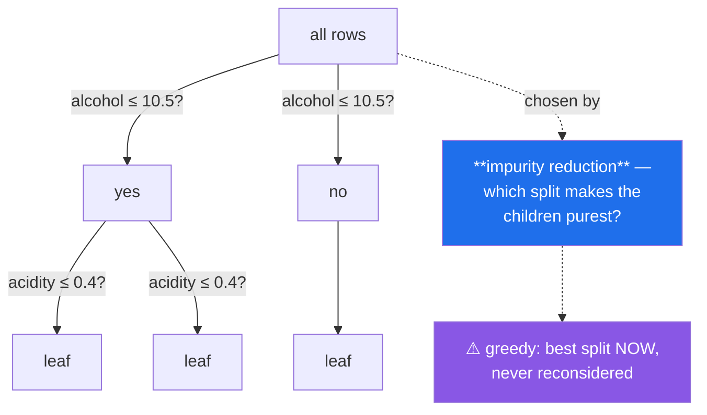

# Day 105 — Decision trees: entropy, Gini, and pruning

**Phase 12 · Module 12** · ID: **ML-16** (decision trees, splitting criteria, pruning)

> **Yesterday:** SVMs and the kernel trick.
> **Today:** the model that needs **no scaling at all** — the first in this phase — and that handles
> interactions and non-linearity without being told to. It is also the model that overfits most
> eagerly, and the one whose famous `feature_importances_` is **biased in a way almost nobody
> mentions.**
> **Tomorrow:** hyperparameter search, and Phase 12 closes.

```bash
./m start 105 && ./m scaffold 105
```

**Time:** 110 minutes. **Request budget:** 0 model calls.

---

## §1 The story

Every model so far drew a boundary in the whole feature space at once. A tree does something
different: it asks one question about one feature, splits the data, and recurses.



**Splits are chosen by impurity reduction.** Gini and entropy both measure how mixed a node is; the
tree tries every feature and every threshold and takes whichever split reduces the weighted impurity
most. That is it — the algorithm is a loop and an argmax.

Four consequences, and each is a genuine difference from everything in this phase:

**No scaling needed.** A split is `feature ≤ threshold`, and that comparison is unchanged by any
monotonic rescaling. After four days of scaling guards, this one genuinely does not need one — and
knowing *why* is more useful than knowing *that*.

**Interactions come free.** A tree that splits on `alcohol` and then on `acidity` within one branch
has expressed "acidity matters, but only when alcohol is low" without anyone constructing an
interaction term (Day 82).

**It overfits completely.** Grown without limits, a tree puts every training row in its own leaf and
reaches 100% training accuracy — Day 96's memorisation in its purest form. **Pruning is not optional**,
and cost-complexity pruning is the principled version.

**Greedy is not optimal.** The best split now can lead to a worse tree overall, and finding the
globally optimal tree is NP-hard. Trees are also **unstable**: change a few rows and the top split can
flip, producing a completely different-looking tree. That instability is exactly what Day 107's
ensembles exploit.

And the one to carry forward: **`feature_importances_` is biased toward high-cardinality features.**
A continuous column offers hundreds of candidate thresholds, so it wins splits by sheer opportunity.
§3 measures this on a column that is **pure noise**.

---

## §2 Setup — run this

```bash
mkdir -p days/day-105/lab
touch days/day-105/lab/trees.py
```

`src/setu/models.py` grows today. No new packages.

---

## §3 ML-16 — splitting

`days/day-105/lab/trees.py`:

```python
"""ML-16: trees from scratch — impurity, pruning, and the importance bias."""

from __future__ import annotations

import numpy as np
from sklearn.inspection import permutation_importance
from sklearn.model_selection import train_test_split
from sklearn.tree import DecisionTreeClassifier, export_text

from setu.arrays import make_rng


def data(n=2_000, *, seed=0):
    rng = make_rng(seed)
    alcohol = rng.uniform(8, 15, n)
    acidity = rng.uniform(0.1, 1.0, n)
    good = ((alcohol > 11) & (acidity < 0.5)) | (alcohol > 13.5)
    y = (rng.random(n) < np.where(good, 0.85, 0.15)).astype(int)
    return np.c_[alcohol, acidity], y


def impurity_measures() -> None:
    print(f"\n  {'P(class 1)':>11} {'Gini':>8} {'entropy':>9} {'misclassification':>19}")
    for p in (0.0, 0.1, 0.25, 0.5, 0.75, 0.9, 1.0):
        gini = 1 - (p**2 + (1 - p) ** 2)
        entropy = 0.0 if p in (0.0, 1.0) else -(p * np.log2(p) + (1 - p) * np.log2(1 - p))
        error = min(p, 1 - p)
        print(f"  {p:>11.2f} {gini:>8.4f} {entropy:>9.4f} {error:>19.4f}")

    print("\n  All three are ZERO at a pure node and MAXIMAL at a 50/50 split.")
    print("  Entropy peaks at 1.0 (one bit); Gini at 0.5.")
    print("\n  Gini and entropy agree on the ranking of splits almost always — Gini is")
    print("  the default because it avoids a logarithm, and it is marginally faster.")
    print("  Misclassification error is NOT used for growing, because it is insensitive")
    print("  to changes that do not flip the majority — it can score two very different")
    print("  splits identically.")


def choosing_a_split_by_hand() -> None:
    x, y = data(n=800)

    def gini(labels):
        if len(labels) == 0:
            return 0.0
        p = labels.mean()
        return 1 - (p**2 + (1 - p) ** 2)

    parent = gini(y)
    print(f"\n  parent Gini = {parent:.4f} ({len(y)} rows, {y.mean():.1%} positive)")

    best = None
    print(f"\n  {'feature':>9} {'threshold':>11} {'left n':>8} {'right n':>9} "
          f"{'weighted':>10} {'gain':>8}")
    for feature in (0, 1):
        for threshold in np.quantile(x[:, feature], np.linspace(0.1, 0.9, 9)):
            left = y[x[:, feature] <= threshold]
            right = y[x[:, feature] > threshold]
            weighted = (len(left) * gini(left) + len(right) * gini(right)) / len(y)
            gain = parent - weighted
            if best is None or gain > best[0]:
                best = (gain, feature, threshold)
            if threshold in np.quantile(x[:, feature], [0.3, 0.5, 0.7]):
                print(f"  {feature:>9} {threshold:>11.4f} {len(left):>8} {len(right):>9} "
                      f"{weighted:>10.4f} {gain:>8.4f}")

    print(f"\n  best split: feature {best[1]} ≤ {best[2]:.4f}, gain = {best[0]:.4f}")

    tree = DecisionTreeClassifier(max_depth=1).fit(x, y)
    print(f"  sklearn's root: feature {tree.tree_.feature[0]} ≤ "
          f"{tree.tree_.threshold[0]:.4f}")

    print("\n  The algorithm is: try every feature, try every threshold, take the best.")
    print("  Weighting by child SIZE is essential — a perfectly pure child holding two")
    print("  rows is worth far less than a mostly-pure child holding two hundred.")


def no_scaling_required() -> None:
    x, y = data(n=3_000)
    x_train, x_test, y_train, y_test = train_test_split(x, y, test_size=0.3, random_state=0)

    scaled_train = (x_train - x_train.mean(axis=0)) / x_train.std(axis=0, ddof=1)
    scaled_test = (x_test - x_train.mean(axis=0)) / x_train.std(axis=0, ddof=1)
    wild = x_train.copy()
    wild[:, 1] *= 10_000
    wild_test = x_test.copy()
    wild_test[:, 1] *= 10_000

    print(f"\n  {'data':<22} {'test accuracy':>15}")
    for label, (train, test) in (("raw", (x_train, x_test)),
                                 ("standardised", (scaled_train, scaled_test)),
                                 ("one column x10,000", (wild, wild_test))):
        model = DecisionTreeClassifier(max_depth=5, random_state=0).fit(train, y_train)
        print(f"  {label:<22} {model.score(test, y_test):>15.4f}")

    print("\n  ✅ Identical. A split is 'feature ≤ threshold', and that comparison is")
    print("     unchanged by ANY monotonic rescaling — the threshold just moves with it.")
    print("\n  This is the first model in Phase 12 that needs no scaling guard, and after")
    print("  Days 80, 95, 98 and 103 it is worth knowing exactly WHY it is exempt.")
    print("  ⚠️ It also means a tree cannot see 'x is large relative to y' unless you")
    print("     build that feature yourself (Day 82) — axis-aligned splits only.")


def interactions_come_free() -> None:
    x, y = data(n=4_000)
    from sklearn.linear_model import LogisticRegression

    x_train, x_test, y_train, y_test = train_test_split(x, y, test_size=0.3, random_state=0)

    print(f"\n  the truth is an INTERACTION: good if (alcohol>11 AND acidity<0.5)")
    print(f"                               or alcohol>13.5")
    print(f"\n  {'model':<34} {'test accuracy':>15}")
    print(f"  {'logistic (no interaction term)':<34} "
          f"{LogisticRegression(max_iter=2_000).fit(x_train, y_train).score(x_test, y_test):>15.4f}")
    print(f"  {'decision tree (depth 4)':<34} "
          f"{DecisionTreeClassifier(max_depth=4, random_state=0).fit(x_train, y_train).score(x_test, y_test):>15.4f}")

    tree = DecisionTreeClassifier(max_depth=3, random_state=0).fit(x_train, y_train)
    print(f"\n  the tree found it unaided:\n")
    print("    " + export_text(tree, feature_names=["alcohol", "acidity"]).replace("\n", "\n    "))

    print("  Splitting on acidity WITHIN a branch already split on alcohol IS the")
    print("  interaction. Nobody constructed a product term (Day 82).")


def it_overfits_completely() -> None:
    x, y = data(n=1_500)
    x_train, x_test, y_train, y_test = train_test_split(x, y, test_size=0.35, random_state=0)

    print(f"\n  {'max_depth':>11} {'leaves':>8} {'train':>8} {'test':>8} {'gap':>8}")
    for depth in (1, 2, 3, 5, 10, 20, None):
        model = DecisionTreeClassifier(max_depth=depth, random_state=0).fit(x_train, y_train)
        train = model.score(x_train, y_train)
        test = model.score(x_test, y_test)
        label = "none" if depth is None else str(depth)
        print(f"  {label:>11} {model.get_n_leaves():>8} {train:>8.4f} {test:>8.4f} "
              f"{train - test:>8.4f}")

    print("\n  🚨 Unlimited depth gives training accuracy 1.0 — every training row ends")
    print("     in its own leaf. That is Day 96's memorisation in its purest form, and")
    print("     the test accuracy is far worse than a depth-3 tree's.")
    print("\n  An unpruned tree is not a model, it is a lookup table.")


def cost_complexity_pruning() -> None:
    x, y = data(n=2_500)
    x_train, x_test, y_train, y_test = train_test_split(x, y, test_size=0.35, random_state=0)

    full = DecisionTreeClassifier(random_state=0).fit(x_train, y_train)
    path = full.cost_complexity_pruning_path(x_train, y_train)

    print(f"\n  cost-complexity pruning minimises: impurity + alpha × (number of leaves)")
    print(f"\n  {'alpha':>10} {'leaves':>8} {'train':>8} {'test':>8}")
    for alpha in path.ccp_alphas[::max(1, len(path.ccp_alphas) // 8)]:
        model = DecisionTreeClassifier(random_state=0, ccp_alpha=alpha).fit(x_train, y_train)
        print(f"  {alpha:>10.6f} {model.get_n_leaves():>8} "
              f"{model.score(x_train, y_train):>8.4f} {model.score(x_test, y_test):>8.4f}")

    print("\n  alpha is a price per leaf, so it is Day 98's regularisation idea applied")
    print("  to tree SIZE rather than coefficient magnitude — and it points the same way")
    print("  as Day 98's alpha (larger = simpler), unlike Day 104's C.")
    print("\n  Choose alpha by cross-validation (Day 97), never by looking at test.")
    print("\n  Pre-pruning (max_depth, min_samples_leaf) stops early and is cheaper;")
    print("  post-pruning grows fully then cuts back, and usually finds a better tree")
    print("  because it can see what a split eventually led to.")


def the_importance_bias() -> None:
    rng = make_rng(1)
    n = 3_000

    real_signal = rng.integers(0, 2, n)
    y = (rng.random(n) < np.where(real_signal == 1, 0.8, 0.2)).astype(int)

    x = np.c_[
        real_signal,                       # binary, GENUINELY predictive
        rng.normal(0, 1, n),               # continuous, PURE NOISE
        rng.integers(0, 3, n),             # 3 categories, pure noise
        rng.uniform(0, 1, n),              # continuous, PURE NOISE
    ]
    names = ["real_binary", "noise_continuous", "noise_3cat", "noise_uniform"]

    x_train, x_test, y_train, y_test = train_test_split(x, y, test_size=0.3, random_state=0)
    tree = DecisionTreeClassifier(max_depth=8, random_state=0).fit(x_train, y_train)

    print(f"\n  only 'real_binary' carries signal. The rest is noise.")
    print(f"\n  {'feature':<20} {'gini importance':>17} {'permutation':>14}")
    perm = permutation_importance(tree, x_test, y_test, n_repeats=20, random_state=0)
    for i, name in enumerate(names):
        print(f"  {name:<20} {tree.feature_importances_[i]:>17.4f} "
              f"{perm.importances_mean[i]:>14.4f}")

    print("\n  🚨 The NOISE columns take a large share of the Gini importance. A")
    print("     continuous feature offers hundreds of candidate thresholds, so it wins")
    print("     splits by sheer opportunity — the bias is toward CARDINALITY, not signal.")
    print("\n  Permutation importance (measured on held-out data) is far closer to the")
    print("  truth: it asks 'does shuffling this column hurt TEST performance?'")
    print("\n  ⚠️ feature_importances_ is the most-quoted and least-reliable number in")
    print("     applied ML. Use permutation importance on a held-out split, and note it")
    print("     has its own flaw: correlated features share credit and both look weak.")


def trees_are_unstable() -> None:
    x, y = data(n=1_200, seed=2)
    rng = make_rng(3)

    print(f"\n  refitting on 90% subsamples — what does the ROOT split on?")
    roots = []
    for seed in range(8):
        subset = rng.choice(len(x), int(len(x) * 0.9), replace=False)
        tree = DecisionTreeClassifier(max_depth=4, random_state=0).fit(x[subset], y[subset])
        roots.append((int(tree.tree_.feature[0]), round(float(tree.tree_.threshold[0]), 3)))
        print(f"    sample {seed}: feature {roots[-1][0]}, threshold {roots[-1][1]}")

    print(f"\n  distinct root splits: {len(set(roots))} of 8")
    print("\n  Small data changes move the top split, and because everything below is")
    print("  conditional on it, the whole tree can look completely different.")
    print("\n  ✅ That instability is a WEAKNESS alone and an ASSET in an ensemble:")
    print("     Day 107's random forest averages many unstable trees, and the variance")
    print("     cancels precisely because they disagree.")


def what_trees_cannot_do() -> None:
    rng = make_rng(4)
    n = 3_000
    x = rng.uniform(-3, 3, (n, 2))
    y = (x[:, 0] + x[:, 1] > 0).astype(int)          # a DIAGONAL boundary

    x_train, x_test, y_train, y_test = train_test_split(x, y, test_size=0.3, random_state=0)
    from sklearn.linear_model import LogisticRegression

    print(f"\n  a diagonal boundary (x₀ + x₁ > 0):")
    print(f"  {'model':<28} {'test accuracy':>15} {'leaves':>9}")
    for depth in (2, 5, 10):
        tree = DecisionTreeClassifier(max_depth=depth, random_state=0).fit(x_train, y_train)
        print(f"  {'tree, depth ' + str(depth):<28} {tree.score(x_test, y_test):>15.4f} "
              f"{tree.get_n_leaves():>9}")
    logistic = LogisticRegression().fit(x_train, y_train)
    print(f"  {'logistic regression':<28} {logistic.score(x_test, y_test):>15.4f} {'—':>9}")

    print("\n  The tree needs many leaves to approximate a diagonal with a staircase,")
    print("  and still loses to a two-parameter linear model.")
    print("\n  Splits are AXIS-ALIGNED. A tree cannot express 'x₀ + x₁' in one split, and")
    print("  it also cannot EXTRAPOLATE — a regression tree predicts a constant outside")
    print("  the training range, forever.")


if __name__ == "__main__":
    impurity_measures()
    choosing_a_split_by_hand()
    no_scaling_required()
    interactions_come_free()
    it_overfits_completely()
    cost_complexity_pruning()
    the_importance_bias()
    trees_are_unstable()
    what_trees_cannot_do()
```

**Line by line:**

- `impurity_measures` — all three are zero at a pure node and maximal at 50/50. **Gini is the default
  because it avoids a logarithm.** And misclassification error is *not* used for growing, because it
  is insensitive to changes that do not flip the majority — it scores genuinely different splits
  identically.
- `choosing_a_split_by_hand` — try every feature, try every threshold, take the best. **Weighting by
  child size is essential**: a perfectly pure child holding two rows is worth far less than a
  mostly-pure child holding two hundred.
- `no_scaling_required` — **identical accuracy across raw, standardised and a column multiplied by
  10,000.** A split is `feature ≤ threshold`, unchanged by any monotonic rescaling. After four days of
  scaling guards, knowing *why* this one is exempt matters. And the flip side: **axis-aligned splits
  only**, so a tree cannot see "x is large relative to y" unless you build that feature.
- `interactions_come_free` — splitting on acidity **within** a branch already split on alcohol *is* the
  interaction, and `export_text` shows the tree found it unaided. No product term was constructed.
- `it_overfits_completely` — unlimited depth gives training accuracy 1.0 with every row in its own
  leaf. **An unpruned tree is not a model, it is a lookup table.**
- `cost_complexity_pruning` — `alpha` is a **price per leaf**, so it is Day 98's idea applied to tree
  *size*, and it points the same way as Day 98's alpha (larger = simpler), unlike Day 104's `C`. And
  post-pruning usually beats pre-pruning because it can see what a split eventually led to.
- `the_importance_bias` — **the day's centre.** Pure-noise continuous columns take a large share of the
  Gini importance, because a continuous feature offers hundreds of candidate thresholds and **wins
  splits by opportunity, not signal**. Permutation importance on held-out data is far closer to the
  truth — with its own flaw: correlated features share credit and both look weak.
- `trees_are_unstable` — eight 90% subsamples produce several different root splits, and because
  everything below is conditional on the root, the whole tree changes. **That instability is a weakness
  alone and an asset in an ensemble** — Day 107's forests work precisely because the trees disagree.
- `what_trees_cannot_do` — a diagonal boundary needs many leaves to approximate as a staircase and
  still loses to a two-parameter linear model. And a regression tree **cannot extrapolate**: it
  predicts a constant outside the training range, forever.

---

## §4 Build brief

Extend `src/setu/models.py`:

```python
def impurity(labels, *, criterion: str = "gini") -> float:
    """TODO(me): node impurity. PURE.

    - gini: 1 − Σp²; entropy: −Σp·log2(p); 'error': 1 − max(p)
    - an empty node has impurity 0.0, not nan
    - use 0·log(0) = 0 rather than letting it produce nan
    - raise DataError on an unknown criterion
    - the docstring must say why 'error' is available for PRUNING but not for GROWING
      (§3.1: it is insensitive to changes that do not flip the majority)
    """
    raise NotImplementedError


def best_split(x, y, *, criterion: str = "gini", min_samples_leaf: int = 1,
               max_thresholds: int | None = None) -> dict:
    """TODO(me): §3.2 — try every feature and threshold, take the largest gain.

    {"feature", "threshold", "gain", "n_left", "n_right", "parent_impurity",
     "n_candidates_tried"}
    - gain = parent_impurity − weighted child impurity, weighted by child SIZE
    - respect min_samples_leaf: a split leaving fewer rows on either side is invalid
    - max_thresholds subsamples candidate thresholds for speed; use quantiles, not
      evenly spaced values, so the candidates follow the data's density
    - return gain 0.0 and feature None when NO valid split exists — that is a leaf
      condition, not an error
    - raise DataError if x and y disagree in length, naming both
    """
    raise NotImplementedError


def gini_vs_permutation_importance(model, x_test, y_test, *, feature_names=None,
                                   n_repeats: int = 20, seed: int = 42) -> dict:
    """TODO(me): §3.7 — show the bias rather than describe it.

    {"gini": {name: value}, "permutation": {name: value},
     "disagreement": {name: float}, "suspected_cardinality_bias": [...],
     "warning": str}
    - permutation importance must be computed on TEST data — on training data it
      inherits the same overfitting it is meant to detect
    - suspected_cardinality_bias lists features whose Gini importance exceeds their
      permutation importance by more than 0.1
    - the warning must state BOTH flaws: Gini favours high-cardinality features, and
      permutation importance splits credit between correlated ones
    - raise DataError if the model has no feature_importances_
    """
    raise NotImplementedError


def prune_by_cross_validation(x, y, *, cv_splits: int = 5, seed: int = 42) -> dict:
    """TODO(me): choose ccp_alpha honestly.

    {"alpha", "n_leaves", "cv_score", "path": [{"alpha", "n_leaves", "cv_score"}],
     "warnings": [...]}
    - get the candidate alphas from cost_complexity_pruning_path on the TRAINING data
    - score each by StratifiedKFold cross-validation (Day 97), never on test
    - apply the one-standard-error rule: among alphas within one CV sd of the best,
      choose the LARGEST (the simplest tree) — and say so in the warnings
    - raise DataError if fewer than 2 alphas are available
    """
    raise NotImplementedError


def tree_stability(x, y, *, n_resamples: int = 20, fraction: float = 0.9,
                   max_depth: int = 4, seed: int = 42) -> dict:
    """TODO(me): §3.8 — how much does the tree change with the data?

    {"root_splits": [(feature, threshold)], "n_distinct_roots", "stability",
     "most_common_root", "note"}
    - stability is the fraction of resamples choosing the most common root FEATURE
    - the note must say that instability is a weakness for a single tree and the
      REASON ensembles work (Day 107) — both halves, because the second is what
      makes the finding useful rather than discouraging
    - raise DataError if fraction is not in (0, 1)
    """
    raise NotImplementedError


def tree_limitations_report(x, y, *, max_depth: int = 6) -> dict:
    """TODO(me): is a tree the wrong shape for this problem? PURE-ish.

    {"axis_aligned_penalty", "linear_comparison", "verdict", "suggestion"}
    - fit a depth-limited tree and a logistic regression; compare CV scores
    - axis_aligned_penalty is the linear model's score minus the tree's
    - a large positive penalty suggests a boundary that is not axis-aligned (§3.9)
    - the suggestion must name a concrete fix: a linear model, or an engineered
      feature such as a sum or ratio (Day 82)
    - the docstring must note that regression trees cannot EXTRAPOLATE
    """
    raise NotImplementedError
```

- `best_split` returning **`feature=None` with gain 0.0** rather than raising is a real design point:
  "no valid split exists" is the *leaf condition*, the normal terminating case of the recursion.
- `gini_vs_permutation_importance` insisting on **test data** for the permutation half matters — on
  training data it inherits exactly the overfitting it is meant to expose.
- `prune_by_cross_validation` applying the **one-standard-error rule** prefers the simplest tree among
  statistically indistinguishable options, which is the same instinct as Day 98's `compare_penalties`.

---

## §5 The eval that must be able to fail

Add to `tests/test_models.py`:

```python
from sklearn.tree import DecisionTreeClassifier

from setu.models import (
    best_split,
    gini_vs_permutation_importance,
    impurity,
    prune_by_cross_validation,
    tree_limitations_report,
    tree_stability,
)


@pytest.fixture
def wine_like():
    rng = make_rng(0)
    n = 2_000
    alcohol = rng.uniform(8, 15, n)
    acidity = rng.uniform(0.1, 1.0, n)
    good = ((alcohol > 11) & (acidity < 0.5)) | (alcohol > 13.5)
    y = (rng.random(n) < np.where(good, 0.85, 0.15)).astype(int)
    return np.c_[alcohol, acidity], y


def test_impurity_is_zero_for_a_pure_node():
    for criterion in ("gini", "entropy", "error"):
        assert impurity(np.ones(50, dtype=int), criterion=criterion) == pytest.approx(0.0)
        assert impurity(np.zeros(50, dtype=int), criterion=criterion) == pytest.approx(0.0)


def test_impurity_is_maximal_at_an_even_split():
    even = np.r_[np.zeros(50, dtype=int), np.ones(50, dtype=int)]
    assert impurity(even, criterion="gini") == pytest.approx(0.5)
    assert impurity(even, criterion="entropy") == pytest.approx(1.0)


def test_impurity_handles_zero_log_zero():
    """0·log(0) must be 0, not nan."""
    assert np.isfinite(impurity(np.ones(10, dtype=int), criterion="entropy"))


def test_an_empty_node_has_zero_impurity():
    assert impurity(np.array([], dtype=int)) == 0.0


def test_impurity_rejects_an_unknown_criterion():
    with pytest.raises(DataError):
        impurity(np.array([0, 1]), criterion="variance-ish")


def test_the_split_matches_sklearns_root(wine_like):
    x, y = wine_like
    mine = best_split(x, y)
    sklearn_tree = DecisionTreeClassifier(max_depth=1, random_state=0).fit(x, y)
    assert mine["feature"] == int(sklearn_tree.tree_.feature[0])
    assert mine["threshold"] == pytest.approx(float(sklearn_tree.tree_.threshold[0]), abs=0.2)


def test_the_gain_is_weighted_by_child_size():
    """A pure child of two rows is worth less than a mostly-pure child of two hundred."""
    y = np.r_[np.ones(200, dtype=int), np.zeros(200, dtype=int)]
    x = np.c_[np.r_[np.zeros(200), np.ones(200)],           # a perfect split
              np.r_[np.zeros(2), np.ones(398)]]             # isolates 2 rows

    result = best_split(x, y)
    assert result["feature"] == 0, "the balanced perfect split must win"


def test_a_perfect_split_has_gain_equal_to_the_parent_impurity():
    y = np.r_[np.zeros(100, dtype=int), np.ones(100, dtype=int)]
    x = y.reshape(-1, 1).astype(float)
    result = best_split(x, y)
    assert result["gain"] == pytest.approx(result["parent_impurity"])


def test_no_valid_split_is_a_leaf_condition_not_an_error():
    """The normal terminating case of the recursion."""
    y = np.ones(50, dtype=int)
    x = np.random.default_rng(0).normal(size=(50, 2))
    result = best_split(x, y)
    assert result["gain"] == pytest.approx(0.0)
    assert result["feature"] is None


def test_min_samples_leaf_is_respected():
    y = np.r_[np.zeros(2, dtype=int), np.ones(198, dtype=int)]
    x = np.arange(200, dtype=float).reshape(-1, 1)
    result = best_split(x, y, min_samples_leaf=50)
    if result["feature"] is not None:
        assert result["n_left"] >= 50 and result["n_right"] >= 50


def test_split_rejects_a_length_mismatch(wine_like):
    x, y = wine_like
    with pytest.raises(DataError) as info:
        best_split(x, y[:-5])
    assert str(len(x)) in str(info.value)


def test_a_tree_is_invariant_to_monotonic_rescaling(wine_like):
    """The first model in this phase that needs no scaling guard."""
    x, y = wine_like
    scaled = (x - x.mean(axis=0)) / x.std(axis=0, ddof=1)
    wild = x.copy()
    wild[:, 1] *= 10_000

    base = DecisionTreeClassifier(max_depth=5, random_state=0).fit(x, y).predict(x)
    for variant in (scaled, wild):
        other = DecisionTreeClassifier(max_depth=5, random_state=0).fit(variant, y).predict(variant)
        assert (base == other).mean() > 0.99


def test_a_tree_finds_an_interaction_unaided(wine_like):
    """No product term was constructed."""
    from sklearn.linear_model import LogisticRegression
    from sklearn.model_selection import train_test_split

    x, y = wine_like
    x_train, x_test, y_train, y_test = train_test_split(x, y, test_size=0.3, random_state=0)
    tree = DecisionTreeClassifier(max_depth=4, random_state=0).fit(x_train, y_train)
    linear = LogisticRegression(max_iter=2_000).fit(x_train, y_train)
    assert tree.score(x_test, y_test) > linear.score(x_test, y_test) + 0.05


def test_an_unlimited_tree_memorises(wine_like):
    """Every training row in its own leaf."""
    from sklearn.model_selection import train_test_split

    x, y = wine_like
    x_train, x_test, y_train, y_test = train_test_split(x, y, test_size=0.35, random_state=0)
    full = DecisionTreeClassifier(random_state=0).fit(x_train, y_train)
    shallow = DecisionTreeClassifier(max_depth=3, random_state=0).fit(x_train, y_train)

    assert full.score(x_train, y_train) == pytest.approx(1.0)
    assert full.score(x_test, y_test) < shallow.score(x_test, y_test)


def test_pruning_reduces_the_leaf_count(wine_like):
    x, y = wine_like
    result = prune_by_cross_validation(x, y)
    full = DecisionTreeClassifier(random_state=0).fit(x, y)
    assert result["n_leaves"] < full.get_n_leaves()


def test_pruning_prefers_the_simplest_among_near_ties(wine_like):
    """The one-standard-error rule."""
    x, y = wine_like
    result = prune_by_cross_validation(x, y)
    best_score = max(entry["cv_score"] for entry in result["path"])
    assert result["cv_score"] >= best_score - 0.05
    assert any("simpl" in w.lower() or "standard error" in w.lower()
               for w in result["warnings"])


def test_pruning_never_looks_at_test_data(wine_like):
    """The alphas and the scoring both come from training data only."""
    import inspect

    source = inspect.getsource(prune_by_cross_validation)
    assert "x_test" not in source and "y_test" not in source


def test_gini_importance_is_fooled_by_a_noise_column():
    """A continuous feature wins splits by cardinality, not signal."""
    rng = make_rng(1)
    n = 3_000
    real = rng.integers(0, 2, n)
    y = (rng.random(n) < np.where(real == 1, 0.8, 0.2)).astype(int)
    x = np.c_[real, rng.normal(0, 1, n), rng.uniform(0, 1, n)]

    tree = DecisionTreeClassifier(max_depth=8, random_state=0).fit(x, y)
    noise_share = tree.feature_importances_[1:].sum()
    assert noise_share > 0.15, "the noise columns should take a visible share"


def test_permutation_importance_is_not_fooled():
    """The day's real assessment: the two disagree, and one of them is right."""
    from sklearn.model_selection import train_test_split

    rng = make_rng(2)
    n = 4_000
    real = rng.integers(0, 2, n)
    y = (rng.random(n) < np.where(real == 1, 0.85, 0.15)).astype(int)
    x = np.c_[real, rng.normal(0, 1, n), rng.uniform(0, 1, n)]

    x_train, x_test, y_train, y_test = train_test_split(x, y, test_size=0.35, random_state=0)
    tree = DecisionTreeClassifier(max_depth=8, random_state=0).fit(x_train, y_train)

    result = gini_vs_permutation_importance(
        tree, x_test, y_test, feature_names=["real", "noise_a", "noise_b"]
    )
    assert result["permutation"]["real"] > result["permutation"]["noise_a"] * 3
    assert result["suspected_cardinality_bias"], "the disagreement should be flagged"


def test_the_importance_warning_names_both_flaws():
    """Gini favours cardinality; permutation splits credit among correlated features."""
    from sklearn.model_selection import train_test_split

    rng = make_rng(3)
    n = 2_000
    x = rng.normal(0, 1, (n, 3))
    y = (x[:, 0] + rng.normal(0, 0.5, n) > 0).astype(int)
    x_train, x_test, y_train, y_test = train_test_split(x, y, test_size=0.3, random_state=0)
    tree = DecisionTreeClassifier(max_depth=6, random_state=0).fit(x_train, y_train)

    warning = gini_vs_permutation_importance(tree, x_test, y_test)["warning"].lower()
    assert "cardinal" in warning or "continuous" in warning
    assert "correlat" in warning


def test_importance_requires_a_fitted_tree():
    from sklearn.linear_model import LogisticRegression

    rng = make_rng(4)
    x = rng.normal(0, 1, (100, 3))
    y = (rng.random(100) < 0.5).astype(int)
    with pytest.raises(DataError):
        gini_vs_permutation_importance(LogisticRegression().fit(x, y), x, y)


def test_trees_are_unstable_under_resampling(wine_like):
    x, y = wine_like
    result = tree_stability(x, y, n_resamples=20)
    assert result["n_distinct_roots"] > 1
    assert 0.0 <= result["stability"] <= 1.0


def test_the_stability_note_mentions_ensembles():
    """Instability is the reason forests work — both halves matter."""
    rng = make_rng(5)
    n = 800
    x = rng.normal(0, 1, (n, 4))
    y = (x[:, 0] + rng.normal(0, 1, n) > 0).astype(int)
    note = tree_stability(x, y, n_resamples=10)["note"].lower()
    assert "ensemble" in note or "forest" in note or "107" in note


def test_stability_rejects_a_bad_fraction(wine_like):
    x, y = wine_like
    for fraction in (0.0, 1.0, 1.5):
        with pytest.raises(DataError):
            tree_stability(x, y, fraction=fraction)


def test_a_diagonal_boundary_penalises_the_tree():
    """Splits are axis-aligned; a staircase approximates a diagonal badly."""
    rng = make_rng(6)
    n = 3_000
    x = rng.uniform(-3, 3, (n, 2))
    y = (x[:, 0] + x[:, 1] > 0).astype(int)

    result = tree_limitations_report(x, y)
    assert result["axis_aligned_penalty"] > 0.02
    assert any(token in result["suggestion"].lower()
               for token in ("linear", "sum", "feature", "ratio"))


def test_an_axis_aligned_boundary_does_not_penalise_the_tree(wine_like):
    """A report that always says 'use a linear model' is useless."""
    x, y = wine_like
    result = tree_limitations_report(x, y)
    assert result["axis_aligned_penalty"] < 0.02


def test_the_limitations_docstring_mentions_extrapolation():
    """A regression tree predicts a constant outside the training range, forever."""
    import inspect

    assert "extrapolat" in inspect.getdoc(tree_limitations_report).lower()
```

**Line by line:**

- `test_permutation_importance_is_not_fooled` — **the day's real assessment**, and its companion
  `test_gini_importance_is_fooled_by_a_noise_column` is what makes it meaningful. Gini gives pure noise
  a visible share; permutation, measured on held-out data, does not. **The two disagree and one of them
  is right.**
- `test_the_gain_is_weighted_by_child_size` — a perfect balanced split must beat one that isolates two
  rows. An implementation that averages child impurity unweighted picks the wrong one, and this is the
  only test that catches it.
- `test_a_tree_is_invariant_to_monotonic_rescaling` — three versions of the data including a column
  multiplied by 10,000, and predictions agree above 99%. **The exemption from four days of scaling
  guards, asserted.**
- `test_no_valid_split_is_a_leaf_condition_not_an_error` — returning `feature=None` rather than
  raising. This is the recursion's normal terminating case, and treating it as an error makes the tree
  builder impossible to write cleanly.
- `test_pruning_never_looks_at_test_data` — a **source inspection**, which is unusual but appropriate:
  pruning on test is a leak that produces a perfectly plausible-looking result.
- `test_the_importance_warning_names_both_flaws` — Gini's cardinality bias *and* permutation's
  correlated-feature problem. Naming only the first would leave someone trusting permutation
  importance unconditionally.
- `test_a_diagonal_boundary_penalises_the_tree` with
  `test_an_axis_aligned_boundary_does_not_penalise_the_tree` — the positive and negative case. **A
  report that always recommends a linear model is useless.**
- `test_the_stability_note_mentions_ensembles` — instability is discouraging on its own and becomes
  useful as soon as you know it is what Day 107 exploits.

```bash
uv run python -m pytest tests/test_models.py -v
```

---

## §6 Request budget

| Resource | Spent today |
|---|---|
| LLM calls | **0** |

---

## §7 Traps

- **An unpruned tree.** It is a lookup table with training accuracy 1.0.
- **Quoting `feature_importances_`.** Biased toward high-cardinality features.
- **Trusting permutation importance unconditionally.** Correlated features share credit.
- **Permutation importance on training data.** It inherits the overfitting.
- **Choosing `ccp_alpha` on test.** Cross-validate on training (Day 97).
- **Averaging child impurity unweighted.** Weight by child size.
- **Expecting a tree to find `x₀ + x₁`.** Splits are axis-aligned (Day 82).
- **A regression tree outside the training range.** It cannot extrapolate.
- **Scaling before a tree.** Harmless, but it signals you have not understood why.
- **Reading one tree's structure as "the" explanation.** Refit and it changes.
- **Misclassification error as a growing criterion.** Insensitive to non-flipping changes.

---

## §8 Verify before you code

Written **2026-08-21**:

- <https://scikit-learn.org/stable/modules/tree.html> — including sklearn's own warning about
  impurity-based importances.
- <https://scikit-learn.org/stable/modules/generated/sklearn.tree.DecisionTreeClassifier.html#sklearn.tree.DecisionTreeClassifier.cost_complexity_pruning_path> —
  the alpha path.
- <https://scikit-learn.org/stable/modules/permutation_importance.html> — and its documented
  limitation with correlated features.
- <https://scikit-learn.org/stable/auto_examples/tree/plot_cost_complexity_pruning.html> — §3.6 as a
  plot.

---

## §9 Say it in an interview

> "A tree asks one question about one feature at a time, choosing whichever split reduces impurity
> most, weighted by how many rows land on each side. Three things follow that make it genuinely
> different. It needs no scaling — a split is 'feature less than threshold', and that comparison
> survives any monotonic rescaling, which after several models that break without scaling is worth
> understanding rather than just noting. It gets interactions free, because splitting on one feature
> inside a branch already split on another *is* an interaction. And it overfits completely: grown
> without limits it puts every training row in its own leaf, so pruning isn't optional. The thing I'd
> flag hardest is `feature_importances_`. It's biased toward high-cardinality features, because a
> continuous column offers hundreds of candidate thresholds and wins splits by sheer opportunity — I
> have a test where pure-noise continuous columns take a substantial share of the importance.
> Permutation importance on held-out data is much closer to the truth, though it has its own flaw:
> correlated features split the credit and both look unimportant."

---

## §10 Done when

Tick [`CHECKLIST.md`](CHECKLIST.md), then `./m check && ./m done 105`.
