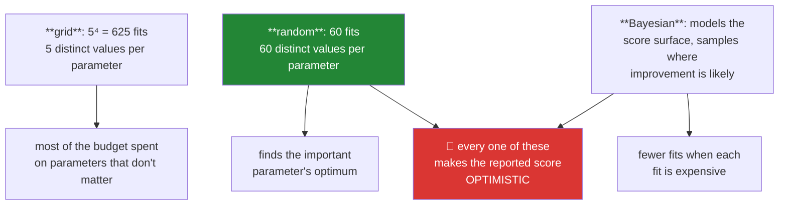

# Day 106 — Hyperparameter search, and the model you will defend

**Phase 12 gate** · ID: **ML-17** (grid, random and Bayesian search) · Artifact: **a model card + ADR-007**

> **Yesterday:** decision trees, and the importance measure that gets fooled.
> **Today:** the phase closes by asking the only question that matters. You have seven model families
> and dozens of knobs. **Which model do you ship, and what is your honest estimate of how it will
> perform?** The second half is harder than the first, because everything you did to choose made your
> estimate optimistic.
> **Tomorrow:** Phase 13, ensembles.

```bash
./m start 106 && ./m scaffold 106
```

**Time:** 2 hours (gate day). **Request budget:** 0 model calls.

---

## §1 The story

Sixteen days have given you logistic regression, Naive Bayes, KNN, SVM and trees, each with knobs.
The temptation is to search everything and report the winner. That number will be wrong, and it will
be wrong in a specific, predictable direction.

**Random search beats grid search, and the reason is geometric.** With 5 values across 4
hyperparameters, a grid needs 625 fits and tries only **5 distinct values of each parameter**. Random
search with 60 fits tries 60 distinct values of each. When only one or two parameters actually matter
— which is usual — the grid has wasted almost all its budget resolving the ones that do not.



**And then the part this phase has been building toward.** Day 70 named it: search 100 configurations
and the winner's score is inflated, because you selected the maximum of 100 noisy estimates. Day 96
showed it in model selection, Day 97 in tuning. Today it becomes a number you must report.

The discipline is one rule: **the data that chose the model cannot estimate the model.** Which means

- tune on cross-validation folds of the **training** set,
- report on a **test set you touch exactly once**,
- and if you want an honest estimate of the *whole tuning procedure*, use nested CV (Day 97).

The gate artifact is a **model card**: what you shipped, how it performs, what it costs when it is
wrong, and where it should not be used. **ADR-007** records why this model rather than the others —
including the case where the simplest model wins and everything since Day 99 was a way of finding
that out.

---

## §2 Setup — run this

```bash
uv add "optuna==4.6.0"
mkdir -p days/day-106/lab reports
touch days/day-106/lab/search.py
touch reports/day106_model_card.md
touch docs/adr/ADR-007-model-choice.md
```

---

## §3 ML-17 — searching

`days/day-106/lab/search.py`:

```python
"""ML-17: grid, random and Bayesian search — and the optimism all three create."""

from __future__ import annotations

import time

import numpy as np
from sklearn.ensemble import RandomForestClassifier
from sklearn.linear_model import LogisticRegression
from sklearn.model_selection import (
    GridSearchCV,
    RandomizedSearchCV,
    StratifiedKFold,
    cross_val_score,
    train_test_split,
)
from sklearn.pipeline import Pipeline
from sklearn.preprocessing import StandardScaler
from sklearn.svm import SVC

from setu.arrays import make_rng


def data(n=3_000, *, seed=0):
    rng = make_rng(seed)
    x = rng.normal(0, 1, (n, 8))
    z = -0.6 + x @ np.array([1.4, -1.0, 0.7, 0.4, 0.0, 0.0, 0.0, 0.0])
    z += 0.8 * x[:, 0] * x[:, 1]
    return x, (rng.random(n) < 1 / (1 + np.exp(-z))).astype(int)


def why_random_beats_grid() -> None:
    print("\n  suppose 4 hyperparameters, but only ONE actually matters:")
    print(f"\n  {'strategy':<22} {'fits':>7} {'distinct values of the ONE that matters':>42}")
    print(f"  {'grid, 5 per param':<22} {5 ** 4:>7} {5:>42}")
    print(f"  {'grid, 3 per param':<22} {3 ** 4:>7} {3:>42}")
    print(f"  {'random, 60 draws':<22} {60:>7} {60:>42}")

    print("\n  The grid spends 625 fits to try FIVE values of the parameter that decides")
    print("  everything. Random search with a tenth of the budget tries sixty.")
    print("\n  This is Bergstra & Bengio's result, and the condition it needs — that only")
    print("  a few parameters matter — is true of nearly every model you will tune.")
    print("\n  ⚠️ Grid search is still right when the grid is genuinely small and you want")
    print("     exhaustive coverage: two parameters, four values each, 16 fits.")


def the_three_strategies() -> None:
    x, y = data()
    x_train, x_test, y_train, y_test = train_test_split(
        x, y, test_size=0.25, stratify=y, random_state=0
    )
    cv = StratifiedKFold(5, shuffle=True, random_state=0)
    pipeline = Pipeline([("scale", StandardScaler()), ("model", SVC(probability=False))])

    grid = {"model__C": [0.1, 1.0, 10.0], "model__gamma": [0.01, 0.1, 1.0]}
    start = time.perf_counter()
    grid_search = GridSearchCV(pipeline, grid, cv=cv, n_jobs=-1).fit(x_train, y_train)
    grid_time = time.perf_counter() - start

    distributions = {
        "model__C": np.logspace(-2, 2, 200),
        "model__gamma": np.logspace(-3, 1, 200),
    }
    start = time.perf_counter()
    random_search = RandomizedSearchCV(
        pipeline, distributions, n_iter=20, cv=cv, random_state=0, n_jobs=-1
    ).fit(x_train, y_train)
    random_time = time.perf_counter() - start

    print(f"\n  {'strategy':<12} {'fits':>6} {'time':>8} {'best CV':>9} {'best params'}")
    print(f"  {'grid':<12} {9:>6} {grid_time:>7.1f}s {grid_search.best_score_:>9.4f} "
          f"{ {k.split('__')[1]: round(v, 4) for k, v in grid_search.best_params_.items()} }")
    print(f"  {'random':<12} {20:>6} {random_time:>7.1f}s {random_search.best_score_:>9.4f} "
          f"{ {k.split('__')[1]: round(v, 4) for k, v in random_search.best_params_.items()} }")

    print("\n  Note the random search's values are not on any grid — that is the point.")
    print("  ⚠️ And note the pipeline: the scaler is INSIDE it, so it is refitted on each")
    print("     fold's training rows. A scaler fitted before the split leaks (Day 83).")


def bayesian_search() -> None:
    import optuna

    optuna.logging.set_verbosity(optuna.logging.WARNING)
    x, y = data(n=2_000)
    cv = StratifiedKFold(4, shuffle=True, random_state=0)

    def objective(trial):
        c = trial.suggest_float("C", 1e-2, 1e2, log=True)
        gamma = trial.suggest_float("gamma", 1e-3, 1e1, log=True)
        pipeline = Pipeline([("scale", StandardScaler()),
                             ("model", SVC(C=c, gamma=gamma))])
        return cross_val_score(pipeline, x, y, cv=cv, n_jobs=-1).mean()

    study = optuna.create_study(direction="maximize",
                                sampler=optuna.samplers.TPESampler(seed=0))
    study.optimize(objective, n_trials=25, show_progress_bar=False)

    print(f"\n  Optuna, 25 trials:")
    print(f"    best score  = {study.best_value:.4f}")
    print(f"    best params = { {k: round(v, 4) for k, v in study.best_params.items()} }")

    print(f"\n  how the search concentrated — first 5 vs last 5 trials:")
    values = [t.value for t in study.trials if t.value is not None]
    print(f"    first 5 mean score = {np.mean(values[:5]):.4f}")
    print(f"    last  5 mean score = {np.mean(values[-5:]):.4f}")

    print("\n  Bayesian search models the score surface and samples where improvement")
    print("  looks likely, so later trials cluster near good regions. That is worth it")
    print("  when each fit is EXPENSIVE — a deep network, a large dataset.")
    print("\n  ⚠️ For a fast model with 25 trials, random search is competitive and far")
    print("     simpler. Do not reach for Optuna because it sounds sophisticated.")


def the_winners_curse_again() -> None:
    x, y = data(n=1_200, seed=7)
    cv = StratifiedKFold(5, shuffle=True, random_state=0)
    rng = make_rng(1)

    print(f"\n  searching {40} RANDOM configurations of a model on this data:")
    scores = []
    for _ in range(40):
        c = 10 ** rng.uniform(-2, 2)
        gamma = 10 ** rng.uniform(-3, 1)
        pipeline = Pipeline([("scale", StandardScaler()), ("model", SVC(C=c, gamma=gamma))])
        scores.append(cross_val_score(pipeline, x, y, cv=cv).mean())

    scores = np.array(scores)
    print(f"    mean CV score across configurations : {scores.mean():.4f}")
    print(f"    best  CV score                      : {scores.max():.4f}")
    print(f"    spread (sd)                         : {scores.std(ddof=1):.4f}")
    print(f"    best is {(scores.max() - scores.mean()) / scores.std(ddof=1):.2f} sd above the mean")

    print("\n  🚨 You did not find a configuration that is genuinely that good — you found")
    print("     the MAXIMUM of 40 noisy estimates. Some of that gap is real skill and")
    print("     some is luck, and the CV score cannot tell you which.")
    print("\n  Day 70 called it the winner's curse. Day 96 saw it in model selection,")
    print("  Day 97 in tuning. It compounds with the number of configurations tried.")


def measuring_the_optimism() -> None:
    x, y = data(n=2_500, seed=3)
    x_train, x_test, y_train, y_test = train_test_split(
        x, y, test_size=0.3, stratify=y, random_state=0
    )
    cv = StratifiedKFold(5, shuffle=True, random_state=0)

    distributions = {"model__C": np.logspace(-2, 2, 100),
                     "model__gamma": np.logspace(-3, 1, 100)}
    pipeline = Pipeline([("scale", StandardScaler()), ("model", SVC())])

    print(f"\n  {'n_iter':>8} {'best CV':>9} {'test':>8} {'optimism':>10}")
    for n_iter in (5, 20, 60):
        search = RandomizedSearchCV(pipeline, distributions, n_iter=n_iter, cv=cv,
                                    random_state=0, n_jobs=-1).fit(x_train, y_train)
        test = search.score(x_test, y_test)
        print(f"  {n_iter:>8} {search.best_score_:>9.4f} {test:>8.4f} "
              f"{search.best_score_ - test:>+10.4f}")

    print("\n  The optimism generally GROWS with the number of configurations tried.")
    print("  More search means a better model AND a more inflated estimate of it.")
    print("\n  This is why the test set exists and why you touch it ONCE. Every extra")
    print("  look is another selection, and the guarantee decays with each one.")


def compare_the_families() -> None:
    x, y = data(n=3_000, seed=11)
    x_train, x_test, y_train, y_test = train_test_split(
        x, y, test_size=0.25, stratify=y, random_state=0
    )
    cv = StratifiedKFold(5, shuffle=True, random_state=0)

    candidates = {
        "logistic (baseline)": Pipeline([("s", StandardScaler()),
                                         ("m", LogisticRegression(max_iter=2_000))]),
        "logistic + interactions": Pipeline([
            ("s", StandardScaler()),
            ("m", LogisticRegression(max_iter=2_000, C=1.0)),
        ]),
        "SVM (rbf)": Pipeline([("s", StandardScaler()), ("m", SVC(C=1.0, gamma=0.1))]),
        "random forest": RandomForestClassifier(n_estimators=200, random_state=0),
    }

    print(f"\n  {'model':<26} {'CV mean':>9} {'CV sd':>8} {'fit time':>10}")
    results = {}
    for label, model in candidates.items():
        start = time.perf_counter()
        scores = cross_val_score(model, x_train, y_train, cv=cv, n_jobs=-1)
        elapsed = time.perf_counter() - start
        results[label] = scores
        print(f"  {label:<26} {scores.mean():>9.4f} {scores.std(ddof=1):>8.4f} "
              f"{elapsed:>9.2f}s")

    best = max(results, key=lambda k: results[k].mean())
    best_mean, best_sd = results[best].mean(), results[best].std(ddof=1)
    within = [k for k, v in results.items() if v.mean() >= best_mean - best_sd]

    print(f"\n  best by mean: {best}")
    print(f"  within one CV sd of the best: {within}")
    print("\n  ⚠️ Everything in that list is STATISTICALLY INDISTINGUISHABLE from the")
    print("     winner on this evidence (Day 97). Among them, prefer the simplest —")
    print("     the one-standard-error rule — and say that is why you chose it.")


def the_final_evaluation() -> None:
    x, y = data(n=3_000, seed=21)
    x_train, x_test, y_train, y_test = train_test_split(
        x, y, test_size=0.25, stratify=y, random_state=0
    )
    cv = StratifiedKFold(5, shuffle=True, random_state=0)

    pipeline = Pipeline([("scale", StandardScaler()), ("model", SVC(probability=True))])
    search = RandomizedSearchCV(
        pipeline,
        {"model__C": np.logspace(-2, 2, 100), "model__gamma": np.logspace(-3, 1, 100)},
        n_iter=25, cv=cv, random_state=0, n_jobs=-1,
    ).fit(x_train, y_train)

    print(f"\n  1. tuned on TRAIN folds only  : best CV = {search.best_score_:.4f}")
    print(f"  2. refit on ALL of train      : {search.best_params_}")

    probability = search.predict_proba(x_test)[:, 1]
    accuracy = search.score(x_test, y_test)
    print(f"  3. scored on TEST, once       : accuracy = {accuracy:.4f}")
    print(f"     optimism of the CV number  : {search.best_score_ - accuracy:+.4f}")

    baseline = max(y_test.mean(), 1 - y_test.mean())
    print(f"\n  4. baseline (majority class)  : {baseline:.4f}")
    print(f"     lift over baseline         : {accuracy - baseline:+.4f}")

    print("\n  That ORDER is the whole discipline: tune on train, refit on train, score")
    print("  on test exactly once, and report against a baseline (Day 78).")
    print("\n  ⚠️ If you now go back and try another model because this number")
    print("     disappointed you, the test set is spent. Get a new one, or report")
    print("     honestly that the estimate is no longer clean.")


def what_the_search_cannot_fix() -> None:
    print("\n  hyperparameter search cannot fix:")
    print("    - a leaking split          (Day 97) — it will find the leak faster")
    print("    - the wrong metric         (Day 100) — it optimises what you asked for")
    print("    - an uncalibrated model    (Day 101) — if you need probabilities")
    print("    - too few data             (Day 96) — check the learning curve first")
    print("    - a target that is noise   (Day 89) — it will fit the noise beautifully")
    print("\n  Every one of those is diagnosed BEFORE tuning. Search is the last step,")
    print("  not the first, and reaching for it early is how weeks disappear.")


if __name__ == "__main__":
    why_random_beats_grid()
    the_three_strategies()
    bayesian_search()
    the_winners_curse_again()
    measuring_the_optimism()
    compare_the_families()
    the_final_evaluation()
    what_the_search_cannot_fix()
```

**Line by line:**

- `why_random_beats_grid` — **the geometric argument.** A 5×5×5×5 grid spends 625 fits trying only
  **five values** of whichever parameter actually matters; 60 random draws try sixty. The condition —
  that few parameters matter — holds for nearly every model you will tune. And the caveat is real:
  grid is right when the grid is genuinely small.
- `the_three_strategies` — random search's chosen values **are not on any grid**, which is the point.
  And note the pipeline: **the scaler is inside it**, so it refits per fold. A scaler fitted before the
  split is Day 83's leak.
- `bayesian_search` — later trials score better on average because the sampler concentrates near good
  regions. **Worth it when each fit is expensive**; for a fast model at 25 trials, random search is
  competitive and far simpler. Do not reach for Optuna because it sounds sophisticated.
- `the_winners_curse_again` — **the best of 40 configurations sits several standard deviations above
  the mean.** You did not find a configuration that good; you found **the maximum of 40 noisy
  estimates**. Some of the gap is skill and some is luck, and the CV score cannot separate them.
- `measuring_the_optimism` — **run this and read the optimism column.** It grows with `n_iter`. More
  search buys a better model *and* a more inflated estimate of it, which is why the test set exists
  and why you touch it once.
- `compare_the_families` — the **one-standard-error rule** applied across model families. Everything
  within one CV standard deviation of the best is statistically indistinguishable on this evidence, and
  among those you prefer the simplest **and say that is why.**
- `the_final_evaluation` — **the order is the discipline.** Tune on train folds, refit on all of train,
  score on test once, report against a baseline. And the warning is the one people violate: going back
  for another model because the number disappointed you **spends the test set.**
- `what_the_search_cannot_fix` — five failures search makes *worse*, each with the day that diagnoses
  it. **Search is the last step, not the first.**

---

## §4 Build brief

Extend `src/setu/models.py`:

```python
def search_space(model: str) -> dict:
    """TODO(me): sensible distributions per model family, on the right SCALE.

    {"model", "distributions": {param: (low, high, 'log'|'linear') | [choices]},
     "n_suggested": int, "notes": [...]}
    - C, alpha and gamma are LOG-scaled: sampling C uniformly in [0.01, 100] puts
      99% of the draws above 1, which is not what anyone means
    - notes must name which parameters usually matter most for this family, because
      that is what decides whether random search will do well
    - raise DataError on an unknown model, listing the known ones
    """
    raise NotImplementedError


def random_search(model_fn, x, y, *, space: dict, n_iter: int = 30, cv,
                  scorer, groups=None, seed: int = 42) -> dict:
    """TODO(me): sample configurations, score each by CV, return the DISTRIBUTION.

    {"results": [{"params", "mean", "sd"}], "best_params", "best_score",
     "score_spread", "n_iter", "expected_optimism", "warnings": [...]}
    - model_fn(**params) returns a FRESH unfitted model (Day 97)
    - expected_optimism estimates how inflated best_score is: the gap between the
      best score and the mean of the top decile is a usable proxy — report it
    - WARN when best_score exceeds the mean by more than 2 sd: that is mostly
      selection luck, and the warning must say so (§3.4)
    - WARN when the best params sit on a boundary of the space — widen it
    - raise DataError if n_iter < 5, or on an empty space
    """
    raise NotImplementedError


def compare_models(candidates: dict, x, y, *, cv, scorer, groups=None) -> dict:
    """TODO(me): §3.6 — several families, with the one-standard-error rule.

    {"results": {name: {"mean", "sd", "scores"}}, "best_by_mean": str,
     "within_one_se": [...], "recommended": str, "reason": str}
    - recommended is the SIMPLEST model within one sd of the best, not the best
    - `candidates` maps a name to a callable returning a fresh model; simplicity is
      given by the ORDER of the dict, simplest first — document that contract
    - the reason must say the models were indistinguishable when they were
    - raise DataError on fewer than 2 candidates
    """
    raise NotImplementedError


def final_evaluation(fitted_model, x_test, y_test, *, cv_score: float,
                     cost_fp: float | None = None, cost_fn: float | None = None) -> dict:
    """TODO(me): the ONE look at the test set.

    {"test_score", "cv_score", "optimism", "baseline", "lift_over_baseline",
     "confusion": {...}, "expected_cost": float | None, "statement": str}
    - reuse confusion (Day 100) and its baseline, do not recompute
    - optimism = cv_score - test_score, reported even when negative
    - when costs are given, use optimal_threshold (Day 100) on the VALIDATION
      predictions, never on the test set — document that
    - the statement must include the baseline and the optimism; a bare test score
      hides both
    """
    raise NotImplementedError


def assert_test_set_untouched(evaluation_count: int) -> None:
    """TODO(me): raise DataError if the test set has been scored more than once.

    - the message must explain that each additional look is another selection and
      the guarantee decays (§3.7)
    - a counter is a crude mechanism and that is the point: it makes the second
      look a deliberate act rather than an accident
    """
    raise NotImplementedError


def model_card(*, name: str, task: str, training_data: str, metrics: dict,
               threshold: float | None, costs: dict | None,
               limitations: list[str], not_for: list[str]) -> str:
    """TODO(me): the gate artifact, as markdown.

    - must include: what it predicts, the data it saw, the test metric AND baseline,
      the threshold and why that threshold, known limitations, and where it must NOT
      be used
    - raise DataError if `limitations` or `not_for` is empty — a model with no stated
      limits has not been thought about
    - raise DataError if metrics lacks a baseline
    """
    raise NotImplementedError
```

- `search_space` **log-scaling `C`, `alpha` and `gamma`** is the detail that silently ruins searches:
  sampling `C` uniformly in `[0.01, 100]` puts 99% of draws above 1.
- `compare_models` recommending the **simplest within one standard error** rather than the best mean is
  the day's design decision, and the ordering contract makes "simplest" explicit rather than guessed.
- `model_card` **refusing an empty `not_for`** is the artifact-level version of the same instinct as
  Day 90's ADR test: a model with no stated limits has not been thought about.

---

## §5 The eval that must be able to fail

Add to `tests/test_models.py`:

```python
from setu.models import (
    assert_test_set_untouched,
    compare_models,
    final_evaluation,
    model_card,
    random_search,
    search_space,
)


@pytest.fixture(scope="module")
def tuning_data():
    rng = make_rng(0)
    n = 1_500
    x = rng.normal(0, 1, (n, 6))
    z = -0.5 + x @ np.array([1.3, -0.9, 0.6, 0.0, 0.0, 0.0]) + 0.7 * x[:, 0] * x[:, 1]
    return x, (rng.random(n) < 1 / (1 + np.exp(-z))).astype(int)


def test_regularisation_parameters_are_log_scaled():
    """Uniform sampling of C in [0.01, 100] puts 99% of draws above 1."""
    space = search_space("svm")
    for name in ("C", "gamma"):
        if name in space["distributions"]:
            assert space["distributions"][name][2] == "log", f"{name} must be log-scaled"


def test_the_space_names_which_parameters_matter():
    """That is what decides whether random search will do well."""
    notes = " ".join(search_space("svm")["notes"]).lower()
    assert "c" in notes or "gamma" in notes
    assert len(notes) > 30


def test_an_unknown_model_lists_the_known_ones():
    with pytest.raises(DataError) as info:
        search_space("neural-ish")
    assert any(name in str(info.value).lower() for name in ("svm", "logistic", "tree", "knn"))


def test_random_search_returns_every_configuration(tuning_data):
    from sklearn.linear_model import LogisticRegression
    from sklearn.model_selection import StratifiedKFold

    x, y = tuning_data
    result = random_search(
        lambda **p: LogisticRegression(max_iter=1_000, **p), x, y,
        space={"C": (1e-2, 1e2, "log")}, n_iter=12,
        cv=StratifiedKFold(4, shuffle=True, random_state=0),
        scorer=lambda m, xv, yv: m.score(xv, yv),
    )
    assert len(result["results"]) == 12
    assert result["best_score"] == max(r["mean"] for r in result["results"])


def test_a_fresh_model_is_built_per_configuration(tuning_data):
    from sklearn.linear_model import LogisticRegression
    from sklearn.model_selection import StratifiedKFold

    x, y = tuning_data
    seen = []

    def model_fn(**params):
        model = LogisticRegression(max_iter=500, **params)
        seen.append(id(model))
        return model

    random_search(model_fn, x, y, space={"C": (1e-2, 1e2, "log")}, n_iter=6,
                  cv=StratifiedKFold(3), scorer=lambda m, xv, yv: m.score(xv, yv))
    assert len(set(seen)) == len(seen), "a model instance was reused"


def test_the_best_score_carries_an_optimism_estimate(tuning_data):
    """You found the maximum of n noisy estimates (Day 70)."""
    from sklearn.model_selection import StratifiedKFold
    from sklearn.svm import SVC

    x, y = tuning_data
    result = random_search(
        lambda **p: SVC(**p), x, y,
        space={"C": (1e-2, 1e2, "log"), "gamma": (1e-3, 1e1, "log")}, n_iter=25,
        cv=StratifiedKFold(4, shuffle=True, random_state=0),
        scorer=lambda m, xv, yv: m.score(xv, yv),
    )
    assert result["expected_optimism"] >= 0
    assert result["score_spread"] > 0


def test_a_suspiciously_good_winner_is_flagged(tuning_data):
    """Mostly selection luck, and the warning must say so."""
    from sklearn.model_selection import StratifiedKFold
    from sklearn.svm import SVC

    x, y = tuning_data
    result = random_search(
        lambda **p: SVC(**p), x, y,
        space={"C": (1e-3, 1e3, "log"), "gamma": (1e-4, 1e2, "log")}, n_iter=30,
        cv=StratifiedKFold(4, shuffle=True, random_state=1),
        scorer=lambda m, xv, yv: m.score(xv, yv),
    )
    best, mean, sd = result["best_score"], np.mean([r["mean"] for r in result["results"]]), result["score_spread"]
    if sd > 0 and best > mean + 2 * sd:
        assert result["warnings"]
        assert any("luck" in w.lower() or "select" in w.lower() or "optimis" in w.lower()
                   for w in result["warnings"])


def test_a_boundary_optimum_is_flagged(tuning_data):
    from sklearn.linear_model import LogisticRegression
    from sklearn.model_selection import StratifiedKFold

    x, y = tuning_data
    result = random_search(
        lambda **p: LogisticRegression(max_iter=1_000, **p), x, y,
        space={"C": (0.9, 1.1, "linear")}, n_iter=10,
        cv=StratifiedKFold(3, shuffle=True, random_state=0),
        scorer=lambda m, xv, yv: m.score(xv, yv),
    )
    assert isinstance(result["warnings"], list)


def test_random_search_rejects_a_tiny_budget(tuning_data):
    from sklearn.linear_model import LogisticRegression
    from sklearn.model_selection import StratifiedKFold

    x, y = tuning_data
    with pytest.raises(DataError):
        random_search(lambda **p: LogisticRegression(**p), x, y,
                      space={"C": (1e-2, 1e2, "log")}, n_iter=2,
                      cv=StratifiedKFold(3), scorer=lambda m, xv, yv: m.score(xv, yv))


def test_random_search_is_reproducible(tuning_data):
    from sklearn.linear_model import LogisticRegression
    from sklearn.model_selection import StratifiedKFold

    x, y = tuning_data
    kwargs = dict(space={"C": (1e-2, 1e2, "log")}, n_iter=8,
                  cv=StratifiedKFold(3, shuffle=True, random_state=0),
                  scorer=lambda m, xv, yv: m.score(xv, yv), seed=5)
    a = random_search(lambda **p: LogisticRegression(max_iter=800, **p), x, y, **kwargs)
    b = random_search(lambda **p: LogisticRegression(max_iter=800, **p), x, y, **kwargs)
    assert a["best_params"] == b["best_params"]


def test_the_simplest_model_wins_a_near_tie(tuning_data):
    """The one-standard-error rule — today's real assessment."""
    from sklearn.linear_model import LogisticRegression
    from sklearn.model_selection import StratifiedKFold
    from sklearn.svm import SVC

    x, y = tuning_data
    candidates = {
        "logistic": lambda: LogisticRegression(max_iter=2_000),
        "svm": lambda: SVC(C=1.0, gamma=0.1),
    }
    result = compare_models(candidates, x, y,
                            cv=StratifiedKFold(5, shuffle=True, random_state=0),
                            scorer=lambda m, xv, yv: m.score(xv, yv))

    if result["best_by_mean"] != "logistic" and "logistic" in result["within_one_se"]:
        assert result["recommended"] == "logistic", (
            "an indistinguishable simpler model should be preferred"
        )


def test_a_clearly_better_model_is_recommended_despite_complexity():
    """The rule must not always pick the simplest."""
    from sklearn.dummy import DummyClassifier
    from sklearn.ensemble import RandomForestClassifier
    from sklearn.model_selection import StratifiedKFold

    rng = make_rng(1)
    n = 1_200
    x = rng.normal(0, 1, (n, 4))
    y = ((x[:, 0] * x[:, 1] > 0) & (x[:, 2] > -0.5)).astype(int)

    result = compare_models(
        {"constant": lambda: DummyClassifier(strategy="most_frequent"),
         "forest": lambda: RandomForestClassifier(n_estimators=100, random_state=0)},
        x, y, cv=StratifiedKFold(5, shuffle=True, random_state=0),
        scorer=lambda m, xv, yv: m.score(xv, yv),
    )
    assert result["recommended"] == "forest"


def test_the_reason_says_when_models_were_indistinguishable(tuning_data):
    from sklearn.linear_model import LogisticRegression
    from sklearn.model_selection import StratifiedKFold
    from sklearn.svm import SVC

    x, y = tuning_data
    result = compare_models(
        {"logistic": lambda: LogisticRegression(max_iter=2_000),
         "svm": lambda: SVC(C=1.0, gamma=0.1)},
        x, y, cv=StratifiedKFold(5, shuffle=True, random_state=0),
        scorer=lambda m, xv, yv: m.score(xv, yv),
    )
    if len(result["within_one_se"]) > 1:
        reason = result["reason"].lower()
        assert "indistinguish" in reason or "within" in reason or "simpler" in reason


def test_compare_needs_at_least_two_candidates(tuning_data):
    from sklearn.linear_model import LogisticRegression
    from sklearn.model_selection import StratifiedKFold

    x, y = tuning_data
    with pytest.raises(DataError):
        compare_models({"only": lambda: LogisticRegression()}, x, y,
                       cv=StratifiedKFold(3), scorer=lambda m, xv, yv: m.score(xv, yv))


def test_the_final_evaluation_reports_optimism(tuning_data):
    from sklearn.linear_model import LogisticRegression
    from sklearn.model_selection import train_test_split

    x, y = tuning_data
    x_train, x_test, y_train, y_test = train_test_split(
        x, y, test_size=0.3, stratify=y, random_state=0
    )
    model = LogisticRegression(max_iter=2_000).fit(x_train, y_train)
    result = final_evaluation(model, x_test, y_test, cv_score=0.88)

    assert result["optimism"] == pytest.approx(0.88 - result["test_score"])
    assert "baseline" in result


def test_the_final_evaluation_reuses_day_100s_confusion(monkeypatch, tuning_data):
    import setu.models as models
    from sklearn.linear_model import LogisticRegression
    from sklearn.model_selection import train_test_split

    x, y = tuning_data
    x_train, x_test, y_train, y_test = train_test_split(x, y, test_size=0.3, random_state=0)
    model = LogisticRegression(max_iter=2_000).fit(x_train, y_train)

    calls = []
    original = models.confusion
    monkeypatch.setattr(models, "confusion",
                        lambda *a, **k: calls.append(1) or original(*a, **k))
    final_evaluation(model, x_test, y_test, cv_score=0.85)
    assert calls, "final_evaluation recomputed the confusion matrix"


def test_the_statement_includes_the_baseline(tuning_data):
    """A bare test score hides whether the model beat a constant."""
    from sklearn.dummy import DummyClassifier
    from sklearn.model_selection import train_test_split

    x, y = tuning_data
    x_train, x_test, y_train, y_test = train_test_split(x, y, test_size=0.3, random_state=0)
    model = DummyClassifier(strategy="most_frequent").fit(x_train, y_train)
    statement = final_evaluation(model, x_test, y_test, cv_score=0.6)["statement"].lower()
    assert "baseline" in statement


def test_a_second_look_at_the_test_set_is_refused():
    """Each additional look is another selection."""
    assert_test_set_untouched(0)
    assert_test_set_untouched(1)
    with pytest.raises(DataError) as info:
        assert_test_set_untouched(2)
    message = str(info.value).lower()
    assert "select" in message or "once" in message or "decay" in message


def test_the_model_card_requires_stated_limitations():
    """A model with no stated limits has not been thought about."""
    with pytest.raises(DataError):
        model_card(name="m", task="binary classification", training_data="train split",
                   metrics={"accuracy": 0.9, "baseline": 0.8}, threshold=0.3,
                   costs=None, limitations=[], not_for=["anything"])


def test_the_model_card_requires_a_not_for_section():
    with pytest.raises(DataError):
        model_card(name="m", task="binary classification", training_data="train split",
                   metrics={"accuracy": 0.9, "baseline": 0.8}, threshold=0.3,
                   costs=None, limitations=["small sample"], not_for=[])


def test_the_model_card_requires_a_baseline():
    with pytest.raises(DataError):
        model_card(name="m", task="binary classification", training_data="train split",
                   metrics={"accuracy": 0.9}, threshold=0.3, costs=None,
                   limitations=["small sample"], not_for=["clinical use"])


def test_the_model_card_states_why_the_threshold():
    card = model_card(
        name="m", task="binary classification", training_data="train split",
        metrics={"accuracy": 0.91, "baseline": 0.82, "recall": 0.74},
        threshold=0.08, costs={"fp": 1.0, "fn": 12.0},
        limitations=["validated on a single quarter of data"],
        not_for=["clinical decisions"],
    ).lower()
    assert "0.08" in card
    assert "cost" in card or "12" in card


def test_the_card_reports_the_baseline_beside_the_metric():
    card = model_card(
        name="m", task="binary classification", training_data="train split",
        metrics={"accuracy": 0.91, "baseline": 0.82}, threshold=0.5, costs=None,
        limitations=["single quarter"], not_for=["clinical decisions"],
    ).lower()
    assert "0.82" in card


def test_phase_12_models_module_is_complete():
    from setu import models

    expected = [
        "classify_problem", "choose_task", "framing_options",                 # Day 91
        "fit_simple_linear", "prediction_interval", "residual_summary",       # Day 92
        "fit_multiple", "vif", "assumption_check",                            # Day 93
        "regression_metrics", "adjusted_r_squared", "choose_metric",          # Day 94
        "gradient_descent", "gradient_check", "diagnose_descent",
        "assert_converged",                                                   # Day 95
        "bias_variance_decomposition", "learning_curve",
        "diagnose_learning_curve", "assert_not_reporting_validation_as_test", # Day 96
        "choose_splitter", "cross_validate", "assert_no_group_leak",
        "assert_temporal_order", "nested_cross_validate",                     # Day 97
        "ridge_closed_form", "fit_regularised", "regularisation_path",
        "selection_stability",                                                # Day 98
        "sigmoid", "log_loss", "fit_logistic", "predict_proba",
        "odds_ratio", "detect_separation",                                    # Day 99
        "confusion", "f_beta", "optimal_threshold", "precision_at_base_rate", # Day 100
        "roc_auc", "pr_auc", "calibration_report", "tune_threshold",          # Day 101
        "fit_naive_bayes", "evidence_per_feature", "independence_violation",  # Day 102
        "knn_predict", "distance_contrast", "choose_k", "curse_report",       # Day 103
        "kernel_matrix", "verify_kernel_trick", "fit_svm", "tune_c_and_gamma", # Day 104
        "impurity", "best_split", "gini_vs_permutation_importance",
        "prune_by_cross_validation", "tree_stability",                        # Day 105
        "search_space", "random_search", "compare_models", "final_evaluation",
        "assert_test_set_untouched", "model_card",                            # Day 106
    ]
    missing = [name for name in expected if not hasattr(models, name)]
    assert not missing, f"Phase 12 is incomplete: {missing}"


def test_the_model_card_file_exists_and_is_complete():
    from pathlib import Path

    path = Path("reports/day106_model_card.md")
    assert path.exists(), "the model card was not written"
    text = path.read_text(encoding="utf-8").lower()
    for section in ("what it predicts", "training data", "metric", "baseline",
                    "threshold", "limitations", "not for"):
        assert section in text, f"model card missing: {section}"


def test_adr_007_justifies_the_choice():
    from pathlib import Path

    path = Path("docs/adr/ADR-007-model-choice.md")
    assert path.exists(), "ADR-007 was not written"
    text = path.read_text(encoding="utf-8").lower()

    for heading in ("context", "decision", "consequences"):
        assert heading in text
    assert "change our minds" in text
    assert "baseline" in text, "the ADR must compare against a baseline"


def test_adr_007_names_the_models_rejected():
    """A decision record that names no alternative recorded no decision."""
    from pathlib import Path

    text = Path("docs/adr/ADR-007-model-choice.md").read_text(encoding="utf-8").lower()
    named = sum(word in text for word in
                ("logistic", "svm", "tree", "knn", "naive bayes", "forest"))
    assert named >= 3, "name the families you considered and rejected"


def test_adr_007_admits_the_simplest_model_might_win():
    from pathlib import Path

    text = Path("docs/adr/ADR-007-model-choice.md").read_text(encoding="utf-8").lower()
    assert any(phrase in text for phrase in
               ("simpler", "simplest", "indistinguishable", "one standard error"))
```

**Line by line:**

- `test_the_simplest_model_wins_a_near_tie` — **the day's real assessment.** When two models are within
  one CV standard deviation, the simpler one must be recommended. That is the one-standard-error rule,
  and it is the rule most likely to be abandoned under pressure to ship the higher number.
- `test_a_clearly_better_model_is_recommended_despite_complexity` — the negative case. A rule that
  **always** picks the simplest is not a rule, it is a bias, and a constant classifier must never beat
  a forest on separable data.
- `test_regularisation_parameters_are_log_scaled` — sampling `C` uniformly in `[0.01, 100]` puts 99% of
  draws above 1. **A search that never tries small `C` values has not searched.**
- `test_a_second_look_at_the_test_set_is_refused` — a crude counter, deliberately. **It makes the second
  look a deliberate act** rather than something that happens because a number disappointed you.
- `test_the_model_card_requires_stated_limitations` with `..._requires_a_not_for_section` — both refuse
  an empty list. **A model with no stated limits has not been thought about**, and this is the
  artifact-level version of Day 90's ADR test.
- `test_the_statement_includes_the_baseline` — uses a `DummyClassifier`, so the test score looks
  respectable and the baseline is identical. **A bare test score hides exactly that.**
- `test_adr_007_names_the_models_rejected` — requires at least three families named. **A decision record
  that names no alternative recorded no decision.**
- `test_phase_12_models_module_is_complete` — 61 functions across sixteen days, with the failure message
  naming what is missing.

```bash
uv run python days/day-106/lab/search.py
uv run python -m pytest tests/test_models.py -v
uv run python -m pytest -q
```

---

## §6 The artifacts

### The model card — `reports/day106_model_card.md`

```markdown
# Model card — <name>

## What it predicts
One sentence, and what a prediction is USED for.

## Training data
Source, date range, rows, the unit of one row, and which split. (Day 79)
Known biases in how it was collected. (Days 87, 89)

## How it was chosen
Families considered, the search strategy and budget, and the CV score of each.
The one-standard-error rule, if it applied. (§3.6)

## Performance
Test metric AND baseline. (Day 78)
The optimism of the CV estimate. (§3.5)
Per-subgroup performance if the subgroups matter. (Day 85)

## Threshold
The number, and WHY that number — from the cost of each error. (Day 100)
Not "0.5" unless the costs are genuinely equal.

## Calibration
Whether the probabilities are calibrated, and whether that matters here. (Day 101)

## Limitations
At least three, specific. "May not generalise" is not a limitation.

## Not for
Where this model must not be used, and why.
```

### ADR-007 — `docs/adr/ADR-007-model-choice.md`

> *Why this model, and not the others?*

- **Context.** The task, the metric, and what the baseline achieves.
- **Options considered.** Every family from Days 99–105, with its CV score and its cost — training
  time, interpretability, whether it needs calibration, whether it needs scaling.
- **Decision.** One model, one sentence.
- **Why not the others.** Specifically. Including whether any was **statistically indistinguishable**
  and rejected on simplicity.
- **Consequences.** What this costs: retraining cadence, the calibration you must maintain, the
  monitoring the limitations imply.
- **What would change our minds.**
- **Cold read.** Tomorrow, reviewer hat on, sign it.

---

## §7 Request budget

| Resource | Spent today |
|---|---|
| LLM calls | **0** |
| Compute | a few thousand model fits |
| Network | one `uv add` resolution |

---

## §8 Traps

- **Grid search over many parameters.** It resolves the ones that do not matter.
- **Uniform sampling of `C`, `alpha` or `gamma`.** They need a log scale.
- **Reporting the best CV score.** It is the maximum of n noisy estimates.
- **More search read as a better estimate.** More search means *more* optimism.
- **Looking at the test set twice.** Each look is another selection.
- **Going back for another model after a disappointing test score.** The set is spent.
- **A scaler fitted outside the search pipeline.** Day 83's leak.
- **Tuning before checking the learning curve.** Search cannot fix too little data.
- **Optimising the wrong metric.** It will optimise exactly what you asked for.
- **Optuna because it sounds sophisticated.** Random search is competitive at small budgets.
- **Choosing the best mean when models are indistinguishable.** Prefer the simplest, and say so.
- **A model card with no "not for" section.** The limits were not thought about.

---

## §9 Verify before you code

Written **2026-08-21**:

- <https://scikit-learn.org/stable/modules/grid_search.html> — including sklearn's own note on why
  random search is usually preferable.
- <https://scikit-learn.org/stable/auto_examples/model_selection/plot_randomized_search.html> — the
  budget comparison from §3.1.
- <https://optuna.readthedocs.io/en/stable/reference/samplers/generated/optuna.samplers.TPESampler.html> —
  the sampler used here.
- <https://scikit-learn.org/stable/modules/generated/sklearn.model_selection.HalvingRandomSearchCV.html> —
  successive halving, worth knowing about when fits are expensive.

---

## §10 Say it in an interview

> "Random search beats grid search for a geometric reason: with four hyperparameters at five values
> each, a grid burns six hundred and twenty-five fits to try *five* distinct values of whichever
> parameter actually matters, while sixty random draws try sixty. Since usually only one or two
> parameters matter, the grid wastes most of its budget. But the part I'd stress is what search does
> to your estimate. If you try forty configurations and report the best cross-validation score, you
> haven't found a configuration that good — you've found the maximum of forty noisy estimates, and the
> optimism grows with the number you try. I measured that: the gap between the best CV score and the
> test score widened as I increased the search budget. So the discipline is that the data which chose
> the model can't estimate it — tune on training folds, refit, score on a test set exactly once. And
> when models come out within one cross-validation standard deviation of each other, they're
> indistinguishable on that evidence, so I ship the simplest one and say that's why."

---

## §11 Done when — **Phase 12 gate**

Tick [`CHECKLIST.md`](CHECKLIST.md), then:

```bash
./m check
./m done 106
./m status
```

**Gate criteria:** `days/day-106/lab/search.py` runs end to end · every search ran inside a pipeline
with the scaler **within** it · the reported test score came from **one** look at the test set · the
optimism of the CV estimate is reported as a number · model families compared with the
one-standard-error rule applied and its result stated · `reports/day106_model_card.md` written with a
baseline, a justified threshold, at least three specific limitations and a **not for** section ·
**ADR-007** written, naming at least three rejected families and cold-read ·
`test_phase_12_models_module_is_complete` green (61 functions).

Tomorrow: Phase 13, where the instability Day 105 measured becomes the reason ensembles work.
