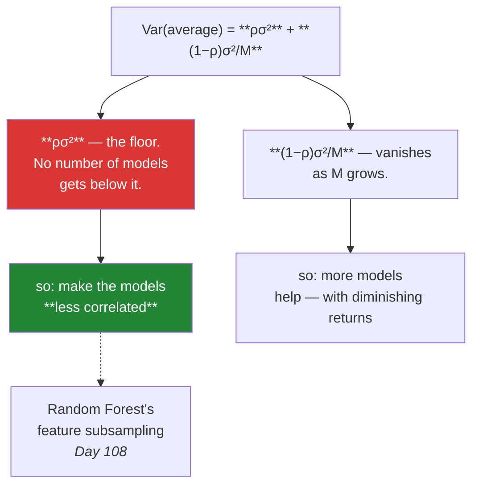

# Day 107 — Why averaging works

**Phase 13 · Module 13 · Ensembles & clustering** · ID: **ML-18** (the bias/variance view of ensembles)

> **Yesterday:** Phase 12 closed with a model card and the honest estimate.
> **Today:** the phase opens with the arithmetic that makes every method in it work. Day 105
> measured that trees are **unstable** — refit on a slightly different sample and the structure
> changes. That looked like a defect. Today it turns out to be the raw material.
> **Tomorrow:** bagging and Random Forest.

```bash
./m start 107 && ./m scaffold 107
```

**Time:** 110 minutes. **Request budget:** 0 model calls.

---

## §1 The story

Day 96 gave the decomposition: `error = bias² + variance + noise`. Averaging attacks exactly one of
those terms, and the arithmetic is worth doing rather than asserting.

Average `M` models, each with variance `σ²`, each pair correlated by `ρ`:

> **Var(average) = ρσ² + (1 − ρ)σ²/M**

Read the two terms separately, because everything in this phase follows from them:



**The second term is the free lunch and it is bounded.** More models shrink it toward zero, but you
never get past `ρσ²`.

**The first term is where the design work is.** Every ensemble technique you will meet is a way of
lowering `ρ` — different bootstrap samples, different feature subsets, different random seeds,
different model families. Day 108's Random Forest subsamples features at every split for exactly this
reason, and nothing else.

And the constraint that decides which ensemble to reach for: **averaging does not reduce bias.** If
every model is wrong in the same direction, their average is wrong in that direction too. So bagging
needs **low-bias, high-variance** base models — deep unpruned trees — and averaging fixes their
variance. Boosting (Day 110) attacks bias instead, by a completely different mechanism, and confusing
the two is why people bag shallow trees and wonder why nothing improved.

---

## §2 Setup — run this

```bash
mkdir -p days/day-107/lab
touch days/day-107/lab/averaging.py
touch src/setu/ensembles.py
touch tests/test_ensembles.py
```

---

## §3 ML-18 — the arithmetic

`days/day-107/lab/averaging.py`:

```python
"""ML-18: why averaging works, and the two terms that decide every ensemble."""

from __future__ import annotations

import numpy as np
from sklearn.ensemble import BaggingRegressor
from sklearn.linear_model import LinearRegression
from sklearn.tree import DecisionTreeRegressor

from setu.arrays import make_rng

TRUE_NOISE = 0.6


def truth(x):
    return np.sin(1.6 * x) + 0.35 * x


def sample(n, *, seed):
    rng = make_rng(seed)
    x = rng.uniform(-3, 3, n)
    return x.reshape(-1, 1), truth(x) + rng.normal(0, TRUE_NOISE, n)


def the_variance_formula() -> None:
    rng = make_rng(0)
    sigma_squared = 4.0

    print(f"\n  Var(average of M models) = ρσ² + (1−ρ)σ²/M,  with σ² = {sigma_squared}")
    print(f"\n  {'ρ':>6} {'M=1':>8} {'M=10':>8} {'M=100':>9} {'M=∞':>8}")
    for rho in (0.0, 0.2, 0.5, 0.9, 1.0):
        row = [rho * sigma_squared + (1 - rho) * sigma_squared / m for m in (1, 10, 100)]
        print(f"  {rho:>6.1f} {row[0]:>8.3f} {row[1]:>8.3f} {row[2]:>9.3f} "
              f"{rho * sigma_squared:>8.3f}")

    print("\n  Read the last column: that is the FLOOR, ρσ². No number of models reaches")
    print("  below it. At ρ=1 (identical models) averaging does literally nothing.")
    print("\n  And read across a row: the gain is fast at first and then flattens.")
    print("  Going 1→10 buys far more than 100→1000.")

    print(f"\n  simulated check at ρ≈0, σ²={sigma_squared}:")
    for m in (1, 10, 100):
        draws = rng.normal(0, np.sqrt(sigma_squared), (20_000, m)).mean(axis=1)
        print(f"    M={m:>4}: observed variance {draws.var(ddof=1):>7.4f}   "
              f"predicted {sigma_squared / m:>7.4f}")


def correlation_is_the_whole_game() -> None:
    rng = make_rng(1)
    m, sigma = 25, 2.0

    print(f"\n  averaging {m} models with the SAME individual variance, varying ρ:")
    print(f"  {'ρ':>6} {'observed Var':>14} {'predicted':>11}")
    for rho in (0.0, 0.3, 0.6, 0.9):
        shared = rng.normal(0, sigma * np.sqrt(rho), (20_000, 1))
        private = rng.normal(0, sigma * np.sqrt(1 - rho), (20_000, m))
        average = (shared + private).mean(axis=1)
        predicted = rho * sigma**2 + (1 - rho) * sigma**2 / m
        print(f"  {rho:>6.1f} {average.var(ddof=1):>14.4f} {predicted:>11.4f}")

    print("\n  Same models, same count, and the result changes by a factor of ten.")
    print("  🚨 EVERY ensemble technique in this phase is a way of lowering ρ:")
    print("     different bootstrap samples · different feature subsets · different")
    print("     seeds · different model families. That is all they are doing.")


def averaging_fixes_variance_not_bias() -> None:
    x_test = np.linspace(-2.8, 2.8, 60).reshape(-1, 1)
    truth_test = truth(x_test.ravel())
    n_datasets = 200

    print(f"\n  {'base model':<26} {'bias²':>9} {'variance':>10} {'total':>9}")
    for label, build in (
        ("stump (depth 1, high bias)", lambda: DecisionTreeRegressor(max_depth=1)),
        ("deep tree (high variance)", lambda: DecisionTreeRegressor()),
        ("linear (high bias here)", lambda: LinearRegression()),
    ):
        for suffix, wrap in ((" — single", lambda b: b()),
                             (" — bagged x50", lambda b: BaggingRegressor(
                                 b(), n_estimators=50, random_state=0))):
            predictions = np.empty((n_datasets, len(x_test)))
            for i in range(n_datasets):
                x, y = sample(60, seed=500 + i)
                predictions[i] = wrap(build).fit(x, y).predict(x_test)
            bias_squared = ((predictions.mean(axis=0) - truth_test) ** 2).mean()
            variance = predictions.var(axis=0).mean()
            print(f"  {label + suffix:<26} {bias_squared:>9.4f} {variance:>10.4f} "
                  f"{bias_squared + variance:>9.4f}")
        print()

    print("  Read each PAIR of rows. Bagging collapses the variance column and leaves")
    print("  bias almost untouched — for every base model.")
    print("\n  🚨 So bagging a STUMP is nearly pointless: its error was bias, and bagging")
    print("     does not touch bias. Bagging a DEEP TREE is transformative.")
    print("\n  That is the rule: bag LOW-BIAS, HIGH-VARIANCE models. Boosting (Day 110)")
    print("  attacks bias instead, which is why it uses shallow trees.")


def diminishing_returns() -> None:
    x_val, y_val = sample(3_000, seed=99)

    print(f"\n  {'M':>6} {'val MSE':>10} {'improvement':>13} {'fit cost':>10}")
    previous = None
    for m in (1, 2, 5, 10, 25, 50, 100, 200):
        x, y = sample(200, seed=7)
        model = BaggingRegressor(DecisionTreeRegressor(), n_estimators=m,
                                 random_state=0).fit(x, y)
        mse = ((model.predict(x_val) - y_val) ** 2).mean()
        change = "" if previous is None else f"{previous - mse:>+13.5f}"
        print(f"  {m:>6} {mse:>10.5f} {change:>13} {m:>9}x")
        previous = mse

    print("\n  The curve flattens hard. Going from 1 to 25 buys most of the available")
    print("  gain; 100 to 200 buys almost nothing and doubles your inference cost.")
    print("\n  ⚠️ More estimators never HURTS accuracy in bagging — it just stops helping.")
    print("     That is different from boosting (Day 111), where too many rounds overfit.")


def averaging_probabilities_beats_voting() -> None:
    rng = make_rng(3)
    n_models, n_rows = 15, 20_000

    truth_label = (rng.random(n_rows) < 0.5).astype(int)
    probability = np.clip(
        truth_label * rng.normal(0.62, 0.22, (n_models, n_rows))
        + (1 - truth_label) * rng.normal(0.38, 0.22, (n_models, n_rows)),
        0.001, 0.999,
    )

    hard = (probability >= 0.5).mean(axis=0) >= 0.5
    soft = probability.mean(axis=0) >= 0.5

    print(f"\n  {n_models} weak models, {n_rows:,} rows:")
    print(f"    mean single-model accuracy : {((probability >= 0.5) == truth_label).mean():.4f}")
    print(f"    hard voting (majority)     : {(hard == truth_label).mean():.4f}")
    print(f"    soft voting (mean p)       : {(soft == truth_label).mean():.4f}")

    print("\n  Soft voting usually wins, because a model that says 0.51 and one that says")
    print("  0.99 both get ONE vote in hard voting — the confidence is thrown away.")
    print("\n  ⚠️ Soft voting requires CALIBRATED probabilities (Day 101). Averaging")
    print("     miscalibrated outputs averages the miscalibration too.")


def condorcet_needs_independence() -> None:
    rng = make_rng(4)
    accuracy, n_rows = 0.60, 40_000

    print(f"\n  majority vote of M models, each {accuracy:.0%} accurate:")
    print(f"  {'M':>5} {'ρ=0 (independent)':>20} {'ρ=0.5 (correlated)':>21}")
    for m in (1, 5, 15, 51):
        independent = (rng.random((n_rows, m)) < accuracy).mean(axis=1) > 0.5
        shared = rng.random((n_rows, 1)) < accuracy
        private = rng.random((n_rows, m)) < accuracy
        mask = rng.random((n_rows, m)) < 0.5
        correlated = np.where(mask, shared, private).mean(axis=1) > 0.5
        print(f"  {m:>5} {independent.mean():>20.4f} {correlated.mean():>21.4f}")

    print("\n  Independent: accuracy climbs toward 1 as M grows — Condorcet's jury theorem.")
    print("  Correlated: it stalls. The models make the SAME mistakes, so more of them")
    print("  just repeats the mistake more loudly.")

    print(f"\n  and below 50% accuracy the theorem runs in REVERSE:")
    for m in (1, 15, 51):
        bad = (rng.random((n_rows, m)) < 0.45).mean(axis=1) > 0.5
        print(f"    M={m:>3}, each 45% accurate: {bad.mean():.4f}")
    print("  ⚠️ Averaging models that are worse than chance makes things WORSE.")
    print("     Every base model must beat the baseline before you ensemble them.")


def diversity_beats_individual_quality() -> None:
    x_val, y_val = sample(3_000, seed=98)
    x, y = sample(150, seed=13)

    identical = np.column_stack([
        DecisionTreeRegressor(max_depth=4, random_state=0).fit(x, y).predict(x_val)
        for _ in range(10)
    ])

    rng = make_rng(5)
    diverse = np.column_stack([
        DecisionTreeRegressor(max_depth=4, random_state=seed).fit(
            *(lambda i: (x[i], y[i]))(rng.choice(len(x), len(x), replace=True))
        ).predict(x_val)
        for seed in range(10)
    ])

    print(f"\n  {'ensemble':<24} {'mean single MSE':>17} {'averaged MSE':>14} {'ρ':>7}")
    for label, matrix in (("10 identical trees", identical), ("10 bootstrapped trees", diverse)):
        singles = ((matrix - y_val[:, None]) ** 2).mean(axis=0).mean()
        averaged = ((matrix.mean(axis=1) - y_val) ** 2).mean()
        correlations = np.corrcoef(matrix.T)
        rho = correlations[np.triu_indices_from(correlations, k=1)].mean()
        print(f"  {label:<24} {singles:>17.5f} {averaged:>14.5f} {rho:>7.4f}")

    print("\n  The identical trees have ρ = 1.0 and averaging changes NOTHING.")
    print("  The bootstrapped ones are individually no better — often slightly worse —")
    print("  and their average is clearly better.")
    print("\n  🚨 A worse but decorrelated model can improve an ensemble. That is the")
    print("     counter-intuitive part, and it is why Day 108 deliberately handicaps")
    print("     each tree by hiding features from it.")


def when_not_to_ensemble() -> None:
    print("\n  ensembling is not free. Do not reach for it when:")
    print("    - the error is BIAS, not variance      — check the learning curve (Day 96)")
    print("    - you must EXPLAIN a prediction        — 200 trees is not an explanation")
    print("    - inference latency matters            — M models cost M times as much")
    print("    - the base models are already ρ ≈ 1    — averaging does nothing")
    print("    - any base model is worse than chance  — it drags the average down")
    print("\n  And the honest one: a single well-tuned model within one CV standard")
    print("  deviation of your ensemble (Day 106) is the one to ship.")


if __name__ == "__main__":
    the_variance_formula()
    correlation_is_the_whole_game()
    averaging_fixes_variance_not_bias()
    diminishing_returns()
    averaging_probabilities_beats_voting()
    condorcet_needs_independence()
    diversity_beats_individual_quality()
    when_not_to_ensemble()
```

**Line by line:**

- `the_variance_formula` — **the last column is the floor.** `ρσ²` is unreachable no matter how many
  models you add, and at `ρ = 1` averaging does literally nothing. Reading across a row shows the other
  half: 1→10 buys far more than 100→1000.
- `correlation_is_the_whole_game` — same models, same count, and **the result changes by a factor of
  ten** as `ρ` moves. Every technique in this phase — bootstrap samples, feature subsets, seeds, model
  families — is a way of lowering `ρ`. That is all they are doing.
- `averaging_fixes_variance_not_bias` — **read each pair of rows.** Bagging collapses the variance
  column and leaves bias untouched, for every base model. So **bagging a stump is nearly pointless** —
  its error was bias — while bagging a deep tree is transformative. That is the rule that decides
  whether to bag or boost.
- `diminishing_returns` — the curve flattens hard, and the note matters: **more estimators never hurts
  accuracy in bagging**, it just stops helping. Boosting (Day 111) is different, and too many rounds
  there do overfit.
- `averaging_probabilities_beats_voting` — **soft voting wins because hard voting throws away
  confidence**: a model saying 0.51 and one saying 0.99 get one vote each. And the caveat is real —
  averaging miscalibrated probabilities averages the miscalibration (Day 101).
- `condorcet_needs_independence` — independent voters climb toward perfect accuracy; correlated ones
  **stall**, because they make the same mistakes and more of them just repeats the mistake louder. And
  below 50% the theorem runs in reverse: **averaging models worse than chance makes things worse.**
- `diversity_beats_individual_quality` — **the counter-intuitive result.** Ten identical trees have
  `ρ = 1` and averaging does nothing. Ten bootstrapped trees are individually *slightly worse* and
  their average is clearly better. **A worse but decorrelated model can improve an ensemble**, which is
  why Day 108 deliberately handicaps each tree by hiding features from it.
- `when_not_to_ensemble` — five conditions, each pointing at the day that diagnoses it. Plus the honest
  one: a single tuned model within one CV standard deviation of your ensemble is the one to ship
  (Day 106).

---

## §4 Build brief — `src/setu/ensembles.py`

New module. Layer 2.

```python
"""Ensemble reasoning for Setu. Layer 2."""

from __future__ import annotations

import numpy as np

from setu.errors import DataError


def averaged_variance(*, sigma_squared: float, rho: float, n_models: int) -> dict:
    """TODO(me): the formula, and the floor it implies. PURE.

    {"variance", "floor", "reducible", "fraction_of_floor", "n_models", "rho"}
    - variance = rho*sigma_squared + (1-rho)*sigma_squared/n_models
    - floor = rho*sigma_squared — the value at n_models = infinity
    - reducible = variance - floor, i.e. what more models could still buy you
    - raise DataError unless 0 <= rho <= 1, naming the value
    - raise DataError if n_models < 1 or sigma_squared < 0
    """
    raise NotImplementedError


def models_needed(*, sigma_squared: float, rho: float, target_variance: float) -> dict:
    """TODO(me): how many models to reach a target — or whether it is reachable at all.

    {"n_models": int | None, "floor", "reachable": bool, "reason": str}
    - when target_variance <= floor, reachable is False and n_models is None: no
      number of models gets there, and the reason must say to reduce rho instead
    - this is the calculation that stops someone adding estimators forever
    - raise DataError if target_variance <= 0
    """
    raise NotImplementedError


def prediction_correlation(predictions) -> dict:
    """TODO(me): how correlated are these models, really? PURE.

    predictions is (n_rows, n_models).
    {"mean_rho", "min_rho", "max_rho", "n_models", "effective_models", "warnings": [...]}
    - mean_rho is the mean of the upper triangle of the correlation matrix
    - effective_models = 1 / (rho + (1-rho)/M) normalised — report how many
      INDEPENDENT models this ensemble is worth; that number is the honest one
    - WARN when mean_rho > 0.95: the ensemble is doing almost nothing (§3.7)
    - raise DataError on fewer than 2 models, or any constant column (correlation
      is undefined) — name the offending column
    """
    raise NotImplementedError


def ensemble_gain(single_errors, ensemble_error: float, *, baseline_error: float) -> dict:
    """TODO(me): did the ensemble actually earn its cost?

    {"mean_single", "best_single", "ensemble", "gain_over_mean", "gain_over_best",
     "beats_baseline": bool, "verdict", "warnings": [...]}
    - gain_over_BEST is the number that matters: beating the average of your models
      is easy, beating the best of them is the claim worth making
    - WARN when gain_over_best is under 2%: M-times the inference cost for that
      is rarely worth it (§3.8)
    - WARN when any single model is worse than baseline_error — it drags the
      average down (§3.6), and the message must say to drop it
    - raise DataError on an empty single_errors
    """
    raise NotImplementedError


def choose_ensemble_strategy(*, dominant_error: str, base_model_depth: str,
                             needs_explanation: bool = False,
                             latency_budget_ms: float | None = None) -> dict:
    """TODO(me): bag, boost, or neither. PURE.

    {"strategy": "bagging" | "boosting" | "single model", "reason", "base_model",
     "warnings": [...]}
    - dominant_error in {'bias', 'variance', 'noise'}; from Day 96's decomposition
    - variance-dominated -> bagging, with DEEP base models
    - bias-dominated -> boosting, with SHALLOW base models (Day 110)
    - noise-dominated -> 'single model'; nothing helps, and the reason must say so
    - needs_explanation or a tight latency budget -> warn that an ensemble costs both
    - the reason must name WHICH term of the decomposition it is attacking
    """
    raise NotImplementedError


def soft_vote(probabilities, *, weights=None) -> dict:
    """TODO(me): average probabilities, not votes.

    {"probability": ndarray, "hard_vote": ndarray, "agreement": ndarray,
     "warnings": [...]}
    - probabilities is (n_models, n_rows); average along axis 0
    - hard_vote is provided for COMPARISON only, so a caller can see the difference
    - agreement is the fraction of models on the majority side per row — a row with
      low agreement is one the ensemble is genuinely unsure about, and that is more
      informative than the averaged probability alone
    - the docstring must state that soft voting assumes CALIBRATED inputs (Day 101)
    - raise DataError if any probability is outside [0, 1], or weights do not sum to 1
    """
    raise NotImplementedError
```

- `models_needed` returning **`reachable: False`** when the target is below the floor is the day's
  design decision: it converts "add more estimators" from a reflex into a calculation that can say *no*.
- `prediction_correlation`'s **`effective_models`** is the honest count — an ensemble of 200 trees at
  `ρ = 0.9` is worth far fewer than 200 independent ones, and reporting 200 is misleading.
- `ensemble_gain` measuring against the **best** single model rather than the mean is the strict test.
  Beating your models' average is easy; beating the best of them is the claim worth making.

---

## §5 The eval that must be able to fail

`tests/test_ensembles.py`:

```python
import numpy as np
import pytest

from setu.arrays import make_rng
from setu.errors import DataError
from setu.ensembles import (
    averaged_variance,
    choose_ensemble_strategy,
    ensemble_gain,
    models_needed,
    prediction_correlation,
    soft_vote,
)


def test_independent_models_divide_the_variance():
    result = averaged_variance(sigma_squared=4.0, rho=0.0, n_models=10)
    assert result["variance"] == pytest.approx(0.4)
    assert result["floor"] == pytest.approx(0.0)


def test_identical_models_gain_nothing():
    """At rho = 1, averaging does literally nothing."""
    single = averaged_variance(sigma_squared=4.0, rho=1.0, n_models=1)["variance"]
    many = averaged_variance(sigma_squared=4.0, rho=1.0, n_models=1_000)["variance"]
    assert many == pytest.approx(single)


def test_the_floor_is_never_crossed():
    """No number of models gets below rho*sigma^2."""
    for n in (1, 10, 1_000, 1_000_000):
        result = averaged_variance(sigma_squared=4.0, rho=0.3, n_models=n)
        assert result["variance"] >= result["floor"] - 1e-12
    assert averaged_variance(sigma_squared=4.0, rho=0.3, n_models=10**9)["variance"] == \
        pytest.approx(1.2, rel=1e-6)


def test_reducible_variance_shrinks_with_more_models():
    reducible = [averaged_variance(sigma_squared=4.0, rho=0.3, n_models=n)["reducible"]
                 for n in (1, 10, 100, 1_000)]
    assert reducible == sorted(reducible, reverse=True)


def test_the_formula_matches_a_simulation():
    """The arithmetic is not a metaphor."""
    rng = make_rng(0)
    sigma, rho, m = 2.0, 0.4, 20
    shared = rng.normal(0, sigma * np.sqrt(rho), (40_000, 1))
    private = rng.normal(0, sigma * np.sqrt(1 - rho), (40_000, m))
    observed = (shared + private).mean(axis=1).var(ddof=1)
    predicted = averaged_variance(sigma_squared=sigma**2, rho=rho, n_models=m)["variance"]
    assert observed == pytest.approx(predicted, rel=0.05)


@pytest.mark.parametrize("rho", [-0.1, 1.1])
def test_an_impossible_correlation_is_refused(rho):
    with pytest.raises(DataError) as info:
        averaged_variance(sigma_squared=1.0, rho=rho, n_models=5)
    assert str(rho) in str(info.value)


def test_a_reachable_target_gives_a_count():
    result = models_needed(sigma_squared=4.0, rho=0.0, target_variance=0.4)
    assert result["reachable"] is True
    assert result["n_models"] == 10


def test_a_target_below_the_floor_is_unreachable():
    """No number of estimators gets there — reduce rho instead."""
    result = models_needed(sigma_squared=4.0, rho=0.5, target_variance=1.0)
    assert result["reachable"] is False
    assert result["n_models"] is None
    assert "rho" in result["reason"].lower() or "correlat" in result["reason"].lower()


def test_a_target_exactly_at_the_floor_is_unreachable():
    result = models_needed(sigma_squared=4.0, rho=0.5, target_variance=2.0)
    assert result["reachable"] is False


def test_models_needed_rejects_a_non_positive_target():
    with pytest.raises(DataError):
        models_needed(sigma_squared=4.0, rho=0.1, target_variance=0.0)


def test_identical_predictions_are_flagged():
    """An ensemble of clones is doing nothing."""
    column = make_rng(1).normal(size=500)
    predictions = np.column_stack([column] * 8)
    result = prediction_correlation(predictions)
    assert result["mean_rho"] == pytest.approx(1.0)
    assert result["warnings"]


def test_diverse_predictions_are_not_flagged():
    """A checker that always warns is useless."""
    rng = make_rng(2)
    predictions = rng.normal(size=(500, 8))
    result = prediction_correlation(predictions)
    assert abs(result["mean_rho"]) < 0.2
    assert not result["warnings"]


def test_effective_models_is_below_the_actual_count_when_correlated():
    """200 correlated trees are not worth 200 independent ones."""
    rng = make_rng(3)
    shared = rng.normal(size=(800, 1))
    predictions = shared + rng.normal(0, 0.4, (800, 50))
    result = prediction_correlation(predictions)
    assert result["n_models"] == 50
    assert result["effective_models"] < 10


def test_effective_models_approaches_the_count_when_independent():
    rng = make_rng(4)
    result = prediction_correlation(rng.normal(size=(2_000, 20)))
    assert result["effective_models"] > 15


def test_a_constant_column_is_named():
    rng = make_rng(5)
    predictions = np.column_stack([rng.normal(size=300), np.full(300, 2.0)])
    with pytest.raises(DataError) as info:
        prediction_correlation(predictions)
    assert "1" in str(info.value)


def test_correlation_needs_at_least_two_models():
    with pytest.raises(DataError):
        prediction_correlation(make_rng(6).normal(size=(100, 1)))


def test_gain_is_measured_against_the_best_single_model():
    """Beating the average of your models is easy."""
    result = ensemble_gain([0.50, 0.42, 0.61, 0.55], ensemble_error=0.44,
                           baseline_error=0.90)
    assert result["best_single"] == pytest.approx(0.42)
    assert result["gain_over_mean"] > 0
    assert result["gain_over_best"] < 0, "the ensemble is worse than its best member here"


def test_a_marginal_gain_is_warned_about():
    """M-times the inference cost for under 2% is rarely worth it."""
    result = ensemble_gain([0.500, 0.505, 0.498], ensemble_error=0.494,
                           baseline_error=0.90)
    assert result["warnings"]
    assert any("cost" in w.lower() or "marginal" in w.lower() or "2" in w
               for w in result["warnings"])


def test_a_worthwhile_gain_is_not_warned_about():
    result = ensemble_gain([0.50, 0.52, 0.49], ensemble_error=0.38, baseline_error=0.90)
    assert not any("marginal" in w.lower() for w in result["warnings"])


def test_a_member_worse_than_baseline_is_flagged_for_removal():
    """It drags the average down (Condorcet in reverse)."""
    result = ensemble_gain([0.40, 0.42, 1.30], ensemble_error=0.52, baseline_error=0.90)
    assert result["warnings"]
    assert any("drop" in w.lower() or "worse" in w.lower() or "remove" in w.lower()
               for w in result["warnings"])


def test_ensemble_gain_rejects_an_empty_list():
    with pytest.raises(DataError):
        ensemble_gain([], ensemble_error=0.5, baseline_error=0.9)


def test_variance_dominated_error_gets_bagging_with_deep_models():
    result = choose_ensemble_strategy(dominant_error="variance", base_model_depth="deep")
    assert result["strategy"] == "bagging"
    assert "deep" in result["base_model"].lower() or "unpruned" in result["base_model"].lower()


def test_bias_dominated_error_gets_boosting_with_shallow_models():
    """Averaging does not reduce bias — this is the rule people get wrong."""
    result = choose_ensemble_strategy(dominant_error="bias", base_model_depth="shallow")
    assert result["strategy"] == "boosting"
    assert "shallow" in result["base_model"].lower() or "stump" in result["base_model"].lower()


def test_noise_dominated_error_gets_no_ensemble():
    result = choose_ensemble_strategy(dominant_error="noise", base_model_depth="deep")
    assert result["strategy"] == "single model"
    assert "noise" in result["reason"].lower() or "floor" in result["reason"].lower()


def test_the_reason_names_which_error_term_it_attacks():
    for error in ("bias", "variance"):
        reason = choose_ensemble_strategy(dominant_error=error,
                                          base_model_depth="deep")["reason"].lower()
        assert error in reason, "the reason must name the term being attacked"


def test_an_explanation_requirement_is_warned_about():
    result = choose_ensemble_strategy(dominant_error="variance", base_model_depth="deep",
                                      needs_explanation=True)
    assert result["warnings"]


def test_a_tight_latency_budget_is_warned_about():
    result = choose_ensemble_strategy(dominant_error="variance", base_model_depth="deep",
                                      latency_budget_ms=5.0)
    assert result["warnings"]


def test_an_unknown_error_term_raises():
    with pytest.raises(DataError):
        choose_ensemble_strategy(dominant_error="overfitting", base_model_depth="deep")


def test_soft_voting_keeps_the_confidence_hard_voting_discards():
    """0.51 and 0.99 are one vote each in hard voting."""
    probabilities = np.array([[0.51, 0.49], [0.51, 0.49], [0.02, 0.98]])
    result = soft_vote(probabilities)
    assert result["probability"][0] < 0.5, "the confident dissenter should win row 0"
    assert result["hard_vote"][0] == 1, "but majority voting says otherwise"


def test_soft_voting_reports_agreement():
    """A row with low agreement is one the ensemble is unsure about."""
    probabilities = np.array([[0.9, 0.9], [0.9, 0.1], [0.9, 0.2]])
    result = soft_vote(probabilities)
    assert result["agreement"][0] == pytest.approx(1.0)
    assert result["agreement"][1] < 1.0


def test_weights_must_sum_to_one():
    probabilities = np.array([[0.8, 0.2], [0.6, 0.4]])
    with pytest.raises(DataError):
        soft_vote(probabilities, weights=[0.3, 0.3])


def test_soft_vote_rejects_probabilities_outside_the_unit_interval():
    with pytest.raises(DataError):
        soft_vote(np.array([[0.5, 1.4], [0.2, 0.3]]))


def test_the_docstring_names_the_calibration_assumption():
    """Averaging miscalibrated outputs averages the miscalibration."""
    assert "calibrat" in soft_vote.__doc__.lower()
```

**Line by line:**

- `test_a_target_below_the_floor_is_unreachable` — **the day's real assessment.** The function must
  return `reachable: False` and point at reducing `ρ`. It converts "add more estimators" from a reflex
  into a calculation that can say **no**, which is the practical content of the variance formula.
- `test_gain_is_measured_against_the_best_single_model` — the ensemble here beats the *average* of its
  members and loses to the *best* one, and the test asserts both. **Reporting only `gain_over_mean`
  would make that ensemble look successful.**
- `test_effective_models_is_below_the_actual_count_when_correlated` — 50 correlated trees worth fewer
  than 10 independent ones. **"200 estimators" is not a meaningful number without `ρ`.**
- `test_bias_dominated_error_gets_boosting_with_shallow_models` — the rule people get wrong. Bagging a
  stump does nothing because **averaging does not reduce bias**, and this pins the routing.
- `test_soft_voting_keeps_the_confidence_hard_voting_discards` — a hand-built case where the confident
  dissenter is right and majority voting overrules it. **Two assertions in opposite directions**, which
  is what makes the difference concrete rather than asserted.
- `test_a_member_worse_than_baseline_is_flagged_for_removal` — Condorcet in reverse. A member worse than
  chance **drags the average down**, and the warning must say to drop it rather than just noting it.
- `test_diverse_predictions_are_not_flagged` — the negative case for the correlation warning. A checker
  that always warns gets ignored.
- `test_the_formula_matches_a_simulation` — the arithmetic verified against 40,000 simulated draws.
  Principle 2: the formula is not a metaphor.

```bash
uv run python -m pytest tests/test_ensembles.py -v
```

---

## §6 Request budget

| Resource | Spent today |
|---|---|
| LLM calls | **0** |
| Compute | ~1,200 model fits in the decomposition |

---

## §7 Traps

- **Expecting averaging to reduce bias.** It reduces variance only.
- **Bagging shallow trees.** Their error is bias; nothing improves.
- **Adding estimators past the floor.** `ρσ²` is unreachable.
- **Reporting "200 trees" as a strength.** Without `ρ` it means nothing.
- **Averaging identical models.** `ρ = 1`; the ensemble does nothing.
- **Averaging models worse than chance.** Condorcet runs in reverse.
- **Hard voting when you have probabilities.** It discards confidence.
- **Soft voting on uncalibrated outputs.** You average the miscalibration (Day 101).
- **Measuring gain against the mean of your models.** Measure against the best.
- **Ensembling when you must explain a prediction.** 200 trees is not an explanation.
- **Ensembling when the error is noise.** Day 96's floor; nothing helps.

---

## §8 Verify before you code

Written **2026-08-21**:

- <https://scikit-learn.org/stable/modules/ensemble.html> — the taxonomy, and sklearn's own framing of
  averaging versus boosting.
- <https://scikit-learn.org/stable/modules/generated/sklearn.ensemble.BaggingRegressor.html> — the
  `n_estimators` and `max_samples` parameters used in §3.
- <https://scikit-learn.org/stable/modules/generated/sklearn.ensemble.VotingClassifier.html> — note the
  `voting='soft'` option and what it requires.

---

## §9 Say it in an interview

> "The whole phase comes out of one formula: the variance of an average of M models is rho-sigma-
> squared plus one-minus-rho-sigma-squared over M. The second term vanishes as you add models — that's
> the free lunch, and it has diminishing returns. The first term is a floor you never get below, so
> **every ensemble technique is really a way of lowering the correlation between models**: different
> bootstrap samples, different feature subsets, different seeds. Random Forest's feature subsampling
> exists for that and nothing else. The consequence people get wrong is that averaging reduces
> variance and *not* bias — so bagging a shallow stump does essentially nothing, because its error was
> bias in the first place, while bagging deep unpruned trees is transformative. And the
> counter-intuitive part is that a *worse* model can improve an ensemble if it's decorrelated enough,
> which is why you deliberately handicap each tree. When I report an ensemble I give the effective
> number of independent models rather than the raw count, and I measure the gain against the best
> single member — beating the average of your own models is easy."

---

## §10 Done when

Tick [`CHECKLIST.md`](CHECKLIST.md), then `./m check && ./m done 107`.
