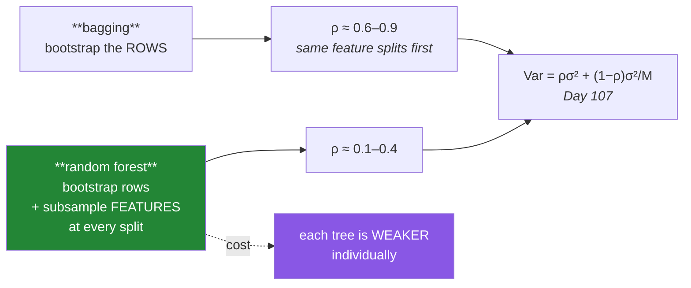

# Day 108 — Bagging and Random Forest

**Phase 13 · Module 13** · ID: **ML-19** (bootstrap aggregation, Random Forest, `max_features`)

> **Yesterday:** the variance formula, and the finding that lowering `ρ` is the only lever that
> matters.
> **Today:** the two algorithms that act on it. Bagging decorrelates by **resampling rows**; Random
> Forest adds a second, stranger idea — **hiding features from every split** — and today's job is to
> show that deliberately handicapping each tree makes the forest better.
> **Tomorrow:** out-of-bag evaluation and honest importance.

```bash
./m start 108 && ./m scaffold 108
```

**Time:** 110 minutes. **Request budget:** 0 model calls.

---

## §1 The story

**Bagging** is three lines. Draw a bootstrap sample (Day 68: resample `n` rows with replacement), fit
a model, repeat `M` times, average. Each tree sees a different sample, so each tree is different, so
`ρ < 1` and Day 107's second term shrinks.

But bagged trees stay **highly correlated**, and the reason is specific: if one feature is strongly
predictive, *every* tree splits on it first. The bootstrap changes which rows a tree sees; it does not
change which feature looks best.

**Random Forest's answer is to hide features.** At every split, consider only a random subset of
`max_features` columns. The dominant feature is unavailable for many splits, so other features get
used, and the trees genuinely diverge.



**The trade is explicit and you will measure both halves.** Each individual tree gets worse — it is
being denied its best feature much of the time. The forest gets better, because `ρ` falls further than
individual accuracy does. `max_features` is the dial: lower means more decorrelation and weaker trees.

Three details that matter in practice:

- **A bootstrap sample leaves out ~36.8% of rows** (it is `1/e`), and those rows are the free
  validation set Day 109 uses.
- **Trees are grown deep and unpruned.** Day 107's rule: bagging fixes variance, so you want low-bias
  high-variance base models. Pruning them defeats the point.
- **`n_estimators` cannot overfit.** More trees converge to a limit; they never degrade. That is
  unusual, and it is why Day 111's boosting needs early stopping while this does not.

---

## §2 Setup — run this

```bash
mkdir -p days/day-108/lab
touch days/day-108/lab/forest.py
```

`src/setu/ensembles.py` grows today. No new packages.

---

## §3 ML-19 — decorrelating

`days/day-108/lab/forest.py`:

```python
"""ML-19: bagging, and why hiding features makes the forest better."""

from __future__ import annotations

import numpy as np
from sklearn.ensemble import BaggingClassifier, RandomForestClassifier
from sklearn.model_selection import StratifiedKFold, cross_val_score, train_test_split
from sklearn.tree import DecisionTreeClassifier

from setu.arrays import make_rng


def data(n=4_000, p=12, *, seed=0, dominant=True):
    """One very strong feature, several moderate ones, the rest noise."""
    rng = make_rng(seed)
    x = rng.normal(0, 1, (n, p))
    weights = np.zeros(p)
    weights[0] = 3.0 if dominant else 1.0
    weights[1:5] = [1.0, -0.9, 0.7, -0.6]
    z = -0.3 + x @ weights + 0.6 * x[1] * x[2]
    return x, (rng.random(n) < 1 / (1 + np.exp(-z))).astype(int)


def bagging_from_scratch() -> None:
    x, y = data(n=2_000)
    x_train, x_test, y_train, y_test = train_test_split(
        x, y, test_size=0.3, stratify=y, random_state=0
    )
    rng = make_rng(1)
    n = len(x_train)

    predictions = []
    for _ in range(50):
        index = rng.choice(n, size=n, replace=True)      # THE bootstrap (Day 68)
        tree = DecisionTreeClassifier(random_state=0).fit(x_train[index], y_train[index])
        predictions.append(tree.predict_proba(x_test)[:, 1])

    predictions = np.array(predictions)
    single = ((predictions[0] >= 0.5) == y_test).mean()
    bagged = ((predictions.mean(axis=0) >= 0.5) == y_test).mean()

    print(f"\n  bagging in three lines: resample rows, fit, average.")
    print(f"    one tree        : {single:.4f}")
    print(f"    mean of 50 trees: {((predictions >= 0.5) == y_test).mean(axis=1).mean():.4f}")
    print(f"    bagged (averaged): {bagged:.4f}")

    library = BaggingClassifier(DecisionTreeClassifier(), n_estimators=50,
                                random_state=0).fit(x_train, y_train)
    print(f"    sklearn         : {library.score(x_test, y_test):.4f}")

    print("\n  Note the middle row: the AVERAGE TREE is no better than the first one.")
    print("  The gain comes entirely from averaging, exactly as Day 107 predicted.")


def the_bootstrap_leaves_rows_out() -> None:
    rng = make_rng(2)
    print(f"\n  {'n':>8} {'fraction left out':>19} {'1/e':>8}")
    for n in (10, 100, 1_000, 100_000):
        left_out = [1 - len(np.unique(rng.choice(n, n, replace=True))) / n for _ in range(200)]
        print(f"  {n:>8} {np.mean(left_out):>19.4f} {1 / np.e:>8.4f}")

    print("\n  About 36.8% of rows are missing from any bootstrap sample, converging to")
    print("  1/e. Each tree therefore has its own held-out set, for free.")
    print("  ⚠️ Those are the OUT-OF-BAG rows, and Day 109 turns them into an estimate")
    print("     of generalisation error with no cross-validation at all.")


def bagged_trees_stay_correlated() -> None:
    x, y = data(n=3_000)
    x_train, x_test, y_train, y_test = train_test_split(
        x, y, test_size=0.3, stratify=y, random_state=0
    )

    def tree_predictions(max_features):
        rng = make_rng(3)
        n = len(x_train)
        out = []
        for seed in range(40):
            index = rng.choice(n, n, replace=True)
            tree = DecisionTreeClassifier(max_features=max_features,
                                          random_state=seed).fit(x_train[index], y_train[index])
            out.append(tree.predict_proba(x_test)[:, 1])
        return np.array(out)

    print(f"\n  {'max_features':<16} {'mean single acc':>17} {'ensemble acc':>14} {'ρ':>8}")
    for label, max_features in (("all (bagging)", None), ("sqrt (forest)", "sqrt"),
                                ("2 of 12", 2), ("1 of 12", 1)):
        matrix = tree_predictions(max_features)
        singles = ((matrix >= 0.5) == y_test).mean(axis=1).mean()
        ensemble = ((matrix.mean(axis=0) >= 0.5) == y_test).mean()
        correlations = np.corrcoef(matrix)
        rho = correlations[np.triu_indices_from(correlations, k=1)].mean()
        print(f"  {label:<16} {singles:>17.4f} {ensemble:>14.4f} {rho:>8.4f}")

    print("\n  🚨 Read the first two columns TOGETHER. As max_features falls, each tree")
    print("     gets WORSE and the ensemble gets BETTER — because ρ falls faster.")
    print("\n  That is Day 107's counter-intuitive result made concrete. Random Forest")
    print("  deliberately handicaps every tree, and it works.")
    print("\n  And note the last row: at max_features=1 the trees are nearly random and")
    print("  the ensemble finally suffers too. There is an optimum, not a monotone rule.")


def why_bagging_alone_correlates() -> None:
    x, y = data(n=3_000, dominant=True)
    rng = make_rng(4)
    n = len(x)

    print(f"\n  which feature does each tree split on FIRST?")
    for label, max_features in (("bagging (all features)", None), ("forest (sqrt)", "sqrt")):
        first_splits = []
        for seed in range(60):
            index = rng.choice(n, n, replace=True)
            tree = DecisionTreeClassifier(max_features=max_features, max_depth=4,
                                          random_state=seed).fit(x[index], y[index])
            first_splits.append(int(tree.tree_.feature[0]))
        counts = np.bincount(first_splits, minlength=12)
        top = counts.argmax()
        print(f"\n    {label}")
        print(f"      feature {top} chosen first in {counts[top]}/60 trees "
              f"({counts[top] / 60:.0%})")
        print(f"      distinct first-split features: {int((counts > 0).sum())}")

    print("\n  With every feature available, the same dominant column wins nearly always.")
    print("  The bootstrap changed which ROWS a tree saw; it did not change which")
    print("  FEATURE looked best. That is precisely why bagged trees stay correlated.")
    print("\n  Hiding features breaks the tie, and the trees genuinely diverge.")


def tuning_max_features() -> None:
    x, y = data(n=4_000, p=20)
    cv = StratifiedKFold(5, shuffle=True, random_state=0)

    print(f"\n  {'max_features':<16} {'CV accuracy':>13} {'CV sd':>8}")
    for label, value in (("1", 1), ("sqrt ≈ 4", "sqrt"), ("8", 8),
                         ("log2 ≈ 4", "log2"), ("all (= bagging)", None)):
        scores = cross_val_score(
            RandomForestClassifier(n_estimators=150, max_features=value, random_state=0),
            x, y, cv=cv, n_jobs=-1,
        )
        print(f"  {label:<16} {scores.mean():>13.4f} {scores.std(ddof=1):>8.4f}")

    print("\n  `sqrt` is the classification default and it is usually close to optimal.")
    print("  For REGRESSION the traditional default is p/3 — more features per split,")
    print("  because regression trees need more information to pick a good threshold.")
    print("\n  ⚠️ With many NOISE features, a low max_features means many splits see only")
    print("     noise columns. Then a HIGHER value helps — the opposite of the usual advice.")


def more_trees_never_hurt() -> None:
    x, y = data(n=3_000)
    x_train, x_test, y_train, y_test = train_test_split(
        x, y, test_size=0.3, stratify=y, random_state=0
    )

    print(f"\n  {'n_estimators':>13} {'train':>8} {'test':>8}")
    for m in (1, 5, 20, 100, 400, 1_000):
        model = RandomForestClassifier(n_estimators=m, random_state=0,
                                       n_jobs=-1).fit(x_train, y_train)
        print(f"  {m:>13} {model.score(x_train, y_train):>8.4f} "
              f"{model.score(x_test, y_test):>8.4f}")

    print("\n  Test accuracy rises then FLATTENS. It does not fall.")
    print("\n  ⚠️ n_estimators is not a regularisation parameter — it cannot overfit, so")
    print("     do not tune it for accuracy. Set it as high as your latency budget")
    print("     allows and tune the parameters that DO control capacity: max_depth,")
    print("     min_samples_leaf, max_features.")
    print("\n  Day 111's boosting is the opposite: more rounds DO overfit, and early")
    print("  stopping is mandatory there.")


def depth_should_stay_unlimited() -> None:
    x, y = data(n=3_000)
    cv = StratifiedKFold(5, shuffle=True, random_state=0)

    print(f"\n  {'max_depth':>11} {'single tree':>13} {'forest (200)':>14}")
    for depth in (2, 4, 8, None):
        single = cross_val_score(DecisionTreeClassifier(max_depth=depth, random_state=0),
                                 x, y, cv=cv).mean()
        forest = cross_val_score(
            RandomForestClassifier(n_estimators=200, max_depth=depth, random_state=0,
                                   n_jobs=-1),
            x, y, cv=cv, n_jobs=-1,
        ).mean()
        label = "None" if depth is None else str(depth)
        print(f"  {label:>11} {single:>13.4f} {forest:>14.4f}")

    print("\n  A single tree needs pruning; the forest does best UNPRUNED.")
    print("  Day 107's rule: averaging fixes variance, so you want low-bias high-variance")
    print("  base models. Pruning lowers variance and raises bias — it is doing the")
    print("  averaging's job badly, and giving up accuracy for it.")


def where_forests_still_lose() -> None:
    rng = make_rng(6)
    n = 2_000
    x = rng.uniform(-3, 3, (n, 2))
    y_linear = (x[:, 0] + x[:, 1] > 0).astype(int)        # a diagonal boundary

    from sklearn.linear_model import LogisticRegression

    cv = StratifiedKFold(5, shuffle=True, random_state=0)
    print(f"\n  a purely DIAGONAL boundary (Day 105's limitation):")
    print(f"    logistic regression : "
          f"{cross_val_score(LogisticRegression(), x, y_linear, cv=cv).mean():.4f}")
    print(f"    random forest (300) : "
          f"{cross_val_score(RandomForestClassifier(n_estimators=300, random_state=0, n_jobs=-1), x, y_linear, cv=cv, n_jobs=-1).mean():.4f}")

    x_train = rng.uniform(-2, 2, (1_500, 1))
    y_train = (3.0 * x_train.ravel() + rng.normal(0, 0.3, 1_500))
    x_far = np.array([[6.0], [10.0]])

    from sklearn.ensemble import RandomForestRegressor
    from sklearn.linear_model import LinearRegression

    forest = RandomForestRegressor(n_estimators=200, random_state=0).fit(x_train, y_train)
    linear = LinearRegression().fit(x_train, y_train)

    print(f"\n  EXTRAPOLATION beyond the training range (x trained on [−2, 2]):")
    print(f"    {'x':>6} {'truth':>8} {'forest':>9} {'linear':>9}")
    for value, prediction_f, prediction_l in zip(
        x_far.ravel(), forest.predict(x_far), linear.predict(x_far), strict=True
    ):
        print(f"    {value:>6.1f} {3.0 * value:>8.1f} {prediction_f:>9.2f} {prediction_l:>9.2f}")

    print("\n  🚨 The forest's prediction is FLAT beyond its training range — it can only")
    print("     ever return an average of training targets it has seen.")
    print("  Averaging trees does not fix a tree's structural limits. Day 105's diagonal")
    print("  and extrapolation problems survive the ensemble unchanged.")


if __name__ == "__main__":
    bagging_from_scratch()
    the_bootstrap_leaves_rows_out()
    bagged_trees_stay_correlated()
    why_bagging_alone_correlates()
    tuning_max_features()
    more_trees_never_hurt()
    depth_should_stay_unlimited()
    where_forests_still_lose()
```

**Line by line:**

- `bagging_from_scratch` — three lines, and `rng.choice(n, n, replace=True)` is Day 68's bootstrap
  reused. **Note the middle row**: the average tree is no better than the first one, so the entire gain
  comes from averaging, exactly as Day 107 predicted.
- `the_bootstrap_leaves_rows_out` — **~36.8%, converging to `1/e`**. Each tree has its own held-out set
  for free, and Day 109 turns those rows into a generalisation estimate with no cross-validation.
- `bagged_trees_stay_correlated` — **the day's centre. Read the first two columns together.** As
  `max_features` falls, each tree gets *worse* and the ensemble gets *better*, because `ρ` falls
  faster. And the last row matters too: at `max_features=1` the trees are nearly random and the
  ensemble finally suffers — **there is an optimum, not a monotone rule.**
- `why_bagging_alone_correlates` — the mechanism. With every feature available, the same dominant
  column wins the first split nearly always. **The bootstrap changed which rows a tree saw; it did not
  change which feature looked best.** That is precisely why bagged trees stay correlated, and hiding
  features is what breaks the tie.
- `tuning_max_features` — `sqrt` for classification, `p/3` traditionally for regression. And the
  reversal worth knowing: **with many noise features a *higher* `max_features` helps**, because a low
  value means many splits see only noise columns.
- `more_trees_never_hurt` — test accuracy rises then **flattens**; it does not fall. **`n_estimators`
  is not a regularisation parameter** — set it as high as latency allows and tune the parameters that
  actually control capacity. Day 111's boosting is the opposite.
- `depth_should_stay_unlimited` — a single tree needs pruning, the forest does best **unpruned**.
  Pruning lowers variance and raises bias, which is **doing the averaging's job badly** and paying bias
  for it.
- `where_forests_still_lose` — two structural limits from Day 105 that **survive the ensemble
  unchanged**. The diagonal boundary still costs, and the extrapolation is flat: a forest can only ever
  return an average of training targets it has seen. **Averaging trees does not fix a tree's structural
  limits.**

---

## §4 Build brief

Extend `src/setu/ensembles.py`:

```python
def bootstrap_indices(n: int, *, n_samples: int | None = None, seed: int = 42) -> dict:
    """TODO(me): one bootstrap draw, plus the rows it left out.

    {"in_bag": ndarray, "out_of_bag": ndarray, "oob_fraction": float, "n": int}
    - in_bag has n_samples entries WITH replacement (default n_samples = n)
    - out_of_bag is every index not drawn — Day 109 depends on this being correct
    - oob_fraction should sit near 1/e ≈ 0.368 when n_samples == n
    - raise DataError if n < 2 or n_samples < 1
    - reproducible via make_rng(seed)
    """
    raise NotImplementedError


def fit_bagged(model_fn, x, y, *, n_estimators: int = 50, max_samples: float = 1.0,
               seed: int = 42) -> dict:
    """TODO(me): bagging from scratch, keeping the OOB bookkeeping.

    {"models": [...], "oob_indices": [...], "n_estimators", "in_bag_counts": ndarray}
    - model_fn() must return a FRESH unfitted model each call (Day 97's rule)
    - in_bag_counts[i] is how many models used row i — Day 109 needs it, and a row
      used by EVERY model has no OOB estimate at all
    - raise DataError if any row is in-bag for every model, naming how many rows —
      that means n_estimators is too small for a reliable OOB estimate
    - raise DataError if n_estimators < 2, or max_samples outside (0, 1]
    """
    raise NotImplementedError


def decorrelation_curve(x, y, *, max_features_values, n_estimators: int = 40,
                        cv, seed: int = 42) -> dict:
    """TODO(me): §3.3 — the trade, as data.

    {"results": [{"max_features", "mean_single_score", "ensemble_score", "rho"}],
     "best_max_features", "trade_is_visible": bool, "note": str}
    - trade_is_visible is True when some setting has a LOWER mean_single_score and a
      HIGHER ensemble_score than another — that is the counter-intuitive result, and
      confirming it is present is the point of the function
    - the note must state the trade in words when it is visible
    - raise DataError on fewer than 2 values to compare
    """
    raise NotImplementedError


def forest_defaults(*, task: str, n_features: int, n_noise_features: int | None = None) -> dict:
    """TODO(me): sensible starting parameters, with reasons. PURE.

    {"max_features", "max_depth", "min_samples_leaf", "n_estimators", "reasons": {...}}
    - classification -> 'sqrt'; regression -> max(1, n_features // 3)
    - max_depth is None: pruning does the averaging's job badly (§3.7)
    - when n_noise_features exceeds half the features, RAISE max_features and say why
      in reasons — the usual advice reverses (§3.5)
    - every parameter must have an entry in `reasons`; a default with no reason is
      cargo cult
    - raise DataError on an unknown task or n_features < 1
    """
    raise NotImplementedError


def assert_n_estimators_not_tuned(cv_scores_by_n: dict) -> None:
    """TODO(me): raise DataError if someone is treating n_estimators as capacity.

    - the scores should be non-decreasing then flat; if a caller is selecting the
      'best' n_estimators from a curve that has flattened, they are fitting noise
    - raise when the chosen n is not the largest tried AND the score difference is
      within the CV noise — the message must say n_estimators cannot overfit and to
      tune max_depth / min_samples_leaf / max_features instead (§3.6)
    """
    raise NotImplementedError


def forest_limitations(x, y, *, task: str = "classification") -> dict:
    """TODO(me): §3.8 — what the ensemble does NOT fix.

    {"diagonal_penalty": float, "extrapolates": bool, "training_range": (min, max),
     "notes": [...]}
    - diagonal_penalty compares a forest against a linear model on the data as given;
      a large positive value means the boundary is probably linear/diagonal
    - extrapolates is always False for a forest — state it as a fact, with the
      training range, so a caller knows where predictions become meaningless
    - the notes must cite Day 105: these are TREE limits, and averaging does not fix them
    """
    raise NotImplementedError
```

- `fit_bagged` **refusing when some row is in-bag for every model** is the guard that makes Day 109
  possible: a row with no OOB estimate silently distorts the average, and the caller needs to know.
- `forest_defaults` requiring a **reason per parameter** is deliberate — `max_features='sqrt'` copied
  without knowing why is cargo cult, and §3.5 showed a case where it reverses.
- `assert_n_estimators_not_tuned` encodes §3.6: selecting the "best" `n_estimators` from a flattened
  curve is fitting CV noise, and the message redirects to the parameters that actually control capacity.

---

## §5 The eval that must be able to fail

Add to `tests/test_ensembles.py`:

```python
from setu.ensembles import (
    assert_n_estimators_not_tuned,
    bootstrap_indices,
    decorrelation_curve,
    fit_bagged,
    forest_defaults,
    forest_limitations,
)


@pytest.fixture(scope="module")
def dominant():
    """One very strong feature — the case where bagging alone correlates."""
    rng = make_rng(0)
    n, p = 2_500, 12
    x = rng.normal(0, 1, (n, p))
    weights = np.zeros(p)
    weights[0] = 3.0
    weights[1:5] = [1.0, -0.9, 0.7, -0.6]
    z = -0.3 + x @ weights
    return x, (rng.random(n) < 1 / (1 + np.exp(-z))).astype(int)


def test_the_bootstrap_leaves_out_about_a_third():
    """1/e, and Day 109 depends on it."""
    fractions = [bootstrap_indices(2_000, seed=s)["oob_fraction"] for s in range(20)]
    assert np.mean(fractions) == pytest.approx(1 / np.e, abs=0.02)


def test_in_bag_and_out_of_bag_partition_the_rows():
    result = bootstrap_indices(500, seed=1)
    assert set(result["in_bag"]) | set(result["out_of_bag"]) == set(range(500))
    assert not (set(result["in_bag"]) & set(result["out_of_bag"]))


def test_the_bootstrap_draws_with_replacement():
    result = bootstrap_indices(500, seed=2)
    assert len(result["in_bag"]) == 500
    assert len(set(result["in_bag"])) < 500, "sampling without replacement is not a bootstrap"


def test_bootstrap_is_reproducible():
    assert np.array_equal(bootstrap_indices(300, seed=7)["in_bag"],
                          bootstrap_indices(300, seed=7)["in_bag"])


def test_bootstrap_rejects_a_tiny_n():
    with pytest.raises(DataError):
        bootstrap_indices(1)


def test_bagging_beats_a_single_model(dominant):
    from sklearn.model_selection import train_test_split
    from sklearn.tree import DecisionTreeClassifier

    x, y = dominant
    x_train, x_test, y_train, y_test = train_test_split(
        x, y, test_size=0.3, stratify=y, random_state=0
    )
    result = fit_bagged(lambda: DecisionTreeClassifier(random_state=0),
                        x_train, y_train, n_estimators=40)

    probabilities = np.array([m.predict_proba(x_test)[:, 1] for m in result["models"]])
    single = ((probabilities >= 0.5) == y_test).mean(axis=1).mean()
    bagged = ((probabilities.mean(axis=0) >= 0.5) == y_test).mean()
    assert bagged > single


def test_a_fresh_model_is_built_per_estimator(dominant):
    from sklearn.tree import DecisionTreeClassifier

    x, y = dominant
    seen = []

    def model_fn():
        model = DecisionTreeClassifier(random_state=0)
        seen.append(id(model))
        return model

    fit_bagged(model_fn, x[:400], y[:400], n_estimators=6)
    assert len(set(seen)) == 6, "a model instance was reused across estimators"


def test_in_bag_counts_are_tracked(dominant):
    """Day 109 needs to know how many models saw each row."""
    from sklearn.tree import DecisionTreeClassifier

    x, y = dominant
    result = fit_bagged(lambda: DecisionTreeClassifier(random_state=0),
                        x[:600], y[:600], n_estimators=25)
    counts = result["in_bag_counts"]
    assert len(counts) == 600
    assert counts.mean() == pytest.approx(25 * (1 - 1 / np.e), rel=0.1)


def test_too_few_estimators_leaves_rows_with_no_oob_estimate(dominant):
    """A row in-bag for every model has no held-out prediction at all."""
    from sklearn.tree import DecisionTreeClassifier

    x, y = dominant
    with pytest.raises(DataError) as info:
        fit_bagged(lambda: DecisionTreeClassifier(random_state=0),
                   x[:300], y[:300], n_estimators=2)
    assert "oob" in str(info.value).lower() or "estimator" in str(info.value).lower()


def test_bagging_rejects_a_single_estimator(dominant):
    from sklearn.tree import DecisionTreeClassifier

    x, y = dominant
    with pytest.raises(DataError):
        fit_bagged(lambda: DecisionTreeClassifier(), x[:200], y[:200], n_estimators=1)


def test_hiding_features_lowers_the_correlation(dominant):
    """Random Forest's entire mechanism."""
    from sklearn.model_selection import StratifiedKFold

    x, y = dominant
    curve = decorrelation_curve(x, y, max_features_values=[None, "sqrt", 2],
                                n_estimators=30,
                                cv=StratifiedKFold(3, shuffle=True, random_state=0))
    by_setting = {str(r["max_features"]): r for r in curve["results"]}
    assert by_setting["sqrt"]["rho"] < by_setting["None"]["rho"]


def test_weaker_trees_make_a_better_ensemble(dominant):
    """Day 107's counter-intuitive result, made concrete."""
    from sklearn.model_selection import StratifiedKFold

    x, y = dominant
    curve = decorrelation_curve(x, y, max_features_values=[None, "sqrt"],
                                n_estimators=40,
                                cv=StratifiedKFold(3, shuffle=True, random_state=0))
    by_setting = {str(r["max_features"]): r for r in curve["results"]}
    assert by_setting["sqrt"]["mean_single_score"] <= by_setting["None"]["mean_single_score"]
    assert by_setting["sqrt"]["ensemble_score"] >= by_setting["None"]["ensemble_score"]
    assert curve["trade_is_visible"] is True


def test_the_trade_is_described_in_words(dominant):
    from sklearn.model_selection import StratifiedKFold

    x, y = dominant
    curve = decorrelation_curve(x, y, max_features_values=[None, "sqrt", 2],
                                n_estimators=30,
                                cv=StratifiedKFold(3, shuffle=True, random_state=0))
    if curve["trade_is_visible"]:
        note = curve["note"].lower()
        assert "weaker" in note or "worse" in note
        assert "ensemble" in note or "forest" in note


def test_the_curve_needs_something_to_compare(dominant):
    from sklearn.model_selection import StratifiedKFold

    x, y = dominant
    with pytest.raises(DataError):
        decorrelation_curve(x, y, max_features_values=["sqrt"],
                            cv=StratifiedKFold(3))


def test_classification_defaults_to_sqrt():
    result = forest_defaults(task="classification", n_features=16)
    assert result["max_features"] == "sqrt"


def test_regression_uses_more_features_per_split():
    result = forest_defaults(task="regression", n_features=30)
    assert result["max_features"] == 10


def test_depth_is_unlimited_by_default():
    """Pruning does the averaging's job badly."""
    result = forest_defaults(task="classification", n_features=10)
    assert result["max_depth"] is None
    assert "averag" in result["reasons"]["max_depth"].lower() or \
           "varianc" in result["reasons"]["max_depth"].lower()


def test_every_default_carries_a_reason():
    """A default with no reason is cargo cult."""
    result = forest_defaults(task="classification", n_features=12)
    for key in ("max_features", "max_depth", "min_samples_leaf", "n_estimators"):
        assert key in result["reasons"]
        assert len(result["reasons"][key]) > 15


def test_many_noise_features_reverse_the_usual_advice():
    """A low max_features means many splits see only noise."""
    clean = forest_defaults(task="classification", n_features=20, n_noise_features=2)
    noisy = forest_defaults(task="classification", n_features=20, n_noise_features=16)

    def as_number(value, p=20):
        return int(np.sqrt(p)) if value == "sqrt" else value

    assert as_number(noisy["max_features"]) > as_number(clean["max_features"])
    assert "noise" in noisy["reasons"]["max_features"].lower()


def test_forest_defaults_rejects_an_unknown_task():
    with pytest.raises(DataError):
        forest_defaults(task="clustering", n_features=5)


def test_selecting_a_flattened_n_estimators_is_refused():
    """n_estimators cannot overfit; it is not a capacity parameter."""
    scores = {50: 0.8410, 100: 0.8425, 200: 0.8428, 400: 0.8429}
    with pytest.raises(DataError) as info:
        assert_n_estimators_not_tuned({"scores": scores, "chosen": 100})
    message = str(info.value).lower()
    assert "overfit" in message or "capacity" in message
    assert "max_depth" in message or "min_samples_leaf" in message


def test_choosing_the_largest_n_estimators_is_fine():
    scores = {50: 0.8410, 100: 0.8425, 200: 0.8428, 400: 0.8429}
    assert_n_estimators_not_tuned({"scores": scores, "chosen": 400})


def test_a_forest_never_extrapolates():
    """It can only return an average of training targets it has seen."""
    rng = make_rng(3)
    x = rng.uniform(-2, 2, (800, 1))
    y = 3.0 * x.ravel() + rng.normal(0, 0.3, 800)
    result = forest_limitations(x, y, task="regression")
    assert result["extrapolates"] is False
    assert result["training_range"][1] == pytest.approx(x.max(), rel=1e-6)


def test_a_diagonal_boundary_is_detected():
    """Day 105's limitation survives the ensemble."""
    rng = make_rng(4)
    x = rng.uniform(-3, 3, (1_500, 2))
    y = (x[:, 0] + x[:, 1] > 0).astype(int)
    result = forest_limitations(x, y)
    assert result["diagonal_penalty"] > 0


def test_an_axis_aligned_boundary_is_not_penalised():
    """A detector that always fires is useless."""
    rng = make_rng(5)
    x = rng.uniform(-3, 3, (1_500, 2))
    y = ((x[:, 0] > 0) & (x[:, 1] > 0)).astype(int)
    result = forest_limitations(x, y)
    assert result["diagonal_penalty"] <= 0.02


def test_the_notes_credit_the_underlying_tree_limit():
    rng = make_rng(6)
    x = rng.uniform(-3, 3, (800, 2))
    y = (x[:, 0] + x[:, 1] > 0).astype(int)
    notes = " ".join(forest_limitations(x, y)["notes"]).lower()
    assert "tree" in notes
    assert "averag" in notes or "ensemble" in notes
```

**Line by line:**

- `test_weaker_trees_make_a_better_ensemble` — **the day's real assessment**, and it needs all three
  assertions. Individual trees get *worse* with `max_features='sqrt'`, the ensemble gets *better*, and
  `trade_is_visible` confirms the function noticed. That is Day 107's counter-intuitive result turned
  into an executable claim.
- `test_the_bootstrap_draws_with_replacement` — asserts **fewer unique indices than draws**. Sampling
  without replacement is not a bootstrap, and it silently produces a useless "ensemble" of identical
  models.
- `test_too_few_estimators_leaves_rows_with_no_oob_estimate` — at `n_estimators=2` some rows are in-bag
  for both, so they have **no held-out prediction at all**. Day 109's estimate would silently exclude
  them; this makes it an error instead.
- `test_many_noise_features_reverse_the_usual_advice` — `sqrt` is not always right. **With mostly noise
  columns a low `max_features` means many splits see only noise**, and the default must move.
- `test_selecting_a_flattened_n_estimators_is_refused` with `test_choosing_the_largest_n_estimators_is_fine`
  — the pair pins §3.6. Picking 100 from a flattened curve is fitting CV noise; picking the largest is
  fine.
- `test_a_forest_never_extrapolates` — stated as a **fact rather than a measurement**, with the
  training range attached so a caller knows where predictions stop meaning anything.
- `test_an_axis_aligned_boundary_is_not_penalised` — the negative case. A diagonal detector that always
  fires tells you nothing.
- `test_every_default_carries_a_reason` — over 15 characters per parameter. `max_features='sqrt'`
  copied without knowing why is exactly the habit this project exists to break.

```bash
uv run python -m pytest tests/test_ensembles.py -v
```

---

## §6 Request budget

| Resource | Spent today |
|---|---|
| LLM calls | **0** |
| Compute | a few thousand trees; seconds with `n_jobs=-1` |

---

## §7 Traps

- **Bagging without feature subsampling on a dominant feature.** The trees stay correlated.
- **Judging `max_features` by individual tree accuracy.** Lower is worse per tree, better per forest.
- **`max_features=1` as "maximum decorrelation".** The trees become random; there is an optimum.
- **`sqrt` on data that is mostly noise columns.** The advice reverses.
- **Tuning `n_estimators` for accuracy.** It cannot overfit.
- **Pruning trees inside a forest.** Doing the averaging's job badly.
- **Sampling without replacement.** That is not a bootstrap.
- **Too few estimators for an OOB estimate.** Some rows are never out-of-bag.
- **Expecting a forest to extrapolate.** It returns an average of seen targets.
- **Expecting averaging to fix a diagonal boundary.** Day 105's limits survive.
- **`n_jobs` left at 1.** Forests parallelise perfectly; there is no reason not to.

---

## §8 Verify before you code

Written **2026-08-21**:

- <https://scikit-learn.org/stable/modules/generated/sklearn.ensemble.RandomForestClassifier.html> —
  confirm the `max_features` default for your pinned version; it has changed historically.
- <https://scikit-learn.org/stable/modules/ensemble.html#random-forests> — sklearn's own note on the
  bias/variance trade of feature subsampling.
- <https://scikit-learn.org/stable/modules/generated/sklearn.ensemble.BaggingClassifier.html> —
  `max_samples`, `max_features` and `bootstrap_features`.
- <https://scikit-learn.org/stable/auto_examples/ensemble/plot_forest_importances.html> — the
  importance example, which Day 109 will complicate.

---

## §9 Say it in an interview

> "Bagging is three lines — bootstrap the rows, fit, average — and it works because the trees differ.
> But bagged trees stay quite correlated, and the reason is specific: if one feature is strongly
> predictive, every tree splits on it first. The bootstrap changes which *rows* a tree sees, not which
> *feature* looks best. Random Forest's answer is to hide features: at each split only a random subset
> is available, so the dominant column isn't there most of the time and the trees genuinely diverge.
> The measurement I'd show is that as you lower `max_features`, each individual tree gets *worse* and
> the forest gets *better*, because correlation falls faster than accuracy does — you're deliberately
> handicapping every tree and it pays. Two practical things: `n_estimators` isn't a capacity
> parameter, it can't overfit, so set it by your latency budget and tune depth and `max_features`
> instead. And averaging doesn't fix a tree's *structural* limits — a forest still can't extrapolate
> beyond its training range, it just returns an average of targets it has already seen."

---

## §10 Done when

Tick [`CHECKLIST.md`](CHECKLIST.md), then `./m check && ./m done 108`.
