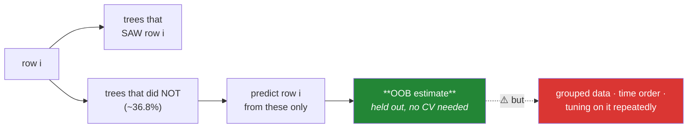

# Day 109 — Out-of-bag evaluation and honest feature importance

**Phase 13 · Module 13** · ID: **ML-20** (OOB error, permutation importance, correlated features)

> **Yesterday:** the bootstrap leaves out about 36.8% of rows every time.
> **Today:** those rows are a **free validation set**, and then the harder half — feature importance,
> which is where ensembles most often mislead. Day 105 showed Gini importance being fooled by a noise
> column. Today you find the failure that fools **permutation importance too**, and what to do about
> it.
> **Tomorrow:** boosting.

```bash
./m start 109 && ./m scaffold 109
```

**Time:** 110 minutes. **Request budget:** 0 model calls.

---

## §1 The story

Every tree in a bagged ensemble was fitted without ~36.8% of the rows. For any given row, roughly a
third of the trees never saw it — so you can predict that row using **only those trees**, and you have
a held-out prediction that cost nothing.

That is the **out-of-bag estimate**, and it is close to leave-one-out cross-validation for free.



**The caveats are the same ones Day 97 established**, and they matter more here because OOB *looks*
free and so gets trusted uncritically. The bootstrap samples **rows**, so if rows share a patient or a
session, OOB leaks exactly as plain k-fold does. And on time-ordered data it trains on the future.

Then **feature importance**, which is where this gets genuinely difficult.

Day 105 established two failures of Gini importance: it inflates high-cardinality features, and it is
computed on training data. Permutation importance fixes both — shuffle a column on held-out data and
measure the damage.

**But permutation importance has its own failure, and it is severe: correlated features.** Shuffle one
of two near-duplicate columns and the model just uses the other. Both look unimportant. You can have
two features that are jointly essential and individually measure as worthless — and nothing in the
number warns you.

The honest position, which §3 builds toward: **importance is not a property of a feature.** It is a
property of *a feature, a model, and a dataset*, and for correlated groups it is only interpretable at
the group level.

---

## §2 Setup — run this

```bash
mkdir -p days/day-109/lab
touch days/day-109/lab/oob.py
```

`src/setu/ensembles.py` grows today. No new packages.

---

## §3 ML-20 — free validation, expensive importance

`days/day-109/lab/oob.py`:

```python
"""ML-20: out-of-bag estimates, and why feature importance is harder than it looks."""

from __future__ import annotations

import numpy as np
import pandas as pd
from sklearn.ensemble import RandomForestClassifier, RandomForestRegressor
from sklearn.inspection import permutation_importance
from sklearn.model_selection import StratifiedKFold, cross_val_score, train_test_split

from setu.arrays import make_rng

NAMES = ["signal_a", "signal_b", "signal_c", "copy_of_a", "noise_1", "noise_2",
         "many_ids", "noise_3"]


def data(n=4_000, *, seed=0):
    """Includes a near-duplicate of signal_a and a high-cardinality noise column."""
    rng = make_rng(seed)
    signal_a = rng.normal(0, 1, n)
    frame = pd.DataFrame({
        "signal_a": signal_a,
        "signal_b": rng.normal(0, 1, n),
        "signal_c": rng.normal(0, 1, n),
        "copy_of_a": signal_a + rng.normal(0, 0.03, n),      # near-duplicate
        "noise_1": rng.normal(0, 1, n),
        "noise_2": rng.normal(0, 1, n),
        "many_ids": rng.integers(0, n, n).astype(float),      # high cardinality, no signal
        "noise_3": rng.normal(0, 1, n),
    })
    z = -0.2 + 1.6 * signal_a + 1.1 * frame["signal_b"] - 0.8 * frame["signal_c"]
    return frame, (rng.random(n) < 1 / (1 + np.exp(-z))).astype(int)


def oob_is_free_validation() -> None:
    frame, y = data()
    x = frame.to_numpy()

    model = RandomForestClassifier(n_estimators=300, oob_score=True, random_state=0,
                                   n_jobs=-1).fit(x, y)
    cv = cross_val_score(
        RandomForestClassifier(n_estimators=300, random_state=0, n_jobs=-1),
        x, y, cv=StratifiedKFold(5, shuffle=True, random_state=0), n_jobs=-1,
    )

    print(f"\n  OOB score        : {model.oob_score_:.4f}   (one fit)")
    print(f"  5-fold CV mean   : {cv.mean():.4f}   (five fits, sd {cv.std(ddof=1):.4f})")
    print(f"  difference       : {abs(model.oob_score_ - cv.mean()):.4f}")

    print("\n  Close, for a fifth of the compute. Each row was predicted using only the")
    print("  ~36.8% of trees that never saw it (Day 108).")
    print("\n  ⚠️ `oob_score=True` requires bootstrap=True. With bootstrap=False every")
    print("     tree sees every row and there is no out-of-bag set at all.")


def oob_needs_enough_trees() -> None:
    frame, y = data(n=2_000)
    x = frame.to_numpy()

    print(f"\n  {'n_estimators':>13} {'OOB score':>11} {'rows with no OOB prediction':>30}")
    for m in (5, 10, 30, 100, 500):
        model = RandomForestClassifier(n_estimators=m, oob_score=True, random_state=0,
                                       n_jobs=-1).fit(x, y)
        never_out = int((model.oob_decision_function_.sum(axis=1) == 0).sum())
        print(f"  {m:>13} {model.oob_score_:>11.4f} {never_out:>30,}")

    print("\n  With few trees, some rows are in-bag EVERY time and get no prediction at")
    print("  all — sklearn returns nan for them and silently excludes them from the score.")
    print(f"\n  P(a row is in-bag in all M trees) ≈ (1 − 1/e)^M:")
    for m in (5, 10, 30):
        print(f"    M={m:>3}: {(1 - 1 / np.e) ** m:.5f} × n rows")
    print("\n  ⚠️ An OOB score computed on a subset of your rows is not the score you think.")
    print("     Below ~50 trees, do not trust it; use cross-validation.")


def oob_leaks_on_grouped_data() -> None:
    rng = make_rng(1)
    n_patients, per_patient = 150, 8
    patient = np.repeat(np.arange(n_patients), per_patient)
    effect = rng.normal(0, 2.5, n_patients)[patient]
    x = np.c_[rng.normal(0, 1, len(patient)), effect + rng.normal(0, 0.3, len(patient))]
    y = (effect + rng.normal(0, 1.0, len(patient)) > 0).astype(int)

    from sklearn.model_selection import GroupKFold

    oob = RandomForestClassifier(n_estimators=300, oob_score=True, random_state=0,
                                 n_jobs=-1).fit(x, y).oob_score_
    grouped = cross_val_score(
        RandomForestClassifier(n_estimators=300, random_state=0, n_jobs=-1),
        x, y, cv=GroupKFold(5), groups=patient, n_jobs=-1,
    ).mean()

    print(f"\n  {len(patient)} rows from {n_patients} patients:")
    print(f"    OOB score        : {oob:.4f}")
    print(f"    GroupKFold score : {grouped:.4f}")
    print(f"    inflation        : {(oob - grouped) * 100:+.1f} percentage points")

    print("\n  🚨 The bootstrap samples ROWS. A patient's other rows are almost certainly")
    print("     in-bag, so the tree has effectively seen this patient before.")
    print("\n  OOB inherits EVERY limitation of a random split (Day 97). It is free")
    print("  validation only when plain k-fold would have been valid — which is exactly")
    print("  when people forget to check.")


def gini_importance_is_still_fooled() -> None:
    frame, y = data()
    model = RandomForestClassifier(n_estimators=300, random_state=0,
                                   n_jobs=-1).fit(frame, y)

    importance = pd.Series(model.feature_importances_, index=frame.columns)
    print(f"\n  Gini (impurity) importance:")
    for name, value in importance.sort_values(ascending=False).items():
        marker = "  🚨 pure noise" if name == "many_ids" else ""
        print(f"    {name:<12} {value:.4f}{marker}")

    print("\n  `many_ids` is uniform random integers with NO relationship to the target,")
    print("  and it ranks above real signal. Day 105's finding, still true in a forest.")
    print("\n  Why: a high-cardinality column offers many candidate split points, so it")
    print("  can always find one that reduces training impurity a little — by chance.")
    print("  And impurity is measured on TRAINING data, which never punishes that.")


def permutation_importance_on_held_out_data() -> None:
    frame, y = data()
    x_train, x_test, y_train, y_test = train_test_split(
        frame, y, test_size=0.3, stratify=y, random_state=0
    )
    model = RandomForestClassifier(n_estimators=300, random_state=0,
                                   n_jobs=-1).fit(x_train, y_train)

    result = permutation_importance(model, x_test, y_test, n_repeats=10,
                                    random_state=0, n_jobs=-1)
    importance = pd.Series(result.importances_mean, index=frame.columns)
    spread = pd.Series(result.importances_std, index=frame.columns)

    print(f"\n  permutation importance, on HELD-OUT data:")
    print(f"  {'feature':<12} {'mean drop':>11} {'sd':>8}")
    for name in importance.sort_values(ascending=False).index:
        print(f"  {name:<12} {importance[name]:>11.4f} {spread[name]:>8.4f}")

    print("\n  `many_ids` now sits at ~0. Shuffling it does not hurt held-out accuracy,")
    print("  because it never carried real information.")
    print("\n  ✅ Two fixes at once: measured on data the model did not train on, and it")
    print("     asks the question you actually care about — 'what does the MODEL lose")
    print("     if this feature becomes noise?'")


def but_permutation_breaks_on_correlated_features() -> None:
    frame, y = data()
    x_train, x_test, y_train, y_test = train_test_split(
        frame, y, test_size=0.3, stratify=y, random_state=0
    )
    model = RandomForestClassifier(n_estimators=300, random_state=0,
                                   n_jobs=-1).fit(x_train, y_train)
    result = permutation_importance(model, x_test, y_test, n_repeats=10,
                                    random_state=0, n_jobs=-1)
    importance = pd.Series(result.importances_mean, index=frame.columns)

    print(f"\n  correlation(signal_a, copy_of_a) = "
          f"{frame['signal_a'].corr(frame['copy_of_a']):.4f}")
    print(f"\n    signal_a  importance = {importance['signal_a']:.4f}")
    print(f"    copy_of_a importance = {importance['copy_of_a']:.4f}")
    print(f"    signal_b  importance = {importance['signal_b']:.4f}  (no duplicate)")

    baseline = model.score(x_test, y_test)
    both_dropped = RandomForestClassifier(n_estimators=300, random_state=0, n_jobs=-1).fit(
        x_train.drop(columns=["signal_a", "copy_of_a"]), y_train
    ).score(x_test.drop(columns=["signal_a", "copy_of_a"]), y_test)

    print(f"\n  drop BOTH a and its copy:")
    print(f"    with them    : {baseline:.4f}")
    print(f"    without both : {both_dropped:.4f}")
    print(f"    joint cost   : {baseline - both_dropped:.4f}")

    print("\n  🚨 Individually each looks minor. Jointly they are the strongest signal")
    print("     in the data. Shuffle one and the model reads the other — so neither")
    print("     permutation registers a loss.")
    print("\n  ⚠️ Permutation importance also evaluates the model on IMPOSSIBLE rows:")
    print("     shuffling signal_a while copy_of_a stays put creates combinations that")
    print("     never occur in reality, so you are asking the model about a world it")
    print("     was never fitted for.")


def group_the_correlated_features() -> None:
    frame, y = data()
    x_train, x_test, y_train, y_test = train_test_split(
        frame, y, test_size=0.3, stratify=y, random_state=0
    )
    model = RandomForestClassifier(n_estimators=300, random_state=0,
                                   n_jobs=-1).fit(x_train, y_train)
    baseline = model.score(x_test, y_test)

    groups = {
        "a-group": ["signal_a", "copy_of_a"],
        "b": ["signal_b"],
        "c": ["signal_c"],
        "noise": ["noise_1", "noise_2", "noise_3", "many_ids"],
    }

    rng = make_rng(2)
    print(f"\n  permute each GROUP together (baseline {baseline:.4f}):")
    print(f"  {'group':<10} {'accuracy after':>16} {'drop':>8}")
    for name, columns in groups.items():
        shuffled = x_test.copy()
        order = rng.permutation(len(shuffled))
        shuffled[columns] = shuffled[columns].to_numpy()[order]      # keep them TOGETHER
        score = model.score(shuffled, y_test)
        print(f"  {name:<10} {score:>16.4f} {baseline - score:>8.4f}")

    print("\n  ✅ The a-group now shows its true joint importance. Permuting the columns")
    print("     TOGETHER preserves their correlation, so no impossible rows are created.")
    print("\n  The rule: for correlated features, importance is only interpretable at the")
    print("  GROUP level. Cluster the columns first (Day 86's redundancy report), then")
    print("  permute each cluster as a unit.")


def importance_is_not_a_property_of_a_feature() -> None:
    frame, y = data(n=3_000)
    x_train, x_test, y_train, y_test = train_test_split(
        frame, y, test_size=0.3, stratify=y, random_state=0
    )

    from sklearn.linear_model import LogisticRegression
    from sklearn.pipeline import make_pipeline
    from sklearn.preprocessing import StandardScaler

    print(f"\n  the SAME data, importance of `signal_c` under three models:")
    for label, model in (
        ("random forest", RandomForestClassifier(n_estimators=200, random_state=0, n_jobs=-1)),
        ("logistic", make_pipeline(StandardScaler(), LogisticRegression(max_iter=2_000))),
        ("shallow forest", RandomForestClassifier(n_estimators=200, max_depth=2,
                                                  random_state=0, n_jobs=-1)),
    ):
        model.fit(x_train, y_train)
        result = permutation_importance(model, x_test, y_test, n_repeats=8,
                                        random_state=0, n_jobs=-1)
        value = result.importances_mean[list(frame.columns).index("signal_c")]
        print(f"    {label:<16} {value:>8.4f}")

    print("\n  Different numbers, same feature, same data. Importance is a property of")
    print("  a FEATURE + a MODEL + a DATASET — never of the feature alone.")
    print("\n  ⚠️ So 'signal_c has importance 0.04' is not a finding about the world.")
    print("     'This model relies on signal_c for 0.04 of its held-out accuracy' is.")


def what_importance_cannot_tell_you() -> None:
    print("\n  importance is NOT:")
    print("    - causation                — Day 62; a confounder is 'important' too")
    print("    - a feature-selection rule — dropping a correlated pair's members one")
    print("                                 at a time can drop both (§3.6)")
    print("    - stable across resamples  — Day 105; check it (Day 98's selection_stability)")
    print("    - comparable across models — §3.7")
    print("    - meaningful without a spread — a mean drop of 0.01 ± 0.03 is nothing")
    print("\n  What it IS: a statement about what THIS model, on THIS data, would lose")
    print("  if a feature became noise. That is genuinely useful, and it is narrower")
    print("  than what people usually claim from it.")


if __name__ == "__main__":
    oob_is_free_validation()
    oob_needs_enough_trees()
    oob_leaks_on_grouped_data()
    gini_importance_is_still_fooled()
    permutation_importance_on_held_out_data()
    but_permutation_breaks_on_correlated_features()
    group_the_correlated_features()
    importance_is_not_a_property_of_a_feature()
    what_importance_cannot_tell_you()
```

**Line by line:**

- `oob_is_free_validation` — the OOB score lands close to 5-fold CV **for a fifth of the compute.** And
  the requirement is easy to miss: `oob_score=True` needs `bootstrap=True`, or there is no out-of-bag
  set at all.
- `oob_needs_enough_trees` — **with few trees some rows are in-bag every time**, get no prediction, and
  sklearn silently excludes them. `P(in-bag in all M) ≈ (1 − 1/e)^M`, which is still 1% at M=10. **An
  OOB score computed on a subset of your rows is not the score you think it is.**
- `oob_leaks_on_grouped_data` — **the caveat that matters most.** The bootstrap samples *rows*, so a
  patient's other rows are almost certainly in-bag and the tree has effectively seen this patient. OOB
  inherits every limitation of a random split (Day 97), and it is free validation **only when plain
  k-fold would have been valid**.
- `gini_importance_is_still_fooled` — `many_ids` is uniform random integers with no relationship to the
  target, and it **outranks real signal**. A high-cardinality column offers many candidate split points
  so it can always reduce training impurity a little by chance, and impurity is measured on training
  data, which never punishes it.
- `permutation_importance_on_held_out_data` — `many_ids` drops to ~0. **Two fixes at once**: held-out
  measurement, and the question you actually care about — *what does the model lose if this feature
  becomes noise?*
- `but_permutation_breaks_on_correlated_features` — **the day's centre.** `signal_a` and `copy_of_a`
  each look minor; dropping both costs a lot. **Shuffle one and the model reads the other**, so neither
  registers a loss. And the second problem is subtler: permutation evaluates the model on **impossible
  rows** — combinations of `signal_a` and `copy_of_a` that never occur — so you are asking about a
  world the model was never fitted for.
- `group_the_correlated_features` — permuting the columns **together** preserves their correlation,
  creates no impossible rows, and reveals the joint importance. **The rule: for correlated features,
  importance is only interpretable at the group level**, and Day 86's redundancy report finds the
  clusters.
- `importance_is_not_a_property_of_a_feature` — the same feature, same data, three models, three
  different numbers. **"signal_c has importance 0.04" is not a finding about the world**; "this model
  relies on signal_c for 0.04 of its held-out accuracy" is.
- `what_importance_cannot_tell_you` — five things, each with the day that establishes it, and then the
  narrow claim it *can* support.

---

## §4 Build brief

Extend `src/setu/ensembles.py`:

```python
def oob_predictions(models, oob_indices, x, *, n_rows: int) -> dict:
    """TODO(me): predict each row using ONLY the models that did not see it.

    {"predictions": ndarray, "n_models_used": ndarray, "rows_without_estimate": [...],
     "coverage": float, "warnings": [...]}
    - predictions is nan for a row no model held out
    - n_models_used[i] is how many models contributed — a row with 1 is a much
      noisier estimate than one with 40, and the caller should be able to see that
    - coverage is the fraction of rows with at least one OOB model
    - WARN when coverage < 0.99, naming the count (§3.2: sklearn silently drops these)
    - raise DataError if len(models) != len(oob_indices)
    """
    raise NotImplementedError


def oob_score(models, oob_indices, x, y, *, scorer, n_rows: int) -> dict:
    """TODO(me): the OOB estimate, with its honesty caveats attached.

    {"score", "coverage", "n_models", "min_models_per_row", "warnings": [...]}
    - score is computed ONLY over rows with an estimate, and coverage says how many
      that was — a score over 94% of rows must not be reported as if over 100%
    - WARN when n_models < 50: below that, coverage suffers (§3.2)
    - the docstring MUST state that OOB assumes rows are exchangeable, and is invalid
      for grouped or time-ordered data (§3.3) — that is the caveat people skip
    - raise DataError on fewer than 2 models
    """
    raise NotImplementedError


def assert_oob_is_valid(*, groups=None, is_time_ordered: bool = False) -> None:
    """TODO(me): raise DataError when OOB would silently leak.

    - groups present -> raise, naming GroupKFold (Day 97) as the alternative
    - is_time_ordered -> raise, naming TimeSeriesSplit
    - the message must say the bootstrap samples ROWS, which is WHY grouping breaks it
    - this is cheap and catches the most expensive mistake in this day (§3.3)
    """
    raise NotImplementedError


def grouped_permutation_importance(model, x, y, *, groups: dict, scorer,
                                   n_repeats: int = 10, seed: int = 42) -> dict:
    """TODO(me): §3.7 — permute correlated columns TOGETHER.

    groups maps a group name to a list of column names.
    {"importance": {group: mean_drop}, "sd": {group: float}, "baseline": float,
     "ungrouped_columns": [...], "warnings": [...]}
    - shuffle every column in a group with the SAME row permutation, so their
      correlation is preserved and no impossible rows are created (§3.6)
    - ungrouped_columns lists any column not assigned to a group — silently dropping
      one from the analysis is worse than failing
    - WARN when a group's importance exceeds the sum of its members' individual
      importances by more than 50%: that is the §3.6 failure, present in this data
    - raise DataError if any column appears in two groups, naming it
    """
    raise NotImplementedError


def importance_report(model, x, y, *, scorer, feature_names=None,
                      correlation_threshold: float = 0.8, n_repeats: int = 10,
                      seed: int = 42) -> dict:
    """TODO(me): the honest version, in one call.

    {"individual": {...}, "grouped": {...}, "correlated_clusters": [[...]],
     "unstable": [...], "statement": str, "warnings": [...]}
    - find correlated clusters above the threshold, then report BOTH individual and
      grouped importance, because the gap between them is the finding
    - unstable are features whose importance mean is within one sd of zero — those
      must not be ranked at all
    - the statement must say importance is a property of THIS model on THIS data,
      and must NOT use the words 'causes' or 'most important feature' (§3.8)
    - reuse Day 86's redundancy grouping rather than reimplementing clustering
    """
    raise NotImplementedError


def compare_importance_methods(model, x_train, y_train, x_test, y_test, *,
                               feature_names=None) -> dict:
    """TODO(me): Gini vs permutation, side by side, with the disagreement named.

    {"gini": {...}, "permutation": {...}, "rank_disagreement": float,
     "inflated_by_gini": [...], "note": str}
    - inflated_by_gini are features ranking much higher on Gini than permutation —
      typically high-cardinality columns (§3.4)
    - rank_disagreement is Spearman correlation between the two rankings; near 1
      means they agree and either is fine, low means Gini is misleading you
    - the note must explain WHY they disagree when they do, not just that they do
    """
    raise NotImplementedError
```

- `assert_oob_is_valid` is small and catches the day's most expensive mistake. **OOB looks free, so it
  gets trusted uncritically**, and the message names *why* grouping breaks it.
- `grouped_permutation_importance` **warning when a group exceeds the sum of its members** is §3.6
  turned into a detector: that gap is the signature of correlated features hiding from individual
  permutation.
- `importance_report` refusing to rank features whose importance is **within one sd of zero** matters —
  a mean drop of 0.01 ± 0.03 is noise, and ranking it produces a confident ordering of nothing.

---

## §5 The eval that must be able to fail

Add to `tests/test_ensembles.py`:

```python
import pandas as pd

from setu.ensembles import (
    assert_oob_is_valid,
    compare_importance_methods,
    grouped_permutation_importance,
    importance_report,
    oob_predictions,
    oob_score,
)


@pytest.fixture(scope="module")
def correlated():
    """signal_a has a near-duplicate; many_ids is high-cardinality noise."""
    rng = make_rng(0)
    n = 3_000
    signal_a = rng.normal(0, 1, n)
    frame = pd.DataFrame({
        "signal_a": signal_a,
        "signal_b": rng.normal(0, 1, n),
        "signal_c": rng.normal(0, 1, n),
        "copy_of_a": signal_a + rng.normal(0, 0.03, n),
        "noise_1": rng.normal(0, 1, n),
        "many_ids": rng.integers(0, n, n).astype(float),
    })
    z = -0.2 + 1.6 * signal_a + 1.1 * frame["signal_b"] - 0.8 * frame["signal_c"]
    return frame, (rng.random(n) < 1 / (1 + np.exp(-z))).astype(int)


def _forest(x, y, n_estimators=200):
    from sklearn.ensemble import RandomForestClassifier

    return RandomForestClassifier(n_estimators=n_estimators, random_state=0,
                                  n_jobs=-1).fit(x, y)


def test_oob_predictions_use_only_unseen_models(correlated):
    from sklearn.tree import DecisionTreeClassifier

    from setu.ensembles import fit_bagged

    frame, y = correlated
    x = frame.to_numpy()[:800]
    y = y[:800]
    result = fit_bagged(lambda: DecisionTreeClassifier(random_state=0), x, y,
                        n_estimators=40)
    oob = oob_predictions(result["models"], result["oob_indices"], x, n_rows=len(x))

    assert oob["coverage"] > 0.99
    assert oob["n_models_used"].mean() == pytest.approx(40 / np.e, rel=0.15)


def test_rows_without_an_estimate_are_nan_not_dropped(correlated):
    from sklearn.tree import DecisionTreeClassifier

    from setu.ensembles import bootstrap_indices, fit_bagged

    frame, y = correlated
    x, y = frame.to_numpy()[:400], y[:400]
    models = fit_bagged(lambda: DecisionTreeClassifier(random_state=0), x, y,
                        n_estimators=4)["models"]
    oob_lists = [bootstrap_indices(len(x), seed=s)["out_of_bag"] for s in range(4)]
    result = oob_predictions(models, oob_lists, x, n_rows=len(x))

    covered = set().union(*[set(o.tolist()) for o in oob_lists])
    missing = set(range(len(x))) - covered
    for index in missing:
        assert np.isnan(result["predictions"][index])
    assert len(result["rows_without_estimate"]) == len(missing)


def test_low_coverage_is_warned_about(correlated):
    """sklearn silently excludes these rows from its score."""
    from sklearn.tree import DecisionTreeClassifier

    from setu.ensembles import bootstrap_indices

    frame, y = correlated
    x, y = frame.to_numpy()[:500], y[:500]
    models = [DecisionTreeClassifier(random_state=s).fit(
        x[bootstrap_indices(len(x), seed=s)["in_bag"]],
        y[bootstrap_indices(len(x), seed=s)["in_bag"]]) for s in range(3)]
    oob_lists = [bootstrap_indices(len(x), seed=s)["out_of_bag"] for s in range(3)]

    result = oob_predictions(models, oob_lists, x, n_rows=len(x))
    if result["coverage"] < 0.99:
        assert result["warnings"]


def test_the_oob_score_is_close_to_cross_validation(correlated):
    """Free validation, for a fifth of the compute."""
    from sklearn.ensemble import RandomForestClassifier
    from sklearn.model_selection import StratifiedKFold, cross_val_score

    frame, y = correlated
    x = frame.to_numpy()
    oob = RandomForestClassifier(n_estimators=300, oob_score=True, random_state=0,
                                 n_jobs=-1).fit(x, y).oob_score_
    cv = cross_val_score(RandomForestClassifier(n_estimators=300, random_state=0, n_jobs=-1),
                         x, y, cv=StratifiedKFold(5, shuffle=True, random_state=0),
                         n_jobs=-1).mean()
    assert abs(oob - cv) < 0.03


def test_few_models_are_warned_about(correlated):
    from sklearn.tree import DecisionTreeClassifier

    from setu.ensembles import fit_bagged

    frame, y = correlated
    x, y = frame.to_numpy()[:600], y[:600]
    result = fit_bagged(lambda: DecisionTreeClassifier(random_state=0), x, y,
                        n_estimators=10)
    scored = oob_score(result["models"], result["oob_indices"], x, y,
                       scorer=lambda t, p: (t == (p >= 0.5)).mean(), n_rows=len(x))
    assert scored["warnings"]


def test_the_oob_docstring_names_the_exchangeability_assumption():
    """The caveat people skip."""
    text = oob_score.__doc__.lower()
    assert "group" in text or "exchangeab" in text
    assert "time" in text


def test_grouped_data_makes_oob_invalid():
    """The bootstrap samples ROWS."""
    with pytest.raises(DataError) as info:
        assert_oob_is_valid(groups=np.repeat(np.arange(50), 4))
    message = str(info.value).lower()
    assert "group" in message
    assert "row" in message, "the message must explain WHY grouping breaks it"


def test_time_ordered_data_makes_oob_invalid():
    with pytest.raises(DataError) as info:
        assert_oob_is_valid(is_time_ordered=True)
    assert "time" in str(info.value).lower()


def test_ordinary_data_passes():
    assert_oob_is_valid()


def test_gini_importance_ranks_a_noise_column_highly(correlated):
    """Day 105's failure, still true in a forest."""
    frame, y = correlated
    model = _forest(frame, y)
    importance = pd.Series(model.feature_importances_, index=frame.columns)
    assert importance["many_ids"] > importance["signal_c"] * 0.3, (
        "high-cardinality noise should show up as spuriously important on Gini"
    )


def test_permutation_importance_does_not(correlated):
    from sklearn.inspection import permutation_importance
    from sklearn.model_selection import train_test_split

    frame, y = correlated
    x_train, x_test, y_train, y_test = train_test_split(
        frame, y, test_size=0.3, stratify=y, random_state=0
    )
    model = _forest(x_train, y_train)
    result = permutation_importance(model, x_test, y_test, n_repeats=8,
                                    random_state=0, n_jobs=-1)
    importance = pd.Series(result.importances_mean, index=frame.columns)
    assert importance["many_ids"] < 0.01


def test_correlated_features_hide_from_individual_permutation(correlated):
    """Today's real assessment: jointly essential, individually invisible."""
    from sklearn.inspection import permutation_importance
    from sklearn.model_selection import train_test_split

    frame, y = correlated
    x_train, x_test, y_train, y_test = train_test_split(
        frame, y, test_size=0.3, stratify=y, random_state=0
    )
    model = _forest(x_train, y_train)
    individual = permutation_importance(model, x_test, y_test, n_repeats=8,
                                        random_state=0, n_jobs=-1)
    importance = pd.Series(individual.importances_mean, index=frame.columns)

    grouped = grouped_permutation_importance(
        model, x_test, y_test,
        groups={"a": ["signal_a", "copy_of_a"], "b": ["signal_b"],
                "c": ["signal_c"], "rest": ["noise_1", "many_ids"]},
        scorer=lambda m, xv, yv: m.score(xv, yv), n_repeats=8,
    )

    individual_sum = importance["signal_a"] + importance["copy_of_a"]
    assert grouped["importance"]["a"] > individual_sum * 1.5, (
        "the pair should be far more important together than either apart"
    )


def test_the_hidden_pair_is_warned_about(correlated):
    from sklearn.model_selection import train_test_split

    frame, y = correlated
    x_train, x_test, y_train, y_test = train_test_split(
        frame, y, test_size=0.3, stratify=y, random_state=0
    )
    result = grouped_permutation_importance(
        _forest(x_train, y_train), x_test, y_test,
        groups={"a": ["signal_a", "copy_of_a"], "b": ["signal_b"],
                "c": ["signal_c"], "rest": ["noise_1", "many_ids"]},
        scorer=lambda m, xv, yv: m.score(xv, yv), n_repeats=8,
    )
    assert result["warnings"]


def test_an_unassigned_column_is_reported_not_dropped(correlated):
    """Silently excluding a column is worse than failing."""
    from sklearn.model_selection import train_test_split

    frame, y = correlated
    x_train, x_test, y_train, y_test = train_test_split(
        frame, y, test_size=0.3, stratify=y, random_state=0
    )
    result = grouped_permutation_importance(
        _forest(x_train, y_train), x_test, y_test,
        groups={"a": ["signal_a", "copy_of_a"]},
        scorer=lambda m, xv, yv: m.score(xv, yv), n_repeats=4,
    )
    assert "signal_b" in result["ungrouped_columns"]


def test_a_column_in_two_groups_is_named(correlated):
    from sklearn.model_selection import train_test_split

    frame, y = correlated
    x_train, x_test, y_train, y_test = train_test_split(frame, y, test_size=0.3,
                                                        random_state=0)
    with pytest.raises(DataError) as info:
        grouped_permutation_importance(
            _forest(x_train, y_train), x_test, y_test,
            groups={"a": ["signal_a"], "b": ["signal_a", "signal_b"]},
            scorer=lambda m, xv, yv: m.score(xv, yv),
        )
    assert "signal_a" in str(info.value)


def test_the_report_finds_the_correlated_cluster(correlated):
    from sklearn.model_selection import train_test_split

    frame, y = correlated
    x_train, x_test, y_train, y_test = train_test_split(
        frame, y, test_size=0.3, stratify=y, random_state=0
    )
    report = importance_report(_forest(x_train, y_train), x_test, y_test,
                               scorer=lambda m, xv, yv: m.score(xv, yv),
                               feature_names=list(frame.columns), n_repeats=6)
    clusters = [set(c) for c in report["correlated_clusters"]]
    assert any({"signal_a", "copy_of_a"} <= c for c in clusters)


def test_features_within_noise_of_zero_are_not_ranked(correlated):
    """A mean drop of 0.01 +/- 0.03 is nothing."""
    from sklearn.model_selection import train_test_split

    frame, y = correlated
    x_train, x_test, y_train, y_test = train_test_split(
        frame, y, test_size=0.3, stratify=y, random_state=0
    )
    report = importance_report(_forest(x_train, y_train), x_test, y_test,
                               scorer=lambda m, xv, yv: m.score(xv, yv),
                               feature_names=list(frame.columns), n_repeats=8)
    assert "many_ids" in report["unstable"] or "noise_1" in report["unstable"]


def test_the_statement_makes_no_causal_claim(correlated):
    """Importance is a property of a feature, a model AND a dataset."""
    from sklearn.model_selection import train_test_split

    frame, y = correlated
    x_train, x_test, y_train, y_test = train_test_split(
        frame, y, test_size=0.3, stratify=y, random_state=0
    )
    statement = importance_report(_forest(x_train, y_train), x_test, y_test,
                                  scorer=lambda m, xv, yv: m.score(xv, yv),
                                  feature_names=list(frame.columns),
                                  n_repeats=6)["statement"].lower()
    for banned in ("causes", "caused by", "most important feature", "drives"):
        assert banned not in statement
    assert "model" in statement


def test_the_comparison_names_the_gini_inflated_features(correlated):
    from sklearn.model_selection import train_test_split

    frame, y = correlated
    x_train, x_test, y_train, y_test = train_test_split(
        frame, y, test_size=0.3, stratify=y, random_state=0
    )
    result = compare_importance_methods(_forest(x_train, y_train), x_train, y_train,
                                        x_test, y_test,
                                        feature_names=list(frame.columns))
    assert "many_ids" in result["inflated_by_gini"]


def test_the_comparison_explains_the_disagreement(correlated):
    from sklearn.model_selection import train_test_split

    frame, y = correlated
    x_train, x_test, y_train, y_test = train_test_split(
        frame, y, test_size=0.3, stratify=y, random_state=0
    )
    note = compare_importance_methods(_forest(x_train, y_train), x_train, y_train,
                                      x_test, y_test,
                                      feature_names=list(frame.columns))["note"].lower()
    assert "cardinal" in note or "training" in note or "split" in note
```

**Line by line:**

- `test_correlated_features_hide_from_individual_permutation` — **the day's real assessment.** The pair
  must measure more than 1.5× the sum of its members individually. **Jointly essential, individually
  invisible**, and no individual permutation number warns you.
- `test_rows_without_an_estimate_are_nan_not_dropped` — with four models some rows are in-bag every
  time, and they must come back `nan` and be **listed**, not silently excluded. sklearn drops them
  quietly, which is exactly how an OOB score over 94% of rows gets reported as if over 100%.
- `test_grouped_data_makes_oob_invalid` — requires the message to say **"row"**, because *why* grouping
  breaks OOB is the part that transfers: the bootstrap samples rows, so a patient's other rows are
  in-bag.
- `test_gini_importance_ranks_a_noise_column_highly` with `test_permutation_importance_does_not` — the
  pair is the argument. Uniform random integers outrank real signal on Gini and sit at zero on
  permutation.
- `test_an_unassigned_column_is_reported_not_dropped` — **silently excluding a column from an importance
  analysis is worse than failing**, because the output still looks complete.
- `test_features_within_noise_of_zero_are_not_ranked` — a mean within one sd of zero must not be
  ranked. Ranking noise produces a confident ordering of nothing, which is how "the fifth most
  important feature" enters a slide deck.
- `test_the_statement_makes_no_causal_claim` — the **eighth** English test in this project. Four banned
  phrasings, and a requirement that the word "model" appears, because importance is a property of a
  feature *and a model and a dataset*.

```bash
uv run python -m pytest tests/test_ensembles.py -v
```

---

## §6 Request budget

| Resource | Spent today |
|---|---|
| LLM calls | **0** |
| Compute | a few thousand trees plus permutation repeats |

---

## §7 Traps

- **OOB on grouped data.** The bootstrap samples rows; it leaks exactly like k-fold.
- **OOB on time-ordered data.** It trains on the future.
- **OOB with few trees.** Some rows get no estimate and are silently dropped.
- **`oob_score=True` with `bootstrap=False`.** There is no out-of-bag set.
- **Tuning repeatedly against OOB.** It becomes a selected score (Day 96).
- **Gini importance.** Inflates high-cardinality features, measured on training data.
- **Permutation importance on correlated features.** Both look unimportant.
- **Permutation importance ignoring impossible rows.** You query a world the model never saw.
- **Dropping correlated features one at a time by importance.** You can drop both.
- **Ranking features whose importance is within noise of zero.** A confident ordering of nothing.
- **Reading importance as causation.** Day 62; a confounder is important too.
- **Comparing importance across models.** Different numbers, same feature.

---

## §8 Verify before you code

Written **2026-08-21**:

- <https://scikit-learn.org/stable/modules/permutation_importance.html> — including sklearn's own
  section on correlated features, which is §3.6.
- <https://scikit-learn.org/stable/auto_examples/inspection/plot_permutation_importance_multicollinear.html> —
  the clustering-then-permuting approach from §3.7.
- <https://scikit-learn.org/stable/modules/generated/sklearn.ensemble.RandomForestClassifier.html> —
  `oob_score`, `oob_decision_function_`, and its `bootstrap` requirement.
- <https://scikit-learn.org/stable/auto_examples/ensemble/plot_forest_importances.html> — and note the
  warning it now carries about impurity-based importance.

---

## §9 Say it in an interview

> "Out-of-bag evaluation is nearly free — every tree was fitted without about thirty-seven per cent of
> the rows, so you can score each row using only the trees that never saw it, and it lands close to
> five-fold CV for a fifth of the compute. But it inherits every limitation of a *random* split, and
> that's what people forget: the bootstrap samples rows, so if rows share a patient the tree has
> effectively seen that patient, and the OOB score is inflated. Free validation only when plain k-fold
> would have been valid. On importance, the sharper point is that permutation importance — which
> correctly fixes Gini's high-cardinality bias — has its own severe failure on correlated features:
> shuffle one of two near-duplicate columns and the model just reads the other, so both measure as
> unimportant even though jointly they're the strongest signal you have. It also evaluates the model on
> row combinations that can't occur in reality. The fix is to cluster correlated columns and permute
> each cluster as a unit. And the framing I'd insist on is that importance isn't a property of a
> feature — it's a property of a feature, a model *and* a dataset, so the honest sentence is 'this
> model loses this much held-out accuracy without it', not 'this feature matters'."

---

## §10 Done when

Tick [`CHECKLIST.md`](CHECKLIST.md), then `./m check && ./m done 109`.
