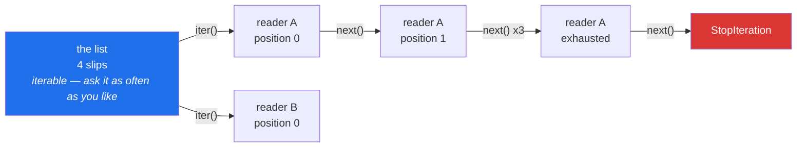

# 1.1 — Iterable and iterator: the roll and the slip

## One-line answer

An **iterable** is something you can ask for a fresh reader; an **iterator** is that reader, holding
the place it has reached — and almost every confusing bug in this area comes from treating one as the
other.

---

## The story

There is a small deli near the station with a paper roll by the door. You tear off a slip, write your
order on it, and drop it in the box. The person behind the counter takes slips out of the box one at
a time and makes up the orders.

Four slips came out of the box this morning. Written out exactly as they were written:

```text
milk
  Milk
eggs
Eggs.
```

Two things about that box are worth noticing, because the whole day is built on them.

The first: the person at the counter never puts a slip back. They take one, deal with it, and it is
gone. If somebody asks "what was the second order again?", the answer is not in the box any more. The
box only ever moves forwards.

The second: the box does not know how many slips are left until it runs out. There is no number on
the side. The only way to find out is to keep reaching in until your hand comes back empty.

Now think about two different things by the door. The first is *the roll of blank slips* — you can
tear off a fresh one whenever you like, as many times as you like, and it will still be there
tomorrow. The second is *the box of today's orders* — it is used up as you work through it, and when
it is empty it stays empty.

The roll and the box are not the same kind of thing. Mixing them up is the mistake this document is
about.

---

## The idea in plain language

Python has exactly this pair, and it has a name for each.

An **iterable** is any object you can loop over. A list, a string, a dictionary, a set, a file — all
iterables. It is the roll by the door: you can go to it as often as you like and start again.

An **iterator** is the thing that walks through the items one at a time and remembers where it got
to. It is the box of orders: it has a position, that position only moves forwards, and once it is
used up it is used up.

Two functions connect them:

- `iter(something)` asks an iterable for a **fresh iterator** — tearing off a new reader.
- `next(that_iterator)` asks the iterator for **the next item** — reaching into the box.

When the box is empty, `next` does not return `None` and it does not return a special value. It
raises an exception called `StopIteration`. That sounds dramatic, but it is only the agreed signal
for "there is nothing left". The language reference puts it plainly: `__next__` must "return the next
item from the iterator", and "if there are no further items, raise the `StopIteration` exception"
(*The Python Standard Library — Iterator Types*,
<https://docs.python.org/3/library/stdtypes.html#iterator-types>).

Two words that will keep coming up. To **consume** an iterator is to take items out of it; consuming
moves the position forwards, and nothing moves it back. An iterator is **exhausted** when it has
raised `StopIteration` — the box is empty. Part [1.3](1.3-exhaustion.md) is entirely about what that
costs you.

One more detail looks strange the first time, and it turns out to be the reason everything fits
together. **An iterator is itself an iterable.** Calling `iter()` on an iterator gives you back *that
same iterator*, not a fresh one. The same page says `__iter__` on an iterator must "return the
iterator object itself", so that both containers and iterators can be used with `for`. That single
rule is why `for slip in box:` works whether `box` is a list or a reader that is already half way
through. It is also why looping a second time over a half-read reader quietly gives you nothing.

---

## Why Setu needs it

- **Day 6 said a `for` loop calls `iter()` and then `next()` repeatedly**
  ([Day 6, 1.1](../../../day-06-loops/parts/01-iteration/1.1-what-a-for-loop-actually-does.md)). That
  was the shape of the loop. This part is the pair of objects that shape is made of, and the next
  four documents have no vocabulary without it.
- **Day 9's generator expression is an iterator**
  ([Day 9, 2.3](../../../day-09-comprehensions/parts/02-dict-set-gen/2.3-the-generator-expression.md)).
  You have already used one. The reason `(x for x in rows)` can be looped exactly once is the rule in
  this document, and today is where that stops being a surprise and becomes a tool.
- **Today's own gate** asks for a reader that walks a file of titles without holding the file in
  memory ([4.2](../04-the-gate/4.2-the-streaming-reader.md)). That reader is an iterator, and its
  test has to know the difference between "give me a fresh one" and "carry on from where you were".
- **Day 27 reads CSV and Parquet in chunks**, and every chunked reader is an iterator with exactly
  these rules. Day 155's vector database hands back result batches the same way. The question "can I
  loop over this twice?" comes up in both, and the answer is decided here.

---

## The mechanism

The two objects, side by side, using this morning's four slips:

```python
"""The roll and the box: an iterable, and the iterator it hands out."""

slips = ["milk", "  Milk", "eggs", "Eggs."]

print("the list itself :", type(slips).__name__)

box = iter(slips)
print("what iter gives :", type(box).__name__)

print("first slip      :", next(box))
print("second slip     :", next(box))
print("third slip      :", next(box))
print("fourth slip     :", next(box))

second_box = iter(slips)
print("a fresh reader  :", next(second_box))
print("same object?    :", box is second_box)
```

**Line by line:**

- `slips = [...]` — the four slips, written out in full. Everything below uses these four and no
  others, so nothing here needs a second example to follow.
- `type(slips).__name__` — asks the object what type it is and prints just the name, which is `list`.
  `type(slips)` on its own would print `<class 'list'>`; `.__name__` trims it to the word that
  matters.
- `box = iter(slips)` — **this is the tearing-off.** The list is untouched. What comes back is a new,
  separate object whose only job is to remember a position in that list.
- `type(box).__name__` prints `list_iterator`, not `list`. **That different name is the point of this
  part.** The reader is a different kind of thing from the thing being read.
- Four `next(box)` calls, in order, giving `milk`, `  Milk`, `eggs`, `Eggs.`. The second slip comes
  back with its two leading spaces intact, because nothing has cleaned anything. Cleaning is what Day
  10's `title_key` is for
  ([Day 10, 3.2](../../../day-10-functions/parts/03-the-module/3.2-designing-clean-title.md)), and it
  is deliberately not happening yet.
- `second_box = iter(slips)` — going back to the roll for a **second** reader. It starts at `milk`
  again, because it is a different object with its own position.
- `box is second_box` prints `False`. `is` asks whether these are the same object, not whether they
  look alike ([Day 4, 3.2](../../../day-04-objects/parts/03-identity-trap/3.2-is-versus-equals.md)).
  Two readers over one list are two objects.

Now the rule that makes `for` work on both kinds:

```python
"""iter() on a list gives a new reader. iter() on a reader gives that same reader back."""

slips = ["milk", "  Milk", "eggs", "Eggs."]

box = iter(slips)
same = iter(box)

print("iter(list) is a new object :", iter(slips) is iter(slips))
print("iter(iterator) is itself   :", same is box)

print("take one from `same` :", next(same))
print("now ask `box`        :", next(box))
```

**Line by line:**

- `same = iter(box)` — calling `iter()` on something that is *already* an iterator. This is not a
  mistake. It is required behaviour, and it is what lets `for` accept either kind of object without
  first asking which it got.
- `iter(slips) is iter(slips)` prints `False`. Two separate calls to the roll produce two separate
  readers, which is what you would expect.
- `same is box` prints `True` — **one object under two names.** There is only one reader here, and
  `same` is an alias for it
  ([Day 4, 2.3](../../../day-04-objects/parts/02-containers/2.3-aliasing-two-names-one-object.md)).
- `next(same)` gives `milk`. Then `next(box)` gives `  Milk`, **not `milk` again.** Taking a slip
  through one name moved the position for both names, because there was only ever one position.
- If those last two lines had printed `milk` twice, `for` could not work on a half-read reader at
  all, and every function taking "something you can loop over" would have to ask which kind it had
  been handed.



---

## When it breaks

**Reaching into an empty box:**

```text
$ uv run python -c "
it = iter([1,2])
next(it); next(it)
next(it)
"
Traceback (most recent call last):
  File "<string>", line 4, in <module>
StopIteration
```

**What it means.** The reader has handed out everything it had. Notice that the traceback carries no
message at all, only the exception name. That is deliberate: `StopIteration` is a signal rather than
a complaint, and a `for` loop catches it and ends the loop quietly. You see this traceback only when
you called `next()` yourself and did not plan for the end. The smallest fix is `next(it, None)`,
which returns its second argument instead of raising when there is nothing left.

**Calling `next()` on the roll instead of on a reader:**

```text
$ uv run python -c "
next([1,2])
"
Traceback (most recent call last):
  File "<string>", line 2, in <module>
TypeError: 'list' object is not an iterator
```

**What it means.** This is the confusion in this document, stated by Python in six words. A list is
an iterable — you may loop over it — but it holds no position, so there is no "next" for it to give.
The fix is `next(iter([1, 2]))`: tear off a reader first, then ask that.

**Looping over something that cannot produce a reader at all:**

```text
$ uv run python -c "
for x in 5: pass
"
Traceback (most recent call last):
  File "<string>", line 2, in <module>
TypeError: 'int' object is not iterable
```

**What it means.** `for` asked `5` for a reader and `5` had no way to make one. Read the wording
carefully. **"not iterable"** is a different error from **"not an iterator"** above, and the two are
easy to skim past as the same sentence. "Not iterable" means it cannot even give you a reader. "Not
an iterator" means it is not itself a reader. Which of the two you got tells you which end of the
pair you got wrong.

---

## In production

**The professional habit is to name the pair correctly in your own signatures, because the name is a
promise about how many times the caller may loop.** A parameter annotated `rows: list[str]` says "I
may walk this twice". A parameter annotated `rows: Iterable[str]` says "I will walk it once, and I do
not care where it came from". A parameter annotated `rows: Iterator[str]` says "hand me a reader that
is already in progress, and I will consume it". Day 19 gives these their formal names in `typing`.
The distinction itself is decided here, and the annotation only records it.

**The failure that appears only with real data is the function that loops twice.** A helper that
validates its input and then processes it — `if not any(rows): return []`, followed by
`for row in rows:` — passes every test, because every test hands it a list. The first time production
hands it a file reader or a database cursor, the validation consumes the whole thing and the
processing loop sees nothing. There is no error. The function returns an empty result and reports
success, which is worse than crashing.

**What changes at scale is that a list stops being an option.** At four slips it does not matter
which of the two you are holding. At a hundred million rows the list is the difference between a job
that runs and a job the operating system kills, so every stage is handed a reader rather than a
container. Once that is true, "can I loop over this twice?" is a real design question at every
boundary, and the answer has to be written down rather than guessed.

**The review comment a senior engineer leaves.** On a function that takes `Iterable` and loops over
it in two places: *"This walks `rows` twice. It is fine today because every caller passes a list, but
the signature promises it will accept a generator, and with a generator the second loop sees nothing
and returns an empty result silently. Either materialise once at the top with `rows = list(rows)` and
say so in the docstring, or narrow the annotation to `Sequence` so the type checker stops the
caller."*

**The interview question.** *"What is the difference between an iterable and an iterator?"* The
definition on its own is not the answer that lands. This is: an iterable can produce a fresh iterator
on demand; an iterator holds a position and is consumed as you read it; and `iter()` on an iterator
returns the same object rather than a new one, which is exactly why a `for` loop works on both and
exactly why looping twice over a generator gives you the items and then nothing. If you can add that
this is the bug behind "it works in tests and returns empty in production", you are describing
something you have debugged.

---

## Check yourself

```bash
uv run python -c "
slips = ['milk', '  Milk', 'eggs', 'Eggs.']
box = iter(slips)
print(type(slips).__name__, '->', type(box).__name__)
print(next(box), '|', next(box))
print('iter on an iterator returns itself:', iter(box) is box)
print('the list is untouched:', slips)
"
```

The list still holds all four slips at the end, even though two have been read. Say which object the
reading actually changed.

**Answer out loud, without scrolling up:**

> Give the two words for the pair, and say which one holds a position. Then explain why `iter()` on
> an iterator returns the same object instead of a fresh one, and name one bug that rule causes.

---

**Next:** [1.2 — writing `__iter__` and `__next__` by hand](1.2-writing-next-by-hand.md), where you
build the box yourself rather than borrowing Python's, because Principle 2 asks for the mechanism
before the convenience.
