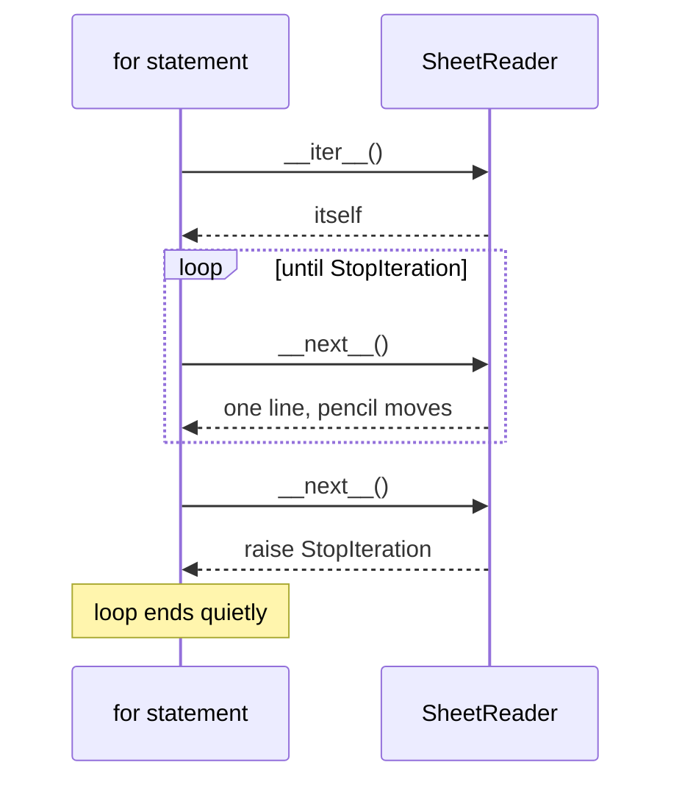

# 1.2 — Building the reader by hand: a closure, then the protocol

## One-line answer

A reader is nothing but a remembered position plus a rule for "give me the next one and move on", and
you can build one from a plain function before you ever use Python's protocol — which is what makes
the protocol readable rather than magical.

---

## The story

The deli has a second counter at the back, and the person working it does not use the box. They use a
photocopied sheet with today's four orders printed on it, and a pencil.

```text
milk
  Milk
eggs
Eggs.
```

They keep the pencil resting on the line they are up to. Take an order, do it, move the pencil down
one. If somebody interrupts and asks a question, the pencil has not moved, so they carry on from
exactly where they were. When the pencil goes past the last line, they say "that's everything" and
put the sheet down.

That is the whole apparatus: **a sheet, a pencil, and a habit.** The sheet is the data, the pencil is
the position, and the habit is "read the line under the pencil, then move the pencil".

The box from [1.1](1.1-iterable-and-iterator.md) is not more sophisticated than this. It is this,
with the pencil hidden inside.

---

## The idea in plain language

Principle 2 of this plan says: build it from scratch before you use the library version. So before
using Python's reader, build one.

A reader needs exactly two things:

1. **Somewhere to keep the position.** This is the pencil. It has to survive between calls, or every
   call would start at the top again.
2. **A rule for what to do when there is nothing left.** This is "that's everything". In Python the
   rule is: raise `StopIteration`.

You already have a way to keep a value alive between calls to a function without using a global. A
**closure** is a function that remembers the variables of the function that built it
([Day 10, 2.4](../../../day-10-functions/parts/02-scope/2.4-closures-and-late-binding.md)). The
builder function holds the pencil; the function it hands back reads and moves it.

That gives a working reader with no new syntax at all. It has one shortcoming, and the shortcoming
is the point of the second half of this document: **a `for` loop cannot use it.** A `for` loop does
not look for a function you can call. It looks for two specific methods on an object.

Those two methods are the **iterator protocol**:

- `__iter__` — "give me a reader". On an object that *is* a reader, this returns the object itself,
  for the reason [1.1](1.1-iterable-and-iterator.md) gave.
- `__next__` — "give me the next item, and move on. If there is nothing left, raise `StopIteration`."

A **method** is a function that belongs to an object and receives that object as its first argument.
A **class** is the blank form that says which methods every object of that kind has. Both of those
are the subject of Day 12, which builds them from the beginning; here you need only the smallest
possible example of each, and every line of it is walked through below.

The double underscores at each end are how Python spells "this method is here for the language to
call, not for you to call". Nobody writes `box.__next__()` in ordinary code. They write `next(box)`,
and `next` calls `__next__` for them. The wrapper exists so that the *language* owns the spelling and
your code reads the same whichever object it is holding.

---

## Why Setu needs it

- **Because [2.1](../02-generators/2.1-yield-the-function-that-pauses.md) is about to make all of
  this disappear.** A generator writes both methods for you and keeps the pencil automatically. That
  is only impressive — and only debuggable — if you have seen what it replaced.
- **Because Day 155's vector store and Day 162's retriever both hand back cursors**, and reading a
  library's cursor class is reading exactly this pair of methods with more code around them.
- **Because Day 12 builds the `Paper` object**, and the first two methods you will ever write on a
  class of your own are `__init__` and `__repr__`. Meeting a method here, in a five-line class with
  one job, makes that day a smaller step.
- **Because Principle 2 is not decoration.** The plan says a chunker by hand before
  `RecursiveCharacterTextSplitter`, cosine similarity by hand before Chroma. This is the same rule
  applied to the smallest protocol in the language.

---

## The mechanism

First, the pencil-and-sheet version with no new syntax — a closure:

```python
"""A reader built out of a closure. The pencil lives in `position`."""


def make_reader(sheet):
    """Return a function that hands back one line of `sheet` per call."""
    position = 0

    def read_next():
        nonlocal position
        if position >= len(sheet):
            raise StopIteration
        line = sheet[position]
        position += 1
        return line

    return read_next


slips = ["milk", "  Milk", "eggs", "Eggs."]
read = make_reader(slips)

print(read())
print(read())
print(read())
print(read())
```

**Line by line:**

- `position = 0` — the pencil, resting on the first line. It lives in `make_reader`, not in
  `read_next`, which is what makes it survive between calls.
- `nonlocal position` — without this, `position += 1` would make `position` a *local* name inside
  `read_next` and the read on the same line would raise `UnboundLocalError`
  ([Day 10, 2.2](../../../day-10-functions/parts/02-scope/2.2-unboundlocalerror.md)). `nonlocal` says
  "the `position` I mean is the one in the enclosing function, and I intend to write to it".
- `if position >= len(sheet)` — the end check comes **first**, before any reading. Checking after
  reading would mean indexing past the end, and the error you would get is `IndexError`, which tells
  the caller nothing about iteration.
- `raise StopIteration` — the agreed signal from [1.1](1.1-iterable-and-iterator.md), raised by hand.
  There is nothing special about raising it yourself; it is an ordinary exception.
- `line = sheet[position]` then `position += 1` then `return line` — **in that order.** Moving the
  pencil before taking the line would skip the first item, which is the single most common mistake in
  a hand-written reader.
- `read = make_reader(slips)` — this call runs the builder once and hands back the inner function
  with its own private `position`. Calling `make_reader(slips)` again would produce a second reader
  with a second pencil, which is the "fresh reader" behaviour of a list.
- The four `print(read())` lines give `milk`, `  Milk`, `eggs`, `Eggs.` — the same four, in order,
  with the spacing untouched.

This works, and a `for` loop cannot touch it. `for line in read:` fails, because `read` is a function
and a function is not iterable. To be loopable, the reader has to be an *object with the two methods*.
Here is the smallest one:

```python
"""The same reader, written as the two methods a for loop looks for."""


class SheetReader:
    """Hands back one line of `sheet` per call to next(), then stops."""

    def __init__(self, sheet):
        self.sheet = sheet
        self.position = 0

    def __iter__(self):
        return self

    def __next__(self):
        if self.position >= len(self.sheet):
            raise StopIteration
        line = self.sheet[self.position]
        self.position += 1
        return line


slips = ["milk", "  Milk", "eggs", "Eggs."]

for line in SheetReader(slips):
    print(repr(line))

reader = SheetReader(slips)
print("next() works too:", repr(next(reader)))
```

**Line by line:**

- `class SheetReader:` — the blank form. It says what every reader of this kind has and can do. Day 12
  is entirely about this line; today it is a container for two methods.
- `def __init__(self, sheet):` — the set-up step, run once when you write `SheetReader(slips)`. `self`
  is the object being set up, and it is an ordinary first parameter with a conventional name, not a
  keyword.
- `self.sheet = sheet` and `self.position = 0` — the sheet and the pencil, stored **on the object**
  instead of in a closure. This is the only real difference from the version above: the state has
  moved from a captured variable to a named attribute you can print and inspect.
- `def __iter__(self): return self` — "you asked me for a reader; I am one". This is the rule from
  [1.1](1.1-iterable-and-iterator.md) written out as code, and without it `for` raises `TypeError`
  even though `__next__` is present.
- `def __next__(self):` — the same three steps as `read_next` above: check the end, take the line,
  move the pencil, return. Compare the two side by side; they differ only in where the position is
  kept.
- `for line in SheetReader(slips):` — `for` calls `__iter__` once to get the reader, then `__next__`
  repeatedly, and stops quietly when `StopIteration` arrives. That is the whole of
  [Day 6, 1.1](../../../day-06-loops/parts/01-iteration/1.1-what-a-for-loop-actually-does.md), now
  running against a class you wrote.
- `print(repr(line))` rather than `print(line)` — `repr` shows the quotes and the leading spaces, so
  `'  Milk'` is visibly different from `'milk'`
  ([Day 7, 3.3](../../../day-07-strings/parts/03-formatting/3.3-repr-and-the-debugging-f-string.md)).
  Printing the bare string would hide the spacing, which is exactly the detail that matters here.
- `next(reader)` — the built-in wrapper calling your `__next__`. **You never write `reader.__next__()`
  yourself**; the wrapper is the public spelling and the dunder is the hook.



---

## When it breaks

**The two methods, one missing:**

```text
$ uv run python -c "
class Half:
    def __next__(self):
        raise StopIteration
for x in Half(): pass
"
Traceback (most recent call last):
  File "<string>", line 5, in <module>
TypeError: 'Half' object is not iterable
```

**What it means.** `__next__` alone is not enough. `for` asks for `__iter__` first and gives up
before it ever looks for `__next__`. The error is the same "not iterable" message from
[1.1](1.1-iterable-and-iterator.md), and it is misleading here, because the object plainly knows how
to produce items — it just never said so. The fix is three characters plus a line:
`def __iter__(self): return self`.

**Returning something other than `self` from `__iter__`:**

```text
$ uv run python -c "
class Wrong:
    def __iter__(self):
        return [1, 2]
    def __next__(self):
        raise StopIteration
for x in Wrong(): pass
"
Traceback (most recent call last):
  File "<string>", line 7, in <module>
TypeError: iter() returned non-iterator of type 'list'
```

**What it means.** `__iter__` must hand back a reader, and a list is not a reader — it has no
`__next__`. This is the "not an iterator" half of the pair, in the exact phrasing Python uses when
your own class breaks the contract. Read it as: *you promised me a reader and gave me a container.*

**The pencil moved before the line was taken:**

```text
>>> class OffByOne:
...     def __init__(self, sheet):
...         self.sheet, self.position = sheet, 0
...     def __iter__(self):
...         return self
...     def __next__(self):
...         self.position += 1
...         if self.position >= len(self.sheet):
...             raise StopIteration
...         return self.sheet[self.position]
...
>>> list(OffByOne(["milk", "  Milk", "eggs", "Eggs."]))
['  Milk', 'eggs', 'Eggs.']
```

**What it means.** No error at all, and the first slip has vanished. The pencil moved before anything
was read, so position `0` was never handed out. Three lines came back and they are all real orders, so
nothing looks wrong. This is the worst kind of failure: silent, plausible, and visible only to
somebody who knew there were four.
It is why the order of the three lines in `__next__` is called out above, and why the test for any
hand-written reader asserts the **whole** list, never just its first element.

---

## In production

**You will almost never write this class in real code, and that is the point of having written it
once.** Every real reader you meet is either a generator ([2.1](../02-generators/2.1-yield-the-function-that-pauses.md))
or a library's own class, and both are this pair of methods with more code around them. When a
database driver's cursor behaves strangely — it works in a `for` loop but not in `list()`, or it
yields nothing the second time — you now debug it by asking which of the two methods it has and what
its position is doing, rather than treating it as a black box.

**The professional version keeps the reader and the container separate.** A class that is both — one
that has `__next__` on the collection itself — can only be looped once ever, because there is one
position shared by every caller. The usual shape is a container whose `__iter__` returns a *new*
small reader object each time, which is precisely how a list behaves. If you write your own container
type on Day 12 or later and give it `__next__` directly, you have built something that silently
breaks the second time anyone loops it.

**What changes under concurrency.** A hand-written reader with a mutable position is not safe to
share between threads: two threads calling `__next__` at the same time can read the same position
before either increments it, so one item is handed out twice and one is skipped. Nothing raises. The
standard answer is not a lock inside `__next__` — it is to give each worker its own reader, which
costs nothing and removes the shared state entirely. Day 19's concurrency work returns to this.

**The review comment a senior engineer leaves.** On a hand-written iterator class in a pull request:
*"This is a generator with extra steps. Three lines of `def read(sheet): for line in sheet: yield line`
give you `__iter__`, `__next__`, the position and the `StopIteration` for free, and there is no
off-by-one to get wrong. Keep the class only if you genuinely need to expose the position as an
attribute — and if you do, say in the docstring that it is single-use."*

**The interview question.** *"What does a `for` loop actually require of the object you give it?"*
The answer that lands names both methods, says that `__iter__` on a reader returns `self`, and says
that the end is signalled by an exception rather than a return value — then adds why: a sentinel
return value like `None` could not be distinguished from a real item, and every caller would have to
agree on which value meant "finished". If you can say that you have written the pair by hand and got
the order of the three lines in `__next__` wrong at least once, that is better than a clean recital.

---

## Check yourself

```bash
uv run python -c "
class SheetReader:
    def __init__(self, sheet):
        self.sheet, self.position = sheet, 0
    def __iter__(self):
        return self
    def __next__(self):
        if self.position >= len(self.sheet):
            raise StopIteration
        line = self.sheet[self.position]
        self.position += 1
        return line

r = SheetReader(['milk', '  Milk', 'eggs', 'Eggs.'])
print(list(r))
print('position now:', r.position)
print('second list():', list(r))
"
```

The second `list(r)` prints `[]`. Say which line of `__next__` is responsible, and what the printed
`position` tells you about why.

**Answer out loud, without scrolling up:**

> Name the two methods a `for` loop needs, and say what each one must return. Then explain why the
> end of a reader is signalled by an exception rather than by returning `None`.

---

**Next:** [1.3 — exhaustion, and the second loop that saw nothing](1.3-exhaustion.md), which is the
bug the last line of the check above just reproduced.
