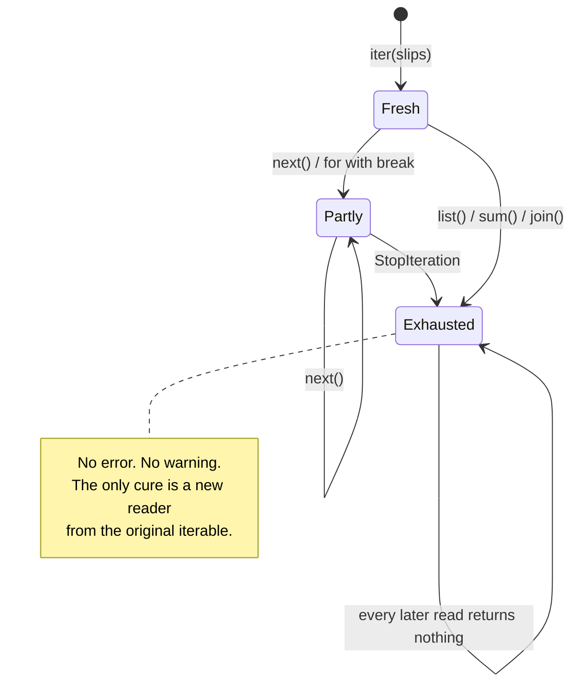

# 1.3 — Exhaustion, and the second loop that saw nothing

## One-line answer

A reader is used up by reading it, and every later question you ask it — how many were there, show me
the first one, let me check them again — gets the honest answer "nothing", with no error and no
warning.

---

## The story

At the end of the morning the person at the deli counter has worked through the box. Four slips came
out, four orders went out, the box is empty.

Then the owner comes over and asks: *"How many did we do?"*

They look in the box. It is empty. Not "empty because there were none" — empty because they are
finished. The box cannot tell the difference between those two things, and neither can anyone looking
at it now.

The four slips were:

```text
milk
  Milk
eggs
Eggs.
```

Nobody wrote the number down, because nobody thought to. The information was there the whole morning
and it went out of the door one slip at a time.

This is not a mistake anyone made. It is what a box of slips *is*. The mistake, when it comes, is
asking the empty box a question and believing the answer.

---

## The idea in plain language

An iterator is **single-use**. Once it has raised `StopIteration`, it is **exhausted**, and the
standard library is explicit that this is permanent: "once an iterator's `__next__()` method raises
`StopIteration`, it must continue to do so on subsequent calls. Implementations that do not obey this
property are deemed broken" (*The Python Standard Library — Iterator Types*,
<https://docs.python.org/3/library/stdtypes.html#iterator-types>).

That sentence has a consequence people meet before they meet the sentence. Anything that walks an
iterator to the end **consumes** it, and a great many innocent-looking operations do exactly that:

- `list(reader)` — walks to the end and builds a list. The reader is now empty.
- `sum(reader)`, `max(reader)`, `min(reader)` — walk to the end.
- `len(...)` — does **not** work at all, because a reader does not know how many are left. There is
  no number on the side of the box.
- `sorted(reader)` — walks to the end and returns a list.
- `"\n".join(reader)` — walks to the end.
- `any(reader)` and `all(reader)` — walk until they can decide, which is sometimes the end and
  sometimes not. [3.4](../03-lambda-and-map/3.4-reduce-any-and-all.md) is about that difference.
- A `for` loop that `break`s — walks *part* of the way, and leaves the reader parked wherever it
  stopped.

The failure that follows is always the same shape. Some code reads the iterator once — perhaps only
to check something — and later code reads it again and finds nothing. Nothing raises. The second
reader is not wrong; there really is nothing left.

The word for the fix is **materialise**: turn the reader into a container that holds every item, so
it can be read as often as you like. `rows = list(rows)` is the whole technique. It costs memory,
which is exactly the cost that [2.2](../02-generators/2.2-a-list-against-a-generator.md) measures,
and it is why you never do it automatically — you do it deliberately, at a place you can name.

A list is not exhaustible, and it is worth being clear about why: a list is an *iterable*, not an
iterator ([1.1](1.1-iterable-and-iterator.md)). Looping a list produces a fresh reader each time and
the list itself never moves.

---

## Why Setu needs it

- **This is the bug in Day 9's generator expression**
  ([Day 9, 2.3](../../../day-09-comprehensions/parts/02-dict-set-gen/2.3-the-generator-expression.md)).
  That part told you a generator expression can be looped once. This part is why, and it is also why
  the fix is a deliberate `list(...)` rather than "just use a comprehension instead".
- **Today's streaming reader has to be tested**
  ([4.2](../04-the-gate/4.2-the-streaming-reader.md)), and a test that asserts twice against the same
  reader passes the first assertion and fails the second with a message that blames the wrong line.
  Knowing this is what makes that test readable.
- **Day 29 measures pandas iteration** and Day 31's `groupby` hands back an object that is walked
  once. The habit of asking "is this a container or a reader?" before writing a second loop starts
  here.
- **Day 185's LangGraph streaming** yields events as they happen. There is no second pass over a
  stream of events that has already gone by, so anything you want from it must be collected on the
  way through. That is this document's rule with a much higher price for getting it wrong.

---

## The mechanism

The whole failure, in nine lines:

```python
"""The reader is read twice. The second read finds nothing, and nothing complains."""

slips = ["milk", "  Milk", "eggs", "Eggs."]
box = iter(slips)

print("how many? :", len(list(box)))
print("what were they? :", list(box))
print("still nothing?  :", list(box))

print("the list is fine:", slips)
```

**Line by line:**

- `box = iter(slips)` — one reader, made once. Every line below shares it.
- `len(list(box))` — the count. **This line is the whole bug**, because getting the count required
  walking the reader to the end, and walking it to the end used it up. It prints `4`, correctly, and
  destroys the thing it counted.
- `list(box)` on the next line prints `[]`. Not `None`, not an error — an empty list, which is a
  perfectly ordinary value that the next twenty lines of a program will happily process.
- The third `list(box)` prints `[]` again, which is the "must continue to do so" rule from the
  standard library quoted above. An exhausted reader stays exhausted; it does not reset and it does
  not raise.
- `print("the list is fine:", slips)` — the original list still holds all four. **The data was never
  the problem.** Only the reader was consumed, which is exactly why the fix is to keep a container
  around rather than to be careful with the reader.

Now the two ways to survive it. First, materialise once, deliberately:

```python
"""Fix one: turn the reader into a container, at a line you can point at."""

slips = ["milk", "  Milk", "eggs", "Eggs."]
box = iter(slips)

orders = list(box)

print("how many?       :", len(orders))
print("what were they? :", orders)
print("again           :", orders)
```

**Line by line:**

- `orders = list(box)` — the materialise step, on its own line with a name. The reader is consumed
  here and nowhere else, and every later line asks `orders` rather than `box`.
- `len(orders)` prints `4` and takes nothing away, because a list knows its own length. Compare with
  the first block: the same question, asked of the right object.
- The two prints of `orders` give the same four slips twice. A list is an iterable, so each `print`
  gets a fresh reader.
- The cost of this line is the whole file in memory. At four slips that is nothing; at a hundred
  million rows it is the difference between running and being killed, which is the measurement in
  [2.2](../02-generators/2.2-a-list-against-a-generator.md).

Second, collect what you need in a single pass:

```python
"""Fix two: one walk, and everything you wanted taken on the way past."""

slips = ["milk", "  Milk", "eggs", "Eggs."]
box = iter(slips)

count = 0
seen = set()
for slip in box:
    count += 1
    seen.add(slip.strip().casefold())

print("how many?    :", count)
print("distinct     :", sorted(seen))
```

**Line by line:**

- `count = 0` and `seen = set()` — the two answers, prepared before the walk. Anything you want from
  a stream has to exist before the stream starts, because there is no going back.
- `for slip in box:` — **one** loop over the reader, and the only one. This is the shape every
  stream-processing job in the plan ends up in.
- `count += 1` — counting by hand, because `len` does not work on a reader and `sum(1 for _ in box)`
  would have been a second walk.
- `slip.strip().casefold()` — the two cleaning steps from Day 7
  ([Day 7, 2.1](../../../day-07-strings/parts/02-methods/2.1-normalising-strip-and-case.md)).
  `casefold` rather than `lower` for the reason that part gives.
- `seen` is a set, so `'milk'` and `'  Milk'` collapse to one entry
  ([Day 8, 2.1](../../../day-08-containers/parts/02-sets-and-dicts/2.1-a-set-is-a-hash-table.md)).
  The printed result is `['eggs', 'eggs.', 'milk']` — three, not two, because `Eggs.` still has its
  full stop and nothing has removed it. **That is a real result of a real cleaning gap**, and it is
  what `clean_title` from Day 10 exists to close.
- `sorted(seen)` — a set has no order, so printing it directly would give an order that can change
  between runs. Sorting makes the line reproducible, which Principle 4 asks of every output you
  compare.



---

## When it breaks

**The count that ate the data:**

```text
>>> box = iter(["milk", "  Milk", "eggs", "Eggs."])
>>> len(list(box))
4
>>> list(box)
[]
```

**What it means.** Both lines are correct and the pair is a bug. The first walked the reader to get a
number; the second found the consequence. In a real program these two lines are usually forty lines
apart and in different functions, which is what makes it hard to see. The fix is to materialise once,
above both.

**Asking a reader how long it is:**

```text
$ uv run python -c "
g = (x for x in range(3))
print(len(g))
"
Traceback (most recent call last):
  File "<string>", line 3, in <module>
TypeError: object of type 'generator' has no len()
```

**What it means.** There is no number on the side of the box. A reader cannot answer "how many" any
more than the person at the counter could, because knowing would require reading to the end — and
reading to the end would use it up. `len()` refuses rather than doing that behind your back, which is
the right choice. If you want the count, you have chosen to spend the reader; say so with
`sum(1 for _ in g)` or materialise first.

**Asking a reader for its third item:**

```text
$ uv run python -c "
g = (x for x in range(3))
print(g[0])
"
Traceback (most recent call last):
  File "<string>", line 3, in <module>
TypeError: 'generator' object is not subscriptable
```

**What it means.** "Subscriptable" means "you can put square brackets after it". A reader has no
random access, only "next", so `[0]` has no meaning even for the item it is about to give you. The
standard-library answer is `itertools.islice(g, 0, 1)`, and the honest answer is usually that you
wanted a list.

**The unit test that passes and then fails on the line below:**

```text
$ uv run python -m pytest tests/test_reader.py -v
tests/test_reader.py::test_reader_yields_every_slip FAILED

E       AssertionError: assert 0 == 4
E        +  where 0 = len([])
```

**What it means.** The test asserted the contents, then asserted the length, against the same reader.
The first assertion consumed it, and the second saw nothing. The failure message blames the length
check, which is the line that is correct. Read a `0 == 4` in a test over an iterator as "something
above me already drank this", and look up, not at the failing line.

---

## In production

**The professional habit is to decide once, at the boundary, whether a thing is a stream or a
collection — and to write that decision into the name.** `rows` is ambiguous. `row_stream` and
`row_list` are not. Teams that do this stop having the "who consumed it?" conversation, because the
name at every call site says which kind of object is being passed. The annotation says it too, and
Day 19 gives it the vocabulary, but the name is what a reader of the code sees first.

**The failure mode that only appears with real data is the logging line.** Somebody adds
`logger.debug("processing %d rows", len(list(rows)))` while debugging, and it works: in development
`rows` is a list. In production `rows` is a cursor, the debug line consumes it, and the job processes
zero rows and reports success. Worse, the line only runs when debug logging is switched on, so the
bug appears exactly when somebody is investigating a different problem. Any argument to a log call
that walks an iterator is a defect regardless of the log level.

**What changes at scale is that materialising stops being available as a rescue.** At four slips
`list(rows)` is free. At a hundred million rows it is the thing you built the stream to avoid, so the
fix for double consumption cannot be "just make a list". It has to be either a single pass that
collects everything needed at once — the third block above — or `itertools.tee`, which keeps a buffer
of everything one branch has read and the other has not, and quietly costs as much memory as the gap
between them. `tee` is not a free second pass; it is a bet that the two consumers stay close
together.

**The review comment a senior engineer leaves.** On a function that takes `Iterable[str]` and checks
it before processing: *"Line 12 does `if not any(rows)` and line 15 does `for row in rows`. With a
list this is fine; with a generator, line 12 eats at least one row and possibly all of them, and line
15 processes what is left. Either take `Sequence[str]` and say you need a collection, or drop the
guard and handle the empty case after the loop."*

**The interview question.** *"You have a generator and you need both the count and the items. What do
you do?"* The answer that lands says: you cannot have both from one reader without either
materialising it or counting as you go, so you choose based on whether the data fits in memory — a
`list()` if it does, a running counter inside the single processing loop if it does not — and you
never call `len(list(...))` on something you will read again. Adding that `itertools.tee` exists,
and that its cost is the buffer between the two branches, shows you know why "just tee it" is not a
free answer.

---

## Check yourself

```bash
uv run python -c "
slips = ['milk', '  Milk', 'eggs', 'Eggs.']
box = iter(slips)
print('count :', len(list(box)))
print('items :', list(box))
print('---')
orders = list(iter(slips))
print('count :', len(orders))
print('items :', orders)
"
```

The first pair prints `4` and then `[]`. The second pair prints `4` and then all four slips. Say
which single word changed between them.

**Answer out loud, without scrolling up:**

> Name three built-in functions that quietly exhaust an iterator. Then say why `len()` refuses to work
> on one at all, and why that refusal is better than the alternative.

---

**Next:** [1.4 — `iter()` with a sentinel, and reading until a marker](1.4-iter-with-a-sentinel.md),
the second form of `iter` that turns a plain function into a reader.
