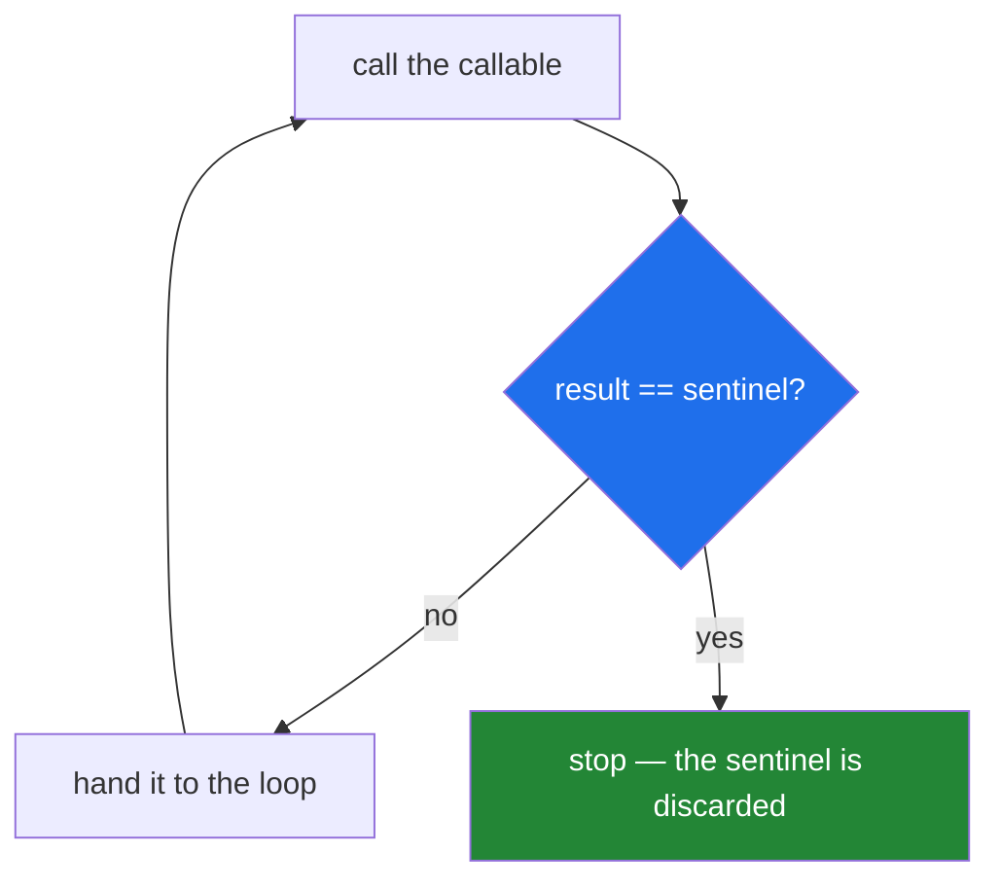

# 1.4 — `iter()` with a sentinel: reading until a marker

## One-line answer

`iter(callable, marker)` turns any function you can call with no arguments into a reader that keeps
calling it until it returns the marker value, which is how you loop over something that only knows
how to give you "the next one" and has no idea it is being looped.

---

## The story

The last slip in the deli's box is not an order. It is a torn scrap of card the owner drops in at
closing time with one word on it: **CLOSED**.

That card is not a slip to be made up. It is the signal that the box has finished for the day. The
person at the counter does not need to know how many slips there were or look at the box from the
outside. They keep taking slips until they get the card, and then they stop.

So today the box held:

```text
milk
  Milk
eggs
Eggs.
CLOSED
```

Four orders and a marker. Notice that the marker is not one of the orders and it is not returned to
anybody — it never leaves the box in any useful sense. It exists only to end the loop.

This is a genuinely different arrangement from the one in [1.1](1.1-iterable-and-iterator.md). There,
the box knew it was empty. Here, nothing is empty at all; something keeps handing you values, and one
of the values means "that was the last one".

---

## The idea in plain language

A **sentinel** is a value chosen to mean "stop", which cannot be confused with real data. The card
says `CLOSED`, and no customer would ever order `CLOSED`, so there is no ambiguity.

Python's `iter` has a second form built for exactly this arrangement. You have seen the one-argument
form, `iter(iterable)`. The two-argument form is `iter(callable, sentinel)`, and it means:

> Call `callable()` over and over. Hand back each result. When a result is equal to `sentinel`, stop —
> and do **not** hand the sentinel back.

The word **callable** here means "something you can put brackets after": a function, a method, or any
object that can be called. It must take **no arguments**, because `iter` has nothing to pass it.

This form exists because an enormous number of real interfaces are shaped like the deli's box rather
than like a list. They have a "give me the next one" operation and a special return value for "there
are no more", and they have no `__iter__` and no `__next__`:

- `file.readline()` returns `''` at the end of a file.
- A database cursor's `fetchone()` returns `None` when the rows run out.
- `socket.recv(1024)` returns `b''` when the other side closes.
- `input()` returns whatever the person typed, and you may want to stop on a particular word.

Without the sentinel form, each of those needs a `while True:` with a read, a comparison and a
`break` — four lines, and one of the four is easy to get wrong. With it, each is one line, and the
result is a proper reader that works with `for`, with `zip`, and with everything else that takes an
iterable.

The two-argument form is also the first place in this plan where a **lambda** earns its keep, because
the callable must take no arguments and the thing you actually want to call usually takes one. That
is [3.1](../03-lambda-and-map/3.1-lambda-a-function-with-no-name.md)'s subject; the shape
`lambda: f.read(4096)` appears below and is walked through where it appears.

---

## Why Setu needs it

- **Day 16 is files and buffering**, and the fixed-size-block read below — `iter(lambda: f.read(size), b"")`
  — is the standard way to walk a file too large to hold, in blocks rather than lines. That day builds
  on this line rather than introducing it.
- **Day 42 and Day 47 talk to Postgres through `psycopg`**, whose cursors expose `fetchone()` and
  return `None` at the end. `iter(cur.fetchone, None)` is how you loop a result set without pulling
  it all into memory, which matters the moment a query returns more rows than the free tier's RAM.
- **Day 3's rate budget** (Principle 5) is spent one request at a time, and a paged API that returns
  an empty page at the end is the same shape: call, check, stop. Recognising the shape is what stops
  you writing the four-line `while True` again.
- **It is the honest answer to "why does `iter` take two arguments?"**, which is the kind of detail
  that separates someone who has read the standard library from someone who has read a tutorial.

---

## The mechanism

The deli's box, as a function that hands back one slip per call:

```python
"""A callable that gives one slip per call, and a marker that means 'closed'."""

box = ["milk", "  Milk", "eggs", "Eggs.", "CLOSED"]
position = 0


def take_one():
    """Hand back the next slip. Returns 'CLOSED' forever once the card is reached."""
    global position
    if position >= len(box):
        return "CLOSED"
    slip = box[position]
    position += 1
    return slip


for slip in iter(take_one, "CLOSED"):
    print(repr(slip))
```

**Line by line:**

- `box = [...]` — the four slips and the card, in one list. The card is data here, exactly as it is a
  physical card at the counter.
- `global position` — the pencil is a module-level name this time, which
  [Day 10, 2.3](../../../day-10-functions/parts/02-scope/2.3-global-and-nonlocal.md) told you to
  avoid. It is used here **because the interfaces this form exists for behave this way**: a file
  object and a database cursor both hold their position somewhere you do not control. The point of
  the block is that `iter` does not care where the state lives.
- `return "CLOSED"` when past the end — the callable keeps working after the marker. That matters:
  `iter` stops at the first match, but a callable that raised instead would turn a clean stop into a
  traceback.
- `for slip in iter(take_one, "CLOSED"):` — **`take_one` with no brackets.** You are handing `iter`
  the function itself, not the result of calling it
  ([Day 10, 1.1](../../../day-10-functions/parts/01-the-signature/1.1-a-function-is-a-promise.md)).
  Writing `iter(take_one(), "CLOSED")` calls it once and hands `iter` the string `"milk"`, which is
  not callable and raises.
- The loop prints four slips. **`CLOSED` is never printed**, because the sentinel is compared and
  discarded, not yielded. That asymmetry is the single most useful thing to remember about this form.

The same shape against a real file, which is what you will actually write:

```python
"""Walking a file in fixed-size blocks, which is what iter(callable, sentinel) is for."""

from pathlib import Path

path = Path("data/slips.txt")
path.parent.mkdir(parents=True, exist_ok=True)
path.write_text("milk\n  Milk\neggs\nEggs.\n", encoding="utf-8")

with path.open("rb") as handle:
    for block in iter(lambda: handle.read(8), b""):
        print(block)
```

**Line by line:**

- `path.parent.mkdir(parents=True, exist_ok=True)` — makes `data/` if it is missing and says nothing
  if it is already there. Without `exist_ok=True` a second run raises `FileExistsError`.
- `encoding="utf-8"` typed out — never the platform default
  ([Day 7, 1.1](../../../day-07-strings/parts/01-text/1.1-a-string-is-code-points.md)), and an
  instance of Principle 4's rule about never accepting a default you did not choose.
- `path.open("rb")` — **binary** mode, so `read` returns `bytes` rather than `str`. Blocks of bytes
  are what you want when the file is too large to hold, because a fixed byte count is a fixed amount
  of memory whatever the text looks like.
- `lambda: handle.read(8)` — a function of no arguments that reads the next eight bytes. `iter`
  requires a zero-argument callable and `handle.read` needs its size, so something has to carry the
  `8`. That is the whole job of this lambda, and it is the case where a lambda is clearly right
  ([3.3](../03-lambda-and-map/3.3-where-a-lambda-hurts.md) is about the cases where it is not).
- `b""` — the sentinel, and it is **bytes** because `read` in binary mode returns bytes. A plain `""`
  here would never equal what `read` returns, so the loop would never end; that failure is below.
- `with path.open(...)` — the file closes when the block ends, even if something raises inside it.
  Day 16 builds this properly; today it is the correct habit rather than an explained one.
- The output is `b'milk\n  M'`, `b'ilk\neggs'`, `b'\nEggs.\n'` — eight bytes, eight bytes, then six.
  **The blocks cut straight through the middle of a line**, which is the honest cost of reading by
  size instead of by line, and the reason [2.3](../02-generators/2.3-streaming-a-file.md) reads lines
  instead when lines are what you want.



---

## When it breaks

**Passing something that is not callable:**

```text
$ uv run python -c "
for x in iter([1,2], None): pass
"
Traceback (most recent call last):
  File "<string>", line 2, in <module>
TypeError: iter(v, w): v must be callable
```

**What it means.** With two arguments, `iter` wants a function, not a container. The message uses
`v` and `w` for the two arguments, which is unhelpful until you know that `v` is the first one. The
usual cause is calling the function by mistake — `iter(take_one(), ...)` instead of
`iter(take_one, ...)` — so check for a stray pair of brackets before anything else.

**A sentinel that can never match:**

There is no traceback for this one, and that is what makes it dangerous. `iter(lambda: handle.read(8), "")`
on a file opened in binary mode compares `bytes` against `str`. They are never equal, so the read
keeps returning `b""` at the end of the file and the loop never stops. **The program hangs, using no
CPU and producing nothing**, which reads like a network stall rather than a type mismatch. The fix is
one character: `b""`. The habit that prevents it is to print one value from the callable before
wiring up the loop, and read its type.

**Forgetting the lambda, and getting one enormous block:**

```text
>>> import io
>>> handle = io.StringIO("milk
  Milk
eggs
Eggs.
")
>>> blocks = list(iter(handle.read, ""))
>>> len(blocks)
1
>>> blocks
['milk
  Milk
eggs
Eggs.
']
```

**What it means.** `handle.read` with no size argument reads **the whole file** on its first call, so
the loop runs exactly twice: once for everything, once for the `""` that ends it. There is no error,
the output is correct-looking, and the memory saving the block read was written to achieve is gone
entirely. This is the bug the lambda exists to prevent, and it is invisible on a small file — which
is why the check for it is `len(blocks) > 1` on a file bigger than one block, not an eyeball.

**A callable that needs an argument:**

```text
$ uv run python -c "
def take(n): return n
print(list(iter(take, 0)))
"
Traceback (most recent call last):
  File "<string>", line 3, in <module>
TypeError: take() missing 1 required positional argument: 'n'
```

**What it means.** `iter` calls the callable with nothing at all, so any function that requires an
argument fails on the first call. The traceback names your function rather than `iter`, which is
helpful once you know to read it that way. The fix is to supply the argument at wiring time with a
lambda or `functools.partial` — `iter(lambda: take(8), 0)` — which is the same move as the block read
above.

---

## In production

**The professional use of this form is almost always one of three lines**, and they are worth knowing
by sight: `iter(cursor.fetchone, None)` for a database result set, `iter(lambda: f.read(65536), b"")`
for a file walked in blocks, and `iter(queue.get, SHUTDOWN)` for a worker thread that stops when it
receives a shutdown marker. Each replaces a `while True` with a `break` in it, and the `for` version
cannot forget the break.

**The sentinel has to be chosen so that it cannot appear in the data, and this is a real design
decision rather than a formality.** `None` is safe for a database cursor because a row is never
`None`. `b""` is safe for a file because a read of zero bytes only happens at the end. A string
sentinel like `"CLOSED"` is safe in the story and unsafe in life: the day somebody's order genuinely
is the word `CLOSED`, the loop ends early and the rest of the data is silently dropped. Where the
data is uncontrolled, teams use a purpose-made object — `SHUTDOWN = object()` — which cannot equal
anything else because nothing else is that object
([Day 4, 3.2](../../../day-04-objects/parts/03-identity-trap/3.2-is-versus-equals.md)).

**What changes at scale is the block size.** Reading a file eight bytes at a time, as above, is a
teaching size. In production the number is chosen to match how the operating system moves data — 64
KiB is a common default — because each `read` costs a system call, and a hundred million eight-byte
reads spend all their time on the calls rather than on the data. The shape of the loop does not
change; only the constant does, and that constant belongs in a named module-level value rather than
buried in a lambda.

**The review comment a senior engineer leaves.** On a `while True:` loop with a read and a break:
*"This is `iter(lambda: f.read(BLOCK), b'')`. Same behaviour, one line, and the loop cannot be left by
accident when somebody adds a `continue` above the break. Also pull `8` out into a module constant —
it is far too small, and it needs a name before anybody can argue with it."*

**The interview question.** *"Why does `iter` take an optional second argument?"* The answer that
lands is that a great many interfaces expose "give me the next one" plus a special end value rather
than the iterator protocol, and the two-argument form adapts them without a `while True` — then names
one, usually `cursor.fetchone` or a blocked file read. If you can add that the sentinel is compared
and never yielded, and that choosing a sentinel that could occur in real data is a genuine bug, you
have used it rather than read about it.

---

## Check yourself

```bash
uv run python -c "
box = ['milk', '  Milk', 'eggs', 'Eggs.', 'CLOSED']
pos = 0
def take_one():
    global pos
    if pos >= len(box):
        return 'CLOSED'
    slip = box[pos]
    pos += 1
    return slip

print(list(iter(take_one, 'CLOSED')))
print('length:', len(list(iter(take_one, 'CLOSED'))))
"
```

The first line prints four slips, not five. The second prints `0`. Say why the second line is `0`
rather than `4`, and which earlier part of this section explains it.

**Answer out loud, without scrolling up:**

> Say what the two arguments to the two-argument `iter` must be, and whether the sentinel is handed to
> the loop. Then name one real interface shaped this way, and say what goes wrong if the sentinel is a
> value that could occur in the data.

---

**Next:** [2.1 — `yield`, the function that pauses](../02-generators/2.1-yield-the-function-that-pauses.md).
Everything in section 1 was done by hand; section 2 is the one keyword that does all of it for you.
